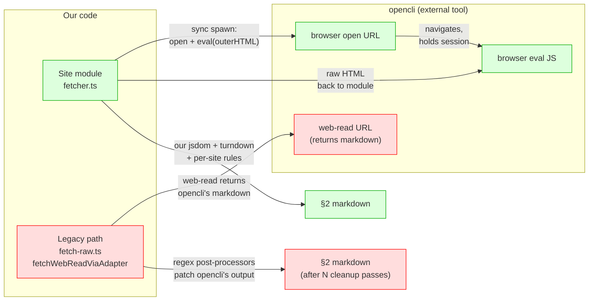
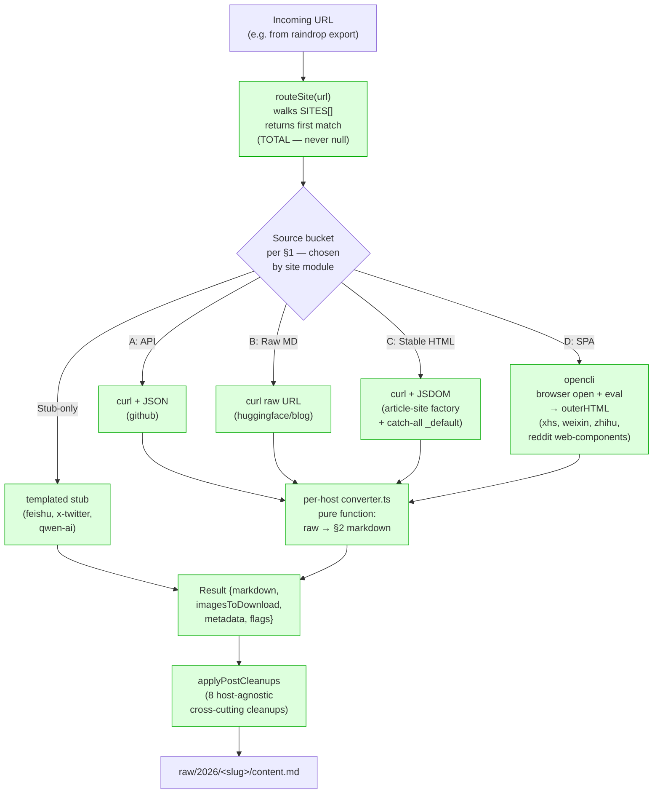
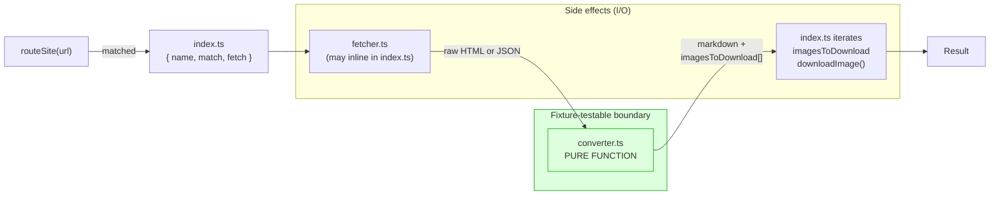
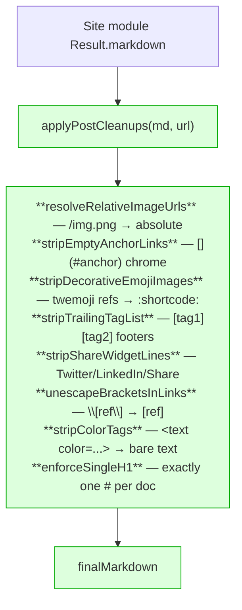

# Fetcher architecture: site modules, opencli, and what "legacy" means

> **Audience.** Operators of `tools/fetch-raw.ts` and contributors writing new site modules under `tools/sites/<host>/`. Read CLAUDE.md §5a–e first; this doc is the architectural overview those sections refer to.

> **TL;DR.** The "legacy" path is *not* opencli. The legacy path is taking opencli's lossy markdown output (`web-read`) and patching it downstream with regex post-processors. opencli's *browser session* (`browser open` + `browser eval`) is a load-bearing piece of the modern architecture — multiple migrated site modules use it. We separated the two because conflating them is what produced years of un-fixable cleanup-recipe bugs.

---

## 1. The four data sources we actually use

Every URL we fetch falls into one of four buckets. The bucket determines which fetcher the site module reaches for, and which post-processing primitives apply.

| # | Source | When to use it | Examples |
|---|---|---|---|
| **A** | **REST / GraphQL API** | Host exposes structured JSON for the content we want | `github.com` (issue/PR/discussion/release APIs) |
| **B** | **Raw markdown mirror** | Host's content originates as markdown in a public repo / CDN | `huggingface.co/blog/*` → `raw.githubusercontent.com/huggingface/blog`; `github.com/<o>/<r>/blob/` → `raw.githubusercontent.com` |
| **C** | **Server-rendered HTML with stable selectors** | Plain `curl` returns the body inside a known container | `aleksagordic.com` (`.prose`); `lmsys.org` (`.blog-post-content`); `qwenlm.github.io` (`.post-content`); `arxiv.org/abs/` (`<blockquote class="abstract">`); `substack.*` (`.available-content`) |
| **D** | **Client-rendered SPA** | Plain curl returns a JS shell with no body content; needs a real browser to hydrate the DOM | `xiaohongshu.com` / `xhslink.com`, `mp.weixin.qq.com`, `zhuanlan.zhihu.com`, `qwen.ai` |

A and B are pure data — no chrome, nothing to clean. The site module fetches the source, optionally maps API JSON into our §2 markdown contract, and returns.

C is the article-shape majority. The site module is a `curl` + JSDOM extraction with a per-host body selector and chrome-stripping list. The `_shared/article-site-factory.ts` collapses this case to a 15-line config.

D is where "browser-eval" enters. Plain curl can't see the content — only a headless browser running the page's JavaScript can. **This is where opencli's browser session is genuinely needed and not a legacy crutch.**

---

## 2. What opencli is

opencli is an external CLI tool we install separately (it has its own auth flow, persistent browser sessions, login state for sites like xhs / weixin / zhihu). We use it for **two distinct things** that are easy to conflate:

**Green path (modern, target):** site module spawns `opencli browser open <url>` to navigate (using opencli's session/login state), then `opencli browser eval '<JS>'` to extract the `outerHTML` of the right container. Our code converts that HTML to markdown using `jsdom` + `turndown` + per-site rules we control. **opencli handed us structured DOM; we own the conversion.**

**Red path (legacy):** `tools/fetch-raw.ts:fetchWebReadViaAdapter` calls `opencli web-read <url>` — opencli's *own* DOM-to-markdown converter runs inside opencli, and we get back markdown that's already been munged. We then apply N regex post-processors (`tools/sites/_shared/post-cleanup.ts`) to undo the worst of opencli's lossy choices. **opencli decided the markdown shape; we patch.**

The two paths use the same external tool but differ in *who owns the HTML→Markdown conversion*. That ownership question is the architectural axis the redesign turns on.

---

## 3. Why "patch opencli's markdown" is the legacy path

The recipe failures CLAUDE.md §3–4 cataloged trace back to the same shape: opencli's `web-read` flattens DOM features that have no markdown equivalent or that turndown-via-opencli mishandles, and there's no way to recover the lost structure from the markdown after the fact.

| Defect class | What opencli `web-read` produced | Why post-processors couldn't fully fix it |
|---|---|---|
| **Mermaid diagrams flattened** | DeepWiki diagrams emerged as orphan `Cluster GPU Resources\n[actor_num_gpus : actor+critic_num_gpus]` text paragraphs outside any `\`\`\`mermaid` fence | The mermaid source is gone — only the rendered SVG node-labels remain. We had to write a side-channel extractor (`extractDeepwikiMermaidSources`) that pulls source from `<script>` hydration JSON or `data-original-text`, then *splice* it back into the markdown. A regex pass over the markdown alone can't recover deleted information. |
| **WeChat code blocks merged to one line** | Multi-line code split via ` ` tags inside `<pre>` collapsed to a single `Node.textContent` blob | turndown saw `<pre><code>line1 line2 line3</code></pre>` and emitted `\`\`\`\nline1line2line3\n\`\`\``. The newlines are gone after this point. We rewrote the WeChat path as a Layer-4 own-converter that walks the DOM with ` ` awareness *before* turndown sees it. |
| **xhs body never present** | xhs renders body via JS after token validation; opencli `web-read` returned the auth-wall shell | No regex over the shell can recover the body. We migrated xhs to a Layer-4 own-converter (`extractXhsFullContent`) that runs `browser open + eval` ourselves and pulls `#detail-desc` outerHTML directly. |
| **GitHub PR activity events leaking through** | opencli emitted timeline events as bullet lists alongside human comments | Activity-event regex in `githubStripUIChrome` had to handle 4 prefix shapes (avatar-stripped, avatar-kept, plain, indented) because the input shape varied with which earlier post-processors had run. Order of cleanup steps became load-bearing. We migrated GitHub to a REST API path that produces a clean structured input. |
| **Adjacent `<strong>` siblings double-emit** | `<strong>A</strong><strong>B</strong>` → `**A****B**` (4 asterisks) | `\*{4,}` collapse is mostly safe, but inside fences it's wrong. Fence-awareness is a small foothold — but the deeper problem is the same: turndown ran upstream of us and made a choice we now have to recognize and undo. |

The pattern: **information loss runs downhill**. By the time we receive markdown, we can't ask "is this an `` that should be `:emoji:`, or text content that happens to contain `:emoji:`?" We can only pattern-match the *symptom* and hope our regex isn't a false positive on real content.

The site-module pattern keeps the conversion ours end-to-end. When a defect appears, the fix is in the site's `converter.ts` (a pure function over the DOM), not as the 14th post-processor in a global pipeline whose ordering matters.

---

## 4. The dispatch flow

**Routing is total.** `routeSite()` returns the catch-all `tools/sites/_default/` for any URL no host-specific module claimed. There is no legacy fallback path; the historical `case "web-read":` branch in `fetch-raw.ts` and `applyPostProcessors`'s host-scoped processors have all been retired.

After every site module returns a `Result`, `applyPostCleanups()` runs 8 host-agnostic markdown cleanups (relative-URL resolution, single-H1 enforcement, color-tag stripping, etc. — see `tools/sites/_shared/post-cleanup.ts`) and writes the final markdown.

**Critical:** site modules using browser-eval (xhs, weixin, zhihu) **are on the green path**. They are not legacy. The defining question is who owns the HTML→Markdown conversion, not which subprocess fetched the bytes.

---

## 5. Anatomy of a site module

Each `tools/sites/<host>/` is self-contained. The module owns the FULL pipeline from URL to `Result`.

**The converter is a pure function.** This is the single most important architectural rule. It takes raw HTML (or JSON) + URL + metadata and returns `{ markdown, imagesToDownload, stats }`. No `fetch`, no `spawnSync`, no filesystem — just data in, data out.

Why: the converter is what the byte-equal fixture tests freeze (`tools/__tests__/fixtures/converters/<site>/<name>.input.json` → `<name>.expected.md`). If the converter touches the network, fixtures aren't reproducible. If the converter writes images to disk, the fixture can't run in a fresh checkout without side effects. Image *download* belongs in `index.ts` (the orchestrator); image *URL extraction and filename allocation* belongs in `converter.ts`.

The fetcher and the image downloader are the I/O boundary. They may use `spawnSync("opencli", ...)`, `curl`, `fetch`, whatever — none of that is fixture-relevant because the fetcher's output is the converter's frozen input.

This split is what makes the architecture *testable*: a 99% byte-equal converter test catches converter regressions deterministically, without a network call. A snapshot test (re-running the full pipeline against a real URL) catches fetcher regressions when run periodically.

---

## 6. Adding a new host module

The migration is **complete** — every URL now flows through a site module under `tools/sites/<host>/`. Adding a new dedicated module is a refinement of the catch-all (`_default`) when one of these triggers:

- The catch-all's permissive selectors return < 200 chars (typical SPA shell) — promote to a browser-eval module like xhs / weixin / zhihu.
- The host has a cleaner source-of-truth (REST API / raw mirror / hydration JSON / DOM attrs / linked downloads) — write a module that uses it.
- The catch-all's chrome dropSelectors leak host-specific footer / nav / share widgets — add a per-host module with tighter selectors.
- The bookmark count is high enough that the per-host config pays back its cost (see `tools/sites/MIGRATION.md` §0).

The recipe is in `tools/sites/MIGRATION.md`. Most new hosts are 15-line factory configs.

---

## 7. The post-cleanup pipeline

After every site module returns its `Result.markdown`, a single host-agnostic cleanup pass runs via `applyPostCleanups()` in `tools/sites/_shared/post-cleanup.ts`. The pipeline contains 8 cross-cutting processors:

These are universal, idempotent, host-agnostic — they run unconditionally on every URL's output. There are no host-scoped post-processors anymore; host-specific cleanup happens inside each site module's converter at the DOM level (where defects can be fixed at their source rather than patched in markdown afterwards).

The implementations live in `tools/sites/_shared/post-cleanup.ts` (a small file containing only the 8 transforms + 2 helpers); `applyPostCleanups()` composes them into the public pipeline.

---

## 8. Putting it together: the universal pattern restated

For any URL, the question to ask when adding a new module is:

> Where does the cleanest source of this content live?

In order of preference:

1. **Structured API or raw markdown** (buckets A, B above) — use it directly. opencli does not enter the picture.
2. **Server-rendered HTML with a stable selector** (bucket C) — `curl` it, run our own JSDOM + turndown. Use the article-site factory for blog-shape pages; write a custom converter for richer shapes (catalog tables, gallery cards, mermaid-heavy wikis).
3. **SPA / auth-gated dynamic content** (bucket D) — use `opencli browser open + eval` to get the rendered DOM, then run our own converter on the `outerHTML`.
4. **No useful content** — emit an `intentional-stub` deterministically from the URL alone (see `feishu`, `x-twitter`, `qwen-ai` for examples).

The architecture's promise: **defects in a site's output have a single clear owner — the site's own converter** (or, for buckets A/B, the API/mirror itself, which is upstream of us). Cross-cutting regex pipelines patching opaque opencli output are no longer how this codebase works.

---

## See also

- [`CLAUDE.md`](../CLAUDE.md) §5a (universal pattern), §5e (direction-finding for new hosts), §6b (test architecture).
- [`tools/sites/MIGRATION.md`](../tools/sites/MIGRATION.md) — step-by-step recipe for migrating a new host.
- [`tools/sites/_shared/article-site-factory.ts`](../tools/sites/_shared/article-site-factory.ts) — the 15-line per-host factory for bucket C.
- [`tools/sites/_shared/article-converter.ts`](../tools/sites/_shared/article-converter.ts) — the shared converter the factory drives.
- [`tools/sites/_shared/types.ts`](../tools/sites/_shared/types.ts) — the `Site` contract every module exports.
- [`tools/sites/_shared/post-cleanup.ts`](../tools/sites/_shared/post-cleanup.ts) — `applyPostCleanups()` and the 8 cross-cutting cleanups.
- [`tools/sites/_default/`](../tools/sites/_default/) — the catch-all module that fields any URL no host-specific module claimed.
- Reference modules to read end-to-end before writing your first one:
  - `tools/sites/aleksagordic/` — simplest factory user (15-line config)
  - `tools/sites/huggingface/` — bucket B (raw markdown mirror)
  - `tools/sites/github/` — bucket A (REST API)
  - `tools/sites/xhs/` — bucket D (browser-eval SPA)
  - `tools/sites/deepwiki-com/` — bucket C with mermaid splice + table splice (the recipe-heavy end of the spectrum)
  - `tools/sites/feishu/`, `tools/sites/x-twitter/`, `tools/sites/qwen-ai/` — stub-only modules for auth-gated or SPA-shell hosts
