# 理想同学MindGPT 3.0发布：基于结构化思维链的深度思考模型

> 公众号: AI理想同学
> 发布时间: 2025年4月17日 18:06
> 原文链接: https://mp.weixin.qq.com/s/E1v2UpKjEYEEwZPr0A6bEg

---
今天，理想同学基座模型MindGPT 3.0正式发布，模型能力全面升级，长思维链推理能力取得突破，性能对标DeepSeek-V3-0324(短思维链)及DeepSeek-R1(长思维链)，基于监督微调和强化学习结合的思维链增强技术，具备深度推理、高质量反思、持续探索等推理能力，模型在复杂问题解决、多模态理解及推理、工具使用等方面的能力显著增强。

基于MindGPT 3.0，理想同学正式上线深度思考能力，在理想同学手机App及网页版均可免费使用。

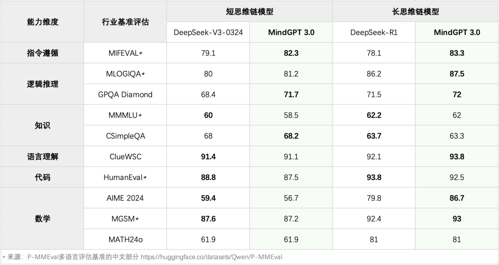

MindGPT 3.0  在多个基准上的评测结果

**模型能力**

**1、算法方案**

基于MindGPT 3.0千亿级参数的预训练模型，本次通过监督微调(SFT)和强化学习(RL)结合的后训练算法，实现了模型推理能力的升级。

我们建设了高效的后训练数据生产体系。通过外部收集、线上回流和指令演化(Instuction Evolve)等方式获取复杂困难prompt，设计了一套面向实践的标签体系，覆盖领域、任务、指令和难度等维度，以实现精细的数据配比，构建了一套标准的准出服务，与强化学习中使用的奖励模型深度融合，支持数据的拒绝采样(Reject Sampling)和RL训练。

我们将模型的训练分为三个阶段：

1） 长推理模仿学习：通过人工构造的长思维链数据使模型具备按照特定格式进行长思维链思考的能力；

2） 自我探索：在数学、代码和科学问答等任务上通过自研的强化学习算法ASPO(Adaptive Sampling Policy Optimization)提升模型能力的上限；

3） 对齐人类价值观：稳定模型能力的同时，对齐人类价值观。

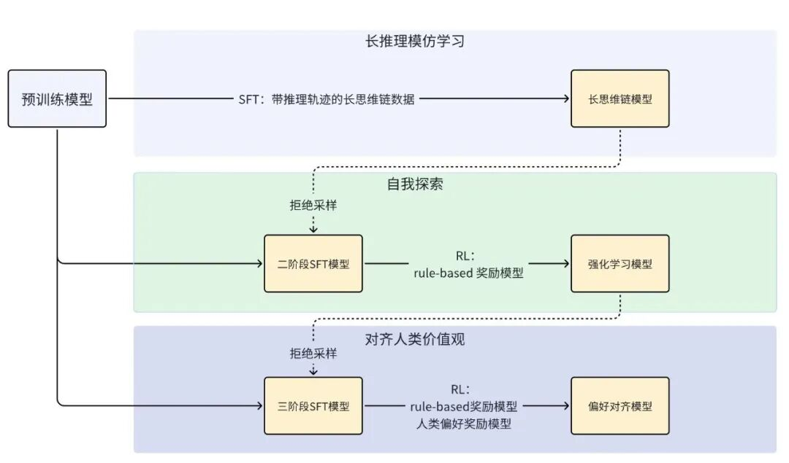

MindGPT 3.0  训练管线

在第二阶段-自我探索，我们提出了一种全新的强化学习算法-自适应采样策略优化(ASPO，Adaptive Sampling Policy Optimization）来推动MindGPT 3.0的强化学习，主要包括如下方法：

**·** **自适应训练数据舒适度：**不同参数规模、不同后训练阶段的模型，对难度的理解不同。我们采用模型推理10次，做对3次的数据作为起始训练数据，并在RL训练过程中同步选择与当前状态匹配的舒适数据；

**·** **自适应采样策略：**随着RL的训练过渡到平稳期，模型会对训练数据倾向于做全对或者全错，我们使用ASPO算法，在采样过程中将全对样本标记移除训练池，其余样本持续将采样准确率为20%-80%的数据进行梯度更新；

**·** **自适应的窗口长度：**较短的窗口能加速训练，较长的窗口能让模型有足够的探索空间，为了在计算效率和准确性之间找到最佳平衡，我们使用自适应窗口长度，根据最近训练步骤中获得奖励的样本生成长度设置窗口长度。

在第三阶段-对齐人类价值观，主要推进MindGPT 3.0与人类认知对齐，包括：基于上一阶段模型蒸馏数据进行的SFT训练步骤，和融合了基于规则的奖励模型以及基于人类偏好的奖励模型（preference reward model）的RL训练步骤：

**·** SFT训练主要是为了增加思维链可读性，且加速整个训练过程，加入自我探索阶段的高质量数据训练，此阶段的长思维链模型快速对齐到自我探索的约1000个Steps的模型性能；

**·** RL训练使用课程学习的思想，逐步从模型舒适区数据（推理10次能推理成功3次）过渡到更高难度的数学问题、更严苛的代码环境约束，同时加入更多非推理数据，实现通用、价值观和安全等偏好的对齐；

此外，我们观察到通过逻辑推理任务激发的深度思考模式在实际应用中可能会对上下文问题进行强行关联，或对用户输入、工具调用结果中的噪音强行赋予意义，以至于陷入过度思考或思考瘫痪的状态中，为了解决这类问题，我们通过“引导式思考->内化训练”的方式将模型的思维模式在非逻辑推理场景上进行了调整和适应。

**2、结构化思维链**

现有的深度推理模型的思维链存在可读性差、过度冗余思考等问题，我们通过实验发现，基于prompt工程的方法几乎无法对思维链进行精确控制或干预来缓解这些问题。

为了解决这个问题，我们在MindGPT 3.0实现了基于Markdown形式的结构化思维链能力，提出了一种对原始思维链数据的改造算法，从思维链字数、格式、呈现模式等维度出发，通过构造对思维链的约束条件以及约束条件下的思维链训练数据，融入到后训练过程中，实现了对思维链内容和形式的控制。

基于Markdown形式的结构化思维链，MindGPT 3.0的思维过程更加清晰，在理想内部组织的GSB评估实验中，相较于业内普遍使用的推理模型思维链呈现形式，MindGPT 3.0的思维过程会给用户带来更清晰、更凝练、更可信的体验。

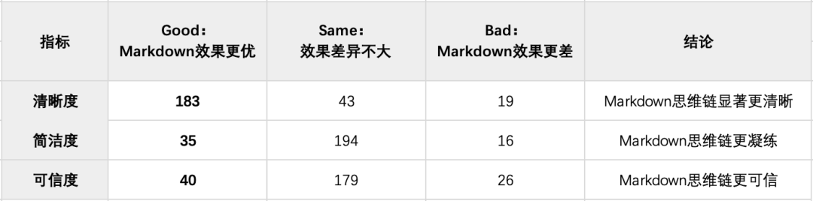

 Markdown形式结构化思维链GSB评估结果

**3、高质量反思**

**· RAG(检索增强生成)反思重搜**

RAG场景下，如搜索到的内容不相关或不全面，大模型仅能基于现有搜索结果进行分析、总结、整理后给出最终回复，对回复质量有较大影响。基于MindGPT 3.0的反思能力，对这类问题进行了针对性优化，可以根据用户问题和检索结果自动判断是否需要补充新的搜索，实现模型的反思-重搜效果。这一动态多次搜索的策略，既保证了模型对于简单问题的单次搜索快速响应，又通过多次搜索提升了模型对复杂问题的回复效果。

此外，我们使用MindGPT 3.0长思维链的反思能力优化模型短思维链效果，重点优化时序规划、对比、预测类等场景的回复效果。

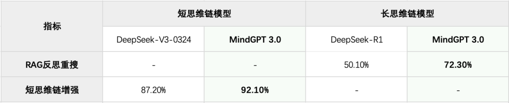

RAG(检索增强生成)反思重搜实验结果

**·** **感知容错**

不同于文本对话的大模型，理想同学支持语音、文本、视觉的多模态输入，用户在实际使用场景中会出现输入错误，如语音识别错误等。针对此场景，MindGPT 3.0增强抗噪能力，针对错误输入进行纠错，模型鲁棒性及回复正确率大幅提升。

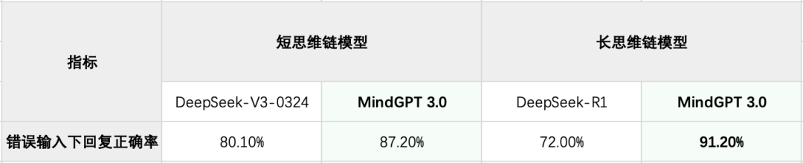

感知容错实验结果

**· 无关历史对话过滤**

我们实验发现，在理想同学较为高频的多轮对话场景下，多款开源的深度思考模型存在强行关联用户上文无关输入的问题，导致最终回复包含不相关的信息，进而带来回复正确率的下降。MindGPT 3.0能够对历史对话进行反思，自主过滤与当前用户问题无关的信息，有效保证了回复的正确率。

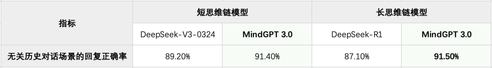

无关历史对话过滤的实验结果

**·** **主动发问**

我们实验发现，大模型面对意图不明问题时会直接选择回复，不具备主动发问澄清问题的能力。为更好帮助用户解决实际问题，借助MindGPT 3.0的反思能力，当用户的意图不明或需要更多信息补充才能回答时，会进行反思，对歧义点和不明问题进行主动发问。这样，大模型不再只是语言的生成器，而是具备“思考—反问—再思考”的类人思维链，这一机制模拟了人类在信息不确定时主动求证的认知过程。

比如，当用户问“帮我写一个AI产业报告”时，智能体会主动发问以下问题：

为确保报告的准确性和针对性，请提供以下信息：

1）AI产业报告的具体主题或问题是什么？

2）报告的目标读者或使用者是谁？

3）报告需要包含哪些关键内容或数据？

当用户给出明确的主题和范围后，我们的模型会基于新的问题进行任务规划，从而给出更符合用户预期的结果。在主动澄清问题测试集上，MindGPT 3.0的主动发问召回率达到87.5%。

**4、任务规划**

面对复杂任务的场景，基于Mind GPT 3.0的长思维链推理能力，通过对用户问题的分析，产生完整的规划推理轨迹，进而生成任务需要执行的动作序列，显著提升了理想同学的复杂任务规划能力。推理轨迹包含以下内容：

**·** 环境感知：对外部环境，比如时间、空间信息进行感知；

**·** 记忆协同：结合长期记忆和短期记忆，进行任务规划；

**·** 意图理解：基于上下文和当前的用户请求，准确理解用户意图；

**·** 任务分解：对于复杂任务，进行子任务拆解；

**·** 反思回溯：对规划的任务以及环境反馈进行反思，形成新的任务规划；

我们构建了一套针对任务规划的长思维链生产流程，融合了大模型蒸馏、拒绝采样等方法，长思维链推理轨迹数据的准确率达到98.65%。在MindGPT 3.0强化学习过程中，重点围绕任务规划的结果作为奖励信号进行强化训练。在复杂问题以及多轮问答场景上，任务规划能力得到显著提升。

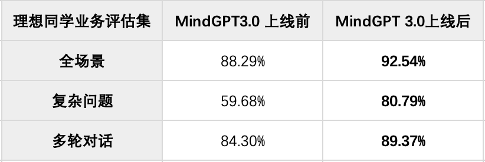

任务规划在有无深度思考前后对比结果

**5、安全对齐**

我们致力于建设符合通用价值观、中国普适价值观、理想同学自身价值观的MindGPT，为此设计了完备的大模型安全对齐体系，根据MindGPT风险浓度差异，深度融合系统级防御能力和大模型安全对齐能力，使得MindGPT 3.0在满足通用能力显著提升的同时，保持价值观回复能力安全、可控。

**·** **MindGuard：**在输入阶段识别用户输入的风险意图，MindGPT 3.0基于Mind Guard信号生成符合价值观导向的回复内容，在输出阶段，Mind Guard对极端风险进行识别和拦截；

**·** **风险领域完备性：**开发价值观攻击模型对MindGPT 3.0进行自动化、持续性攻击，自动化攻击帮助我们完善安全体系的已知风险领域。对于未知风险领域，安全对齐团队与公司安全团队redteam合作，持续收集各种新增、长尾的风险数据，同时线上日志挖掘也是安全体系新风险扩充的重要一环；

**·** **安全对齐：**PTST、价值观CoT SFT等方法有效降低安全对齐所需的数量，显著提升价值观思考过程有效性和最终回复的无害性，MindGPT 3.0 在具备强大的安全推理和思考能力的同时，降低对通用指标的负向影响；

**·****价值观安全奖励模型：**基于自有安全体系的安全回复准则构建rule based和model based价值观奖励模型，应用于MindGPT 3.0预训练、后训练、安全自动化评估等全生命周期，显著提升了安全对齐的效率和效果。

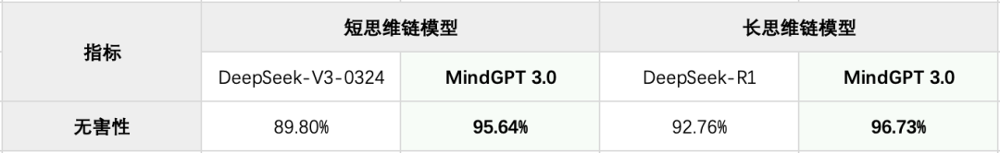

大模型无害性对比结果

**工具****能力**

**1、搜索工具**

基于MindGPT 3.0，理想同学RAG能力显著强化，其中，RAG调用的联网搜索能力也全面升级，针对多来源信息冲突矛盾、内容丰富度不足等常见问题，我们上线了更细粒度的原子化知识层级（Claim-level）的重排序，以及基于知识推理的扩展搜索技术，大幅提升内容真实性和完整性。理想同学不仅能够获知更实时的热点事件，还能更准确理解专业术语，问答效果显著提升12%。

**·** **RAG搜索重排技术创新**

传统搜索技术，以网页搜索为例，一般采用NDCG@k、Precision@k、MAP等评估指标，侧重在粗粒度文档层级衡量效果，无法反映出多文档在细粒度知识层面上的内容重复、遗漏、冲突及错误问题。RAG场景下，搜索结果整体输入大模型，对文档偏序关系不敏感，更需确保在观点层面知识的正确性与完整性。

针对这一本质性差异，我们提出Claim-level Rerank技术，通过将多条搜索结果，细化为原子化知识单元Claim的集合，并定义Claim F1值作为RAG搜索的核心评估指标，即关注全部搜索结果中正确Claims的召回率和精确率。我们验证了Claim F1值与大模型RAG问答效果的相关系数达到0.212，较传统搜索的Precision@k指标的相关系数提升2.6倍。

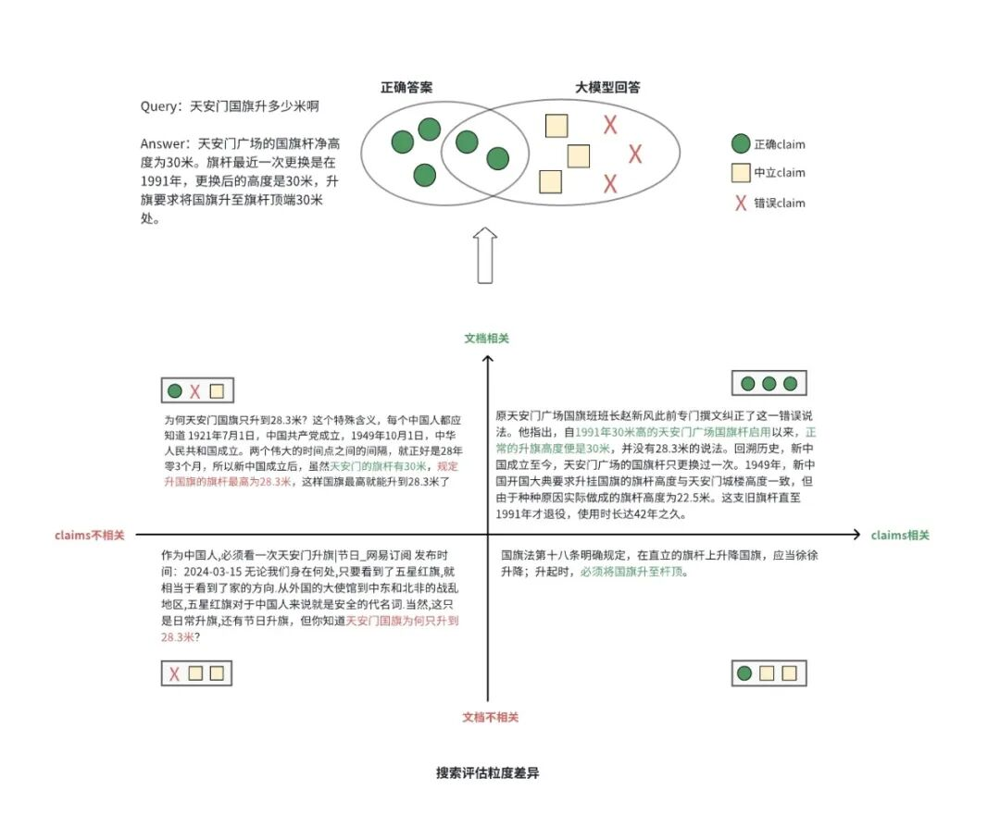

 搜索评估粒度差异

同时，我们通过List-aware模型优化最佳Claims组合的文档列表用于大模型生成回复，我们验证当Claim F1值提升16.4%时，大模型生成结果的真实性、相关性分别提升了4.5%和8.1%。

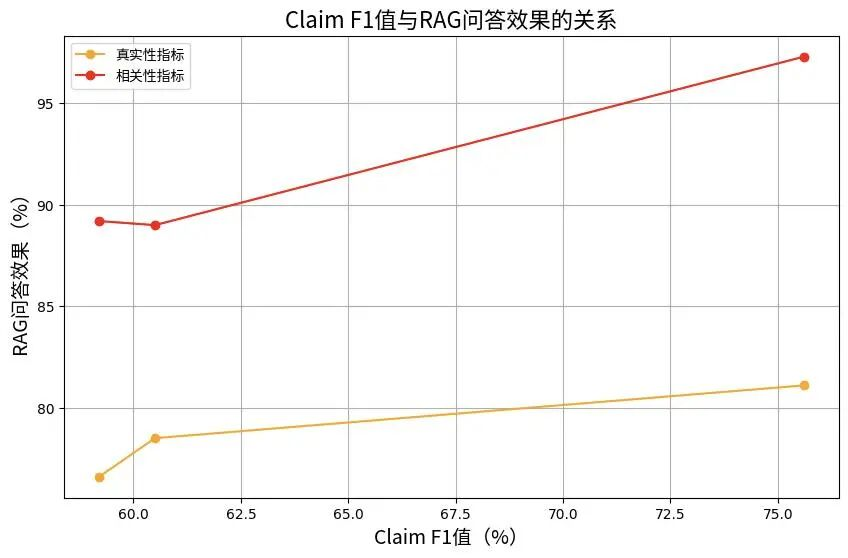

Claim F1值与RAG问答效果的关系

**·** **知识推理的Query理解技术**

面对时效性强、知识密集型或者语义模糊的用户查询时，传统搜索工具，通常面临三大技术瓶颈和挑战：

\- 知识滞后性：大模型依赖静态训练数据，难以应对新兴名词、专业领域术语、突发实时热点事件；

\- 语义鸿沟：用户查询存在拼写错误、概念混淆时，传统模型缺乏验证纠错机制；

\- 扩展同质化：基于语义的朴素扩展方法易产生重复或无意义结果，搜索结果未增加有效信息；

为解决以上问题，我们融合知识图谱增强和MindGPT3.0的强大思维链推理能力，实现动态Query理解框架，具备多角度、差异化的改写扩展搜索能力，分钟级覆盖热点事件，搜索结果丰富度提升35%，专业术语识别准确率提升47%，复杂Query无需用户澄清，首次搜索满足率提升28%。

**2、外部工具**

借助Mind GPT 3.0的工具使用和代码生成能力，理想同学全面升级了实时知识获取能力以及时间日期推理能力。

**·** **工具使用和代码生成**

\- 我们超越业界流行的Function Calling技术，实现了一套基于代码生成的工具调用技术。我们将外部工具调用转化为代码格式（CodeAct风格），通过MindGPT 3.0生成代码后在代码解释器中执行，实现对外部工具的调用以及结果的推理计算；

\- 我们实现了代码生成的RAG技术。我们将超过10,000条的业务逻辑编写成代码，构建了代码格式的业务逻辑知识库。通过检索代码知识库，进一步提升了Mind GPT生成代码的质量；同时通过复用知识库的重合代码，降低了输出代码长度，从而提供了更低的响应延迟。以日历查询工具为例，相较于上一版本，MindGPT 3.0回复正确率提升4.7%，输出token数量降低73%。

**·** **联网获取实时的外部知识**

\- 我们超越业界基于网页搜索的联网能力，通过更加泛化的工具使用能力，接入了一大批外部实时数据源。覆盖了出行（车辆限行、火车票、机票）、财经（股票、汇率）以及天气和日历等生活场景。理想同学相比于DeepSeek（开启联网搜索）在此类场景的回答正确率提升32%；

\- 所有工具无需手动选择，全部默认开启，Mind GPT自主规划执行。

**· 时间日期推理能力**

\- 我们针对国内用户的使用习惯，特别强化了日历工具在公历和农历两种历法系统中的推理计算能力，包括历法间的转换，以及传统节日、节气、生肖、黄历的查询和推理；

\- 此外日历工具接入丰富的外部数据源，覆盖国内外法定和传统节日、纪念日、节假日调休的查询和相关计算。在复杂时间日期推理任务上，正确率相较于上一版本提升4.7%。

**工程****能力**

我们持续推进训练推理一体化设计，探索推理性能与模型效果的最优解，自研的大模型推理引擎LisaRT目前已高效支撑了MindGPT多个版本的稳定运行，面对MindGPT 3.0 千亿级参数量的MoE模型结构，我们全面升级了LisaRT，围绕分布式推理的方案进行深度优化，重点的优化方案如下：

**·** **采用P-D分离式的部署方案：**通过异步传输KV Cache与kernel级访存优化设计，构建计算-通信-存储的异构流水线，消除了跨机KV通信的延迟，避免了Prefill和Decode相互影响，较非P-D分离版本，高并发场景Decode解码速度提升3倍；

**·** **采用多机多卡分布式推理方案**：面向长思维链模型的推理场景，采用了DP + TP + EP等混合式的并行方案，使得多机多卡的算力得到充分利用，结合P-D分离策略，对比优化前的TP并行方案，推理服务的throughput提升3.3倍；

**·** **核心算子优化：**针对MindGPT 3.0模型结构，LisaRT深度优化了关键的MoE算子，首先基于cutlass对GroupedGemm kernel做了定制的调优，再对EP并行后的专家分布负载均衡，有效提升处理效率；相较优化前，MoE算子性能提升 2.8倍；

**·** **高性能通信：**LisaRT构建了基于RPC协议的低延迟控制链路，和基于RDMA技术的高性能数据传输网络，实现控制平面和数据平面的物理隔离和协议优化，控制链路延迟在us级别、数据链路传输耗时ms级别；

**·** **高效的全局负载感知和负载均衡：**自研的全局负载感知和负载均衡算法，通过实时追踪并预测推理节点工作负载，动态调整路由策略，保证集群负载策略最优；

**·** **高可用性，故障切换零感知：**针对GPU硬件故障等场景，实现了秒级的故障感知和自愈机制，配合请求级别状态跟踪和智能重路由机制，做到故障切换零感知。

**智能体能力**

**1、****看世界Agent**

我们基于最新的MindGPT 3.0构建了多模态推理大模型的能力，在多模态数据生产管线、模型架构设计、训练流程优化方面实现了全面的技术提升，这些改进使得MindGPT 3.0模型在通用图文问答、文字识别、动植物识别和逻辑推理等关键能力上显著，提供了更加精准和可靠的用户体验：

**·** **多模态数据生产管线：**通过数据生产管线全流程的优化，全面提升了数据生产质量及数据分布均衡性。相比上一代模型，MindGPT 3.0多模态模型的数据学习效率显著提升，在同模型同规模数据下，模型通用指标大幅提升10%；

**·** **视觉编码器持续增强：**基于MindGPT 3.0的多模态模型优化了视觉编码器结构，融合了Transformer和Conv结构的优势，提出了“MindVMIX”结构，该结构有以下优点：

\- 在输入分辨率增加的情况下，保持了视觉token数不变，在保证速度的同时，加大了模型的感受野，提升了模型小目标识别的能力；

\- 结合动态窗口与智能分片技术，MindGPT 3.0最高支持两百万分辨率的图片输入；

\- 依托于MindGPT 3.0强大的语言能力，新版本的看世界Agent拥有更好的表达和推理能力。

**·** **课程学习及偏好对齐的引入：**

\- MindGPT 3.0多模态模型采用了课程学习的思想，按照数据质量、数据难度等条件，将训练分为多个流程：由短至长，由易到难的的训练模型，让模型效果进一步提升；

\- 优化了偏好对齐算法，采取了混合偏好算法（MPO），该算法在训练时不仅关注模型输出的相对偏好，还注重单个响应的绝对质量和生成过程的优化，进一步提升了模型的上限。

基于上述工作，新的看世界版本在多个Benchmark上展现了显著的进步：

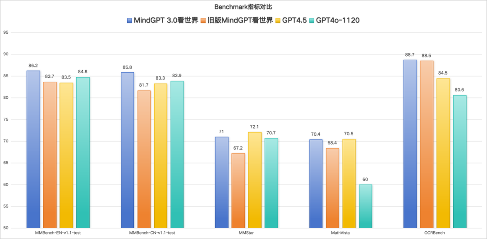

Performance 对比图

**2、播客Agent**

**2.1****播客文本创作**

播客文本生成流程

相较于播客Agent上一版本采用的基于输入文章直接单步生成播客内容的方式，我们在本次迭代中引入了一套多维度的自动化大模型评估体系，涵盖真实性、相关性、完整性、风格一致性、结构清晰度五个核心维度。该评估体系嵌入在“多轮评估-生成”的智能体流程中，不仅为每一轮生成内容提供结构化反馈，还能基于评估结果动态调整润色迭代轮数，以实现资源效率与内容质量之间的最优平衡。

此外，我们联合新闻传播学专业人士构建数百篇多领域高质量播客语料并优化自动化数据生产管线，在模型后训练阶段提升 MindGPT 3.0 文本创作能力，降低生成幻觉，增强生成文本的事实一致性与表达准确性。

通过“模型能力+ 生产流程”的双轮优化机制，结合动态控制的多轮生成策略，播客内容质量得到明显提升，其中相关性提升9%，更精准对齐原始输入，风格一致性提升42%，语言风格统一、表达更加自然流畅，更好地满足用户在学习新知、理解复杂问题、跟进热点趋势等方面的需求。

**2.2****播客语音合成技术**

基于Mind GPT 3.0强大的内容理解能力，播客Agent采用的语音合成（TTS）技术升级，升级为对话式长文本语音合成大模型：

**1）具有更强的对话感：**传统的TTS方案为对话双方内容交替合成的方案，每个音色合成时由于缺乏多轮对话历史，会存在自说自话的感觉，对话感差。升级后的对话式长文本TTS大模型将整段播客内容作为输入，做到了音色切换在模型内部完成，整段内容的合成使对话双方的语音衔接上更加连贯自然。另外，升级后的模型采用海量真实场景对话数据训练，不仅保留了完整的对话信息，也使建模后的语音风格更接近真人聊天，带来更符合对话场景的语音合成效果；

**2）具备更准确的情绪表达：**本次升级的Mind GPT 3.0模型具备更强的语义理解能力，在此基础上训练的TTS模型能够根据完整文本内容更准确的判断对话双方的语义和情绪，带来更符合内容情景的表达方式，合成的播客内容在情绪、韵律上更加准确和真实。

MindGPT 3.0已经在理想同学App以及理想同学网页版同步发布，欢迎大家下载或者登录体验。“遇事不决，理想同学”，我们将持续不断地提升理想同学的能力，为大家带来更加极致的体验。

