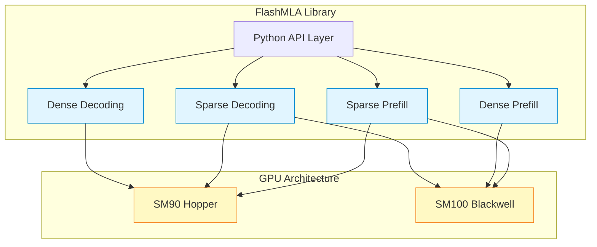
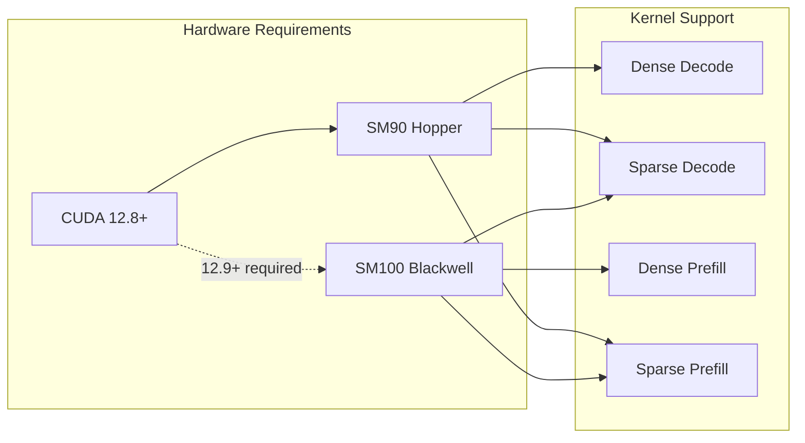

# DeepWiki

> 原文链接: https://wiki.litenext.digital/wiki/flashmla?file=01-overview

---

# Overview

[<- Back to Index](index.md)

**Part of**: [FlashMLA Architecture Documentation](index.md) **Generated**: 2026-01-27 **Source commit**: `48c6dc4`

* * *

## Introduction

This document provides a comprehensive overview of FlashMLA, DeepSeek's high-performance CUDA kernel library for attention mechanisms. FlashMLA is designed to accelerate Multi-head Latent Attention (MLA) computations in large language models, achieving exceptional throughput on NVIDIA Hopper and Blackwell GPUs. The library powers the inference engines behind DeepSeek-V3 series models and represents the state-of-the-art in attention kernel optimization.

FlashMLA addresses one of the most critical challenges in deploying large language models: efficiently computing attention over long sequences. As context windows grow to 128K+ tokens, the computational and memory requirements of attention become significant bottlenecks. FlashMLA solves this through a combination of algorithmic innovations (sparse attention, FP8 quantization) and deep hardware optimization (seesaw scheduling, distributed shared memory).

The source code is organized into architecture-specific implementations in `csrc/sm90/` and `csrc/sm100/`, with a unified Python API in `flash_mla/flash_mla_interface.py`. Key parameter structures are defined in `csrc/params.h`, including `DenseAttnDecodeParams`, `SparseAttnDecodeParams`, and `SparseAttnFwdParams` that encapsulate all kernel inputs.

## What is FlashMLA?

FlashMLA is DeepSeek's production-grade CUDA kernel library for optimized attention mechanisms. It powers the inference engines behind DeepSeek-V3, DeepSeek-V3.1, and DeepSeek-V3.2 models, providing high-performance implementations of Multi-head Latent Attention (MLA) for both prefill and decoding phases.

The library addresses a critical bottleneck in large language model inference: the attention computation. By implementing specialized kernels that exploit the unique properties of MLA and modern GPU architectures (NVIDIA Hopper and Blackwell), FlashMLA achieves exceptional performance that enables practical deployment of models with 128K+ context windows.



The name "FlashMLA" reflects its heritage from FlashAttention, adapted for the specific requirements of Multi-head Latent Attention with additional innovations like FP8 quantization and token-level sparse attention.

## Key Features and Capabilities

| Kernel Type | Phase | GPU Support | KVCache Format | Attention Mode | Peak Performance |
| --- | --- | --- | --- | --- | --- |
| Dense Decoding | Decode | SM90 | BF16 | MQA | 660 TFlops (H800) |
| Sparse Decoding | Decode | SM90, SM100 | FP8 | MQA | 410 TFlops (H800) |
| Dense Prefill | Prefill | SM100 | N/A | MHA | 1460 TFlops (B200) |
| Sparse Prefill | Prefill | SM90, SM100 | N/A | MQA | 1450 TFlops (B200) |

FlashMLA provides four primary kernel types, each optimized for specific use cases:



### Dense Decoding

The dense decoding kernel implements standard MLA attention for autoregressive token generation. It operates in Multi-Query Attention (MQA) mode with 128 query heads sharing a single key-value head. Key features include:

-   **Seesaw scheduling**: A novel approach that overlaps CUDA Core and Tensor Core operations using two warpgroups processing alternating KV blocks
-   **Split-KV processing**: Multiple SMs collaborate to process long sequences, with results combined via log-sum-exp reduction
-   **Fine-grained TMA pipelining**: Memory transfers overlap with computation for improved latency tolerance

```python

def flash_mla_with_kvcache(
    q: torch.Tensor,
    k_cache: torch.Tensor,
    block_table: Optional[torch.Tensor],
    cache_seqlens: Optional[torch.Tensor],
    head_dim_v: int,
    tile_scheduler_metadata: FlashMLASchedMeta,
    ...
) -> Tuple[torch.Tensor, torch.Tensor]:
    """Main entry point for MLA decoding with KVCache support."""
```

### Sparse Decoding with FP8 KVCache

The sparse decoding kernel enables DeepSeek Sparse Attention (DSA), which computes attention only for a selected subset of tokens. This dramatically reduces computation and memory bandwidth requirements for long sequences. The kernel uses FP8 quantization to further compress the KVCache by 4x compared to BF16.

-   **FP8 quantization**: Each token's KVCache occupies 656 bytes instead of 2304 bytes in full precision
-   **Token-level sparsity**: Only attends to `topk` most relevant tokens per query
-   **Crossover technique**: Two CTAs share dequantized KV values via Distributed Shared Memory, halving dequantization overhead

### Dense Prefill

The dense prefill kernel implements standard Multi-Head Attention (MHA) for the initial context processing phase. Built on NVIDIA's CUTLASS library, it supports both forward and backward passes for training.

-   **CUTLASS-based**: Leverages NVIDIA's optimized tensor operation templates
-   **Backward support**: Enables gradient computation for training workloads
-   **Variable-length batching**: Efficient processing of sequences with different lengths

### Sparse Prefill

The sparse prefill kernel applies token-level sparse attention during the prefill phase, enabling efficient processing of long contexts by focusing computation on the most relevant tokens.

-   **Query-specific token selection**: Each query attends to its own set of selected tokens
-   **Attention sink support**: Optional constant tokens that all queries attend to
-   **Variable topk lengths**: Different queries can have different numbers of selected tokens

## Supported GPU Architectures

| Architecture | Compute Capability | Required CUDA | Supported Kernels |
| --- | --- | --- | --- |
| Hopper (H100/H800) | SM90 | 12.8+ | Dense Decode, Sparse Decode, Sparse Prefill |
| Blackwell (B200) | SM100 | 12.9+ | Sparse Decode, Dense Prefill, Sparse Prefill |

FlashMLA requires NVIDIA GPUs with specific compute capabilities:

Kernel Support

Hardware Requirements

12.9+ required

CUDA 12.8+

SM90 Hopper

SM100 Blackwell

Dense Decode

Sparse Decode

Dense Prefill

Sparse Prefill

The library exploits architecture-specific features:

-   **SM90 (Hopper)**: CTA Clusters, Distributed Shared Memory, TMA with cache hints
-   **SM100 (Blackwell)**: Enhanced tensor cores, improved memory subsystem

## Performance Characteristics

FlashMLA achieves exceptional performance by carefully optimizing for both compute-bound and memory-bound scenarios.

### Compute-Bound Performance

| Kernel | Configuration | Throughput | Efficiency |
| --- | --- | --- | --- |
| Dense Decode | b=128, h_q=128, s_k=4096 | 660 TFlops | ~80% of throttled peak |
| Sparse Decode FP8 | b=128, h_q=128, topk=2048 | 410 TFlops | ~47% of peak |
| Dense Prefill | Standard MHA config | 1460 TFlops | Reported by NVIDIA |
| Sparse Prefill | Standard config | 1450 TFlops (B200) | Reported by NVIDIA |

In compute-bound configurations (large batch sizes, many query heads), the kernels approach theoretical peak performance:

### Memory-Bound Performance

For memory-bound workloads (small batches, short sequences), FlashMLA achieves near-peak memory bandwidth:

-   **Dense Decode**: Up to 3000 GB/s on H800 (89% of 3.35 TB/s peak)
-   **Efficient KVCache access**: Page-based layout minimizes memory fragmentation

### Why MLA is Compute-Bound

A key insight behind FlashMLA's design is that MLA decoding is often compute-bound, not memory-bound. The theoretical analysis from `docs/20250422-new-kernel-deep-dive.md`:

```text
FLOPs = 2 * h_q * s_q * s_k * (d_k + d_v)
Memory = 2 * s_k * d_k  (dominated by KVCache)
Compute-Memory Ratio = h_q * s_q * (d_k + d_v) / d_k ≈ 2 * h_q * s_q

For DeepSeek-V3: h_q = 128, s_q = 1
Ratio = 256 flops/byte > H800's 865 TFlops / 3.35 TB/s ≈ 258 flops/byte
```

This analysis shows that with 128 query heads, MLA decoding is compute-bound on H800, justifying the focus on maximizing Tensor Core utilization through techniques like seesaw scheduling.

## Design Philosophy

FlashMLA embodies several key design principles:

1.  **Architecture-Specific Optimization**: Rather than generic code, each kernel is hand-tuned for specific GPU generations, exploiting features like DSM and CTA clusters.

2.  **Algorithm-Hardware Co-Design**: The mathematical formulation (online softmax, seesaw scheduling) is designed to map efficiently to GPU execution models.

3.  **Production-Grade Quality**: The library powers real inference services, with comprehensive testing and careful numerical stability.

4.  **Modular Extensibility**: Clean separation between API layer, scheduling, and kernel implementations enables adding new variants.

## Source Code Organization

The FlashMLA codebase is organized into distinct layers that separate concerns and enable maintainability:

**Python Layer** (`flash_mla/`):

-   `flash_mla_interface.py:8-35`: Defines `FlashMLASchedMeta` dataclass for scheduler state
-   `flash_mla_interface.py:37-51`: Implements `get_mla_metadata()` for scheduler initialization
-   `flash_mla_interface.py:53-173`: Main `flash_mla_with_kvcache()` function for decoding
-   `flash_mla_interface.py:176-211`: `flash_mla_sparse_fwd()` for sparse prefill
-   `flash_mla_interface.py:328-392`: `FlashAttnVarlenFunc` autograd function for training

**C++ API Layer** (`csrc/api/`):

-   `api.cpp`: pybind11 module bindings exposing CUDA functions to Python
-   `dense_decode.h`: Dense decoding kernel orchestration and dispatch
-   `sparse_decode.h`: Sparse decoding with FP8 KVCache support
-   `dense_fwd.h`: Dense prefill forward/backward pass coordination
-   `sparse_fwd.h`: Sparse prefill kernel dispatch
-   `common.h`: Architecture detection macros and utility functions

**Parameter Structures** (`csrc/params.h`):

-   Lines 10-17: `DecodingSchedMeta` for CTA scheduling
-   Lines 19-61: `DenseAttnDecodeParams` for dense decode inputs
-   Lines 63-103: `SparseAttnDecodeParams` for sparse decode with FP8
-   Lines 105-125: `CombineParams` for split-KV result aggregation
-   Lines 145-168: `SparseAttnFwdParams` for sparse prefill

**Kernel Implementations**:

-   `csrc/sm90/decode/dense/`: Dense MLA decode for Hopper
-   `csrc/sm90/decode/sparse_fp8/`: FP8 sparse decode with crossover
-   `csrc/sm90/prefill/sparse/`: Sparse prefill on Hopper
-   `csrc/sm100/decode/`: Sparse decode for Blackwell
-   `csrc/sm100/prefill/dense/`: CUTLASS-based dense MHA
-   `csrc/sm100/prefill/sparse/`: Sparse prefill for Blackwell

## Integration with DeepSeek Models

FlashMLA is specifically designed for DeepSeek's model architecture. The key parameters for DeepSeek-V3 and V3.2 models are:

-   **Query heads** (`h_q`): 128 independent query heads
-   **KV heads** (`h_kv`): 1 shared key-value head (MQA mode)
-   **Key dimension** (`d_qk`): 576 (512 NoPE + 64 RoPE)
-   **Value dimension** (`d_v`): 512
-   **Page block size**: Typically 64 tokens per block

The MQA (Multi-Query Attention) mode is essential for understanding FlashMLA's design. All 128 query heads attend to the same single KV head, which dramatically reduces KVCache memory requirements compared to standard MHA where each query head has its own KV head.

The V32 FP8 format defined in `csrc/params.h:5-8` (`ModelType::V32`) stores each token's KVCache in 656 bytes:

-   512 FP8\_e4m3 values for the quantized NoPE part
-   4 float32 scale factors for tile-level dequantization
-   64 BF16 values for the precision-sensitive RoPE part

This format enables 4x memory reduction while maintaining acceptable precision through careful handling of the RoPE components that are sensitive to quantization.

## Comparison with FlashAttention

| Aspect | FlashAttention | FlashMLA |
| --- | --- | --- |
| Primary target | MHA | MLA (Multi-head Latent Attention) |
| Attention mode | MHA only | MQA + MHA |
| Sparsity | Dense only | Dense + Token-level sparse |
| KVCache format | BF16/FP16 | BF16, FP8 with tile-level scales |
| GPU focus | Ampere, Hopper | Hopper, Blackwell |
| Key innovation | Online softmax | Seesaw scheduling, Crossover |

FlashMLA builds on the foundation established by FlashAttention but introduces several key innovations:

FlashMLA's seesaw scheduling addresses a unique constraint: the output matrix (64x512 = 32K values) consumes nearly all available SM registers, preventing traditional ping-pong scheduling. The seesaw approach splits the output vertically and uses interleaved warpgroups to overlap CUDA Core and Tensor Core operations.

## Summary

FlashMLA represents the state-of-the-art in attention kernel optimization for large language models. By combining algorithmic innovations (MLA, sparse attention, FP8 quantization) with deep hardware optimization (DSM, TMA pipelining, seesaw scheduling), it enables practical deployment of models with unprecedented context lengths and throughput.

The library's key achievements include:

-   **660 TFlops** dense decoding on H800 (80% Tensor Core utilization)
-   **410 TFlops** FP8 sparse decoding with crossover technique
-   **1460 TFlops** dense prefill on B200 via CUTLASS integration
-   **4x memory reduction** through FP8 KVCache quantization
-   **128K+ context** support with practical GPU memory

The library's success demonstrates that significant performance gains remain possible through careful algorithm-hardware co-design, even as model architectures continue to evolve. The clean separation of Python API, C++ orchestration, and CUDA kernels enables extensibility while maintaining production-grade performance.
