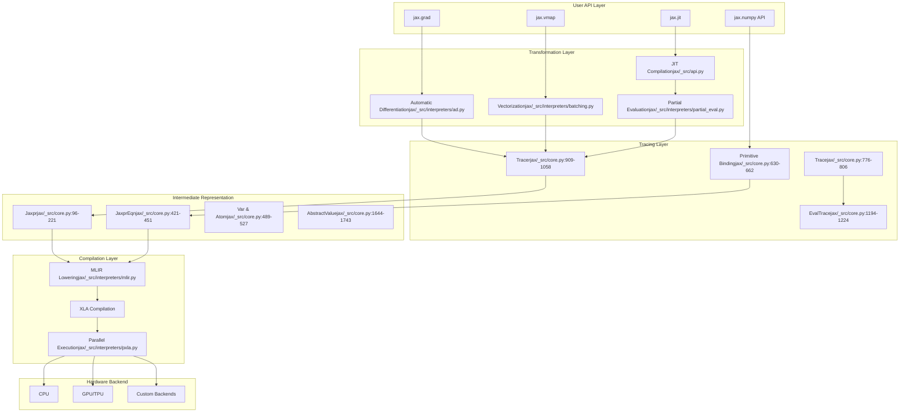

# DeepWiki

> 原文链接: https://wiki.litenext.digital/wiki/jax?file=03-core-architecture

---

# Core Architecture

[← Previous: Installation and Setup](02-installation-setup.md) | [Back to Index](index.md) | [Next: Transformation System →](04-transformation-system.md)

* * *

## Introduction

JAX's architecture is built around a multi-layered design that enables composable function transformations at scale. At its heart, JAX implements a sophisticated tracing system that captures program structure as an intermediate representation (IR), which can then be transformed and compiled for execution on various hardware accelerators.

The architecture follows a clear separation of concerns, with each layer building upon the previous one. User-facing APIs like `jax.grad`, `jax.jit`, and `jax.vmap` sit at the top, translating high-level transformations into lower-level operations. Beneath this lies the transformation layer, which implements the actual semantics of differentiation, vectorization, and other transformations. The core of the system is the tracing layer, which uses abstract interpretation to capture program structure without executing it. This traces are then compiled through XLA (Accelerated Linear Algebra) and dispatched to hardware backends.

JAX's design philosophy emphasizes functional purity, explicit behavior over implicit magic, and composability. All transformations are designed to compose freely with each other, enabling powerful combinations like `jit(vmap(grad(f)))`. The architecture makes no assumptions about global state, requiring users to explicitly thread all dependencies through function arguments and returns. This purity enables aggressive optimization and reliable program analysis.

## Architecture Layers

JAX's architecture is organized into six distinct layers, each with specific responsibilities:



### Layer Descriptions

**User API Layer** (`jax/_src/api.py`): Provides high-level transformations and NumPy-compatible array operations. This layer handles Python-level conveniences like keyword arguments, PyTree handling, and decorator syntax.

**Transformation Layer** (`jax/_src/interpreters/`): Implements the semantics of each transformation. The automatic differentiation system (`ad.py`), vectorization (`batching.py`), and partial evaluation for JIT compilation (`partial_eval.py`) all operate at this level.

**Tracing Layer** (`jax/_src/core.py`): The heart of JAX's architecture. Tracer objects intercept operations on arrays, recording them into a graph structure. The Trace mechanism manages the tracing context and delegates primitive operations to the appropriate interpreter.

**Intermediate Representation** (`jax/_src/core.py`): Jaxpr (JAX expression) is the IR that represents traced programs as a sequence of primitive operations. It's a typed, first-order, functional language that's easy to analyze and transform.

**Compilation Layer** (`jax/_src/interpreters/mlir.py`, `pxla.py`): Lowers Jaxpr to MLIR (Multi-Level Intermediate Representation) and then to XLA HLO (High-Level Optimizer). Handles parallelization, sharding, and device placement.

**Hardware Backend**: Executes compiled code on CPUs, GPUs, TPUs, or other accelerators through XLA's runtime.

## Core Abstractions

### Tracer

The `Tracer` class is the fundamental mechanism for intercepting and recording operations. When you call a JAX transformation, regular Python values are wrapped in Tracer objects that record operations instead of executing them directly.

Source: `jax/_src/core.py:909-1058`

```python
class Tracer(TracerBase, metaclass=TracerMeta):
    __slots__ = ['__weakref__', '_trace', '_line_info']

    def __init__(self, trace: Trace):
        self._trace = trace

    @property
    def aval(self):
        raise NotImplementedError("must override")
```

Key characteristics:

-   **Operation Interception**: Tracers override special methods like `__add__`, `__mul__`, etc., to record operations instead of executing them.
-   **Abstract Value**: Each Tracer has an associated `aval` (abstract value) that represents its type, shape, and dtype without storing actual data.
-   **Trace Reference**: Every Tracer maintains a reference to its parent Trace, which determines how operations are processed.
-   **Error Prevention**: Tracers raise informative errors when you try to convert them to concrete values (e.g., `bool()`, `int()`, `__array__()`) inappropriately.

Example of Tracer in action:

```python
from jax import make_jaxpr
import jax.numpy as jnp

def f(x):
    return x * 2 + 1

jaxpr = make_jaxpr(f)(3.0)
print(jaxpr)
```

### Primitive

Primitives are the atomic operations in JAX. Every operation in JAX ultimately reduces to primitive operations, which can be implemented differently for different transformations.

Source: `jax/_src/core.py:609-698`

```python
class Primitive:
    name: str
    multiple_results: bool = False

    def __init__(self, name: str):
        self.name = name

    def bind(self, *args, **params):
        args = map(canonicalize_value, args) if not self.skip_canonicalization else args
        return self._true_bind(*args, **params)

    def impl(self, *args, **params):
        raise NotImplementedError(f"Evaluation rule for '{self.name}' not implemented")

    def abstract_eval(self, *args, **params):
        raise NotImplementedError(f"Abstract evaluation for '{self.name}' not implemented")
```

Key concepts:

-   **Binding**: When you call `primitive.bind(*args, **params)`, the primitive dispatches to the current trace's `process_primitive` method.
-   **Implementation**: The `impl` method defines how the primitive executes concretely (e.g., calling NumPy).
-   **Abstract Evaluation**: The `abstract_eval` method computes output shapes and types without executing the operation.
-   **Multiple Results**: Some primitives (like function calls) can return multiple values.

Example primitive usage:

```python
from jax._src import core
from jax import lax

add_p = lax.add_p

result = add_p.bind(2.0, 3.0)
```

### Jaxpr

Jaxpr (JAX expression) is the intermediate representation that captures the structure of traced computations. It's a typed, first-order functional language with explicit variable bindings.

Source: `jax/_src/core.py:96-221`

```python
class Jaxpr:
    _constvars: list[Var]
    _invars: list[Var]
    _outvars: list[Atom]
    _eqns: list[JaxprEqn]
    _effects: Effects

    @property
    def in_avals(self):
        return [v.aval for v in self.invars]

    @property
    def out_avals(self):
        return [v.aval for v in self.outvars]
```

A Jaxpr consists of:

-   **Variables**: Typed variables representing intermediate values
-   **Equations**: Primitive operations with input and output variables
-   **Structure**: A straight-line sequence of equations (no control flow at the base level)

Example Jaxpr:

```python
from jax import make_jaxpr
import jax.numpy as jnp

def f(x, y):
    return jnp.dot(x, y) + 1.0

jaxpr = make_jaxpr(f)(jnp.ones((3, 4)), jnp.ones((4, 5)))
print(jaxpr)

```

See [Chapter 4: Jaxpr IR](./04-jaxpr-ir.md) for detailed coverage.

### AbstractValue

Abstract values represent the type-level information about values without storing the actual data. They're used throughout JAX for type checking, shape inference, and optimization.

Source: `jax/_src/core.py:1644-1743`

```python
class AbstractValue:
    __slots__: list[str] = []

    def to_tangent_aval(self):
        """Convert to tangent space representation (for differentiation)"""
        raise NotImplementedError("must override")

    def to_cotangent_aval(self):
        """Convert to cotangent space representation (for reverse-mode AD)"""
        raise NotImplementedError("must override")

    def update_weak_type(self, weak_type):
        """Update weak type annotation"""
        return self
```

The most common abstract value is `ShapedArray`:

```python
class ShapedArray(AbstractValue):
    __slots__ = ['shape', 'dtype', 'weak_type', 'sharding', 'vma', 'memory_space']

    def __init__(self, shape, dtype, weak_type=False, *,
                 sharding=None, vma=frozenset(),
                 memory_space=MemorySpace.Device):
        self.shape = canonicalize_shape(shape)
        self.dtype = _dtype_object(dtype)
        self.weak_type = weak_type
        self.sharding = get_sharding(sharding, self.shape)
        self.vma = get_vma(vma, self.sharding)
        self.memory_space = get_memory_space(memory_space)
```

Abstract values enable:

-   **Shape inference**: Determining output shapes from input shapes
-   **Type checking**: Ensuring operations receive compatible types
-   **Optimization**: Making decisions based on shape/type without concrete values

## Design Principles

### Functional Purity

JAX requires functions to be pure - they must depend only on their inputs and produce outputs without side effects. This principle enables safe transformations and optimizations.

**Why it matters**: When a function is pure, we can freely reorder operations, cache results, and apply transformations without worrying about hidden state changes. JAX enforces purity by detecting escaped tracers - intermediate values that leak outside the transformation scope.

**Implications**: You cannot use global variables, print statements (in compiled code), or other side effects within transformed functions. Random number generation requires explicit state threading through PRNG keys.

### Composability

All JAX transformations compose freely with each other. You can apply `grad` to a `vmap`'d function, then JIT compile it, and the result will be a fast, vectorized gradient computation.

**Why it matters**: Composability means you can build complex transformations from simple building blocks. You don't need special "vectorized gradient" or "JIT-compiled vmap" functions - the composition just works.

**Implementation**: Each transformation operates on Jaxpr, the common IR. When transformations compose, they create nested traces that process primitives in sequence. The Tracer system manages this nesting automatically.

### Transformation-Based Architecture

Rather than providing specialized functions for every operation variant, JAX provides general transformations that work with user-defined functions. This inverts the traditional library design where the library provides the operations.

**Why it matters**: Users can define domain-specific operations and still benefit from JAX's transformations. You're not limited to the operations JAX provides - any pure Python function can be transformed.

**Example**: Instead of providing separate `matmul`, `batched_matmul`, `grad_matmul`, etc., JAX provides `jnp.dot` and transformations `vmap`, `grad` that work with any function.

### Explicit Over Implicit

JAX makes behavior explicit rather than implicit. Array shapes are part of the type, random number generators require explicit keys, and device placement is specified rather than inferred.

**Why it matters**: Explicit behavior makes programs easier to understand, debug, and optimize. There are no hidden costs or surprising behaviors.

**Examples**:

-   Shape checking is strict - operations fail early if shapes don't match
-   PRNG keys must be explicitly split and threaded through computations
-   Donation of buffers for in-place updates must be explicitly declared
-   Sharding and device placement are explicit in the type system

## Type System

JAX's type system is based on abstract values that capture shape, dtype, and other metadata without storing actual array data.

### ShapedArray and Abstract Types

The primary abstract type is `ShapedArray`, which represents arrays with known shapes and dtypes:

```python
from jax import core
import numpy as np

aval = core.ShapedArray((3, 4), np.float32)
print(aval)
print(aval.shape)
print(aval.dtype)
```

Other abstract types include:

-   **ConcreteArray**: An abstract value that also stores the concrete data (for constants)
-   **DShapedArray**: Arrays with dynamic (symbolic) shapes
-   **AbstractToken**: Represents sequencing dependencies for effectful operations

### Type Promotion and Dtype Handling

JAX follows NumPy's type promotion rules with some modifications for performance and precision safety:

```python
import jax.numpy as jnp
from jax import core

x = jnp.array(1, dtype=jnp.int32)
y = jnp.array(2.0, dtype=jnp.float32)
z = x + y
print(z.dtype)

aval = core.get_aval(z)
print(aval)
```

Type promotion rules:

1.  **Integer + Float → Float**: Integer operands are promoted to float
2.  **Lower precision + Higher precision → Higher precision**: e.g., float16 + float32 → float32
3.  **Weak types**: Python scalars are "weakly typed" and defer to array types
4.  **Safety**: JAX promotes conservatively to avoid unexpected precision loss

### Weak Types

Weak types allow Python scalars to interact naturally with JAX arrays without forcing promotions:

```python
import jax.numpy as jnp

x = jnp.array([1, 2, 3], dtype=jnp.int32)
y = x + 1

z = jnp.array(1)
w = x + z
```

Source: `jax/_src/dtypes.py:876-890`

```python
def is_weakly_typed(x: Any) -> bool:
    if type(x) in _weak_types or type(x) in _registered_weak_types:
        return True
    try:
        return x.aval.weak_type
    except AttributeError:
        return False
```

Weak types prevent surprising behavior where `array + 1` would promote to float64 on 64-bit platforms.

## PyTree Structure

PyTrees are JAX's way of handling nested Python containers (tuples, lists, dicts) containing arrays. They're fundamental to JAX's API design.

Source: `jax/_src/tree_util.py:1-150`

### What are PyTrees?

A PyTree is a tree-like structure built from container nodes (tuples, lists, dicts, custom classes) with arrays or other data at the leaves. JAX functions naturally work with PyTrees:

```python
import jax
import jax.numpy as jnp

params = {
    'layer1': {'weights': jnp.ones((10, 5)), 'bias': jnp.zeros(5)},
    'layer2': {'weights': jnp.ones((5, 2)), 'bias': jnp.zeros(2)}
}

def loss(params, x):
    hidden = jnp.dot(x, params['layer1']['weights']) + params['layer1']['bias']
    return jnp.dot(hidden, params['layer2']['weights']) + params['layer2']['bias']

grad_fn = jax.grad(loss)
grads = grad_fn(params, jnp.ones(10))
print(jax.tree.structure(grads) == jax.tree.structure(params))
```

### tree\_flatten and tree\_unflatten

The core operations are `tree_flatten` and `tree_unflatten`:

```python
from jax.tree_util import tree_flatten, tree_unflatten

params = {'a': [1, 2], 'b': 3}

leaves, treedef = tree_flatten(params)
print(leaves)
print(treedef)

reconstructed = tree_unflatten(treedef, leaves)
print(reconstructed)
```

This separation enables:

-   **Vectorization**: Apply operations to all leaves at once
-   **Transformation**: Modify leaves while preserving structure
-   **Type checking**: Ensure PyTrees have matching structures

### Custom PyTree Registration

You can register custom classes as PyTree nodes:

```python
from jax.tree_util import register_pytree_node
import jax.numpy as jnp

class MyContainer:
    def __init__(self, x, y, meta):
        self.x = x
        self.y = y
        self.meta = meta

    def tree_flatten(self):
        children = (self.x, self.y)
        aux_data = self.meta
        return children, aux_data

    @classmethod
    def tree_unflatten(cls, aux_data, children):
        return cls(*children, aux_data)

register_pytree_node(
    MyContainer,
    MyContainer.tree_flatten,
    MyContainer.tree_unflatten
)

container = MyContainer(jnp.array([1, 2]), jnp.array([3, 4]), "metadata")
doubled = jax.tree.map(lambda x: x * 2, container)
print(doubled.x)
print(doubled.meta)
```

### PyTree Examples

**Example 1: Applying transformations uniformly**

```python
import jax
import jax.numpy as jnp

data = {
    'train': [jnp.array([1, 2, 3]), jnp.array([4, 5, 6])],
    'test': jnp.array([7, 8, 9])
}

normalized = jax.tree.map(lambda x: x / jnp.linalg.norm(x), data)
```

**Example 2: Parallel PyTree processing**

```python
import jax.numpy as jnp
from jax.tree_util import tree_map

params1 = {'w': jnp.array([1, 2]), 'b': jnp.array([3])}
params2 = {'w': jnp.array([4, 5]), 'b': jnp.array([6])}

combined = tree_map(lambda x, y: x + y, params1, params2)
print(combined)
```

**Example 3: PyTree with custom structure**

```python
from dataclasses import dataclass
from jax.tree_util import register_dataclass
import jax.numpy as jnp

@dataclass
class Layer:
    weights: jnp.ndarray
    bias: jnp.ndarray

    def __call__(self, x):
        return jnp.dot(x, self.weights) + self.bias

register_dataclass(Layer, data_fields=['weights', 'bias'], meta_fields=[])

layer = Layer(jnp.ones((5, 3)), jnp.zeros(3))
scaled = jax.tree.map(lambda x: x * 0.01, layer)
```

## Data Flow

Understanding how data flows through JAX's layers is crucial to understanding its architecture.

### How Data Moves Through the System

Evaluator/CompilerJaxpr BuilderPrimitiveTracer ObjectsTrace ContextAPI LayerUser CodeEvaluator/CompilerJaxpr BuilderPrimitiveTracer ObjectsTrace ContextAPI LayerUser Codef(x) with transformationCreate new trace contextWrap inputs as TracersCall f(tracer\_x)Operation (e.g., x + 1)primitive.bind(tracer\_x, 1)process\_primitive(add\_p, ...)Record equationReturn new TracerContinue with resultReturn outputFinalize JaxprPass to evaluator/compilerExecute and return results

### Variable Environment and Evaluation

When a Jaxpr is evaluated, variables are mapped to concrete values in an environment:

Source: `jax/_src/core.py:728-753`

```python
def eval_jaxpr(jaxpr: Jaxpr, consts, *args) -> list[Any]:
    def read(v: Atom) -> Any:
        return v.val if isinstance(v, Literal) else env[v]

    def write(v: Var, val: Any) -> None:
        env[v] = val

    env: dict[Var, Any] = {}

    foreach(write, jaxpr.constvars, consts)
    foreach(write, jaxpr.invars, args)

    for eqn in jaxpr.eqns:
        subfuns, bind_params = eqn.primitive.get_bind_params(eqn.params)
        ans = eqn.primitive.bind(*subfuns, *map(read, eqn.invars), **bind_params)
        if eqn.primitive.multiple_results:
            foreach(write, eqn.outvars, ans)
        else:
            write(eqn.outvars[0], ans)

    return map(read, jaxpr.outvars)
```

### Simple Operation Flow Example

Let's trace a simple operation `y = x * 2 + 1` through the system:

```python
import jax
import jax.numpy as jnp
from jax import make_jaxpr

def f(x):
    return x * 2 + 1

jaxpr = make_jaxpr(f)(3.0)

print(jaxpr)

```

## Component Interaction

Understanding how Tracers, Primitives, and Jaxprs work together is key to understanding JAX's architecture.

### How Tracers, Primitives, and Jaxprs Work Together

The interaction follows a clear pattern:

1.  **Transformation Entry**: A transformation like `make_jaxpr`, `grad`, or `jit` creates a new `Trace` object and wraps inputs as `Tracer` instances.

2.  **Operation Interception**: When Python operations are performed on Tracers, they're intercepted by special methods that call `primitive.bind()`.

3.  **Primitive Binding**: The primitive's `bind` method calls the current trace's `process_primitive` method, which determines how to handle the operation.

4.  **Trace Processing**: The trace processes the primitive according to its semantics - for Jaxpr tracing, it records an equation; for AD, it may compute forward or backward derivatives; for evaluation, it executes the operation.

5.  **Result Creation**: The trace returns new Tracer(s) representing the output(s), which can be used in subsequent operations.

### The Tracing Process

Source: `jax/_src/core.py:630-662`

```python
class Primitive:
    def bind(self, *args, **params):
        args = map(canonicalize_value, args)
        return self._true_bind(*args, **params)

    def _true_bind(self, *args, **params):

        for arg in args:
            if isinstance(arg, Tracer) and not arg._trace.is_valid():
                raise escaped_tracer_error(arg)

        prev_trace = trace_ctx.trace
        trace_ctx.set_trace(eval_trace)
        try:
            return self.bind_with_trace(prev_trace, args, params)
        finally:
            trace_ctx.set_trace(prev_trace)

    def bind_with_trace(self, trace, args, params):
        return trace.process_primitive(self, args, params)
```

The trace context maintains a stack of active traces. When a primitive is bound, it's processed by the most recent (innermost) trace.

### Primitive Binding and Dispatch

Here's a detailed example of how primitive dispatch works:

```python
from jax import make_jaxpr
import jax.numpy as jnp
from jax._src.lax import lax

def example(x, y):
    return jnp.add(x, y)

jaxpr = make_jaxpr(example)(1.0, 2.0)

print(jaxpr)
```

Different traces process primitives differently:

-   **EvalTrace** (normal execution): Calls `primitive.impl(*args, **params)` to execute the operation
-   **JaxprTrace** (tracing for JIT): Records an equation in the Jaxpr being built
-   **JVPTrace** (forward-mode AD): Computes both the primal and tangent values
-   **VmapTrace** (vectorization): Adds batch dimensions and adjusts the operation

This dispatch mechanism is what enables JAX's composable transformations. Each trace layer adds its semantics while delegating to the next layer.

* * *

## See Also

-   [Chapter 4: Jaxpr IR](./04-jaxpr-ir.md) - Detailed coverage of the intermediate representation
-   [Chapter 5: Transformations](./05-transformations.md) - How `grad`, `jit`, `vmap` are implemented
-   [Chapter 6: Tracing System](./06-tracing-system.md) - Deep dive into the tracing mechanism

## References

-   `jax/_src/core.py`: Core abstractions (Tracer, Primitive, Jaxpr, AbstractValue)
-   `jax/_src/api.py`: User-facing transformation APIs
-   `jax/_src/tree_util.py`: PyTree utilities
-   `jax/_src/interpreters/`: Transformation implementations (ad, batching, partial\_eval, mlir, pxla)
-   [JAX Documentation](https://docs.jax.dev/): Official documentation
-   [README.md](/workspace/libs/jax/README.md): Project overview

* * *

[← Previous: Installation and Setup](02-installation-setup.md) | [Back to Index](index.md) | [Next: Transformation System →](04-transformation-system.md)
