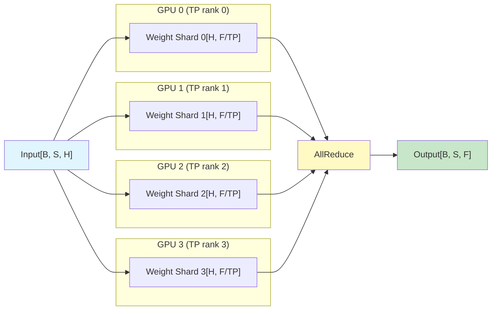
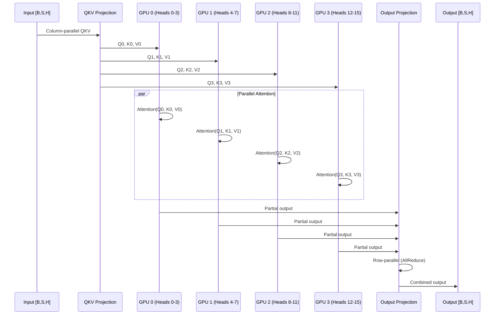
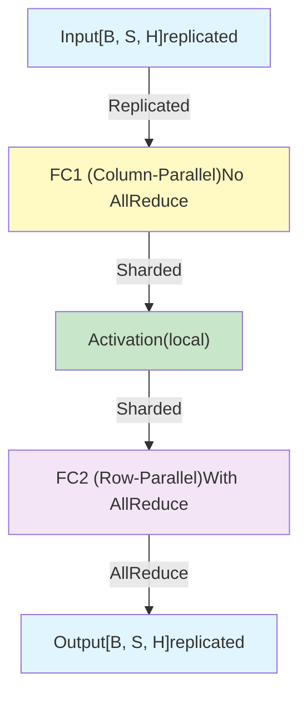
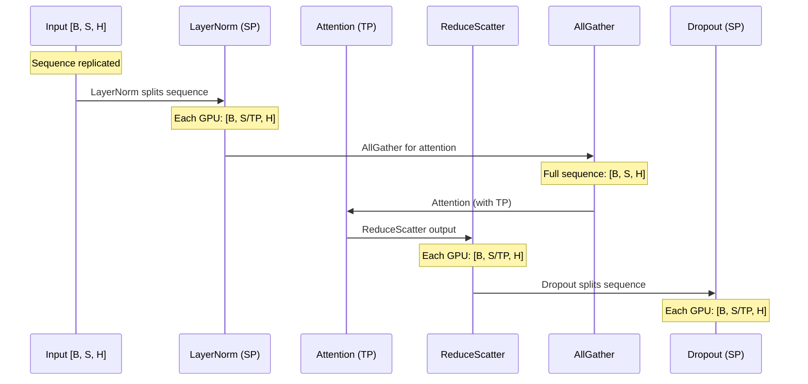
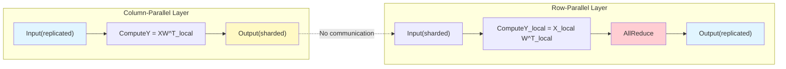

# DeepWiki

> 原文链接: https://wiki.litenext.digital/wiki/megatron-lm?file=05-tensor-parallelism

---

# 05\. Tensor Parallelism

[← Back to Index](index.md) | [Previous: Parallelism Overview](04-parallelism-overview.md) | [Next: Pipeline Parallelism →](06-pipeline-parallelism.md)

**Generated:** December 29, 2025 **Source Commit:** dd7c9f4f6

* * *

## Overview

**Tensor Parallelism (TP)** shards weight matrices and activations **within a single layer** across multiple GPUs, enabling models that don't fit on a single device.

**Key Characteristics:**

-   **Granularity:** Intra-layer (weights split within Linear layers)
-   **Communication:** AllReduce operations (high bandwidth)
-   **Memory reduction:** Parameters divided by TP size
-   **Typical values:** TP=2, 4, 8 (power of 2)
-   **Placement:** Within NVLink domain (single node)

## Core Mechanics

### Weight Sharding Strategy



### Column-Parallel vs Row-Parallel

**Column-Parallel Linear:**

```python

class ColumnParallelLinear(torch.nn.Module):
    """Linear layer with column parallelism

    Weight matrix [input_size, output_size] is split along output_size:
    - Rank 0: [:, 0:output_size/TP]
    - Rank 1: [:, output_size/TP:2*output_size/TP]
    - ...

    Forward: f(XA) = [f(XA_1), f(XA_2), ..., f(XA_TP)]
    No AllReduce if gather_output=False
    """

    def forward(self, input_):

        output_parallel = F.linear(input_, self.weight, self.bias)

        if self.gather_output:

            output = gather_from_tensor_model_parallel_region(output_parallel)
        else:

            output = output_parallel

        return output
```

**Row-Parallel Linear:**

```python

class RowParallelLinear(torch.nn.Module):
    """Linear layer with row parallelism

    Weight matrix [input_size, output_size] is split along input_size:
    - Rank 0: [0:input_size/TP, :]
    - Rank 1: [input_size/TP:2*input_size/TP, :]
    - ...

    Forward: f(XA) = AllReduce(f(X_1 A_1) + f(X_2 A_2) + ...)
    Always requires AllReduce
    """

    def forward(self, input_):

        output_parallel = F.linear(input_, self.weight)

        output = reduce_from_tensor_model_parallel_region(output_parallel)

        if self.bias is not None:
            output = output + self.bias

        return output
```

## Attention Layer Sharding

### Multi-Head Attention with TP

Output \[B,S,H\]Output ProjectionGPU 3 (Heads 12-15)GPU 2 (Heads 8-11)GPU 1 (Heads 4-7)GPU 0 (Heads 0-3)QKV ProjectionInput \[B,S,H\]Output \[B,S,H\]Output ProjectionGPU 3 (Heads 12-15)GPU 2 (Heads 8-11)GPU 1 (Heads 4-7)GPU 0 (Heads 0-3)QKV ProjectionInput \[B,S,H\]par\[Parallel Attention\]Column-parallel QKVQ0, K0, V0Q1, K1, V1Q2, K2, V2Q3, K3, V3Attention(Q0, K0, V0)Attention(Q1, K1, V1)Attention(Q2, K2, V2)Attention(Q3, K3, V3)Partial outputPartial outputPartial outputPartial outputRow-parallel (AllReduce)Combined output

**Implementation:**

```python

query_key_value = self.linear_qkv(hidden_states)

query, key, value = split_qkv(query_key_value)

context = core_attention(query, key, value, attention_mask)

output = self.linear_proj(context)
```

## MLP Layer Sharding

### GLU Variant (SwiGLU/GeGLU)

```python

class MLP(MegatronModule):
    """MLP with optional gating (GLU variants)

    Architecture with TP=4:
    - fc1 (column-parallel): [H, 4H] → each GPU holds [H, H]
    - Activation (SwiGLU): Applied locally
    - fc2 (row-parallel): [4H, H] → each GPU holds [H, H]

    For GLU: fc1 produces 2x output (gate + input), split locally
    """

    def forward(self, hidden_states):

        intermediate = self.linear_fc1(hidden_states)

        if self.config.gated_linear_unit:

            intermediate, gate = chunk(intermediate, 2, dim=-1)
            intermediate = swiglu(gate, intermediate)
        else:
            intermediate = self.activation_func(intermediate)

        output = self.linear_fc2(intermediate)

        return output
```

### Communication Pattern



## Sequence Parallelism (SP)

### Motivation

**Problem:** Without SP, activation memory scales with `batch_size × seq_len × hidden_size`

**Solution:** Distribute LayerNorm and Dropout along sequence dimension

### How It Works

Dropout (SP)AllGatherReduceScatterAttention (TP)LayerNorm (SP)Input \[B, S, H\]Dropout (SP)AllGatherReduceScatterAttention (TP)LayerNorm (SP)Input \[B, S, H\]Sequence replicatedEach GPU: \[B, S/TP, H\]Full sequence: \[B, S, H\]Each GPU: \[B, S/TP, H\]Each GPU: \[B, S/TP, H\]LayerNorm splits sequenceAllGather for attentionAttention (with TP)ReduceScatter outputDropout splits sequence

**Memory Savings:**

-   LayerNorm activations: Reduced by **1/TP**
-   Dropout mask: Reduced by **1/TP**
-   Total activation memory: **~30% reduction** with TP=8

### Implementation

```python

class TransformerLayer(MegatronModule):
    def forward(self, hidden_states, attention_mask=None):

        if self.config.sequence_parallel:

            layernorm_output = self.input_layernorm(hidden_states)

            layernorm_output = gather_from_sequence_parallel_region(
                layernorm_output,
                tensor_parallel_output_grad=False
            )
        else:

            layernorm_output = self.input_layernorm(hidden_states)

        attention_output = self.self_attention(
            layernorm_output,
            attention_mask
        )

        if self.config.sequence_parallel:

            attention_output = reduce_scatter_to_sequence_parallel_region(
                attention_output
            )

        hidden_states = hidden_states + attention_output

```

### Communication Operations

```python

def gather_from_sequence_parallel_region(input_):
    """AllGather: [B, S/TP, H] → [B, S, H]"""
    return torch.distributed.all_gather(
        input_,
        group=get_tensor_model_parallel_group()
    )

def reduce_scatter_to_sequence_parallel_region(input_):
    """ReduceScatter + AllReduce: [B, S, H] → [B, S/TP, H]"""

    return torch.distributed.reduce_scatter(
        input_,
        group=get_tensor_model_parallel_group()
    )
```

## Communication Patterns

### Forward Pass



**Key Insight:** Column → Row layers require **no communication** in forward (output sharding matches input expectation).

### Backward Pass



**Communication Count per Transformer Layer:**

-   Forward: 1 AllReduce (row-parallel output projection)
-   Backward: 2 AllReduces (column-parallel input grad, row-parallel weight grad)
-   **Total: 3 AllReduces** per layer (with TP)
-   **With SP:** +2 AllGather/ReduceScatter per layer

## Memory Analysis

### Parameter Memory

```text
Model parameters: P
TP size: T

Memory per GPU (parameters): P / T
```

**Example: Llama-3 70B with TP=8**

```text
Parameters: 70B
Memory per GPU: 70B / 8 = 8.75B parameters
FP16 storage: 8.75B × 2 bytes = 17.5 GB
```

### Activation Memory

**Without SP:**

```text
Activation memory per layer ≈
    batch_size × seq_len × hidden_size × 34 × num_layers
```

**With SP (sequence\_parallel=True):**

```text
Activation memory per layer ≈
    batch_size × seq_len × hidden_size × 34 × num_layers / TP
```

**Memory reduction: ~1/TP** for LayerNorm and Dropout activations.

## Performance Considerations

### Communication Overhead

**Bandwidth Requirements:**

```text
Per AllReduce: 2 × tensor_size (send + receive)
Tensor size: batch_size × seq_len × hidden_size × sizeof(dtype)

Example (batch=4, seq=2048, hidden=8192, BF16):
  Tensor: 4 × 2048 × 8192 × 2 = 134 MB
  AllReduce: 268 MB per operation

With TP=8, 3 AllReduces/layer, 80 layers:
  Total per iteration: 268 MB × 3 × 80 = 64 GB
  At 400 GB/s NVLink: ~160 ms communication time
```

**Overlap Strategy:**

-   TP AllReduce typically **not overlapped** (synchronous within layer)
-   But can be **pipelined** with next layer's compute

### Optimal TP Size

| TP | NVLink Hops | Bandwidth | Efficiency |
| --- | --- | --- | --- |
| 2 | 1 | 400 GB/s | 100% |
| 4 | 2 | 400 GB/s | 95% |
| 8 | 3 | 400 GB/s | 90% |
| 16 (cross-node) | N/A | 25 GB/s | 40% |

**Rule of thumb:**

```text
TP ≤ GPUs per node (typically 8)
TP = power of 2 (2, 4, 8)
```

**Why:**

-   TP requires high bandwidth (AllReduce is bottleneck)
-   NVLink within node: 400 GB/s
-   InfiniBand across nodes: 25 GB/s
-   **16x bandwidth difference** makes cross-node TP inefficient

**Example Scaling:**



## Configuration

### CLI Arguments

```bash

--tensor-model-parallel-size 4

--sequence-parallel

--attention-backend flash_attn
```

### Config Object

```python
from megatron.core.transformer import TransformerConfig

config = TransformerConfig(

    tensor_model_parallel_size=4,
    sequence_parallel=True,

    num_layers=32,
    hidden_size=4096,
    num_attention_heads=32,
    ffn_hidden_size=16384,
)
```

## Example: Llama-3 70B with TP=4

## Code Examples

### Custom TP Layer

```python
from megatron.core.tensor_parallel import (
    ColumnParallelLinear,
    RowParallelLinear,
)

class CustomTPModule(torch.nn.Module):
    def __init__(self, config):
        super().__init__()

        self.fc1 = ColumnParallelLinear(
            config.hidden_size,
            config.ffn_hidden_size,
            config=config,
            gather_output=False,
        )

        self.fc2 = RowParallelLinear(
            config.ffn_hidden_size,
            config.hidden_size,
            config=config,
            input_is_parallel=True,
        )

    def forward(self, x):

        x = self.fc1(x)
        x = self.fc2(x)
        return x
```

## Summary

**Tensor Parallelism:**

✅ **Intra-layer sharding** - Splits weights within transformer layers ✅ **High bandwidth** - Requires NVLink (intra-node only) ✅ **Memory reduction** - Parameters / TP ✅ **Sequence Parallelism** - Additional activation memory savings (1/TP) ✅ **Column + Row pattern** - Minimizes communication

**Key Takeaways:**

1.  **Use TP when:** Model doesn't fit on single GPU (>40GB)
2.  **TP size:** Power of 2, ≤ GPUs per node (typically ≤8)
3.  **Always enable SP** when TP > 1 for memory efficiency
4.  **Communication:** 3 AllReduces per layer (forward + backward)
5.  **Placement:** Keep TP within NVLink domain

**Common Configurations:**

-   Small models (≤13B): TP=1
-   Medium models (70B): TP=4 or TP=8
-   Large models (175B+): TP=8 + PP

* * *

**Next:** [06\. Pipeline Parallelism →](06-pipeline-parallelism.md)

**File References:**

-   TP Layers: `/workspace/train/Megatron-LM/megatron/core/tensor_parallel/layers.py`
-   Mappings: `/workspace/train/Megatron-LM/megatron/core/tensor_parallel/mappings.py`
-   Transformer Layer: `/workspace/train/Megatron-LM/megatron/core/transformer/transformer_layer.py`
