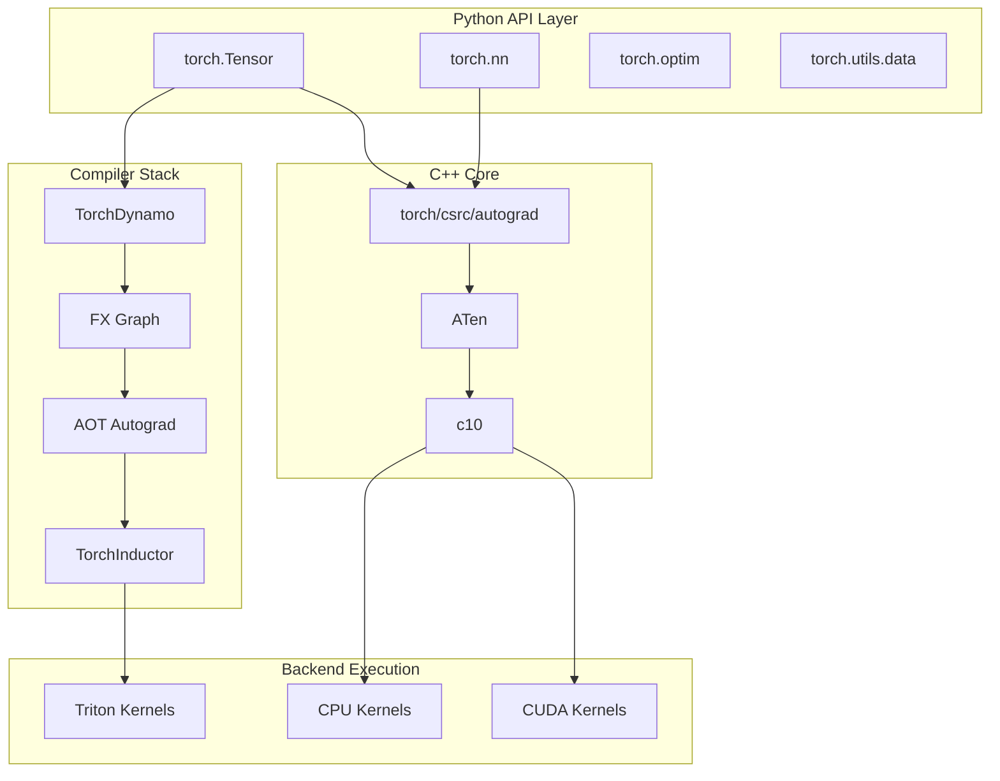
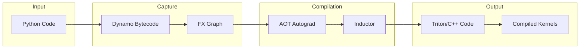

# DeepWiki

> 原文链接: https://wiki.litenext.digital/wiki/pytorch?file=02-core-tensor-library

---

# PyTorch Architecture Documentation

> **Generated**: 2026-01-25 | **Commit**: ac1325580a6 | **Branch**: main

## Purpose

This documentation provides a comprehensive guide to PyTorch's internal architecture for developers who need to:

-   Contribute to PyTorch core
-   Understand internals for deep integration
-   Debug complex issues across the stack
-   Extend PyTorch with custom components

## Quick Navigation

| Section | Topic | Key Concepts |
| --- | --- | --- |
| 01-overview | Architecture Overview | Directory structure, layer diagram |
| 02-tensor-fundamentals | Core Tensor System | TensorImpl, Storage, ScalarType |
| 03-dispatch-system | Operator Dispatch | DispatchKey, Dispatcher |
| 04-aten-operators | ATen Operations | native_functions.yaml, TensorIterator |
| 05-autograd-engine | Automatic Differentiation | Engine, Node, Edge |
| 06-python-cpp-bindings | Python-C++ Integration | pybind11, Module.cpp |
| 07-torchscript-jit | TorchScript JIT | IR, Graph, passes |
| 08-torch-compile | Modern Compiler Stack | Dynamo, Inductor, FX |
| 09-nn-module-system | Neural Network Modules | nn.Module, hooks |
| 10-distributed-training | Distributed Systems | DDP, FSDP, DTensor |
| 11-data-loading | Data Pipeline | DataLoader, Dataset |
| 12-quantization | Quantization Framework | Observers, FakeQuantize |
| 13-export-deployment | Model Export | torch.export, ONNX |
| 14-build-testing | Build and Testing | CMake, TestCase |
| 15-evolution-roadmap | Evolution and Roadmap | Recent changes, future |

## Reading Paths

### New Contributor Path

1.  [01-overview](01-overview.md) - Understand the codebase layout
2.  [14-build-testing](14-build-testing.md) - Set up development environment
3.  [02-tensor-fundamentals](02-tensor-fundamentals.md) - Core data structures
4.  [03-dispatch-system](03-dispatch-system.md) - How operators are routed

### Compiler/JIT Developer Path

1.  [08-torch-compile](08-torch-compile.md) - Modern compiler stack
2.  [07-torchscript-jit](07-torchscript-jit.md) - TorchScript internals
3.  [05-autograd-engine](05-autograd-engine.md) - Gradient computation

### Distributed Systems Path

1.  [10-distributed-training](10-distributed-training.md) - DDP, FSDP, DTensor
2.  [09-nn-module-system](09-nn-module-system.md) - Module abstractions
3.  [13-export-deployment](13-export-deployment.md) - Model serialization

### Performance Optimization Path

1.  [03-dispatch-system](03-dispatch-system.md) - Dispatch overhead
2.  [08-torch-compile](08-torch-compile.md) - Compilation strategies
3.  [12-quantization](12-quantization.md) - Quantization techniques

## High-Level Architecture



## Component Interactions



## Directory Structure Overview

```text
pytorch/
├── torch/                    # Python package root
│   ├── _dynamo/              # TorchDynamo bytecode tracer
│   ├── _inductor/            # TorchInductor code generator
│   ├── _export/              # torch.export infrastructure
│   ├── fx/                   # FX graph representation
│   ├── nn/                   # Neural network modules
│   ├── distributed/          # Distributed training
│   ├── ao/                   # Architecture optimization (quantization)
│   └── csrc/                 # C++ source for Python bindings
│       ├── autograd/         # Autograd engine
│       └── jit/              # TorchScript JIT
├── aten/                     # ATen tensor library
│   └── src/ATen/
│       ├── native/           # Native operator implementations
│       └── core/             # Core tensor operations
├── c10/                      # Core library
│   ├── core/                 # TensorImpl, Storage, DispatchKey
│   └── util/                 # Utilities
├── test/                     # Python tests
├── tools/                    # Build and code generation tools
└── CMakeLists.txt            # CMake build configuration
```

## Glossary

| Term | Definition |
| --- | --- |
| ATen | "A Tensor" library - PyTorch's C++ tensor library |
| c10 | Core library with fundamental abstractions |
| DispatchKey | Tag identifying how an operator should be routed |
| Dynamo | Python bytecode tracer for torch.compile |
| FX | Graph representation for Python-level transformations |
| Inductor | Backend compiler generating Triton/C++ code |
| TensorImpl | Core C++ class holding tensor metadata and storage |
| TensorIterator | Framework for implementing element-wise operations |
| TORCH_LIBRARY | Macro for registering operators with the dispatcher |

## Key Design Principles

1.  **Eager-First**: PyTorch prioritizes eager execution with optional compilation
2.  **Layered Architecture**: Clear separation between Python API, C++ core, and backends
3.  **Extensibility**: Plugin points for custom operators, backends, and transforms
4.  **Backward Compatibility**: Careful deprecation cycles and migration paths
5.  **Performance**: Zero-overhead abstractions where possible

* * *

_This documentation is auto-generated and may not reflect the latest changes. For authoritative information, consult the source code._
