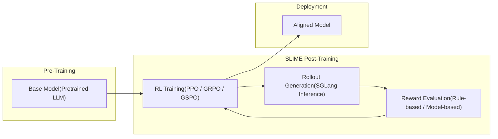
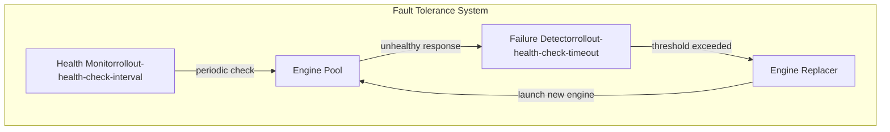
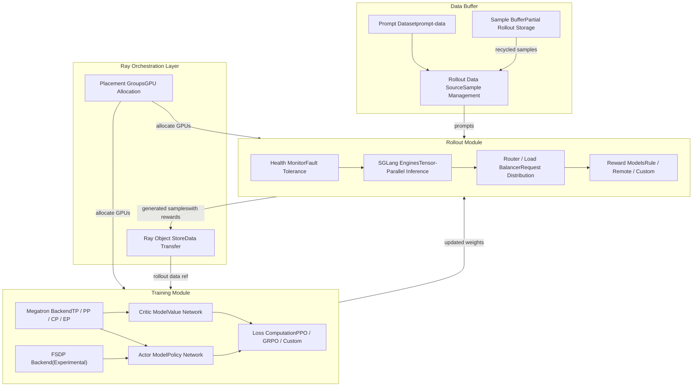
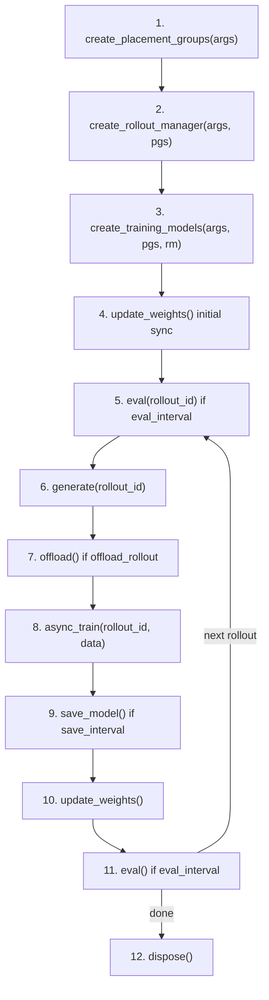
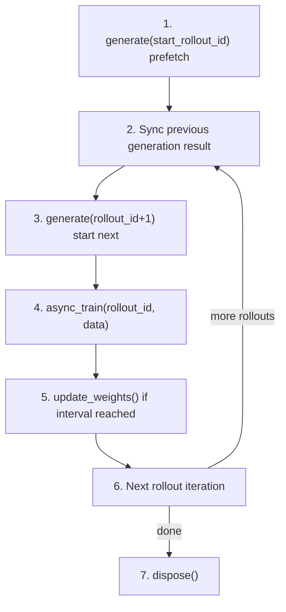

# DeepWiki

> 原文链接: https://wiki.litenext.digital/wiki/slime?file=01-overview

---
### Files

← Back

-   ●

    index

-   01-overview

-   02-distributed-orchestration

-   03-training-backends

-   04-rollout-system

-   05-router-inference

-   06-utilities-algorithms

-   07-plugins-model-support

# slime

Viewing: 01-overview

Edit

[<-Back to Index](index.md)

# Overview and Core Concepts

**Part of**: [Architecture Documentation](index.md) **Generated**: 2026-02-25T00:00:00Z **Source commit**: 7014942c

* * *

## Introduction

SLIME is an LLM post-training framework designed for reinforcement learning (RL) scaling at production scale. It provides an end-to-end pipeline that connects high-performance distributed training with high-throughput inference, orchestrated through a unified control plane. SLIME has been used to train and refine some of the most capable large language models in production today, including GLM-5, GLM-4.x, Qwen3, DeepSeek V3, and Llama 3 series models.

The framework exposes two entry points that represent its two primary operating modes:

-   **`train.py`** -- The synchronous training loop. Each iteration completes rollout generation, training, and weight synchronization in strict sequence before advancing to the next step. This mode is straightforward, supports colocated GPU configurations, and provides deterministic step-by-step execution.

-   **`train_async.py`** -- The asynchronous training loop with pipelining. The next rollout generation is launched before the current training step finishes, overlapping compute-intensive phases across the training and inference subsystems. This mode yields higher GPU utilization and throughput but requires dedicated (non-colocated) GPU allocations.

Both entry points share the same initialization sequence -- argument parsing, placement group creation, rollout manager instantiation, and training model construction -- but differ in how they schedule the generate-train-update cycle within the main loop.

```python

if __name__ == "__main__":
    args = parse_args()
    train(args)
```

The following diagram illustrates the position of SLIME within a typical LLM post-training workflow:

Deployment

SLIME Post-Training

Pre-Training

Base Model(Pretrained LLM)

RL Training(PPO / GRPO / GSPO)

Rollout Generation(SGLang Inference)

Reward Evaluation(Rule-based / Model-based)

Aligned Model

* * *

## Project Philosophy

SLIME is built around several core design principles that shape every aspect of the framework, from its module boundaries to its configuration system.

### SGLang-Native Inference

Rather than implementing a custom inference engine or wrapping a generic one, SLIME is built directly around SGLang as its inference backbone. SGLang engines are launched as Ray actors, managed through a load-balancing router, and communicate via HTTP APIs. This means SLIME inherits SGLang's optimizations -- RadixAttention for prefix caching, continuous batching, tensor parallelism, and efficient memory management -- without reimplementation. The `--sglang-*` family of arguments allows full control over SGLang server parameters, and the weight update protocol transfers trained parameters from Megatron directly into running SGLang instances without server restarts.

### Separation of Concerns


| Subsystem | Responsibility | Technology |
| --- | --- | --- |
| Training | Gradient computation, parameter updates, checkpointing | Megatron-LM or FSDP |
| Inference | Token generation, log-probability computation, reward evaluation | SGLang + Router |
| Orchestration | Resource allocation, lifecycle management, data flow | Ray |

SLIME enforces a clean three-way separation between its major subsystems:

Subsystem

Responsibility

Technology

**Training**

Gradient computation, parameter updates, checkpointing

Megatron-LM or FSDP

**Inference**

Token generation, log-probability computation, reward evaluation

SGLang + Router

**Orchestration**

Resource allocation, lifecycle management, data flow

Ray

Each subsystem runs in its own set of processes and communicates through well-defined interfaces. Training processes never import SGLang directly; inference engines never import Megatron. Ray actors serve as the bridge, managing placement groups to allocate GPUs and transferring data through the Ray object store.

### Pluggable Design


| Plugin Point | Argument | Default |
| --- | --- | --- |
| Rollout function | --rollout-function-path | slime.rollout.sglang_rollout.generate_rollout |
| Reward model | --custom-rm-path | Built-in rule/remote RM |
| Loss function | --custom-loss-function-path | PPO policy loss |
| Data source | --data-source-path | slime.rollout.data_source.RolloutDataSourceWithBuffer |
| Generate function | --custom-generate-function-path | Built-in SGLang generate |
| Dynamic sampling filter | --dynamic-sampling-filter-path | None (accept all) |
| Buffer filter | --buffer-filter-path | FIFO pop |

Almost every user-facing behavior in SLIME can be replaced through path-based plugin arguments. Rather than requiring source modifications or subclassing, users point to their own Python functions or classes via command-line flags:

Plugin Point

Argument

Default

Rollout function

`--rollout-function-path`

`slime.rollout.sglang_rollout.generate_rollout`

Reward model

`--custom-rm-path`

Built-in rule/remote RM

Loss function

`--custom-loss-function-path`

PPO policy loss

Data source

`--data-source-path`

`slime.rollout.data_source.RolloutDataSourceWithBuffer`

Generate function

`--custom-generate-function-path`

Built-in SGLang generate

Dynamic sampling filter

`--dynamic-sampling-filter-path`

None (accept all)

Buffer filter

`--buffer-filter-path`

FIFO pop

This plugin architecture allows teams to implement custom multi-turn environments, tool-calling workflows, specialized reward functions, and novel data sampling strategies without modifying the core framework.

### Production-Grade Reliability

SLIME includes fault tolerance mechanisms designed for long-running training campaigns on large clusters. The `--use-fault-tolerance` flag enables automatic health monitoring of SGLang inference engines through periodic `/health_generate` checks. Unhealthy engines are detected, terminated, and replaced by fresh instances without stopping the training run. Checkpointing supports both Megatron-format and HuggingFace-format saves (`--save-hf`), with optional asynchronous saving (`--async-save`) to avoid blocking the training loop.

Fault Tolerance System

periodic check

unhealthy response

threshold exceeded

launch new engine

Health Monitorrollout-health-check-interval

Engine Pool

Failure Detectorrollout-health-check-timeout

Engine Replacer

* * *

## High-Level Architecture

The SLIME architecture consists of three primary modules that interact through Ray-mediated data flow. The following diagram shows how these modules relate to each other:


Router / Load BalancerRequest Distribution

Reward ModelsRule / Remote / Custom

Health MonitorFault Tolerance

Training Module

Megatron BackendTP / PP / CP / EP

Actor ModelPolicy Network

Critic ModelValue Network

FSDP Backend(Experimental)

Loss ComputationPPO / GRPO / Custom

Placement GroupsGPU Allocation

Ray Object StoreData Transfer

Prompt Datasetprompt-data

Rollout Data SourceSample Management

Sample BufferPartial Rollout Storage

### Training Module

The training module is responsible for computing gradients and updating model parameters. It supports two backends:

-   **Megatron-LM** (default, `--train-backend megatron`): Full support for tensor parallelism (`--tensor-model-parallel-size`), pipeline parallelism (`--pipeline-model-parallel-size`), context parallelism, expert parallelism for MoE models, and FP8 training. The Megatron backend handles weight conversion between Megatron internal format and HuggingFace format for SGLang consumption.

-   **FSDP** (experimental, `--train-backend fsdp`): PyTorch Fully Sharded Data Parallelism for simpler setups. Currently being rewritten and recommended only for development use.

The training module manages two model instances: the **actor** (policy network being optimized) and optionally a **critic** (value network for advantage estimation in PPO). A frozen **reference model** can also be maintained for KL divergence computation.

### Rollout Module

The rollout module generates training data by running inference on the current policy. SGLang engines are launched as Ray actors, each running a tensor-parallel inference server. A router distributes requests across engines for load balancing. After generation, each sample is scored by a reward model -- either rule-based, remote API, or custom function. The module supports dynamic sampling filters (accepting only samples where rewards have nonzero variance across a prompt group, as in DAPO) and partial rollout (recycling incomplete generations back to the buffer for later completion).

### Data Buffer

The data buffer manages the flow of prompts and samples between the rollout and training modules. The `RolloutDataSourceWithBuffer` class (`slime/rollout/data_source.py`) maintains a prompt dataset and an in-memory buffer of partially completed samples. It supplies prompts to the rollout module and receives completed samples back, supporting epoch-based iteration with optional shuffling.

* * *

## Training Loop Flow

### Synchronous Training Loop

The synchronous loop in `train.py` executes each phase sequentially. This is the simplest mode and supports all features including colocated GPU configurations and memory offloading.

next rollout

done

1\. create\_placement\_groups(args)

2\. create\_rollout\_manager(args, pgs)

3\. create\_training\_models(args, pgs, rm)


Key code references for the synchronous loop:

```python

for rollout_id in range(args.start_rollout_id, args.num_rollout):
    if args.eval_interval is not None and rollout_id == 0 and not args.skip_eval_before_train:
        ray.get(rollout_manager.eval.remote(rollout_id))

    rollout_data_ref = ray.get(rollout_manager.generate.remote(rollout_id))

    if args.offload_rollout:
        ray.get(rollout_manager.offload.remote())

    if args.use_critic:
        critic_train_handle = critic_model.async_train(rollout_id, rollout_data_ref)
        if rollout_id >= args.num_critic_only_steps:
            ray.get(actor_model.async_train(rollout_id, rollout_data_ref))
        ray.get(critic_train_handle)
    else:
        ray.get(actor_model.async_train(rollout_id, rollout_data_ref))

```

### Asynchronous Training Loop

The asynchronous loop in `train_async.py` overlaps rollout generation with training by launching the next generation before the current training step completes. This requires dedicated (non-colocated) GPUs since both subsystems run simultaneously.

more rollouts

done

1\. generate(start\_rollout\_id) prefetch

2\. Sync previous generation result

3\. generate(rollout\_id+1) start next

4\. async\_train(rollout\_id, data)

5\. update\_weights() if interval reached

6\. Next rollout iteration

7\. dispose()

The critical difference is visible in the pipelining logic:

```python

rollout_data_next_future = rollout_manager.generate.remote(args.start_rollout_id)
for rollout_id in range(args.start_rollout_id, args.num_rollout):

    if rollout_data_next_future is not None:
        rollout_data_curr_ref = ray.get(rollout_data_next_future)

    if rollout_id + 1 < args.num_rollout:
        rollout_data_next_future = rollout_manager.generate.remote(rollout_id + 1)
```

Note the assertion at `train_async.py:11` that colocation is not supported for async training, since overlapping requires both training and inference GPUs to be active simultaneously:

```python

assert not args.colocate, "Colocation is not supported for async training."
```

The following diagram contrasts the GPU timeline of both modes:

012345678910111213Generate R0 Generate R0 Train R0 Train R0 Generate R1 Update Weights Update Weights Generate R1 Train R1 Generate R2 Train R1 SynchronousAsynchronousGPU Timeline Comparison

* * *

## Supported Models


| Model Family | Variants | Architecture Type |
| --- | --- | --- |
| Qwen3 | Qwen3Next-80B-A3B, Qwen3-235B-A22B, Qwen3-30B-A3B, Qwen3-32B, Qwen3-8B, Qwen3-4B, Qwen3-VL | Dense + MoE |
| Qwen2.5 | 0.5B, 1.5B, 3B, 7B, 14B, 32B, 72B | Dense |
| DeepSeek | DeepSeek V3, DeepSeek R1 | MoE (MLA + DeepSeekMoE) |
| GLM | GLM-5 (744B-A40B), GLM-4.7, GLM-4.5, GLM-4, GLM-4-MoE | Dense + MoE |
| Llama | Llama 3.1, Llama 3.2 | Dense |
| MIMO | MIMO-7B | Dense |
| Moonlight | Moonlight-16B-A3B | MoE |

SLIME supports a broad range of model architectures through its Megatron-to-HuggingFace weight conversion system. The converter dispatches based on model name to architecture-specific handlers defined in `slime/backends/megatron_utils/megatron_to_hf/__init__.py:34-54`:

```python

def _convert_to_hf_core(args, model_name, name, param):
    if "glm4moelite" in model_name or "deepseekv3" in model_name:
        converted_named_tensors = convert_deepseekv3_to_hf(args, name, param)
    elif "glm4moe" in model_name:
        converted_named_tensors = convert_glm4moe_to_hf(args, name, param)
    elif "glm4" in model_name:
        converted_named_tensors = convert_glm4_to_hf(args, name, param)
    elif "qwen3moe" in model_name:
        converted_named_tensors = convert_qwen3moe_to_hf(args, name, param)
    elif "qwen3next" in model_name:
        converted_named_tensors = convert_qwen3_next_to_hf(args, name, param)
    elif "qwen3vl" in model_name:
        converted_named_tensors = convert_qwen3vl_to_hf(args, name, param)
    elif "qwen2" in model_name or "qwen3" in model_name:
        converted_named_tensors = convert_qwen2_to_hf(args, name, param)
    elif "llama" in model_name:
        converted_named_tensors = convert_llama_to_hf(args, name, param)
    elif "mimo" in model_name:
        converted_named_tensors = convert_mimo_to_hf(args, name, param)
```

The supported model families and their confirmed variants are:

Model Family

Variants

Architecture Type

**Qwen3**

Qwen3Next-80B-A3B, Qwen3-235B-A22B, Qwen3-30B-A3B, Qwen3-32B, Qwen3-8B, Qwen3-4B, Qwen3-VL

Dense + MoE

**Qwen2.5**

0.5B, 1.5B, 3B, 7B, 14B, 32B, 72B

Dense

**DeepSeek**

DeepSeek V3, DeepSeek R1

MoE (MLA + DeepSeekMoE)

**GLM**

GLM-5 (744B-A40B), GLM-4.7, GLM-4.5, GLM-4, GLM-4-MoE

Dense + MoE

**Llama**

Llama 3.1, Llama 3.2

Dense

**MIMO**

MIMO-7B

Dense

**Moonlight**

Moonlight-16B-A3B

MoE

The FSDP backend provides additional model support through its own model definitions in `slime/backends/fsdp_utils/models/`, currently including Qwen3 MoE variants.

* * *

## Configuration System

SLIME's configuration system merges arguments from three distinct sources into a single namespace. The parsing process is implemented in `slime/utils/arguments.py:1448-1499` and follows a multi-phase approach:

Phase 3: Merge + Validate

Phase 2: Training + SLIME Args


SLIME Args Providerget\_slime\_extra\_args\_provider()


### Argument Categories

The SLIME-specific arguments are organized into logical groups within the `get_slime_extra_args_provider` function (`slime/utils/arguments.py:34-1429`). Each group is added by a nested function:

**Cluster Arguments** (`add_cluster_arguments`) -- Control GPU allocation across the distributed system:

-   `--actor-num-nodes`, `--actor-num-gpus-per-node`: Training actor GPU topology
-   `--critic-num-nodes`, `--critic-num-gpus-per-node`: Critic model GPU topology
-   `--rollout-num-gpus`, `--rollout-num-gpus-per-engine`: Inference GPU allocation
-   `--colocate`: Share GPUs between training and inference
-   `--offload-train`, `--offload-rollout`: CPU offloading for memory optimization

**Training Arguments** (`add_train_arguments`) -- Training-specific configuration:

-   `--train-backend`: Choose between `megatron` and `fsdp`
-   `--qkv-format`: QKV layout for Megatron (`thd` or `bshd`)
-   `--custom-model-provider-path`: Custom model architecture
-   `--only-train-params-name-list`, `--freeze-params-name-list`: Selective parameter training

**Rollout Arguments** (`add_rollout_arguments`) -- Inference and generation settings:

-   `--hf-checkpoint`: HuggingFace model path for SGLang initialization
-   `--rollout-function-path`: Custom rollout function
-   `--rollout-temperature`, `--rollout-top-p`, `--rollout-top-k`: Sampling parameters
-   `--rollout-max-response-len`, `--rollout-max-context-len`: Length constraints
-   `--partial-rollout`: Enable recycling of incomplete generations

**Data Arguments** (`add_data_arguments`) -- Dataset and batching configuration:

-   `--prompt-data`: Path to JSONL prompt dataset
-   `--rollout-batch-size`: Number of prompts per rollout step
-   `--n-samples-per-prompt`: Responses per prompt (for GRPO-style training)
-   `--use-dynamic-batch-size`, `--max-tokens-per-gpu`: Dynamic batching

**Algorithm Arguments** (`add_algo_arguments`) -- RL algorithm configuration:

-   `--advantage-estimator`: Choose `grpo`, `gspo`, `ppo`, `reinforce_plus_plus`, or `reinforce_plus_plus_baseline`
-   `--loss-type`: Choose `policy_loss`, `sft_loss`, or `custom_loss`
-   `--eps-clip`, `--eps-clip-high`: PPO clipping range
-   `--kl-coef`, `--kl-loss-coef`: KL divergence penalties
-   `--use-opd`: Enable on-policy distillation

**Evaluation Arguments** (`add_eval_arguments`) -- Evaluation during training:

-   `--eval-interval`: Evaluate every N rollout steps
-   `--eval-prompt-data`: Separate evaluation dataset
-   `--eval-config`: YAML configuration for multiple eval datasets

**Fault Tolerance Arguments** (`add_fault_tolerance_arguments`) -- Production reliability:

-   `--use-fault-tolerance`: Enable automatic engine recovery
-   `--rollout-health-check-interval`: Seconds between health checks
-   `--rollout-health-check-timeout`: Seconds before marking an engine as dead

* * *

## Key Design Decisions

### Ray for Distributed Orchestration

SLIME uses Ray as its distributed computing backbone rather than relying solely on PyTorch's distributed primitives. Ray provides several capabilities that are critical for SLIME's architecture:

**Placement Groups** -- Ray placement groups ensure that training and inference processes are allocated to specific GPUs with deterministic ordering. The `create_placement_groups` function (`slime/ray/placement_group.py:79-119`) creates a single placement group containing all GPUs, then partitions it into actor, critic, and rollout segments based on configuration:

```python

def create_placement_groups(args):
    """Create placement groups for actor and rollout engines."""
    num_gpus = 0
    if args.debug_train_only:
        num_gpus = args.actor_num_nodes * args.actor_num_gpus_per_node

    elif args.colocate:
        num_gpus = args.actor_num_nodes * args.actor_num_gpus_per_node

    else:
        num_gpus = (args.actor_num_nodes * args.actor_num_gpus_per_node
                    + args.rollout_num_gpus)

    return {
        "actor": (pg, actor_indices, actor_gpu_ids),
        "critic": (pg, critic_indices, critic_gpu_ids) if args.use_critic else None,
        "rollout": (pg, rollout_indices, rollout_gpu_ids),
    }
```

**Actor Model** -- Ray actors manage the lifecycle of both training processes (`RayTrainGroup`) and inference engines (`SGLangEngine`). The `RayTrainGroup` class (`slime/ray/actor_group.py`) allocates fractional GPU resources (0.4 GPUs per actor by default) to enable co-scheduling with inference on the same physical GPUs when colocated.

**Object Store** -- Rollout data is passed between the rollout manager and training models through Ray object references. This avoids serialization overhead for large tensors and enables zero-copy data sharing when processes are on the same node.

### Async Pipelining for Throughput

The async training loop (`train_async.py`) uses a simple but effective pipelining strategy: start generating the next batch of rollout data while the current batch is being trained. The key constraint is that weight updates must not overlap with generation -- when `update_weights_interval` is reached, the loop synchronizes any pending generation before updating:

```python

if (rollout_id + 1) % args.update_weights_interval == 0:

    rollout_data_curr_ref = ray.get(x) if (x := rollout_data_next_future) is not None else None
    rollout_data_next_future = None
    actor_model.update_weights()
```

This design means the async mode introduces a controlled amount of off-policy training (generation uses weights from the previous update), which can be mitigated through techniques like importance sampling (`--use-tis`) or off-policy sequence masking (`--use-opsm`).

### Memory Optimization via Offloading

When training and inference share the same GPUs (`--colocate`), SLIME uses a time-multiplexing approach: only one subsystem occupies GPU memory at a time, with the other offloaded to CPU. The `--offload-train` and `--offload-rollout` flags control this behavior, and colocation mode enables both automatically.

The offloading sequence in the synchronous loop follows this pattern:


This allows training large models on fewer GPUs at the cost of added offloading latency. For maximum throughput with sufficient GPU resources, the dedicated (non-colocated) mode avoids offloading entirely.

### Colocated vs. Dedicated GPU Modes

The choice between colocated and dedicated GPU modes represents a fundamental resource-efficiency tradeoff:

```mermaid
gantt
    title GPU Timeline Comparison
    dateFormat X
    axisFormat %s

    section Synchronous
    Generate R0       :g0, 0, 3
    Train R0          :t0, 3, 6
    Update Weights    :u0, 6, 7
    Generate R1       :g1, 7, 10
    Train R1          :t1, 10, 13

    section Asynchronous
    Generate R0       :ag0, 0, 3
    Train R0          :at0, 3, 6
    Generate R1       :ag1, 3, 6
    Update Weights    :au0, 6, 7
    Train R1          :at1, 7, 10
    Generate R2       :ag2, 7, 10
```


-   **Colocated** (`--colocate`): Training and inference share the same GPUs. Only one is active at a time, with offloading between phases. Requires fewer total GPUs but introduces offloading latency. Incompatible with async pipelining.

-   **Dedicated** (default): Training and inference each have their own GPU allocation. Both can run simultaneously, enabling async pipelining. Requires more total GPUs but maximizes throughput.

The GPU allocation is computed in `create_placement_groups` (`slime/ray/placement_group.py:79-119`), where the total GPU count and offset calculations differ based on the `--colocate` flag.

* * *

## Summary

SLIME is a production-grade LLM post-training framework that connects Megatron-based distributed training with SGLang-powered inference through Ray orchestration. Its architecture is defined by clean separation between training, inference, and orchestration; a pluggable design that allows customization of rollout functions, reward models, loss functions, and data sources; and practical production features including fault tolerance, async pipelining, and memory offloading.

The framework provides two operating modes -- synchronous (`train.py`) for simplicity and full feature support, and asynchronous (`train_async.py`) for higher throughput through pipelined generation and training. Its configuration system merges Megatron, SGLang, and SLIME-specific arguments into a unified namespace, organized into logical groups covering cluster topology, training parameters, rollout behavior, RL algorithms, evaluation, and fault tolerance.

SLIME supports a wide range of model architectures through its weight conversion system, including Qwen3 (dense and MoE variants), Qwen2.5, DeepSeek V3/R1, GLM-4/5 (including MoE), Llama 3, and MIMO. It implements multiple RL algorithms (PPO, GRPO, GSPO, REINFORCE++) with advanced features like on-policy distillation, dynamic sampling filters, partial rollout, and off-policy correction through importance sampling.

The subsequent sections of this documentation cover each subsystem in detail:

-   [Distributed Orchestration with Ray](02-distributed-orchestration.md) -- Placement groups, actor management, and GPU allocation
-   [Training Backends](03-training-backends.md) -- Megatron and FSDP training, loss computation, and weight management
-   [Rollout and Data Generation](04-rollout-system.md) -- SGLang rollout, reward models, data sources, and filtering
-   [Router and Inference Engine](05-router-inference.md) -- Load balancing, SGLang engine management, and middleware
-   [Utilities and Algorithms](06-utilities-algorithms.md) -- PPO/GRPO/GSPO implementations, masking, and balancing
-   [Plugin System and Model Support](07-plugins-model-support.md) -- Model bridges, custom models, and rollout buffer
