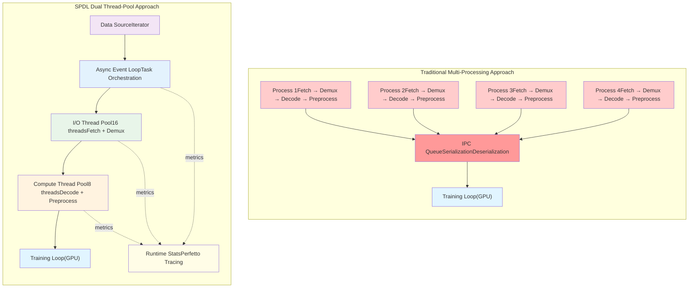
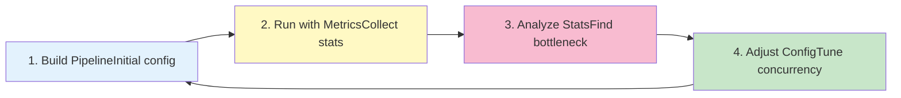
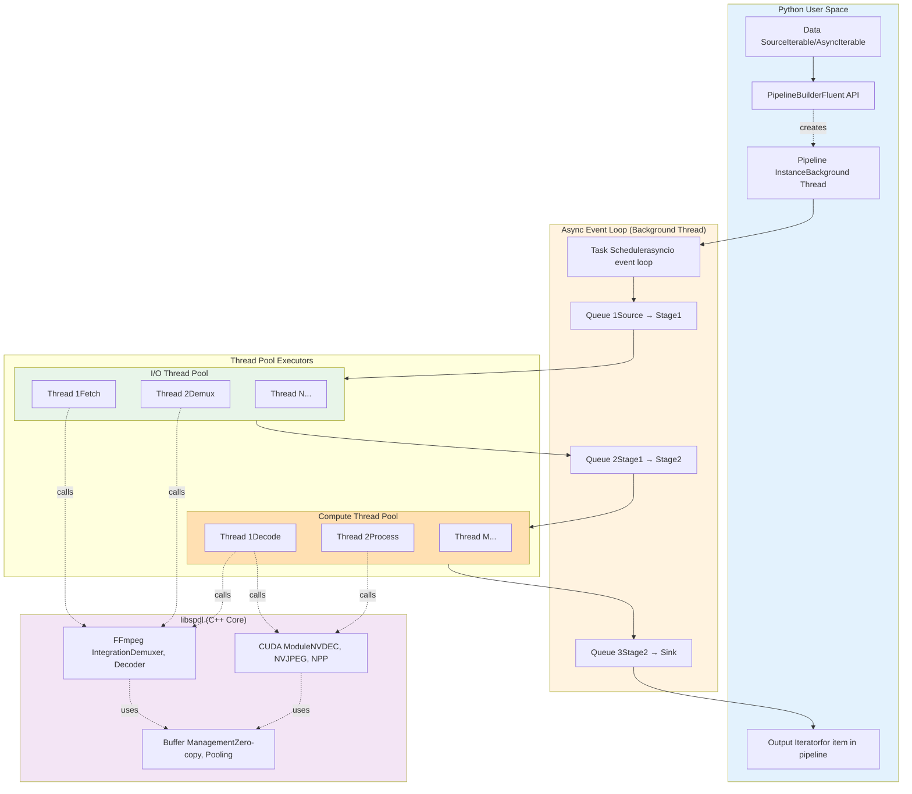

# DeepWiki

> 原文链接: https://wiki.litenext.digital/wiki/spdl?file=01-overview

---
### Files

← Back

-   index

-   01-overview

-   02-installation-setup

-   03-core-architecture

-   04-pipeline-system

-   05-async-event-loop

-   06-io-layer-overview

-   07-demuxing-decoding

-   08-hardware-acceleration

-   09-cpp-implementation

-   10-python-bindings

-   11-dataloader-integration

-   12-performance-optimization

-   13-testing-validation

-   14-evolution-roadmap

# spdl

Viewing: 01-overview

Edit

# 01 - Overview

[← Back to Index](index.md)

* * *

## What is SPDL?

**SPDL (Scalable and Performant Data Loading)** is Meta's high-performance library for building efficient data preprocessing pipelines, primarily aimed at machine learning and AI applications. Created by engineers and researchers at Meta's Reality Labs who work on optimizing GPU workloads, SPDL represents a fundamental rethinking of how data loading should work in modern ML training systems.

SPDL provides flexible pipeline abstraction and high-performance I/O operations for multimedia processing, specifically designed to overcome the limitations of traditional Python-based data loaders. It achieves this through a unique dual thread-pool architecture that separates I/O and compute operations, hardware acceleration support, and built-in observability features that enable iterative performance optimization.

### Core Capabilities

-   **Flexible Pipeline Abstraction** - Intuitive builder API for constructing complex data processing workflows
-   **High-Performance Media I/O** - Custom-built multimedia processing designed from scratch for maximum throughput
-   **Observable Performance** - Built-in runtime statistics and Perfetto tracing to identify bottlenecks
-   **Thread-Based Parallelism** - Efficient multi-threaded execution even under Python's Global Interpreter Lock (GIL)
-   **Hardware Acceleration** - First-class support for NVDEC, NVJPEG, and CUDA for GPU-accelerated processing
-   **Zero-Copy Operations** - Minimal memory copies through careful buffer management and shared memory

SPDL is **not** a drop-in replacement for existing data loaders, nor does it guarantee automatic performance improvements. Instead, it provides the flexibility and observability needed to iteratively optimize data loading pipelines for specific workloads and environments.

### Project Statistics

| Metric | Count | Details |
| --- | --- | --- |
| Python Source Files | 54 | Core pipeline, I/O APIs, utilities |
| C++ Source Files | 89 | libspdl core, CUDA modules |
| Python Lines of Code | ~13,000 | Interface layer, async orchestration |
| C++ Lines of Code | ~13,000 | FFmpeg integration, GPU kernels |
| Primary Languages | 2 | Python 3.8+, C++17 |
| FFmpeg Versions | 4-8 | Supports multiple FFmpeg versions |
| CUDA Compute Capability | 7.5+ | Turing, Ampere, Ada, Hopper |
| Hardware Acceleration | 3 | NVDEC, NVJPEG, NPP |
| License | BSD 2-Clause | Open source |



7.5+


## The Problem Statement

Traditional data loading solutions face critical bottlenecks that limit ML training efficiency and scalability. Understanding these challenges is essential to appreciating SPDL's design decisions.

### 1\. The GIL Bottleneck and Multi-Processing Overhead

Python's Global Interpreter Lock (GIL) prevents multiple native threads from executing Python bytecode simultaneously. This forces most data loaders to use **multi-processing** for parallelism, which introduces significant overhead:

**Process-Based Problems:**

-   **Heavy memory overhead** - Each process duplicates the entire Python runtime and loaded data
-   **IPC serialization costs** - Data must be pickled/unpickled when crossing process boundaries
-   **Slow process creation** - Spawning processes takes hundreds of milliseconds vs. microseconds for threads
-   **Complex debugging** - Cross-process issues are harder to trace and profile
-   **"Noisy neighbor" problem** - High CPU utilization from data workers degrades GPU training performance

**Comparison:**


### 2\. Inability to Separate I/O and Compute Workloads

Media decoding involves fundamentally different types of operations with different bottleneck characteristics:

**I/O-Bound Operations:**

-   Data acquisition from network or remote storage
-   Demuxing (parsing container formats like MP4)
-   Database queries for metadata
-   Characteristics: Mostly waiting, minimal CPU usage, benefits from high concurrency

**Compute-Bound Operations:**

-   Video/audio decoding (H.264, AAC)
-   Image decompression (JPEG, PNG)
-   Preprocessing (resizing, color conversion)
-   Data augmentation
-   Characteristics: CPU/GPU intensive, saturates cores, benefits from matching core count

**The Configuration Dilemma:**

Traditional solutions use a **single thread pool or process pool** for all operations. This creates an impossible choice:

-   **High concurrency (16+ workers)**: Good for I/O, but over-subscribes CPU for compute tasks
-   **Low concurrency (4-8 workers)**: Good for compute, but underutilizes network bandwidth for I/O

No single worker count optimally handles both workload types.

### 3\. Lack of Observability

Most data loading solutions operate as **black boxes**. When training throughput degrades, practitioners struggle to answer basic questions:

-   Which pipeline stage is the actual bottleneck?
-   What is the real CPU/GPU utilization per stage?
-   Are we I/O-bound or compute-bound?
-   How much time is spent in decoding vs. preprocessing?
-   Is the data pipeline keeping up with GPU consumption?

Without runtime statistics and profiling infrastructure, optimization becomes trial-and-error guesswork rather than data-driven engineering.

### Visual Comparison: Traditional vs. SPDL

SPDL Dual Thread-Pool Approach

metrics

metrics

metrics

Data SourceIterator

Async Event LoopTask Orchestration

I/O Thread Pool16 threadsFetch + Demux

Compute Thread Pool8 threadsDecode + Preprocess

Training Loop(GPU)

Runtime StatsPerfetto Tracing

Traditional Multi-Processing Approach

Process 1Fetch → Demux → Decode → Preprocess

IPC QueueSerializationDeserialization

Process 2Fetch → Demux → Decode → Preprocess

Process 3Fetch → Demux → Decode → Preprocess

Process 4Fetch → Demux → Decode → Preprocess

Training Loop(GPU)

**Key Differences:**

-   **Traditional**: All stages in each process, serialization overhead, high memory duplication
-   **SPDL**: Specialized thread pools, shared memory, observable metrics, independent tuning

## Core Innovations

SPDL introduces several architectural innovations that enable high-performance data loading in Python:

### 1\. Dual Thread-Pool Architecture

Inspired by Tesla's Accelerated Video Library (AI Day 2022), SPDL separates I/O and compute operations into **dedicated, independently-tunable thread pools**:

**I/O Thread Pool:**

-   High concurrency (16-64 threads typical)
-   Handles data acquisition, demuxing, network requests
-   Threads spend most time waiting (low CPU usage)
-   Scale to saturate network bandwidth or handle many concurrent files

**Compute Thread Pool:**

-   Moderate concurrency (match CPU core count, 4-16 threads typical)
-   Handles decoding, preprocessing, transformations
-   Threads saturate CPU cores
-   Scale to match available compute resources

**Adaptive Configuration Examples:**

Environment

I/O Pool

Compute Pool

Rationale

Local SSD storage

4 threads

12 threads

Fast I/O, focus on decode

Network storage (1Gbps)

32 threads

8 threads

Saturate bandwidth

GPU decoding (NVDEC)

16 threads

4 threads

GPU does heavy lifting

This design enables **independent tuning**: Increase I/O pool size to saturate network bandwidth while keeping compute pool matched to CPU cores—all without affecting other stages.

### 2\. Async/Await Pipeline Orchestration

SPDL uses an **async event loop** at its core to coordinate pipeline execution:

**Architecture:**

-   Single-threaded event loop manages all task scheduling
-   Synchronous operations automatically wrapped and dispatched to thread pools
-   Async operations execute directly on event loop (no thread overhead)
-   Generator functions (sync/async) enable streaming transformations

**Benefits:**

-   Efficient task scheduling without context switching overhead
-   Clear separation between orchestration logic and execution
-   Natural support for mixing async I/O with sync compute
-   Paves the way for Python 3.13+ free-threaded mode

**Example - Mixing Async and Sync:**

```python
async def fetch_metadata(url):
    """Async I/O - runs on event loop"""
    async with aiohttp.ClientSession() as session:
        async with session.get(url) as resp:
            return await resp.json()

def decode_video(path):
    """Sync compute - runs in thread pool, releases GIL"""
    return spdl.io.load_video(path, decoder="nvdec")

pipeline = (
    PipelineBuilder()
    .add_source(video_urls)
    .pipe(fetch_metadata)
    .pipe(decode_video)
    .add_sink()
    .build(num_threads=8)
)
```

### 3\. Hardware Acceleration Integration

SPDL provides **first-class support** for NVIDIA GPU acceleration:

**NVDEC (Video Decoding):**

-   Hardware decode for H.264, H.265, VP8, VP9
-   5-10x faster than CPU decode
-   Offloads CPU for other tasks
-   Supports multiple concurrent streams

**NVJPEG (JPEG Decoding):**

-   Batched JPEG decoding on GPU
-   10-20x speedup vs. CPU for large batches
-   Optimized for image classification workloads

**NPP (NVIDIA Performance Primitives):**

-   GPU color space conversion (NV12→RGB)
-   Resize operations
-   Batched preprocessing

**Custom CUDA Kernels:**

-   Optimized batched NV12 conversion
-   Zero-copy GPU memory management
-   Integration with PyTorch CUDA allocator

**Usage Example:**

```python

frames_cpu = spdl.io.load_video("video.mp4")

frames_gpu = spdl.io.load_video(
    "video.mp4",
    device_config=spdl.io.cuda_config(device_index=0),
    decoder="nvdec"
)
```

### 4\. Thread-Based Parallelism Under GIL

SPDL achieves high performance using **native threads** rather than processes:

**How It Works:**

-   **Release GIL in C++ code**: Media decoding happens in libspdl (C++), which releases GIL
-   **Minimal Python-C++ crossings**: Data moves between layers only at pipeline boundaries
-   **Zero serialization**: Threads share memory; data uses buffer protocol (zero-copy)
-   **Fast task creation**: Thread pool tasks spawn in microseconds

**Performance Benefits:**

-   3-5x throughput improvements over process-based solutions
-   50-70% lower memory usage
-   Better CPU efficiency (less "noisy neighbor" impact)
-   Free-threading ready for Python 3.13+

**GIL Release Points:**

```text
// libspdl C++ code releases GIL during I/O and compute
{
    py::gil_scoped_release release;  // Release GIL

    // These operations run in parallel across threads:
    demuxer.read_packets();
    decoder.decode_frame();
    converter.process_frame();

}  // Reacquire GIL
```

### 5\. Observable Performance

Every pipeline stage can be **instrumented with hooks** that export runtime statistics:

**Built-in Metrics:**

-   Task execution time (min, max, mean, percentiles)
-   Queue depth and wait times
-   Throughput (items/second)
-   Error rates and failures

**Perfetto Integration:**

-   Visual timeline of pipeline execution
-   Identify bottlenecks at a glance
-   Export traces for offline analysis

**Example Usage:**

```python
pipeline = (
    PipelineBuilder()
    .add_source(video_paths)
    .pipe(load_video, concurrency=8, name="decode")
    .pipe(preprocess, concurrency=4, name="preprocess")
    .add_sink()
    .build(
        num_threads=12,
        report_stats_interval=15.0
    )
)

```

This creates a **feedback loop** for optimization:

1\. Build PipelineInitial config

2\. Run with MetricsCollect stats

3\. Analyze StatsFind bottleneck

4\. Adjust ConfigTune concurrency

## Architecture Preview

SPDL's architecture cleanly separates concerns across multiple layers while maintaining high performance:

libspdl (C++ Core)

Thread Pool Executors

Async Event Loop (Background Thread)

Python User Space

Compute Thread Pool

I/O Thread Pool

creates

calls

calls

calls

calls

calls

uses

uses

Data SourceIterable/AsyncIterable

PipelineBuilderFluent API

Pipeline InstanceBackground Thread

Output Iteratorfor item in pipeline

Task Schedulerasyncio event loop

Queue 1Source → Stage1

Queue 2Stage1 → Stage2

Queue 3Stage2 → Sink

Thread 1Fetch

Thread 2Demux

Thread N...

Thread 1Decode

Thread 2Process

Thread M...

FFmpeg IntegrationDemuxer, Decoder

CUDA ModuleNVDEC, NVJPEG, NPP

Buffer ManagementZero-copy, Pooling

**Key Components:**

1.  **Python User Space**: High-level API for building and consuming pipelines
2.  **Event Loop**: Single-threaded async orchestrator running in background thread
3.  **Thread Pools**: Separate I/O and compute executors with independent concurrency
4.  **libspdl C++ Core**: Performance-critical operations with GIL release
5.  **Queues**: Buffered communication between stages with backpressure

**Data Flow:**

1.  User provides source iterator
2.  PipelineBuilder constructs pipeline configuration
3.  Pipeline.start() launches background thread with event loop
4.  Event loop dispatches tasks to appropriate thread pool
5.  Tasks execute with GIL released in C++ layer
6.  Results flow through queues back to user via iteration

## Quick Start Examples

### Example 1: Simple Transformation Pipeline

A basic pipeline demonstrating the builder pattern and async execution:

```python
from spdl.pipeline import PipelineBuilder

pipeline = (
    PipelineBuilder()
    .add_source(range(12))
    .pipe(lambda x: 2 * x)
    .pipe(lambda x: x + 1)
    .aggregate(3)
    .add_sink(buffer_size=3)
    .build(num_threads=4)
)

with pipeline.auto_stop():
    for batch in pipeline:
        print(batch)

```

**Key Concepts:**

-   **Fluent API**: Chain operations with `.pipe()`, `.aggregate()`, etc.
-   **Auto-stop context**: Ensures proper cleanup even on errors
-   **Lazy execution**: Pipeline starts only when iteration begins

### Example 2: Image Batch Loading with GPU

Loading and preprocessing images with hardware acceleration:

```python
import spdl.io
from spdl.pipeline import PipelineBuilder
from functools import partial

def batch_decode(paths, device_config):
    """Decode, resize, and batch images on GPU"""
    buffer = spdl.io.load_image_batch(
        paths,
        width=224,
        height=224,
        pix_fmt="rgb24",
        device_config=device_config,
        strict=False,
    )
    return spdl.io.to_torch(buffer)

device_config = spdl.io.cuda_config(device_index=0)
decode_fn = partial(batch_decode, device_config=device_config)

pipeline = (
    PipelineBuilder()
    .add_source(image_paths)
    .aggregate(32)
    .pipe(decode_fn, concurrency=8)
    .add_sink(buffer_size=4)
    .build(
        num_threads=16,
        report_stats_interval=15.0
    )
)

with pipeline.auto_stop():
    for batch_tensor in pipeline:

        train_step(batch_tensor)
```

**Advanced Features:**

-   **Batched decoding**: Process multiple images together for efficiency
-   **GPU direct**: Data goes directly to GPU (zero CPU→GPU copy)
-   **Performance monitoring**: Automatic stats reporting
-   **Error handling**: `strict=False` skips corrupted files

### Example 3: Video Decoding with NVDEC


| Method | Time (5 sec video) | Memory | GPU Usage |
| --- | --- | --- | --- |
| CPU decode | 450ms | Low | 0% |
| NVDEC | 85ms | Medium | 15% |

Loading video frames using hardware acceleration:

```python
import spdl.io

frames_cpu = spdl.io.load_video(
    "video.mp4",
    start=10.0,
    duration=5.0,
)

frames_gpu = spdl.io.load_video(
    "video.mp4",
    start=10.0,
    duration=5.0,
    device_config=spdl.io.cuda_config(device_index=0),
    decoder="nvdec",
)

tensor = spdl.io.to_torch(frames_gpu)
print(tensor.shape)
print(tensor.device)
```

**Performance Comparison:**

Method

Time (5 sec video)

Memory

GPU Usage

CPU decode

450ms

Low

0%

NVDEC

85ms

Medium

15%

## Use Cases and Applications

SPDL is designed to be flexible and can be adopted in multiple ways:

### 1\. End-to-End Data Loading Pipeline

**Scenario**: Replace your existing data loader entirely with SPDL

**Benefits:**

-   Full control over the entire data flow
-   Unified observability across all stages
-   Optimized resource utilization
-   Better CPU efficiency (reduced "noisy neighbor" impact)

**Example**: Video classification training on Kinetics-400

-   Load videos from S3
-   Hardware decode with NVDEC
-   Apply temporal sampling and augmentation
-   Feed to PyTorch DataLoader for multi-GPU training

### 2\. Media Processing Module

**Scenario**: Integrate SPDL into an existing elaborate pipeline

**Benefits:**

-   Keep your current data loader architecture
-   Replace only video/image decoding with SPDL's high-performance I/O
-   Reduce the number of worker processes needed
-   Improve overall throughput without full migration

**Example**: Multi-modal pretraining pipeline

-   Keep existing text processing and batching logic
-   Replace PIL/cv2 image decoding with SPDL's batched NVJPEG
-   Reduce image worker processes from 32 to 8

### 3\. Research and Experimentation

**Scenario**: Experiment with free-threaded Python and high-performance computing

**Benefits:**

-   SPDL's async event loop is single-threaded
-   Only executor functions run concurrently
-   Ideal testbed for PEP 703 (nogil Python)
-   Study thread-based parallelism patterns

**Example**: Prototype new data augmentation strategies

-   Rapid iteration with PipelineBuilder DSL
-   Perfetto tracing to profile each augmentation
-   A/B test different concurrency configurations

## What SPDL Is NOT

Understanding SPDL's limitations is as important as knowing its strengths:

### Not a Drop-In Replacement

SPDL is **not** a transparent replacement for PyTorch DataLoader, TensorFlow Dataset, or other existing solutions. It requires rethinking your pipeline architecture and may need code changes.

### Not Automatic Performance

SPDL does **not** guarantee automatic performance improvements. Performance gains come from:

-   Understanding your workload bottlenecks
-   Tuning thread pool sizes for your environment
-   Choosing appropriate hardware acceleration
-   Iterative optimization guided by metrics

### Not a One-Size-Fits-All Solution

SPDL provides **flexibility**, not magic. You need to optimize for your specific:

-   **Data storage**: Local SSD, network file system, cloud object storage
-   **Hardware**: CPU core count, GPU availability, memory bandwidth
-   **Workload**: Image classification, video understanding, audio processing
-   **Requirements**: Throughput vs. latency, resource constraints

### Design Philosophy

SPDL's philosophy is **"give tools, not magic"**:

-   ✅ Provides flexible abstractions (PipelineBuilder, custom executors)
-   ✅ Exposes performance metrics (observable pipelines)
-   ✅ Supports iterative optimization (feedback loop)
-   ❌ Does not auto-tune concurrency (you choose based on metrics)
-   ❌ Does not hide complexity (you control the architecture)

## Getting Started

To begin using SPDL effectively:

### 1\. Installation

```bash
pip install spdl
```

For GPU support:

```bash
pip install spdl[cuda]
```

### 2\. Learn the Basics

-   Read the [Getting Started tutorials](../source/getting_started/intro.rst)
-   Understand pipeline building patterns
-   Study the example code

### 3\. Start Small

-   Begin with a simple pipeline or single component
-   Test with a subset of your data
-   Validate correctness before optimizing

### 4\. Measure Performance

-   Use `report_stats_interval` to see metrics
-   Enable Perfetto tracing for detailed profiling
-   Identify your actual bottleneck (don't guess!)

### 5\. Iterate and Optimize

-   Adjust thread pool sizes based on metrics
-   Try hardware acceleration (NVDEC, NVJPEG)
-   Experiment with batching and concurrency
-   Re-measure to confirm improvements

### 6\. Scale Up

-   Gradually expand to full workload
-   Monitor "noisy neighbor" impact on training
-   Fine-tune for production deployment

**Key Success Factor**: Embrace the **iterative optimization workflow** enabled by SPDL's observability features. Don't expect perfect performance on the first try—use the metrics to guide you.

## Learning Resources

### Official Documentation

-   **[SPDL Documentation](https://facebookresearch.github.io/spdl)** - Comprehensive user guides and API reference
-   **[GitHub Repository](https://github.com/facebookresearch/spdl)** - Source code, examples, and issue tracker
-   **[arXiv Paper](https://arxiv.org/abs/2504.20067)** - Academic paper with design details and benchmarks

### Design Documents

-   [SPDL Design Principles](../dev_notes/spdl_design.md) - Core design rationale and architecture decisions
-   [Understanding I/O Bottleneck](../dev_notes/bottleneck.md) - In-depth bottleneck analysis with profiling examples
-   [Tesla AI Day 2022](https://www.youtube.com/live/ODSJsviD_SU?feature=shared&t=4933) - Original inspiration for dual thread-pool architecture

### Related Documentation Sections

-   [02 - Installation & Setup](02-installation-setup.md) - Detailed installation instructions
-   [03 - Core Architecture](03-core-architecture.md) - Deep dive into dual thread-pool design
-   [04 - Pipeline System](04-pipeline-system.md) - Advanced pipeline building techniques
-   [08 - Hardware Acceleration](08-hardware-acceleration.md) - NVDEC, NVJPEG, and CUDA usage

### Citation

If you use SPDL in your research, please cite:

```text
@misc{hira2025scalableperformantdataloading,
   title={Scalable and Performant Data Loading},
   author={Moto Hira and Christian Puhrsch and Valentin Andrei and
           Roman Malinovskyy and Gael Le Lan and Abhinandan Krishnan and
           Joseph Cummings and Miguel Martin and Gokul Gunasekaran and
           Yuta Inoue and Alex J Turner and Raghuraman Krishnamoorthi},
   year={2025},
   eprint={2504.20067},
   archivePrefix={arXiv},
   primaryClass={cs.DC},
   url={https://arxiv.org/abs/2504.20067},
}
```

* * *

**Next**: [02 - Installation & Setup →](02-installation-setup.md)

[← Back to Index](index.md)
