# Introducing SPDL: Faster AI model training with thread

> 原文链接: https://ai.meta.com/blog/spdl-faster-ai-model-training-with-thread-based-data-loading-reality-labs/

---

-   [Products](#)

-   [AI Research](#)

-   [The Latest](/blog/)

-   [About](#)

-   [Get Llama](https://www.llama.com/?utm_source=ai_meta_site&utm_medium=web&utm_content=AI_nav&utm_campaign=09252025_moment)

-   [Try Meta AI](https://applink.meta.ai/?utm_source=ai_meta_site&utm_medium=web&utm_content=AI_nav&utm_campaign=04082026_moment)
-   

[BACK](# "Go up one level")

-   [Meta AI](/meta-ai/)
-   [Vibes](/vibes/)
-   [AI Studio](/ai-studio/)

-   [Overview](/research/)
-   [Projects](/research/#projects)
-   [Research Areas](/research/#research-areas)
-   [People](/results/?content_types[0]=person)

-   [Overview](/about/)
-   [Open Source](/opensourceai/)
-   [Careers](https://www.metacareers.com/)

Clear

-   Clear

-   [

    Products

    \>

    ](#)

-   [

    AI Research

    \>

    ](#)

-   [The Latest](/blog/)
-   [

    About

    \>

    ](#)

-   [Get Llama](https://www.llama.com/?utm_source=ai_meta_site&utm_medium=web&utm_content=AI_nav&utm_campaign=09252025_moment)

[Try Meta AI](https://applink.meta.ai/?utm_source=ai_meta_site&utm_medium=web&utm_content=AI_nav&utm_campaign=04082026_moment)

Model Training

# Introducing SPDL: Faster AI model training with thread-based data loading

November 22, 2024

## Takeaways:

-   We present [SPDL](https://github.com/facebookresearch/spdl), a new data loading solution for AI model training.
-   SPDL is a framework-agnostic data loading solution that utilizes multi-threading, which achieves high-throughput in a regular Python interpreter (built without free-threading option enabled).
-   When compared against conventional process-based solutions, SPDL achieves 2x – 3x throughput while using a smaller amount of compute resources.
-   SPDL is compatible with Free-Threaded Python. Our experiment shows that running SPDL in FT Python with the GIL disabled achieves 30% higher throughput compared to the same FT Python with the GIL enabled.
-   The library is available at [https://github.com/facebookresearch/spdl](https://github.com/facebookresearch/spdl).

Training AI models at scale imposes many challenges. As the size of the model grows, the amount of computation for backpropagation increases, as does the amount of data to fit the model. The use of GPUs accelerates the computation—however, the faster the GPUs get, higher throughput data needs to be sent to the GPUs to keep them busy with computation all the time.

At Reality Labs, our researchers and engineers train various AI models to innovate in the world of spatial computing. To do that, we often need to iterate on ideas many times. It is essential to train our AI models quickly, and to do so, we need to make maximum use of GPUs. However, existing solutions for data loading don’t allow us to fine-tune performance, nor provide insight into performance.

To achieve better utilization of GPUs and improve the speed of model training, we developed a new data loading solution, Scalable and Performant Data Loading (SPDL). SPDL embraces thread-based parallelism, which has a smaller memory footprint compared to conventional process-based parallelism. SPDL implemented basic media processing operations that work complementary with this thread-based parallelism in existing Python versions.

## Issues in AI model training efficiency

The GPU Efficiency Team at Reality Labs works with various teams to diagnose training inefficiencies and discuss their solutions. The causes of and solutions for inefficiencies span across many different subdomains, not limited to data loading.

Here we summarize the main issues in data loading we addressed when designing SPDL.

### Concurrently performing operations of a different nature

When training models with large amounts of data, the data are retrieved from remote storages, preprocessed by the CPU, then transferred to GPU devices. The performance of these stages are bound by different factors. The data acquisition is mainly bound by network bandwidth, preprocessing is bound by CPU, and transfer is bound by memory bus. An ideal pipeline should perform these operations concurrently, and all the stages should be executed without waiting on the upstream or downstream stages. This requires adjusting the concurrency of each stage separately.

### Tooling to diagnose and optimize data loading

In our experience, almost all the training pipelines have data-related issues. What makes it difficult to resolve these issues are the lack of insight on how a data loader is behaving and the lack of appropriate parameters for tuning the performance.

[PyTorch's DataLoader class](https://pytorch.org/docs/stable/data.html) provides a simple user experience by abstracting away the internal mechanics, but this abstraction also makes it difficult to profile performance. [The PyTorch Profiler](https://pytorch.org/docs/stable/profiler.html) can provide insights about the Python call stack only when there’s no worker process, which isn’t applicable in actual training pipelines.

Because the dataset interface completely abstracts away the internal mechanism, the support DataLoader can provide for performance is limited. Oftentimes increasing the value of `num_workers` and enabling `pin_memory` are the only options. However, increasing the number of worker processes comes with undesirable side-effects.

### Increased resource usage from launching subprocess

When spawning\* a subprocess, a new Python interpreter is launched and its dependencies are loaded. Then, instances of datasets and data loaders are copied from the main process to the subprocess. We saw cases where this memory consumption adds up to the order of multiple gigabytes per subprocess. This makes it difficult to increase the concurrency of data loading.

In addition to the stationary memory consumption, the use of subprocesses also increases the dynamic memory consumption. For example, when a batch Tensor is created in a background process and is sent to the main process, it’s first serialized and written to a memory region shared between these processes—then the main process fetches and deserializes the data back into a batch Tensor. So when a batch Tensor is created in a background process, it’s copied at least twice before it’s used by the main process.

Similar to CPU memory boundaries among processes, GPU memories are also isolated between processes. Subprocesses can’t access the GPU memory space used by the main process, so data can be sent to GPU memory only after it’s sent to the main process.

_\*An alternative is to fork the main process when creating a subprocess, but due to some subtlety in the way libraries are initialized, this often causes a segmentation fault, so spawning is the only safe option._

### Global Interpreter Lock

The reason why conventional data loading solutions use subprocesses, despite many side effects that hinder scaling their throughput, is Python's Global Interpreter Lock (GIL). The GIL protects the code from race condition, which prevents the effective use of threading.

There are significant efforts underway to make GIL optional, and soon the use of multi-threading in Python will become standard. Switching from subprocesses to threading should resolve the issues we noted above.

We then asked ourselves the following questions:

-   What would a data loading solution look like without the constraints imposed by GIL?
-   Can we bring its benefits to the current Python environment before free-threading becomes widely available?
-   There are many Python libraries built for high-performance computing. They achieve high performance by releasing GIL. Can we apply this technique in the biggest bottleneck of the data loading pipeline?

## Enter SPDL

We developed SPDL, a new data loading solution to solve training inefficiencies at scale. And since the use of subprocesses comes with many downsides mentioned above, we took this opportunity to explore the design of data loading in free-threading Python.

### Design considerations

The following are the key design criteria of SPDL, which reflects the aforementioned issues in training pipelines:

1.  **High-throughput:** The most fundamental problem SPDL solves is data loading being a bottleneck of the training pipeline. To keep GPUs busy with computation, SPDL must achieve high-throughput.
2.  **Easy to reason about the performance:** The data loading consists of multiple stages with different bounding factors. It is of the utmost importance to be able to measure the performance of each stage separately.
3.  **Doesn’t encapsulate the preprocessing operations:** Encapsulation is a powerful concept in object-oriented programming. However, when optimizing the data processing pipeline, we need to be able to tune each stage separately. If a Dataset class contains the whole logic of decoding and preprocessing, we have to replace the whole Dataset class. This leads to poor reuse of existing components.
4.  **No domain-specific language (DSL):** The target audience of SPDL is researchers and ML engineers, whose goal is to develop new AI models. We want to keep the time they spend learning the tool minimal and instead allow them to focus on AI modeling, so we don’t introduce DSL in SPDL. Additionally, maintaining and extending DSL requires a lot of work, and the amount of effort grows exponentially as the DSL grows. We want to keep the maintenance cost of SPDL minimum.
5.  **Incorporates asynchronous utilities seamlessly:** We assume data is stored in network storage, and many network utilities provide asynchronous API for better performance. We want to leverage the fact that natively async functions can be executed concurrently without being constrained by GIL.
6.  **Flexible:** The way data is prepared varies from pipeline to pipeline. Sometimes data is in an archive format, so the whole archive has to be downloaded. Some pipelines have to gather data from different sources. To support these different needs, SPDL needs to be flexible.
7.  **Simple and intuitive:** When we asked teams about their data processing pipeline, they explained the pipeline in high-level abstraction, instead of going over the API calls used in the pipeline. Ideally, they can just express the process in the code and the code reads that way.
8.  **Fault tolerant:** Data acquisition over the network can fail for various reasons. Media data is often malformed, and decoding malformed data can fail. The pipeline needs to be robust to such failures. It also needs to log failures and signal the errors to pipeline owners.

### Architecture of the execution engine

SPDL consists of the following components:

-   Task executor (the pipeline abstraction)
-   Utilities that facilitate building the pipeline
-   Efficient media processing operations that are thread-safe and release GIL

The core of SPDL’s task execution engine is an async event loop. The async event loop is responsible for scheduling new tasks and reacting to task completions. It has an API to run synchronous operations asynchronously by delegating their executions to a thread. This makes an async event loop a surrogate for running synchronous functions in the thread pool. (As mentioned previously, so as to achieve true concurrency, the synchronous functions must release GIL when they are executed in a thread.)

Since running an async event loop itself is a blocking operation, it is run in a background thread. The main thread and the background thread use a thread-safe queue to pass the data. By changing the size of the queue, we can adjust the amount of preprocessed data buffered before its consumption in the main thread.

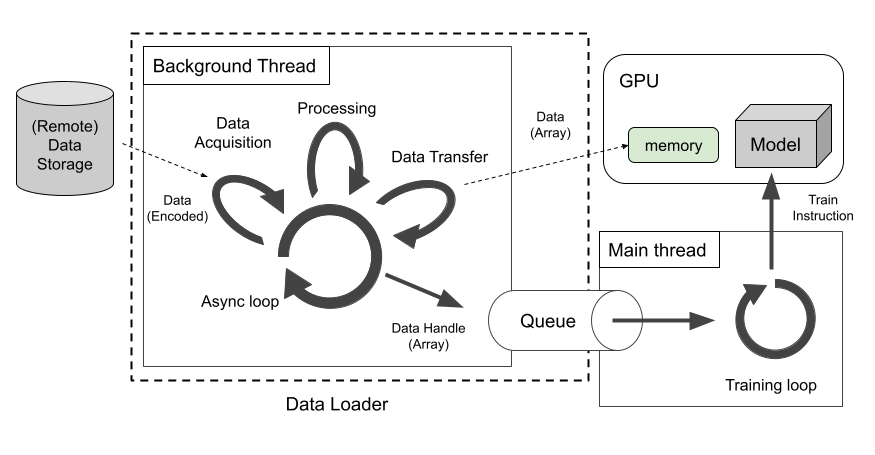

If operations for data acquisition, preprocessing, and data transfer all release GIL (or are natively supported by asyncio), then the SPDL’s task execute engine can perform them in a background thread without relying on a subprocess. (In case some of the operations hold the GIL, that part can be independently executed in a process.)

In the pipelines we investigated, when data loading is the bottleneck, the real bottleneck is often the media processing—that is, decoding images/videos, resizing, and batching. Such operations don’t rely on any functionalities of the Python interpreter, so they can release GIL without side effects. And media decoding requires binding third-party libraries written in other languages like C, we can release GIL at no runtime overhead. Since media processing is some of the most performance critical code, we implemented media decoding functionalities from scratch, carefully measuring performance at all stages of development, while ensuring that these functionalities are thread-safe and release GIL.

### Pipeline and concurrency

As mentioned above, loading data from remote storages to GPU go through multiple stages with different bounding factors. These stages require different scaling strategies, so it’s important that we can adjust the concurrency of the stages separately. Therefore, we designed the data loading pipeline in a way that users can explicitly specify the concurrency of each stage separately.

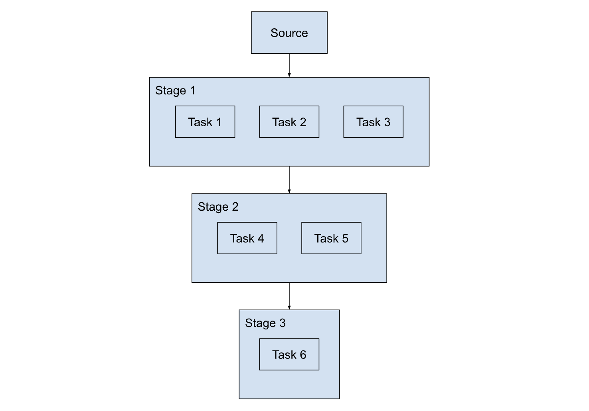

The tasks in each stage are scheduled by async event loop concurrently.

### Media processing module

Processing multimedia is often a bottleneck in data loading, but also an opportunity for improving the performance. For low-level operations (such as decoding audio, image, video and resizing), we rely on external libraries, which do not depend on Python. This means we can execute them while releasing the GIL, and once the GIL is released, these functions can be executed concurrently in Python's thread pool.

To achieve high performance, it is important to not introduce unnecessary operations and memory copy. It is common practice to load individual media samples as a Tensor and later batch them together, however this creates multiple intermediate copies that are deallocated immediately. Additionally, if the batch Tensor is created in the subprocess and transferred to the main process, additional copies are made. The following figure illustrates how a batch of images is created and how many times memory are allocated along the way.

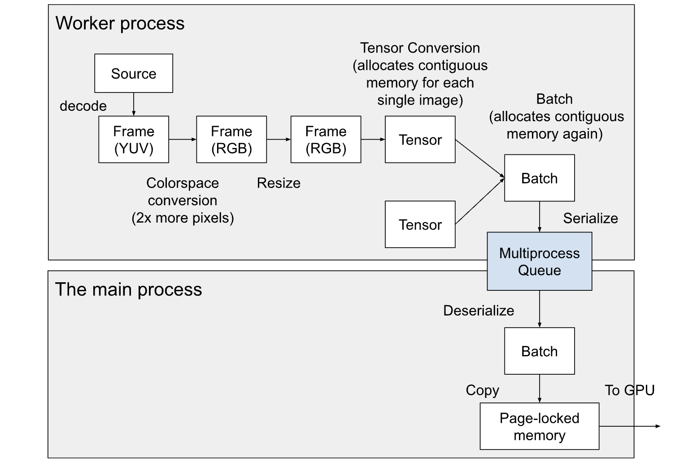

In SPDL, we implemented IO functions that can pass around the data used by the underlying decoding libraries without converting them to Tensor. This avoids creating the intermediate Tensors. These decoded data can be copied to a batch Tensor directly without creating an intermediate Tensor for each sample in the batch. Additionally, when the media data is copied to the batch, the data can be written to the page-locked memory directly so that GPUs can access them directly. The following figure illustrates this.

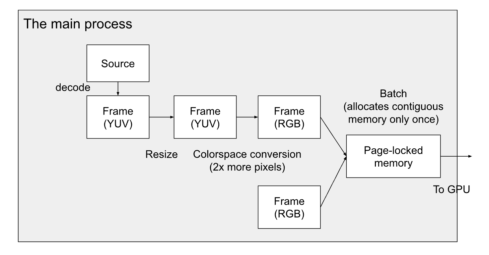

## Examples

The following code snippets illustrate the usage of SPDL.

### Constructing a pipeline

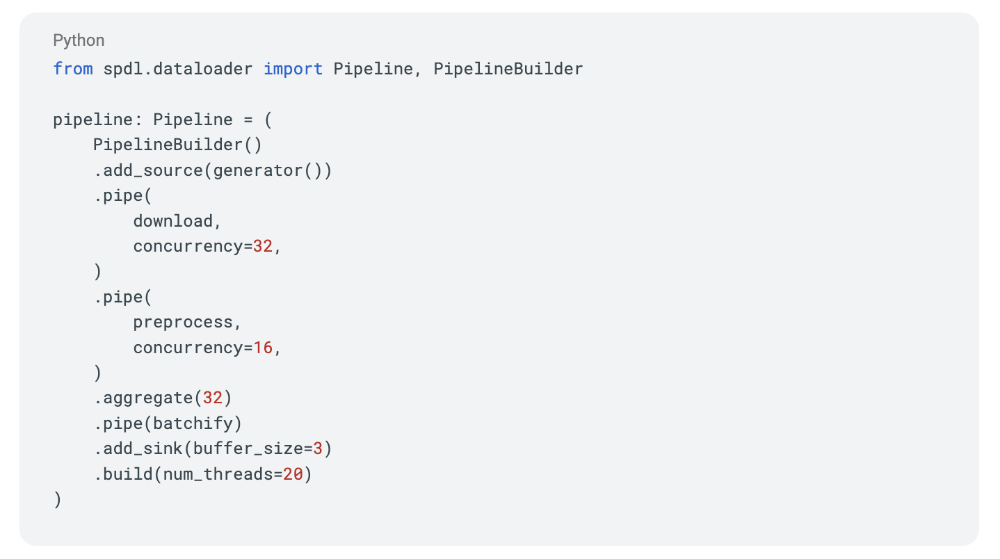

The above snippet constructs a Pipeline object consisting of four stages: `generator`, `download`, `preprocess`, and `batchify`, which are expected to be provided by users. The interface of these stages can be something like the following. The functionalities of each stage should be self-explanatory from the name and the signature.

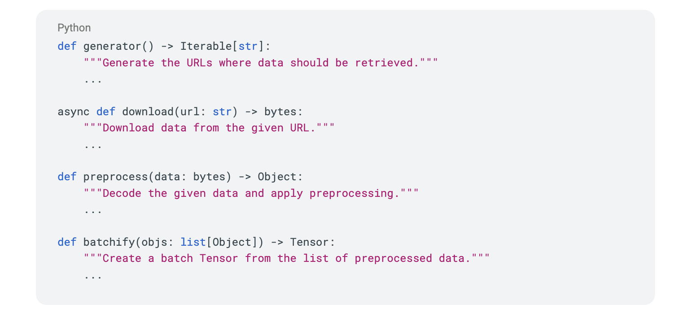

Each stage in the pipeline can be assigned a different concurrency. The optimal values will depend on the nature of the stage and the environment the pipeline is executed. For example, the maximum concurrency of `download` will depend on the network bandwidth and API rate limit on the remote server.

The `generator` and `batchify` stages are, to some degree, analogous to the concept of sampler and collate function from PyTorch DataLoader, but since Pipeline doesn’t dictate what kind of data should be passed between stages, and the `batchify` stage here (in conjunction with `aggregate`) is no different from other stages defined with `pipe` method, they are not a counterpart in a strict sense.

The `buffer_size` argument in `add_sink` corresponds to the idea of `prefetch_factor` from PyTorch DataLoader, but there is a slight difference. In PyTorch, it is part process, so the number of items buffered is `prefetch_factor x num_workers`. Meanwhile in SPDL, the `buffer_size` is simply the maximum number of items buffered.

The `num_threads` argument in the `build` method determines the number of threads in the thread pool attached to the async event loop. This is the maximum number of jobs concurrently scheduled when the async event loop converts synchronous functions to asynchronous functions. Natively asynchronous functions are not included in this, as they don’t require a thread to run in the background.

### Using the pipeline

Once the pipeline is constructed, it can be used as an iterable object as follows.

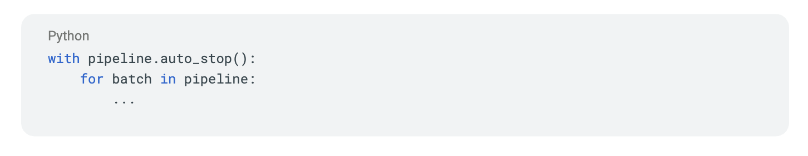

### Image processing

The following example shows how an image can be decoded. In SPDL, the decoding operation is broken down into primitive operations like demuxing and decoding, so that users can control the parallelism at the lowest level.

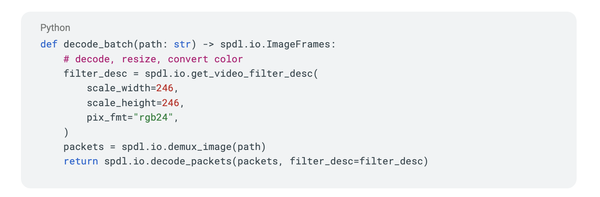

The following code snippet shows how the images decoded by the above code can be copied into a batch and transferred to a GPU.

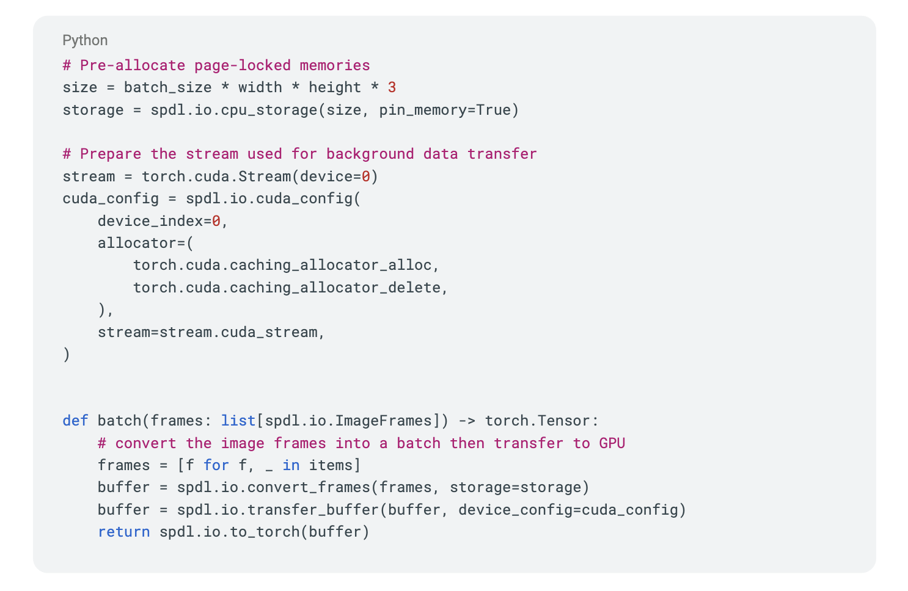

The page-locked memory can be re-used, so it needs to be allocated only once. The transfer function can take PyTorch's CUDA caching allocator, so we can avoid CUDA memory allocations too.

### Tracing the data loading pipeline

PyTorch has a powerful profiler, which can show the timeline of Python stacks. The profiler does not support tracing child processes, therefore, it was not possible to trace the data loading pipeline when using PyTorch DataLoader. Since SPDL uses multithreading for pipeline execution, it is possible to visualize the timeline of data loading using the PyTorch profiler. This is highly useful when analyzing the performance of data loading and finding the bottleneck. The figure below shows an example trace where two threads are processing data concurrently.

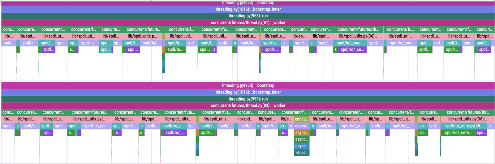

## Performance

### Comparison against PyTorch DataLoader

We compared the performance of SPDL against PyTorch DataLoader, using the ImageNet validation dataset, which consists of 5000 images. The dataset is located in the local file system, so there is no network transfer in this experiment. We varied the batch size and the number of workers and measured the time for each solution to complete the process. For PyTorch DataLoader, we used TorchVision's default I/O implementation.

#### Time to first batch

The following table shows the time for initializing the data loader for different numbers of workers. For PyTorch, we used the "forkserver" subprocess context. In the case of PyTorch, the initialization time grows as the number of workers increases, but it stays constant for SPDL. This is the benefit of adopting thread-based parallelism.

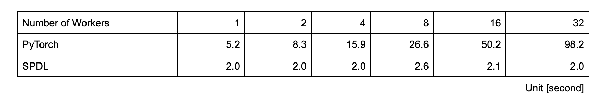

#### Post-init throughput

The following figure compares the throughput of PyTorch and SPDL after the initialization. Once initialized PyTorch DataLoader's subprocess workers are not constrained by the GIL, their performance scales well. SPDL's thread-based parallelism is still constrained by the GIL, therefore, when they do not scale as well as PyTorch at a higher count of workers. However, up to 16 workers, it shows similar performance or sometimes better.

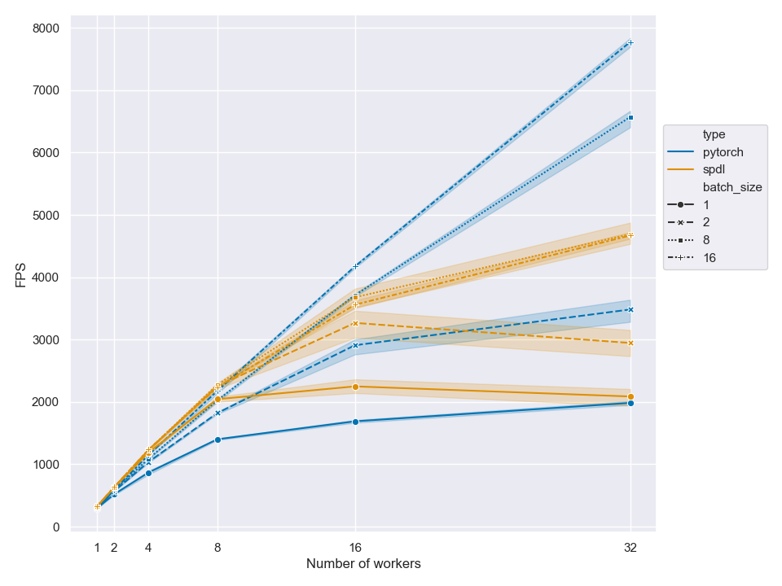

#### End-to-End model evaluation

We evaluated the `vit_b_16` model from TorchVision, using a H100 GPU. We applied `torch.compile` and used `bfloat16` to optimize the inference time. The following figure shows the end-to-end throughput of PyTorch and SPDL. Due to the initialization time, the end-to-end performance of PyTorch DataLoader does not scale as much as the post-init throughput we saw previously. On the other hand, the initialization time for SPDL is small and constant, so it scales well up to 16 threads.

With 16 threads, SPDL could feed 50,000 images to the model in 18 seconds.

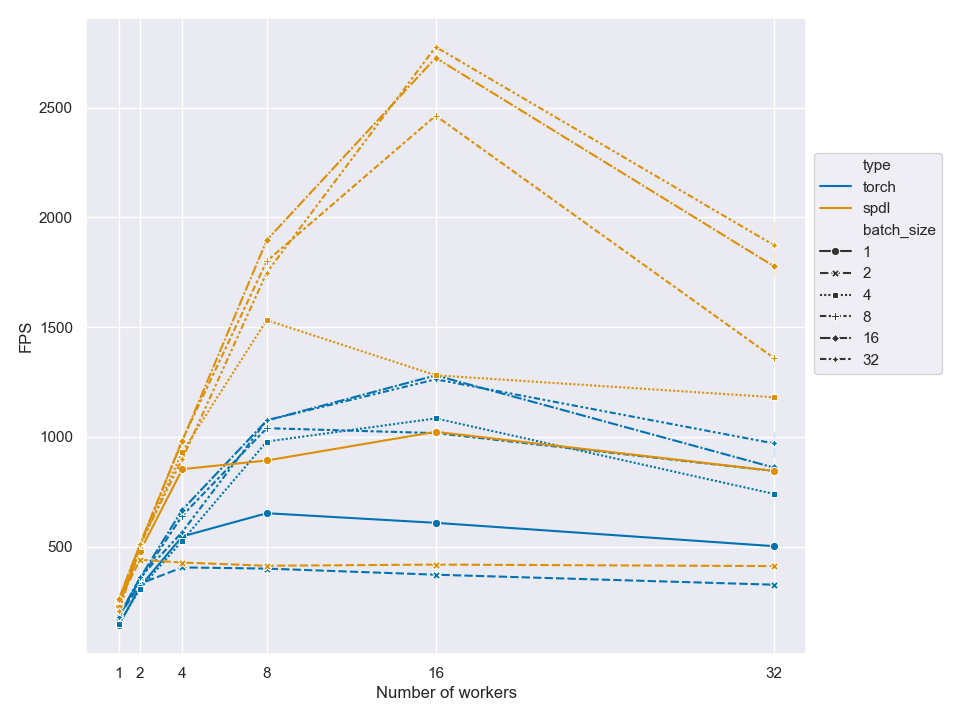

### In Production System

When training models in a production environment, things get more complicated. The training pipeline has additional dependencies for interacting with the system, some of which performs additional initialization when a subprocess is launched. The training data is downloaded from the network, so the network latency affects the performance. We integrated SPDL into one of our internal model training pipelines and saw significant improvement.

The pipeline we experimented with trains a model that handles video and audio. The training data is retrieved from network storage. The original data loading was based onPyTorch DataLoader, and processed video and audio with TorchAudio's StreamingMediaDecoder.

With SPDL, we can adjust the concurrencies of the network transfer and video processing independently. The SPDL's video processing functions use less memory than TorchAudio. SPDL reports the throughput of download and video processing separately, so it is easy to know where the bottleneck is and adjust the parameter.

The throughput of data loading (measured from remote storage to GPU) was 3x faster with SPDL. This shifted the bottleneck to be model computation. We applied various optimizations to the model, and in the end we achieved double the model training speed.

The memory consumption was reduced to less than half. Most of the saved memory originated from the additional platform-related dependencies performing static initialization. By getting rid of subprocesses, the time and memory for initialization was removed completely.

### Free-Threaded Python

As we rolled out the solution internally, we started to hear more and more about the free-threaded Python. We assume that it still takes some time before the free-threaded Python becomes stable and production-ready. However, the ideal path is that SPDL works with FT Python seamlessly so that users can enjoy its benefit without additional migration work.

One thing we learned along the way of SPDL development is that simply replacing the pool of subprocess workers with the pool of thread workers does not automatically improve the performance. The software architecture needs to be tailored towards thread-based parallelism. So the question is "Does the performance of SPDL improve in FT Python?" To answer this question, we conducted an experiment to see if SPDL is compatible with FT Python and if the performance improves. The answer is yes to both. The data loading pipeline built with SPDL works with FT Python without any code change, and the performance improves.

The figure below shows the throughput of loading the ImageNet dataset. We can see that the throughput is increased when the GIL is disabled.

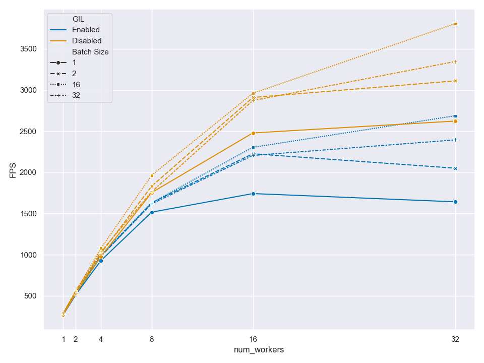

## Conclusion

SPDL was developed by Reality Labs to improve the performance of model training. It is designed from ground up to be efficient. It uses thread-based parallelism, which is constrained by the GIL, but it can outperform the process-based parallelism while consuming a smaller amount of memory. It provides insight into the data loading performance and knobs to optimize it. It’s applicable to many multimodal model training, including those that don’t use PyTorch. SPDL is compatible with free-threaded Python and receives further performance improvement when the GIL is disabled.

SPDL paves a way towards AI development in the era where free-threaded Python becomes the standard.

[

Github

](https://github.com/facebookresearch/spdl)

* * *

Written by:

Moto Hira

Software Engineer

Christian Puhrsch

Software Engineer

Roman Malinovskyy

Software Engineer

Valentin Andrei

Software Engineer

Gael Le Lan

Software Engineer

Miguel Martin

Software Engineer

Gokul Gunasekaran

Software Engineer

Yuta Inoue

Software Engineer

Francisc Bungiu

Software Engineer

Olga Gerasimova

Software Engineer

Abhinandan Krishnan

Engineering Manager

Raghuraman Krishnamoorthi

Engineering Manager

Share:

* * *

Our latest updates delivered to your inbox

[Subscribe](https://ai.facebook.com/subscribe/) to our newsletter to keep up with Meta AI news, events, research breakthroughs, and more.

Join us in the pursuit of what’s possible with AI.

[See all open positions](https://www.metacareers.com/jobs/?is_leadership=0&sub_teams%5B0%5D=Artificial+Intelligence&is_in_page=0&fbclid=IwAR0O8BF7opOj5gASJmwYVGalPPXTLu-6xrl9w00eC7Rarp2HQ9uEH8tERFw)

Related Posts

Computer Vision

Introducing Segment Anything: Working toward the first foundation model for image segmentation

April 5, 2023

[Read post](https://ai.meta.com/blog/segment-anything-foundation-model-image-segmentation/)

FEATURED

Research

MultiRay: Optimizing efficiency for large-scale AI models

November 18, 2022

[Read post](https://ai.meta.com/blog/multiray-large-scale-AI-models/)

FEATURED

ML Applications

MuAViC: The first audio-video speech translation benchmark

March 8, 2023

[Read post](https://ai.meta.com/blog/muavic-audio-visual-speech-translation-benchmark/)

[Our approach](/about)

[About AI at Meta](/about)

[People](/results/?content_types%5B0%5D=person&sort_by=random)

[Careers](https://www.metacareers.com/jobs/?is_leadership=0&sub_teams[0]=Artificial%20Intelligence&is_in_page=0)

[Research](/research)

[Infrastructure](/infrastructure)

[Resources](/resources)

[Demos](https://aidemos.meta.com/)

[Meta AI](/meta-ai/)

[Explore Meta AI](/meta-ai/)

[Get Meta AI](/get-meta-ai/)

[AI Studio](/ai-studio/)

[Latest news](/blog)

[Blog](/blog)

[Newsletter](/subscribe)

Foundational models

[Llama](https://www.llama.com/)

Our approach

[Our approach](/about)[About AI at Meta](/about)[People](/results/?content_types%5B0%5D=person&sort_by=random)[Careers](https://www.metacareers.com/jobs/?is_leadership=0&sub_teams[0]=Artificial%20Intelligence&is_in_page=0)

Research

[Research](/research)[Infrastructure](/infrastructure)[Resources](/resources)[Demos](https://aidemos.meta.com/)

Meta AI

[Meta AI](/meta-ai/)[Explore Meta AI](/meta-ai/)[Get Meta AI](/get-meta-ai/)[AI Studio](/ai-studio/)

Latest news

[Latest news](/blog)[Blog](/blog)[Newsletter](/subscribe)

Foundational models

[Llama](https://www.llama.com/)

[Privacy Policy](https://www.facebook.com/about/privacy/)

[Terms](https://www.facebook.com/policies/)

[Cookies](https://www.facebook.com/policies/cookies/)

Meta © 2026

