# 腾讯太极团队实现DeepSeek模型业内H20最高性能15800+ tokens/s

> 公众号: 腾讯技术工程
> 发布时间: 2025年7月11日 17:37
> 原文链接: https://mp.weixin.qq.com/s/w_sb_ei-tSGVz9asI9cidQ

---

作者：ruiqinchen、pengmeng

> “太极AngelHCF推理极致优化”系列文章由太极Angel-HCF推理团队撰写，全面揭秘如何实现DeepSeek模型15800+ tokens/s的业内H20最高性能，本文将拆解DeepSeek全栈优化方法论：通过PD分离，Prefill和Decode使用不同的并行策略，多层MTP优化，并结合模型特点和Hopper架构特性，将多机推理性能推向极限。

### 一、背景和成果介绍

DeepSeek发布后司内AI应用流量持续上涨，对推理算力的需求呈指数级增长。导致业务对卡量需求过于庞大。太极Angel-HCF推理团队联合腾讯云云智能等团队针对DeepSeek进行专项优化，推出行业最高性价比的推理方案：

● **核心目标**：首字小于2s，单token生成耗时低于50ms的限制下，最大化吞吐（QPM）；在保障用户体感基础上，最小化业务成本。

● **技术路线** ：

(1) **硬件协同** ：利用Hopper架构新特性深度优化（如TMA、WGMMA指令）

(2) **算法革新** ：基于DeepSeek开源算子二次开发（DeepGEMM/FlashMLA/DeepEP）

(3) **系统工程** ：框架优化、w4a8c8量化、MTP并行解码、PD分离调度、大EP、TBO等

● **优化成果**：

○ 测试数据集: 3000条业务脱敏数据集(最大输入16k，平均输入3.5k；最大输出32k， 平均输出1.2k)

○ 测试机器：16卡 H20-96G

○ 限制50ms TPOP ， **QPM=212，15800+ tokens/s**

### 二、多机性能优化方案

考虑到新模型快速支持的需求， 也吸收参考了开源众多优秀的方案和设计，我们从纯C++框架转型到Python Runtime 加 C++ Kernel方案。 并花费3个月从框架、算子、量化压缩等方向全面优化， 取得了显著的成果。 本篇文章推理优化部分主要讲解我们在ADP、大EP、PD、多层MTP等方面的优化工作。

#### **2.1 PD分离设计与优化**

##### **2.1.1 PD使用不同并行方式，最大化利用计算和存储**

由于prefill阶段和decode阶段任务特点存在一定差异，主要表现在prefill属于compute bound型任务，而decode则属于memory bound型任务，如下图所示，因此我们根据实际情况选用不同的并行策略。

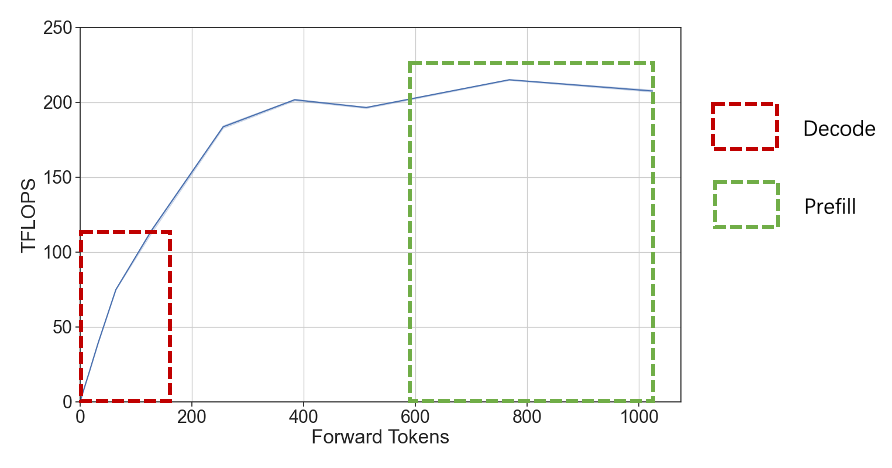

针对 Prefill：

● 由于存在算力瓶颈，主要采用大TP + 小EP并行策略，提升计算速率

● 尽可能降低首字耗时，同时减少跨机通信量

针对Deocde：

● 由于kv cache频繁存取，存在明显的访存瓶颈，主要采用DP + 大EP，尽可能增大batch size，同时减少单卡访存压力

● 尽可能充分利用显卡算力，趋近compute bound

整体架构图如下所示。

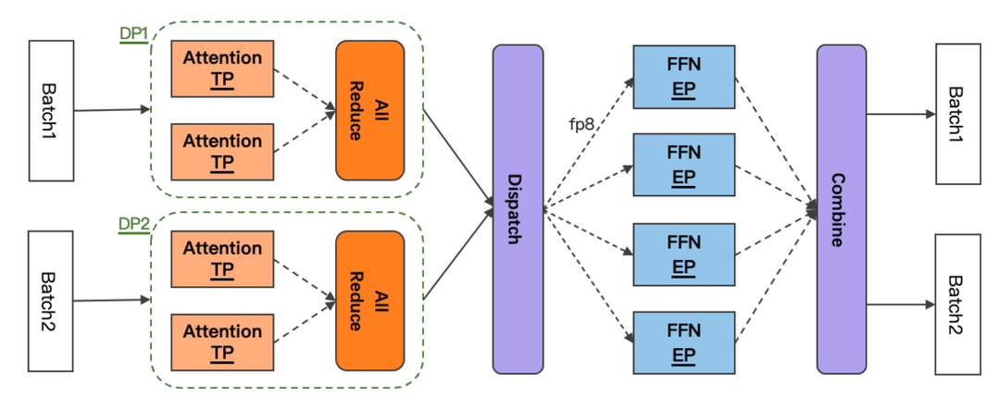

##### **2.1.2 PD分离下KV Cache高效传输**

###### **2.1.2.1 计算通信overlap，让Prefill高效运行**

Prefill节点需要将计算得到的KV Cache及meta信息传输给Decode节点，如果采用计算->传输->计算模式，将导致GPU利用率降低，这里很容易想到异步传输进行优化，主要采用以下设计实现。

● 异步传输 KVCache，与当前iteration forward step overlap，不影响吞吐

● RDMA 高效传输，单个forward step 周期内完成，ITL 有保障

● 调度层面，CPU & GPU Overlap，适配 PD+投机采样

采用上述方法后，可以看到在整个timeline上，**计算与传输能够完美overlap，GPU利用率持续保持高位**。

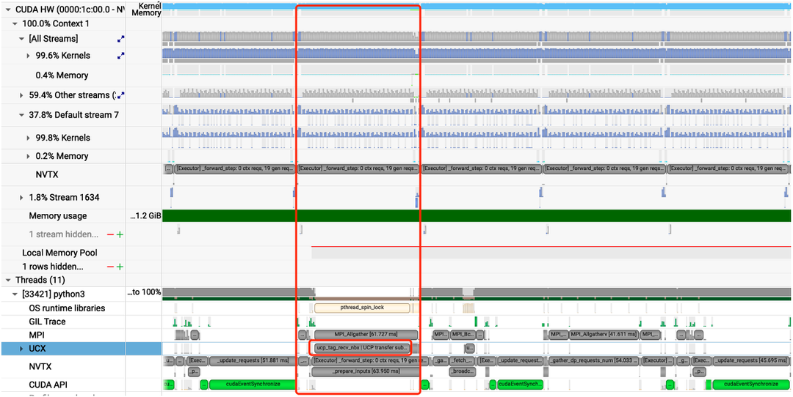

###### **2.1.2.2 Layerwise传输**

如果等到所有layer算完再进行发送，发送的数据量可能较大，占用较多SM算力，影响下一轮次forward step计算性能，因此根据实际情况设计layerwise传输。

● 层前向计算与层 KV Cache 传输 overlap，有效降低长seqlen 场景 cache 传输时耗

● 长文：ISL>8k 时选择 Layerwise 传输；短文：ISL<8k 时整体传输，避免大量小包，并做小包合并传输

采用layerwise传输设计与实现后，可以看到传输的**lantency几乎与ISL无关**，保持在较低水准。

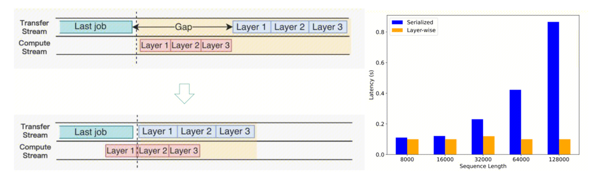

##### **2.1.3 PD分离负载均衡**

PD分离后，一般P和D的QPM性能是存在差异的，且性能差异受到用户输入长度的影响，因此实践中需要充分考虑负载均衡。

针对Prefill：Chunk调度时的请求长度排序策略，同一批到达的请求，按长度排序优先调度短prompt，整体TTFT达到最优。

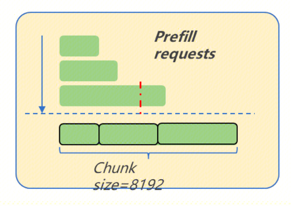

针对Decode：结合输入/当前decode长度的调度策略

● 滑动统计平均输出长度，优先按剩余槽位调度

● 根据平均输出长度剩余槽位决策是否扩容

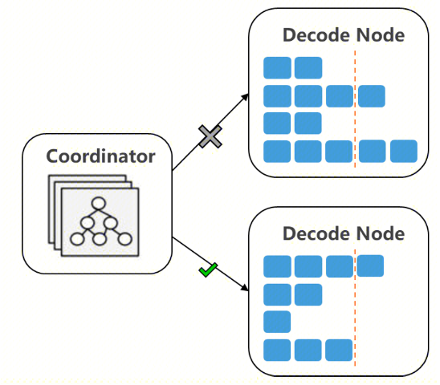

##### **2.1.4 PD分离架构与性能**

采用mPnD部署测试，架构如下。

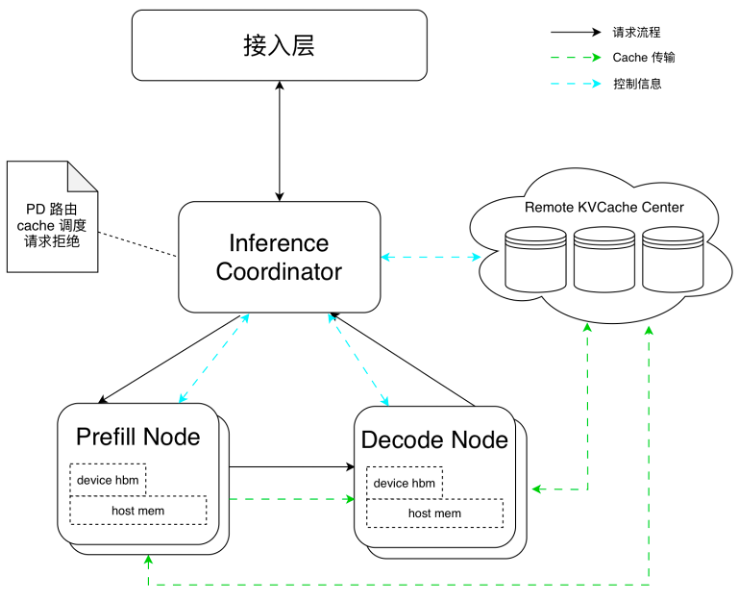

测试结果

● 在有效 ITL 区间，PD 的吞吐明显更优，大幅提升Throughput

● 20~25 tokens/s 区间端到端有效提升 30~40% Throughput

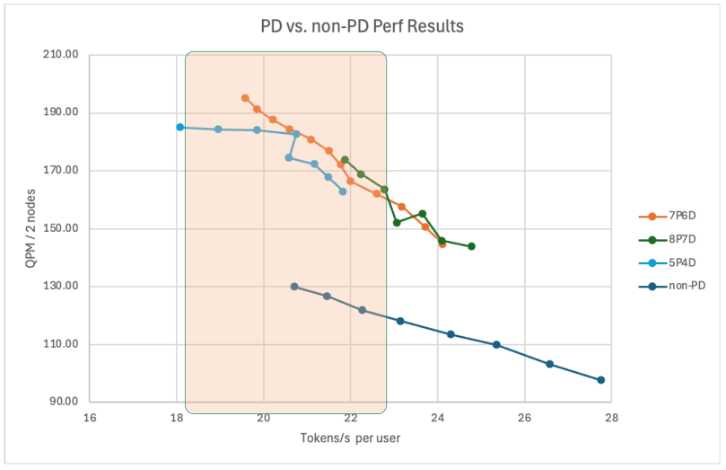

#### **2.2 EP并行优化**

考虑到DeepSeek模型MoE的稀疏性和激活分布不均的特性，介绍团队在通信和负载均衡上的优化工作。

##### **2.2.1 DeepEP优化多机通信**

采用网平团队优化的TRMT通信库，能够很好地适配int4量化模型，下面是优化前后的对比分析。

**优化前**：各阶段通信量如下所示。

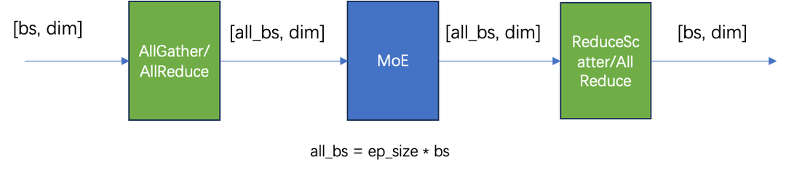

采样分析timeline，发现通信算子耗时占比**高达40%+！！**

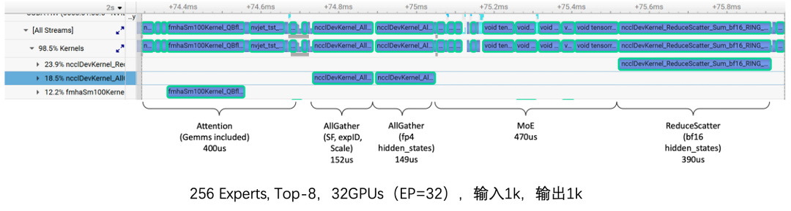

**优化后**：各阶段通信量如下所示。

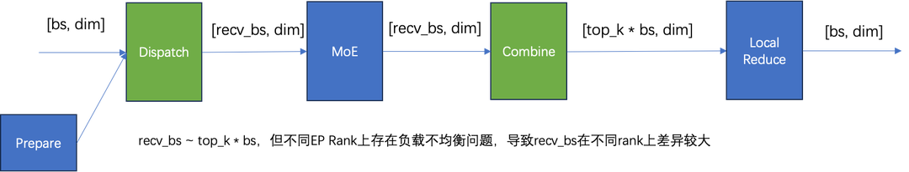

采样分析timeline，通信算子\*\*耗时减少60%\*\*。

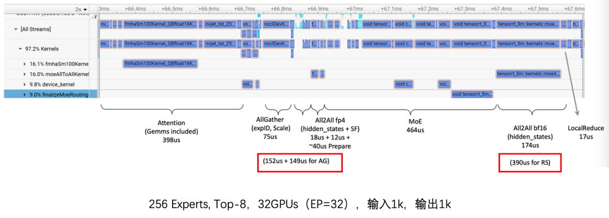

##### **2.2.2 专家负载均衡**

DeepSeek V3/R1包含256个路由专家，每一个token激活其中8个专家，具有很高的稀疏性，很容易导致各专家激活次数差异较大，采样分析各layer各expert激活次数统计分布如下，表现为。

● 部分layer存在明显热点专家，热点专家激活的次数可能是非热点专家的5倍以上，导致EP并行存在某个rank上计算耗时较长，其他rank需等待的局面

● 不同layer的热点专家分布不同，各layer的负载均衡可独立调度管理

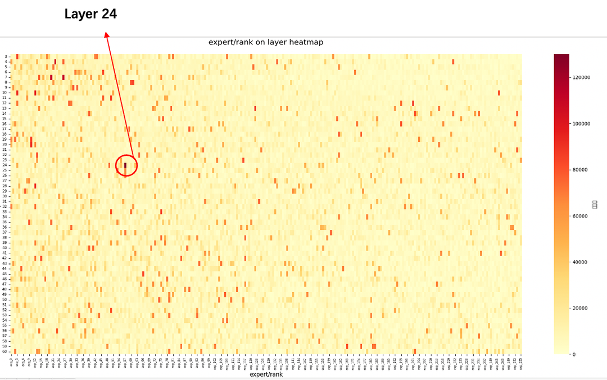

通过EPLB算法，以及动态负载均衡+冗余专家可以将各rank上专家激活不均衡度显著降低，**激活不均衡度可降至1.2～1.5**，显著提升计算和通信效率，实现MoE线性扩展能力。

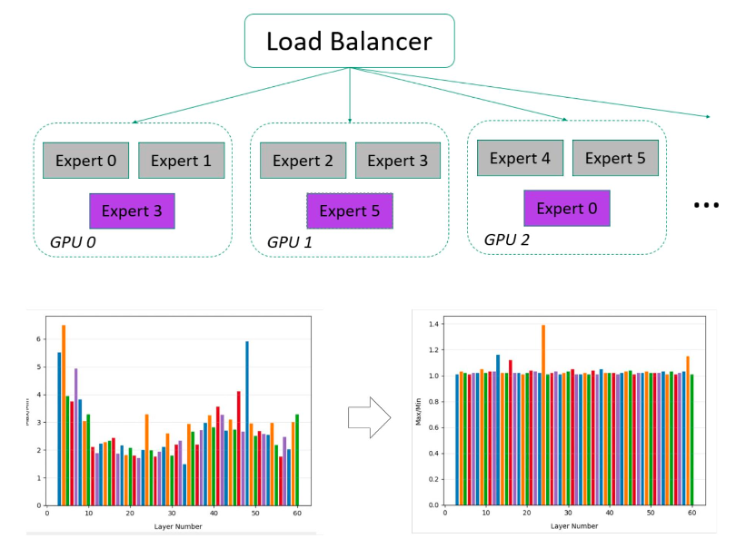

#### **2.3 DP并行适配与优化**

DP并行借鉴于训练框架，主要应用于decode节点，**在满足SLO要求下，单机throughput提升50%以上**。

##### **2.3.1 运行模式解析**

因为在MoE阶段需要做同步，以及cudagraph对input tensor shape的要求，一般都需要mock request才能确保Attention DP模式正常运行，主要表现为：

● 每个dp rank在每一次forward step至少包含一条请求

● cudagraph模式下，forward step后需all reduce对齐各dp rank待处理的request数量

● mock request当decode请求处理，DP主要应用于decode

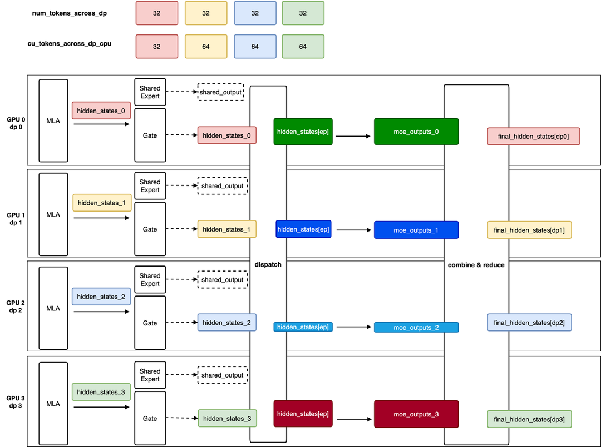

##### **2.3.2 PD分离适配DP**

由于Prefill和Decode采用不同的并行策略，PD分离需要做相应适配，主要考虑两个点：负载均衡以及KV Cache传输。

负载均衡

● round-robin调度

● 基于各rank上request数量调度

● 基于kv cache size感知调度

● etc.

KV Cache Transfer，以1P1D为例，配置如下

● Prefill：TP=8

● Decode： DP=16，TP=1，EP=16

KV Cache传输设计如下图所示：

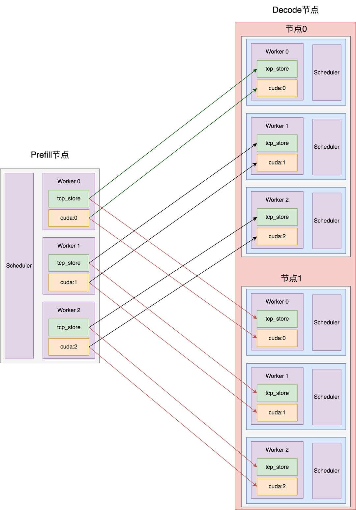

### 三、多层MTP优化与实践

Multi-Token Prediction (MTP)是一种通过对每一个位置预测多个token来改进大模型训练性能的技术，同时MTP也可以用于推理加速。 MTP由META首次提出，DeepSeek在META论文基础上做了进一步改进。

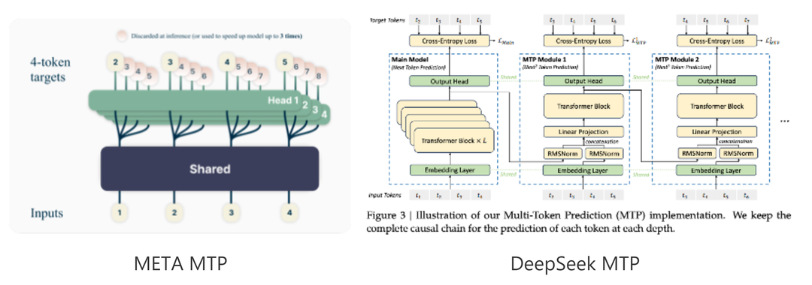

MTP可以提升推理性能的关键是一步可以预测多个token。因为DeepSeek只开源了一个MTP层，目前主流实现方式是多个MTP层共用同一层开源的weight。这样会导致除了第一层接受率比较高之外，后面的层接受率都偏低。

比如真实对话场景下，MTP第一层的接受率约0.7，第二层接受率一般小于0.4.

提升MTP接受率是提升MTP推理性能的关键。我们实验了多种方法来提升MTP接受率，包括训练多层MTP和优化模型的采样方法等。

#### **3.1 提升接受率方法一: 训练多层MTP**

团队使用了两种方法来训练MTP层，第一种方法是保持和DeepSeek论文一致，训练5层独立的MTP权重。第二种方法同样训练5层MTP，但5层使用相同的权重，这样训练的好处是和当前推理框架兼容比较好，无需修改框架即可直接加载新训练的MTP层。

我们使用Megatron-LLM训练MTP层，共享MTP层训练代码修改如下：

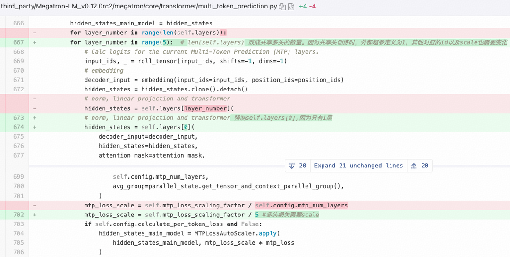

按每并发输出token速率计算，自研两层MTP（MTP2）和三层MTP（MTP3）加速结果如下：

● 自研共享MTP2相比开源MTP2提升：提升7.4%

● 自研独立MTP2相比开源MTP2提升：提升8.8%

● 自研独立MTP3相比开源MTP3提升：提升9.0%

● 自研独立MTP2相比自研共享MTP2提升：1.4%

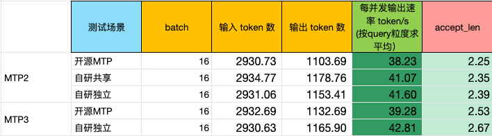

#### **3.2 提升接受率方法二: 采样方式优化**

除了训练MTP层尽可能生成准确的draft token以外，采样方法也是影响MTP接受率的关键。并行解码大模型验证一般有如下三种方法：

##### **3.2.1 Token by token验证**

大模型验证过程针对每个输入draft token，会采样出来一个token，Draft生成的输入需要和大模型的输出完全一样，才会被接受，如图所示。

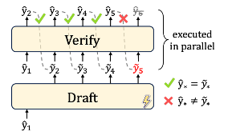

Token by token验证是最严格的验证方法，可以保证和大模型输出完全一致，接受率也会比较低。 元宝线上数据测试DeepSeek两层MTP平均接受率大概0.51。

##### **3.2.2 拒绝采样**

大模型验证过程针对每个输入draft token，判断生成对应token的概率，如果target模型生成对应token的概率除以draft模型生成同一token的概率大于一个随机数，则接受。DeepSeek两层MTP平均接受率大概0.56。

##### **3.2.3****Typical Sampling**

大模型验证过程针对每个输入draft token，判断生成对应token的概率，如果target模型生成对应token的概率大于一个值（可以是设置的值或根据输出分布计算出来的值），则接受。 DeepSeek两层MTP平均接受率大概0.62。

##### **3.2.4 我们的方法**

以上是三种采样方法的主要原理，每种方法实际实现还包括首个拒绝token的采样方法。我们在上面三种采样方法基础上，通过尝试不同的超参数组合，draft和verify使用不同的采样方法（比如draft模型减少随机性），以及动态温度等。在模型精度基本不变的情况下。DeepSeek两层MTP平均接受率达到0.7左右。

#### **3.3 MTP实现优化**

在MTP的实现上，我们将主模型和MTP模型整个前向使用同一个cuda graph执行, 有效避免小算子空隙。

在MTP模型结构上，相比开源vLLM推理框架的MTP模型实现，我们对MTP的LM head添加norm算子，在精度不变情况下，相比开源方案接受率提升2%。

### 四、下一步工作

我们在不断探索大EP、TBO、DeepEP通信优化、全局KV Cache等方面，也取得了不错的进展， 整个优化完成预计性能突破 20000 tokens/s。感谢NV技术专家团队，DeepSeek和开源社区，很多工作在开源基础上完成，也会积极回馈开源社区。

