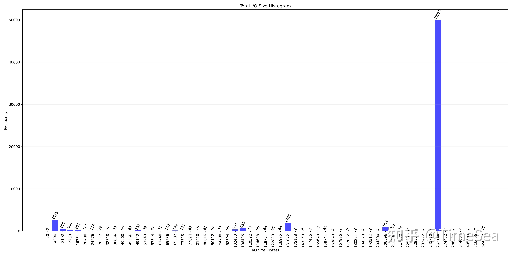
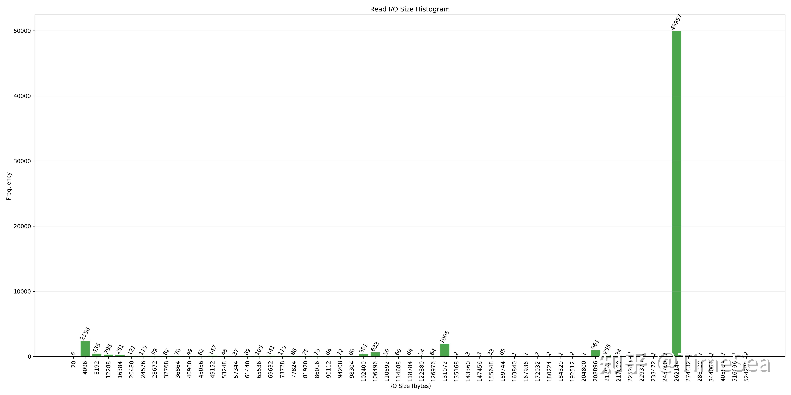
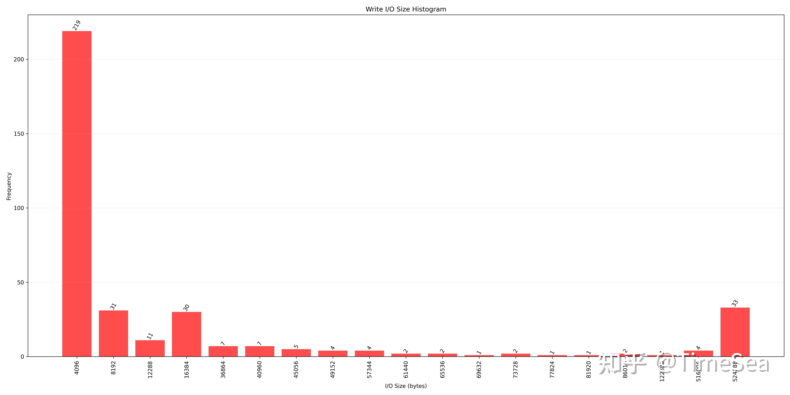
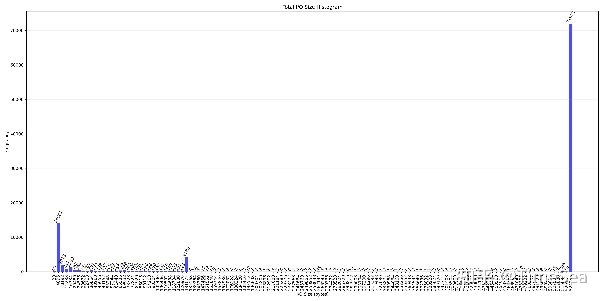
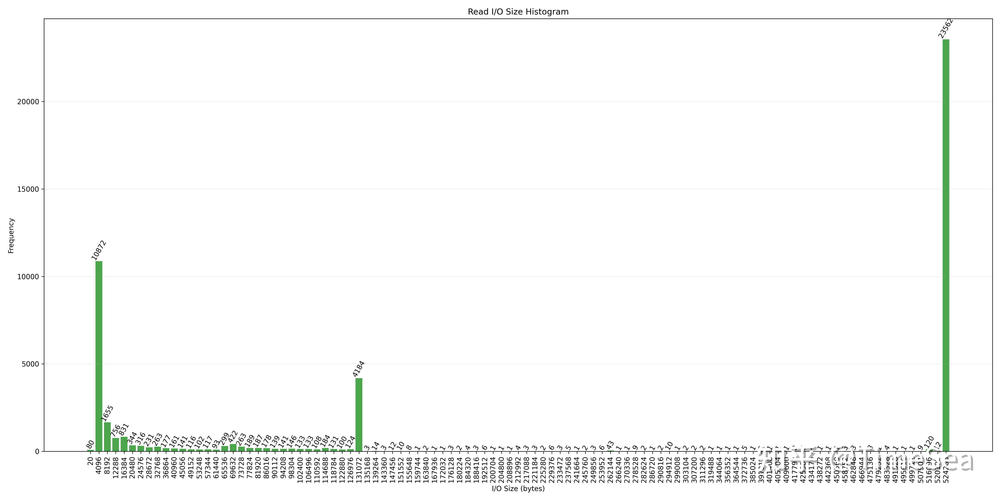
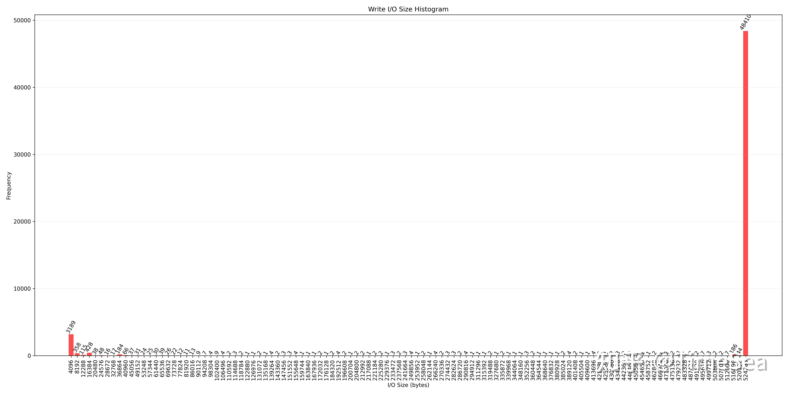

# LLM 推理/训练 I/O Pattern初探

> 作者: unknown
> 发布时间: 编辑于 2024-08-31 16:57・北京
> 原文链接: https://zhuanlan.zhihu.com/p/717560804

---
近期一直在与导师做 LLM Benchmark的项目，目的是评估不同存储系统在运行LLM应用时的性能。在经过相当长一段时间的文献检索后，发现与此相关的文章和工作少之又少。最接近该课题的是MLPerf Storage Benchmark，但其提供的机器学习应用都比较传统，如Bert，UNet-3D，与LLM应用相差较大。因此就萌生了自己去抓取LLM应用 I/O Trace的想法，通过分析I/O Trace来获取LLM应用的底层存储访问特征。这篇文章便是最近一段时间工作的总结，标题里的“初探”二字也说明该工作离成熟还是非常遥远。

本人之前一直做的是系统方向，突然被赶鸭子上架来做LLM相关的工作，多少有点力不从心，文章中的错误还望各位指出，不吝赐教。

该工作抓取 LLM 推理和训练应用的 [syscall trace](https://zhida.zhihu.com/search?content_id=247587847&content_type=Article&match_order=1&q=syscall+trace&zhida_source=entity) (strace)和block trace ([blktrace](https://zhida.zhihu.com/search?content_id=247587847&content_type=Article&match_order=1&q=blktrace&zhida_source=entity))，总结出的Trace特点如下：

### 1\. LLM 推理应用

### 1.1 syscall trace

原始trace文件共有72713行记录，而与模型文件/文件系统相关的记录，只有3079行。该部分调用的所有系统调用及调用次数如下：

```text
openat 14
statx 4
mmap 255
brk 1
fstat 8
fadvise64 4
close 12
munmap 252
mprotect 18
clone 9
set_robust_list 9
futex 1360
read 9
write 5
stat 12
getpid 1
getrandom 1
poll 4
ioctl 6
mkdir 3
lseek 4
```

该部分有关文件系统的系统调用流程大致如下：

1.  调用openat打开模型文件
2.  调用statx或者fstat查看文件信息
3.  调用mmap建立file mapping
4.  调用munmap解除file mapping
5.  重复流程1-4几次
6.  然后多次调用mmap与munmap建立匿名映射和取消匿名映射
7.  重复调用futex

步骤6中频繁使用mmap创建匿名映射，而非传统的malloc/free组合，这可能是出于更灵活地管理堆栈空间的考虑。futex（快速用户空间互斥量）是调用频率最高的系统调用，共计1,360次。然而，由于其主要用于线程同步，与底层文件系统的交互较少，因此在本分析中可以暂且忽略。

关于mmap系统调用的细节：当flags参数包含MAP\_ANONYMOUS时，表示创建匿名映射，此时fd参数无实际意义。反之，若不包含MAP\_ANONYMOUS，则表示创建文件映射，fd参数对应目标文件的描述符。

这里还观察到mmap与相应munmap操作之间的时间间隔较短。例如，在打开模型文件"model-00001"的过程中，建立文件映射的时间戳为1724336572.056049，而解除映射的时间戳为1724336572.058022，二者相差仅1,973微秒（约1.97毫秒）。

### 1.2 blktrace

**1.2.1 I/O Size 分布**

这一节主要分析在运行大语言模型(LLM)推理应用时底层块设备接收到的I/O请求大小分布。以下三张图片分别是总I/O、读I/O和写I/O的大小分布直方图（图片字有点小，放大看会更清晰）。

总I/O Size分布图



Total I/O Size Histogram

读操作 I/O Size分布图



Read I/O Size Histogram

写操作I/O Size分布图



Write I/O Size Histogram

以上数据分析显示，在总体I/O请求中，最常见的请求大小为4KB、128KB和256KB，占比分别为4.3%、1.8%和83.3%。对于读请求，这三种大小的占比分别为4.3%、1.8%和83.8%。而对于写请求，主要集中在4KB和512KB两种大小，占比分别为59.6%和9.0%。

**1.2.2 I/O 访问特征：顺序读取与随机读取占比**

此处我们采用以下方法区分顺序I/O和随机I/O：若当前I/O操作的扇区偏移量等于上一次I/O操作的扇区偏移量加上上一次操作的扇区数，则判定该Trace对应的操作为顺序I/O，否则为随机I/O。

经过处理的blktrace数据包含59,963条记录，其中读操作59,596条，写操作367条。这些I/O操作读取了13,890,973,816字节（约12.9GB）的数据，写入了23,265,280字节（约22MB）。下表统计了不同类型I/O操作条目数量以及I/O数据量的分布情况：

| I/O 类型 | Trace条目数量占比 | I/O 数据量占比 |
| --- | --- | --- |
| 顺序读 | 13.1% | 13.0%（占总读字节数的百分比） |
| 随机读 | 86.2% | 87.0%（占总读字节数的百分比） |
| 顺序写 | 0.11% | 41.5%（占总写字节数的百分比） |
| 随机写 | 0.49% | 58.5%（占总写字节数的百分比） |

上表数据中，随机I/O操作占比显著高于顺序I/O，这可能是因为在访问模型文件时，系统并不是按顺序读取数据，而是根据某种索引机制进行读取。**更具体的解释可能需要仔细研究大模型的索引文件。**

## 2\. LLM 训练应用

LLM训练应用使用的是ChatGLM微调，详细见[https://github.com/liucongg/ChatGLM-Finetuning](https://github.com/liucongg/ChatGLM-Finetuning)。这里使用[PT方法](https://zhida.zhihu.com/search?content_id=247587847&content_type=Article&match_order=1&q=PT%E6%96%B9%E6%B3%95&zhida_source=entity)微调ChatGLM2-6b模型。

### 2.1 syscall trace

跟踪大模型训练应用的syscall trace，可以把训练过程中有关文件系统操作的trace分成三个部分：定位模型文件、加载模型至显存、写checkpoint保存模型。

**定位模型文件**

```text
59391 1724332570.850927 stat("/root/.cache/huggingface/hub/models--THUDM--chatglm2-6b", {st_mode=S_IFDIR|0755, st_size=4096, ...}) = 0
59391 1724332570.850995 stat("/root/.cache/huggingface/hub/models--THUDM--chatglm2-6b/refs", {st_mode=S_IFDIR|0755, st_size=4096, ...}) = 0
59391 1724332570.851068 stat("/root/.cache/huggingface/hub/models--THUDM--chatglm2-6b/snapshots", {st_mode=S_IFDIR|0755, st_size=4096, ...}) = 0
59391 1724332570.851133 openat(AT_FDCWD, "/root/.cache/huggingface/hub/models--THUDM--chatglm2-6b/refs", O_RDONLY|O_NONBLOCK|O_CLOEXEC|O_DIRECTORY) = 57</root/.cache/huggingface/hub/models--THUDM--chatglm2-6b/refs>
59391 1724332570.851198 fstat(57</root/.cache/huggingface/hub/models--THUDM--chatglm2-6b/refs>, {st_mode=S_IFDIR|0755, st_size=4096, ...}) = 0
59391 1724332570.851264 getdents64(57</root/.cache/huggingface/hub/models--THUDM--chatglm2-6b/refs>, /* 3 entries */, 32768) = 72
59391 1724332570.851329 getdents64(57</root/.cache/huggingface/hub/models--THUDM--chatglm2-6b/refs>, /* 0 entries */, 32768) = 0
59391 1724332570.851389 close(57</root/.cache/huggingface/hub/models--THUDM--chatglm2-6b/refs>) = 0
59391 1724332570.851452 stat("/root/.cache/huggingface/hub/models--THUDM--chatglm2-6b/.no_exist/d2e2d91789248536a747d9ce60642a336444186c/pytorch_model-00001-of-00007.bin", 0x7fffcc3baf80) = -1 ENOENT (No such file or directory)
59391 1724332570.851516 openat(AT_FDCWD, "/root/.cache/huggingface/hub/models--THUDM--chatglm2-6b/snapshots", O_RDONLY|O_NONBLOCK|O_CLOEXEC|O_DIRECTORY) = 57</root/.cache/huggingface/hub/models--THUDM--chatglm2-6b/snapshots>
59391 1724332570.851579 fstat(57</root/.cache/huggingface/hub/models--THUDM--chatglm2-6b/snapshots>, {st_mode=S_IFDIR|0755, st_size=4096, ...}) = 0
59391 1724332570.851639 getdents64(57</root/.cache/huggingface/hub/models--THUDM--chatglm2-6b/snapshots>, /* 3 entries */, 32768) = 112
59391 1724332570.851702 getdents64(57</root/.cache/huggingface/hub/models--THUDM--chatglm2-6b/snapshots>, /* 0 entries */, 32768) = 0
59391 1724332570.851760 close(57</root/.cache/huggingface/hub/models--THUDM--chatglm2-6b/snapshots>) = 0
59391 1724332570.851826 stat("/root/.cache/huggingface/hub/models--THUDM--chatglm2-6b/snapshots/d2e2d91789248536a747d9ce60642a336444186c/pytorch_model-00001-of-00007.bin", {st_mode=S_IFREG|0644, st_size=1827780615, ...}) = 0
```

此阶段应用程序执行如下操作：

-   依次打开refs和snapshots文件夹，使用 `getdents64`系统调用搜索目录项，查找对应的模型文件
-   对每个模型文件重复以上过程

**加载模型至显存**

此后调用read系统调用将模型文件数据读入显存，这里我之前的认知相悖：读取模型文件至显存，应该是直接顺序读取数据即可，而实际上并不是这样，系统调用的trace包括了大量随机读取，即大量使用lseek变更数据读取位置，样例如下：

此阶段应用调用系统调用的模式和预期不同：

-   读取模型文件并不是简单的顺序读取，而包含了大量的随机操作，大量随机操作的体现便是频繁调用lseek更改读取文件的位置
-   使用read系统调用读取数据，而不是使用mmap

```text
59391 1724332572.820398 lseek(57</root/.cache/huggingface/hub/models--THUDM--chatglm2-6b/blobs/cdf1bf57d519abe11043e9121314e76bc0934993e649a9e438a4b0894f4e6ee8>, 1348525968, SEEK_SET) = 1348525968
59391 1724332572.820468 read(57</root/.cache/huggingface/hub/models--THUDM--chatglm2-6b/blobs/cdf1bf57d519abe11043e9121314e76bc0934993e649a9e438a4b0894f4e6ee8>, "PK\\3\\4\\0\\0\\10\\10\\0\\0\\0\\0\\0\\0\\0\\0\\0\\0\\0\\0\\0\\0\\0\\0\\0\\0$\\0.\\0py"..., 4096) = 4096
59391 1724332572.820537 read(57</root/.cache/huggingface/hub/models--THUDM--chatglm2-6b/blobs/cdf1bf57d519abe11043e9121314e76bc0934993e649a9e438a4b0894f4e6ee8>, "\\277>\\323>\\343>\\332>\\307>\\342>\\362>\\376>\\333>\\320>\\325>\\312>\\257>\\356>\\262>\\315>"..., 4208) = 4208
59391 1724332572.820676 mmap(NULL, 37752832, PROT_READ|PROT_WRITE, MAP_PRIVATE|MAP_ANONYMOUS, -1, 0) = 0x7f725cc7e000
59391 1724332572.820748 lseek(57</root/.cache/huggingface/hub/models--THUDM--chatglm2-6b/blobs/cdf1bf57d519abe11043e9121314e76bc0934993e649a9e438a4b0894f4e6ee8>, 1348534288, SEEK_SET) = 1348534288
59391 1724332572.820805 read(57</root/.cache/huggingface/hub/models--THUDM--chatglm2-6b/blobs/cdf1bf57d519abe11043e9121314e76bc0934993e649a9e438a4b0894f4e6ee8>, "PK\\3\\4\\0\\0\\10\\10\\0\\0\\0\\0\\0\\0\\0\\0\\0\\0\\0\\0\\0\\0\\0\\0\\0\\0$\\0.\\0py"..., 4096) = 4096
59391 1724332572.820869 read(57</root/.cache/huggingface/hub/models--THUDM--chatglm2-6b/blobs/cdf1bf57d519abe11043e9121314e76bc0934993e649a9e438a4b0894f4e6ee8>, "%<\\253;8<\\225\\273\\354;M<q\\274\\345;d\\274\\213\\273\\247;p\\273\\204<Q\\274\\245\\272\\340\\273"..., 37744752) = 37744752
59391 1724332572.842090 lseek(57</root/.cache/huggingface/hub/models--THUDM--chatglm2-6b/blobs/cdf1bf57d519abe11043e9121314e76bc0934993e649a9e438a4b0894f4e6ee8>, 1386283152, SEEK_SET) = 1386283152
59391 1724332572.842164 read(57</root/.cache/huggingface/hub/models--THUDM--chatglm2-6b/blobs/cdf1bf57d519abe11043e9121314e76bc0934993e649a9e438a4b0894f4e6ee8>, "PK\\3\\4\\0\\0\\10\\10\\0\\0\\0\\0\\0\\0\\0\\0\\0\\0\\0\\0\\0\\0\\0\\0\\0\\0$\\0.\\0py"..., 4096) = 4096
```

在数据读取完成后，应用程序执行一系列操作，包括使用 mmap 申请内存和 munmap 释放内存，以及一系列的 futex 系统调用。

以上流程对于每个模型文件重复进行。

**写 checkpoint 保存模型**

将模型文件读入显存后进行训练，训练完成后将第一个Epoch训练完成的数据写入持久化介质。Trace中的体现是使用 `[writev](https://zhida.zhihu.com/search?content_id=247587847&content_type=Article&match_order=1&q=writev&zhida_source=entity)`将数据写入checkpoint：

```text
59391 1724332925.832778 openat(AT_FDCWD, "./output-glm2/epoch-1-step-360/pytorch_model-00001-of-00002.bin", O_WRONLY|O_CREAT|O_TRUNC, 0666) = 68</home/ubuntu/ChatGLM-Finetuning/output-glm2/epoch-1-step-360/pytorch_model-00001-of-00002.bin>
...
59391 1724332925.838782 writev(68</home/ubuntu/ChatGLM-Finetuning/output-glm2/epoch-1-step-360/pytorch_model-00001-of-00002.bin>, [{iov_base="PK\\3\\4\\0\\0\\10\\10\\0\\0\\0\\0\\0\\0\\0\\0\\0\\0\\0\\0\\0\\0\\0\\0\\0\\0%\\0=\\0py"..., iov_len=128}, {iov_base="\\200\\2}q\\0(X,\\0\\0\\0transformer.embedding"..., iov_len=26197}], 2) = 26325
...
59391 1724332926.413568 writev(68</home/ubuntu/ChatGLM-Finetuning/output-glm2/epoch-1-step-360/pytorch_model-00001-of-00002.bin>, [{iov_base="PK\\7\\10Z\\177G\\271Uf\\0\\0Uf\\0\\0PK\\3\\4\\0\\0\\10\\10\\0\\0\\0\\0\\0\\0\\0\\0"..., iov_len=235}, {iov_base="\\251\\0z\\200R\\1J\\201\\354\\1\\230\\200\\35\\200R\\2003\\200{\\200\\2\\0\\224\\0\\2\\200\\246\\0\\242\\200\\216\\0"..., iov_len=532676608}], 2 <unfinished ...>
```

`writev`系统调用之间穿插着 `poll`, `futex`, `ioctl` 等系统调用。

写文件的顺序依次是 `pytorch_model-00001-of-00002.bin`， `pytorch_model-00002-of-00002.bin`， `pytorch_model.bin.index.json` 。这里推测文件 `pytorch_model.bin.index.json`是索引文件，标志模型文件的某一部分对应的偏移量，**可以仔细研究该文件的内容，预计可以挖掘出更多的信息。**

对于Epoch 2，其行为便是Epoch 1行为的复制，不再赘述。

### 2.2 blktrace

I/O size分布情况如下（图片数字有点小，放大后可以看到更清晰的图片）：

**2.2.1 总I/O Size分布图**



Total I/O Size Histogram

**读操作 I/O Size分布图**



Read I/O Size Histogram

**写操作I/O Size分布图**



Read I/O Size Histogram

可以看出，运行LLM训练应用时，底层块设备收到的最多的I/O请求大小是4KB、128KB、512KB，分别占比13.9%、4.15%、71.37%；

对于读请求，4KB、128KB、512KB分别占比23.0%、9.78%、55.1%；对于写请求，4KB、512KB分别占比5.95%、90.36%。

**2.2.2 I/O 访问特征：顺序读取与随机读取占比**

此处我们采用以下方法区分顺序I/O和随机I/O：若当前I/O操作的扇区偏移量等于上一次I/O操作的扇区偏移量加上上一次操作的扇区数，则判定该Trace对应的操作为顺序I/O，否则为随机I/O。

经过处理的blktrace数据包含59,963条记录，其中读操作59,596条，写操作367条。这些I/O操作读取了13,890,973,816字节（约12.9GB）的数据，写入了23,265,280字节（约22MB）。下表统计了不同类型I/O操作条目数量以及I/O数据量的分布情况：

大模型训练应用的blktrace经处理后，共包含100837条Trace，其中RTrace 47262条，WTrace 53575条。这100837条Trace总共读取13448205888 Bytes(12.5G)，总共写入25543577600 Bytes(23.8G)，读写字节数比为1：2，与训练过程中的实际行为吻合：训练过程首先将模型读入GPU显存，每训练完成一个Epoch就将GPU显存中的数据写入文件系统，共2Epoch，写入字节数理应是读入字节数的两倍。其中**顺序读、随机读、顺序写、随机写字节数分别占比为93.2%、6.8%、91.5%、8.5%。**

下表统计了不同类型I/O操作条目数量以及I/O数据量的分布情况：

| I/O 类型 | Trace条目数量占比 | I/O 数据量占比 |
| --- | --- | --- |
| 顺序读 | 25.98% | 93.2%（占总读字节数的百分比） |
| 随机读 | 20.98% | 6.8%（占总读字节数的百分比） |
| 顺序写 | 44.97% | 91.5%（占总写字节数的百分比） |
| 随机写 | 8.16% | 8.5%（占总写字节数的百分比） |

### 3\. 总结与其他

其实到现在我自己还是很不清楚推理时如何将模型文件加载进显存，在syscall trace里没有发现阻塞I/O (read, pread)的系统调用，也没有发现异步I/O(io\_submit, io\_getevents)的系统调用，只有mmap系统调用，但从上面的分析可以看出来，mmap和对应的munmap之间的时间非常短，毫秒级别，而在这么短的时间内是不可能将大模型（20G）加载到显存里面的。

此后若继续沿着这个方向做下去，更建议去研究一下Index文件，以及pytorch相关库的源码，搞明白pytorch是如何根据索引文件把大模型加载进入显存的。
