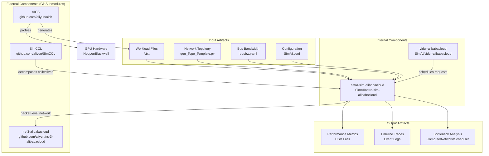
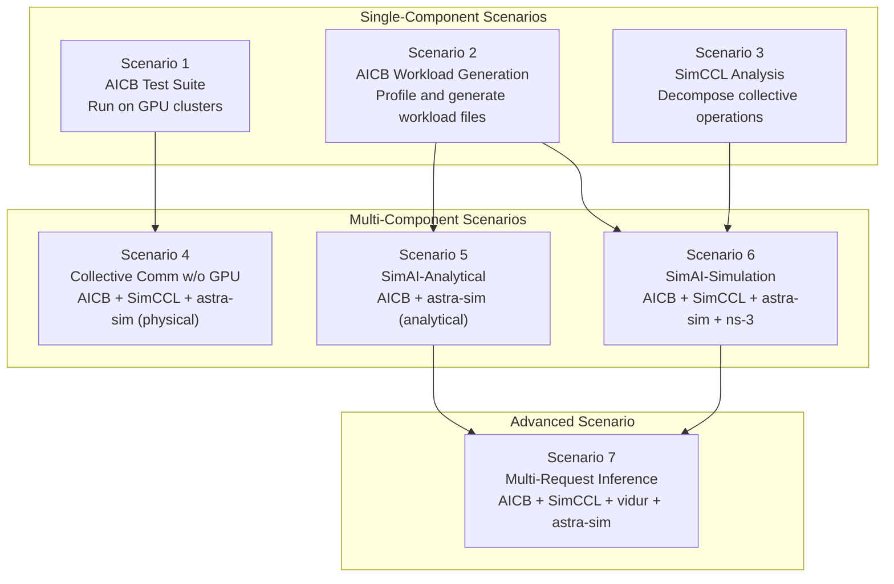

# aliyun/SimAI

> 作者: @cognition
> 原文链接: https://deepwiki.com/aliyun/SimAI/1-simai-overview

---
Index your code with Devin

[DeepWiki](/)

[DeepWiki](/)

[aliyun/SimAI](https://github.com/aliyun/SimAI "Open repository")

Index your code with

Devin

Edit WikiShare

Last indexed: 4 January 2026 ([cee5b9](https://github.com/aliyun/SimAI/commits/cee5b9f1))

-   [SimAI Overview](/aliyun/SimAI/1-simai-overview)
-   [System Architecture](/aliyun/SimAI/1.1-system-architecture)
-   [Key Components](/aliyun/SimAI/1.2-key-components)
-   [Key Concepts and Terminology](/aliyun/SimAI/1.3-key-concepts-and-terminology)
-   [Getting Started](/aliyun/SimAI/2-getting-started)
-   [Installation and Building](/aliyun/SimAI/2.1-installation-and-building)
-   [Quick Start Guide](/aliyun/SimAI/2.2-quick-start-guide)
-   [Simulation Modes](/aliyun/SimAI/3-simulation-modes)
-   [SimAI-Analytical Mode](/aliyun/SimAI/3.1-simai-analytical-mode)
-   [SimAI-Simulation Mode (NS-3)](/aliyun/SimAI/3.2-simai-simulation-mode-\(ns-3\))
-   [SimAI-Physical Mode](/aliyun/SimAI/3.3-simai-physical-mode)
-   [Multi-Request Inference (SimAI 1.5)](/aliyun/SimAI/3.4-multi-request-inference-\(simai-1.5\))
-   [Usage Scenarios](/aliyun/SimAI/4-usage-scenarios)
-   [Scenarios 1-3: Single Component Uses](/aliyun/SimAI/4.1-scenarios-1-3:-single-component-uses)
-   [Scenarios 4-6: Multi-Component Simulations](/aliyun/SimAI/4.2-scenarios-4-6:-multi-component-simulations)
-   [Scenario 7: Multi-Request Inference](/aliyun/SimAI/4.3-scenario-7:-multi-request-inference)
-   [Core Simulation Engine](/aliyun/SimAI/5-core-simulation-engine)
-   [System Orchestration (Sys)](/aliyun/SimAI/5.1-system-orchestration-\(sys\))
-   [Workload and Layer Management](/aliyun/SimAI/5.2-workload-and-layer-management)
-   [Event System and Scheduling](/aliyun/SimAI/5.3-event-system-and-scheduling)
-   [Network Abstraction Layer](/aliyun/SimAI/5.4-network-abstraction-layer)
-   [Communication and Parallelism](/aliyun/SimAI/6-communication-and-parallelism)
-   [Parallelism Policies](/aliyun/SimAI/6.1-parallelism-policies)
-   [Collective Communication Models](/aliyun/SimAI/6.2-collective-communication-models)
-   [Mock NCCL Implementation](/aliyun/SimAI/6.3-mock-nccl-implementation)
-   [Network Topologies](/aliyun/SimAI/7-network-topologies)
-   [Topology Templates](/aliyun/SimAI/7.1-topology-templates)
-   [Topology Generation Script](/aliyun/SimAI/7.2-topology-generation-script)
-   [Workload Specification](/aliyun/SimAI/8-workload-specification)
-   [Workload File Format](/aliyun/SimAI/8.1-workload-file-format)
-   [Layer Configuration](/aliyun/SimAI/8.2-layer-configuration)
-   [Example Workloads](/aliyun/SimAI/8.3-example-workloads)
-   [Configuration](/aliyun/SimAI/9-configuration)
-   [Command-Line Parameters](/aliyun/SimAI/9.1-command-line-parameters)
-   [Bus Bandwidth Configuration](/aliyun/SimAI/9.2-bus-bandwidth-configuration)
-   [Configuration Files](/aliyun/SimAI/9.3-configuration-files)
-   [External Integrations](/aliyun/SimAI/10-external-integrations)
-   [AICB Integration](/aliyun/SimAI/10.1-aicb-integration)
-   [SimCCL Integration](/aliyun/SimAI/10.2-simccl-integration)
-   [NS-3 Integration](/aliyun/SimAI/10.3-ns-3-integration)
-   [Vidur Integration](/aliyun/SimAI/10.4-vidur-integration)

Menu

# SimAI Overview

Relevant source files

-   [README.md](https://github.com/aliyun/SimAI/blob/cee5b9f1/README.md?plain=1)

## Purpose and Scope

This document provides a high-level introduction to SimAI, a full-stack simulator for large-scale AI training and inference workloads. It covers the system's purpose, major components, operation modes, and usage scenarios. For detailed information about specific components, see [Key Components](/aliyun/SimAI/1.2-key-components). For architectural details, see [System Architecture](/aliyun/SimAI/1.1-system-architecture). For terminology and concepts, see [Key Concepts and Terminology](/aliyun/SimAI/1.3-key-concepts-and-terminology).

Sources: [README.md1-229](https://github.com/aliyun/SimAI/blob/cee5b9f1/README.md?plain=1#L1-L229)

## What is SimAI

SimAI is an industry-first full-stack, high-precision simulator for AI large-scale **inference** and **training** workloads. It provides detailed modeling and simulation of the entire LLM training and inference process, encompassing the framework layer, collective communication layer, and network layer.

The system enables researchers to:

-   Analyze inference and training process details with cycle-accurate precision
-   Evaluate time consumption of AI tasks under specific hardware and software configurations
-   Evaluate end-to-end performance gains from algorithmic optimizations including:
    -   Framework parameter settings (batch size, sequence length, parallelism strategies)
    -   Collective communication algorithms (Ring, Tree, NVLS)
    -   NCCL environment variables
    -   Network transmission protocols (RDMA, TCP)
    -   Congestion control algorithms (DCQCN, HPCC, Swift)
    -   Adaptive routing algorithms
    -   Scale-up and scale-out network topology modifications

SimAI has been accepted by NSDI'25 Spring and is actively used in both academic research and industrial AI infrastructure optimization.

Sources: [README.md64-78](https://github.com/aliyun/SimAI/blob/cee5b9f1/README.md?plain=1#L64-L78)

## Component Architecture

| Component | Repository Location | Primary Purpose |
| --- | --- | --- |
| AICB | github.com/aliyun/aicb | AI Communication Benchmark - generates workload files by profiling compute and communication patterns of training/inference on real GPUs |
| SimCCL | github.com/aliyun/SimCCL | Simulated CCL - breaks down high-level collective operations (AllReduce, AllGather) into point-to-point communication primitives |
| astra-sim-alibabacloud | astra-sim-alibabacloud/ | Core simulation engine - coordinates workload execution, manages event scheduling, implements NCCL-style communication algorithms |
| ns-3-alibabacloud | github.com/aliyun/ns-3-alibabacloud | Network simulator - provides packet-level network modeling with support for RDMA, congestion control, and adaptive routing |
| vidur-alibabacloud | vidur-alibabacloud/ | Request scheduler - manages multi-request inference workloads with batching and scheduling policies (new in SimAI 1.5) |

SimAI consists of five major components, each serving a distinct purpose in the simulation pipeline:

These components can be used individually or combined in various ways depending on the simulation requirements. See [Usage Scenarios](/aliyun/SimAI/4-usage-scenarios) for details on different combinations.

Sources: [README.md79-94](https://github.com/aliyun/SimAI/blob/cee5b9f1/README.md?plain=1#L79-L94)

## Operation Modes

SimAI provides three distinct operation modes, each offering different trade-offs between simulation speed and accuracy:

```mermaid
graph LR
    subgraph AnalyticalMode["SimAI-Analytical Mode"]
        direction TB
        A_Input["Input:<br/>Workload + busbw.yaml"]
        A_Binary["Binary:<br/>./bin/SimAI_analytical"]
        A_Engine["astra-sim-alibabacloud<br/>analytical frontend<br/>AnalyticalAstra.cc"]
        A_Output["Output:<br/>Fast estimates<br/>seconds to complete"]
        
        A_Input --> A_Binary
        A_Binary --> A_Engine
        A_Engine --> A_Output
    end
    
    subgraph SimulationMode["SimAI-Simulation Mode"]
        direction TB
        S_Input["Input:<br/>Workload + Topology<br/>+ SimAI.conf"]
        S_Binary["Binary:<br/>./bin/SimAI_simulator"]
        S_Engine["astra-sim-alibabacloud<br/>ns3 frontend<br/>AstraSimNetwork.cc"]
        S_NS3["ns-3-alibabacloud<br/>packet-level simulation"]
        S_Output["Output:<br/>High-fidelity results<br/>minutes to hours"]
        
        S_Input --> S_Binary
        S_Binary --> S_Engine
        S_Engine <--> S_NS3
        S_NS3 --> S_Output
    end
    
    subgraph PhysicalMode["SimAI-Physical Mode"]
        direction TB
        P_Input["Input:<br/>Workload + Hostlist"]
        P_Binary["Binary:<br/>SimAI_phynet"]
        P_Engine["astra-sim-alibabacloud<br/>physical frontend"]
        P_Output["Output:<br/>Real RDMA traffic<br/>CPU cluster"]
        
        P_Input --> P_Binary
        P_Binary --> P_Engine
        P_Engine --> P_Output
    end
```

### Mode Comparison

| Mode | Fidelity | Speed | Use Case | Network Modeling |
| --- | --- | --- | --- | --- |
| Analytical | Low-Medium | Fast (seconds) | Parameter sweeps, early design exploration | Bus bandwidth abstraction via busbw.yaml |
| Simulation | High | Slow (minutes-hours) | Detailed performance analysis, algorithm validation | Packet-level ns-3 simulation with full protocol stack |
| Physical (Beta) | Real hardware | Real-time | Hardware validation, NIC behavior study | Actual RDMA traffic on CPU clusters |

**SimAI-Analytical** abstracts network communication using bus bandwidth values, allowing rapid iteration. Invoked via `./bin/SimAI_analytical` with parameters `-busbw example/busbw.yaml`. See [SimAI-Analytical Mode](/aliyun/SimAI/3.1-simai-analytical-mode) for details.

**SimAI-Simulation** provides full-stack simulation with detailed network modeling. Requires topology generation via `gen_Topo_Template.py` and invoked via `./bin/SimAI_simulator`. See [SimAI-Simulation Mode (NS-3)](/aliyun/SimAI/3.2-simai-simulation-mode-\(ns-3\)) for details.

**SimAI-Physical** generates NCCL-like traffic patterns on real CPU RDMA clusters for in-depth NIC behavior study. Currently in internal testing. See [SimAI-Physical Mode](/aliyun/SimAI/3.3-simai-physical-mode) for details.

Sources: [README.md98-104](https://github.com/aliyun/SimAI/blob/cee5b9f1/README.md?plain=1#L98-L104)

## Usage Scenarios

SimAI supports seven distinct usage scenarios that progressively increase in complexity and component integration:

### Scenario Overview

| Scenario | Description | Components | Target Use Case |
| --- | --- | --- | --- |
| 1. AICB Test Suite | Run communication patterns on actual GPU clusters | AICB | Hardware benchmarking, validation |
| 2. AICB Workload Generation | Profile compute/communication patterns to generate workload files | AICB | Creating simulation inputs from real models |
| 3. SimCCL Analysis | Break down collective operations into point-to-point primitives | SimCCL | Understanding communication algorithms |
| 4. Collective Comm w/o GPU | Perform RDMA collective communication on non-GPU clusters | AICB + SimCCL + astra-sim (physical) | Testing on CPU-only infrastructure |
| 5. SimAI-Analytical | Fast workload simulation with abstracted network | AICB + astra-sim (analytical) | Rapid parameter exploration |
| 6. SimAI-Simulation | Full-stack simulation with detailed network modeling | AICB + SimCCL + astra-sim + ns-3 | Accurate performance prediction |
| 7. Multi-Request Inference | Simulate production inference serving with request scheduling | AICB + SimCCL + vidur + astra-sim | Inference system optimization |

Scenarios 1-3 use individual components in isolation. See [Scenarios 1-3: Single Component Uses](/aliyun/SimAI/4.1-scenarios-1-3:-single-component-uses).

Scenarios 4-6 combine multiple components for simulation. See [Scenarios 4-6: Multi-Component Simulations](/aliyun/SimAI/4.2-scenarios-4-6:-multi-component-simulations).

Scenario 7 represents the most advanced use case, introduced in SimAI 1.5, requiring NVIDIA Hopper (SM90) or Blackwell (SM100) GPUs. See [Scenario 7: Multi-Request Inference](/aliyun/SimAI/4.3-scenario-7:-multi-request-inference).

Sources: [README.md106-114](https://github.com/aliyun/SimAI/blob/cee5b9f1/README.md?plain=1#L106-L114)

## Key Capabilities

### Workload Modeling

SimAI models AI workloads through workload files that specify:

-   **Compute operations**: Forward pass, backward pass, optimizer step execution times
-   **Communication operations**: AllReduce, AllGather, ReduceScatter, AlltoAll, P2P operations
-   **Parallelism strategies**: Data Parallelism (DP), Tensor Parallelism (TP), Pipeline Parallelism (PP), Expert Parallelism (EP)

Workload files are generated by AICB through profiling on real GPUs or can be manually specified. See [Workload Specification](/aliyun/SimAI/8-workload-specification) for format details.

### Network Topology Support

SimAI supports multiple predefined network topologies via `gen_Topo_Template.py`:

-   **Spectrum-X**: NVIDIA's RoCE-based fabric
-   **AlibabaHPN**: Alibaba's proprietary network architecture
-   **DCN+**: Enhanced data center network topology

Custom topologies can be defined by specifying switch hierarchy, link bandwidths, and routing policies. See [Network Topologies](/aliyun/SimAI/7-network-topologies) for details.

### Communication Algorithm Implementation

The core simulation engine in `astra-sim-alibabacloud` implements NCCL-style collective algorithms:

-   **Ring algorithms**: For bandwidth-optimized collectives
-   **Tree algorithms**: For latency-optimized collectives
-   **NVLS (NVLink-Sharp)**: For NVLink-based intra-node communication

Algorithms are implemented in [astra-sim-alibabacloud/workload/MockNcclGroup.cc](https://github.com/aliyun/SimAI/blob/cee5b9f1/astra-sim-alibabacloud/workload/MockNcclGroup.cc) and can be selected via environment variables. See [Mock NCCL Implementation](/aliyun/SimAI/6.3-mock-nccl-implementation).

### Multi-Request Inference (SimAI 1.5)

The latest release introduces production-like inference simulation:

-   **Request scheduling**: FCFS, Priority-based scheduling via `vidur-alibabacloud`
-   **Dynamic batching**: Balancing latency and throughput
-   **Prefill/Decode separation**: Realistic two-phase inference modeling
-   **Modern model support**: DeepSeek, Qwen3-MoE, Qwen3-Next

This capability requires hardware-accelerated libraries (DeepGEMM, FlashMLA) available only on Hopper/Blackwell GPUs. See [Multi-Request Inference (SimAI 1.5)](/aliyun/SimAI/3.4-multi-request-inference-\(simai-1.5\)).

Sources: [README.md5-16](https://github.com/aliyun/SimAI/blob/cee5b9f1/README.md?plain=1#L5-L16) [README.md182-192](https://github.com/aliyun/SimAI/blob/cee5b9f1/README.md?plain=1#L182-L192)

## Design Philosophy

### Modularity

SimAI's architecture separates concerns into independent components that can be composed as needed:

-   **Workload generation** (AICB) is decoupled from **simulation execution** (astra-sim-alibabacloud)
-   **Communication decomposition** (SimCCL) is optional, only needed for detailed network simulation
-   **Network backend** (ns-3, analytical, physical) is pluggable via frontend abstractions

This allows researchers to use only the components they need and swap implementations without modifying other parts of the system.

### Fidelity vs. Speed Trade-offs

Different research questions require different levels of detail:

-   **Analytical mode** sacrifices network detail for 100-1000x speedup, suitable for exploring large parameter spaces
-   **Simulation mode** provides cycle-accurate results at the cost of longer runtime
-   **Physical mode** validates on real hardware but requires physical infrastructure

Users typically follow a funnel approach: start with Analytical for broad exploration, validate promising configurations with Simulation, and optionally test on Physical hardware.

### Extensibility

SimAI is built on top of [astra-sim](https://github.com/aliyun/SimAI/blob/cee5b9f1/astra-sim) and extends it with:

-   NCCL algorithm implementations
-   Multiple execution frontends (analytical, ns-3, physical)
-   Support for diverse parallelism policies (TP, DP, PP, EP)
-   Integration with external tools (AICB, SimCCL, vidur)

The system welcomes community contributions and has active collaboration with academic institutions. See [README.md193-216](https://github.com/aliyun/SimAI/blob/cee5b9f1/README.md?plain=1#L193-L216) for acknowledgments.

Sources: [README.md94-95](https://github.com/aliyun/SimAI/blob/cee5b9f1/README.md?plain=1#L94-L95) [README.md193-216](https://github.com/aliyun/SimAI/blob/cee5b9f1/README.md?plain=1#L193-L216)

## Getting Started

To begin using SimAI:

1.  **Installation**: Clone the repository and initialize submodules. See [Installation and Building](/aliyun/SimAI/2.1-installation-and-building).
2.  **Choose a mode**: Select Analytical for speed or Simulation for accuracy. See [Simulation Modes](/aliyun/SimAI/3-simulation-modes).
3.  **Prepare inputs**: Generate workload files via AICB and optionally create topology files. See [Quick Start Guide](/aliyun/SimAI/2.2-quick-start-guide).
4.  **Run simulation**: Execute the appropriate binary (`SimAI_analytical` or `SimAI_simulator`) with required parameters.
5.  **Analyze results**: Examine output CSV files for performance metrics and bottleneck analysis.

For complete tutorials:

-   SimAI full documentation: [docs/Tutorial.md](https://github.com/aliyun/SimAI/blob/cee5b9f1/docs/Tutorial.md?plain=1)
-   AICB workload generation: [aicb/README.md](https://github.com/aliyun/SimAI/blob/cee5b9f1/aicb/README.md?plain=1) [aicb/training/tutorial.md](https://github.com/aliyun/SimAI/blob/cee5b9f1/aicb/training/tutorial.md?plain=1)
-   Multi-request inference: [vidur-alibabacloud/README.md](https://github.com/aliyun/SimAI/blob/cee5b9f1/vidur-alibabacloud/README.md?plain=1)

Sources: [README.md126-192](https://github.com/aliyun/SimAI/blob/cee5b9f1/README.md?plain=1#L126-L192)

## Version History

-   **SimAI 1.5 (December 2025)**: Introduced multi-request inference simulation with vidur-alibabacloud, DeepSeek/Qwen3-MoE model support, and Prefill/Decode separation
-   **SimAI 1.0 and earlier**: Core training simulation with AICB, SimCCL, astra-sim-alibabacloud, and ns-3-alibabacloud components

The project has been accepted by NSDI'25 Spring and continues active development with community contributions.

Sources: [README.md1-42](https://github.com/aliyun/SimAI/blob/cee5b9f1/README.md?plain=1#L1-L42) [README.md117-122](https://github.com/aliyun/SimAI/blob/cee5b9f1/README.md?plain=1#L117-L122)

Dismiss

Refresh this wiki

Enter email to refresh

### On this page

-   [SimAI Overview](#simai-overview)
-   [Purpose and Scope](#purpose-and-scope)
-   [What is SimAI](#what-is-simai)
-   [Component Architecture](#component-architecture)
-   [Operation Modes](#operation-modes)
-   [Mode Comparison](#mode-comparison)
-   [Usage Scenarios](#usage-scenarios)
-   [Scenario Overview](#scenario-overview)
-   [Key Capabilities](#key-capabilities)
-   [Workload Modeling](#workload-modeling)
-   [Network Topology Support](#network-topology-support)
-   [Communication Algorithm Implementation](#communication-algorithm-implementation)
-   [Multi-Request Inference (SimAI 1.5)](#multi-request-inference-simai-15)
-   [Design Philosophy](#design-philosophy)
-   [Modularity](#modularity)
-   [Fidelity vs. Speed Trade-offs](#fidelity-vs-speed-trade-offs)
-   [Extensibility](#extensibility)
-   [Getting Started](#getting-started)
-   [Version History](#version-history)

Ask Devin about aliyun/SimAI

Fast
