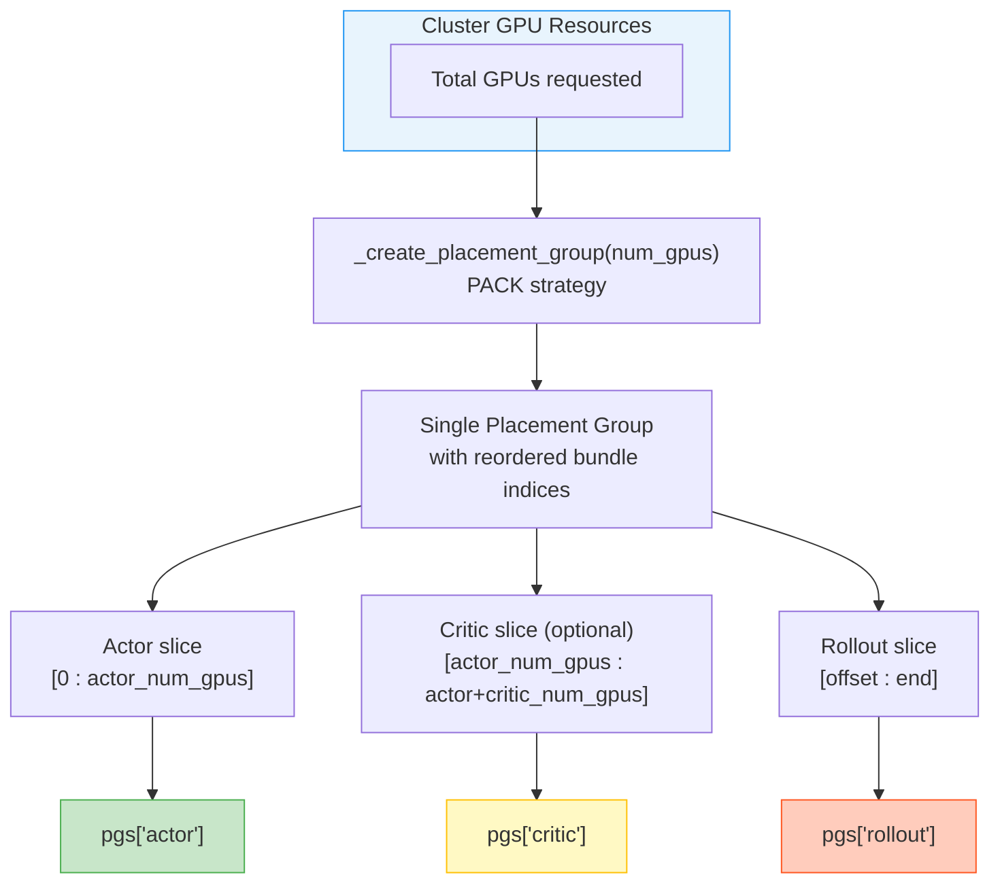
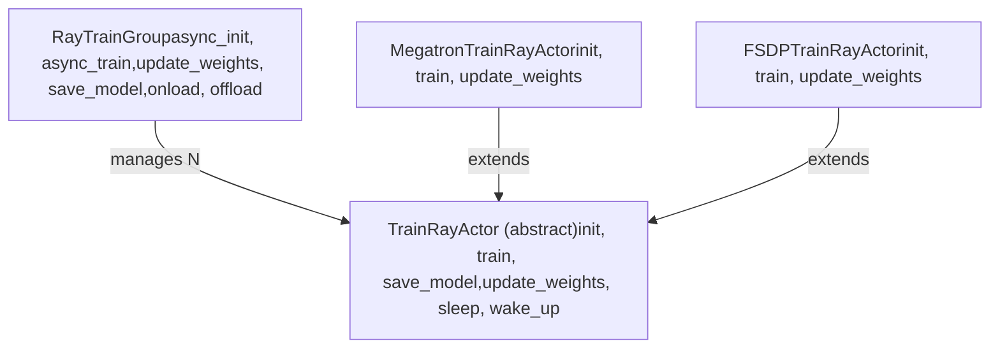
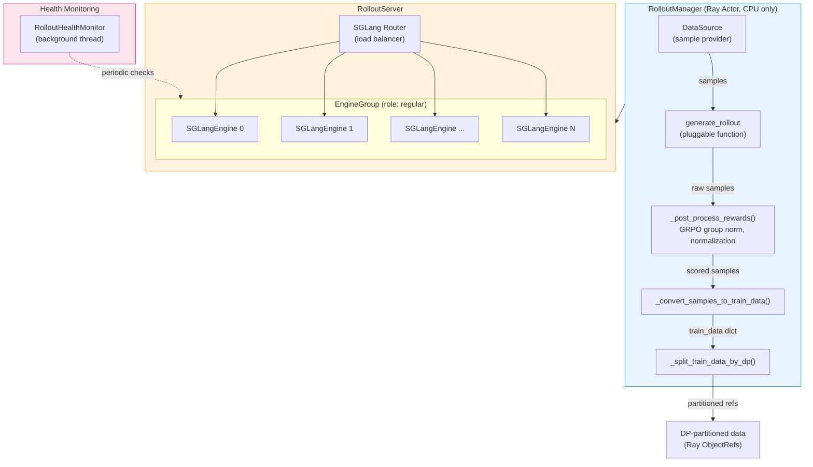
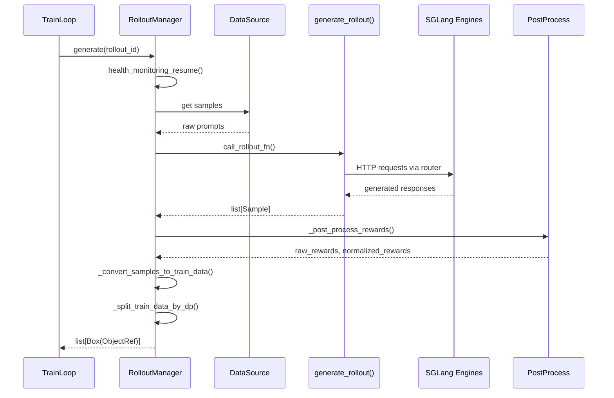
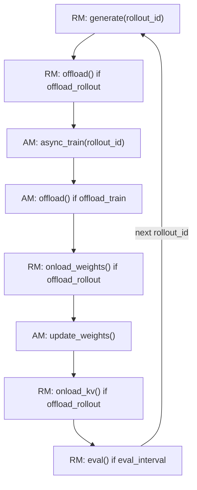
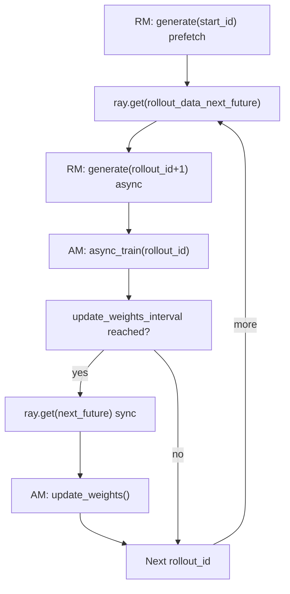
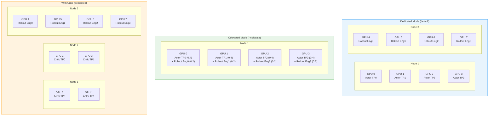
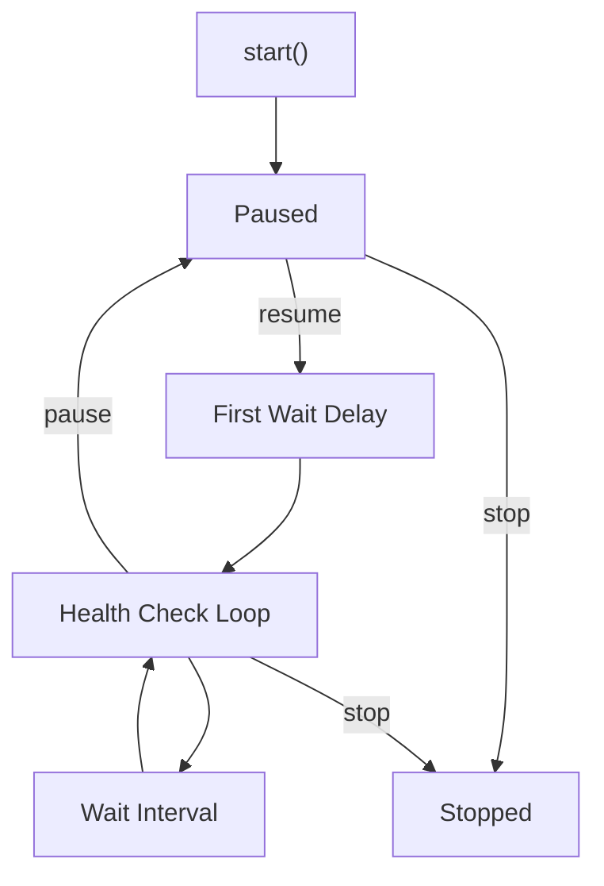

# DeepWiki

> 原文链接: https://wiki.litenext.digital/wiki/slime?file=02-distributed-orchestration

---

[<-Back to Index](index.md)

# Distributed Orchestration with Ray

**Part of**: [Architecture Documentation](index.md) **Generated**: 2026-02-25T00:00:00Z **Source commit**: 7014942c

* * *

## Introduction

SLIME uses Ray as its distributed computing backbone for coordinating all major components in a reinforcement learning post-training pipeline. The system decomposes the RL training loop into three distinct actor types -- training actors (actor model and optional critic model), a rollout manager, and SGLang inference engines -- all of which are Ray actors scheduled onto GPUs through Ray placement groups.

The placement group abstraction is the foundation of SLIME's resource management. Rather than letting Ray scatter actors across a cluster arbitrarily, SLIME constructs placement groups with a PACK strategy that guarantees GPU locality. This ensures that distributed training actors land on physically adjacent GPUs, minimizing cross-node communication during gradient synchronization, and that inference engines occupy their own dedicated GPU partition unless colocated mode is enabled.

On top of this resource layer, SLIME provides two training loop variants: a synchronous loop (`train.py`) that executes generation, training, and weight updates sequentially, and an asynchronous loop (`train_async.py`) that overlaps the next rollout generation with the current training step. Both loops use the same underlying actor abstractions but differ in how they schedule Ray futures.

The remainder of this document walks through each layer of the orchestration stack, from low-level placement group creation through actor group management, rollout coordination, async pipelining, and fault tolerance.

## Placement Group Management

Placement groups are the mechanism through which SLIME reserves and organizes GPU resources before any model is loaded. The core logic lives in `slime/ray/placement_group.py`.

### Creating a Single Placement Group

The `_create_placement_group` function allocates a contiguous block of GPUs with one bundle per GPU:

```python

def _create_placement_group(num_gpus):
    bundles = [{"GPU": 1, "CPU": 1} for _ in range(num_gpus)]
    pg = placement_group(bundles, strategy="PACK")
    ray.get(pg.ready())

    info_actors = []
    for i in range(num_bundles):
        info_actors.append(
            InfoActor.options(
                scheduling_strategy=PlacementGroupSchedulingStrategy(
                    placement_group=pg,
                    placement_group_bundle_index=i,
                )
            ).remote()
        )
    gpu_ids = ray.get([actor.get_ip_and_gpu_id.remote() for actor in info_actors])
    for actor in info_actors:
        ray.kill(actor)

    bundle_infos = [(i, gpu_ids[i][0], gpu_ids[i][1]) for i in range(num_bundles)]
    sorted_bundle_infos = sorted(bundle_infos, key=sort_key)
    pg_reordered_bundle_indices = [info[0] for info in sorted_bundle_infos]
    pg_reordered_gpu_ids = [gpu_ids[info[0]][1] for info in sorted_bundle_infos]

    return pg, pg_reordered_bundle_indices, pg_reordered_gpu_ids
```

The PACK strategy tells Ray to place as many bundles as possible on the same node, which is essential for GPU locality during distributed training. After allocation, the function spawns temporary `InfoActor` instances (one per bundle) to discover the physical IP address and GPU ID of each slot. These actors are killed immediately after returning their metadata.

The discovered (node, gpu\_id) pairs are sorted deterministically using the `sort_key` function (`slime/ray/placement_group.py:20-38`), which handles both IP address strings and hostnames. This sorting guarantees that logical rank 0, 1, 2, ... maps to a consistent physical ordering regardless of the order Ray scheduled the bundles.

### Allocating Groups for Multiple Roles

| Mode | Flag | GPU Layout |
| --- | --- | --- |
| Standard | (default) | Actor + Critic + Rollout on separate GPUs |
| Colocated | --colocate | Actor + Rollout share GPUs; Critic separate |
| Train-only debug | --debug_train_only | Actor + Critic only, no rollout GPUs |
| Rollout-only debug | --debug_rollout_only | Rollout only, no training GPUs |

The `create_placement_groups` function (`slime/ray/placement_group.py:79-119`) determines how many GPUs each role needs and carves them out of a single large placement group:


`--colocate`

Actor + Rollout share GPUs; Critic separate

Train-only debug

`--debug_train_only`

Actor + Critic only, no rollout GPUs

Rollout-only debug

`--debug_rollout_only`

Rollout only, no training GPUs

In colocated mode, the rollout offset is set to 0, meaning rollout engines are scheduled onto the same physical GPUs as training actors. This is enabled by allocating fractional GPU resources (`num_gpus_per_actor=0.4` in `allocate_train_group` at `slime/ray/placement_group.py:122-129`), allowing Ray to pack multiple actors onto a single GPU.

### Wiring Up the Components

After placement groups are allocated, three higher-level functions assemble the system:

1.  **`allocate_train_group()`** (`slime/ray/placement_group.py:122-129`): Wraps a placement group tuple into a `RayTrainGroup`, which manages the distributed training workers.

2.  **`create_training_models()`** (`slime/ray/placement_group.py:132-178`): Initializes actor and optional critic models. The actor is always initialized with a reference model when KL divergence is used (`kl_coef != 0 or use_kl_loss`). If a critic is present and not in `critic_train_only` mode, the actor and critic groups are connected via `actor_model.connect(critic_model)`.

3.  **`create_rollout_manager()`** (`slime/ray/placement_group.py:181-201`): Spawns the `RolloutManager` Ray actor with zero GPUs (it coordinates other actors rather than running on GPU itself), calculates the total number of rollouts from epoch count, and optionally offloads the rollout engines.

## Actor Group Management

The `RayTrainGroup` class (`slime/ray/actor_group.py:10-149`) is the primary abstraction for managing a distributed group of training workers. Each worker is a `TrainRayActor` (or one of its concrete subclasses) placed on a specific GPU bundle.


### Worker Allocation

During construction, `_allocate_gpus_for_actor` (`slime/ray/actor_group.py:46-106`) creates the Ray actors. The backend is selected dynamically:

```python

backend = self.args.train_backend
if backend == "megatron":
    from slime.backends.megatron_utils.actor import MegatronTrainRayActor
    actor_impl = MegatronTrainRayActor
else:
    from slime.backends.fsdp_utils import FSDPTrainRayActor
    actor_impl = FSDPTrainRayActor

TrainRayActor = ray.remote(num_gpus=1, runtime_env={"env_vars": env_vars})(actor_impl)
```

Workers are created sequentially because rank 0 must be initialized first to discover the master address and port. All subsequent workers receive these values so they can join the distributed process group:

```python

master_addr, master_port = None, None
for rank in range(world_size):
    actor = TrainRayActor.options(
        num_cpus=num_gpus_per_actor,
        num_gpus=num_gpus_per_actor,
        scheduling_strategy=PlacementGroupSchedulingStrategy(
            placement_group=pg,
            placement_group_bundle_index=reordered_bundle_indices[rank],
        ),
    ).remote(world_size, rank, master_addr, master_port)
    if rank == 0:
        master_addr, master_port = ray.get(actor.get_master_addr_and_port.remote())
    self._actor_handlers.append(actor)
```

### Key Operations

All group operations fan out to every worker and collect results. Methods prefixed with `async_` return lists of Ray `ObjectRef` without blocking:

-   **`async_init()`** (`slime/ray/actor_group.py:108-116`): Fires `init()` on each actor with args, role, and configuration flags. Returns object refs for all init calls.
-   **`async_train()`** (`slime/ray/actor_group.py:118-120`): Sends a rollout data reference to each actor for one training step. Each actor pulls the data from the Ray object store.
-   **`update_weights()`** (`slime/ray/actor_group.py:126-128`): Broadcasts the trained weights from the training cluster to the rollout engines. This is a blocking call that synchronizes all ranks.
-   **`save_model()`** (`slime/ray/actor_group.py:122-124`): Triggers distributed checkpoint saving across all ranks.
-   **`onload()` / `offload()`** (`slime/ray/actor_group.py:130-134`): Moves model parameters between GPU and CPU memory. This is used when training and rollout share GPUs in colocated mode, or when `--offload_train` is enabled.
-   **`connect()`** (`slime/ray/actor_group.py:139-145`): Links each actor worker with its corresponding critic worker, enabling actor-critic coordination during PPO-style training.

## Rollout Manager

The `RolloutManager` (`slime/ray/rollout.py:250-639`) is a Ray remote actor that serves as the central coordinator for data generation, reward calculation, and data distribution. Unlike training actors which run on GPUs, the RolloutManager itself runs on CPU only (`num_gpus=0`) and orchestrates the SGLang inference engines that occupy the rollout GPU partition.

### Architecture


### Data Classes

The rollout infrastructure uses two key data classes:

**EngineGroup** (`slime/ray/rollout.py:38-151`): Represents a homogeneous set of SGLang engines sharing the same tensor parallel size and placement group. Each engine group has a `role` field that can be `"regular"`, `"prefill"`, or `"decode"` -- the latter two support prefill-decode disaggregation for optimized serving. The `start_engines()` method creates Ray actors, allocates network ports, and fires non-blocking `init()` calls.

**RolloutServer** (`slime/ray/rollout.py:154-247`): Wraps one or more `EngineGroup` instances behind a shared router. In standard mode a single engine group is used; with PD disaggregation (`--prefill_num_servers`), separate prefill and decode groups are created. The `recover()` method handles engine failure by restarting dead engines and reinitializing their memory.

### The generate() Pipeline

The `generate()` method (`slime/ray/rollout.py:332-345`) executes the full rollout pipeline for one training step:

PostProcessSGLang Enginesgenerate\_rollout()DataSourceRolloutManagerTrainLoopPostProcessSGLang Enginesgenerate\_rollout()DataSourceRolloutManagerTrainLoopgenerate(rollout\_id)health\_monitoring\_resume()get samplesraw promptscall\_rollout\_fn()HTTP requests via routergenerated responseslist\[Sample\]\_post\_process\_rewards()raw\_rewards, normalized\_rewards\_convert\_samples\_to\_train\_data()\_split\_train\_data\_by\_dp()list\[Box(ObjectRef)\]

The `_convert_samples_to_train_data()` method (`slime/ray/rollout.py:520-583`) transforms raw `Sample` objects into the dictionary format expected by training backends. This includes:

-   Token sequences and response lengths
-   Processed rewards (with optional GRPO group normalization)
-   Loss masks (zeroed out for removed samples)
-   Rollout log probabilities for off-policy correction
-   Routed expert indices for MoE routing replay
-   Teacher log probabilities for on-policy distillation

### Data Partitioning

The `_split_train_data_by_dp()` method (`slime/ray/rollout.py:588-639`) divides the training data across data-parallel ranks. When `--balance_data` is enabled, it uses the Karmarkar-Karp balanced partitioning algorithm (`slime/utils/seqlen_balancing.py:20`) to distribute samples so that each DP rank receives approximately equal total sequence length, minimizing padding waste:

```python

if self.args.balance_data:
    partitions = get_seqlen_balanced_partitions(total_lengths, dp_size, equal_size=True)
else:
    partitions = [range(i, len(total_lengths), dp_size) for i in range(dp_size)]
```

Each partition is wrapped in a `Box` and placed into the Ray object store via `ray.put()`, producing lightweight references that training actors can pull without copying the full dataset.

### Rollout Server Startup

The `start_rollout_server()` function (`slime/ray/rollout.py:787-857`) orchestrates the complete startup sequence:

1.  Launch the SGLang router (or slime router) as a daemon process
2.  Calculate engine topology (engines per node, nodes per engine for multi-node TP)
3.  Create `EngineGroup` instances with the appropriate role
4.  Fire `start_engines()` on all groups concurrently
5.  Block until all engines report healthy

For PD disaggregation, prefill and decode engine groups are started concurrently to minimize wall-clock startup time.

## Train Actor Interface

The `TrainRayActor` base class (`slime/ray/train_actor.py:28-136`) defines the contract that all training backends must implement. It handles common initialization -- setting up `MASTER_ADDR`, `MASTER_PORT`, `WORLD_SIZE`, `RANK`, and `LOCAL_RANK` environment variables, initializing the PyTorch distributed process group, configuring NUMA affinity -- and delegates model-specific work to abstract methods.


-   **`MegatronTrainRayActor`** (`slime/backends/megatron_utils/actor.py:45`): Uses Megatron-LM for training with tensor/pipeline/context parallelism, mixed precision, and distributed checkpointing. Supports advanced features like routing replay for MoE models and on-policy distillation.

-   **`FSDPTrainRayActor`** (`slime/backends/fsdp_utils/__init__.py:3`): Uses PyTorch FSDP (Fully Sharded Data Parallelism) for training. Supports CPU offloading with hybrid distributed backends.

The `set_rollout_manager()` method (`slime/ray/train_actor.py:132-136`) wires each training actor to the rollout manager. On rank 0 only, it also pushes the training parallel configuration (DP size, TP size, PP size) to the rollout manager so that data can be correctly partitioned.

## Async Pipelining

SLIME provides two training loop implementations that differ fundamentally in how they schedule work across the Ray cluster.

### Synchronous Training Loop

```mermaid
flowchart LR
    subgraph baseInit["TrainRayActor.init()"]
        envSetup["Set env vars\nMASTER_ADDR, RANK, etc."]
        distInit["dist.init_process_group()"]
        glooInit["init_gloo_group()"]
        numaAffinity["Set NUMA affinity\nvia pynvml"]
    end

    envSetup --> distInit --> glooInit --> numaAffinity

    subgraph abstractMethods["Abstract Methods"]
        trainMethod["train()"]
        saveMethod["save_model()"]
        updateMethod["update_weights()"]
        sleepMethod["sleep()"]
        wakeMethod["wake_up()"]
        connectMethod["connect_actor_critic()"]
    end

    numaAffinity -.->|subclass implements| abstractMethods

    style baseInit fill:#e8f4fd,stroke:#2196F3
    style abstractMethods fill:#f3e5f5,stroke:#9C27B0
```


This loop supports the full feature set including colocated mode, train/rollout offloading, and critic models. The offload/onload cycle allows training and rollout to share the same GPUs by swapping models in and out of GPU memory.

### Asynchronous Training Loop

The async loop (`train_async.py:10-76`) overlaps rollout generation with training:


The key optimization is on lines 31 and 39 of `train_async.py`:

```python

rollout_data_next_future = rollout_manager.generate.remote(args.start_rollout_id)

if rollout_id + 1 < args.num_rollout:
    rollout_data_next_future = rollout_manager.generate.remote(rollout_id + 1)
```

The first `generate.remote()` call returns a future immediately. While the current training step executes on the training GPUs, the rollout manager concurrently generates the next batch of data on the rollout GPUs. This hides most of the generation latency behind training computation.

The `update_weights_interval` parameter (`train_async.py:62-66`) controls how frequently weights are synchronized from training to rollout. Before updating, the loop must drain any pending generation future to prevent updating weights mid-generation:

```python

if (rollout_id + 1) % args.update_weights_interval == 0:
    rollout_data_curr_ref = ray.get(x) if (x := rollout_data_next_future) is not None else None
    rollout_data_next_future = None
    actor_model.update_weights()
```

Note that colocated mode is explicitly not supported in async training (`train_async.py:11`), since overlapping training and rollout on the same GPUs would cause memory contention.

## GPU Resource Allocation

The following diagram shows how SLIME allocates GPUs across different deployment configurations:


In colocated mode, fractional GPU allocation is the key enabler. Training actors request `0.4` GPUs each (`slime/ray/placement_group.py:128`), while rollout engines request `0.2` GPUs each (`slime/ray/rollout.py:82-83`). Ray's fractional resource scheduling allows both to occupy the same physical GPU. The offload/onload mechanism ensures that only one workload's model weights are resident in GPU memory at any given time.

For multi-node tensor parallelism, the `nodes_per_engine` calculation in `start_rollout_server()` (`slime/ray/rollout.py:809`) determines how many nodes each engine spans:

```python

num_gpu_per_engine = min(args.rollout_num_gpus_per_engine, args.num_gpus_per_node)
total_num_engines = args.rollout_num_gpus // num_gpu_per_engine
nodes_per_engine = max(1, args.rollout_num_gpus_per_engine // args.num_gpus_per_node)
```

When `rollout_num_gpus_per_engine` exceeds `num_gpus_per_node`, each SGLang engine spans multiple nodes with cross-node tensor parallelism. The port allocation logic in `_allocate_rollout_engine_addr_and_ports_normal()` (`slime/ray/rollout.py:658-728`) handles the additional complexity of assigning `dist_init_addr` ports that all nodes within a single engine share.

## Fault Tolerance

SLIME implements fault tolerance for rollout engines through the `RolloutHealthMonitor` class (`slime/utils/health_monitor.py:10-178`). Training actors, being part of a tightly coupled distributed process group, do not support individual recovery -- if a training actor dies, the entire job must restart. Rollout engines, however, can be individually restarted because they are stateless inference servers.

### Health Monitor Architecture


The monitor runs as a daemon thread within the `RolloutManager` process. It has three states:

-   **Paused**: No health checks run. This is the state during offload periods or when the rollout manager is not actively generating data.
-   **Checking**: Active health checks run at `rollout_health_check_interval` intervals. After each resume, a configurable `rollout_health_check_first_wait` delay allows large models (particularly MoE models) time to fully initialize before being checked.
-   **Stopped**: Terminal state, reached during cleanup.

### Health Check Mechanism

Each check calls `engine.health_generate.remote()` with a configurable timeout (`slime/utils/health_monitor.py:150-158`):

```python

try:
    ray.get(engine.health_generate.remote(timeout=self._check_timeout))
except Exception as e:
    logger.error(
        f"Health check failed for rollout engine {rollout_engine_id}. Killing actor."
    )
    self._kill_engine(rollout_engine_id=rollout_engine_id)
```

When a health check fails (either through a timeout or an exception), the monitor kills the entire engine group for that logical engine ID. For multi-node engines, this means killing all `nodes_per_engine` Ray actors (`slime/utils/health_monitor.py:160-177`). Dead engines are set to `None` in the `all_engines` list, which the `RolloutServer.recover()` method (`slime/ray/rollout.py:205-232`) detects and replaces:


The monitor is paused automatically during offload periods (when engines have released their GPU memory) and during weight updates, preventing false positives from engines that are intentionally unresponsive. The pause/resume lifecycle is managed by the `RolloutManager.health_monitoring_pause()` and `health_monitoring_resume()` methods (`slime/ray/rollout.py:394-399`).

### Coordination with the Router

When an engine dies, it is removed from the SGLang router's active worker pool. The router detects dead backends through failed HTTP connections and stops sending requests to them. After `recover()` creates replacement engines, the new engines register themselves with the router during their `init()` call. The `Lock` actor (`slime/ray/utils.py:38-56`) provides mutual exclusion to prevent concurrent weight updates and recovery operations from conflicting.

## Summary

SLIME's distributed orchestration layer provides a structured approach to managing the complex resource requirements of reinforcement learning post-training. The architecture is built on several key design decisions:

**Single placement group with logical partitioning**: Rather than creating separate placement groups for each role, SLIME allocates one large PACK group and slices it into actor, critic, and rollout segments. This ensures physical locality within each segment while maintaining a simple, deterministic GPU assignment.

**Facade pattern for actor groups**: The `RayTrainGroup` class provides a uniform interface for fan-out operations across distributed workers, abstracting away the details of Ray actor management. Backend-specific logic is pushed down into `TrainRayActor` subclasses.

**Centralized rollout coordination**: The `RolloutManager` acts as a single point of control for data generation, post-processing, and distribution. By running on CPU only, it avoids competing for GPU resources while maintaining full visibility into the rollout pipeline.

**Flexible pipelining**: The synchronous and asynchronous training loops share the same actor abstractions but offer different latency/throughput tradeoffs. The async loop can reduce wall-clock time by up to the duration of one rollout generation per training step, at the cost of training on slightly stale data (the model used for generation is one weight-update behind).

**Engine-level fault tolerance**: The health monitor and recovery system allow individual rollout engines to fail and restart without disrupting the training loop. This is particularly important for long-running training jobs where hardware failures are expected over multi-day runs.

Together, these components form a layered system where resource allocation (placement groups) underpins actor management (train groups and rollout manager), which in turn supports the training loop orchestration (sync or async pipelining), with fault tolerance as a cross-cutting concern monitoring the most failure-prone component.
