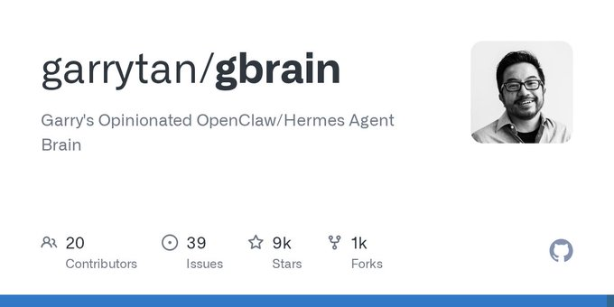

# (19) X 上的 Garry Tan：“If you want your OpenClaw or Hermes Agent to be able to have perfect total recall of all 10,000+ markdown files, GBrain is here to help.

It's exactly my OpenClaw/Hermes Agent setup. MIT-licensed open source. Hope it helps you build your mini-AGI.

https://t.co/yFpFU4pn5b” / X

> 发布时间: 2026-04-10T07:00:15.000Z
> 原文链接: https://x.com/garrytan/status/2042497872114090069?s=12&t=NY2Gen7OO07bmDYBV03nRg

---

[

Garry Tan

](/garrytan)

[

@garrytan

](/garrytan)

订阅

点击 订阅 到 garrytan

显示翻译

If you want your OpenClaw or Hermes Agent to be able to have perfect total recall of all 10,000+ markdown files, GBrain is here to help. It's exactly my OpenClaw/Hermes Agent setup. MIT-licensed open source. Hope it helps you build your mini-AGI.

[

GitHub - garrytan/gbrain: Garry's Opinionated OpenClaw/Hermes Agent Brain

](https://t.co/yFpFU4pn5b)

[来自 github.com](https://t.co/yFpFU4pn5b)

[下午3:00 · 2026年4月10日](/garrytan/status/2042497872114090069)

·

[

106.3万

查看](/garrytan/status/2042497872114090069/analytics)

227

799

5,973

1万

相关

[查看引用](/garrytan/status/2042497872114090069/quotes)
