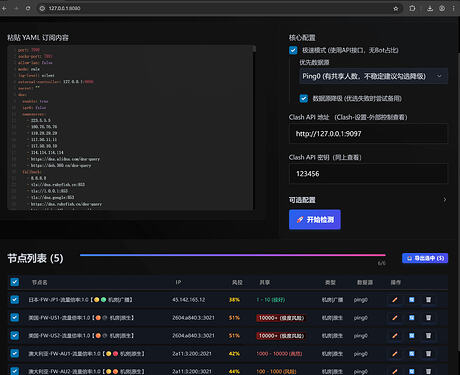
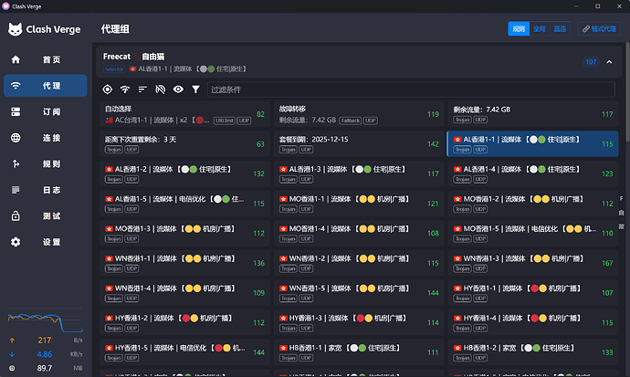

# [开源] 写了个 Clash 批量IP检测节点重命名工具： IP 纯净度 + Bot 比例 + IP属性来源 - 开发调优

> 发布时间: 2025-12-13T04:39:55+00:00
> 原文链接: https://linux.do/t/topic/1305514

---

[imfine](/u/imfine)

3

[Dec 2025](/t/topic/1305514?u=charles1 "Post date")

### 2.0更新 (2026-01-11)

-   **Web UI**: 全新推出 Web 可视化界面配置检测，操作更便捷。
-   **多源检测**: 新增 `Ping0` 检测源 支持共享人数，与 `ippure` 互补，并设为默认（速度与信息量平衡更佳）。
-   **智能降级**: 新增 `Fallback` 机制，例如：Ping0 失败时自动切换至 IPPure。
-   **极速默认**: 极速模式 (`fast_mode`) 默认开启，大幅提升批量检测效率。
-   **单点重测**: Web 界面支持对单个节点进行重新检测，方便复核。
-   **导出增强**: 支持检测结果的实时预览、编辑和一键导出，一键导入Clash

    [

    image1920×1561 296 KB

    ](https://cdn3.ldstatic.com/original/4X/e/1/e/e1e2ecf9eaed5567520f07ae65299bb8cbd803af.jpeg "image")

* * *

### 12.18更新：

之前分享的本地脚本受限于整体方案使用有点费劲，但没想到开源后挺多人点赞有点受宠若惊，一直思考如何优化，后来与IPPure沟通更新了API模式，效率有了很大提升，评论区有很多人提了宝贵的意见，所以再更新一版Docker部署方案，一键替换订阅链接轻松使用

* * *

### 12.17更新：

更新官网展示：官网 [Clash IP Checker - 节点纯净度检测与标记](https://tombcato.github.io/clash-ip-checker/)
更新极速模式：暂时默认 **关闭**，通过 IPPure API 直接检测，速度比浏览器模式快 10 倍以上！但缺少 Bot 比例分析，输出`【🟢 住宅|原生】`，可在config.yaml中设置`fast_mode = True`开启

* * *

## 正文

大家好，最近手里的节点有点杂，有些虽然能通但 IP 质量堪忧（老弹验证码）。找了很多网站查IP纯净度，最后发现这个IPPure（[https://ippure.com](https://ippure.com)）不错信息很全，于是随手写了个自动化工具 Clash IP Checker

核心痛点：不是单个节点的检测，而是测所有节点然后标记出来方便在使用时区分避免选到垃圾节点。

开源地址：

[

image2368×1418 416 KB

](https://cdn3.ldstatic.com/original/4X/1/7/7/1770151fc0ba4705180242027c4fd374154573b5.png "image")

主要功能：
通过Clash外部控制自动切换 Clash 节点，基于 Playwright 模拟调用 IPPure，检测结果自动修改配置在节点名后加 Emoji 标记，最后输出yaml文件手动导入Clash即可

使用说明见README:

标记：`【🟢🟡 属性|来源】`

-   **第 1 个 Emoji ()**: **IP 纯净度** (值越低越好，越低越像真实用户)
-   **第 2 个 Emoji ()**: **Bot 比例** (值越低越不容易被反爬，越高来自机器人的流量更大更容易弹验证)
-   **属性**: 机房、住宅
-   **来源**: 原生、广播

觉得好用的话求个 Star !\[\] 有 bug 欢迎提 issue！

-   [[开源] Clash IP Checker Docker部署方案一键检测IP质量](https://linux.do/t/topic/1330503)
-   [[开源] Nodejs复刻了一下 Clash 批量IP检测节点重命名工具](https://linux.do/t/topic/1323228)
