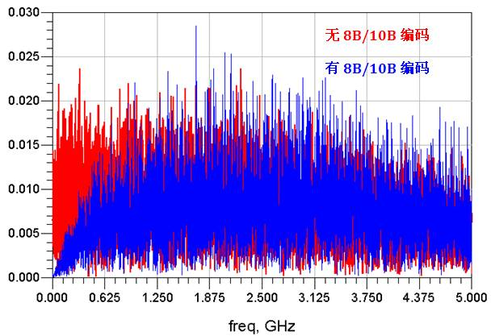

# 答题

> 原文链接: http://www.sohu.com/a/165596586_657253

---
**【文：黄刚】**

问

答

通过上面的介绍，大家对8B/10B编码有一个初步的认识了吧，上面对编码的原因也提了下，问题就是大家能再总结叙述下为什么要进行编码吗？

对于一些常见的编码方式而言，即使在我们不知道它们有什么好处的情况下，也很容易想到它的缺点，那就是需要增加额外的数据bit。因此我们看到很多像PCIE1，明明传输了2.5Gbps的数据，但是实际上有用的数据只有2G；PCIE2也一样，5Gbps的数据由于的只有4G。对于8B/10B编码而言，这是一笔不小的损失。人们还是要用这种编码，也正说明了它的好处显然会大于它的坏处。很多网友也回答得非常精准，我再稍微汇总下大家的答案哈。

首先，使用8B/10B编码的根本目的是为了直流平衡，所谓直流平衡，在上文中也图文并茂的解释过了。但是说到保证直流平衡又是为了什么呢？我们可以对上文的prbs7码型（10Gbps）进行有和没有8B/10B编码的频谱进行分析，如下所示：

可以看到，进行8B/10B编码后，信号在低频段的能量明显少了，补充到了高频能量中去了。其实，这就相对于一个高通滤波器，根本作用和之前说的加重均衡时一样的，就是使经过传输通道后保持平坦的频域曲线，这样能有效缓解ISI码间干扰，使接收眼图扩大。所以说，使眼图变好的方式有很多，但是万变也不离其中，原理都是殊途同归的。

另外，通过8B/10B后，连续0或1的数量减少了，对于时钟恢复电路（CDR）也是有帮助的。它使CDR能够有更多的边沿变换，对于CDR的PLL来说，更能把握到数据的内嵌时钟，对正确采样数据和减小抖动有很大的益处。

其他的作用还包括：

增加一些校验的码型，起到数据对齐和控制命令的作用，增加纠错的能力；

编码后起到加密的作用；

编码有一定的规律的码型，对解码来说也有帮助。

今天的回答就说到这，请大家继续关注下期文章，谢谢。

保证直流平衡;减小眼图抖动和偏移，利于时钟恢复，利于均衡信号质量恢复

@ Ben

总得来说，进行8b/10b编码，是为了提高串行数据传输的可靠性。 经过编码后，有如下作用： 1. 根据编码规则，有效避免了长连0和长连1的情况，有了足够多的跳变沿，接收端可以从数据中进行时钟恢复； 2. 在信号链路上采用AC耦合，可以实现直流平衡； 3. 有利于信号校验； 4. 可嵌入时钟信息或控制字符。 8b/10b效率较低，目前高速率串行链路会采用更高效率的编码方式。

@ alpb⊃2;⁰⊃1;⁷

首先，编码分为信源编码和信道编码 其次，提高传输的可靠性。例如，对于8b/10b，通过增加冗余（此外冗余为2b）以提高数据传输的可靠性。 还有，就是提供给信息以某种保护以防止信息受到干扰。有一定的纠错能力。 最后，编码可以防止连续“0”以及连续“1”的出现，造成某几个频点过高，目的是：DC Balance。 一句话，编码可以让信号更好地进行传输，并更好地加密信息，让信息的传输更具安全性。

@ 愿
