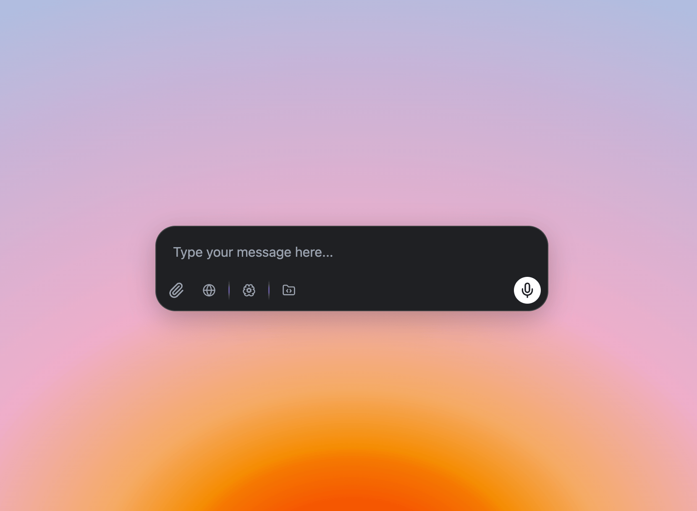
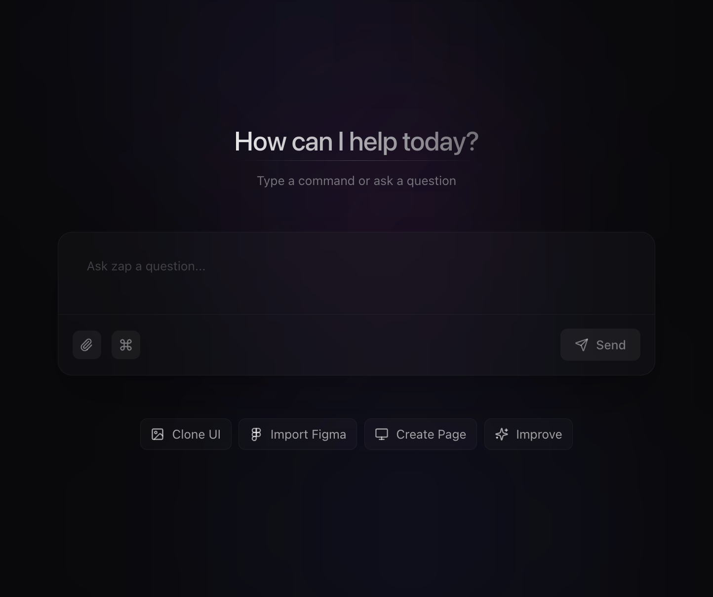
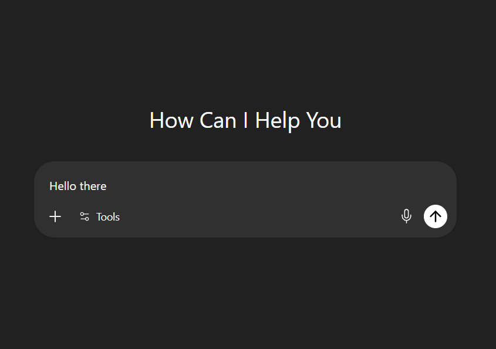
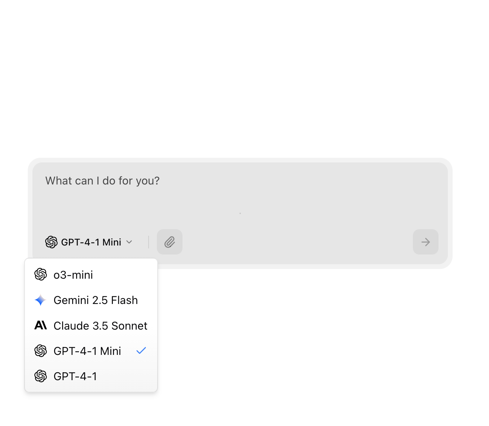
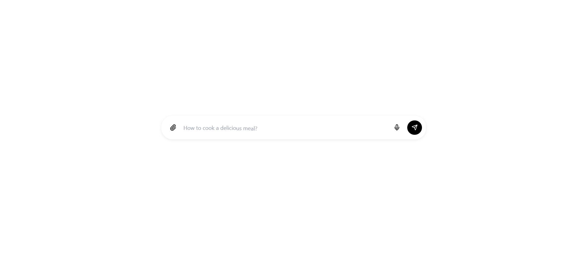

# Discover community-made UI components | 21st

> 原文链接: https://21st.dev/community/components
> Explore, copy, and remix thousands of high-quality React components published to the 21st.dev Community by designers and developers.

---
[Featured](/community/components/featured) · [Newest](/community/components/newest) · [Best of the Week](/community/components/week/2026-W19) ·  · 

#### Marketing Blocks

[Announcements10](/community/components/s/announcement) · [Backgrounds33](/community/components/s/background) · [Borders12](/community/components/s/border) · [Calls to Action34](/community/components/s/call-to-action) · [Clients16](/community/components/s/clients) · [Comparisons6](/community/components/s/comparison) · [Docks6](/community/components/s/dock) · [Features36](/community/components/s/features) · [Footers14](/community/components/s/footer) · [Heroes73](/community/components/s/hero) · [Hooks31](/community/components/s/hook) · [Images26](/community/components/s/image) · [Maps2](/community/components/s/map) · [Navigation Menus11](/community/components/s/navbar-navigation) · [Pricing Sections17](/community/components/s/pricing-section) · [Scroll Areas24](/community/components/s/scroll-area) · [Shaders15](/community/components/s/shader) · [Testimonials15](/community/components/s/testimonials) · [Texts58](/community/components/s/text) · [Videos9](/community/components/s/video)

#### UI Components

[Accordions40](/community/components/s/accordion) · [AI Chats30](/community/components/s/ai-chat) · [Alerts23](/community/components/s/alert) · [Avatars17](/community/components/s/avatar) · [Badges25](/community/components/s/badge) · [Buttons130](/community/components/s/button) · [Calendars34](/community/components/s/calendar) · [Cards79](/community/components/s/card) · [Carousels16](/community/components/s/carousel) · [Checkboxes19](/community/components/s/checkbox) · [Date Pickers12](/community/components/s/date-picker) · [Dialogs / Modals37](/community/components/s/modal-dialog) · [Dropdowns25](/community/components/s/dropdown) · [Empty States1](/community/components/s/empty-state) · [File Trees2](/community/components/s/file-tree) · [File Uploads7](/community/components/s/upload-download) · [Forms23](/community/components/s/form) · [Icons10](/community/components/s/icons) · [Inputs102](/community/components/s/input) · [Links13](/community/components/s/link) · [Menus18](/community/components/s/menu) · [Notifications5](/community/components/s/notification) · [Numbers18](/community/components/s/number) · [Paginations20](/community/components/s/pagination) · [Popovers23](/community/components/s/popover) · [Radio Groups22](/community/components/s/radio-group) · [Selects62](/community/components/s/select) · [Sidebars10](/community/components/s/sidebar) · [Sign Ins4](/community/components/s/sign-in) · [Sign ups4](/community/components/s/registration-signup) · [Sliders45](/community/components/s/slider) · [Spinner Loaders21](/community/components/s/spinner-loader) · [Tables30](/community/components/s/table) · [Tabs38](/community/components/s/tabs) · [Tags6](/community/components/s/chip-tag) · [Text Areas22](/community/components/s/textarea) · [Toasts2](/community/components/s/toast) · [Toggles12](/community/components/s/toggle) · [Tooltips28](/community/components/s/tooltip)

Components

### Newest

-   

    Glassmorphism Statistics Card

-   

    Animated Checkbox

-   

    Drag To Confirm Slider

-   

    Floating Label Input

-   

    Floating Info Panel

-   

    Draggable List

-   

    Glass Sign In Card

-   

    Native Tooltip

-   

    Native Button

-   

    Native Dialog

### Popular

-   

    Spline Scene

-   

    Container Scroll Animation

-   

    Animated hero

-   

    Aurora Background

-   

--- (head: first 80 lines of cleaned output, full slug ~830 lines / 17.6 KB)
--- After P-38 cleanups: 94 multi-line wrappers collapsed, 3 link chains split, 218 avatar/profile links stripped (106 image-link + 112 text-link residuals)
