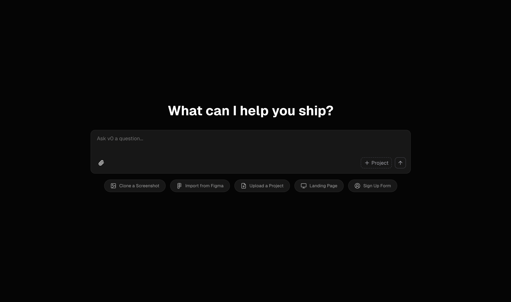
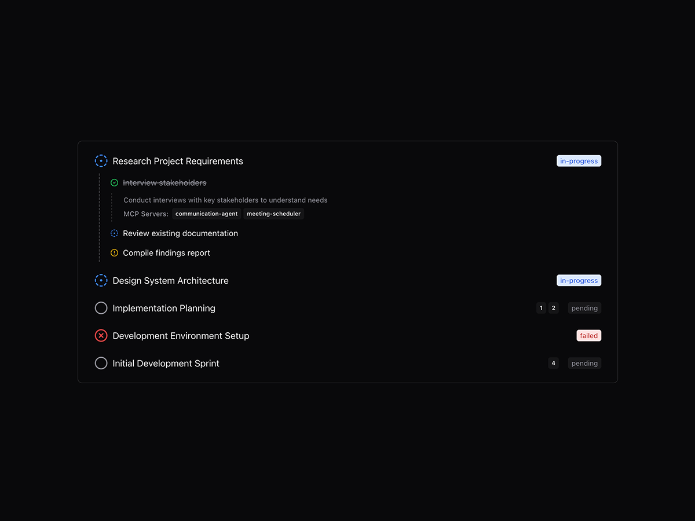
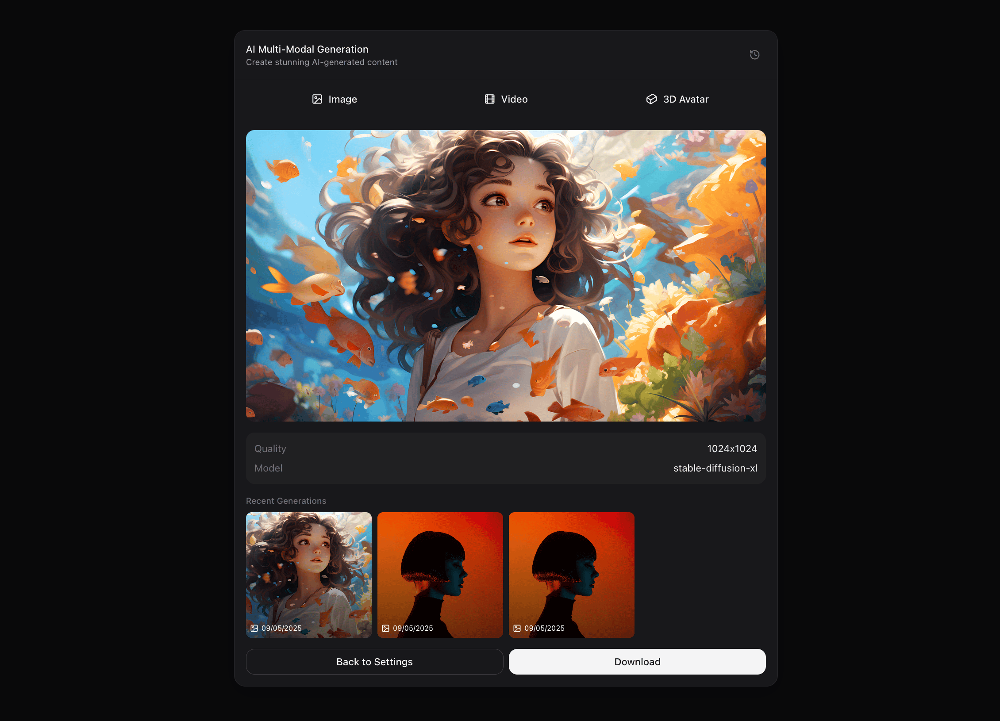
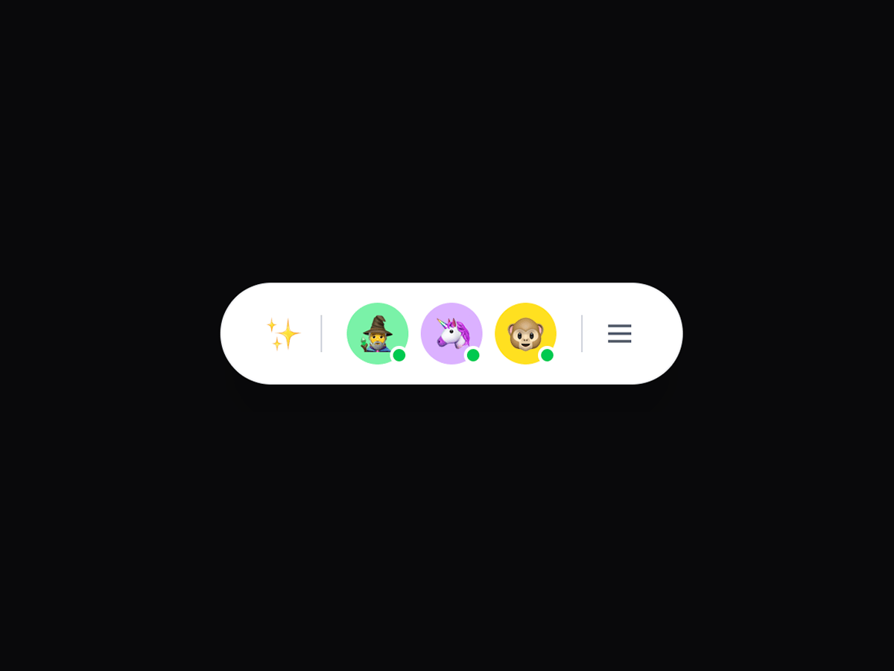
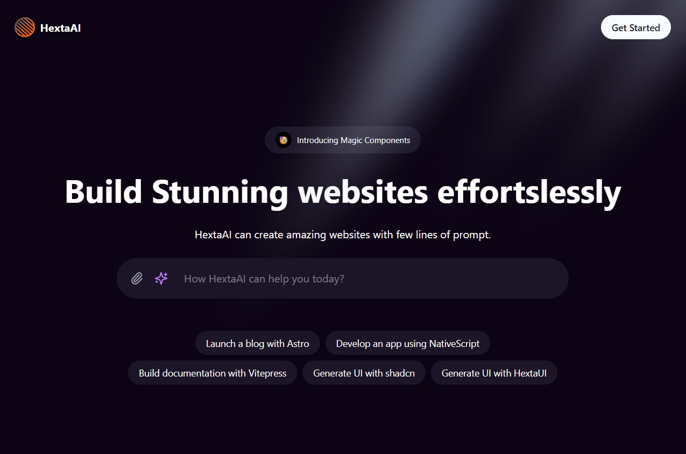

# 21st.dev — AI Agent Registry, UI Components & Developer Tools for the Agentic Internet

> 原文链接: https://21st.dev
> Ship AI-powered products faster with 21st.dev. Browse the open AI agent registry, discover ready-to-use agent configs for Claude Managed Agents, copy React UI components, and build with the Agents SDK.

---
[Home](/)

#### Explore

[MCP](/mcp)

#### Build

[

1Code](/1code)[Magic Chat](/magic)

Home

### UI Components

-   

    [HJ](/community/easemize)

    AI prompt Box

-   

    [KU](/community/kokonutd)

    V0 AI Chat

-   

    [JY](/community/jatin-yadav05)

    Animated AI Chat

-   

    [I](/community/isaiahbjork)

    Agent Plan

-   

    [HJ](/community/easemize)

    Chatgpt Prompt Input

-   

    [AI](/community/aliimam)

    AI Gen

-   

    [KU](/community/kokonutd)

    Animated AI Input

-   

    [I](/community/isaiahbjork)

    Message Dock

-   

    [H](/community/hextaui)

    AI Chat Input

-   

    [H](/community/hextaui)

    Hero 1

### Agent Templates

### Agents SDK

[Read docs](/agents/docs)

#### The fastest way to ship AI agents

Built-in UI, chat history, spend limits, sandbox execution, and observability. Works with Claude and OpenAI.

[Get started](/agents/app)[Documentation](/agents/docs)

E2B Sandboxes

Isolated VM per session

Streaming

Token-by-token via SSE

Auth & Limits

Tokens, rate limits, spend caps

Observability

Session replay & traces
