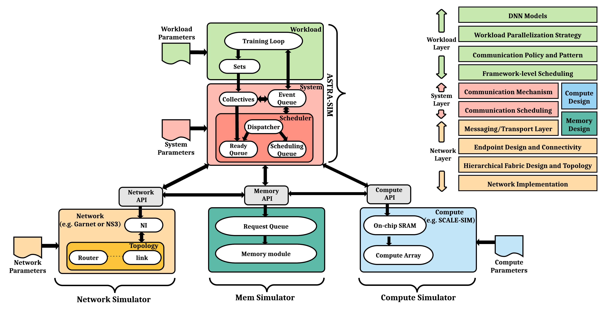

# ASTRA-sim

> 原文链接: https://astra-sim.github.io/
> An Open-source Distributed Deep Learning Training Simulator Infrastructure

---


### \[Tutorial at ISCA 2026\]
ASTRA-sim: Enabling Software-Hardware Co-Design Exploration for Distributed Machine Learning Platforms

We will be organizing the ASTRA-sim tutorial at ISCA 2026!
Jun 27, 2026.
Raleign Convention Center, Raleigh, NC.

[Read More](/tutorials/isca-2026)

## Overview

ASTRA-sim is a distributed machine learning system simulator. It enables the systematic study of challenges in modern deep learning systems, allowing for the exploration of bottlenecks and the development of efficient methodologies for large DNN models across diverse future platforms. Using ASTRA-sim’s APIs, you can plug-and-play with any network, compute, or memory simulator backends.

Below is a concise visual summary of our simulator: 

## Contact Us

-   For any questions about using ASTRA-sim, you can email the ASTRA-sim User Mailing List: [astrasim-users@googlegroups.com](mailto:astrasim-users@googlegroups.com)
-   To join the mailing list, please fill out this [form](https://forms.gle/18KVS99SG3k9CGXm6).

## Useful Links

### Documentation

-   For information on how to use ASTRA-sim, please visit our [Wiki](https://astra-sim.github.io/astra-sim-docs/index.html).
-   For Chakra MLCommons working group, please visit [here](https://mlcommons.org/working-groups/research/chakra/).

### GitHub Repositories

-   [ASTRA-sim](https://github.com/astra-sim/astra-sim)
-   [Chakra](https://github.com/mlcommons/chakra)
-   Network Simulators
    -   [Analytical Network Simulator](https://github.com/astra-sim/astra-network-analytical)
    -   [ns-3 Network Simulator](https://github.com/astra-sim/astra-network-ns3)
    -   [Garnet Network Simulator](https://github.com/astra-sim/astra-network-garnet)
-   Compute Simulators
    -   Roofline, SCALE-sim, and more in progress
-   Memory Simulators
    -   [Analytical Memory Simulator](https://github.com/astra-sim/astra-memory-analytical)

### Papers

The full description of the tool and its strength can be found in these papers.

-   ASTRA-sim2.0 (ISPASS 2023) [paper](https://arxiv.org/abs/2303.14006) [slides](/assets/papers/astra-sim2/ASTRA-sim2-ISPASS_2023.pdf) [video](https://youtu.be/QGilXx_GEXs?si=3bASNTAtyTsk_Gi8)

```
@INPROCEEDINGS{won2023astrasim2,
  author={Won, William and Heo, Taekyung and Rashidi, Saeed and Sridharan, Srinivas and Srinivasan, Sudarshan and Krishna, Tushar},
  booktitle={2023 IEEE International Symposium on Performance Analysis of Systems and Software (ISPASS)},
  title={ASTRA-sim2.0: Modeling Hierarchical Networks and Disaggregated Systems for Large-model Training at Scale},
  year={2023},
  volume={},
  number={},
  pages={283-294},
  keywords={Training;Semiconductor device modeling;Analytical models;Network topology;Systems modeling;Throughput;Data models;Distributed training;High-performance training;Multi-dimensional network;Disaggregated memory system},
  doi={10.1109/ISPASS57527.2023.00035}}
```

-   ASTRA-sim (ISPASS 2020) [paper](https://sites.gatech.edu/ece-synergy/files/2020/08/astrasim_ispass2020.pdf) [slides](https://cpb-us-w2.wpmucdn.com/sites.gatech.edu/dist/c/332/files/2020/08/ISPASS2020-ASTRA-SIM_talk.pdf) [video](https://www.youtube.com/watch?v=S-HE9yBv8_I&list=PLHJB2bhmgB7crXM7wBKIDi7OEa0UTZtrR&index=10)

```
@INPROCEEDINGS{rashidi2020astrasim,
  author={Rashidi, Saeed and Sridharan, Srinivas and Srinivasan, Sudarshan and Krishna, Tushar},
  booktitle={2020 IEEE International Symposium on Performance Analysis of Systems and Software (ISPASS)},
  title={ASTRA-SIM: Enabling SW/HW Co-Design Exploration for Distributed DL Training Platforms},
  year={2020},
  volume={},
  number={},
  pages={81-92},
  keywords={Training;Technological innovation;Navigation;Network topology;Software algorithms;Software;Scheduling;Distributed training;Collective communication;Training parallelism;High performance training systems},
  doi={10.1109/ISPASS48437.2020.00018}}
```

## Tutorials

-   [ASPLOS 2023](/tutorials/asplos-2023)
-   [MLSys 2022](/tutorials/mlsys-2022)
-   [ISCA 2022](/tutorials/isca-2022)
-   [ASPLOS 2022](/tutorials/asplos-2022)

[](https://hits.seeyoufarm.com)

### Maintainers

#### Georgia Tech

-   Tushar Krishna (Georgia Tech)

-   Jinsun Yoo (Georgia Tech)
-   Joongun Park (Georgia Tech)
-   Changhai Man (Georgia Tech)
-   Divya Kiran Kadiyala (Georgia Tech)

#### Meta

-   Saeed Rashidi (Meta)

#### AMD

-   Will Won (AMD)

-   Tuan Ta (AMD)

#### NVIDIA

-   Srinivas Sridharan (NVIDIA)

-   Taekyung Heo (NVIDIA)
