# 视频生成背后技术的全面解析：从AI绘画、ViT到ViViT、TECO、DiT、VDT、NaViT、Sora等_vivit的时空编码与dit的扩散-CSDN博客

> 原文链接: https://blog.csdn.net/v_JULY_v/article/details/136143475

---

## 视频生成背后技术的全面解析：从AI绘画、ViT到ViViT、TECO、DiT、VDT、NaViT、Sora等

原创 已于 2026-04-13 23:38:20 修改 · 6.5w 阅读

·   235

·   654 ·

CC 4.0 BY-SA版权

文章标签：

[#ViViT](https://so.csdn.net/so/search/s.do?q=ViViT&t=all&o=vip&s=&l=&f=&viparticle=&from_tracking_code=tag_word&from_code=app_blog_art) [#DiT](https://so.csdn.net/so/search/s.do?q=DiT&t=all&o=vip&s=&l=&f=&viparticle=&from_tracking_code=tag_word&from_code=app_blog_art) [#VideoPoet](https://so.csdn.net/so/search/s.do?q=VideoPoet&t=all&o=vip&s=&l=&f=&viparticle=&from_tracking_code=tag_word&from_code=app_blog_art) [#视频生成](https://so.csdn.net/so/search/s.do?q=%E8%A7%86%E9%A2%91%E7%94%9F%E6%88%90&t=all&o=vip&s=&l=&f=&viparticle=&from_tracking_code=tag_word&from_code=app_blog_art) [#OpenAI Sora](https://so.csdn.net/so/search/s.do?q=OpenAI+Sora&t=all&o=vip&s=&l=&f=&viparticle=&from_tracking_code=tag_word&from_code=app_blog_art) [#扩散Transformer](https://so.csdn.net/so/search/s.do?q=%E6%89%A9%E6%95%A3Transformer&t=all&o=vip&s=&l=&f=&viparticle=&from_tracking_code=tag_word&from_code=app_blog_art) [#VDT](https://so.csdn.net/so/search/s.do?q=VDT&t=all&o=vip&s=&l=&f=&viparticle=&from_tracking_code=tag_word&from_code=app_blog_art)

于 2024-02-18 22:49:27 首次发布

 [ 智灵弹性算力系统 文章已被社区收录](javascript:; "智灵弹性算力系统")

加入社区

 [ 扩散去噪DDPM与AIGC发展史：图像/视频/代码的生成 专栏收录该内容](https://blog.csdn.net/v_july_v/category_12546400.html "扩散去噪DDPM与AIGC发展史：图像/视频/代码的生成")

11 篇文章

订阅专栏

该文章已生成可运行项目，

## 前言

真没想到，距离视频生成上一轮的集中爆发(*详见《[Sora之前的视频生成发展史：从Gen2、Emu Video到PixelDance、SVD、Pika 1.0](https://blog.csdn.net/v_JULY_v/article/details/134655535 "Sora之前的视频生成发展史：从Gen2、Emu Video到PixelDance、SVD、Pika 1.0")》*)才过去三个月，没想 OpenAI 一出手，该领域又直接变天了

1.  自打24年2.16日OpenAI发布sora以来(*其开发团队包括DALLE 3的4作**Tim Brooks**、DiT一作**Bill Peebles**、三代DALLE的核心作者之一**Aditya Ramesh**等13人*)，不但把同时段Google发布的Gemini 1.5干没了声音，而且网上各个渠道，大量新闻媒体、自媒体(含公号、微博、博客、视频)做了大量的解读，也引发了圈内外的大量关注
    很多人因此认为，视频生成领域自此进入了大规模应用前夕，好比NLP领域中GPT3的发布
2.  一开始，我还自以为视频生成这玩意对于有场景的人，是重大利好，比如在影视行业的
    对于没场景的人，只能当热闹看看，而且我司「七月在线」大模型项目开发团队去年年底还考虑过是否做视频生成的应用，但当时想了好久，没找到场景，做别的应用去了

可当我接连扒出sora相关的10多篇论文之后，觉得sora和此前发布的视频生成模型有了质的飞跃(不只是一个60s)，而是再次印证了大力出奇迹，大模型似乎可以在力大砖飞的情况下开始理解物理世界了，使得我司大模型项目组也愿意重新考虑开发视频生成的相关应用

本文主要分为三个部分(*初步理解只看第一部分即可，深入理解看第二/三部分，更多细节则看第四部分*)

-   **第一部分，侧重sora的核心技术解读**
    方便大家把握重点，且会比一切新闻稿都更准确，此外
      如果之前没有了解过DDPM、ViT的，建议先阅读下此文《[从VAE、VQ-VAE、扩散模型DDPM、DETR到ViT、Swin transformer](https://blog.csdn.net/v_JULY_v/article/details/130361959 "从VAE、VQ-VAE、扩散模型DDPM、DETR到ViT、Swin transformer")》，特别是其中的VAE、DDPM，不然下文屡屡提到时，你可能会有所懵
      如果之前没有了解过图像生成的，建议先阅读下此文《[从CLIP、BLIP到DALLE、DALLE 2、DALLE 3、Stable Diffusion](https://blog.csdn.net/v_JULY_v/article/details/131205615 "从CLIP、BLIP到DALLE、DALLE 2、DALLE 3、Stable Diffusion")》
-   **第二/三部分，侧重sora相近技术的发展演变**
    把sora涉及到的关键技术在本文中全部全面、深入、细致的阐述清楚，毕竟如果人云亦云就不用我来写了
    且看完这部分你会发现，从来没有任何一个火爆全球的产品是一蹴而就的，且基本都是各种创新技术的集大成者(*Google很多工作把transformer等各路技术发扬光大，但OpenAI则把各路技术 整合到极致了..*)
-   **第四部分，对sora的32个reference的总结分析**
    由于sora实在是太火了，网上各种解读非常多，有的很专业(*比如互相认识十多年的[张俊林老师对sora的解读](https://zhuanlan.zhihu.com/p/687928845 "张俊林老师对sora的解读")，也是本文的重要参考之一*)，有的看上去一本正经 实则是胡说八道(*即便他的title看起来有一定的水平*)，为方便大家辨别什么样的解读是不对的，特在此部分把一些sora官方博客上的32个reference做下总结分析

总之，看本文之前，如果你人云亦云的来一句：sora就是 DiT 架构，我表示理解。但看完全文后你会发现

-   如果只允许用10个字定义sora的模型结构，则可以是：潜在扩散架构下的Video Transformer
-   如果允许25个字以内，则是：**带文本条件融合且时空注意力并行计算的Video Diffusion Transformer**

> 26年4.12更新，虽然OpenAI把sora停了，但本文全面细致阐述的视频生成背后技术的原理，对做具身方面的研究依然大有裨益，故把本文标题也改成了如今的《视频生成背后技术的全面解析》

## **第一部分 OpenAI Sora的关键技术点**

### **1.1 Sora的三大Transformer组件**

#### **1.1.1 从前置工作DALLE 2到sora的三大组件**

为方便大家更好的理解sora背后的原理，我们先来快速回顾下AI绘画的原理(理解了AI绘画，也就理解了sora一半)

> 以DALLE 2为例，如下图所示(*以下内容来自此文：[从CLIP、BLIP到DALLE、DALLE 2、DALLE 3、Stable Diffusion](https://blog.csdn.net/v_JULY_v/article/details/131205615 "从CLIP、BLIP到DALLE、DALLE 2、DALLE 3、Stable Diffusion")*)
>
> 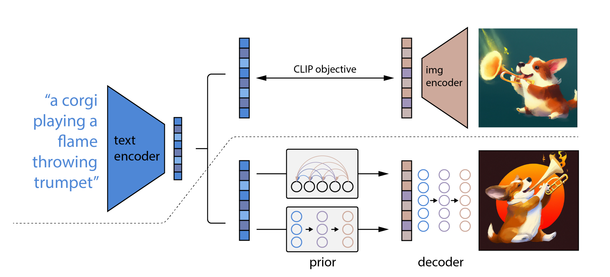
>
> 1.  **CLIP训练过程：学习文字与图片的对应关系**
>     如上图所示，CLIP的输入是一对对配对好的的图片-文本对(根据对应文本一条狗，去匹配一条狗的图片)，这些文本和图片分别通过Text Encoder和Image Encoder输出对应的特征，然后在这些输出的文字特征和图片特征上进行对比学习
> 2.  **DALL·E2：prior + decoder**
>     上面的CLIP训练好之后，就将其冻住了，不再参与任何训练和微调，DALL·E2训练时，输入也是文本-图像对，下面就是DALL·E2的两阶段训练：
>       **阶段一 prior的训练**：根据文本特征(即CLIP text encoder编码后得到的文本特征)，预测图像特征(CLIP image encoder编码后得到的图片特征)
>     换言之，prior模型的输入就是上面CLIP编码的文本特征，然后利用文本特征预测图片特征(*说明白点，即图中右侧下半部分预测的图片特征的**ground truth，就是图中右侧上半部分经过CLIP编码的图片特征***)，就完成了prior的训练
>     推理时，文本还是通过CLIP text encoder得到文本特征，然后根据训练好的prior得到类似CLIP生成的图片特征，此时图片特征应该训练的非常好，不仅可以用来生成图像，而且和文本联系的非常紧(包含丰富的语义信息)
>
>       **阶段二 decoder生成图**：常规的扩散模型解码器，解码生成图像
>     这里的decoder就是升级版的GLIDE(GLIDE基于扩散模型)，所以说DALL·E2 = CLIP + GLIDE

所以对于DALLE 2来说，正因为经过了大量上面这种训练，所以便可以根据人类给定的prompt画出人类预期的画作，说白了，可以根据text预测画作长什么样

最终，sora由三大Transformer组件组成(*如果你还不了解transformer或注意力机制，请读[此文](https://blog.csdn.net/v_JULY_v/article/details/127411638 "此文")*)：**Visual Encoder**(*即Video transformer，类似下文将介绍的ViViT*)、**Diffusion Transformer**、**Transformer Decoder**，具体而言

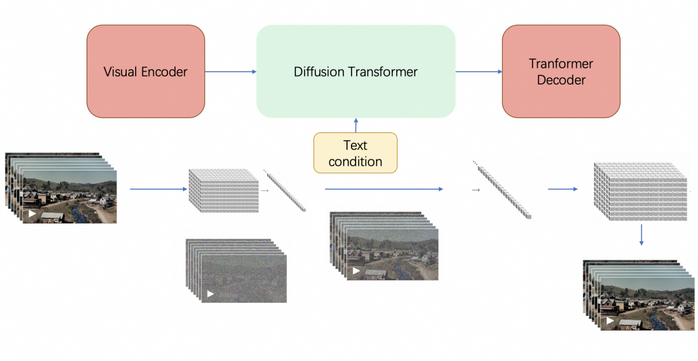

1.  训练中，给定一个原始视频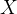
      Visual Encoder将视频压缩到较低维的潜在空间(*潜在空间这个概念在stable diffusion中用的可谓炉火纯青了，详见[此文](https://blog.csdn.net/v_JULY_v/article/details/131205615 "此文")的第三部分*)
      然后把视频分解为在时间和空间上压缩的潜在表示(不重叠的3D patches)，即所谓的一系列时空Patches
      再将这些patches拉平成一个token序列(*相当于线性化*)，这个token序列其实就是原始视频的表征：visual token序列
2.  Sora 在这个压缩的潜在空间中接受训练，还是类似扩散模型那一套，先加噪、再去噪
    这里，有两点必须注意的是
      1 扩散过程中所用的噪声估计器U-net被替换成了transformer结构的DiT(加之视觉元素转换成token之后，transformer擅长长距离建模，下文详述DiT)
      2 视频中这一系列帧在上个过程中是同时被编码的，去噪也是一系列帧并行去噪的(每一帧逐步去噪、多帧并行去噪)
    此外，去噪过程中，可以加入去噪的条件(即*text condition*)，这个去噪条件一开始可以是原始视频的描述，后续还可以是基于原视频进行二次创作的prompt
    比如可以将visual tokens视为query，将text tokens作为key和value，然后类似SD那样做cross attention
3.  OpenAI 还训练了相应的Transformer解码器模型，将生成的潜在表示映射回像素空间，从而生成视频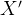

> 你会发现，上述整个过程，其实和SD的原理是有较大的相似性(*SD原理*详*见此文《*[从CLIP、BLIP到DALLE、DALLE 2、DALLE 3、Stable Diffusion](https://blog.csdn.net/v_JULY_v/article/details/131205615 "从CLIP、BLIP到DALLE、DALLE 2、DALLE 3、Stable Diffusion")*》的3.2节*)，当然，不同之处也有很多，比如视频需要一次性还原多帧、图像只需要还原一帧
>
> 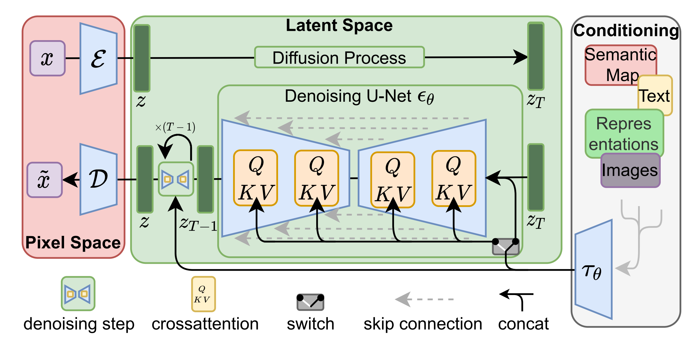
>
> 网上也有不少人画出了sora的架构图
>
> 1.  比如来自魔搭社区的
>
>     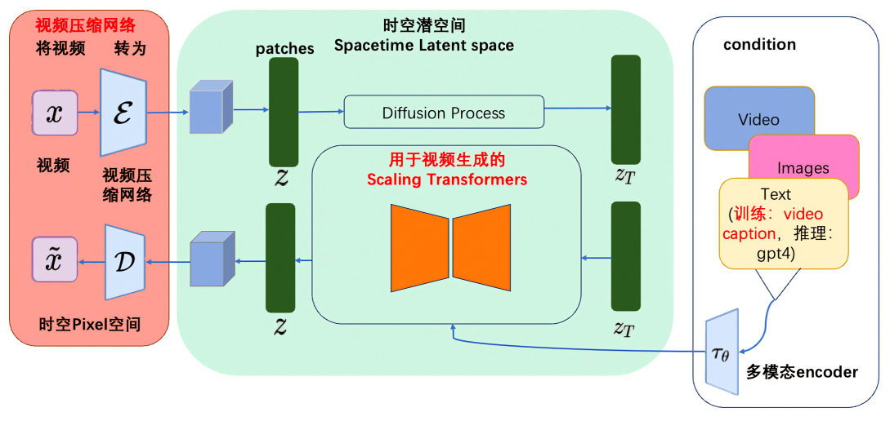
>
> 2.  以及张俊林的
>     至于左下角的“image & video”的意思是图像和视频的联合训练「*因为图片可看成单帧的视频，首帧单独表示就可以对单张图片进行编码了，**更多可参考论文《Phenaki: Variable Length Video Generation From Open Domain Textual Description》*」
>     至于左上角的“Long Time”指的是sora能生成长达60s的视频
>
>     
>

#### 1.1.2 如何理解所谓的时空编码(含其好处)

首先，一个视频无非就是沿着时间轴分布的图像序列而已

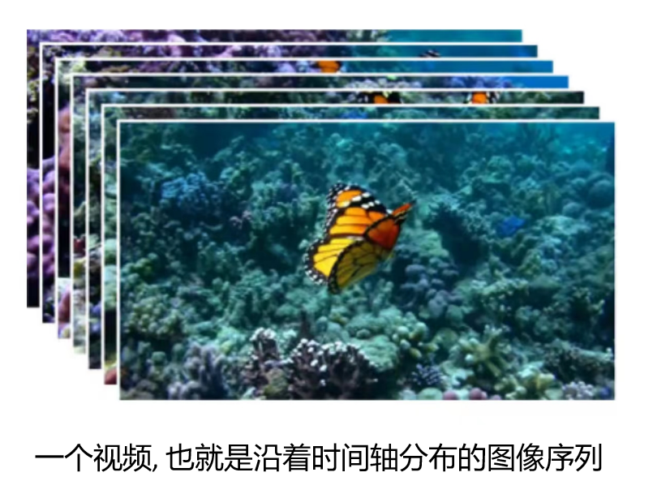

但其中有个问题是，因为像素的关系，一张图像有着比较大的维度(*比如250 x 250*)，即一张图片上可能有着5万多个元素，如果根据上一张图片的5万多元素去逐一交互下一张图片的5万多个元素，未免工程过于浩大(*而且，即便是同一张图片上的5万多个像素点之间两两做self-attention，你都会发现计算复杂度超级高*)

1.  故为降低处理的复杂度，可以类似ViT把一张图像划分为九宫格(如下图的左下角)，如此，处理9个图像块总比一次性处理250 x 250个像素维度 要好不少吧(*ViT的出现直接挑战了此前CNN在视觉领域长达近10年的绝对统治地位，至于ViT的原理细节详见本文开头提到的*[此文](https://blog.csdn.net/v_JULY_v/article/details/130361959 "此文")*第4部分*)

    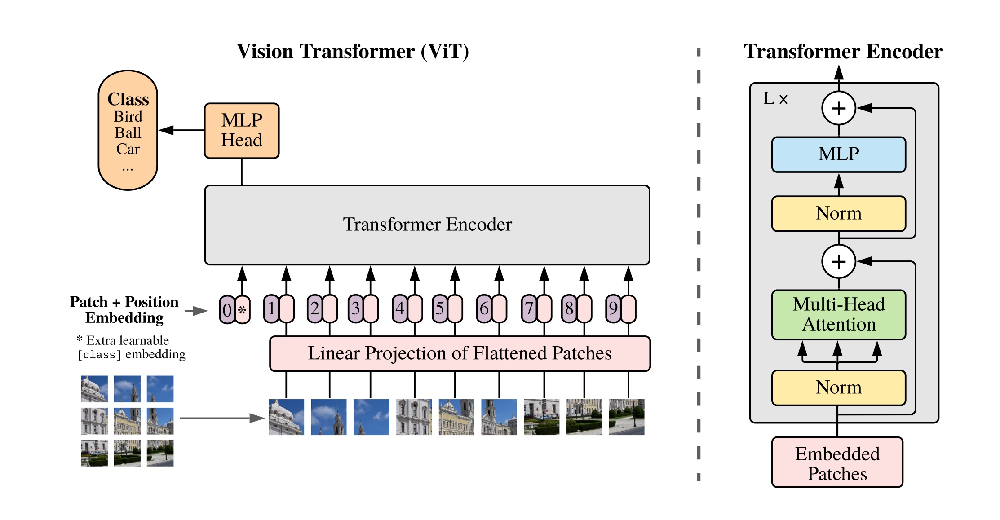

2.  当我们理解了一张静态图像的patch表示之后(不管是九宫格，还是16 x 9个格)，再来理解所谓的时空Patches就简单多了，无非就是在纵向上加上时间的维度，比如t1 t2 t3 t4 t5 t6
    而一个时空patch可能跨3个时间维度，当然，也可能跨5个时间维度

    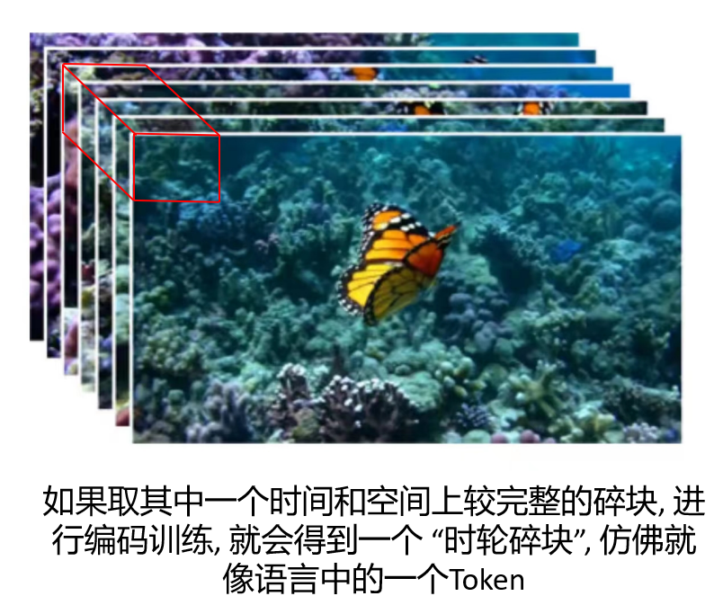

    如此，同时间段内不同位置的立方块可以做横向注意力交互——空间编码
    不同时间段内相同位置的立方块则可以做纵向注意力交互——时间编码
    (*如果依然还没有特别理解，没关系，可以再看下下文第二部分中对ViViT的介绍*)

    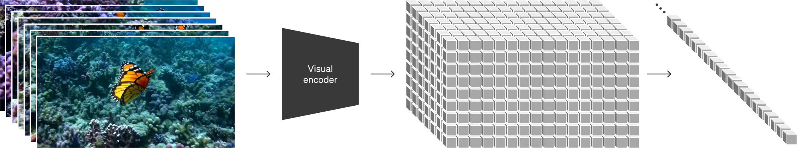

可能有同学问，这么做有什么好处呢？好处太多了

-   一方面，时空建模之下，不仅提高单帧的流畅、更提高帧与帧之间的流畅，毕竟有Transformer的注意力机制，那无论哪一帧图像，各个像素块都不再是孤立的存在，都与周围的元素紧密联系
-   二方面，可以兼容所有的数据素材：一个静态图像不过是时间=0的一系列时空patch，不同的像素尺寸、不同的时间长短，都可以通过组合一系列 “时空patch” 得到

总之，基于 patches 的表示，使 Sora 能够对不同分辨率、持续时间和长宽比的视频和图像进行训练。在推理时，也可以可以通过在适当大小的网格中排列随机初始化的 patches 来控制生成视频的大小

> 如Tim Brooks所说，把各种各样的图片和视频，不管是宽屏的、长条的、小片的、高清的还是低清的，都把它们分割成一小块一小块的
>
> 接着，便可以根据输入视频的大小，训练模型认识不同数量的小块，从而生成不同分辨率/长宽比的视频
>
> * * *
>
> 当然，ViT本身就能够处理任意长宽比(不同长宽比相当于不同数量的图片patch)，但谷歌的 Patch n’ Pack (NaViT)提供了一种更为高效的训练方法，关于NaViT的更多细节详见下文的介绍

而过去的图像和视频生成方法通常需要调整大小、进行裁剪或者是将视频剪切到标准尺寸，例如 4 秒的视频分辨率为 256x256。相反，该研究发现在原始大小的数据上进行训练，最终提供以下好处：

1.  首先是采样的灵活性：Sora 可以采样宽屏视频 1920x1080p，垂直视频 1920x1080p 以及两者之间的视频。这使 Sora 可以直接以其天然纵横比为不同设备创建内容。Sora 还允许在生成全分辨率的内容之前，以较小的尺寸快速创建内容原型 —— 所有内容都使用相同的模型

    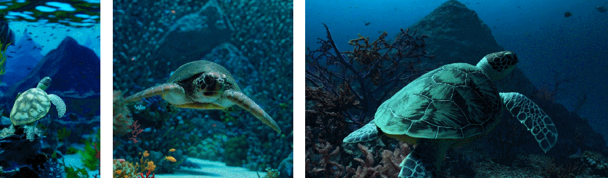

2.  其次使用视频的原始长宽比进行训练可以提升内容组成和帧的质量
    其他模型一般将所有训练视频裁剪成正方形，而经过正方形裁剪训练的模型生成的视频(如下图左侧)，其中的视频主题只是部分可见；相比之下，Sora 生成的视频具有改进的帧内容(如下图右侧)

    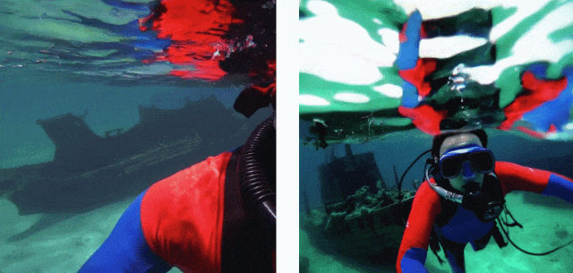

#### **1.1.3** Diffusion Transformer(DiT)**：扩散框架下以Transformer为骨干网络**

sora不是第一个把扩散模型和transformer结合起来用的模型，但是第一个取得巨大成功的，为何说它是结合体呢

1.  一方面，它类似扩散模型那一套流程，给定输入噪声patches(以及文本提示等调节信息)，训练出的模型来预测原始的不带噪声的patches「*Sora is a diffusion model, given input noisy patches (and conditioning information like text prompts), it’s trained to predict the original “clean” patches*」
    类似把视频中的一帧帧画面打上各种马赛克，然后训练一个模型，让它学会去除各种马赛克，且一开始各种失败没关系，反正有原画面作为ground truth，不断缩小与原画面之间的差异即可
    而当把一帧帧图片打上全部马赛克之后，可以根据”文本-视频数据集”中对视频的描述/prompt(***注****，**该描述/prompt不仅仅只是通过CLIP去与视频对齐，还经过类似DALLE 3所用的重字幕技术加强 + GPT4对字幕的进一步丰富**，下节详述*)，而有条件的去噪
2.  二方面，它把DPPM中的噪声估计器所用的卷积架构U-Net换成了Transformer架构(*如果没咋理解但又想做细致了解的，详见下文*)

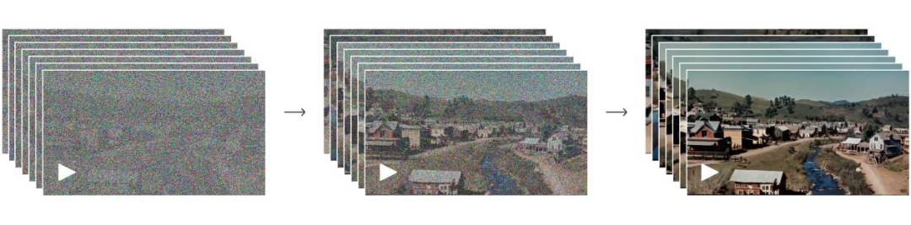

总之，总的来说，Sora是一个在不同时长、分辨率和宽高比的视频及图像上训练而成的扩散模型，同时采用了Transformer架构，如sora官博所说，Sora is a diffusion transformer，简称DiT(*当然，可能有朋友发现了，这句话说的过于简略，毕竟DiT还只是处理2D图像生成*)

关于DiT的更多细节详见下文第二部分介绍的DiT

### **1.2 基于DALLE 3的重字幕技术：提升文本-视频数据质量**

#### **1.2.1 DALLE 3的重字幕技术：为文本-视频数据集打上字幕且用GPT把字幕详细化**

首先，训练文本到视频生成系统需要大量带有相应文本字幕的视频，而**通过CLIP技术给视频对齐的文本描述，有时质量较差，故为进一步提高文本-视频数据集的质量**，研究团队将 DALLE 3中的重字幕(re-captioning)技术应用于视频

1.  具体来说，研究团队首先训练一个高度描述性的字幕生成器，然后使用它为训练集中所有视频生成文本字幕
2.  与DALLE 3类似，研究团队还利用 GPT 将简短的prompt 转换为较长的详细字幕，然后发送给视频模型(*Similar to DALL·E 3, we also leverage GPT to turn short user prompts into longer detailed captions that are sent to the video model*)，这使得 Sora 能够生成准确遵循详细字幕或详细prompt 的高质量视频

> 关于DALLE 3的重字幕技术更具体的细节请见此文的2.3节《[AI绘画原理解析：从CLIP、BLIP到DALLE、DALLE 2、DALLE 3、Stable Diffusion](https://blog.csdn.net/v_JULY_v/article/details/131205615 "AI绘画原理解析：从CLIP、BLIP到DALLE、DALLE 2、DALLE 3、Stable Diffusion")》

#### 1.2.2 借鉴TECO/FDM方法：引入auto regressive增强长时一致性

其次，如之前所述，为了保证视频的一致性，模型层不是通过多个stage方式来进行预测，而是整体预测了整个视频的latent(*即去噪时非先去噪几帧，再去掉几帧，而是一次性去掉全部帧的噪声*)

且在视频内容的生成上，比如**从一段已有的视频向后拓展出新视频**的训练过程中除了整体去噪生成之外，也可能引入了auto regressive的task，以帮助模型更好的进行视频特征和帧间关系的学习

更多可以参考下文对TECO/FDM方法的介绍

### 1.3 对真实物理世界的模拟能力

#### 1.3.1 sora学习了大量关于3D几何的知识

OpenAI 发现，视频模型在经过大规模训练后，会表现出许多有趣的新能力。这些能力使 Sora 能够模拟物理世界中的人、动物和环境的某些方面。这些特性的出现没有任何明确的三维、物体等归纳偏差 — 它们纯粹是规模现象

1.  **三维一致性(下图左侧)**
    Sora 可以生成动态摄像机运动的视频。随着摄像机的移动和旋转，人物和场景元素在三维空间中的移动是一致的
    针对这点，sora一作Tim Brooks说道，**sora学习了大量关于3D几何的知识，但是我们并没有事先设定这些，它完全是从大量数据中学习到的**
    
    **长序列连贯性和目标持久性(上图右侧)**
    由于transformer注意力的二次方复杂度等各种原因，导致视频生成系统面临的一个重大挑战是在对长视频进行采样时保持时间一致性(*这一块的解决方案详见下文的2.3节*)
    例如，即使人、动物和物体被遮挡或离开画面，Sora 模型也能保持它们的存在。同样，它还能在单个样本中生成同一角色的多个镜头，并在整个视频中保持其外观
2.  **与世界互动(下图左侧)**
    Sora 有时可以模拟以简单方式影响世界状态的动作。例如，画家可以在画布上留下新的笔触，这些笔触会随着时间的推移而持续，而视频中一个人咬一口面包 则面包上会有一个被咬的缺口

    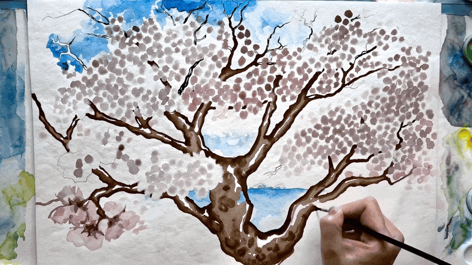

    **模拟数字世界(上图右侧)**
    视频游戏就是一个例子。Sora 可以通过基本策略同时控制 Minecraft 中的玩家，同时高保真地呈现世界及其动态。只需在 Sora 的提示字幕中提及 「Minecraft」，就能零样本激发这些功能

#### 1.3.2 sora真的会模拟真实物理世界了么

对于“sora真的会模拟真实物理世界”这个问题，网上的解读非常多，很多人说sora是通向通用AGI的必经之路、不只是一个视频生成，更是模拟真实物理世界的模拟器，这个事 我个人觉得从技术的客观角度去探讨更合适，那样会让咱们的思维、认知更冷静，而非人云亦云、最终不知所云

首先，作为“物理世界的模拟器”，需要能够在虚拟环境中重现物理现实，为用户提供一个逼真且不违反「物理规律」的数字世界

比如苹果不能突然在空中漂浮，这不符合牛顿的万有引力定律；比如在光线照射下，物体产生的阴影和高光的分布要符合光影规律等；比如物体之间产生碰撞后会破碎或者弹开

其次，李志飞等人在《为什么说 Sora 是世界的模拟器？》一文中提到，技术上至少有两种方式可以实现这样的模拟器

-   一种是通过大数据学习出一个AI系统来模拟这个世界，比如说本文讨论的Sora能get到：“树叶在溪流中顺流而下”这句话所对应的物体运动轨迹是什么，更何况sora训练时还有LLM的夹持(*别忘了上文1.2.1节中说的：与DALLE 3类似，研究团队还利用 GPT 将用户简短的prompt 转换为较长的详细字幕，然后发送给视频模型*)
    比如**在大量的文本-视频数据集中，GPT给一个视频写的更丰富的文本描述是：“路面积水反射出大楼的倒影”，而Sora遵循文本能力强，那Sora就能固定或机械的记忆住该物理定律，但其实这个物理规则来自于GPT写的Prompt**
-   另外一种是弄懂物理世界各种现象背后的数学原理，并把这些原理手工编码到计算机程序里，从而让计算机程序“渲染”出物理世界需要的各种人、物、场景、以及他们之间的互动

> 虚幻引擎（Unreal Engine，UE）就是这种物理世界的模拟器
>
> 1.  它内置了光照、碰撞、动画、刚体、材质、音频、光电等各种数学模型。一个开发者只需要提供人、物、场景、交互、剧情等配置，系统就能做出一个交互式的游戏，这种交互式的游戏可以看成是一个交互式的动态视频
> 2.  UE 这类渲染引擎所创造的游戏世界已经能够在某种程度上模拟物理世界，只不过它是通过人工数学建模及渲染而成，而非通过模型从数据中自我学习。而且，它也没有和语言代表的认知模型连接起来，因此本质上缺乏世界常识。而 Sora 代表的AI系统有可能避免这些缺陷和局限

不同于 UE 这一类渲染引擎，**Sora 并没有显式地对物理规律背后的数学公式去“硬编码”，而是通过对互联网上的海量视频数据进行自监督学习**，从而能够在给定一段文字描述的条件下生成不违反物理世界规律的长视频

与 UE 这一类“硬编码”的物理渲染引擎不同，Sora 视频创作的想象力来自于它端到端的数据驱动，以及跟LLM这类认知模型的无缝结合(比如ChatGPT已经确定了基本的物理常识)

最后值得一提的是，Sora 的训练可能用了 UE 合成的数据，但 Sora 模型本身应该没有调用 UE 的能力

## 第二部分 Sora相关技术：从VideoGPT、 ViViT 、TECO、DiT到VDT、NaViT

注意，和sora相关的技术其实有非常多，但有些技术在本博客之前的文章中写过了(详见本文开头)，则本部分不再重复，比如DDPM、ViT、DALLE三代、Stable Diffusion(包括潜在空间LDM)等等

### 2.1 VideoGPT: 借鉴DALLE基于VQ-VAE和 GPT 自回归预测视频(21年4月)

#### 2.1.1 VQ-VAE和DALLE

通过上文提到过多次的此文《[图像生成发展起源：从VAE、VQ-VAE、扩散模型DDPM、DETR到ViT、Swin transformer](https://blog.csdn.net/v_JULY_v/article/details/130361959 "图像生成发展起源：从VAE、VQ-VAE、扩散模型DDPM、DETR到ViT、Swin transformer")》可知

> VQ-VAE的生成模式是pixcl-CNN +codebook，其中pixcl-CNN就是一个自回归模型
>
> 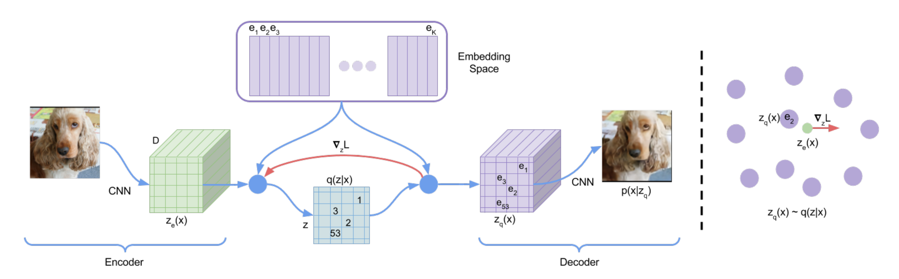
>
> * * *
>
> OpenAI 将pixcl-CNN换成GPT，再加上那会多模态相关工作的火热进展，可以考虑使用文本引导图像生成，所以就有了DALL·E
>
> 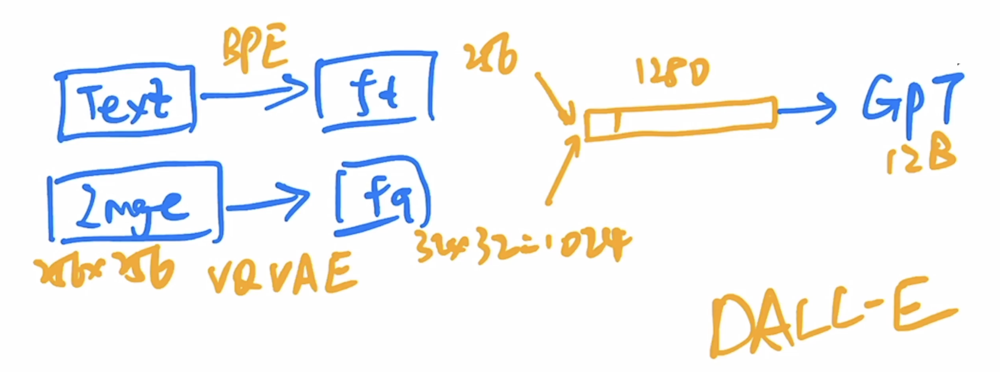
>
> DALL·E和VQ-VAE-2一样，也是一个两阶段模型：
>
> -   Stage1：Learning the Visual Codebook
>     先是输入：一对图像-文本对(训练时)，之后编码特征，具体编码时涉及到两个步骤
>     首先，文本经过BPE编码得到256维的特征
>     其次，256×256的图像经过VQ-VAE(将训练好的VQ-VAE的codebook直接拿来用)，得到32×32的图片特征
> -   Stage2：Learning the Prior
>     重构原图
>     将拉直为1024维的tokens，然后连上256维的文本特征，这样就得到了1280维的token序列，然后直接送入GPT(masked decoder)重构原图

#### 2.1.2 VideoGPT: Video Generation using VQ-VAE and Transformers

受DALLE工作的启发，UC Berkeley于2021年4月推出VideoGPT，其对应的论文为《[VideoGPT: Video Generation using VQ-VAE and Transformers](https://arxiv.org/abs/2104.10157 "VideoGPT: Video Generation using VQ-VAE and Transformers")》，其建立在VQ-VAE和GPT架构的基础之上，具体而言

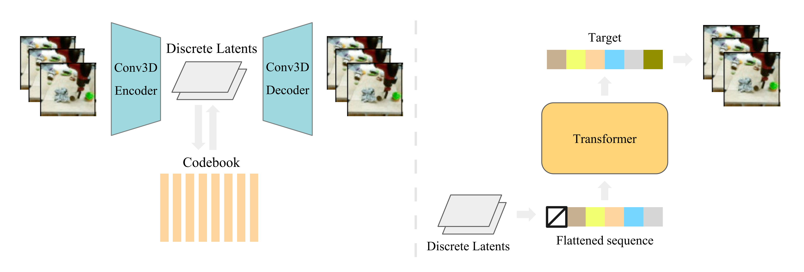

1.  其通过3D卷积和轴向注意力(axial attention)作为VQ-VAE中的自编码器，从而从原始视频的一帧帧图像学习出一组下采样的离散潜在表示
2.  然后，使用类似于GPT的强自回归先验模型和时空位置编码，自回归的对这些潜变量进行建模
3.  最后VQ-VAE的解码器将“从自回归先验中生成的潜变量”解码为原始分辨率的视频

### 2.2 ViViT：视频元素token化且时空编码——没加扩散过程、没带文本条件融合(21年5月)

#### 2.2.1 ViViT：在ViT的基础上增加时间维度以处理视频

在具体介绍ViViT之前，先说三个在其之前的工作

1.  业界最早是用卷积那一套处理视频，比如时空3D CNN(*Learning spatiotemporal features with 3d convolutional networks*)，由于3D CNN比图像卷积网络需要较多的计算量，许多架构在空间和时间维度上进行卷积的因式分解和/或使用分组卷积，且最近，还通过在后续层中引入自注意力来增强模型，以更好地捕捉长程依赖性
2.  而Transformer在NLP领域大获成功，很快便出现了将Transformer架构应用到图像领域的ViT(Vision Transformer)
    ViT将图片按给定大小分为不重叠的patches，再将每个patch线性映射为一个token，随位置编码和cls token(可选)一起输入到Transformer的编码器中(*下图来自萝卜社长，如果不熟悉或忘了ViT的，详见[此文](https://blog.csdn.net/v_JULY_v/article/details/130361959 "此文")的第4部分*)

    

3.  2021年的这两篇论文《Is space-time attention all you need for video understanding?》、《Video transformer network》都是基于transformer做视频理解

而Google于2021年5月提出的ViViT(*其对应论文为：[ViViT: A Video Vision Transformer](https://arxiv.org/abs/2103.15691 "ViViT: A Video Vision Transformer")*)便要尝试在视频中使用ViT模型，且他们充分借鉴了之前3D CNN 因式分解等工作，比如考虑到视频作为输入会产生大量的时空token，处理时必须考虑这些长范围token序列的上下文关系，同时要兼顾模型效率问题

故作者团队在空间和时间维度上分别对Transformer编码器各组件进行分解，在ViT模型的基础上提出了三种用于视频分类的纯Transformer模型，如下图所示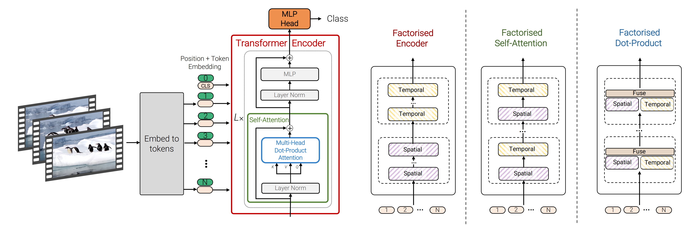

区别于常规的二维图像数据，视频数据相当于需在三维空间内进行采样(拓展了一个时间维度)，有两种方法来将视频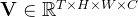映射到token序列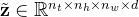(*说白了，就是从视频中提取token，而后添加位置编码并对token进行reshape得到最终Transformer的输入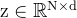*)

-   第一种，如下图所示，将输入视频划分为token的直接方法是从输入视频剪辑中均匀采样 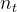 个帧，使用与ViT 相同的方法独立地嵌入每个2D帧(*embed each 2D frame independently using the same method as ViT*)，并将所有这些token连接在一起

    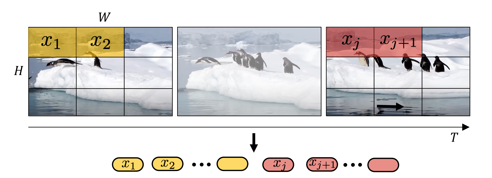

    具体地说，如果从每个帧中提取 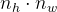 个非重叠图像块(就像 ViT 一样)，那么总共将有 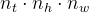 个token通过transformer编码器进行传递，这个过程可以被看作是简单地构建一个大的2D图像，以便按照ViT的方式进行tokenised(*这点和本节开头所提到的21年那篇论文space-time attention for video所用的方式一致*)
-   第二种则是把输入的视频划分成若干个tuplet(*类似不重叠的带空间-时间维度的立方体*)
    每个tuplet会变成一个token(*因这个tublelt的维度就是： t \* h \* w，故token包含了时间、宽、高*)
    经过spatial temperal attention进行空间和时间建模获得有效的视频表征token

    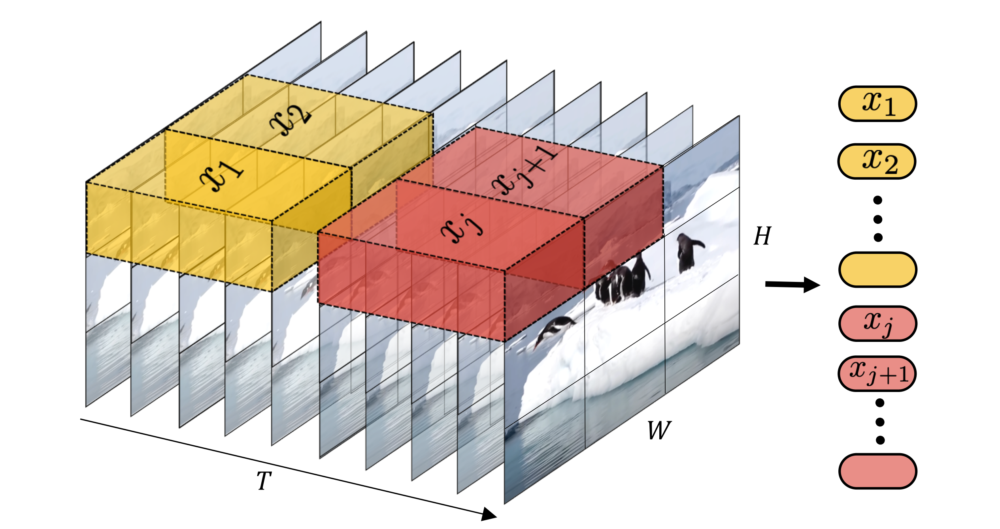

#### 2.2.2 ViViT的4种结构：spatio-temporal attention/factorised encoder等

##### 2.2.2.1 spatio-temporal attention

上文说过，Google在ViT模型的基础上提出了三种用于视频分类的纯Transformer模型，接下来，介绍下这三种模型

当然，由于论文中把一个没有啥技巧且计算复杂度高的模型作为模型1：简单地将从视频中提取的所有时空token，然后每个transformer层都对所有配对进行建模，类似[Neimark_Video_Transformer_Network_ICCVW_2021_paper](https://openaccess.thecvf.com/content/ICCV2021W/CVEU/papers/Neimark_Video_Transformer_Network_ICCVW_2021_paper "Neimark_Video_Transformer_Network_ICCVW_2021_paper")的工作(*其证明了VTN可以高效地处理非常长的视频*)

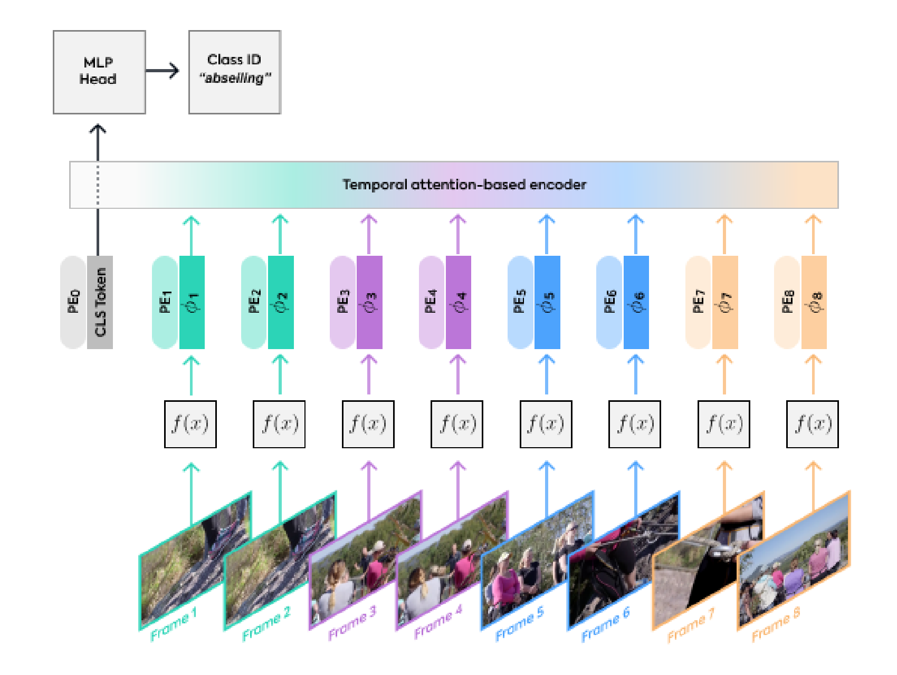

所以下述三个模型在论文中被分别称之为模型2、3、4

##### 2.2.2.2 factorised encoder及其代码实现

第二个模型如下图所示，该模型由两个串联的transformer编码器组成：

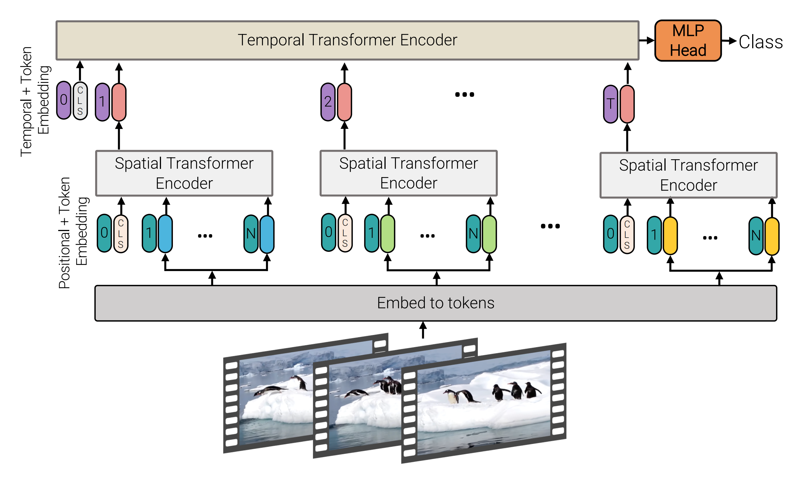

1.  第一个模型是空间编码器Spatial Transformer Encoder
    处理来自相同时间索引的token之间的相互作用(*相当于处理同一帧画面下的各个元素，时间维度都相同了自然时间层面上没啥要处理的了，只处理空间维度*)，以产生每个时间索引的潜在表示，并输出cls\_token
2.  第二个transformer编码器是时间编码器Temporal Transformer Encoder
    处理时间步之间的相互作用(*相当于处理不同帧，即空间维度相同但时间维度不同*)。 因此，它对应于空间和时间信息的“后期融合”
    换言之，将输出的cls\_token和帧维度的表征token拼接输入到时间编码器中得到最终的结果

对应的代码如下(为方便大家一目了然，我不仅给每一行代码都加上了注释，且把代码分解成了8块，每一块代码的重点都做了细致说明)

1.  首先定义ViViT类，且定义相关变量

    ```cobol
    # 定义ViViT模型类class ViViT(nn.Module):    def __init__(self, image_size, patch_size, num_classes, num_frames, dim=192, depth=4, heads=3, pool='cls', in_channels=3, dim_head=64, dropout=0.,                 emb_dropout=0., scale_dim=4):        super().__init__()  # 调用父类的构造函数                # 检查pool参数是否有效        assert pool in {'cls', 'mean'}, 'pool type must be either cls (cls token) or mean (mean pooling)'        # 确保图像尺寸能被patch尺寸整除        assert image_size % patch_size == 0, 'Image dimensions must be divisible by the patch size.'        # 计算patch数量        num_patches = (image_size // patch_size) ** 2        # 计算每个patch的维度        patch_dim = in_channels * patch_size ** 2        # 将图像切分成patch并进行线性变换的模块        self.to_patch_embedding = nn.Sequential(            Rearrange('b t c (h p1) (w p2) -> b t (h w) (p1 p2 c)', p1=patch_size, p2=patch_size),            nn.Linear(patch_dim, dim),        )
    ```

    为方便大家理解，我得解释一下上面中这行的含义：

    ```lisp
    Rearrange('b t c (h p1) (w p2) -> b t (h w) (p1 p2 c)', p1=patch_size, p2=patch_size)
    ```

    ————
    且为方便大家和我之前介绍ViT的文章前后连贯起来，故还是用的ViT那篇文章中的例子(*[此文](https://blog.csdn.net/v_JULY_v/article/details/130361959 "此文")的第4部分*)
    *以ViT\_base\_patch16为例，一张224 x 224的图片先分割成 16 x 16 的 patch ，很显然会因此而存在 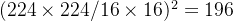 个 patch
    且图片的长宽由原来的224  x 224 变成：14  x 14(因为224/16 = 14)*

    |     |     |     |     |     |     |     |     |     |     |     |     |     |     |
    | --- | --- | --- | --- | --- | --- | --- | --- | --- | --- | --- | --- | --- | --- |
    | *16\*16* | *16\*16* | *16\*16* | *16\*16* | *16\*16* | *16\*16* | *16\*16* | *16\*16* | *16\*16* | *16\*16* | *16\*16* | *16\*16* | *16\*16* | *16\*16* |
    | *16\*16* |     |     |     |     |     |     |     |     |     |     |     |     |     |
    | *16\*16* |     |     |     |     |     |     |     |     |     |     |     |     |     |
    | *16\*16* |     |     |     |     |     |     |     |     |     |     |     |     |     |
    | *...* |     |     |     |     |     |     |     |     |     |     |     |     |     |

    *所以对于上面那行意味着可以让批次大小b=1、时间维度t=2、RGB图像的通道数c=3
    原始维度即为：
    (1, 2, 3, 旧的长 = 224 patch\_size = 16, 旧的宽 = 224 patch\_size = 16)，Rearrange之后的维度则变为：
    (**1**, **2**, 新的长14 x 新的宽14 = **196**, 16 x 16 x 3 = **768**)*
2.  初始化位置编码和cls token
    self.pos\_embedding 的维度为(1, num\_frames, num\_patches + 1, dim)
    在这里，num\_frames 是 t，num\_patches 是 n=196，dim 是 768，因此 pos\_embedding 维度为 (1,2,197,768)

    ```cobol
            # 位置编码        self.pos_embedding = nn.Parameter(torch.randn(1, num_frames, num_patches + 1, dim))        # 空间维度的cls token        self.space_token = nn.Parameter(torch.randn(1, 1, dim))        # 空间变换器        self.space_transformer = Transformer(dim, depth, heads, dim_head, dim * scale_dim, dropout)         # 时间维度的cls token        self.temporal_token = nn.Parameter(torch.randn(1, 1, dim))        # 时间变换器        self.temporal_transformer = Transformer(dim, depth, heads, dim_head, dim * scale_dim, dropout)         # dropout层        self.dropout = nn.Dropout(emb_dropout)        # 池化方式        self.pool = pool         # 最后的全连接层，用于分类        self.mlp_head = nn.Sequential(            nn.LayerNorm(dim),            nn.Linear(dim, num_classes)        )
    ```

3.  **patch嵌入和cls token的拼接**
    输入数据 x 的维度在经过嵌入层后变为 (1,2,196,768)
    self.space\_token 的初始维度为 (1,1,768)，被复制扩展成 (1,2,1,768) 以匹配批次和时间维度
    cls\_space\_tokens 和 x 在patch维度上拼接后，维度变为 (1,2,197,768)
    *为何拼接之后成197了呢？原因很简单，如ViT那篇文章中所述：“**\[class\] token的维度为 \[1, 768\]** ，通过Concat操作，\[196, 768\]  与 \[1, 768\] 拼接得到 \[197, 768\]”*

    ```cobol
        def forward(self, x):        # 将输入数据x转换为patch embeddings        x = self.to_patch_embedding(x)        b, t, n, _ = x.shape  # 获取batch size, 时间维度, patch数量         # 在每个空间位置加上cls token        cls_space_tokens = repeat(self.space_token, '() n d -> b t n d', b=b, t=t)        x = torch.cat((cls_space_tokens, x), dim=2)  # 在维度2上进行拼接
    ```

4.  **添加位置编码和应用dropout**
    加上位置编码后，x 保持 (1,2,197,768) 维度不变。应用dropout后，x 的维度仍然不变

    ```cobol
             x += self.pos_embedding[:, :, :(n + 1)]  # 加上位置编码        x = self.dropout(x)  # 应用dropout
    ```

5.  **空间Transformer**
    重排 x 的维度为 (2,197,768)，因为 b×t=1×2=2
    空间Transformer处理后，x 的维度变为 (2,197,768)

    ```cobol
            # 将(b, t, n, d)重排为((b t), n, d)，为了应用空间变换器        x = rearrange(x, 'b t n d -> (b t) n d')        x = self.space_transformer(x)  # 应用空间变换器        x = rearrange(x[:, 0], '(b t) ... -> b t ...', b=b)  # 把输出重排回(b, t, ...)
    ```

6.  **时间Transformer**
    self.temporal\_token 的初始维度为(1,1,768)，被复制扩展成 (1,2,768)
    cls\_temporal\_tokens 和 x 在时间维度上拼接后，维度变为(1,3,768)

    ```cobol
         # 在每个时间位置加上cls token        cls_temporal_tokens = repeat(self.temporal_token, '() n d -> b n d', b=b)        x = torch.cat((cls_temporal_tokens, x), dim=1)  # 在维度1上进行拼接         x = self.temporal_transformer(x)  # 应用时间变换器
    ```

7.  池化
    如果 self.pool 是 'mean'，则对 x 在时间维度上取均值，结果维度变为 (1,768)
    如果不是 'mean'，则直接取 x 的第一个时间维度的cls token，结果维度同样是 (1,768)

    ```cobol
            # 根据pool参数选择池化方式        x = x.mean(dim=1) if self.pool == 'mean' else x[:, 0]
    ```

8.  分类头
    self.mlp\_head，将 (1,768) 维度的 x 转换为最终的分类结果，其维度取决于类别数num\_classes，如果 num\_classes 是 10，则最终输出维度为 (1,10)

    ```php
            # 通过全连接层输出最终的分类结果        return self.mlp_head(x)
    ```

##### 2.2.2.3 factorised self-attention

第二个模型如下图所示，会先计算空间自 注意力 (token中有相同的时间索引，相当于同一帧画面上的token元素)，再计算时间的自注意力(token中有相同的空间索引，相当于不同帧下同一空间位置的token，比如一直在视频的左上角那一块的token块）

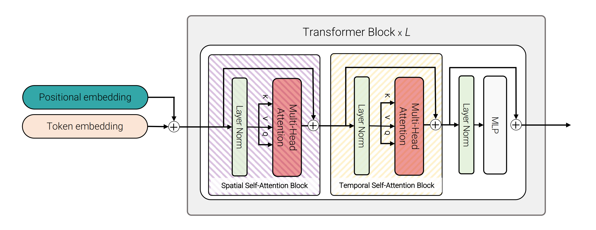

1.  具体进行空间注意力交互的方法是：将初始视频序列生成的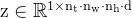，通过tensor的reshape思想映射为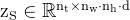，而后计算得到空间自注意力结果
2.  同理，在时间维度上映射得到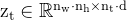，从而进行时间自注意力的计算

    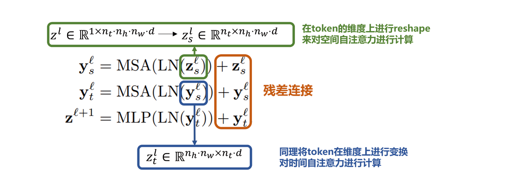

##### 2.2.2.4 factorised dot-product attention

由于实验表明空间-时间自注意力或时间-空间自注意力的顺序并不重要，所以第三个模型的结构如下图所示，一半的头仅在空间轴上计算点积注意力，另一半头则仅在时间轴上计算，且其参数数量增加了，因为有一个额外的自注意力层

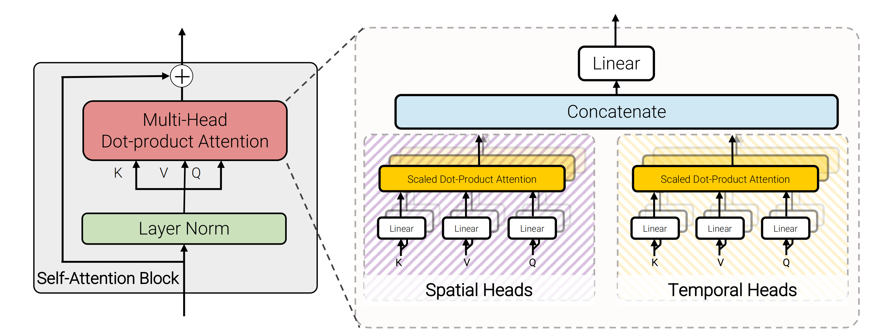

不过，该模型通过利用dot-product点积注意力操作来取代因式分解factorisation操作，通过注意力计算的方式来代替简单的张量reshape。思想是对于空间注意力和时间注意力分别构建对应的键、值，如下图所示(*图源自萝卜社长*)


#### 2.2.3 ViViT的在超长视频一致性方面的局限性

最后值得一提的是

1.  虽然ViViT可能除了第一帧，其它视频帧比如可以2帧为一组(*即不仅在空间维度进行压缩，在时间维度也进一步压缩，通过CNN的3D卷积把时间维度的2帧输入压缩为1帧Patch*)，但考虑到时间维度的压缩会影响视频生成的质量，故sora可能类似Latte那样(*关于Latte的介绍请参见此文的第一部分：*[视频生成Sora的从零复现：Latte和Open-Sora 1.0背后的原理与代码剖析](https://blog.csdn.net/v_JULY_v/article/details/136845242 "视频生成Sora的从零复现：Latte和Open-Sora 1.0背后的原理与代码剖析")**)，不做时间维度层面的压缩
2.  每张图片有两个Patch矩阵
      一个是Space Latent，保留空间信息
      另一个是Time Latent，保留长时历史信息

    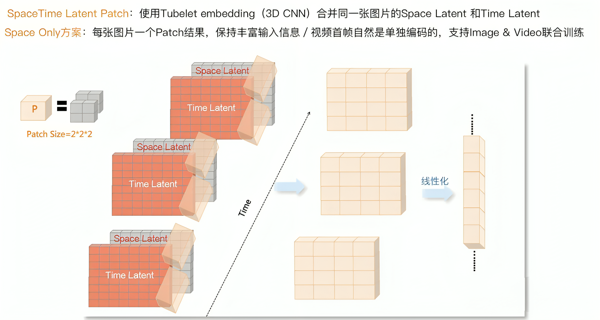

所以，我们可以用一个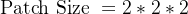的Patch，把同一个图片的Space Latent和Time Latent合并，压缩为一个Patch矩阵

这么做的好处有，首先，每张图片对应一个Patch矩阵，融合过程中既包含了空间信息，也包含了Long Time时间信息(*至于到底怎么保持超长视频的一致性，请看下节*)，信息保留非常充分。其次，如果要支持“图片&视频联合训练”，那么首帧需要独立编码不能分组，这种方案因为没有视频帧分组过程，所以自然就支持“图片&视频联合训练”

### 2.3 VAE之改进TECO：超长视频一致性的解决方案(22年10月)

#### **2.3.1 VAE的后续迭代：连续**Latent的局限性与离散Latent的分类

VAE出来后有不少改进模型，总体而言可分为两大类：

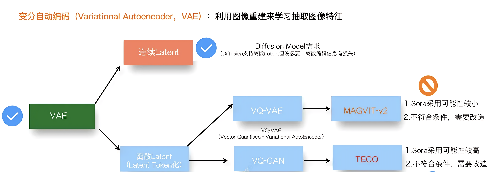

1.  “连续Latent” 模型
    由于VAE本身产生的图片Latent表征，本来就是连续的，所以这不难理解

    毕竟，VAE模型的基本思想是通过重建图片，最终获得一个针对图片的Encoder及其对应的Decoder，具体而言
      一般会采用CNN卷积网络来做Encoder和Decoder(*使用CNN卷积操作对图片进行扫描时，因为卷积结果数值是在连续实数范围内，所以得到的卷积结果自然就是连续的Latent*)
      比如图片2D卷积、视频Causal CNN 3D卷积「*至于为何叫causal(因果)，类似GPT生成Next Token的时候只能参考之前已经生成的Token，比如在压缩第  帧图片的时候，不仅仅像图片2D卷积一样只参考第  帧图片内容，也可以参考第、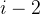、...、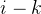等之前的  帧图片，所以是一种casual 3D卷积*」
2.  “离散Latent”模型
    离散Latent模型变体众多，最常用的包括VQ-VAE和VQ-GAN，它两在多模态模型和图片、视频各种模型中经常现身
    “离散Latent”之所以比较火，这与GPT模型采用自回归生成离散Token模式有一定关联，使用离散Latent模型，比较容易套到类似LLM的Next Token的生成框架里，有望实现语言模型和图片、视频生成模型的一体化，典型的例子就是谷歌的VideoPoet(*下文将介绍VideoPoet*)

首先，对于前者“连续Latent” 模型，3D卷积因为在重建第 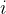 帧的时候参考了之前的 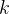 帧，其实融入时间信息了，如果  可以拉到比较长的时间，那么对于维护生成图像的时间一致性是有帮助的。但是，仅靠CNN 卷积一般融入的历史比较短，很难融入较长时间的信息(说白了，在3D卷积之下，K难以设置的比较大)，所以如果OpenAI直接用“连续Latent” 模型，还得有一些创新性的技术

其次，我们再考虑下后者“离散Latent”模型

##### 2.3.1.1 如何理解离散Latent(VQ-VAE、VQ-GAN)：连续Latent的离散化过程

所谓“离散Latent”，就是把“连续Latent”进行ID化，从实数向量通过一定方法转换成一个专属ID编号，这跟LLM里的字符串Tokenizer离散化过程是比较像的

一般对“连续Latent”离散化过程的基本思想如下图右侧所示

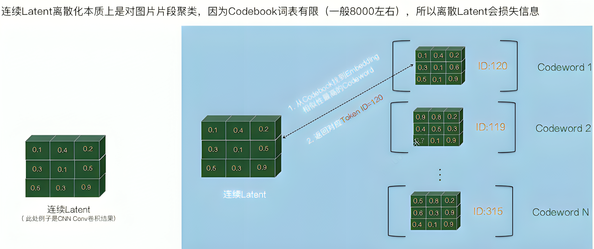

1.  模型维护一个由很多Codeword构成的Codebook
    每项Codeword维护两个信息
      一个是这个Codeword对应的Latent特征Embedding(这是连续的)
      另外就是这个Codeword对应的专属ID编号
2.  Codebook类似词典信息，在离散化过程中，对于某个待离散化的”连续Latent”，会和Codebook里每个Codeword对应的Embedding比对下，找到最接近的，然后把Codeword对应的ID赋予待离散化Latent

总之，”连续Latent”离散化过程，可以看成对图片片段聚类的过程，赋予的那个ID编号其实等价于聚类的类编号。目前的图像处理而言，Codeword通常在8000左右(如果再大效果反而不好)，如此，问题就来了，这种聚类操作导致很多“大体相似，但细节不同”的图片被赋予相同的ID，这意味着细节信息的丢失，所以离散化操作是有信息损失的

##### 2.3.1.2 为何说sora采用VQ-VAE之MAGVIT-2的思路可能性比较低

那为何说sora采用MAGVIT-2的思路可能性比较低呢？如张俊林所说(*对MAGVIT不了解的没事，下文会详细介绍MAGVIT*)？

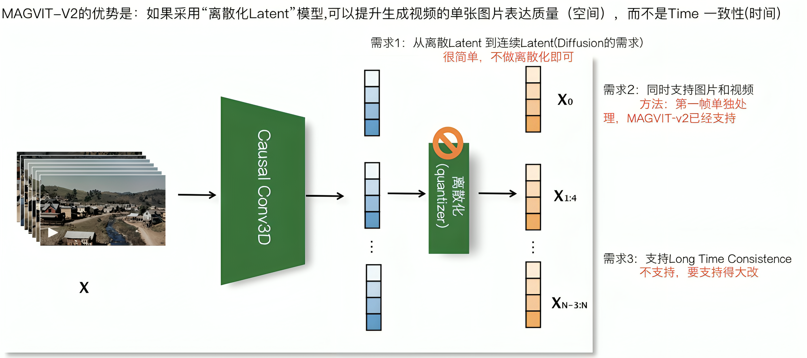

MAGVIT-2把输入视频帧分组之后

1.  首帧单独作为一组(这导致它可以支持“图片&&视频的联合训练”)，其它帧比如可以4帧分为一组
2.  对于每一组4帧图片，通过Causal 3D 卷积把4帧图片先压缩成一个“连续Latent”
3.  然后再进行“连续Latent”离散化操作，就得到了MAGVIT的编码结果

但「MAGVIG-v2把4帧最后压缩成一帧的Latent表示」的这个操作，所以它不仅在空间维度，同时也在时间维度上对输入进行了压缩，而这可能在输入层面带来进一步的信息损失，这种信息损失对于视频分类来说不是问题，但是对视频生成来说可能无法接受

其次，4帧压成1帧，这说明起码MAGVIG-v2的Latent编码是包含了“局部Time”信息的，这对于维护生成视频的时间一致性肯定有帮助，但因为仅靠CNN很难融入太长的历史信息，貌似只能融合短期的时间信息，对于维护“长时一致性”帮助很有限

故Sora采用MAGVIT的概率不大，为了能够生成长达60秒的视频，我们希望在VAE编码阶段，就能把长周期的历史信息融入到VAE编码里来，这肯定是有很大好处的

#### 2.3.2 离散Latent的另一种实现思路：VQ-GAN之TECO

2022年10月，UC Berkeley等机构的Wilson Yan, Danijar Hafner, Stephen James, Pieter Abbeel联合提出解决超长视频的「时间一致性」问题的Transformer模型：TECO(*全称为Temporally Consistent Transformer，其对应论文为：***[Temporally Consistent Transformers for Video Generation](https://arxiv.org/abs/2210.02396 "Temporally Consistent Transformers for Video Generation")****)

下图左侧是space time transformer(*这种时空transformer压缩的离散潜变量与连续潜变量相比容易丢失信息，通常需要更高的空间分辨率*)

1.  首先，将数据压缩为离散的潜在变量表示，比如给定图像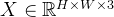，编码器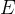将映射到潜变量表示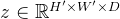
2.  然后通过在codebook 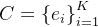中进行最近邻查找，最终将其量化为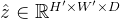
3.  最后，通过解码器重新生成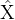

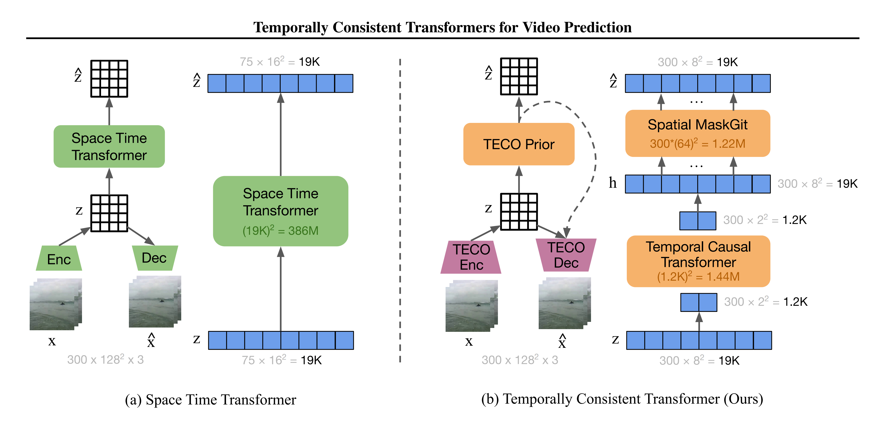

而TECO的结构则如上图右侧所示，其核心由两个任务组成

1.  一个是视频重建任务，用来训练视频Encoder-Decoder
    大致流程和上面的ST transformer差不多，但有两点不同
      一，在建模时间信息之前，TECO对每个离散潜变量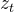应用单个步长卷积进行下采样(*其中在视觉上更简单的数据集允许更多的下采样，而在视觉上更复杂的数据集则需要较少的下采样*)，即从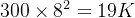到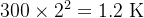
    之后，学习一个temporal casual transformer，即
    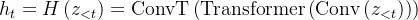
    来建模时间依赖关系，然后应用转置卷积将我们的表示上采样回原始分辨率 ，即

      二，解码器是一个上采样的卷积神经网络，用于重构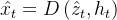，其中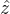可以解释为时间步长的后验概率， 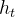上面是时间编码transformer的输出，它总结了先前时间步长的信息
    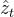和按通道连接到解码器中，最终优化以下交叉熵损失函数
    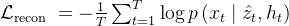
2.  一个是使用MaskGit生成离散化的图像Token，主要用于生成视频

且其有两个主要特点：

1.  首先，它在VAE编码阶段对Space和Time信息分别编码，而且Time编码引入了极长的Long Time信息。确切点说，是所有历史信息，比如要生成第  帧视频，则Time编码会把第1到第 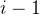 帧的之前所有历史信息都融合到第  帧的时间编码里
    具体而言，我们可以先学习一个CNN编码器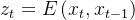，然后关联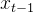对当前帧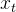进行编码(*除了首帧独立编码外，其他帧都是始终和上一帧两两一组编码*)，并使用codebook 对输出进行量化以生成 (*we learn a CNN encoder zt = E(xt, xt−1) which encodes the current frame xt conditioned on the previous frame by channel-wise concatenating xt−1, and then quantizes the output using codebook C to produce zt*)

    很明显这样做对于维护长时一致性是很有帮助的
2.  其次，TECO在生成视频的长时一致性方面表现确实很不错。在下图所示的效果对比图测试了长达500帧的生成视频，TECO效果比基准模型要好(*至于其中红色曲线模型FDM，下文还会对其做介绍*)

    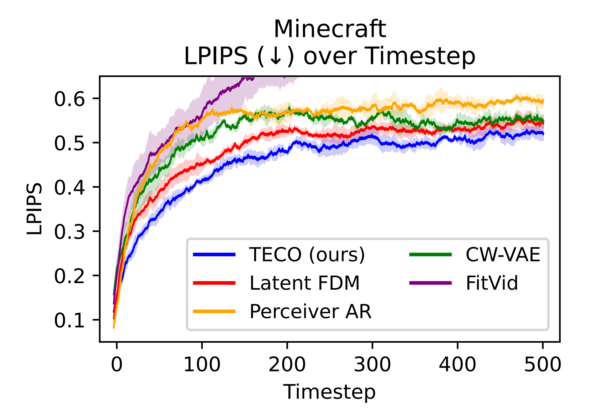

    我们可以推断一下，假设视频是电影级流畅度达24帧／秒，那么500帧图像对应正好20秒时长的生成视频

对Sora来说，如果对TECO适应性地改造一下，基本就可以把它能在VAE阶段就融合超长历史的能力吸收进来


1.  首先，VAE离散化是不必要的，所以可以拿掉
2.  其次，MaskGit部分用于训练模型能够Token by Token地生成视频，我们也不需要，只需要保留视频重建部分即可

经过上述改造，TECO在VAE Encoder阶段的基本思想就展示在下图中了(图源：张俊林)

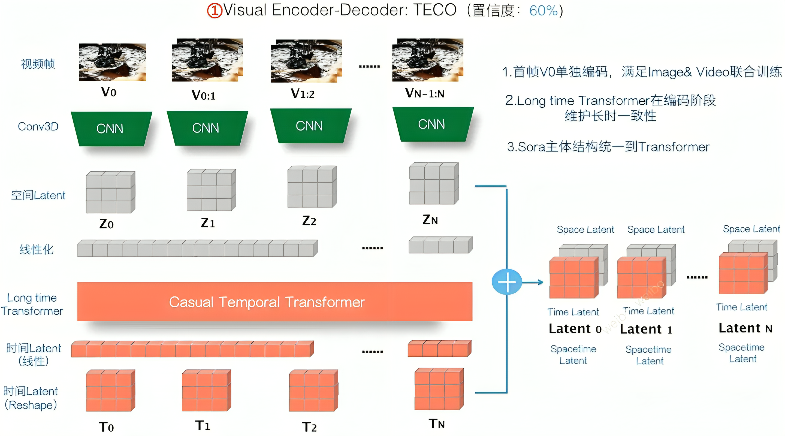

1.  视频帧
    首先，是对图片内容的空间Latent编码。首帧单独处理，自己成为一组，这就可以支持“图片和视频联合训练”了；其它帧两帧一组，比如**对于第  帧，则把前一帧第 (i −1) 帧也和第 i 帧放在一组**。这里要注意，尽管也是2帧一组，但是这和MAGVIT 思路是不一样的，TECO这个2帧一组类似一个滑动窗口，窗口间是有重叠的，所以不存在多帧压缩成一帧带来的信息损失问题
2.  **Conv3D & 空间Latent**
    视频帧分组后，使用CNN 3D卷积可以产生每帧图片对应的“连续Latent”，这部分是“Space Latent”，主要编码图像的空间信息
3.  **线性化**(拉平)
4.  **Long time Transformer**
    之后，使用Causal Temporal Transformer对时间信息进行编码，前面提过，对于同一视频，TECO会把所有历史内容Time信息都融合进来
5.  **时间Latent(线性) & 时间Latent(Reshape)**
    Transformer输出的时间编码是线性的，经过Reshape后可以形成和“Space Latent”相同大小的高维表示，这部分就是VAE的“Time Latent”
6.  **拼接Space Latent和Time Latent = SpaceTime latent**
    最后，如上图右下角所示，每帧视频经过TECO编码后，有一个“Space Latent”和一个“Time Latent”，两者并在一起就是这帧视频的VAE编码结果

这里可以再次看出，TECO的思路是增加信息，而不是以压缩减少信息为唯一目的的

#### 2.3.3 FDM：Flexible Diffusion Modeling of Long Videos(22年5月)

对于自回归方法(Autoregressive)FDM，再补充一段来自张俊林的介绍

1.  如下图所示，“自回归”思路很直接，先依次生成若干比如6帧视频帧，然后一次生成后续3帧，在生成这3帧的时候，Time Attention会看到之前的最近若干帧，比如4帧
    也就是说，“自回归”在生成后续视频帧的时候，会参考之前最近的若干帧(*注意这里的用词：参考，非自回归基于前几帧预测下一帧* )，以保持长时一致性
    容易看出，这是一种“短时”Attention，而非“长时”Attention

    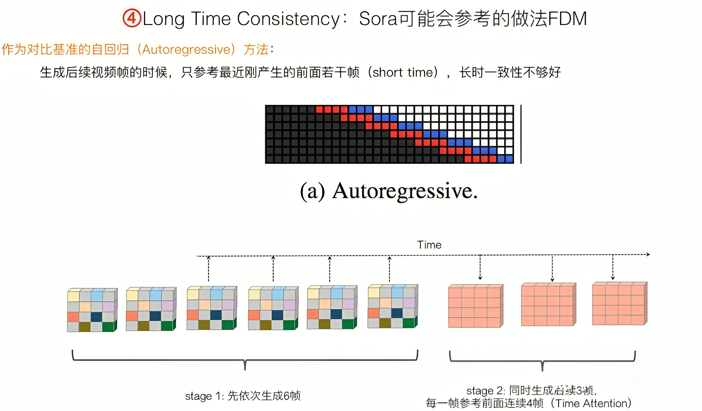

2.  “Long Range”是FDM(*其对应论文为：*[Flexible Diffusion Modeling of Long Videos](https://arxiv.org/abs/2205.11495 "Flexible Diffusion Modeling of Long Videos")**)提出的第一种“长时一致性”模型，思路如下图所示

    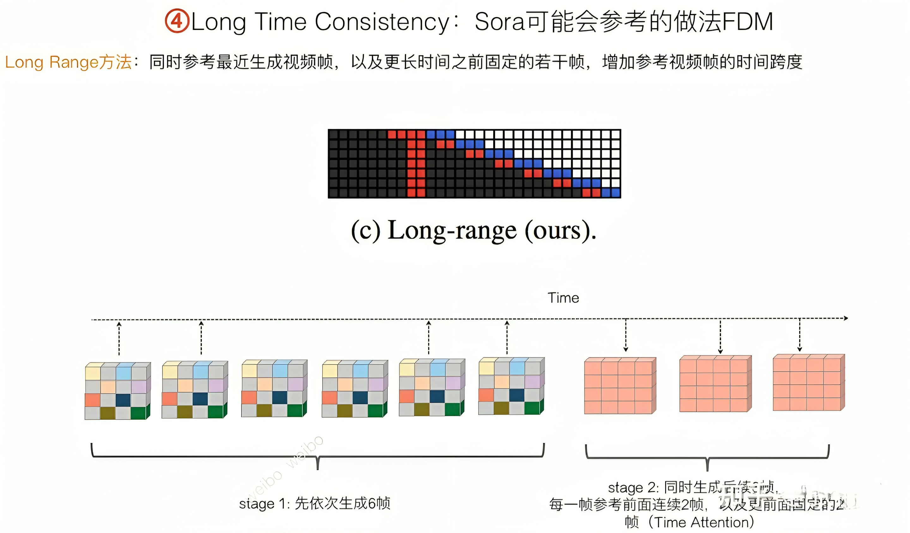

    即在生成第帧视频的时候，不仅仅参考最近的几帧，也会在较远历史里固定住若干帧作为参考。可以看出，“Long Range”既参考短时历史，也参考长时历史，不过长时历史位置是随机选的

### 2.4 DiT(含U-ViT)：将扩散过程中的U-Net 换成ViT(2D图像生成，带文本条件融合)

#### 2.4.1 DiT：在VAE框架之下扩散去噪中的卷积架构换成Transformer架构

在ViT之前，图像领域基本是CNN的天下，包括扩散过程中的噪声估计器所用的U-net也是卷积架构，但随着ViT的横空出世，人们自然而然开始考虑这个噪声估计器可否用Transformer架构来代替

2022年12月，William Peebles(*当时在UC Berkeley，Peebles在𝕏上用昵称Bill，在Linkedin上及论文署名时用大名William*)、Saining Xie(*当时在*纽*约大学*)的两人通过论文《[Scalable Diffusion Models with Transformers](https://arxiv.org/abs/2212.09748 "Scalable Diffusion Models with Transformers")》提出了一种叫 DiT 的神经网络结构

1.  其结合了视觉 transformer 和 diffusion 模型的优点，即DiT = DDPM + ViT
2.  但它**把DPPM中的卷积架构U-Net换成了Transformer架构**(We train latent diffusion models of images, replacing the commonly-used U-Net backbone with a transformer that operates on latent patche，至于什么是U-Net，请参见[此文](https://blog.csdn.net/v_JULY_v/article/details/130361959 "此文")的2.1节)

> 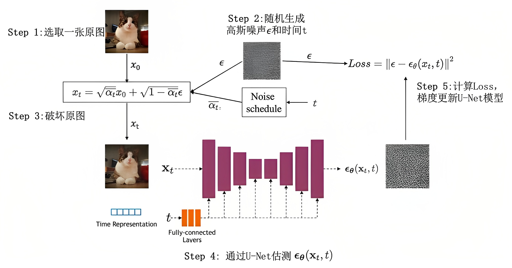

##### 2.4.1.1 Diffusion Transformer(DiT)的3个不同的条件策略

如下图所示，便是扩散transformer(DiT)的架构

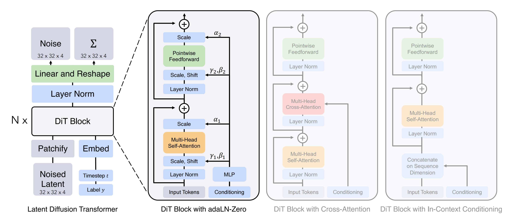

-   左侧：训练条件潜在DiT模型(conditional latent DiT models)， 潜在输入被分解成patch并通过几个DiT blocks处理(*The input latent is decomposed into patches and processed by several DiT blocks*)

    *本质就是噪声图片减掉预测的噪声以实现逐步复原
      比如当输入是一张256x256x3的图片，对图片做切patch后经过投影得到每个patch的token，得到32x32x4的Noised Latent(**即加噪的图片**，在推理时输入直接是32x32x4的噪声)，结合当前的Timestep t、Label y作为输入
      经过N个Dit Block(**基于transformer**)通过mlp进行输出，从而得到噪声“Noise预测”以及对应的协方差矩阵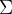(After the final DiT block, we need to decode our sequence of image tokens into an output noise prediction and an output diagonal covariance prediction)，最后经过T个step采样，得到32x32x4的降噪后的latent*
-   右侧：DiT blocks的细节，作者试验了标准transformer块的变体，这些变体通过自适应层归一化、交叉注意和额外输入token来加入条件(*incorporate conditioning via adaptive layer norm, cross-attention and extra input tokens，**这个coditioning相当于就是带条件的去噪*)，其中自适应层归一化效果最好

接下来，仔细介绍下上图右侧4个不同的条件策略(说白了，就是怎么加入conditioning)

1.  **自适应层归一化**，即Adaptive layer norm (adaLN) block
    鉴于自适应归一化层在GANs和具有U-Net骨干的扩散模型中的广泛使用，故用自适应层归一化(adaLN)替换transformer块中的标准层归一化层
    不是直接学习维度方向的缩放和偏移参数 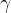和 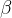，而是从 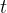 和类别标签的嵌入向量之和中回归它们(*Rather than directly learn dimension-wise scale and shift parameters γ and β, we regress them from the sum of the embedding vectors of t and c.*)
2.  **adaLN-Zero block**
    关于ResNets的先前工作发现，将每个残差块初始化为恒等函数是有益的。例如，Goyal等人发现，在每个块中将最终批量归一化尺度因子 γ零初始化可以加速大规模训练在监督学习设置中[13]
    扩散U-Net模型使用类似的初始化策略，在任何残差连接之前将每个块的最终卷积层零初始化。 作者对adaLN DiT块的修改，它做了同样的事情。 除了回归 γ和 β，还回归在DiT块内的任何残差连接之前立即应用的维度方向的缩放参数 α
3.  **交叉注意力块**
    将t和c的嵌入连接成一个长度为二的序列，与图像token序列分开，transformer块被修改为：在多头自注意块之后，包含一个额外的多头交叉注意层，类似于LDM用于根据类标签进行条件处理的设计。 交叉注意力使模型增加了最多的Gflops，大约增加了15%的开销
4.  **上下文条件化**(In-context conditionin)
    将  和 的向量嵌入作为两个额外的token追加到输入序列中，与图像token无异地对待它们，这类似于ViTs中的 cls token，它允许我们使用标准ViT块而无需修改。 在最后一个块之后，从序列中移除条件token。 这种方法没有新增模型多少Gflops，可忽略

##### 2.4.1.2 如何改造DiT，以使其可以做视频生成

当然，DiT只是用于做图像生成，如果基于其做视频生成，则需要在DiTs上做两项改造：

1.  **首先，需要设计一定的模型结构，用来支持不同长宽比和分辨率的视频**
    以保证Transformer在做Local Spatial Attention的时候，属于某帧图片的Patch只能相互之间看到自己这帧图片内的其它Patch，但不能看到其它帧图片的内容

    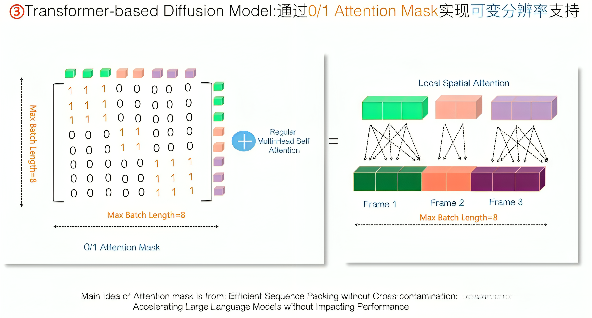

    好在根据此篇论文《Efficient Sequence Packing without Cross-contamination: Accelerating Large Language Models without Impacting Performance》可知，我们可采用“0/1 Attention Mask矩阵”来达成目标，即假设Batch内序列最大长度是8，就可以设置一个 8∗8 的0/1 Attention Mask，只有对角线正方形子Block位置全是1，其它地方都设置成0

    上图左侧标为绿色的某帧三个Patch，如果看矩阵前三行，易看出，针对其它帧的Attention Mask由于都是0，所以加上Mask后就看不到其它图片(*比如橙色、紫色的帧*)，而对于它(*三个绿色patch*)对应的 3∗3 都是1的Attention Mask，又可以保证三个Patch相互都能看到
    如此，通过设置Attention Mask，就可以很方便地支持NaVIT(*下文将介绍NaVIT*)导致的每帧不同分辨率和长宽比的问题
2.  **第二，需要把图片生成模型改成视频生成模型，本质就是加上一个时间的维度**
    具体而言，需要加入一个Casual Time Attention子模块
    Causal Time Attention模块的作用是在生成第帧的时候，收集历史Time信息，也就是通过Attention让第帧看到之前的比如帧内容，这是用来维护生成视频的时间一致性的

    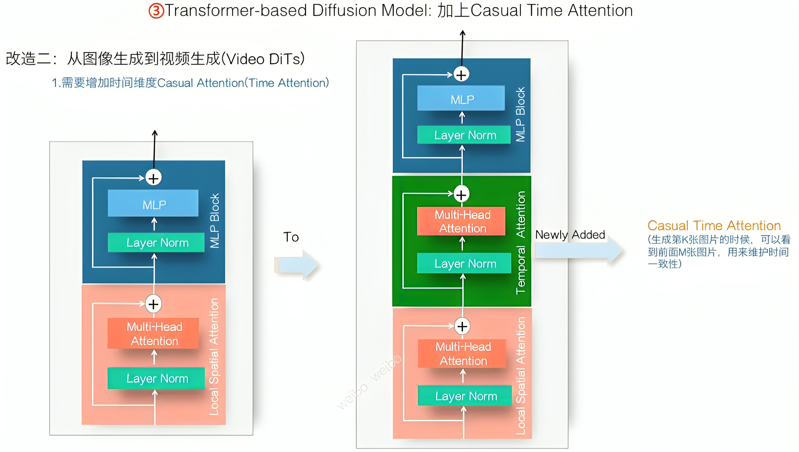

3.  最终，可以得到类似下文即将介绍的VDT的一个结构，如下图所示(图源：张俊林)

    

    首先，**把噪音Patch线性化后，并入Text Prompt Condition和Time Step Condition，一起作为Transformer的输入**
    其次，Transformer内部由三个子模块构成：
      Local Spatial Attention模块负责收集视频帧空间信息
      Causal Time Attention模块负责收集历史时间信息
      MLP模块负责对时间和空间信息通过非线性进行融合

#### 2.4.2 比DiT更早之类似架构U-ViT：虽也带文本条件融合，但和DiT都只局限在2D图像生成

对于扩散过程中噪声估计器的选择，国外的研究者很自然的想到了用Transformer代替U-net，那国内就没人想到么？

其实早在2022年9月，清华朱军团队(*背后关联的公司为生数科技，后于24年3月上旬拿到一笔数亿元的融资*)就发布了一篇名为《[All are Worth Words: A ViT Backbone for Diffusion Models](https://arxiv.org/abs/2209.12152 "All are Worth Words: A ViT Backbone for Diffusion Models")》的论文(*其一作为Fan Bao，比 DiT早提出两个多月，后被 CVPR 2023 收录*)，这篇论文提出了用「基于Transformer的架构U-ViT」替代基于卷积架构的U-Net

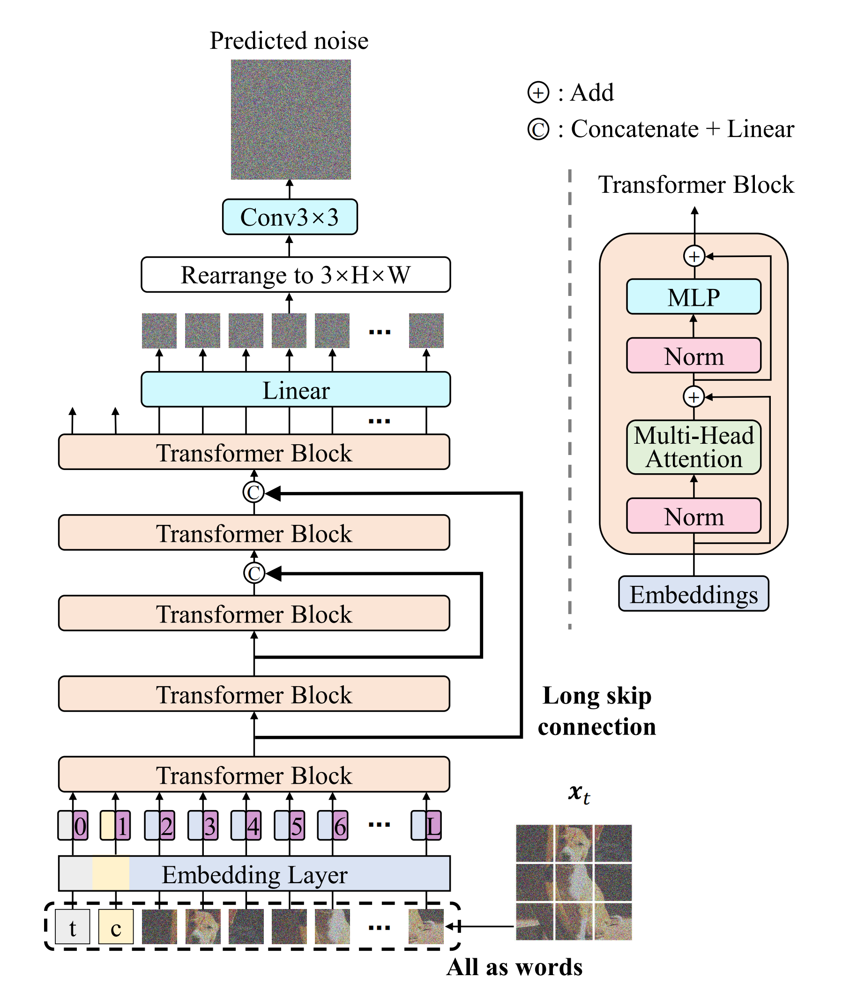

1.  U-ViT参数化了噪声预测网络，它接受时间 、条件 、噪声图像 作为输入，然后预测注入到 中的噪声。按照ViT的设计方法，图像被分割成patch，并且U-ViT将所有输入(包括时间、条件和图像patch)都视为token
2.  受到基于CNN的U-Net在扩散模型中的成功启发，U-ViT采用了类似的浅层和深层之间的长跳跃连接(*Inspired by the success of the CNN-based U-Net in diffusion models [65], U-ViT also employs similar long skip connections between shallow and deep layers*)
    意思是说，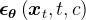的目标是像素级预测任务，对低级特征敏感。 长跳跃连接为低级特征提供了捷径，因此有助于噪声预测网络的训练
    *Intuitively,the objective in Eq. (1) is a pixel-level prediction task and is sensitive to low-level features. The long skip connections provide shortcuts for the low-level features and therefore ease the training of the noise prediction network*
3.  U-ViT在输出之前可选地添加一个3×3的卷积块。 这旨在防止transformer生成的图像中出现潜在的伪影(potential artifacts in images)

对比来看，两项工作在架构路线上完全一致

-   均是提出了将 Transformer 与扩散模型融合的思路
-   并且在具体的实验路径上也一致，比如采用了相同的 patch embedding、patch size；都得出了同样的结论 ——patch size 为 2\*2 是最理想的
-   在模型参数量上，两者都在 50M-500M 左右的参数量上做了实验，最终都证实了 scale 特性

不过 DiT 仅在 ImageNet 上做了实验，U-ViT 在小数据集(CIFAR10、CelebA)、ImageNet、图文数据集 MSCOCO 上均做了实验。此外，相比传统的 Transformer，U-ViT 提出了一项「长连接」的技术，大大提升了训练收敛速度

#### 2.4.3 比DiT更晚之又一个U-ViT的工作：Google Research提出Simple Diffusion

Google Research下的Brain Team，即Emiel Hoogeboom等人在2023年1月份发布的这篇论文《[Simple diffusion: End-to-end diffusion for high resolution images](https://arxiv.org/abs/2301.11093 "Simple diffusion: End-to-end diffusion for high resolution images")》中，也提出了类似U-ViT的架构

如下图所示，本质上，在较低的层次，卷积层被具有自注意力的MLP块(即transformer)所取代，且通过残差连接连接起来，只有较高层次的ResBlocks使用跳跃连接(*the convolutional layers are replaced by MLP blocks on levels with self-attention. These now form transformer blocks which are connected via residual connections, only the ResBlocks on higher levels use skip connections*)

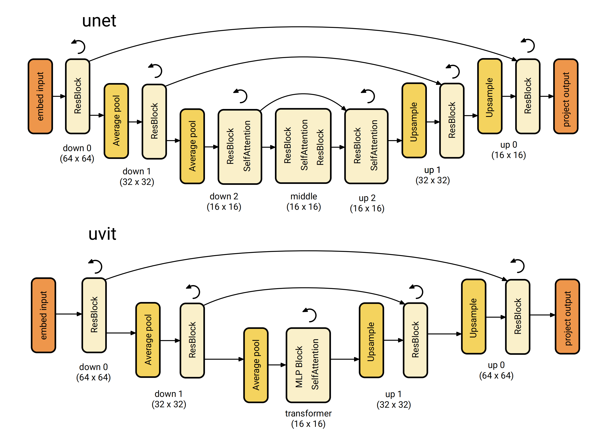

他们指出

1.  对于加噪，应根据图像的大小进行调整，随着分辨率的增加，添加更多的噪声
2.  仅将U-Net架构缩放到16×16的分辨率即可改善性能。进一步地，也同样提出了U-ViT架构，它是具有Transformer骨干的U-Net
    *本质上，这个U-Vision Transformer（U-ViT）架构可以看作是一个小型卷积U-Net，通过多个级别的下采样到达16 × 16的分辨率，然后经过一个大型Transformer之后，最后通过卷积U-Net进行上采样*
3.  为了提高性能，应添加Dropout，但不要在最高分辨率的特征图上添加
4.  对于更高的分辨率，可以进行下采样而不会降低性能。最重要的是，这些结果仅使用单个模型和端到端的训练设置获得。在使用现有的蒸馏技术后，这些技术现在只需应用于单个阶段，模型可以在0.4秒内生成一张图像

> **更多，请参见此文《[Diffusion Transformer(DiT)——将扩散过程中的U-Net换成ViT：近频繁用于视频生成与机器人动作预测(含清华PAD详解)](https://blog.csdn.net/v_JULY_v/article/details/144797429 "Diffusion Transformer(DiT)——将扩散过程中的U-Net换成ViT：近频繁用于视频生成与机器人动作预测(含清华PAD详解)")》**

### 2.5 VDT：基于扩散的视频生成中首次使用Transformer(与sora架构最接近)

#### 2.5.1 VDT：综合「ViViT的时空编码」与「DiT的扩散Transformer」

上面介绍的DiT、U-ViT更多还是在2D图像生成领域，那有没有“基于扩散的视频生成中首次使用Transformer(*which pioneers the use of transformers in diffusion-based video generat*)”的工作呢？

2023年5月，中国人民大学(*来自高瓴人工智能学院的一个团队，带队人为卢志武，背后和一家叫“智子引擎”的公司紧密关联*)与加州大学伯克利分校、香港大学等共同提出了基于 Transformer 的 Video 统一生成框架：Video Diffusion Transformer(*对应论文为：[VDT: General-purpose Video Diffusion Transformers via Mask Modeling](https://arxiv.org/abs/2305.13311 "VDT: General-purpose Video Diffusion Transformers via Mask Modeling")，简称VDT ，后于24年1月被ICLR 2024接收* )，统一各种视频生成任务，包括无条件生成、预测、插值、动画和时空视频生成

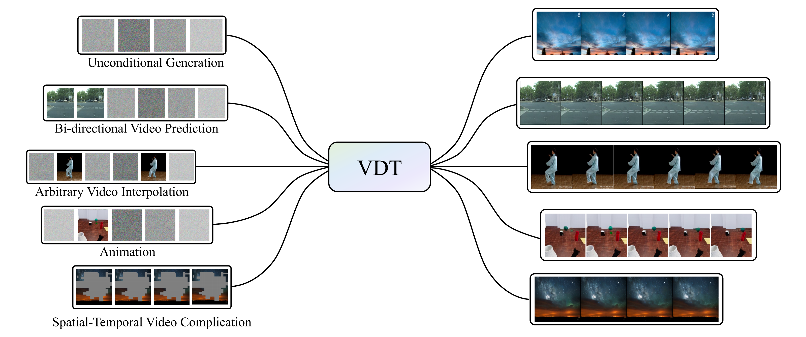

这篇论文开头提到Transformer在视频生成领域中具备的几大优势

1.  视频生成的领域包括各种任务，例如无条件生成、视频预测、插值和文本到图像生成。以往的研究通常专注于单个任务，经常结合用于下游微调的专门模块。此外，这些任务涉及到可以在帧和模态之间变化的多样化的条件信息。这需要一个能够处理不同输入长度和模态的强大架构
2.  与主要设计用于图像的U-Net不同，Transformer天生具有捕捉长程或不规则时间依赖性的能力，这要归功于它们强大的token化和注意力机制。这使得它们能够更好地处理时间维度，如在各种视频任务中的分类、定位和检索方面表现出优越性能
3.  只有当模型学习(或记忆)了世界知识(例如时空关系和物理定律)时，它才能生成与真实世界相对应的视频(*Only when a model has learned (or memorized) worldly knowledge (e.g., spatiotemporal relationships and physical laws) can it generate videos corresponding to the real word*)。因此，模型容量是视频扩散的关键组成部分
    Transformer已被证明具有高度可扩展性，使它们比3D U-Net更适合应对视频生成的挑战。例如，最大的U-Net架构的SD-XL有26亿个参数，而PaLM等Transformer架构的模型则拥有5400亿个参数

而提出的视频扩散Transformer(VDT)具备以上所有优势，且它有时间和空间注意力模块的Transformer块，以及用于有效token化的VAE标记器以及用于生成视频帧的解码器组成

VDT 框架包括以下几部分：

-   **输入 / 输出特征**
    VDT 的目标是生成一个 F×H×W×3 的视频片段，由 F 帧大小为 H×W 的视频组成。然而，如果使用原始像素作为 VDT 的输入，将导致计算量极大(尤其是当 F 很大时)
    为解决这个问题，受潜在扩散模型(LDM)的启发，**VDT 使用预训练的 VAE tokenizer 将视频投影到潜在空间中**。将输入和输出的向量维度减少到潜在特征 / 噪声的 F×H/8×W/8×C，加速了 VDT 的训练和推理速度，其中 F 帧潜在特征的大小为 H/8×W/8。这里的 8 是 VAE tokenizer 的下采样率，C 表示潜在特征维度
-   **线性嵌入**
    遵循 Vision Transformer 的方法，VDT 将潜在视频特征表示划分为大小为 N×N 的非重叠 Patch，且为为每个patch添加空间和时间位置嵌入(sin-cos)
-   **时空 Transformer Block**
    受到视频建模中时空自注意力的启发，VDT 在 Transformer Block 中插入了一个时间注意力层，以获得时间维度的建模能力
    具体来说，每个 Transformer Block 由一个多头时间注意力、一个多头空间注意力和一个全连接前馈网络组成，这点类似上文介绍过的ViViT，如下图所示

    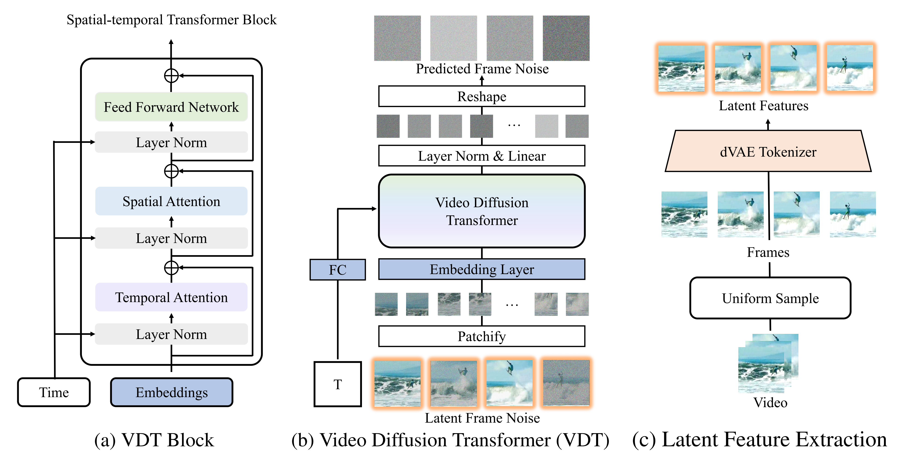

此外，在扩散过程中，将时间信息纳入Transformer块是至关重要的

具体的执行方式是在Transformer块中，VDT在层归一化时整合了时间(*we integrate the time component after the layer normalization in the transformer block*)，这与基于U-Net的扩散模型中使用的自适应组归一化类似(*说白了，就是**去噪过程中的时间step信息通过Layer Norm送入网络之中**，所以你才会看到上图最左下角有个Time的标识符通过其之上的三个箭头连接Layer Norm层*)，可以表示为：

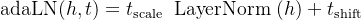

其中 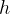是隐藏状态，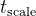和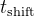是从时间嵌入中获得的scale 和shift 参数

> 对比 Sora 最新发布的技术报告，可以看到 VDT 和 Sora 在实现细节上还是存在一些差别
>
> 1.  首先，VDT 采用的是在时空维度上分别进行注意力机制处理的方法，而 Sora 则预计是将时间和空间维度合并，通过单一的注意力机制来处理
>     VDT这种分离注意力的做法在视频领域已经相当常见，通常被视为在显存限制下的一种妥协选择，即选择采用分离注意力也是出于计算资源有限的考虑
>     而Sora 强大的视频动态能力可能来自于时空整体的注意力机制，反正算力充沛
> 2.  其次，不同于 VDT和ViViT，Sora 还考虑了文本条件的融合(*当然，U-ViT和DiT也都有基于 Transformer 进行文本条件的融合*)
>     预计Sora 可能在其模块中进一步加入了交叉注意力机制，当然，直接将文本和噪声拼接作为条件输入的形式也是一种潜在的可能
>
> 综上，你可以把sora理解为带文本条件融合且时空注意力并行计算的Video Diffusion Transformer (所谓的这个带文本条件融合，你也可以简单粗暴的理解为条件去噪)

因此，行文至此，这个VDT是最接近sora的架构了，但国内没公司将其产品化，让人不得不再次感叹，国内技术并不差，但OpenAI对scale太坚定、把大模型各个创新技术整合到一个产品中并规模化应用的能力太强、算力太强，包括其追踪最新技术、最新paper的能力，让其率先推出了sora

#### 2.5.2 VDT的视频预测方案：把视频前几帧作为条件帧自回归预测下一帧

视频生成领域有一个与之密切相关的任务 —— 视频预测，即预测下一个视频帧，而视频预测任务也可以视为条件生成，这里给定的条件帧是视频的前几帧

VDT 主要考虑了以下三种条件生成方式：

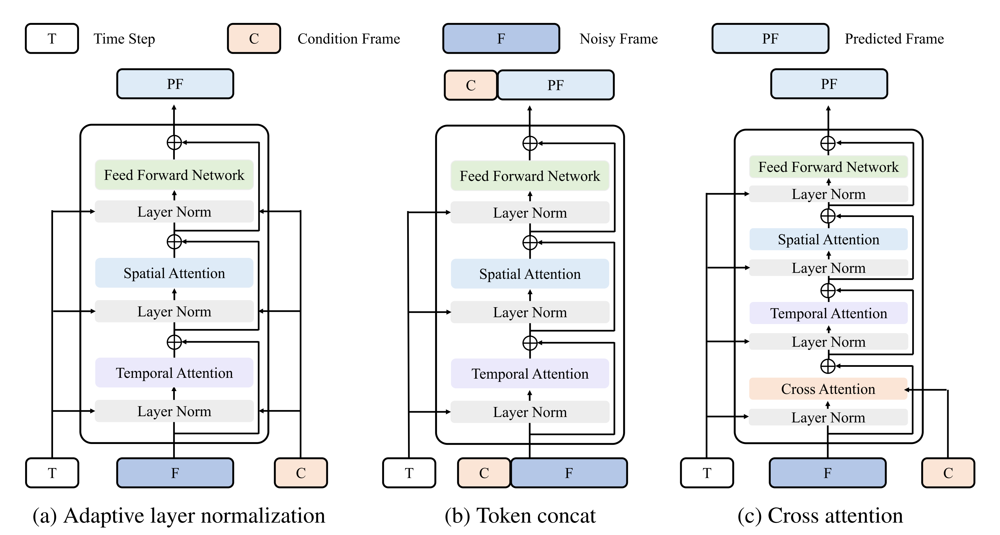

-   **自适应层归一化**(*即通过Normalization的方式，对应上图图a*)
    实现视频预测的一种直接方法是将条件帧特征整合到 VDT Block 的层归一化中，类似于上节的将时间信息整合到扩散过程中
    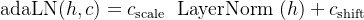
    其中 是隐藏状态， 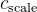和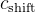是从时间嵌入和条件帧中获得的scale 和shift 参数
-   **交叉注意力Cross Attention**(*对应上图图c*)
    研究者还探索了使用交叉注意力作为视频预测方案，其中条件帧用作key和value，而噪声帧作为query，这允许将条件信息与噪声帧融合
    在进入交叉注意力层之前，使用 VAE tokenizer 提取条件帧的特征并 Patch 化。同时，还添加了空间和时间位置嵌入，以帮助VDT 学习条件帧中的对应信息
-   **Token 拼接**(*即通过token concat的方式，对应上图图b*)
    VDT 模型采用纯粹的 Transformer 架构，因此，直接使用条件帧作为输入 token 对 VDT 来说是更直观的方法
      VDT通过在 token 级别拼接条件帧(潜在特征)和噪声帧来实现这一点，然后将其输入到 VDT 中
      接下来，他们将 VDT 的输出帧序列分割，并使用预测的帧进行扩散过程，如上图(b)所示
    他们发现，这种方案展示了最快的收敛速度，与前两种方法相比，在最终结果上提供了更优的表现
    此外，他们发现即使在训练过程中使用固定长度的条件帧，但在推理是，VDT 仍然可以接受任意长度的条件帧作为输入，并输出一致的预测特征

#### 2.5.3 将 VDT 扩展到图片生成视频，而无需引入额外的模块或参数

在 VDT 的框架下，为了实现视频预测任务，不需要对网络结构进行任何修改，仅需改变模型的输入即可。这一发现引出了一个直观的问题：能否进一步利用这种可扩展性，将 VDT 扩展到更多样化的视频生成任务上 —— 例如图片生成视频 —— 而无需引入任何额外的模块或参数

1.  通过回顾 VDT 在无条件生成和视频预测中的功能，唯一的区别在于输入特征的类型。具体来说，输入可以是纯噪声潜在特征，或者是条件和噪声潜在特征的拼接
2.  然后，研究者引入了 Unified Spatial-Temporal Mask Modeling 来统一条件输入

如下图所示：

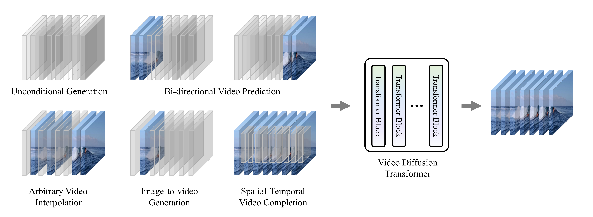

### 2.6 NaViT：多个patches打包成一个单一序列以实现可变分辨率

#### 2.6.1 Google提出NaViT(Native Resolution ViT)

在压缩网络部分有一个关键问题：在将patches送入Diffusion Transformer的输入层之前，如何高效处理潜空间维度的变化(*即不同视频类型的潜特征块或patches的数量，其中，处理高效很重要*)

2023年7月，Google DeepMind通过此篇论文《[Patch n' Pack: NaViT, a Vision Transformer for any Aspect Ratio and Resolution](https://arxiv.org/abs/2307.06304 "Patch n' Pack: NaViT, a Vision Transformer for any Aspect Ratio and Resolution")》提出了Native Resolution ViT，简称NaViT

-   该模型在训练过程中采用序列封装的方式处理任意分辨率和纵横比的输入(*uses sequence packing during training to process inputs of arbitrary resolutions and aspect ratios*)
-   除了具备灵活性的模型应用外，还展示了通过大规模监督和contrastive image-text pretraining来提高训练效率(*we demonstrate improved training efficiency for large-scale supervised and contrastive image-text pretraining*)

具体而言

-   视觉Transformer(ViT)输入图像会被调整为固定的平方纵横比，并分割成固定数量的patch(*input images are resized to a **fixed square aspect ratio** and then split into a fixed number of patches*)
    这是通过在每个训练步骤中对patch大小进行随机采样和调整算法来实现的，以支持多种初始卷积嵌入尺寸(*This is achieved via random sampling of a patch size at each training step and a resizing algorithm to allow the initial convolutional embedding to support multiple patch sizes*)
-   Pix2Struct引入了一种替代方法来保留纵横比(*introduced an alternative patching approach which preserves the aspect ratio*)，在图表和文档理解等任务中尤其有用

Google从而提出了一种替代方法NaViT，**将来自不同图像的多个patches打包成一个单一序列——称为Patch n’ Pack——从而实现可变分辨率并保持长宽比**(*Multiple patches from different images are packed in a single sequence— termed Patch n’ Pack—which enables variable resolution while preserving the aspect ratio*)

#### 2.6.2 如何实现的可变分辨率并保持长宽比

不同的分辨率输入在训练时候带来的是大量的计算负载不均衡，一个最简单的做法就是直接padding到固定大小

然此举势必会引入大量不必要的计算量， 因此用下述技术降低计算量，支持动态输入：

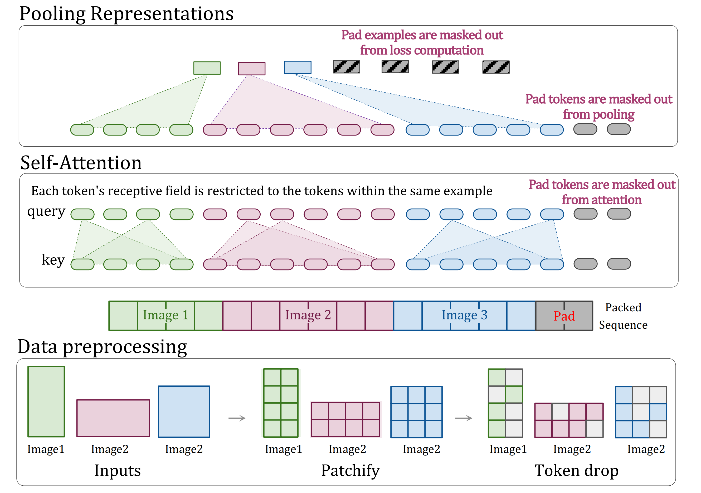

1.  **以紧凑的方式打包 token**
    NaViT采用了简单的贪心算法，即在第一个序列中添加足够剩余空间的样本。一旦没有样本可以容纳，序列就会被填充 token 填满，从而产生批处理操作所需的固定序列长度
    这种简单的打包算法可能会导致大量填充，这取决于输入长度的分布情况
    另一方面，可以控制采样的分辨率和帧数，通过调整序列长度和限制填充来确保高效打包
2.  **控制好哪些 token 在何时被丢弃**
    直观的方法是丢弃相似的 token，或者像 PNP 一样，使用丢弃率调度器。不过，值得注意的是，在训练过程中，丢弃 token 可能会忽略细粒度的细节
    因此，有人认为 sora 很可能会使用超长的上下文窗口并打包视频中的所有 token，尽管这样做的计算成本很高(*毕竟Transformer的计算复杂度与序列长度上成二次方*)
    总之，一个长时间视频中的时空潜在 patch 可以打包到一个序列中，而多个短时间视频中的时空潜在 patch 则会串联到另一个序列中

#### 2.6.3 如何把NaViT应用到sora中且与TECO结合

对于NaVIT而言，只要我们固定住Patch Size的大小，通过扫描不同分辨率的视频，自然就产生了不同分辨率或长宽比的Patch矩阵，然后把它们线性化即可

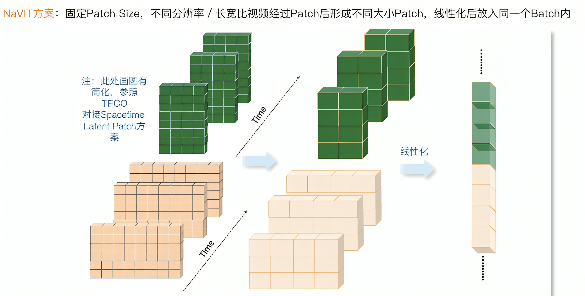

如张俊林所说，这种NaVIT的方法比单纯的Padding更好，因为一个Batch里会经常被Padding这种无意义的占位符号浪费很多空间，而NaVIT不需要对每张图片进行Padding，该是多少Patch就是多少Patch，顶多在Batch末尾加少量Padding来填充到Batch 最大长度即可(*故很明显NaViT方案在一个Batch里可以放更多视频帧，而这能极大增加模型的训练效率*)

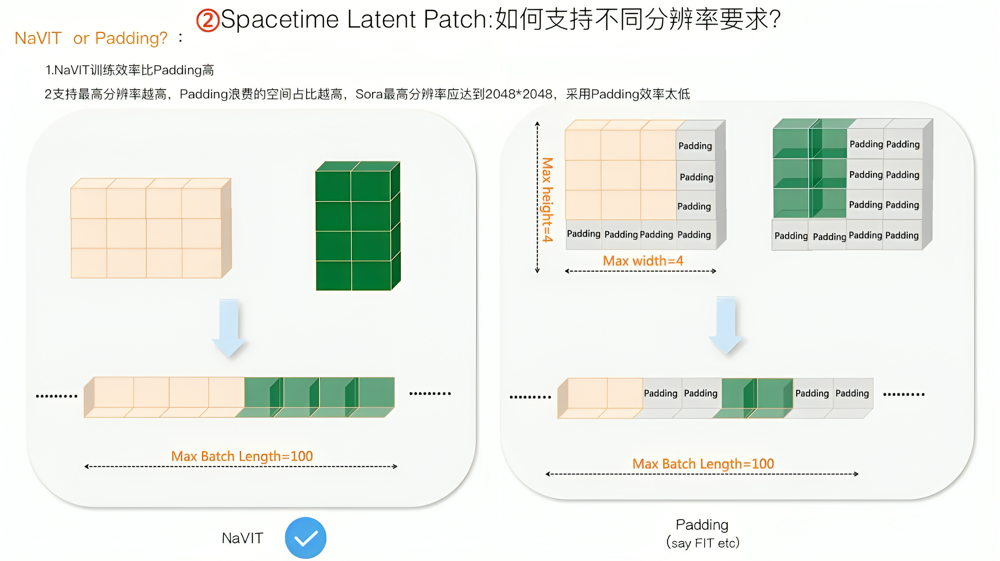

在将Patch拉成线性结构后，会丢失Patch对应的位置信息，所以为了能够支持可变分辨率视频，对于每个Patch，需要特殊设计的位置表征

很明显使用Patch的绝对位置(就是按照Patch顺序编号)是不行的，只要我们使用三维空间里的相对坐标，并学习对应的Position Embedding，就可以解决这个问题

下图展示了同一个视频的连续三帧，对于蓝色Patch来说，可以看出它对应的相对坐标位置为： x=2 y=3 以及 z=3 (视频时间维度的第三帧)

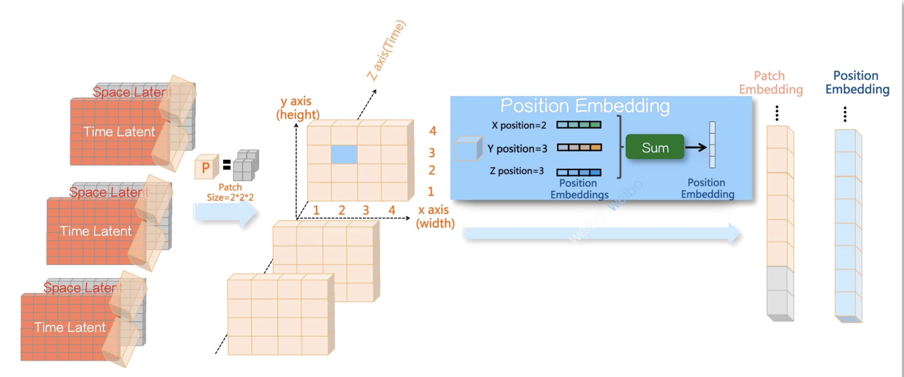

## 第三部分(选读) Sora之外的技术：MAGVIT v2、W.A.L.T、VideoPoet

### 3.1 MAGVIT v2：用好**tokenizer可以超越diffusion**

#### 3.1.1 能得到离散的视觉token的好处

对于基于 transformer 的工作，不管是 latent diffusion 还是 language model，它们之间的区别很小，都是 token-based，最大的区别在于：基于 diffusion 的生成是连续的 token，language model 处理的是离散的 token

通过上文，我们已经知道 Sora 会将视频数据 token 化，所以再来深入聊下tokenizer

Google和CMU于2023年10月份联合发布的MAGVIT v2(*这是其论文[Language Model Beats Diffusion -- Tokenizer is Key to Visual Generation](https://arxiv.org/abs/2310.05737 "Language Model Beats Diffusion -- Tokenizer is Key to Visual Generation")*)

1.  配备这个tokenizer，LLMs在图像和视频生成等视觉任务上能取得比扩散模型更好的效果，更第一次证明语言模型在标志性的ImageNet基准测试上击败了扩散模型
2.  值得强调的是，该模型的意图不是断言语言模型是否优于其他模型，而是促进对LLMs的视觉分词方法的探索

LLMs与其他模型(如扩散模型)的一个基本区别是LLMs利用离散的潜在格式，而能得到离散的视觉token的价值不容忽视

1.  与LLMs的兼容性，比如可以轻松利用市面上多年来为LLM开发的优化技术。这包括更快的训练和推理速度、模型基础设施的进展、模型扩展的学习方法以及GPU/TPU优化等其他创新
    通过相同的token空间统一视觉和语言，可以为真正的多模态LLM奠定基础，使其能够理解、生成和推理我们的视觉环境
2.  压缩表示，离散token可能为视频压缩提供新的视角。这些视觉token可以作为一种新的视频压缩格式，在互联网传输过程中减少磁盘存储和带宽。 与压缩的RGB像素不同，这些token可以直接输入生成模型，跳过传统的解压缩和潜在编码步骤。 这样可以加快生成视频应用程序的处理速度，特别适用于边缘计算情况
3.  视觉理解的好处。 先前的研究表明，离散标记在自监督表示学习中作为预训练目标是有价值的

此外，如公号“飞哥说AI”所说，以前的Tokenizer针对图片和视频一般是用不同的Vocabulary分开处理，MAGViT V2把图片和视频整合到同一个Vocabulary里，使得图片和视频能够在同一个模型中进行联合训练。另外，以前Vocabulary的规模一般比较小(比如说8192)，而MAGVit V2用了一种Lookup-free的办法，把Vocabulary的规模做到了26万，从而显著提高了视频的压缩和生成质量

#### 3.1.2 因果3D卷积层(**temporally causal 3D convolution**)替换掉3D CNN的价值

值得一提的是，如下图所示

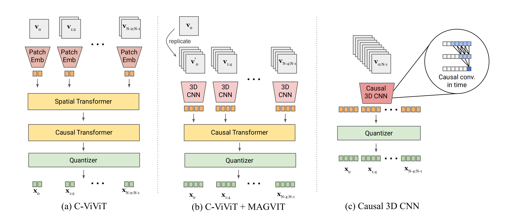

-   C-ViViT采用了完全空间transformer块与因果时间transformer块的组合(如上图a所示)，不过，其有两个缺点
    首先，与CNN不同，位置嵌入使得在训练期间未见过的spatial resolutions难以进行分词。 其次，经验发现，3D CNN比spatial transformer表现更好，并且产生具有更好空间因果关系corresponding patch
    *C-ViViT employs full spatial transformer blocks combined with **causal temporal transformer blocks**.
    First, unlike CNNs, the positional embeddings makes it difficult to tokenize spatial resolutions that were not seen during training.
    Second, empirically we found that 3D CNNs perform better than spatial transformer and produce tokens with better spatial causality of the corresponding patch*
-   那把C-ViViT中的spatial transformer替换成3D CNN(如上图b所示)会如何呢？然问题又出现了，这些层不能独立处理第一帧，因为常规的卷积核尺寸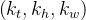将会操作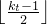帧之前和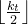帧之后的输入帧
-   好在通过因果3D卷积层(**temporally causal 3D convolution**)替换掉3D CNN则顺利解决了这个问题(如上图c所示)，因为卷积核仅在过去的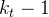帧上操作(***即因果3D卷积层在输入之前只填充帧，之后不填充，因此每个帧的输出仅依赖于前面的帧***)
    这确保了每一帧的输出仅受到前面帧的影响，使得模型能够独立地对第一帧进行标记

### 3.2 W.A.L.T：将Transformer用于扩散模型

#### 3.2.1 两个窗口局部注意力：空间层、时空层

23年12月中旬，来自斯坦福大学、谷歌、佐治亚理工学院的研究者提出了 Window Attention Latent Transformer， 一种基于窗口注意力的潜在视频扩散模型(LVDMs)方法， 简称 W.A.L.T，其对应的论文为《[Photorealistic Video Generation with Diffusion Models](https://arxiv.org/abs/2312.06662 "Photorealistic Video Generation with Diffusion Models")》，该方法成功地将 Transformer 架构整合到了潜在视频扩散模型中，斯坦福大学的李飞飞教授也是该论文的作者之一

该方法包括两个阶段

1.  首先，一个自动编码器将视频和图像映射到一个统一的、低维的潜在空间。 这种设计选择使得在图像和视频数据集上联合训练单一生成模型成为可能，并显著减少了生成高分辨率视频的计算负担
2.  随后，我们提出了一种新的Transformer块设计，用于潜在视频扩散建模，它由交替的自注意力层组成，这些层在不重叠的、窗口限制的空间和时空注意力之间切换
    这种设计提供了两个主要好处：首先，使用局部窗口(*这个局部窗口的本质就是上文提到过的patch*)注意力显著降低了计算需求。 其次，它促进了联合训练，其中空间层独立处理图像和视频帧，而时空层专门用于建模视频中的时间关系

如下图所示，我们将图像和视频编码到一个共享的潜在空间中，Transformer骨干网络通过具有两层窗口局部注意力的块处理这些潜在因素：

-   空间层spatial layers捕获图像和视频中的空间关系
-   而时空层spatiotemporal layers通过身份注意力掩码在视频中建模时间动态并在图像中传递(*spatial layers capture spatial relations in both images and video, while spatiotemporal layers model temporal dynamics in videos and pass through images via identity attention mask*)
    且通过空间交叉注意力加入text condition

    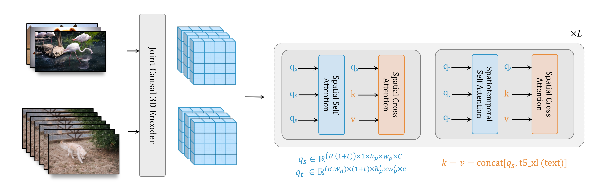

具体来说

1.  给定一个视频序列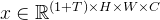，模型旨在学习一个低维表示通过空间的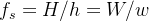因子和时间的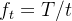因子进行时空压缩
2.  为了使视频和静态图像都能使用统一的表示，第一帧总是独立于视频的其余部分进行编码。 这允许静态图像 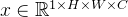被视为具有单一帧的视频，即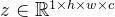
3.  最终用因果3D CNN编解码器架构实例化这个设计，该架构是MAGVIT-v2 tokenize
    在这个阶段之后，模型的输入是一批表示单个视频或一堆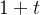独立图像的潜在张量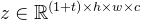

#### 3.2.2 自回归预测：过去的帧也可以作为继续生成的参考

为了通过自回归预测生成长视频，我们也在帧预测任务上联合训练我们的模型，这是通过在训练期间以概率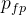条件化模型在过去的帧上实现的

具体来说，模型通过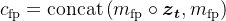进行条件化，其中 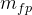是一个二进制掩码。 二进制掩码指示了用于条件化的过去帧的数量。

最终，根据 1个潜在帧(图像到视频生成)或 2个潜在帧(视频预测)进行条件化

1.  这种条件化通过沿着「噪声潜在输入」的通道维度的拼接，被整合到模型中
    *This conditioning is integrated into the model through concatenation along the channel dimension of the noisy latent input*
2.  在推断过程中，我们使用标准的无分类器引导，以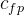作为条件信号
    *During inference, we use standard classifier-free guidance with cfp as the conditioning signal*

### 3.3 Google VideoPoet：基于MAGVIT V2和Transformer而来

2023年年底，Google推出了VideoPoet(*这是其论文：***[VideoPoet: A Large Language Model for Zero-Shot Video Generation](https://arxiv.org/abs/2312.14125 "VideoPoet: A Large Language Model for Zero-Shot Video Generation")****)，包含两个阶段：预训练和微调(pretraining and task-specific adaptation)

与通常使用外部交叉注意力网络或潜在混合进行风格化基于扩散的方法相比(*In contrast to the diffusion-based approaches that usually use external cross-attention networks or latent blending for styliza-tion*)，Google的这个方法更加类似于利用LLM进行机器翻译，因为只需将结构和文本作为语言模型的前缀

#### 3.3.1 通过自然语言随心所欲的编辑视频，且其zero-shot能力强悍

如下图所示，其可以将输入图像动画化以生成一段视频，并且可以编辑视频或扩展视频

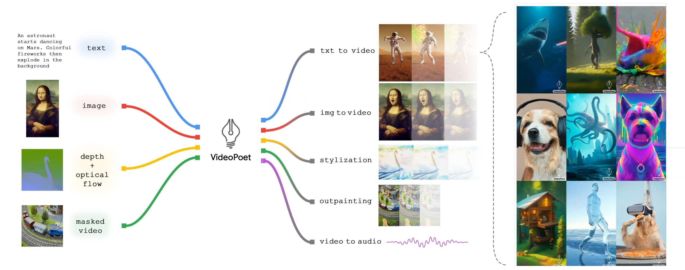

在风格化方面，该模型接收表征深度和光流的视频，以文本指导的风格绘制内容

#### **3.3.2 视频生成器**：借鉴LLM离散化token的处理思路

LLM在过去一年已经取得了巨大成功，那可否用于视频生成领域呢

1.  然而，LLM 是在离散 token 上运行的，好在一些「**视频和音频 tokenizer**(*比如用于视频和图像的 MAGVIT V2 和用于音频的 SoundStream)*」，可以将视频和音频剪辑编码为离散 token 序列，并且也可以转换回原始表征形式
2.  如此，通过使用多个 tokenizer，VideoPoet 便可以训练自回归语言模型来学习跨视频、图像、音频和文本的多个模态
    一旦模型生成以某些上下文为条件的 token，就可以使用 tokenizer 解码器将它们转换回可视化的表征形式

如下图所示，VideoPoet将所有模态编码映射到离散的标记空间中，以便能够直接利用LLM架构进行视频生成，特定标记使用<>表示，其中

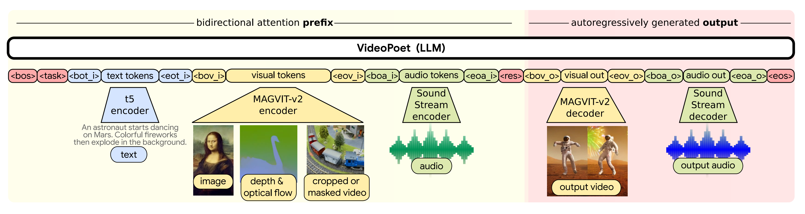

-   深红色代表模态不可知部分
    蓝色代表文本相关组件，即text tokens (embeddings): the pre-extracted T5 embed-dings for any text.
    黄色代表视觉相关组件，即visual tokens: the MAGVIT-v2 tokens representing the images, video subsection, or COMMIT encoded video-to-video task.
    绿色代表音频相关组件，即audio tokens: the SoundStream tokens representing au-dio
-   上图左侧的浅黄色区域表示双向前缀输入
    而上午右侧的深红色区域则表示带有因果注意机制的自回归生成输出

#### 3.3.3 Tokenization：图像视频标记MAGVIT-v2与音频标记SoundStream

图像和视频分词器(Image and video tokenizer)是生成高质量视频内容的关键

具体而言，它将图像和视频编码为一串整数，并通过解码器将其映射回像素空间，作为标记和像素空间之间的桥梁

-   视觉分词器的性能决定了视频生成质量的上限。同时，为了实现有效且高效的任务设置，压缩比决定了LLM序列长度
-   MAGVIT-v2对8 fps采样率下17帧、2.125秒、128×128分辨率的视频进行分词，产生(5, 16, 16)形状，并扁平化为1280个标记，词汇表大小为2-18
    *MAGVIT-v2tokenizes17-frame2.125-second128×128 resolution videos sampled at 8 fps to pro-duce a latent shape of (5, 16, 16), which is then flattenedinto 1280 tokens, with a vocabulary size of 2-18*
-   此外，在移动端生成短形式内容时，我们还将视频按纵横比分割成128×224分辨率，并产生(5, 28, 16)形状或2240个标记。在评估协议中使用16帧时，我们会舍弃最后一帧以制作16帧视频

## 第四部分 根据sora的32个reference以窥其背后更多技术细节

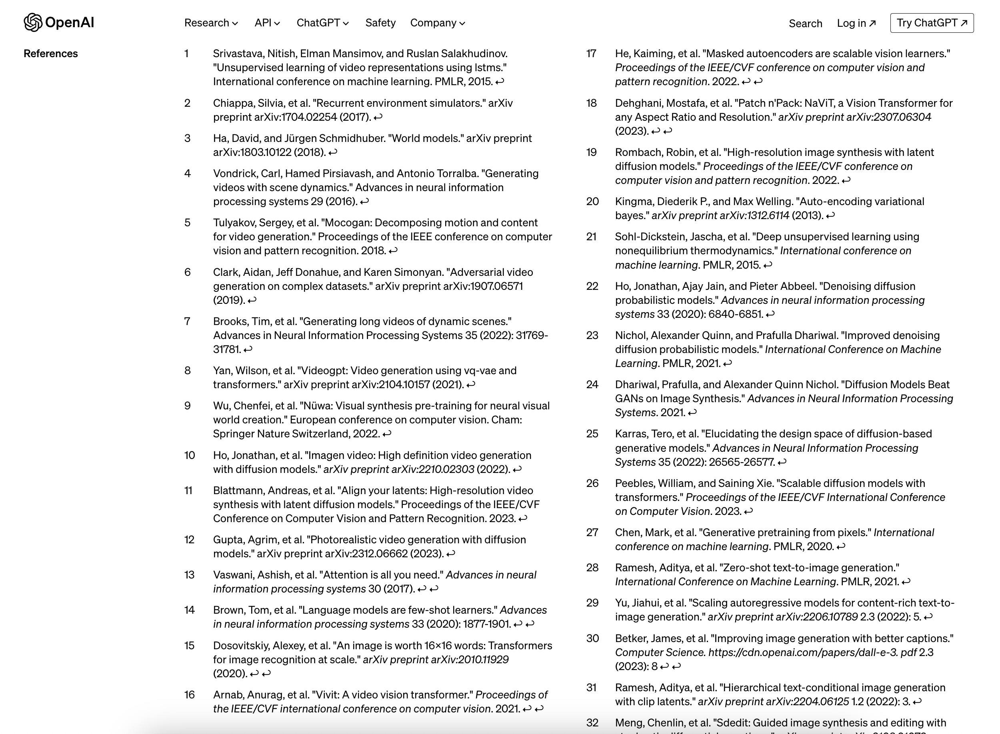

对于这32篇reference，我们来逐一分析下

1.  最前面的6篇是一些比较早期的研究(15-19年)，下文会介绍
2.  8是UC Berkeley的[Videogpt](https://wilson1yan.github.io/videogpt/index.html "Videogpt")(上文已介绍)、9是微软的NÜWA，10是侧重提高视频分辨率的Google的[imagen video](https://arxiv.org/abs/2210.02303 "imagen video")(*一作为提出DDPM且人称CV卷王的Jonathan Ho*)，11是Nvidia的VideoLDM(**[该项目主页](https://research.nvidia.com/labs/toronto-ai/VideoLDM/ "该项目主页")**)，12是W.A.L.T(上文已介绍)
3.  13是transformer论文，14是GPT3论文，15是ViT论文，17是MAE论文，19是SD奠基论文，30是DALLE 3，31是DALLE 2
    *19-31在上文提到过多次的这篇文章中都有详细的介绍《[AI绘画原理解析：从CLIP、BLIP到DALLE、DALLE 2、DALLE 3、Stable Diffusion](https://blog.csdn.net/v_JULY_v/article/details/131205615 "AI绘画原理解析：从CLIP、BLIP到DALLE、DALLE 2、DALLE 3、Stable Diffusion")》*
4.  16是ViViT、18是NaViT，26是DiT
    上文第二部分都已介绍
5.  22-24是DDPM发展相关的：22是DDPM，23是improved DDPM，24是Diffusion Model Beat GANs
    *这几个在上文也提到过多次的此文《[图像生成发展起源：从VAE、扩散模型DDPM、DETR到ViT、Swin transformer](https://blog.csdn.net/v_JULY_v/article/details/130361959 "图像生成发展起源：从VAE、扩散模型DDPM、DETR到ViT、Swin transformer")》中都有详细的介绍*
6.  27、28、29是三篇text-to-image相关的文章，下文会介绍

### 4.1 早期对视频的研究——使用LSTM的视频表示的无监督学习

sora的第一个reference为这篇论文《Unsupervised learning of video representations using lstms》，该论文考虑了目标序列的不同选择

1.  一种选择是预测与输入相同的序列，动机类似于自动编码器(比如VAE)——我们希望捕获所有重现输入所需的信息，同时克服模型施加的归纳偏差
    *The motivation is similar to that of auto encoders –we wish to capture all that is needed to reproducethe input but at the same time go through the inductive bi-ases imposed by the model*

    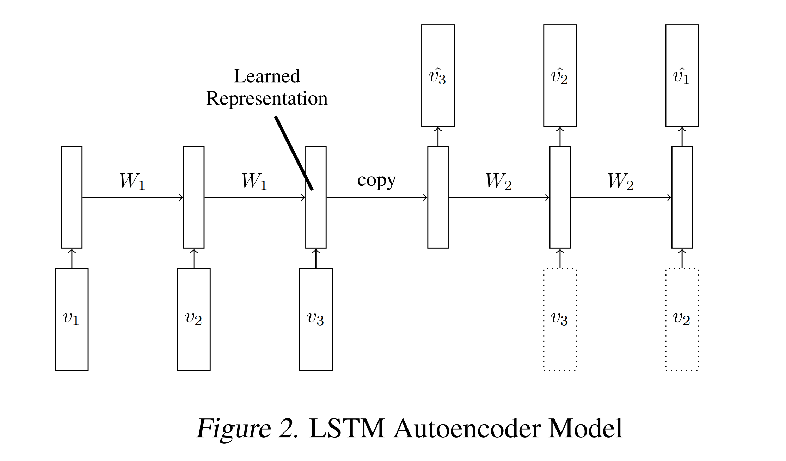

2.  另一种选择是预测未来的帧。这里的动机是学习一种表示，提取所有需要推断的运动和外观，而非仅限于观察到的内容

    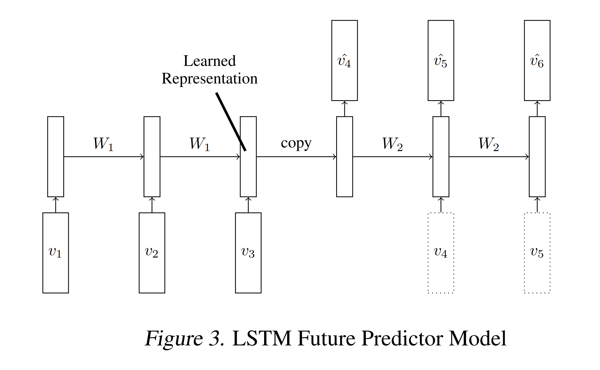

这两种自然而合理地选择也可以结合起来。在这种情况下，有两个解码器LSTM——一个将表示解码为输入序列，另一个则利用相同表示进行解码以预测未来

在模型输入方面，理论上可以采用任何表示单个视频帧的方式。然而，为了本文目的的考虑，我们将限制注意力在两种输入上

1.  第一种是图像块，即image patches
2.  第二种是通过应用在ImageNet上训练过的卷积网络提取出来的高级“感知”。这些感知指代卷积神经网络模型中最后一层和/或倒数第二层校正线性隐状态所得到的结果

### 4.2 早期对世界的模拟和对环境的学习

#### 4.2.1 把RNN用于对环境的模拟：预测时确保时空上的一致性

在sora的第二个reference中，引入了循环神经网络来提升以前的高维像素观测环境模拟器。这些网络能够对未来数百个时间步进行时间和空间上的一致预测，从而使智能体能够有效地计划和行动

为了解决计算效率低下的问题，我们采用了一个不需要在每个时间步生成高维图像的模型。通过这个方法，可以改善探索并适应多种不同环境，包括10个雅达利游戏、3D赛车环境和复杂的3D迷宫

#### 4.2.2 世界模型World Models

在sora的第三个reference中，研究了构建流行的强化学习环境生成神经网络模型的方法

世界模型可以通过无监督方式快速训练，以学习环境的时空压缩表示(*to learn **acompressed spatial and temporal representation** of the environment*)

通过将从世界模型中提取的特征作为Agent的输入，我们能够训练出一种非常紧凑和简洁的策略来解决所需任务。甚至可以完全在由世界模型生成的幻梦中(*hallucinated dream generated by its world model*)对Agent进行训练，并将该策略迁移到实际环境中

#### 4.2.3 Generating Videos with Scene Dynamics

在sora的第四个reference中，利用大量未标记的视频，以学习场景动态模型，应用于视频识别任务(如动作分类)和视频生成任务(如未来预测)

1.  其提出了一种具备时空卷积架构的视频生成对抗网络，该架构能够将场景中的前景与背景分离
2.  实验证明，该模型能够以全帧率生成长达一秒的小视频，并且相较于简单基线方法表现更优，在预测静态图像方面也展示出可信度
3.  此外，实验和可视化结果显示，该模型在最小监督下内部学习到了有益特征来识别动作，证明了场景动态是良好表示学习信号

#### 4.2.4 Generating Long Videos of Dynamic Scenes

在sora的第7个reference中，提出了一个视频生成模型，可以精确地再现物体运动、摄像机视角的变化以及随时间推移而出现的新内容

-   在它之前，已有的视频生成方法通常无法作为时间函数产生新内容，并同时保持真实环境中所期望的一致性，如可信的动态和对象持久性。一个常见失败案例是过度依赖归纳偏差来提供时间一致性，例如指定整个视频内容的单个潜在代码，导致内容永远不会改变
-   另一种极端情况下，如果没有长期一致性，则生成的视频可能会在不同场景之间失去真实感并发生形变

为了解决这些限制，我们优先考虑时间轴，并通过重新设计时间潜在表示以及通过在更长视频上进行训练来学习长期一致性

为此，我们采用两阶段训练策略，在低分辨率下使用更长视频进行训练，在高分辨率下使用更短视频进行训练。为了评估模型能力，我们引入了两个新的基准数据集，明确关注长期时间动态

### 4.3 27/28/29-text-to-image，前面两篇均有Ilya Sutskever的参与

-   Generative Pretraining from Pixels：Transformer预测图像像素
    摘要: 这篇论文探讨了在图像领域应用无监督表示学习的方法，特别是通过训练一个序列Transformer来自回归地预测像素
    尽管在没有标签的低分辨率ImageNet数据集上进行训练，但模型（GPT-2规模）能够学习到强大的图像表示，这通过线性探测、微调和低数据分类得到了验证

    在CIFAR-10数据集上，使用线性探测达到了96.3%的准确率，超过了监督的Wide ResNet。在ImageNet上，通过VQ-VAE编码替换像素，达到了69.0%的准确率，与自监督基准相当

    方法: 研究者们提出了一种预训练阶段，然后进行微调阶段的方法。预训练阶段探索了自回归和BERT目标。**Transformer架构被用来预测像素而不是语言token**

    通过微调，模型可以适应图像分类任务。此外，还使用了线性探测来评估表示质量
-   Zero-Shot Text-to-Image Generation：展示transformer的零样本能力
    摘要: 这篇论文描述了一个基于Transformer的方法，用于零样本文本到图像生成。该方法通过自回归地模拟文本和图像标记作为单一数据流。通过足够的数据和规模，该方法在零样本评估中与特定领域的模型竞争

    方法: 研究者们提出了一个两阶段训练过程
      第一阶段使用离散变分自编码器（dVAE）将图像压缩为图像标记的网格
    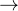  第二阶段，将文本token与图像token连接起来，训练一个自回归Transformer来模拟文本和图像token的联合分布
-   Scaling Autoregressive Models for Content-Rich Text-to-Image Generation
    摘要: 这篇论文介绍了Pathways Autoregressive Text-to-Image (Parti)模型，该模型能够生成高保真度的逼真图像，并支持内容丰富的合成，涉及复杂的组合和世界知识。Parti将文本到图像生成视为序列到序列的建模问题，使用图像标记序列作为目标输出

    方法: **Parti模型基于Transformer架构**，使用ViT-VQGAN图像分词器将图像编码为离散标记序列。通过扩大模型规模（高达20B参数），实现了一致的质量提升，MS-COCO上的零样本FID得分为7.23，微调后的FID得分为3.22

这三篇论文展示了在图像生成和视觉表示学习领域的最新进展，特别是在利用大规模数据集和模型规模来提高生成图像质量和多样性方面

### 4.4  微软的NÜWA：把视觉离散成token，且建立3D数据表示

2021年11月，微软和北大联合提出了NÜWA

-   其在预训练阶段，研究员使用了自回归模型作为预训练任务来训练 NÜWA，其中 VQ-GAN 编码器将图像和视频转换为相应的视觉标记，作为预训练数据的一部分
-   在推理阶段，VQ-GAN 解码器会基于预测的离散视觉标记重建图像或视频

#### 4.4.1 3D数据表示

为了涵盖所有的文本、图像和视频或其草图，我们将它们都视为token，并定义了一个统一的3D表示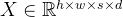，其中 h和 w分别表示空间轴(高度和宽度)上的token数量，s表示时间轴上的token数量，d是每个标记的token

// 待更

#### 4.4.2 三维稀疏注意力(3D Nearby Attention，3DNA)

NÜWA 还引入了三维稀疏注意力(3D Nearby Attention，3DNA)机制来应对 3D 数据的特性，可同时支持编码器和解码器的稀疏关注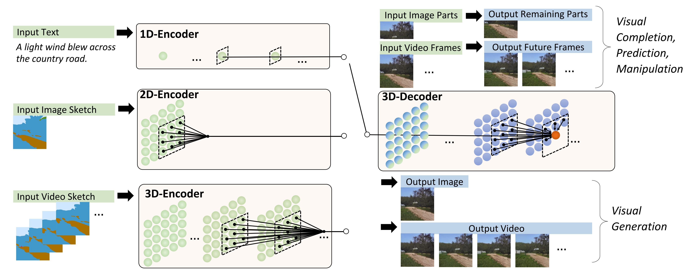

1.  也就是说，在生成特定图像的一部分或者一个视频帧时，NÜWA 不仅会看到已经生成的历史信息，还会关注与其条件所对应位置的信息，比如，在由视频草图生成视频的过程中，生成第二帧时，模型就会考虑第二帧草图对应的位置是什么，然后按照草图的变化生成满足草图变化的视频，这就是编码器和解码器的同时稀疏
2.  而此前的工作通常只是一维或二维的稀疏关注，而且只在编码器稀疏，或只在解码器稀疏。通过使用 3DNA 机制，NÜWA 的计算复杂度得到了简化，提升了计算效率

且为了支持文本、图片、视频这些多模态任务的创建，跨越不同领域数据的鸿沟，研究员采用了逐步训练的方式

1.  首先训练文本-图片任务和图片-视频任务
2.  待任务稳定后，再加入文本-视频的数据进行联合训练

而且研究员们还使用了视频完成任务，根据给定的部分视频作为输入生成后续视频，使得 NÜWA 拥有强大的零样本视觉内容生成与编辑能力，实现图像、视频内容的增、删、改操作，甚至可以对视频的未来帧进行可控调整。

### 4.5  Google imagen video 

​侧重提高视频分辨率，一作为提出DDPM且人称CV卷王的Jonathan Ho

// 待更

## 第五部分 Sora的从零复现

为避免本文篇幅过于长，且更为了把sora复现阐述的更为全面，故后把原本属于本文「第五部分 Sora的从零复现」的内容独立成文：[Sora缩略版的从零复现：Latte和Open-Sora 1.0背后对应的原理与代码剖析](https://blog.csdn.net/v_JULY_v/article/details/136845242 "Sora缩略版的从零复现：Latte和Open-Sora 1.0背后对应的原理与代码剖析")

更多则在该课里见：[视频生成Sora的原理与复现 [全面解析且从零复现sora缩略版]](https://www.julyedu.com/course/getDetail/502 "视频生成Sora的原理与复现 [全面解析且从零复现sora缩略版]")

## 后记

本文在写的过程中，越写越觉得Sora理论细节、工程细节都很多，很值得深挖，通过深挖Sora，不但能把「整个多模态技术体系的一半多」串起来，还能学着如何把各种技术改进、组合、改造，发挥出最佳效果

过程中，也偶尔会有朋友问：sora这类生成式模型有什么用，就只是为了生成个视频么？个人觉得，其用于在于学着人类去理解、认知、体会物理世界(这是目标，不代表已经完美做到了)

-   复杂点想，当将来一个会各种技能的机器人生活在现代社会之中时，它可以干的事情太多了，上学/上班等无所不能
-   简单点想，可以从“人类为何要学画画”的角度去理解

未来一个月、一个季度、一年之内，本文还会不断修订，24年3月底

## 参考文献与推荐阅读

1.  OpenAI sora的技术报告：[Video generation models as world simulators](https://openai.com/research/video-generation-models-as-world-simulators "Video generation models as world simulators")
2.  [我在模拟世界！OpenAI刚刚公布Sora技术细节：是数据驱动物理引擎](https://mp.weixin.qq.com/s/VfYX1xxYxprk42zzUVknfw "我在模拟世界！OpenAI刚刚公布Sora技术细节：是数据驱动物理引擎")
3.  [爆火Sora参数规模仅30亿？谢赛宁等大佬技术分析来了](https://mp.weixin.qq.com/s/ZpZJ9XpbH8QYarMbxXM6SQ "爆火Sora参数规模仅30亿？谢赛宁等大佬技术分析来了")
4.  [请教英伟达小哥哥，解读 Sora 真正的技术突破](https://weibo.com/ttarticle/p/show?id=2309405002454705242647&mark_id=999_reallog_mark_ad%3A999%7CWeiboADNatural "请教英伟达小哥哥，解读 Sora 真正的技术突破")
5.  [Sora 的一些个人思考](https://zhuanlan.zhihu.com/p/682430755 "Sora 的一些个人思考")(这篇文章有一些表述是错的，需注意辨别，如有冲突 以本文为准)
6.  [ViViT论文阅读](https://blog.csdn.net/qq_41533576/article/details/121678428 "ViViT论文阅读")、[ViViT: A Video Vision Transformer阅读和代码](https://zhuanlan.zhihu.com/p/506607332 "ViViT: A Video Vision Transformer阅读和代码")、[ICCV2021-《ViViT》-视频领域的纯Transformer方案](https://zhuanlan.zhihu.com/p/439021719 "ICCV2021-《ViViT》-视频领域的纯Transformer方案")
7.  [A Video Vision Transformer 用于视频数据特征提取的ViT详解](https://blog.csdn.net/lym823556031/article/details/127939000 "A Video Vision Transformer 用于视频数据特征提取的ViT详解")
8.  [专访 VideoPoet 作者：视频模型技术会收敛，LLM 将取代diffusion带来真正的视觉智能](https://hub.baai.ac.cn/view/34118 "专访 VideoPoet 作者：视频模型技术会收敛，LLM 将取代diffusion带来真正的视觉智能")
9.  sora的32个reference
10.  [Sora背后团队：应届博士带队，00后入列，还专门招了艺术生](https://mp.weixin.qq.com/s?__biz=MzIzNjc1NzUzMw==&mid=2247717240&idx=1&sn=3bb2b3beba68a804e799d97b61f722c2&chksm=e8df260adfa8af1c3334352ebc5a1be988f31dfca8531eb590f20c9253311fb93173452e03c2&mpshare=1&scene=23&srcid=0218MSTxoQB3Vwd7CIDFLrUb&sharer_shareinfo=d0add2ba71344db9ef740792118f1771&sharer_shareinfo_first=d0add2ba71344db9ef740792118f1771#rd "Sora背后团队：应届博士带队，00后入列，还专门招了艺术生")
11.  [揭秘Sora技术路线：核心成员来自伯克利，基础论文曾被CVPR拒稿](https://mp.weixin.qq.com/s?__biz=MzA3MzI4MjgzMw==&mid=2650907887&idx=1&sn=7391dba72d286a6ca9b958aa0627eafb&chksm=84e46091b393e9876b128d71f01436862d6e2496507ccc7641113506163492ee0678e0f88374&mpshare=1&scene=23&srcid=0219j8X1U8NNoh4MlbbBdOCR&sharer_shareinfo=8926f54124919a45c5e62049d3a092bb&sharer_shareinfo_first=8926f54124919a45c5e62049d3a092bb#rd "揭秘Sora技术路线：核心成员来自伯克利，基础论文曾被CVPR拒稿")
12.  [sora参考文献整理及AI论文工作流完善](https://blog.csdn.net/sinwingyeah/article/details/136144696 "sora参考文献整理及AI论文工作流完善")
13.  [一文看Sora技术推演](https://mp.weixin.qq.com/s/3RnrO7fSMizEl3mN3SXG5w "一文看Sora技术推演")、[一文带你了解OpenAI Sora](https://mp.weixin.qq.com/s?__biz=MjM5ODYwMjI2MA==&mid=2649782526&idx=1&sn=420ff38a80ff74684d556b77b275fe9f&chksm=becceb8589bb62930ada988238d86bc3569977687ce98f850258c49513316ff66409363c80e7&mpshare=1&scene=23&srcid=0220FpusmzIxZSxFZogn6iPG&sharer_shareinfo=24888e0de8a982ad2ba6781a500cd216&sharer_shareinfo_first=24888e0de8a982ad2ba6781a500cd216#rd "一文带你了解OpenAI Sora")
14.  [Sora的前世今生：从文生图到文生视频](https://mp.weixin.qq.com/s/dIAUwc33IZMid9gVB5uTJg "Sora的前世今生：从文生图到文生视频")
15.  [复刻Sora有多难？一张图带你读懂Sora的技术路径](https://zhuanlan.zhihu.com/p/682517156 "复刻Sora有多难？一张图带你读懂Sora的技术路径")、[Sora技术详解及影响分析](https://zhuanlan.zhihu.com/p/683004185 "Sora技术详解及影响分析")
16.  [为什么说 Sora 是世界的模拟器？](https://mp.weixin.qq.com/s?__biz=Mzg5ODg5MTEyMg==&mid=2247485276&idx=1&sn=f63b03b14998b472dc183b2be02c711d&chksm=c05aeb41f72d6257313881604b68edb5cb605bea529d6406109955bf204dc0697a6d29c43e5c&mpshare=1&scene=23&srcid=0219L1Qtl2nh0KNjkPt7scSA&sharer_shareinfo=a5ce72376c54f1a98dfbaa3dd6ffadbc&sharer_shareinfo_first=e1cb19c9681d6b480d443b65e6ef73ba#rd "为什么说 Sora 是世界的模拟器？")、[Sora能作为物理世界模拟器吗](https://weibo.com/ttarticle/p/show?id=2309405005949600661553 "Sora能作为物理世界模拟器吗")
17.  [国内公司有望做出Sora吗？这支清华系大模型团队给出了希望](https://mp.weixin.qq.com/s/WhDwfOcSUPQAl6fAFdRVQw "国内公司有望做出Sora吗？这支清华系大模型团队给出了希望")
18.  [清华系多模态大模型公司刚刚融了数亿元！放话“今年达到Sora效果”](#rd)
19.  [国内高校打造类Sora模型VDT，通用视频扩散Transformer被ICLR 2024接收](https://mp.weixin.qq.com/s?__biz=MzA3MzI4MjgzMw==&mid=2650908456&idx=5&sn=f92401a95287a451f3ee99498a082d3e&chksm=84e46356b393ea40031364c9ad2b3f460d25f25d6264142abc746236dfcf7fab3def12af478f&mpshare=1&scene=23&srcid=0224WlgWMv9jR0BTTp9gUcCv&sharer_shareinfo=cee0a643e3cf533092988e6ee9333049&sharer_shareinfo_first=cee0a643e3cf533092988e6ee9333049#rd "国内高校打造类Sora模型VDT，通用视频扩散Transformer被ICLR 2024接收")
20.  [人大系初创与OpenAI三次“撞车”：类Sora架构一年前已发论文](https://mp.weixin.qq.com/s/oXAx-b0ci7R8WHOYsf10gg "人大系初创与OpenAI三次“撞车”：类Sora架构一年前已发论文")
21.  [我院师生论文被国际学术会议ICLR 2024录用](http://ai.ruc.edu.cn/newslist/newsdetail/20240130001.html "我院师生论文被国际学术会议ICLR 2024录用")
22.  [人大卢志武：只要拿到更多算力，超过Sora也不是那么难的事](https://mp.weixin.qq.com/s?__biz=MzIzNjc1NzUzMw==&mid=2247727620&idx=2&sn=5ecdf9810e29d729f579aaaf7178ae21&chksm=e8dfcd76dfa84460665053f1304efa9ce21a626d7b431e195997afca800416261a28d2488078&token=299958459&lang=zh_CN&poc_token=HOUhM2ajvKz10F6Cx_u5q2HSi0vBpXFum9l4SCeX "人大卢志武：只要拿到更多算力，超过Sora也不是那么难的事")
23.  [万字长文解构中国如何复刻 Sora：模型架构、参数规模、数据规模、训练成本](https://mp.weixin.qq.com/s?__biz=Mzg5ODg5MTEyMg==&mid=2247485338&idx=1&sn=07843331a33ded9cafb3c075ec631435&chksm=c05aeb87f72d62912e4120c44658a27a855287cb116e7d2b6cb48fb35924588796f3f8764f21&mpshare=1&scene=23&srcid=0229iVdtAeX4qHdaRZHhfyYU&sharer_shareinfo=ba56b30fc1ee31f029039012538c19be&sharer_shareinfo_first=02b9422b7e64581333c919969cbb5074#rd "万字长文解构中国如何复刻 Sora：模型架构、参数规模、数据规模、训练成本")
24.  [Sora: A Review on Background, Technology, Limitations, and Opportunities of Large Vision Models](https://arxiv.org/abs/2402.17177 "Sora: A Review on Background, Technology, Limitations, and Opportunities of Large Vision Models")
     [中国如何复刻Sora，华人团队长文解构！996 OpenAI研究员：Sora是视频GPT-2时刻](https://mp.weixin.qq.com/s?__biz=MzI3MTA0MTk1MA==&mid=2652448850&idx=1&sn=d68ba6d0389a03e2f53106651343228e&chksm=f12a5ca3c65dd5b551805931423486d306d42dbeda967039332174325358cd3bc66344519de4&mpshare=1&scene=23&srcid=0229iyvSpyn8J2R4j5xbvFxa&sharer_shareinfo=60d3f653e7252eabe336a95a792d4a31&sharer_shareinfo_first=60d3f653e7252eabe336a95a792d4a31#rd "中国如何复刻Sora，华人团队长文解构！996 OpenAI研究员：Sora是视频GPT-2时刻")
     [微软37页论文逆向工程Sora，得到了哪些结论？](https://mp.weixin.qq.com/s?__biz=MzA3MzI4MjgzMw==&mid=2650909083&idx=3&sn=1b6e34c8aa5bd420c5596d76b9a5f179&chksm=84e46de5b393e4f3c7ce332a43e50fc5258387dba88961c4f0f6573829eea9a61f8216b05b9f&mpshare=1&scene=23&srcid=0301W7tij9N8SCuBFb4urZr9&sharer_shareinfo=1f410b04914a523c457b54cf6a602f3d&sharer_shareinfo_first=1f410b04914a523c457b54cf6a602f3d#rd "微软37页论文逆向工程Sora，得到了哪些结论？")
25.  [微软亚洲研究院多模态模型NÜWA：以自然语言创造视觉内容](https://www.msra.cn/zh-cn/news/features/nuwa "微软亚洲研究院多模态模型NÜWA：以自然语言创造视觉内容")
26.  [关于Imagen Video的理解](https://zhuanlan.zhihu.com/p/573407864 "关于Imagen Video的理解")
27.  张俊林，[技术神秘化的去魅：Sora关键技术逆向工程图解](https://zhuanlan.zhihu.com/p/687928845 "技术神秘化的去魅：Sora关键技术逆向工程图解")
28.  [OpenAI Sora 团队专访：技术细节、后续功能开发排期](https://mp.weixin.qq.com/s/HVBLP-a2palZPnEzIw8nUA "OpenAI Sora 团队专访：技术细节、后续功能开发排期")
29.  [没等来OpenAI，等来了Open-Sora全面开源](https://mp.weixin.qq.com/s/vdr1WBCQVr9aS6bJYcdlRA "没等来OpenAI，等来了Open-Sora全面开源")
30.  [Open-Sora v1 Report](https://github.com/hpcaitech/Open-Sora/blob/main/docs/report_v1.md "Open-Sora v1 Report")
31.  [Latte：一个类似Sora的开源视频生成项目](https://juejin.cn/post/7341340317659037705 "Latte：一个类似Sora的开源视频生成项目")
     [上海人工智能研究院推出Latte，开源版视频Diffusion Transformer来了吗？](https://zhuanlan.zhihu.com/p/684072926 "上海人工智能研究院推出Latte，开源版视频Diffusion Transformer来了吗？")
     [[Minisora][Note] Sora同源技术Latte笔记-Latent Diffusion Transformer for Video Generation](https://zhuanlan.zhihu.com/p/686407292 "[Minisora][Note] Sora同源技术Latte笔记-Latent Diffusion Transformer for Video Generation")
32.  [颠覆性的Sora技术能从哪些方面助力自动驾驶系统开发？](https://mp.weixin.qq.com/s/dynSg4b6wCXu5VevZRn0jQ "颠覆性的Sora技术能从哪些方面助力自动驾驶系统开发？")
33.  还有一堆参考和原始论文，由于在上述正文中都已经贴上了对应的link，便没再重复贴至此了..
34.  [视频生成Sora的原理与复现 [全面解析且从零复现sora缩略版]](https://www.julyedu.com/course/getDetail/502 "视频生成Sora的原理与复现 [全面解析且从零复现sora缩略版]")

## 本文的创作、修订、完善记录

熟悉我文章的人都知道，一篇文章最开始发布的时候一般只能称之为0.1版，随后一两周内会做大量补充、修订、完善从而成为第1版，而后续则可能继续陆陆续续的修订成为第2版、第3版..

1.  24年2.20，全面修订到0.3版
    补充完善2.1节中对ViViT的介绍
    并修正1.1节中不准确的描述
    补充完善2.5节W.A.L.T：将Transformer用于扩散模型
    以及补充了2.4节「MAGVIT v2：用好tokenizer可以超越diffusion」的内容
2.  2.21，修订到0.6版，具体修订点包括
    修正1.1节中一个明显的表述错误
    即sora训练中，视频去噪是一次性去噪的，非去噪几帧，再以“已去噪的几帧”去预测接下来的几帧
    增补“2.1.2 4种Video模型下的时空两个维度的注意力计算”中相关的内容
3.  2.22，修订此节“1.1.2 如何理解所谓的时空编码(含其好处)”中的部分细节，为0.8版
    补充此节的内容：2.2.2 Diffusion Transformer(DiT)的3个不同的条件策略
4.  2.23，修订此节“1.2.2 类似Google的W.A.L.T工作：引入auto regressive进行视频扩展”的内容
    修订此节“2.1 ViT在视频上的应用：视频Transformer之ViViT”的内容
    补上了此节“2.1.2.2 Model 2：factorised encoder”所对应的示例代码

    是为0.9版
5.  2.24，为此节“2.1.2 Model 2及其示例代码：factorised encoder”的代码加上注释和完整的数据示例
    是为第1.0版了
6.  2.26，新增一节的内容，即：2.2.3 扩展：DiT之相似架构U-ViT，
    并纠正文中部分不够精准的描述
    是为1.2版
7.  2.27，随着对sora的不断深挖，再次新增一节的内容，即2.3 VDT：基于扩散的视频生成中首次使用Transformer(但没带文本条件融合)
    且加上sora官方博客中的这句话：Similar to DALL·E 3, we also leverage GPT to turn short user prompts into longer detailed captions that are sent to the video model
    是为1.4版
8.  2.28，丰富对2.3节的内容，且精准化一系列相关标题，是为1.5版
9.  2.29，补充对“2.5 MAGVIT v2：用好tokenizer可以超越diffusion”一节的一个介绍
    且补充下面这一段话
    而当把一帧帧图片打上全部马赛克之后，可以根据”文本-视频数据集”中对视频的描述/prompt(*注，该描述/prompt不仅仅只是通过CLIP去与视频对齐，还经过类似DALLE 3所用的重字幕技术加强 + GPT4对字幕的进一步丰富，下节详述*)，而有条件的去噪

    是为1.6版
10.  3.1，修订此节的内容：2.4 NaViT：多个patches打包成一个单一序列以实现可变分辨率
     是为1.7版
11.  3.6，补充相关的参考文献且增加此节：
     2.1 VideoGPT: 借鉴DALLE第一代自回归预测视频

     是为1.9版
12.  3.10，增加：第四部分 扩展：sora缩略版的复现
     完善此节的内容：3.4  微软的NÜWA：把视觉离散成token，且建立3D数据表示
     且加了下面这段话
     顺带提一嘴，Google Research下的Brain Team在2023年1月份发布的这篇论文《Simple diffusion: End-to-end diffusion for high resolution images》中，也提出了类似U-ViT的架构

     是为2.0版
13.  3.18，增加新一节：4.2 Colossal-AI团队推出基于STDiT架构的类Sora模型Open-Sora 1.0
     是为2.1版
14.  3.19，再新增一节：4.1 上海人工智能实验室一团队推出Latte
     重点完善：4.1.1 整体流程：输入、主干网络(Latte的4种变体)、输出
     是为2.2版

     再之后，把整个第四部分独立成文，是为2.3版
15.  3.20，新增一节：2.3.4 比DiT更晚之又一个U-ViT的工作：Google Research提出Simple diffusion
     是为2.4版
16.  3.21，基于张俊林对sora的解读，引用其部分内容，且全面修订本文相关细节
     是为2.8版
17.  3.22，重点根据TECO论文，修订此节的内容
     2.2.4 离散Latent的另一种实现思路：VQ-GAN之TECO
     是为2.9版
18.  3.23，独立开辟新的一节以介绍FDM
     2.3.3 FDM：Flexible Diffusion Modeling of Long Videos(22年5月)
     是为第3版
19.  5.2，润色关于VDT、DiT等部分的内容

本文章已经生成可运行项目

    

显示推荐内容


确定要放弃本次机会？

福利倒计时

*:* *:*

 立减 ¥

普通VIP年卡可用

[立即使用](https://mall.csdn.net/vip)

 [ v\_JULY\_v](https://blog.csdn.net/v_JULY_v)

-         235

-     

    踩

-      [   654](javascript:;)

-    [ 36](#commentBox)

-    [ 分享](javascript:;)

    分享到 QQ

    分享到新浪微博

    扫一扫

-    [ 打赏](javascript:;)

    打赏

-   

      打赏 举报

      举报

专栏目录

36 条评论 您还未登录，请先 登录 后发表或查看评论

[

...*DiT*、*VDT*、*NaViT*等_*vivit*的*时空编码**与**dit*的*扩散*_*dit*在残差结束之前...

](https://blog.csdn.net/abcd51685168/article/details/140309959)

4-25

[

*视频生成**Sora*的全面*解析**:*从*AI**绘画*、*ViT*到*ViViT*、*TECO*、*DiT*、*VDT*、*NaViT*等_*vivit*的*时空编码**与**dit*的*扩散* 前言 真没想到,距离*视频生成*上一轮的集中爆发(详见《*Sora*之前的*视频生成*发展史*:*从Gen2、Emu Video到PixelDance、SVD、Pika 1.0》)才过去三个月,没想*OpenAI*一出手,该领域又直接变天了 自打2.16日*OpenAI*发布*sora*以...

](https://blog.csdn.net/abcd51685168/article/details/140309959)

[

*视频生成**Sora*的全面*解析**:*从*AI**绘画*、*ViT*到*ViViT*、*TECO*、*DiT*、*VDT*、*NaViT*...

](https://blog.csdn.net/abcd51685168/article/details/139536693)

3-28

[

总之,看本文之前,如果你人云亦云的来一句*:**sora*就是*DiT*架构,我表示理解。但看完全文后你会发现 如果只允许用10个字定义*sora*的模型结构,则可以是*:*潜在*扩散*架构下的Video *Transformer* 如果允许25个字以内,则是*:*带文本条件融合且时空注意力并行计算的Video Diffusion *Transformer* ...

](https://blog.csdn.net/abcd51685168/article/details/139536693)

[

【论文阅读】Patch n‘ Pack*:* *NaViT*, a Vision *Transformer* for any Aspect Ratio and Resolution

](https://blog.csdn.net/qq_42266272/article/details/136433370)

[kanon的博客](https://blog.csdn.net/qq_42266272)

03-03  5797

[

此前的模型将图像大小调整为固定分辨率明显是一个次优的选择。然而，诸如 Vision *Transformer* (*ViT*) [1]之类的模型提供了灵活的基于序列的建模，因此可以改变输入序列长度。支撑*Vit*的操作很简单：将图像拆分为多个补丁，每个补丁都线性投影到一个token上。通常，输入图像的大小会调整为固定的正方形纵横比，然后拆分为固定数量的patches。

](https://blog.csdn.net/qq_42266272/article/details/136433370)

[

【*技术**解析*】*NaViT*：突破传统限制，实现任意分辨率*与*宽高比的视觉*Transformer*

最新发布

](https://blog.csdn.net/weixin_29091445/article/details/158634706)

[weixin_29091445的博客](https://blog.csdn.net/weixin_29091445)

03-04  112

[

本文深入*解析*了*NaViT*（Native Resolution *ViT*）模型如何通过创新的Patch n‘ Pack*技术*，突破传统Vision *Transformer*固定输入尺寸的限制。该模型能原生处理任意分辨率*与*宽高比的图像，避免了信息失真*与*计算浪费。其核心机制包括掩码自注意力、因式分解位置编码及分辨率采样，在显著提升训练效率*与*模型性能的同时，为下游视觉任务提供了更灵活的解决方案。

](https://blog.csdn.net/weixin_29091445/article/details/158634706)

[

万字长文解读深度学习——*ViT*、ViLT、*DiT*

](https://lichuachua.blog.csdn.net/article/details/142899935)

[分享包括但不限于计算机基础知识、数据结构与算法、Golang技术栈。年与时驰，意与日去，遂成枯落，多不接世，悲守穷庐，将复何及！](https://blog.csdn.net/qq_42410605)

11-10  5420

[

面试资料收集者之万字长文解读深度学习——*ViT*、ViLT、*DiT*

](https://lichuachua.blog.csdn.net/article/details/142899935)

[

*DiT*解读：当Diffusion遇上*Transformer*

](https://blog.csdn.net/lijj0304/article/details/137997115)

[JJ-Li的博客](https://blog.csdn.net/lijj0304)

04-20  5979

[

*DiT*论文解读，Diffusion结合*Transformer*，前置知识讲解，*sora**技术*猜测

](https://blog.csdn.net/lijj0304/article/details/137997115)

[

Diffusion *Transformer*(*DiT*)——将*扩散*过程中的U-Net换成*ViT*：近频繁用于*视频生成**与*机器人动作预测(含清华Prediction with Action详解)

热门推荐

](https://devpress.csdn.net/v1/article/detail/144797429)

[结构之法 算法之道](https://blog.csdn.net/v_JULY_v)

12-29  2万+

[

本文最开始属于此文《*视频生成**Sora*的全面*解析*：从*AI**绘画*、*ViT*到*ViViT*、*TECO*、*DiT*、*VDT*、*NaViT*等》但考虑到*DiT*除了广泛应用于*视频生成*领域中，在机器人动作预测也被运用的越来越多，加之*DiT*确实是一个比较大的创新，影响力大，故独立成本文在*ViT*之前，图像领域基本是CNN的天下，包括*扩散*过程中的噪声估计器所用的U-net也是卷积架构，但随着*ViT*的横空出世，人们自然而然开始考虑这个噪声估计器可否用*Transformer*架构来代替2022年12月，William Peebles(

](https://devpress.csdn.net/v1/article/detail/144797429)

[

*NaViT*：Vision *Transformer*的灵活分辨率*与*高效训练新范式

](https://devpress.csdn.net/v1/article/detail/147308009)

[阿正的梦工坊](https://blog.csdn.net/shizheng_Li)

04-17  2181

[

《Patch n' Pack*:* *NaViT*, a Vision *Transformer* for any Aspect Ratio and Resolution》

](https://devpress.csdn.net/v1/article/detail/147308009)

[

*视频生成* *Sora* 的全面*解析*：从 *AI* *绘画*、*ViT* 到 *ViViT*、*TECO*、*DiT*、*VDT*、*NaViT* 等

](https://zttlmq.blog.csdn.net/article/details/144672251)

[小蜗牛的珍贵百宝箱](https://blog.csdn.net/qq_42978535)

04-28  1498

[

传统的*视频生成**技术*大多依赖于递归神经网络（RNN）或生成对抗网络（GAN），而近年来，基于视觉 *Transformer*（*ViT*）和其变体的模型开始在此领域占据主导地位。*Sora* 是一个结合了这些先进*技术*的*视频生成*框架，通过集成 *ViT*、*ViViT*、*TECO*、*DiT*、*VDT* 和 *NaViT* 等多个强大模型，为*视频生成*任务提供了创新的解决方案。*VDT* 结合了*扩散*模型和 *Transformer* 结构，通过对视频序列进行逐帧建模，捕捉空间和时间上的特征，从而生成高质量的视频。

](https://zttlmq.blog.csdn.net/article/details/144672251)

[

*视频生成*模型*Sora*的全面*解析*：从*AI**绘画*、*ViT*到*ViViT*、*DiT*、*VDT*、*NaViT*、*VideoPoet*

](https://blog.csdn.net/starzhou/article/details/136454573)

[周红伟讲AI](https://blog.csdn.net/starzhou)

03-04  3003

[

*sora**技术*原理

](https://blog.csdn.net/starzhou/article/details/136454573)

[

人工智能大模型实战应用：从理论到落地的关键*技术**解析*

](https://download.csdn.net/download/ztt123654/91128188)

06-24

[

人工智能大模型实战应用 人工智能大模型正在深刻改变*技术*应用的格局，从自然语言处理到计算机视觉，大模型展现出前所未有的能力。本文将深入探讨大模型的实战应用，帮助开发者理解其核心原理、应用场景及优化策略。 ...

](https://download.csdn.net/download/ztt123654/91128188)

[

*Sora**技术**解析*：从Patch到Diffusion的完整*技术*栈图解（含开源替代方案）

](https://blog.csdn.net/mm9012/article/details/154413793)

[mm9012的博客](https://blog.csdn.net/mm9012)

02-20  913

[

本文深入*解析*了*OpenAI*的*Sora*文生视频模型*技术*栈，从时空图像块编码到Diffusion *Transformer*架构，详细图解了*视频生成*的核心*技术*。同时提供了基于Stable Video Diffusion的开源替代方案和优化指南，帮助开发者实现高质量*视频生成*。

](https://blog.csdn.net/mm9012/article/details/154413793)

[

Vision *Transformer*论文理解

](https://blog.csdn.net/weixin_49327481/article/details/129436932)

[weixin_49327481的博客](https://blog.csdn.net/weixin_49327481)

03-10  580

[

多模态蓬勃的开始，*Transformer*对视觉领域的开山。

](https://blog.csdn.net/weixin_49327481/article/details/129436932)

[

*ViT**与**DiT*：*Transformer*视觉*技术*

](https://devpress.csdn.net/v1/article/detail/151961994)

[qq_20098693的博客](https://blog.csdn.net/qq_20098693)

09-22  1051

[

x_p^NE] + E_{pos} $$*DiT*的去噪过程： 在*扩散*步 𝑡t，噪声预测网络 𝜖𝜃ϵθ 参数化为*Transformer*： $$ \\epsilon_\\theta(x_t, t, c) = \\text{*DiT*\-block}(x_t + c_{temb}, c_{cond}) $$ 其中 𝑐𝑡𝑒𝑚𝑏ctemb 是时间步embedding，𝑐𝑐𝑜𝑛𝑑ccond 是条件信息。*扩散*过程逐步细化生成结果，配合*Transformer*的全局建模能力，能产生细节丰富且结构合理的样本。

](https://devpress.csdn.net/v1/article/detail/151961994)

[

*ViViT*论文阅读

](https://blog.csdn.net/qq_41533576/article/details/121678428)

[qq_41533576](https://blog.csdn.net/qq_41533576)

12-10  9247

[

论文：*ViViT**:* A Video Vision *Transformer* 论文地址：*ViViT**:* A Video Vision *Transformer*

](https://blog.csdn.net/qq_41533576/article/details/121678428)

[

*OpenAI* *Sora* —— 文生视频为何如此逼真？*AI*算法架构*解析*

](https://blog.csdn.net/sinat_19383265/article/details/136157448)

[初心不忘产学研的博客](https://blog.csdn.net/sinat_19383265)

02-19  3726

[

*OpenAI*于2024年2月16日发布了名为*Sora*的文生视频模型。*Sora*是一个革命性的*视频生成*模型，可以根据用户输入的简单文本脚本自动生成*与*好莱坞级别画面相媲美的视频内容，其生成的视频不仅仅是对已有素材的拼接或剪辑合成，而是从像素级别全新“绘制”出来的。该模型能够理解文本描述并基于此创造性地生成视频，展现出令人惊叹的细节处理能力，例如在示例中描述的“两只战船在一杯咖啡里混战”的场景中，*Sora*成功地模拟了液体、浮沫、水流和浪花等效果，并且细致到可以为船只添加海盗旗和国旗以表达故事中的正邪对抗元素。

](https://blog.csdn.net/sinat_19383265/article/details/136157448)

[

一文彻底搞懂深度学习-*Transformer*架构（*ViT* + *DiT*）（动图讲解），零基础小白收藏这一篇就够了！！

](https://devpress.csdn.net/v1/article/detail/151795199)

[Gaga246的博客](https://blog.csdn.net/Gaga246)

09-17  1465

[

想象你在欣赏一首交响乐。你不会只关注某一个乐器的声音，而是会感受整体的和谐——小提琴的悠扬、大提琴的深沉、长笛的清脆，它们相互呼应，共同编织出动人的旋律。 *Transformer*就是深度学习中的"指挥家"，它让每个"音符"（token）都能倾听并回应序列中所有其他"音符"的声音，创造出前所未有的表达能力。 从自然语言处理起步，*Transformer*已经征服了计算机视觉（*ViT*）和图像生成（*DiT*）领域，成为*AI*时代最重要的架构创新。

](https://devpress.csdn.net/v1/article/detail/151795199)

[

【Datawhale组队学习：*Sora*原理*与**技术*实战】*Transformer*s+diffusion

](https://blog.csdn.net/yichao_ding/article/details/136495043)

[JeffDing](https://blog.csdn.net/yichao_ding)

03-06  1884

[

近期大火的*OpenAI*推出的*Sora*模型，其核心*技术*点之一，是将视觉数据转化为Patch的统一表示形式，并通过*Transformer*s*技术*和*扩散*模型结合，展现了卓越的scale特性。被Twitter上广泛传播的论文《Scalable diffusion models with *transformer*s》也被认为是*Sora**技术**背后*的重要基础。而这项研究的发布遇到了一些坎坷，曾经被CVPR2023拒稿过。

](https://blog.csdn.net/yichao_ding/article/details/136495043)

[

一文详解*DiT*模型

](https://blog.csdn.net/A1233242/article/details/149250857)

[A1233242的博客](https://blog.csdn.net/A1233242)

07-10  4062

[

*DiT*模型将*扩散*模型（DDPM）的U-Net替换为*Transformer*架构，显著提升图像生成质量。*DiT*通过结合VAE编码器和*Transformer*，在潜在空间实现高效*扩散*过程，支持多模态条件融合（如时间步和类别标签。实验表明，*DiT*具备强扩展性，增大参数量或数据质量可稳步提升生成性能。

](https://blog.csdn.net/A1233242/article/details/149250857)

[

Luma *AI* Dream Machine*视频生成*模型*技术**解析*：基于*DiT*架构的文生视频*与*图生视频实现

](https://wenku.csdn.net/doc/6ifkcyrg3f)

[

Luma *AI**视频生成**技术*是当前人工智能生成内容（*AI*GC）领域最具突破性的前沿实践之一，其核心载体为Dream Machine模型，该模型不仅代表了*AI**视频生成*从实验性研究向工业化应用的关键跃迁，更在*技术*架构、生成质量、跨...
