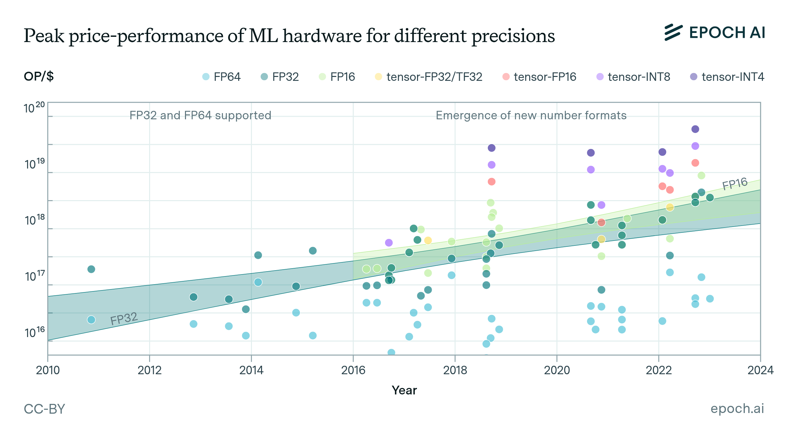
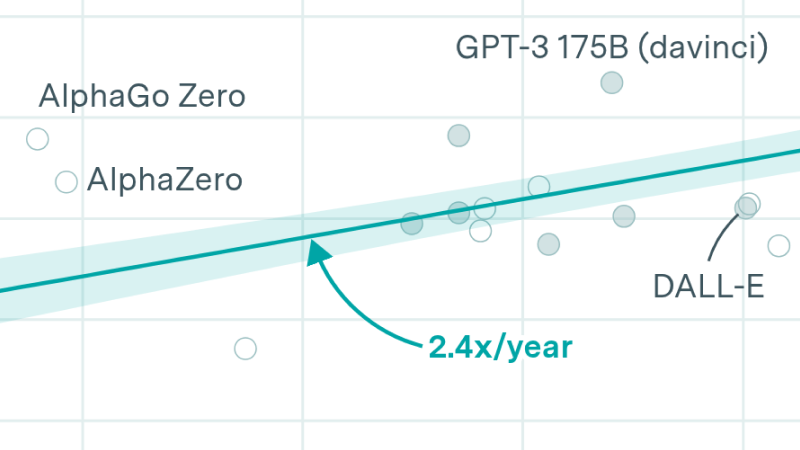
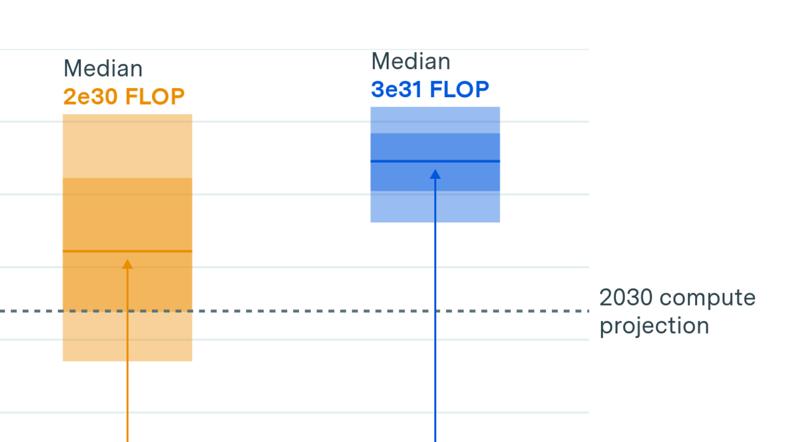

# Data on Machine Learning Hardware

> 原文链接: https://epoch.ai/data/machine-learning-hardware#explore-the-data

---

Updated Apr. 24, 2026

## Machine Learning Hardware

We present key data on over 170 AI accelerators, such as graphics processing units (GPUs) and tensor processing units (TPUs), used to develop and deploy machine learning models in the deep learning era.

[Download this data](/data/ml_hardware.zip)

Machine Learning Hardware

Machine learning performance (TOP/s)

160 Results

Release date

Circles sized by

Customize graph

2007

2007

2027

2027

[CC-BY](https://creativecommons.org/licenses/by/4.0/)

### Graph settings

Y Axis

Machine learning performance (TOP/s)

Machine learning performance (TOP/s)

Performance at FP32 (TFLOP/s)

Performance at FP16 (TFLOP/s)

Performance at tensor-FP32 (TFLOP/s)

Performance at tensor-FP16 (TFLOP/s)

Performance at INT8 (TFLOP/s)

Performance density (OP/s/mm²)

Power draw (W)

Die size (mm²)

Transistors (million)

Release price (USD)

Release price (2024 USD)

Memory bandwidth (GB/s)

Energy efficiency (GFLOP/J)

X Axis

Release date

Release date

Machine learning performance (TOP/s)

Performance at FP32 (TFLOP/s)

Performance at FP16 (TFLOP/s)

Performance at tensor-FP32 (TFLOP/s)

Performance at tensor-FP16 (TFLOP/s)

Performance at INT8 (TFLOP/s)

Performance density (OP/s/mm²)

Power draw (W)

Die size (mm²)

Transistors (million)

Release price (USD)

Release price (2024 USD)

Memory bandwidth (GB/s)

Energy efficiency (GFLOP/J)

Filter by name

Group by

Type

Manufacturer

Process size (nm)

Power draw (W)

Die size (mm²)

Transistors (million)

Categorize by size

Power draw (W)

Die size (mm²)

Filter to leading ML hardware

Customize map

### Map settings

**Settings**

X Axis

Y Axis

## Filter

Leading ML hardware

## Display

Color by

Size data by

### More about this dataset

### Documentation

To identify ML hardware, we annotated chips used for ML training in our database of [Notable AI Models](https://epoch.ai/data/ai-models). We additionally added ML hardware that has not been documented in training those systems, but is clearly manufactured for ML - based on its description, supported numerical formats, or belonging to the same family as other ML hardware.

We use hardware datasheets, documented for each chip in the dataset, to fill in key information such as computing performance, die size, etc. Not all information is available, or even applicable, for all hardware, so columns are often left empty. We additionally use other sources, such as news coverage or hardware price archives, to fill in the price on release.

[Read the complete documentation](/data/machine-learning-hardware-documentation)

### Frequently asked questions

## Which processors count as machine learning hardware?

GPUs and TPUs are identified as machine learning hardware if they are used to train a [notable ML model](https://epoch.ai/data/ai-models), or are offered on a rental basis for ML workloads by major cloud compute providers. CPUs are not included in this dataset.

## What do number formats like FP32, BF16, and INT8 mean?

Numerical values used in computing are represented in several different formats, and these formats vary in the number of bits (0s or 1s) required to represent one number. Higher-bit formats are more precise, but require more storage and more compute to process, and AI developers have been moving to lower-precision formats over time using new hardware optimized for those formats (more details [here](https://epoch.ai/blog/trends-in-machine-learning-hardware#number-representations)).

Commonly used formats include FP64, FP32/TF32, BF16, and INT8:

-   FP64 is a 64-bit floating-point format, also known as double-precision floating-point. It typically consists of 1 sign bit, 11 exponent bits, and 52 mantissa (or significand) bits.
-   FP32 is a 32-bit floating-point format that is commonly used in computing. TF32 is an NVIDIA variant of FP32, used primarily in AI and ML applications, truncated to 19 bits for faster computation while maintaining adequate precision for deep learning.
-   BF16 is a 16-bit floating-point format designed for AI and machine learning applications. It uses 1 sign bit, 8 exponent bits (like FP32), 7 mantissa bits, and offers about 3 decimal digits of precision. Despite its reduced precision, BF16 retains the same range as FP32 due to the same number of exponent bits. It is widely used in AI/ML for training and inference, particularly in neural networks, where high precision in the mantissa is less critical. In this page we group together BF16 and NVIDIA tensor operations at FP16 precision as “tensor-FP16”.
-   INT8 is an 8-bit integer format. It represents values in a fixed range, typically -128 to 127 for signed integers or 0 to 255 for unsigned integers. It’s used in AI/ML for quantizing neural networks, reducing model size, and speeding up inference by lowering the precision of weights and activations.

## How is the data licensed?

Epoch AI’s data is free to use, distribute, and reproduce provided the source and authors are credited under the [Creative Commons Attribution license](https://creativecommons.org/licenses/by/4.0/). Complete citations can be found [here](#use-this-work).

## How can I access this data?

[Download the data in CSV format.](#download-this-data)
[Explore the data](#explore-the-data) using our interactive tools.
View the data directly in a [table format](?view=table#explore-the-data).

## Who can I contact with questions or comments about the data?

Feedback can be directed to the data team at [data@epoch.ai](mailto:data@epoch.ai).

### Downloads

Machine Learning Hardware

CSV, Updated Apr. 24, 2026

### Citations

Epoch AI’s data is free to use, distribute, and reproduce provided the source and authors are credited under the [Creative Commons Attribution license](https://creativecommons.org/licenses/by/4.0/).

### Citation

Epoch AI, 'Data on Machine Learning Hardware'. Published online at epoch.ai. Retrieved from 'https://epoch.ai/data/machine-learning-hardware' \[online resource]. Accessed 26 Apr 2026.

### BibTeX Citation

@misc{EpochMachineLearningHardware2024, title = {Data on Machine Learning Hardware}, author = {{Epoch AI}}, year = {2026}, month = {4}, url = {https://epoch.ai/data/machine-learning-hardware}, note = {Accessed: 26 Apr 2026} }

## Related work

[See all our publications](/blog)

Trends in machine learning hardware

How much does it cost to train frontier AI models?

Can AI scaling continue through 2030?

## Feedback

Have a question? Noticed something wrong? Let us know.

We value your privacy

Our website uses cookies to enhance your browsing experience and analyze site traffic. By clicking “Accept All,” you consent to our use of cookies as described in our [Privacy Policy](/privacy) and [Cookie Policy.](/cookies) If you wish to withdraw your consent, you can contact us at [ops@epoch.ai](mailto:ops@epoch.ai).

## Machine Learning Hardware

We present key data on over 170 AI accelerators, such as graphics processing units (GPUs) and tensor processing units (TPUs), used to develop and deploy machine learning models in the deep learning era.
