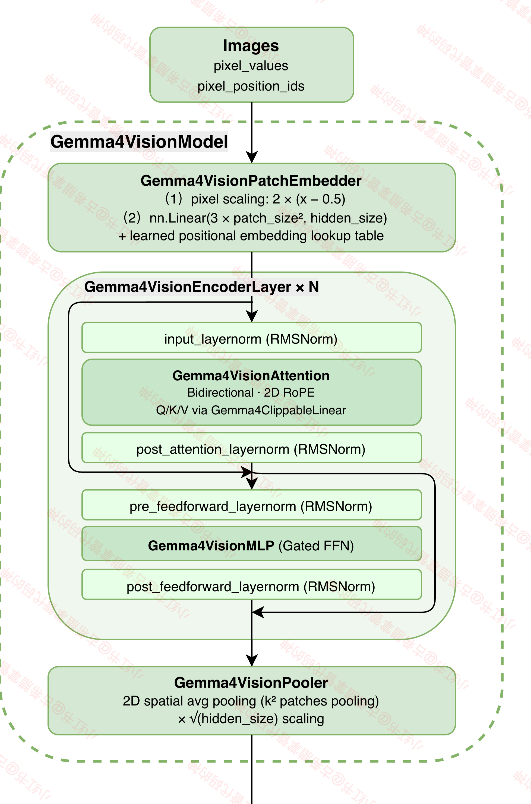
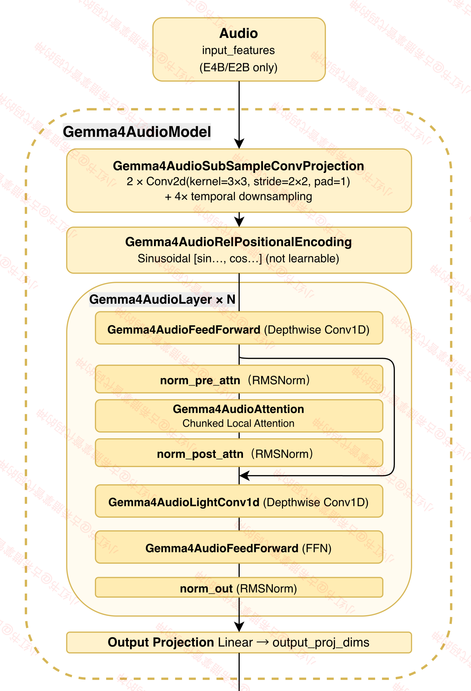
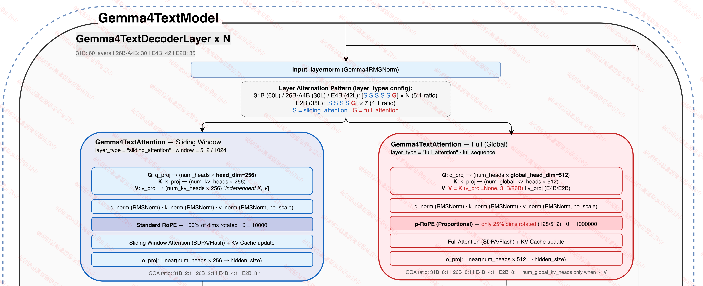
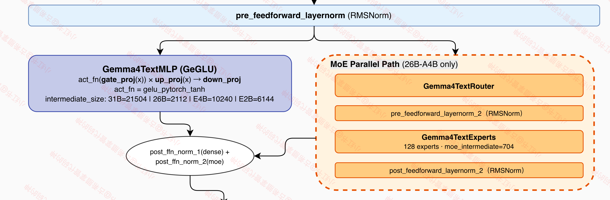

# Gemma 4

> 原文链接: https://scnajei2ds6y.feishu.cn/wiki/AuzLwXbwNiw5WTkXlMJcQmtZnRD
> Source: lark-hirono (authenticated Feishu API)

---

> 📌
> 模型仓库：[google/gemma-4](https://huggingface.co/collections/google/gemma-4)
>
> Launch Blog：[《Welcome Gemma 4: Frontier multimodal intelligence on device》](https://huggingface.co/blog/gemma4)
>
> 代码仓库：[google-gemma](https://github.com/google-gemma)

## 模型总览：四个规格差异化设计

Gemma 4 包括四个模型：**服务端模型**（31B、26B-A4B）和**端侧模型**（E4B、E2B，均有Audio Encoder）：


| 配置项 | 31B (Dense) | 26B-A4B (MoE) | E4B (Dense) | E2B (Dense) |
| --- | --- | --- | --- | --- |
| **hidden_size** | 5376 | 2816 | 2560 | 1536 |
| **num_layers** | 60 | 30 | 42 | 35 |
| **num_attention_heads** | 32 | 16 | 8 | 8 |
| **num_kv_heads (Sliding)** | 16 | 8 | 2 | 1 |
| **num_kv_heads (Global)** | 4 | 2 | 2 | 1 |
| **head_dim (Sliding)** | 256 | 256 | 256 | 256 |
| **head_dim (Global)** | 512 | 512 | 512 | 512 |
| **GQA 比率 (Sliding)** | 2:1 | 2:1 | 4:1 | 8:1 |
| **GQA 比率 (Global)** | 8:1 | 8:1 | 4:1 | 8:1 |
| **intermediate_size** | 21504 | 2112 (Dense) | 10240 | 6144 |
| **MoE** | 无 | 128专家/Top-8 | 无 | 无 |
| **moe_intermediate_size** | 无 | 704 | 无 | 无 |
| **K=V Sharing** | 有（仅Global层） | 有（仅Global层） | 无 | 无 |
| **KV 跨层共享** | 无 | 无 | 18层 | 20层 |
| **PLE** | 无 | 无 | 有 | 有 |
| **Sliding Window** | 1024 | 1024 | 512 | 512 |
| **交替比例** | 5:1 | 5:1 | 5:1 | 4:1 |
| **max_position** | 262144 | 262144 | 131072 | 131072 |
| **double_wide_mlp** | 无 | 无 | 无 | 有 |
| **vocab_size** | 262144 | 262144 | 262144 | 262144 |
| **Audio Encoder** | 无 | 无 | 有 | 有 |

## 模型架构

### 视觉编码器（Visual Encoder）、音频编码器（Audio Encoder）

Gemma 4 的视觉编码器基于ViT，使用NaViT风格的2D-RoPE，支持可变宽高比和可配置的soft token budget（70-1120 tokens）。

音频编码器沿用 [Gemma-3n](https://deepmind.google/models/gemma/gemma-3n/) 的 USM-style-conformer。





视觉编码器中值得注意的几个模块：

#### **pre-RMSNorm & post-RMSNorm**

Gemma 4 Vision Encoder 的 Attn 和 MLP，都有前后RMSNorm：
```python
residual = hidden_states
hidden_states = self.pre_feedforward_layernorm(hidden_states)
hidden_states = self.mlp(hidden_states)
hidden_states = self.post_feedforward_layernorm(hidden_states)
hidden_states = residual + hidden_states
```

```python
class Gemma4VisionEncoderLayer(GradientCheckpointingLayer):
    def __init__(self, config: Gemma4VisionConfig, layer_idx: int):
        super().__init__()
        self.config = config
        self.hidden_size = config.hidden_size
        self.layer_idx = layer_idx
        self.self_attn = Gemma4VisionAttention(config=config, layer_idx=layer_idx)
        self.mlp = Gemma4VisionMLP(config)
        self.input_layernorm = Gemma4RMSNorm(self.hidden_size, eps=config.rms_norm_eps)
        self.post_attention_layernorm = Gemma4RMSNorm(self.hidden_size, eps=config.rms_norm_eps)
        self.pre_feedforward_layernorm = Gemma4RMSNorm(self.hidden_size, eps=config.rms_norm_eps)
        self.post_feedforward_layernorm = Gemma4RMSNorm(self.hidden_size, eps=config.rms_norm_eps)

    def forward(
        self,
        hidden_states: torch.Tensor,
        position_embeddings: torch.Tensor = None,
        attention_mask: torch.Tensor | None = None,
        position_ids: torch.LongTensor | None = None,
        **kwargs: Unpack[TransformersKwargs],
    ) -> tuple[torch.FloatTensor, tuple[torch.FloatTensor, torch.FloatTensor] | None]:
        residual = hidden_states

        hidden_states = self.input_layernorm(hidden_states)

        hidden_states, _ = self.self_attn(
            hidden_states=hidden_states,
            position_embeddings=position_embeddings,
            attention_mask=attention_mask,
            position_ids=position_ids,
            **kwargs,
        )
        hidden_states = self.post_attention_layernorm(hidden_states)
        hidden_states = residual + hidden_states

        residual = hidden_states
        hidden_states = self.pre_feedforward_layernorm(hidden_states)
        hidden_states = self.mlp(hidden_states)
        hidden_states = self.post_feedforward_layernorm(hidden_states)
        hidden_states = residual + hidden_states

        return hidden_states
```

#### **pixel-scaling**

Gemma 4 用 pixel-scaling 替代了 Normalization：
```python
def forward(
    self, pixel_values: torch.Tensor, pixel_position_ids: torch.Tensor, padding_positions: torch.Tensor
) -> torch.Tensor:
    # Gemma4 applies no normalization and instead scales in model code
    pixel_values = 2 * (pixel_values - 0.5)
    hidden_states = self.input_proj(pixel_values.to(self.input_proj.weight.dtype))
    position_embeddings = self._position_embeddings(pixel_position_ids, padding_positions)
    return hidden_states + position_embeddings
```

```python
class Gemma4VisionPatchEmbedder(nn.Module):
    def __init__(self, config: Gemma4VisionConfig):
        super().__init__()
        self.config = config
        self.hidden_size = config.hidden_size
        self.patch_size = config.patch_size
        self.position_embedding_size = config.position_embedding_size

        self.input_proj = nn.Linear(3 * self.patch_size**2, self.hidden_size, bias=False)
        self.position_embedding_table = nn.Parameter(torch.ones(2, self.position_embedding_size, self.hidden_size))

    def _position_embeddings(self, pixel_position_ids: torch.Tensor, padding_positions: torch.Tensor) -> torch.Tensor:
        """Prepare patch positions map for matmul with positon embedding table."""
        # Expanding and permute patch positions to (batch_size, num_patches, 2, position_embedding_size) for matmul.
        clamped_positions = pixel_position_ids.clamp(min=0)
        one_hot = F.one_hot(clamped_positions, num_classes=self.position_embedding_size)
        one_hot = one_hot.permute(0, 2, 1, 3).to(self.position_embedding_table)
        # Compute positional embeddings and sum across x and y.
        position_embeddings = one_hot @ self.position_embedding_table
        position_embeddings = position_embeddings.sum(dim=1)
        # Zero out embeddings for any padding patches.
        position_embeddings = torch.where(padding_positions.unsqueeze(-1), 0.0, position_embeddings)
        return position_embeddings

    def forward(
        self, pixel_values: torch.Tensor, pixel_position_ids: torch.Tensor, padding_positions: torch.Tensor
    ) -> torch.Tensor:
        # Gemma4 applies no normalization and instead scales in model code
        pixel_values = 2 * (pixel_values - 0.5)
        hidden_states = self.input_proj(pixel_values.to(self.input_proj.weight.dtype))
        position_embeddings = self._position_embeddings(pixel_position_ids, padding_positions)
        return hidden_states + position_embeddings
```

#### **Gemma4VisionPooler**

Gemma4VisionPooler 首先平均池化了 $k^2$的 grid，其次就是进行 scaling：`hidden_states *= self.root_hidden_size`：
```python
class Gemma4VisionPooler(nn.Module):
    """Scaling and optional spatial pooling for vision encodings"""

    def __init__(self, config: Gemma4VisionConfig):
        super().__init__()
        self.hidden_size = config.hidden_size
        self.root_hidden_size = self.hidden_size**0.5

    def _avg_pool_by_positions(
        self, hidden_states: torch.Tensor, pixel_position_ids: torch.Tensor, length: int
    ) -> tuple[torch.Tensor, torch.Tensor]:
        """
        2D spatial pooling according to patch positions.
        Pools the input tokens by averaging patches within a `k^2` grid, where `k` is determined by the ratio between
        input and output lengths
        """
        input_seq_len = hidden_states.shape[1]
        k = int((input_seq_len // length) ** 0.5)
        k_squared = k**2
        if k_squared * length != input_seq_len:
            raise ValueError(
                f"Cannot pool {hidden_states.shape} to {length}: {k=}^2 times {length=} must be {input_seq_len}."
            )

        # Clamp padding positions (which are -1) to 0 so they don't break one_hot.
        # Padding patches have zero hidden states so they contribute nothing to the average.
        clamped_positions = pixel_position_ids.clamp(min=0)
        max_x = clamped_positions[..., 0].max(dim=-1, keepdim=True)[0] + 1
        kernel_idxs = torch.div(clamped_positions, k, rounding_mode="floor")
        kernel_idxs = kernel_idxs[..., 0] + (max_x // k) * kernel_idxs[..., 1]
        weights = F.one_hot(kernel_idxs.long(), length).float() / k_squared
        output = weights.transpose(1, 2) @ hidden_states.float()
        mask = torch.logical_not((weights == 0).all(dim=1))
        return output.to(hidden_states.dtype), mask

    def forward(
        self,
        hidden_states: torch.Tensor,
        pixel_position_ids: torch.Tensor,
        padding_positions: torch.Tensor,
        output_length: int | None = None,
    ) -> tuple[torch.Tensor, torch.Tensor]:
        if output_length > hidden_states.shape[1]:
            raise ValueError(
                f"Cannot output more soft tokens (requested {output_length}) than there are patches"
                f" ({hidden_states.shape[1]}). Change the value of `num_soft_tokens` when processing."
            )

        hidden_states = hidden_states.masked_fill(padding_positions.unsqueeze(-1), 0.0)

        if hidden_states.shape[1] != output_length:
            hidden_states, padding_positions = self._avg_pool_by_positions(
                hidden_states, pixel_position_ids, output_length
            )

        hidden_states *= self.root_hidden_size
        return hidden_states, padding_positions
```

### LLM Backbone

这个部分我们着重讲和传统 LLM Backbone，例如Qwen 3、GLM-5 的核心区别。

#### Attn 层类型交替



Gemma 4 的层按照固定比例交替排列 `sliding_attention`和 `full_attention`：

- **31B/26B-A4B/E4B**：5 个 Sliding + 1 个 Global = 6 层一组，重复若干次
- **E2B**：4 个 Sliding + 1 个 Global = 5 层一组，重复 7 次（共 35 层）

以 E2B 为例，`config.json` 中的 `layer_types` 数组：
```json
"layer_types": [
    "sliding_attention", "sliding_attention", "sliding_attention", "sliding_attention",
    "full_attention",
    "sliding_attention", "sliding_attention", "sliding_attention", "sliding_attention",
    "full_attention",
    ... // 重复 7 组，共 35 层
]
```

简单来说，大部分层只看局部窗口（512 或 1024 tokens），每隔几层有一个"全局视野"层来整合远距离信息。这种设计的核心动机是**减少注意力计算量**：$O(n \cdot w)$ vs $O(n^2)$，其中 $w$ 是窗口大小。

#### p-RoPE：比例旋转位置编码

**动机：** 标准 RoPE 对所有 head 维度施加旋转编码，在长序列场景下存在"注意力分辨率退化"问题。随着序列变长，不同位置之间的区分度下降。很多工作尝试通过调整 `rope_theta` 来缓解，但本质上还是全维度旋转。

**实现：** Gemma 4 的 Global 层使用**p-RoPE（Proportional RoPE）** 方案：只对 25% 的 head 维度施加旋转编码，剩下 75% 的维度完全不受位置信息影响。
```python
# modeling_gemma4.py Line 1048-1068: 为每种层类型独立构建 RoPE 参数
for layer_type in self.layer_types:
    rope_params = self.config.rope_parameters[layer_type]
    rope_type = rope_params["rope_type"]
    rope_init_fn_kwargs = {"device": device, "layer_type": layer_type}
    # Global 层使用 "proportional" 类型，Sliding 层使用 "default"
    if layer_type == "full_attention" and rope_type == "proportional":
        rope_init_fn_kwargs["head_dim_key"] = "global_head_dim"
    curr_inv_freq, curr_attention_scaling = rope_init_fn(self.config, **rope_init_fn_kwargs)
    self.register_buffer(f"{layer_type}_inv_freq", curr_inv_freq, persistent=False)
```

对应的 config 文件为：
```json
"rope_parameters": {
    "full_attention": {
        "partial_rotary_factor": 0.25,
        "rope_theta": 1000000.0,
        "rope_type": "proportional"
    },
    "sliding_attention": {
        "rope_theta": 10000.0,
        "rope_type": "default"
    }
}
```

关键设计细节：

1. **Global 层**：`partial_rotary_factor=0.25`，head_dim=512，所以只有 $512 \times 0.25 = 128$ 维参与旋转。`rope_theta=1000000`（大 theta，旋转频率低，适合长序列）
2. **Sliding 层**：标准 RoPE（100% 维度参与），`rope_theta=10000`（标准值，因为窗口只有 512/1024）

p-RoPE 的思路可以直观理解为：**Global 层负责长距离信息整合，大部分维度不需要位置信息就能做好语义匹配，只有少量维度需要位置信号来区分不同位置的语义差异。** 

#### Attention 设计

- **K=V Sharing（Key=Value 共享）**

**动机：** 在标准 Transformer 中，Key 和 Value 的投影矩阵是独立的，各有 `num_kv_heads * head_dim` 个参数。但对于 Global 层已经用 GQA 大幅压缩了 KV 头数，Key 和 Value 的信息高度相关，共享参数可以减少显存占用和计算量，同时对性能影响很小。

**实现：** 31B 和 26B-A4B 的 Global 层启用 K=V 共享。核心逻辑在 `Gemma4TextAttention` 的 `__init__` 和 `forward` 中：
```python
# modeling_gemma4.py Line 1138
# K=V 共享只对 Global (full_attention) 层启用
self.use_alternative_attention = config.attention_k_eq_v and not self.is_sliding

# Line 1170-1173: v_proj 条件性置 None
if self.use_alternative_attention:
    self.v_proj = None  # 不创建 v_proj 参数
else:
    self.v_proj = nn.Linear(self.hidden_size, self.num_kv_heads * self.head_dim, bias=False)

# Line 1205: forward 中直接复用 Key 作为 Value
value_states = self.v_proj(hidden_states).view(hidden_shape) if self.v_proj is not None else key_states
```

以 31B 的 Global 层为例：

- **Sliding 层**：32 Q 头 / 16 KV 头，head_dim=256，K 和 V 独立投影
- **Global 层**：32 Q 头 / 4 KV 头，head_dim=512，K 和 V 共享投影（`v_proj=None`）

- **Global Layer 的 GQA 压缩**

Global 层有两个和 Sliding 层不同的配置：

1. **head_dim 翻倍**：`global_head_dim=512`（Sliding 层是 256）
2. **KV 头大幅减少**：31B 从 16 减到 4，26B-A4B 从 8 减到 2
```python
# modeling_gemma4.py Line 1137, 1143
self.head_dim = config.global_head_dim if (not self.is_sliding and config.global_head_dim is not None) else config.head_dim
self.num_key_value_heads = config.num_global_key_value_heads if (not self.is_sliding and config.num_global_key_value_heads is not None) else config.num_key_value_heads
```

以 31B 为例算一下参数量：

| 层类型 | Q 维度 | K 维度 | V 维度 | 注意力矩阵 |
| --- | --- | --- | --- | --- |
| Sliding | 32×256=8192 | 16×256=4096 | 16×256=4096 | 32×16, seq×1024 |
| Global | 32×512=16384 | 4×512=2048 | 4×512(=K) | 32×4, seq×seq |

Global 层的 Q 投影实际上比 Sliding 层更大（16384 vs 8192），但 KV 投影小得多（2048 vs 8192），加上 K=V 共享又省了一半。整体来看，Global 层在获取"全局视野"的同时，KV cache 的开销远小于同等参数的全局注意力层。

- **KV 跨层共享**

**动机：** 端侧小模型（E4B、E2B）的 KV cache 是推理时的主要显存瓶颈。如果多个层可以使用相同的 KV，就能大幅减少 cache 大小，在有限内存的设备上运行更大的模型。

**实现：** 后半部分的层直接复用前半部分对应类型的层的 KV cache。
```python
# modeling_gemma4.py Line 1148-1149
first_kv_shared_layer_idx = config.num_hidden_layers - config.num_kv_shared_layers
is_kv_shared_layer = layer_idx >= first_kv_shared_layer_idx > 0

# Line 1151-1153: 共享层查找"源层"
# 找到最后一个与自己类型相同的非共享层

# Line 1197-1202: 共享层从缓存中读取 KV
if is_kv_shared_layer:
    key_states, value_states = past_key_values.shared_layers[source_layer_idx]

# Line 1217-1220: 非共享的"存储层"把 KV 写入缓存
if store_full_length_kv:
    past_key_values.shared_layers[self.layer_idx] = (key_states, value_states)
```

以 E4B（42 层，共享 18 层）为例：
```python
层 0-23（非共享）:
  Sliding: 0,1,2,3,4, 6,7,8,9,10, 12,13,14,15,16, 18,19,20,21,22（缓存）
  Global:  5, 11, 17, 23（缓存）

层 24-41（共享，共 18 层）:
  Sliding 层复用层 22 的 KV
  Global 层复用层 23 的 KV
```

为了补偿 KV 共享带来的表达力损失，E2B 还启用了 `use_double_wide_mlp`，让共享层的 MLP intermediate_size 翻倍：
```python
# modeling_gemma4.py Line 1019-1021
first_kv_shared_layer_idx = config.num_hidden_layers - config.num_kv_shared_layers
is_kv_shared_layer = layer_idx >= first_kv_shared_layer_idx > 0
use_double_wide_mlp = config.use_double_wide_mlp and is_kv_shared_layer
self.intermediate_size = config.intermediate_size * (2 if use_double_wide_mlp else 1)
```

即 E2B 的 KV 共享层 MLP 从 6144 变成 12288（8x hidden_size），用 FFN 的容量来弥补 attention 的损失。

#### MoE + Dense MLP 双路径



这个设计只在 26B-A4B 中使用，因为只有这个模型才有 MoE 分支。

**动机：** 传统 MoE 的每个 token 只激活少数专家，虽然计算效率高但有两个问题：

- 路由不稳定，训练时专家的利用率可能不均匀。
- Dense baseline 能力的缺失，某些通用能力可能被稀释到专家中。

**实现：** 26B-A4B 在每个 FFN 层同时维护两条路径：

1. **Dense MLP 路径**：标准的小型 FFN（`intermediate_size=2112`），所有 token 都经过。
1. **MoE 路径**：128 个专家 / Top-8 路由（`moe_intermediate_size=704`），部分专家激活。

**两条路径并行处理同一个输入残差（不是串行），输出相加：**
```python
# modeling_gemma4.py Line 1373-1388
# Dense MLP 路径
hidden_states_1 = self.post_feedforward_layernorm_1(
    self.mlp(self.pre_feedforward_layernorm_1(hidden_states))
)

# MoE 路径：操作在 residual 上（不是 MLP 输出上！）
residual_flat = residual.reshape(-1, self.config.hidden_size)
top_k_index, top_k_weights = self.router(residual_flat)  # Router 看到的是残差
hidden_states_2 = self.experts(
    self.pre_feedforward_layernorm_2(residual_flat), top_k_index, top_k_weights
)
hidden_states_2 = self.post_feedforward_layernorm_2(hidden_states_2)

# 融合：直接相加
hidden_states = hidden_states_1 + hidden_states_2
```

#### Per-Layer Embeddings（PLE）

这个设计只在 E4B 和 E2B 中出现，是专门为小模型设计的增强机制。

**动机：** 小模型的层数少、参数少，不同层可能学到相似的特征，导致模型容量浪费。如果给每一层注入一个可学习的"身份标识"，可以帮助不同层学习更差异化的功能。PLE 的思路和 `Depth-wise Embedding` 或 `Layer-Specific Adapter` 类似，本质上是在每层注入一个轻量的可学习偏置。

**实现：** 每个解码器层有一个独立的 embedding table，通过门控机制注入到隐藏状态中：
```python
# modeling_gemma4.py Line 1333
self.hidden_size_per_layer_input = config.hidden_size_per_layer_input  # 256

# Line 1393-1400: 在 FFN 之后应用 PLE
# 门控机制：projection(activation(gate(x)) * per_layer_embedding[i])
gate_output = self.per_layer_gate(hidden_states)           # 门控
activated = self.act_fn(gate_output)                        # 激活
per_layer_emb = self.per_layer_embeddings[self.layer_idx]  # 该层的专属 embedding
mixed = activated * per_layer_emb                           # 逐元素相乘
projected = self.per_layer_projection(mixed)                # 投影回 hidden_size
hidden_states = hidden_states + self.per_layer_norm(projected)  # 残差连接
```

配置上，E4B 和 E2B 的 `hidden_size_per_layer_input=256`，即每层的 embedding 维度是 256。

#### 其他设计细节

- **Logit Softcapping**

Gemma 4 所有模型在末尾输出logits处理都使用 `final_logit_softcapping=30.0`：
```python
logits = self.lm_head(hidden_states)
logits = logits / self.config.final_logit_softcapping
logits = torch.tanh(logits)
logits = logits * self.config.final_logit_softcapping
# 即：logits = tanh(logits / 30) * 30
```

这个技巧来自 Gemma 2，目的是把 logit 值限制在 `[-30, 30]` 范围内，防止某些 token 的概率过度集中。`tanh` 的平滑截断比硬 clip 更优雅。

- **GeGLU 激活函数**

所有模型使用 `gelu_pytorch_tanh` 作为激活函数，配合门控 FFN（Gate + Up + Down 投影）：
```python
# modeling_gemma4.py Line 1031
down_proj = self.down_proj(self.act_fn(self.gate_proj(x)) * self.up_proj(x))
```

这是标准的 GeGLU（Gated GLU with GELU activation），和大部分现代 LLM 一致（Qwen 3、GLM-4 等都用类似结构）。

- **Layer Scalar**

每个解码器层有一个可学习的标量缩放因子：
```python
# modeling_gemma4.py Line 1402
hidden_states *= self.layer_scalar
```

这个设计来自 Gemma 2，目的是让训练时各层的梯度流更稳定。初始化时 `layer_scalar` 通常设为 1.0 或接近 1.0。

- **Tied Word Embeddings**

所有 4 个模型都设置了 `tie_word_embeddings=true`，即输入 embedding 和输出 lm_head 共享参数。这在参数量紧张的场景（尤其是端侧模型）是常见做法。

## 对比 Qwen3 和 GLM-5 的架构

### 整体架构对比

| **维度** | **Gemma 4** | **Qwen3** | **GLM-4.5/GLM-5** |
| --- | --- | --- | --- |
| **注意力机制** | Sliding+Global 交替 | 纯全局注意力 | 纯全局注意力 |
| **位置编码** | p-RoPE（Global）+ 标准 RoPE（Sliding） | 标准 RoPE | 标准 RoPE |
| **MoE 设计** | Dense+MoE 双路径（并行） | 标准 MoE（单路径） | 标准 MoE |
| **KV 优化** | K=V 共享 + 跨层共享 | 标准推理优化（GQA/MQA） | 标准 GQA |
| **端侧优化** | PLE + KV 跨层共享 + Double-wide MLP | 无专门的端侧模型 | 无专门的端侧模型 |
| **Audio 支持** | E4B/E2B 内置 Audio Encoder | Qwen3 有独立 Audio 模型 | GLM 有语音能力 |
| **多模态** | 统一架构 | Qwen3-VL 独立模型 | GLM-4V 独立模型 |

### 关键差异分析

- **Sliding+Global vs 纯全局注意力：** Qwen3 和 GLM 都使用全局注意力（所有层都看全部 token）。Gemma 4 的 Sliding+Global 混合在长序列推理上有显著的效率优势，但代价是全局信息的传播路径更长。
- **p-RoPE vs 标准 RoPE：** Qwen3 使用标准全维度 RoPE，`rope_theta` 按模型大小调整。Gemma 4 的 p-RoPE 在 Global 层只旋转 25% 维度，这是一种更激进的位置编码稀疏化。
- **MoE 设计差异：** Qwen3-235B 使用标准的单路径 MoE（128 专家 / Top-8），和 DeepSeek-V2/V3 的 MoE 设计类似。Gemma 4-26B-A4B 使用双路径（Dense+MoE 并行）。
- **端侧策略：** Gemma 4 在端侧模型上做了大量架构创新：KV 跨层共享、PLE、Double-wide MLP。Qwen3 和 GLM 的小模型基本上就是大模型的等比缩小，没有专门的端侧优化。
