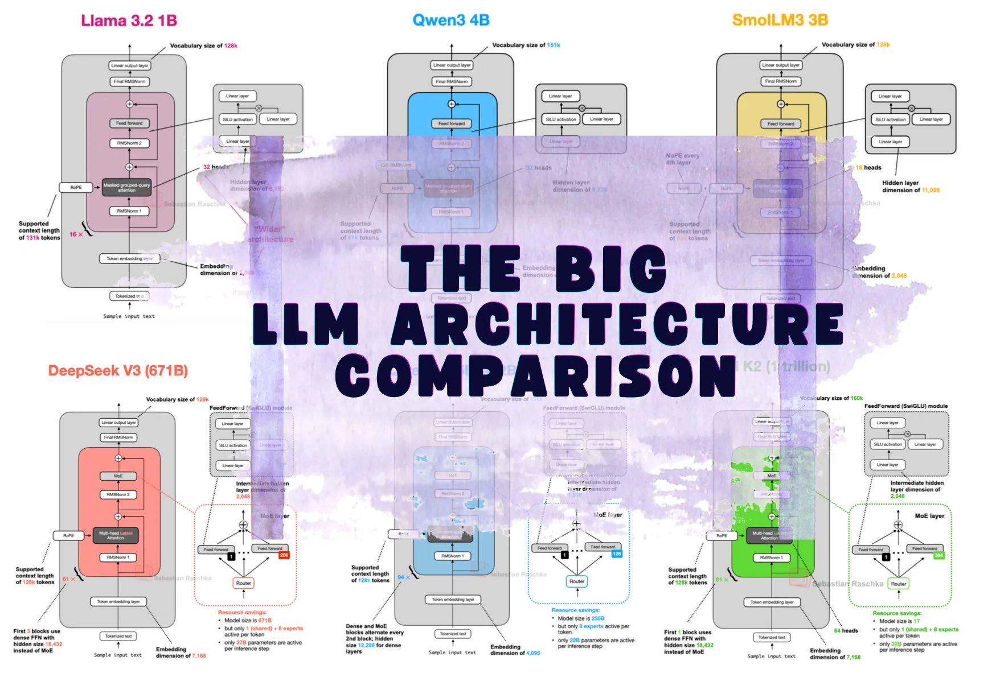
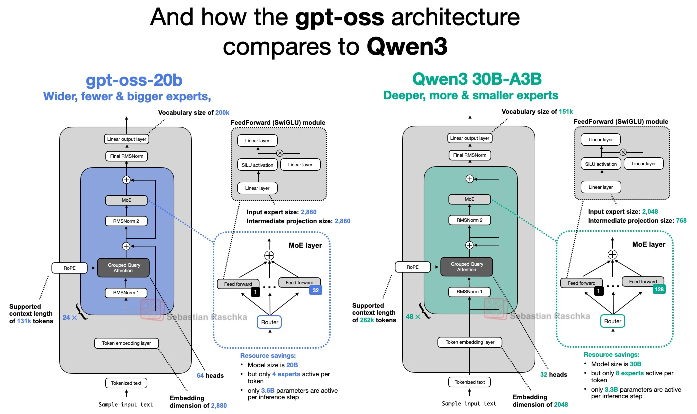
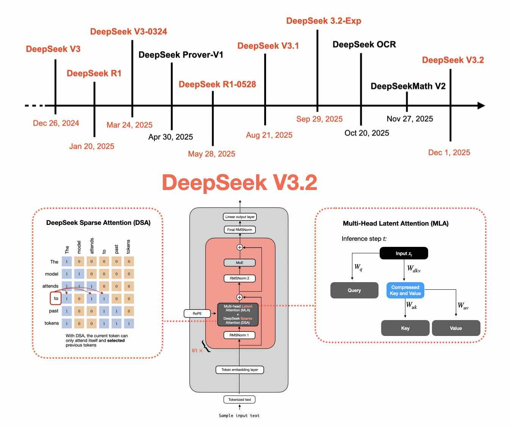
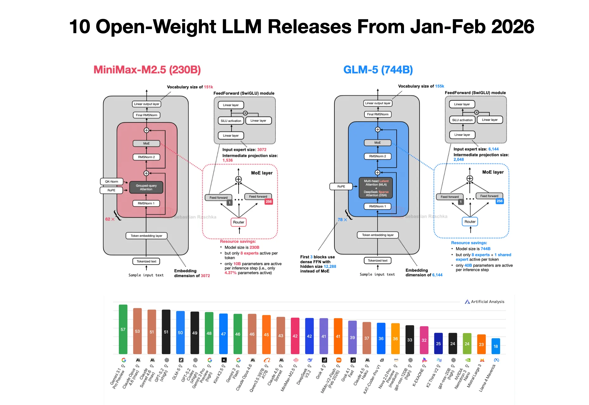

# LLM Architecture Gallery

> 原文链接: https://sebastianraschka.com/llm-architecture-gallery/

---

Table of contents

Last updated: April 10, 2026 [(view changes)](/llm-architecture-gallery/changelog/) [RSS](/llm-architecture-gallery/rss.xml) If you do not see the latest changes, try a hard reload: `Cmd+Shift+R` on Mac or `Ctrl+F5` on Windows.

This page collects architecture figures and fact sheets from posts on [my blog](https://magazine.sebastianraschka.com), plus selected release posts or technical reports when a new architecture has not been covered there yet. Click a figure to enlarge it, or use the model title to jump to the source article.

If you spot an inaccurate fact sheet, mislabeled architecture, or broken link, please file an issue here: [Architecture Gallery issue tracker](https://github.com/rasbt/LLMs-from-scratch/issues/new?labels=architecture-gallery&title=Architecture%20Gallery%3A%20).

I am very grateful that several people asked for a way to support this project. So, the LLM Architecture Gallery is now available both as a physical poster on [Redbubble](https://www.redbubble.com/i/poster/LLM-Architecture-Gallery-by-Ahead-of-AI/179274487/flk2) and as a print-ready digital download on [Gumroad](https://rasbt.gumroad.com/l/llm-gallery). I ordered the Redbubble print myself to check the print quality; the photo shows the Medium size (26.9 x 23.4 in). The smallest labels are still readable at that size, but I probably would not go smaller.

Architecture diff tool

### Select two models to compare their architectures

If you want to compare two architectures side by side instead of browsing the gallery, use this diff tool. You can use the selectors here or the `Model A` / `Model B` actions on each card.

Model A Model B

[Jump to Model A](#) [Jump to Model B](#)

Sort by View

Compare

[Jump to diff](#architecture-diff-tool)

#### GPT-2 XL (1.5B)

[View in article](https://magazine.sebastianraschka.com/p/from-gpt-2-to-gpt-oss-analyzing-the#%C2%A72-coming-from-gpt-2) [config.json](https://huggingface.co/openai-community/gpt2-xl/blob/main/config.json "openai-community/gpt2-xl") [Tech report](https://cdn.openai.com/better-language-models/language_models_are_unsupervised_multitask_learners.pdf)

Late-2019 dense baseline included here as a reference point for how much decoder stacks have changed since GPT-2.

Scale

1.5B parameters

Context (tokens)

1,024

License

OpenAI "Modified MIT" license

Date

2019-11-05

Decoder type

Dense

Attention

MHA with learned absolute positional embeddings

Layer mix

48 MHA

KV cache / token (bf16) [info](/llm-architecture-gallery/kv-cache-calculations/)

300 KiB · High

Key detail

Classic GPT-2 recipe with dropout, GELU, LayerNorm, and full multi-head attention.

AA Intelligence Index [info](/llm-architecture-gallery/aa-intelligence-index/)

Total score [32.3](https://artificialanalysis.ai/models/gemma-4-31b-non-reasoning) General 31.1 Scientific 24.8 Coding 33.9 Agents 39.4

Related concepts

[MHA](/llm-architecture-gallery/mha/)

Compare

[Jump to diff](#architecture-diff-tool)

#### Llama 3 (8B)

[View in article](https://magazine.sebastianraschka.com/p/the-big-llm-architecture-comparison#%C2%A723-olmo-2-summary) [From scratch](https://github.com/rasbt/LLMs-from-scratch/tree/main/ch05/07_gpt_to_llama) [config.json](https://huggingface.co/meta-llama/Meta-Llama-3-8B/blob/main/config.json "meta-llama/Meta-Llama-3-8B") [License](https://huggingface.co/meta-llama/Meta-Llama-3-8B/blob/main/LICENSE) [Tech report](https://arxiv.org/pdf/2407.21783)

Reference dense Llama stack used to contrast OLMo 2's normalization and attention choices.

Scale

8B parameters

Context (tokens)

8,192

License

Llama 3 Community License Agreement

Date

2024-04-18

Decoder type

Dense

Attention

GQA with RoPE

Layer mix

32 GQA

KV cache / token (bf16) [info](/llm-architecture-gallery/kv-cache-calculations/)

128 KiB · Moderate

Key detail

Pre-norm baseline; wider than OLMo 2 at a similar scale.

Related concepts

[GQA](/llm-architecture-gallery/gqa/)

Compare

[Jump to diff](#architecture-diff-tool)

#### Llama 3.2 (1B)

[View in article](https://magazine.sebastianraschka.com/p/the-big-llm-architecture-comparison#%C2%A761-qwen3-dense) [From scratch](https://github.com/rasbt/LLMs-from-scratch/tree/main/ch05/07_gpt_to_llama) [License](https://huggingface.co/meta-llama/Llama-3.2-1B/blob/main/LICENSE.txt)

Small dense Llama baseline in the Qwen comparison, with fewer layers but more width.

Scale

1B parameters

Context (tokens)

128,000

License

Llama Community License Agreement (variant-specific)

Date

2024-09-25

Decoder type

Dense

Attention

GQA

Layer mix

16 GQA

KV cache / token (bf16) [info](/llm-architecture-gallery/kv-cache-calculations/)

32 KiB · Low

Key detail

Wider architecture with more heads than Qwen3 0.6B.

AA Intelligence Index [info](/llm-architecture-gallery/aa-intelligence-index/)

Total score [6.3](https://artificialanalysis.ai/models/llama-3-2-instruct-1b) General 17.0 Scientific 7.6 Coding 0.6 Agents 0.0

Related concepts

[GQA](/llm-architecture-gallery/gqa/)

Compare

[Jump to diff](#architecture-diff-tool)

#### OLMo 2 (7B)

[View in article](https://magazine.sebastianraschka.com/p/the-big-llm-architecture-comparison#%C2%A723-olmo-2-summary) [config.json](https://huggingface.co/allenai/OLMo-2-1124-7B-Instruct/blob/main/config.json "allenai/OLMo-2-1124-7B-Instruct") [Tech report](https://arxiv.org/pdf/2501.00656)

Transparent dense model that keeps classic MHA and pushes normalization changes for training stability.

Scale

7B parameters

Context (tokens)

4,096

License

Apache License 2.0

Date

2024-11-25

Decoder type

Dense

Attention

MHA with QK-Norm

Layer mix

32 MHA

KV cache / token (bf16) [info](/llm-architecture-gallery/kv-cache-calculations/)

512 KiB · Very high

Key detail

Uses inside-residual post-norm instead of the usual pre-norm layout.

Related concepts

[QK-Norm](/llm-architecture-gallery/qk-norm/) [MHA](/llm-architecture-gallery/mha/)

Compare

[Jump to diff](#architecture-diff-tool)

#### Phi-4 (14B)

[config.json](https://huggingface.co/microsoft/phi-4/blob/main/config.json "microsoft/phi-4") [License](https://huggingface.co/microsoft/phi-4/blob/main/LICENSE) [Tech report](https://arxiv.org/pdf/2412.08905)

Microsoft's 14B dense Phi refresh stays close to Phi-3-medium but swaps its sliding-window attention for full-context GQA and a larger tokenizer.

Scale

14B parameters

Context (tokens)

16,384

License

MIT License

Date

2024-12-12

Decoder type

Dense

Attention

GQA with RoPE

Layer mix

40 GQA

KV cache / token (bf16) [info](/llm-architecture-gallery/kv-cache-calculations/)

200 KiB · High

Key detail

Classic pre-norm RMSNorm stack with GQA, 40 heads, 10 KV heads, and a 100,352-token vocabulary.

AA Intelligence Index [info](/llm-architecture-gallery/aa-intelligence-index/)

Total score [10.4](https://artificialanalysis.ai/models/phi-4) General 14.0 Scientific 16.4 Coding 11.2 Agents 0.0

Related concepts

[RMSNorm](/llms-from-scratch/ch04/09_rmsnorm/) [GQA](/llm-architecture-gallery/gqa/)

Compare

[Jump to diff](#architecture-diff-tool)

#### DeepSeek V3 (671B)

[View in article](https://magazine.sebastianraschka.com/p/the-big-llm-architecture-comparison#%C2%A75-llama-4) [config.json](https://huggingface.co/deepseek-ai/DeepSeek-V3/blob/main/config.json "deepseek-ai/DeepSeek-V3") [License](https://huggingface.co/deepseek-ai/DeepSeek-V3/blame/main/LICENSE-MODEL) [Tech report](https://arxiv.org/pdf/2412.19437)

DeepSeek's flagship template kicked off the recent wave of large open MoE models.

Scale

671B total, 37B active (5.5% active)

Context (tokens)

128,000

License

DeepSeek License Agreement v1.0

Date

2024-12-26

Decoder type

Sparse MoE

Attention

MLA

Layer mix

61 MLA

KV cache / token (bf16) [info](/llm-architecture-gallery/kv-cache-calculations/)

68.6 KiB · Low

Key detail

Uses a dense prefix plus a shared expert to keep a very large model practical at inference.

AA Intelligence Index [info](/llm-architecture-gallery/aa-intelligence-index/)

Total score [16.5](https://artificialanalysis.ai/models/deepseek-v3) General 24.9 Scientific 15.7 Coding 16.4 Agents 8.8

Related concepts

[MLA](/llm-architecture-gallery/mla/) [MoE](/llm-architecture-gallery/moe/)

Compare

[Jump to diff](#architecture-diff-tool)

#### DeepSeek R1 (671B)

[View in article](https://magazine.sebastianraschka.com/p/the-big-llm-architecture-comparison#%C2%A78-kimi-k2-and-kimi-k2-thinking) [config.json](https://huggingface.co/deepseek-ai/DeepSeek-R1/blob/main/config.json "deepseek-ai/DeepSeek-R1") [License](https://huggingface.co/deepseek-ai/DeepSeek-R1/blob/main/LICENSE) [Tech report](https://arxiv.org/pdf/2501.12948)

Reasoning-tuned DeepSeek model built on the V3 architecture rather than a new base design.

Scale

671B total, 37B active (5.5% active)

Context (tokens)

128,000

License

MIT License

Date

2025-01-20

Decoder type

Sparse MoE

Attention

MLA

Layer mix

61 MLA

KV cache / token (bf16) [info](/llm-architecture-gallery/kv-cache-calculations/)

68.6 KiB · Low

Key detail

Architecture matches DeepSeek V3; the main change is the reasoning-oriented training recipe.

AA Intelligence Index [info](/llm-architecture-gallery/aa-intelligence-index/)

Total score [18.8](https://artificialanalysis.ai/models/deepseek-r1-0120) General 33.1 Scientific 22.5 Coding 15.9 Agents 3.8

Related concepts

[MLA](/llm-architecture-gallery/mla/) [MoE](/llm-architecture-gallery/moe/)

Compare

[Jump to diff](#architecture-diff-tool)

#### Gemma 3 (27B)

[View in article](https://magazine.sebastianraschka.com/p/the-big-llm-architecture-comparison#%C2%A74-mistral-small-31) [From scratch](https://github.com/rasbt/LLMs-from-scratch/tree/main/ch05/12_gemma3) [config.json](https://huggingface.co/google/gemma-3-27b-it/blob/main/config.json "google/gemma-3-27b-it") [License](https://ai.google.dev/gemma/prohibited_use_policy) [Tech report](https://arxiv.org/pdf/2503.19786)

Gemma's flagship text stack leans on local attention more aggressively than Gemma 2.

Scale

27B parameters

Context (tokens)

128,000

Vocabulary

262,144 (~262k)

License

Gemma Terms of Use + Gemma Prohibited Use Policy

Date

2025-03-11

Decoder type

Dense

Attention

GQA with QK-Norm and 5:1 sliding-window/global attention

Layer mix

52 sliding-window + 10 global

KV cache / token (bf16) [info](/llm-architecture-gallery/kv-cache-calculations/)

496 KiB · Very high

Key detail

Built around a 27B sweet spot with heavier local attention and a large 262k multilingual vocabulary.

AA Intelligence Index [info](/llm-architecture-gallery/aa-intelligence-index/)

Total score [10.3](https://artificialanalysis.ai/models/gemma-3-27b) General 15.1 Scientific 13.0 Coding 9.6 Agents 3.5

Related concepts

[QK-Norm](/llm-architecture-gallery/qk-norm/) [GQA](/llm-architecture-gallery/gqa/) [SWA](/llm-architecture-gallery/swa/)

Compare

[Jump to diff](#architecture-diff-tool)

#### xLSTM (7B)

[config.json](https://huggingface.co/NX-AI/xLSTM-7b/blob/main/config.json "NX-AI/xLSTM-7b") [License](https://huggingface.co/NX-AI/xLSTM-7b/blob/main/LICENSE) [Tech report](https://arxiv.org/abs/2503.13427)

Recurrent 7B language model that replaces self-attention with xLSTM blocks built around matrix memory.

Scale

7B parameters

Context (tokens)

No explicit limit

License

NXAI Community License Agreement

Date

2025-03-17

Decoder type

Recurrent

Attention

No self-attention; mLSTM recurrent layers with matrix memory

Layer mix

32 mLSTM

KV cache / token (bf16) [info](/llm-architecture-gallery/kv-cache-calculations/)

0 B · No cache

Key detail

Stateful recurrent architecture aimed at fast long-context inference without an explicit context window.

Compare

[Jump to diff](#architecture-diff-tool)

#### Mistral Small 3.1 (24B)

[View in article](https://magazine.sebastianraschka.com/p/the-big-llm-architecture-comparison#%C2%A74-mistral-small-31) [config.json](https://huggingface.co/mistralai/Mistral-Small-3.1-24B-Base-2503/blob/main/config.json "mistralai/Mistral-Small-3.1-24B-Base-2503") [Tech report](https://mistral.ai/news/mistral-small-3-1)

Fast dense 24B model that drops the sliding-window setup used in older Mistral releases.

Scale

24B parameters

Context (tokens)

128,000

License

Apache License 2.0

Date

2025-03-18

Decoder type

Dense

Attention

Standard GQA

Layer mix

40 GQA

KV cache / token (bf16) [info](/llm-architecture-gallery/kv-cache-calculations/)

160 KiB · Moderate

Key detail

Latency-focused design with a smaller KV cache and fewer layers than Gemma 3 27B.

AA Intelligence Index [info](/llm-architecture-gallery/aa-intelligence-index/)

Total score [14.5](https://artificialanalysis.ai/models/mistral-small-3-1) General 21.9 Scientific 13.8 Coding 13.9 Agents 8.4

Related concepts

[GQA](/llm-architecture-gallery/gqa/) [SWA](/llm-architecture-gallery/swa/)

Compare

[Jump to diff](#architecture-diff-tool)

#### Llama 4 Maverick (400B)

[View in article](https://magazine.sebastianraschka.com/p/the-big-llm-architecture-comparison#%C2%A75-llama-4) [config.json](https://huggingface.co/meta-llama/Llama-4-Maverick-17B-128E-Instruct/blob/main/config.json "meta-llama/Llama-4-Maverick-17B-128E-Instruct") [Tech report](https://ai.meta.com/blog/llama-4-multimodal-intelligence/)

Meta's large MoE follows the DeepSeek V3 playbook but with a more conventional attention stack.

Scale

400B total, 17B active (4.3% active)

Context (tokens)

1,000,000

License

Llama 4 Community License Agreement

Date

2025-04-05

Decoder type

Sparse MoE

Attention

GQA

Layer mix

36 chunked + 12 full GQA

KV cache / token (bf16) [info](/llm-architecture-gallery/kv-cache-calculations/)

192 KiB · High

Key detail

Alternates dense and MoE blocks and uses fewer, larger experts than DeepSeek V3.

Related concepts

[GQA](/llm-architecture-gallery/gqa/) [MoE](/llm-architecture-gallery/moe/)

Compare

[Jump to diff](#architecture-diff-tool)

#### Qwen3 (4B)

[View in article](https://magazine.sebastianraschka.com/p/the-big-llm-architecture-comparison#%C2%A77-smollm3) [From scratch](https://github.com/rasbt/LLMs-from-scratch/tree/main/ch05/11_qwen3) [config.json](https://huggingface.co/Qwen/Qwen3-4B/blob/main/config.json "Qwen/Qwen3-4B") [License](https://huggingface.co/Qwen/Qwen3-4B/blob/main/LICENSE) [Tech report](https://arxiv.org/pdf/2505.09388)

Mid-size dense Qwen3 model used here as a clean baseline against SmolLM3 and Tiny Aya.

Scale

4B parameters

Context (tokens)

32,768

License

Apache License 2.0

Date

2025-04-28

Decoder type

Dense

Attention

GQA with QK-Norm

Layer mix

36 GQA

KV cache / token (bf16) [info](/llm-architecture-gallery/kv-cache-calculations/)

144 KiB · Moderate

Key detail

Compact Qwen3 dense stack with QK-Norm and a 151k vocabulary.

AA Intelligence Index [info](/llm-architecture-gallery/aa-intelligence-index/)

Total score [12.5](https://artificialanalysis.ai/models/qwen3-4b-instruct)

Related concepts

[QK-Norm](/llm-architecture-gallery/qk-norm/) [GQA](/llm-architecture-gallery/gqa/)

Compare

[Jump to diff](#architecture-diff-tool)

#### Qwen3 (8B)

[View in article](https://magazine.sebastianraschka.com/p/the-big-llm-architecture-comparison#%C2%A715-olmo-3-thinking) [From scratch](https://github.com/rasbt/LLMs-from-scratch/tree/main/ch05/11_qwen3) [config.json](https://huggingface.co/Qwen/Qwen3-8B/blob/main/config.json "Qwen/Qwen3-8B") [License](https://huggingface.co/Qwen/Qwen3-8B/blob/main/LICENSE) [Tech report](https://arxiv.org/pdf/2505.09388)

Dense Qwen3 baseline used here to show how little OLMo 3 changed the overall decoder recipe.

Scale

8B parameters

Context (tokens)

128,000

License

Apache License 2.0

Date

2025-04-28

Decoder type

Dense

Attention

GQA with QK-Norm

Layer mix

36 GQA

KV cache / token (bf16) [info](/llm-architecture-gallery/kv-cache-calculations/)

144 KiB · Moderate

Key detail

Reference Qwen3 dense stack with QK-Norm and 8 KV heads.

AA Intelligence Index [info](/llm-architecture-gallery/aa-intelligence-index/)

Total score [10.6](https://artificialanalysis.ai/models/qwen3-8b-instruct) General 11.2 Scientific 12.7 Coding 7.1 Agents 11.6

Related concepts

[QK-Norm](/llm-architecture-gallery/qk-norm/) [GQA](/llm-architecture-gallery/gqa/)

Compare

[Jump to diff](#architecture-diff-tool)

#### Qwen3 (32B)

[View in article](https://magazine.sebastianraschka.com/p/the-big-llm-architecture-comparison#%C2%A715-olmo-3-thinking) [From scratch](https://github.com/rasbt/LLMs-from-scratch/tree/main/ch05/11_qwen3) [config.json](https://huggingface.co/Qwen/Qwen3-32B/blob/main/config.json "Qwen/Qwen3-32B") [License](https://huggingface.co/Qwen/Qwen3-32B/blob/main/LICENSE) [Tech report](https://arxiv.org/pdf/2505.09388)

Large dense Qwen3 model that serves as the clearest like-for-like comparison for OLMo 3 32B.

Scale

32B parameters

Context (tokens)

128,000

License

Apache License 2.0

Date

2025-04-28

Decoder type

Dense

Attention

GQA with QK-Norm

Layer mix

64 GQA

KV cache / token (bf16) [info](/llm-architecture-gallery/kv-cache-calculations/)

256 KiB · High

Key detail

Reference dense Qwen stack with QK-Norm and 8 KV heads.

AA Intelligence Index [info](/llm-architecture-gallery/aa-intelligence-index/)

Total score [14.5](https://artificialanalysis.ai/models/qwen3-32b-instruct)

Related concepts

[QK-Norm](/llm-architecture-gallery/qk-norm/) [GQA](/llm-architecture-gallery/gqa/)

Compare

[Jump to diff](#architecture-diff-tool)

#### Qwen3 (235B-A22B)

[View in article](https://magazine.sebastianraschka.com/p/the-big-llm-architecture-comparison#%C2%A762-qwen3-moe) [From scratch](https://github.com/rasbt/LLMs-from-scratch/tree/main/ch05/11_qwen3) [config.json](https://huggingface.co/Qwen/Qwen3-235B-A22B/blob/main/config.json "Qwen/Qwen3-235B-A22B") [License](https://huggingface.co/Qwen/Qwen3-235B-A22B/blob/main/LICENSE) [Tech report](https://arxiv.org/pdf/2505.09388)

Large sparse Qwen variant that stays very close to DeepSeek V3 while removing the shared expert.

Scale

235B total, 22B active (9.4% active)

Context (tokens)

128,000

License

Apache License 2.0

Date

2025-04-28

Decoder type

Sparse MoE

Attention

GQA with QK-Norm

Layer mix

94 GQA

KV cache / token (bf16) [info](/llm-architecture-gallery/kv-cache-calculations/)

188 KiB · High

Key detail

High-capacity MoE design optimized for serving efficiency without a shared expert.

AA Intelligence Index [info](/llm-architecture-gallery/aa-intelligence-index/)

Total score [17.0](https://artificialanalysis.ai/models/qwen3-235b-a22b-instruct) General 16.9 Scientific 17.7 Coding 14.0 Agents 19.2

Related concepts

[QK-Norm](/llm-architecture-gallery/qk-norm/) [GQA](/llm-architecture-gallery/gqa/) [MoE](/llm-architecture-gallery/moe/)

Compare

[Jump to diff](#architecture-diff-tool)

#### SmolLM3 (3B)

[View in article](https://magazine.sebastianraschka.com/p/the-big-llm-architecture-comparison#%C2%A77-smollm3) [config.json](https://huggingface.co/HuggingFaceTB/SmolLM3-3B-Base/blob/main/config.json "HuggingFaceTB/SmolLM3-3B-Base") [Tech report](https://huggingface.co/blog/smollm3)

Compact dense model that experiments with leaving out positional encodings in selected layers.

Scale

3B parameters

Context (tokens)

131,072

License

Apache License 2.0

Date

2025-06-19

Decoder type

Dense

Attention

GQA with periodic NoPE layers

Layer mix

36 GQA

KV cache / token (bf16) [info](/llm-architecture-gallery/kv-cache-calculations/)

72 KiB · Low

Key detail

Every fourth layer omits RoPE to test a NoPE-style cadence.

Related concepts

[NoPE](/llm-architecture-gallery/nope/) [GQA](/llm-architecture-gallery/gqa/)

Compare

[Jump to diff](#architecture-diff-tool)

#### Kimi K2 (1T)

[View in article](https://magazine.sebastianraschka.com/p/the-big-llm-architecture-comparison#%C2%A78-kimi-k2-and-kimi-k2-thinking) [config.json](https://huggingface.co/moonshotai/Kimi-K2-Base/blob/main/config.json "moonshotai/Kimi-K2-Base") [License](https://huggingface.co/moonshotai/Kimi-K2-Base/blame/main/LICENSE) [Tech report](https://arxiv.org/pdf/2507.20534)

Trillion-parameter Moonshot model that essentially scales the DeepSeek V3 recipe upward.

Scale

1T total, 32B active (3.2% active)

Context (tokens)

128,000

License

Modified MIT License

Date

2025-07-10

Decoder type

Sparse MoE

Attention

MLA

Layer mix

61 MLA

KV cache / token (bf16) [info](/llm-architecture-gallery/kv-cache-calculations/)

68.6 KiB · Low

Key detail

More experts and fewer MLA heads than DeepSeek V3.

AA Intelligence Index [info](/llm-architecture-gallery/aa-intelligence-index/)

Total score [26.3](https://artificialanalysis.ai/models/kimi-k2) General 36.3 Scientific 22.6 Coding 22.1 Agents 24.3

Related concepts

[MLA](/llm-architecture-gallery/mla/) [MoE](/llm-architecture-gallery/moe/)

Compare

[Jump to diff](#architecture-diff-tool)

#### GLM-4.5 (355B)

[View in article](https://magazine.sebastianraschka.com/p/the-big-llm-architecture-comparison#%C2%A711-glm-45) [config.json](https://huggingface.co/zai-org/GLM-4.5/blob/main/config.json "zai-org/GLM-4.5") [Tech report](https://arxiv.org/pdf/2508.06471)

Agent-oriented instruction/reasoning hybrid that borrows DeepSeek's dense-prefix MoE layout.

Scale

355B total, 32B active (9% active)

Context (tokens)

128,000

License

MIT License

Date

2025-07-28

Decoder type

Sparse MoE

Attention

GQA with QK-Norm

Layer mix

92 GQA

KV cache / token (bf16) [info](/llm-architecture-gallery/kv-cache-calculations/)

368 KiB · Very high

Key detail

Starts with three dense layers before MoE routing and keeps a shared expert.

AA Intelligence Index [info](/llm-architecture-gallery/aa-intelligence-index/)

Total score [26.4](https://artificialanalysis.ai/models/glm-4.5) General 37.5 Scientific 25.6 Coding 26.3 Agents 16.2

Related concepts

[QK-Norm](/llm-architecture-gallery/qk-norm/) [GQA](/llm-architecture-gallery/gqa/) [MoE](/llm-architecture-gallery/moe/)

Compare

[Jump to diff](#architecture-diff-tool)

#### GLM-4.5-Air (106B)

[config.json](https://huggingface.co/zai-org/GLM-4.5-Air/blob/main/config.json "zai-org/GLM-4.5-Air") [Tech report](https://arxiv.org/pdf/2508.06471)

Compact GLM-4.5 companion that keeps the same agent-oriented sparse MoE recipe at a smaller serving footprint.

Scale

106B total, 12B active (11.3% active)

Context (tokens)

128,000

License

MIT License

Date

2025-07-28

Decoder type

Sparse MoE

Attention

GQA

Layer mix

46 GQA

KV cache / token (bf16) [info](/llm-architecture-gallery/kv-cache-calculations/)

184 KiB · High

Key detail

Shrinks the GLM-4.5 layout to 46 layers and a single dense warmup layer before MoE routing.

AA Intelligence Index [info](/llm-architecture-gallery/aa-intelligence-index/)

Total score [23.2](https://artificialanalysis.ai/models/glm-4-5-air) General 26.1 Scientific 21.7 Coding 23.8 Agents 21.0

Related concepts

[GQA](/llm-architecture-gallery/gqa/) [MoE](/llm-architecture-gallery/moe/)

Compare

[Jump to diff](#architecture-diff-tool)

#### Qwen3 Coder Flash (30B-A3B)

[View in article](https://magazine.sebastianraschka.com/p/a-dream-of-spring-for-open-weight#%C2%A74-qwen3-coder-next-an-attention-hybrid-for-coding) [From scratch](https://github.com/rasbt/LLMs-from-scratch/tree/main/ch05/11_qwen3) [config.json](https://huggingface.co/Qwen/Qwen3-Coder-30B-A3B-Instruct/blob/main/config.json "Qwen/Qwen3-Coder-30B-A3B-Instruct") [License](https://huggingface.co/Qwen/Qwen3-Coder-30B-A3B-Instruct/blob/main/LICENSE)

Coding-tuned Qwen model that keeps a straightforward grouped-query MoE stack instead of the newer hybrid-attention variants.

Scale

30B total, 3.3B active (11% active)

Context (tokens)

256,000

License

Apache License 2.0

Date

2025-07-31

Decoder type

Sparse MoE

Attention

GQA

Layer mix

48 GQA

KV cache / token (bf16) [info](/llm-architecture-gallery/kv-cache-calculations/)

96 KiB · Moderate

Key detail

Uses 128 experts with 8 active per token and a native 256k context window for coding workloads.

AA Intelligence Index [info](/llm-architecture-gallery/aa-intelligence-index/)

Total score [20.0](https://artificialanalysis.ai/models/qwen3-coder-30b-a3b-instruct) General 24.6 Scientific 14.9 Coding 19.4 Agents 21.1

Related concepts

[GQA](/llm-architecture-gallery/gqa/) [MoE](/llm-architecture-gallery/moe/)

Compare

[Jump to diff](#architecture-diff-tool)

#### GPT-OSS (20B)

[View in article](https://magazine.sebastianraschka.com/p/the-big-llm-architecture-comparison#%C2%A79-gpt-oss) [config.json](https://huggingface.co/openai/gpt-oss-20b/blob/main/config.json "openai/gpt-oss-20b") [License](https://huggingface.co/openai/gpt-oss-20b/blob/main/LICENSE) [Tech report](https://cdn.openai.com/pdf/419b6906-9da6-406c-a19d-1bb078ac7637/oai_gpt-oss_model_card.pdf)

OpenAI's smaller open-weight MoE model favors width and alternating local/global attention.

Scale

21B total, 3.6B active (17.1% active)

Context (tokens)

128,000

License

Apache License 2.0

Date

2025-08-04

Decoder type

Sparse MoE

Attention

GQA with alternating sliding-window and global layers

Layer mix

12 sliding-window + 12 global

KV cache / token (bf16) [info](/llm-architecture-gallery/kv-cache-calculations/)

48 KiB · Low

Key detail

Wider and shallower than Qwen3, with attention bias and sink mechanisms.

AA Intelligence Index [info](/llm-architecture-gallery/aa-intelligence-index/)

Total score [24.5](https://artificialanalysis.ai/models/gpt-oss-20b) General 29.3 Scientific 22.5 Coding 18.5 Agents 27.6

Related concepts

[GQA](/llm-architecture-gallery/gqa/) [SWA](/llm-architecture-gallery/swa/) [MoE](/llm-architecture-gallery/moe/)

Compare

[Jump to diff](#architecture-diff-tool)

#### GPT-OSS (120B)

[View in article](https://magazine.sebastianraschka.com/p/the-big-llm-architecture-comparison#%C2%A79-gpt-oss) [config.json](https://huggingface.co/openai/gpt-oss-120b/blob/main/config.json "openai/gpt-oss-120b") [License](https://huggingface.co/openai/gpt-oss-120b/blob/main/LICENSE) [Tech report](https://cdn.openai.com/pdf/419b6906-9da6-406c-a19d-1bb078ac7637/oai_gpt-oss_model_card.pdf)

Larger gpt-oss variant keeps the same alternating-attention recipe as the 20B model.

Scale

117B total, 5.1B active (4.4% active)

Context (tokens)

128,000

License

Apache License 2.0

Date

2025-08-04

Decoder type

Sparse MoE

Attention

GQA with alternating sliding-window and global layers

Layer mix

18 sliding-window + 18 global

KV cache / token (bf16) [info](/llm-architecture-gallery/kv-cache-calculations/)

72 KiB · Low

Key detail

Shared architectural template scaled up for OpenAI's flagship open-weight release.

AA Intelligence Index [info](/llm-architecture-gallery/aa-intelligence-index/)

Total score [33.3](https://artificialanalysis.ai/models/gpt-oss-120b) General 37.5 Scientific 29.1 Coding 28.6 Agents 37.9

Related concepts

[GQA](/llm-architecture-gallery/gqa/) [SWA](/llm-architecture-gallery/swa/) [MoE](/llm-architecture-gallery/moe/)

Compare

[Jump to diff](#architecture-diff-tool)

#### Gemma 3 (270M)

[View in article](https://magazine.sebastianraschka.com/p/the-big-llm-architecture-comparison#%C2%A74-mistral-small-31) [From scratch](https://github.com/rasbt/LLMs-from-scratch/tree/main/ch05/12_gemma3) [config.json](https://huggingface.co/google/gemma-3-270m/blob/main/config.json "google/gemma-3-270m") [License](https://ai.google.dev/gemma/prohibited_use_policy) [Tech report](https://arxiv.org/pdf/2503.19786)

Tiny Gemma 3 variant that preserves the family's local-global attention recipe at a toy scale.

Scale

270M parameters

Context (tokens)

128,000

Vocabulary

262,144 (~262k)

License

Gemma Terms of Use + Gemma Prohibited Use Policy

Date

2025-08-14

Decoder type

Dense

Attention

Multi-query attention with QK-Norm and 5:1 sliding-window/global attention

Layer mix

15 sliding-window + 3 global

KV cache / token (bf16) [info](/llm-architecture-gallery/kv-cache-calculations/)

18 KiB · Very low

Key detail

Keeps the Gemma 3 stack shape while shrinking down to 4 attention heads, a single KV head, and the same 262k vocabulary.

AA Intelligence Index [info](/llm-architecture-gallery/aa-intelligence-index/)

Total score [7.7](https://artificialanalysis.ai/models/gemma-3-270m) General 20.1 Scientific 7.7 Coding 0.0 Agents 3.0

Related concepts

[QK-Norm](/llm-architecture-gallery/qk-norm/) [SWA](/llm-architecture-gallery/swa/)

Compare

[Jump to diff](#architecture-diff-tool)

#### Grok 2.5 (270B)

[View in article](https://magazine.sebastianraschka.com/p/the-big-llm-architecture-comparison#%C2%A710-grok-25) [config.json](https://huggingface.co/xai-org/grok-2/blob/main/config.json "xai-org/grok-2")

Rare production-model release that shows an older MoE style with fewer, larger experts.

Scale

270B parameters

Context (tokens)

131,072

License

Grok 2 Community License Agreement

Date

2025-08-22

Decoder type

Sparse MoE

Attention

GQA

Layer mix

64 GQA

KV cache / token (bf16) [info](/llm-architecture-gallery/kv-cache-calculations/)

256 KiB · High

Key detail

Adds an always-on SwiGLU path that effectively behaves like a shared expert.

Related concepts

[GQA](/llm-architecture-gallery/gqa/) [MoE](/llm-architecture-gallery/moe/)

Compare

[Jump to diff](#architecture-diff-tool)

#### Qwen3 Next (80B-A3B)

[View in article](https://magazine.sebastianraschka.com/p/the-big-llm-architecture-comparison#%C2%A7121-expert-size-and-number) [config.json](https://huggingface.co/Qwen/Qwen3-Next-80B-A3B-Instruct/blob/main/config.json "Qwen/Qwen3-Next-80B-A3B-Instruct") [License](https://huggingface.co/Qwen/Qwen3-Next-80B-A3B-Instruct/blob/main/LICENSE)

Efficiency-focused Qwen refresh that swaps standard attention for a DeltaNet-attention hybrid.

Scale

80B total, 3B active (3.8% active)

Context (tokens)

262,144

License

Apache License 2.0

Date

2025-09-09

Decoder type

Sparse hybrid

Attention

3:1 Gated DeltaNet and Gated Attention

Layer mix

12 gated attention + 36 DeltaNet

KV cache / token (bf16) [info](/llm-architecture-gallery/kv-cache-calculations/)

24 KiB · Very low

Key detail

Adds many more experts, a shared expert, and a native 262k context.

AA Intelligence Index [info](/llm-architecture-gallery/aa-intelligence-index/)

Total score [20.1](https://artificialanalysis.ai/models/qwen3-next-80b-a3b-instruct) General 28.9 Scientific 22.1 Coding 15.3 Agents 14.2

Related concepts

[MoE](/llm-architecture-gallery/moe/) [Gated Attention](/llm-architecture-gallery/gated-attention/) [Hybrid Attention](/llm-architecture-gallery/hybrid-attention/)

Compare

[Jump to diff](#architecture-diff-tool)

#### MiniMax M2 (230B)

[View in article](https://magazine.sebastianraschka.com/p/the-big-llm-architecture-comparison#%C2%A7131-per-layer-qk-norm) [config.json](https://huggingface.co/MiniMaxAI/MiniMax-M2/blob/main/config.json "MiniMaxAI/MiniMax-M2")

MiniMax's flagship returns to full attention and looks like a leaner, sparser cousin of Qwen3.

Scale

230B total, 10B active (4.3% active)

Context (tokens)

196,608

License

Modified MIT License

Date

2025-10-23

Decoder type

Sparse MoE

Attention

GQA with QK-Norm and partial RoPE

Layer mix

62 GQA

KV cache / token (bf16) [info](/llm-architecture-gallery/kv-cache-calculations/)

248 KiB · High

Key detail

Uses per-layer QK-Norm and much sparser MoE routing than Qwen3.

Related concepts

[QK-Norm](/llm-architecture-gallery/qk-norm/) [GQA](/llm-architecture-gallery/gqa/) [MoE](/llm-architecture-gallery/moe/)

Compare

[Jump to diff](#architecture-diff-tool)

#### Kimi Linear (48B-A3B)

[View in article](https://magazine.sebastianraschka.com/p/the-big-llm-architecture-comparison#%C2%A7144-kimi-linear-vs-qwen3-next) [config.json](https://huggingface.co/moonshotai/Kimi-Linear-48B-A3B-Base/blob/main/config.json "moonshotai/Kimi-Linear-48B-A3B-Base") [Tech report](https://arxiv.org/pdf/2510.26692)

Linear-attention hybrid that keeps a transformer backbone but replaces most full-attention layers.

Scale

48B total, 3B active (6.3% active)

Context (tokens)

1,000,000

License

MIT License

Date

2025-10-30

Decoder type

Sparse hybrid

Attention

3:1 Kimi Delta Attention and MLA

Layer mix

7 MLA + 20 Kimi Delta Attention

KV cache / token (bf16) [info](/llm-architecture-gallery/kv-cache-calculations/)

7.9 KiB · Very low

Key detail

Uses NoPE in MLA layers and channel-wise gating for long-context efficiency.

AA Intelligence Index [info](/llm-architecture-gallery/aa-intelligence-index/)

Total score [14.4](https://artificialanalysis.ai/models/kimi-linear-48b-a3b-instruct) General N/A Scientific N/A Coding 14.2 Agents N/A

Related concepts

[NoPE](/llm-architecture-gallery/nope/) [MLA](/llm-architecture-gallery/mla/) [Hybrid Attention](/llm-architecture-gallery/hybrid-attention/)

Compare

[Jump to diff](#architecture-diff-tool)

#### OLMo 3 (7B)

[View in article](https://magazine.sebastianraschka.com/p/the-big-llm-architecture-comparison#%C2%A715-olmo-3-thinking) [From scratch](https://github.com/rasbt/LLMs-from-scratch/tree/main/ch05/13_olmo3) [config.json](https://huggingface.co/allenai/Olmo-3-1025-7B/blob/main/config.json "allenai/Olmo-3-1025-7B") [Tech report](https://arxiv.org/pdf/2512.13961)

New transparent Allen AI model that keeps OLMo's post-norm flavor while modernizing context handling.

Scale

7B parameters

Context (tokens)

65,536

License

Apache License 2.0

Date

2025-11-20

Decoder type

Dense

Attention

MHA with QK-Norm and 3:1 sliding-window/global attention

Layer mix

24 sliding-window + 8 global

KV cache / token (bf16) [info](/llm-architecture-gallery/kv-cache-calculations/)

512 KiB · Very high

Key detail

Retains post-norm, keeps MHA, and applies YaRN only on global layers.

AA Intelligence Index [info](/llm-architecture-gallery/aa-intelligence-index/)

Total score [8.2](https://artificialanalysis.ai/models/olmo-3-7b-instruct) General 12.1 Scientific 12.9 Coding 3.4 Agents 4.2

Related concepts

[QK-Norm](/llm-architecture-gallery/qk-norm/) [MHA](/llm-architecture-gallery/mha/) [SWA](/llm-architecture-gallery/swa/)

Compare

[Jump to diff](#architecture-diff-tool)

#### OLMo 3 (32B)

[View in article](https://magazine.sebastianraschka.com/p/the-big-llm-architecture-comparison#%C2%A715-olmo-3-thinking) [From scratch](https://github.com/rasbt/LLMs-from-scratch/tree/main/ch05/13_olmo3) [config.json](https://huggingface.co/allenai/Olmo-3-32B-Think/blob/main/config.json "allenai/Olmo-3-32B-Think") [Tech report](https://arxiv.org/pdf/2512.13961)

Scaled-up OLMo 3 keeps the same block design but moves to grouped-query attention.

Scale

32B parameters

Context (tokens)

65,536

License

Apache License 2.0

Date

2025-11-20

Decoder type

Dense

Attention

GQA with QK-Norm and 3:1 sliding-window/global attention

Layer mix

48 sliding-window + 16 global

KV cache / token (bf16) [info](/llm-architecture-gallery/kv-cache-calculations/)

256 KiB · High

Key detail

Keeps post-norm while scaling width and applying YaRN only on global layers.

Related concepts

[QK-Norm](/llm-architecture-gallery/qk-norm/) [GQA](/llm-architecture-gallery/gqa/) [SWA](/llm-architecture-gallery/swa/)

Compare

[Jump to diff](#architecture-diff-tool)

#### INTELLECT-3 (106B)

[config.json](https://huggingface.co/PrimeIntellect/INTELLECT-3/blob/main/config.json "PrimeIntellect/INTELLECT-3") [Tech report](https://storage.googleapis.com/intellect-3-paper/INTELLECT_3_Technical_Report.pdf)

Large-scale RL post-training of GLM-4.5-Air that keeps the compact 106B sparse MoE backbone intact.

Scale

106B total, 12B active (11.3% active)

Context (tokens)

128,000

License

MIT License

Date

2025-11-26

Decoder type

Sparse MoE

Attention

GQA

Layer mix

46 GQA

KV cache / token (bf16) [info](/llm-architecture-gallery/kv-cache-calculations/)

184 KiB · High

Key detail

Keeps the GLM-4.5-Air architecture unchanged and shifts the capability profile through SFT plus large-scale RL.

AA Intelligence Index [info](/llm-architecture-gallery/aa-intelligence-index/)

Total score [22.2](https://artificialanalysis.ai/models/intellect-3) General 24.6 Scientific 25.1 Coding 19.1 Agents 19.8

Related concepts

[GQA](/llm-architecture-gallery/gqa/) [MoE](/llm-architecture-gallery/moe/)

Compare

[Jump to diff](#architecture-diff-tool)

#### DeepSeek V3.2 (671B)

[View in article](https://magazine.sebastianraschka.com/p/the-big-llm-architecture-comparison#%C2%A716-deepseek-v32) [config.json](https://huggingface.co/deepseek-ai/DeepSeek-V3.2/blob/main/config.json "deepseek-ai/DeepSeek-V3.2") [License](https://huggingface.co/deepseek-ai/DeepSeek-V3.2/blob/main/LICENSE) [Tech report](https://arxiv.org/pdf/2512.02556)

DeepSeek's successor keeps the V3 template but adds sparse attention to cut long-context costs.

Scale

671B total, 37B active (5.5% active)

Context (tokens)

128,000

License

MIT License

Date

2025-12-01

Decoder type

Sparse MoE

Attention

MLA with DeepSeek Sparse Attention

Layer mix

61 MLA

KV cache / token (bf16) [info](/llm-architecture-gallery/kv-cache-calculations/)

68.6 KiB · Low

Key detail

An evolutionary update focused on efficiency rather than a new base layout.

AA Intelligence Index [info](/llm-architecture-gallery/aa-intelligence-index/)

Total score [32.1](https://artificialanalysis.ai/models/deepseek-v3-2) General 29.7 Scientific 24.2 Coding 34.6 Agents 39.8

Related concepts

[MLA](/llm-architecture-gallery/mla/) [MoE](/llm-architecture-gallery/moe/) [DeepSeek Sparse Attention](/llm-architecture-gallery/deepseek-sparse-attention/)

Compare

[Jump to diff](#architecture-diff-tool)

#### Mistral Large 3 (673B)

[View in article](https://magazine.sebastianraschka.com/p/the-big-llm-architecture-comparison#%C2%A717-mistral-3-large) [params.json](https://huggingface.co/mistralai/Mistral-Large-3-675B-Instruct-2512/blob/main/params.json "mistralai/Mistral-Large-3-675B-Instruct-2512")

Mistral's new flagship effectively adopts the DeepSeek architecture and retunes the expert sizes.

Scale

673B total, 41B active (6.1% active)

Context (tokens)

262,144

License

Apache License 2.0

Date

2025-12-02

Decoder type

Sparse MoE

Attention

MLA

Layer mix

61 MLA

KV cache / token (bf16) [info](/llm-architecture-gallery/kv-cache-calculations/)

68.6 KiB · Low

Key detail

Near-clone of DeepSeek V3 with larger experts, fewer routed experts, and multimodal support.

AA Intelligence Index [info](/llm-architecture-gallery/aa-intelligence-index/)

Total score [22.8](https://artificialanalysis.ai/models/mistral-large-3) General 27.8 Scientific 19.1 Coding 22.7 Agents 21.7

Related concepts

[MLA](/llm-architecture-gallery/mla/) [MoE](/llm-architecture-gallery/moe/)

Compare

[Jump to diff](#architecture-diff-tool)

#### Nemotron 3 Nano (30B-A3B)

[View in article](https://magazine.sebastianraschka.com/p/the-big-llm-architecture-comparison#%C2%A7181-nemotron-3-nano) [config.json](https://huggingface.co/nvidia/NVIDIA-Nemotron-3-Nano-30B-A3B-BF16/blob/main/config.json "nvidia/NVIDIA-Nemotron-3-Nano-30B-A3B-BF16") [License](https://www.nvidia.com/en-us/agreements/enterprise-software/nvidia-nemotron-open-model-license/) [Tech report](https://research.nvidia.com/labs/nemotron/files/NVIDIA-Nemotron-3-Nano-Technical-Report.pdf)

NVIDIA's Nano model is the most extreme transformer-state-space hybrid in the gallery.

Scale

30B total, 3B active (10% active)

Context (tokens)

1,000,000

License

NVIDIA Nemotron Open Model License

Date

2025-12-04

Decoder type

Hybrid MoE

Attention

Mostly Mamba-2 with a few GQA layers

Layer mix

6 GQA + 23 Mamba-2 + 23 MoE

KV cache / token (bf16) [info](/llm-architecture-gallery/kv-cache-calculations/)

6 KiB · Very low

Key detail

Interleaves Mamba-2 and MoE blocks, using attention only sparingly.

AA Intelligence Index [info](/llm-architecture-gallery/aa-intelligence-index/)

Total score [13.2](https://artificialanalysis.ai/models/nvidia-nemotron-3-nano-30b-a3b) General 16.2 Scientific 12.3 Coding 15.8 Agents 8.5

Related concepts

[GQA](/llm-architecture-gallery/gqa/) [MoE](/llm-architecture-gallery/moe/) [Hybrid Attention](/llm-architecture-gallery/hybrid-attention/)

Compare

[Jump to diff](#architecture-diff-tool)

#### Xiaomi MiMo-V2-Flash (309B)

[View in article](https://magazine.sebastianraschka.com/p/the-big-llm-architecture-comparison#%C2%A719-xiaomi-mimo-v2-flash) [config.json](https://huggingface.co/XiaomiMiMo/MiMo-V2-Flash/blob/main/config.json "XiaomiMiMo/MiMo-V2-Flash") [Tech report](https://arxiv.org/pdf/2601.02780)

Large MoE model that pushes sliding-window attention harder than most contemporaries.

Scale

309B total, 15B active (4.9% active)

Context (tokens)

262,144

License

MIT License

Date

2025-12-16

Decoder type

Sparse MoE

Attention

5:1 sliding-window/global attention

Layer mix

40 sliding-window + 8 global

KV cache / token (bf16) [info](/llm-architecture-gallery/kv-cache-calculations/)

144 KiB · Moderate

Key detail

Uses an unusually small 128-token local window plus multi-token prediction.

AA Intelligence Index [info](/llm-architecture-gallery/aa-intelligence-index/)

Total score [30.4](https://artificialanalysis.ai/models/mimo-v2-flash) General 27.8 Scientific 20.4 Coding 25.8 Agents 47.3

Related concepts

[SWA](/llm-architecture-gallery/swa/) [MoE](/llm-architecture-gallery/moe/)

Compare

[Jump to diff](#architecture-diff-tool)

#### GLM-4.7 (355B)

[View in article](https://magazine.sebastianraschka.com/p/the-big-llm-architecture-comparison#%C2%A721-glm-5) [config.json](https://huggingface.co/zai-org/GLM-4.7/blob/main/config.json "zai-org/GLM-4.7") [Tech report](https://arxiv.org/pdf/2508.06471)

Immediate GLM predecessor that stays closer to the older GLM-4.5 style before the MLA shift.

Scale

355B total, 32B active (9% active)

Context (tokens)

202,752

License

MIT License

Date

2025-12-22

Decoder type

Sparse MoE

Attention

GQA with QK-Norm

Layer mix

92 GQA

KV cache / token (bf16) [info](/llm-architecture-gallery/kv-cache-calculations/)

368 KiB · Very high

Key detail

Serves as the pre-MLA, pre-sparse-attention baseline with the same 32B active path as GLM-4.5.

AA Intelligence Index [info](/llm-architecture-gallery/aa-intelligence-index/)

Total score [34.2](https://artificialanalysis.ai/models/glm-4-7-non-reasoning) General 30.6 Scientific 19.7 Coding 32.0 Agents 54.3

Related concepts

[QK-Norm](/llm-architecture-gallery/qk-norm/) [GQA](/llm-architecture-gallery/gqa/) [MLA](/llm-architecture-gallery/mla/) [MoE](/llm-architecture-gallery/moe/)

Compare

[Jump to diff](#architecture-diff-tool)

#### Arcee AI Trinity Large (400B)

[View in article](https://magazine.sebastianraschka.com/p/the-big-llm-architecture-comparison#%C2%A720-arcee-ai-trinity-large) [config.json](https://huggingface.co/arcee-ai/Trinity-Large-Base/blob/main/config.json "arcee-ai/Trinity-Large-Base") [Tech report](https://arxiv.org/pdf/2602.17004)

Arcee's flagship blends several efficiency tricks into a DeepSeek-like coarse MoE design.

Scale

400B total, 13B active (3.3% active)

Context (tokens)

512,000

License

Apache License 2.0

Date

2026-01-27

Decoder type

Sparse MoE

Attention

GQA with gated attention and 3:1 sliding-window/global attention

Layer mix

45 sliding-window + 15 global

KV cache / token (bf16) [info](/llm-architecture-gallery/kv-cache-calculations/)

240 KiB · High

Key detail

Combines QK-Norm, RoPE+NoPE, sandwich norm, and a coarse-grained MoE.

Related concepts

[QK-Norm](/llm-architecture-gallery/qk-norm/) [NoPE](/llm-architecture-gallery/nope/) [GQA](/llm-architecture-gallery/gqa/) [SWA](/llm-architecture-gallery/swa/) [MoE](/llm-architecture-gallery/moe/) [Gated Attention](/llm-architecture-gallery/gated-attention/)

Compare

[Jump to diff](#architecture-diff-tool)

#### Kimi K2.5 (1T)

[View in article](https://magazine.sebastianraschka.com/p/a-dream-of-spring-for-open-weight#%C2%A72-moonshot-ais-kimi-k25-a-deepseek-like-model-at-a-1-trillion-parameter-scale) [config.json](https://huggingface.co/moonshotai/Kimi-K2.5/blob/main/config.json "moonshotai/Kimi-K2.5") [License](https://huggingface.co/moonshotai/Kimi-K2.5/blob/main/LICENSE) [Tech report](https://arxiv.org/pdf/2602.02276)

Native-multimodal Moonshot flagship that keeps the K2/DeepSeek-style MoE layout and pushes native context to 256k.

Scale

1T total, 32B active (3.2% active)

Context (tokens)

256,000

License

Modified MIT License

Date

2026-01-27

Decoder type

Sparse MoE

Attention

MLA

Layer mix

61 MLA

KV cache / token (bf16) [info](/llm-architecture-gallery/kv-cache-calculations/)

68.6 KiB · Low

Key detail

Keeps the 384-expert K2 backbone, but adds multimodal capabilities (not shown) and doubles the native context length.

AA Intelligence Index [info](/llm-architecture-gallery/aa-intelligence-index/)

Total score [37.3](https://artificialanalysis.ai/models/kimi-k2-5-non-reasoning) General 44.4 Scientific 26.0 Coding 25.8 Agents 52.8

Related concepts

[MLA](/llm-architecture-gallery/mla/) [MoE](/llm-architecture-gallery/moe/)

Compare

[Jump to diff](#architecture-diff-tool)

#### Step 3.5 Flash (196B)

[View in article](https://magazine.sebastianraschka.com/p/a-dream-of-spring-for-open-weight#%C2%A73-stepfuns-step-35-flash-good-performance-at-great-tokens-sec-throughput) [config.json](https://huggingface.co/stepfun-ai/Step-3.5-Flash/blob/main/config.json "stepfun-ai/Step-3.5-Flash") [Tech report](https://arxiv.org/pdf/2602.10604)

Throughput-oriented MoE model that stays competitive with much larger DeepSeek-style systems.

Scale

196B total, 11B active (5.6% active)

Context (tokens)

262,144

License

Apache License 2.0

Date

2026-02-01

Decoder type

Sparse MoE

Attention

GQA with 3:1 sliding-window attention

Layer mix

36 sliding-window + 12 global

KV cache / token (bf16) [info](/llm-architecture-gallery/kv-cache-calculations/)

192 KiB · High

Key detail

Uses MTP-3 during both training and inference for unusually high throughput.

AA Intelligence Index [info](/llm-architecture-gallery/aa-intelligence-index/)

Total score [37.8](https://artificialanalysis.ai/models/step-3-5-flash) General 36.6 Scientific 30.9 Coding 31.6 Agents 52.0

Related concepts

[GQA](/llm-architecture-gallery/gqa/) [SWA](/llm-architecture-gallery/swa/) [MoE](/llm-architecture-gallery/moe/)

Compare

[Jump to diff](#architecture-diff-tool)

#### Nanbeige 4.1 (3B)

[View in article](https://magazine.sebastianraschka.com/p/a-dream-of-spring-for-open-weight#%C2%A77-nanbeige-41-3b-a-strong-llama-3-successor) [config.json](https://huggingface.co/Nanbeige/Nanbeige4.1-3B/blob/main/config.json "Nanbeige/Nanbeige4.1-3B") [Tech report](https://arxiv.org/pdf/2602.13367)

Small on-device oriented model that stays close to Llama 3.2 while nudging the scaling choices.

Scale

3B parameters

Context (tokens)

262,144

License

Apache License 2.0

Date

2026-02-10

Decoder type

Dense

Attention

GQA

Layer mix

32 GQA

KV cache / token (bf16) [info](/llm-architecture-gallery/kv-cache-calculations/)

64 KiB · Low

Key detail

Llama-like stack without tying input embeddings to the output layer.

AA Intelligence Index [info](/llm-architecture-gallery/aa-intelligence-index/)

Total score [16.1](https://artificialanalysis.ai/models/nanbeige4-1-3b) General 22.0 Scientific 26.2 Coding 8.9 Agents 7.2

Related concepts

[GQA](/llm-architecture-gallery/gqa/)

Compare

[Jump to diff](#architecture-diff-tool)

#### GLM-5 (744B)

[View in article](https://magazine.sebastianraschka.com/p/the-big-llm-architecture-comparison#%C2%A721-glm-5) [config.json](https://huggingface.co/zai-org/GLM-5/blob/main/config.json "zai-org/GLM-5") [Tech report](https://arxiv.org/pdf/2602.15763)

Huge GLM refresh that adopts both MLA and DeepSeek Sparse Attention for flagship-scale inference.

Scale

744B total, 40B active (5.4% active)

Context (tokens)

202,752

License

MIT License

Date

2026-02-11

Decoder type

Sparse MoE

Attention

MLA with DeepSeek Sparse Attention

Layer mix

78 MLA

KV cache / token (bf16) [info](/llm-architecture-gallery/kv-cache-calculations/)

87.8 KiB · Moderate

Key detail

Bigger than GLM-4.7, with more experts and fewer layers.

AA Intelligence Index [info](/llm-architecture-gallery/aa-intelligence-index/)

Total score [40.6](https://artificialanalysis.ai/models/glm-5-non-reasoning) General 42.8 Scientific 20.2 Coding 39.0 Agents 60.3

Related concepts

[MLA](/llm-architecture-gallery/mla/) [MoE](/llm-architecture-gallery/moe/) [DeepSeek Sparse Attention](/llm-architecture-gallery/deepseek-sparse-attention/)

Compare

[Jump to diff](#architecture-diff-tool)

#### MiniMax-M2.5 (230B)

[View in article](https://magazine.sebastianraschka.com/p/a-dream-of-spring-for-open-weight#%C2%A76-minimax-m25-a-strong-coder-with-only-230b-parameters) [config.json](https://huggingface.co/MiniMaxAI/MiniMax-M2.5/blob/main/config.json "MiniMaxAI/MiniMax-M2.5")

Popular 230B coder that opts for a classic architecture instead of the newer hybrid-attention ideas.

Scale

230B total, 10B active (4.3% active)

Context (tokens)

196,608

License

Modified MIT License

Date

2026-02-12

Decoder type

Sparse MoE

Attention

GQA with QK-Norm

Layer mix

62 GQA

KV cache / token (bf16) [info](/llm-architecture-gallery/kv-cache-calculations/)

248 KiB · High

Key detail

Deliberately avoids sliding-window or linear-attention hybrids while keeping a 10B active path.

Related concepts

[QK-Norm](/llm-architecture-gallery/qk-norm/) [GQA](/llm-architecture-gallery/gqa/) [SWA](/llm-architecture-gallery/swa/) [MoE](/llm-architecture-gallery/moe/)

Compare

[Jump to diff](#architecture-diff-tool)

#### Tiny Aya (3.35B)

[View in article](https://magazine.sebastianraschka.com/p/a-dream-of-spring-for-open-weight#%C2%A710-tiny-aya-a-335b-model-with-strong-multilingual-support) [From scratch](https://github.com/rasbt/LLMs-from-scratch/tree/main/ch05/15_tiny-aya) [config.json](https://huggingface.co/CohereLabs/tiny-aya-base/blob/main/config.json "CohereLabs/tiny-aya-base") [Tech report](https://arxiv.org/pdf/2603.11510)

Compact multilingual model from Cohere with a rare parallel transformer block.

Scale

3.35B parameters

Context (tokens)

8,192

License

Creative Commons Attribution-NonCommercial 4.0

Date

2026-02-13

Decoder type

Dense

Attention

GQA with 3:1 sliding-window attention

Layer mix

27 sliding-window + 9 global

KV cache / token (bf16) [info](/llm-architecture-gallery/kv-cache-calculations/)

72 KiB · Low

Key detail

Runs attention and the MLP in parallel while mixing RoPE with NoPE.

Related concepts

[NoPE](/llm-architecture-gallery/nope/) [GQA](/llm-architecture-gallery/gqa/) [SWA](/llm-architecture-gallery/swa/)

Compare

[Jump to diff](#architecture-diff-tool)

#### Ling 2.5 (1T)

[View in article](https://magazine.sebastianraschka.com/p/a-dream-of-spring-for-open-weight#%C2%A79-ant-groups-ling-25-1t-with-lightning-attention) [config.json](https://huggingface.co/inclusionAI/Ling-2.5-1T/blob/main/config.json "inclusionAI/Ling-2.5-1T")

Trillion-parameter long-context model that swaps DeltaNet for Lightning Attention.

Scale

1T total, 63B active (6.3% active)

Context (tokens)

256,000

License

MIT License

Date

2026-02-15

Decoder type

Sparse hybrid

Attention

Lightning Attention plus MLA

Layer mix

10 MLA + 70 Lightning Attention

KV cache / token (bf16) [info](/llm-architecture-gallery/kv-cache-calculations/)

11.2 KiB · Very low

Key detail

Uses a 7:1 linear-attention/MLA ratio and a much larger 63B active path.

Related concepts

[MLA](/llm-architecture-gallery/mla/) [Hybrid Attention](/llm-architecture-gallery/hybrid-attention/)

Compare

[Jump to diff](#architecture-diff-tool)

#### Qwen3.5 (397B)

[View in article](https://magazine.sebastianraschka.com/p/a-dream-of-spring-for-open-weight#%C2%A78-qwen35-and-the-continutation-of-hybrid-attention) [From scratch](https://github.com/rasbt/LLMs-from-scratch/tree/main/ch05/16_qwen3.5) [config.json](https://huggingface.co/Qwen/Qwen3.5-397B-A17B/blob/main/config.json "Qwen/Qwen3.5-397B-A17B") [License](https://huggingface.co/Qwen/Qwen3.5-397B-A17B/blob/main/LICENSE)

Mainline Qwen refresh that brings the Next-style hybrid attention into the flagship series.

Scale

397B total, 17B active (4.3% active)

Context (tokens)

262,144

License

Apache License 2.0

Date

2026-02-16

Decoder type

Sparse hybrid

Attention

3:1 Gated DeltaNet and Gated Attention

Layer mix

15 gated attention + 45 DeltaNet

KV cache / token (bf16) [info](/llm-architecture-gallery/kv-cache-calculations/)

30 KiB · Low

Key detail

Turns the former Qwen3-Next side branch into the new core design with 512 experts and 17B active parameters.

AA Intelligence Index [info](/llm-architecture-gallery/aa-intelligence-index/)

Total score [40.1](https://artificialanalysis.ai/models/qwen3-5-397b-a17b-non-reasoning) General 38.5 Scientific 31.1 Coding 37.4 Agents 53.3

Related concepts

[MoE](/llm-architecture-gallery/moe/) [Gated Attention](/llm-architecture-gallery/gated-attention/) [Hybrid Attention](/llm-architecture-gallery/hybrid-attention/)

Compare

[Jump to diff](#architecture-diff-tool)

#### Sarvam (30B)

[View in article](https://magazine.sebastianraschka.com/p/a-dream-of-spring-for-open-weight#%C2%A7update-1-sarvam-30b-and-105b-mar-6-2026) [config.json](https://huggingface.co/sarvamai/sarvam-30b/blob/main/config.json "sarvamai/sarvam-30b") [Tech report](https://www.sarvam.ai/blogs/sarvam-30b-105b)

Reasoning-oriented Indian-language sparse MoE that keeps GQA at the smaller size.

Scale

30B total, 2.4B active (8% active)

Context (tokens)

131,072

License

Apache License 2.0

Date

2026-03-03

Decoder type

Sparse MoE

Attention

GQA with QK-Norm

Layer mix

19 GQA

KV cache / token (bf16) [info](/llm-architecture-gallery/kv-cache-calculations/)

19 KiB · Very low

Key detail

Large vocabulary and strong Indic language support paired with a reasoning-focused sparse MoE design.

AA Intelligence Index [info](/llm-architecture-gallery/aa-intelligence-index/)

Total score [12.3](https://artificialanalysis.ai/models/sarvam-30b) General 10.5 Scientific 19.4 Coding 7.9 Agents 11.5

Related concepts

[QK-Norm](/llm-architecture-gallery/qk-norm/) [GQA](/llm-architecture-gallery/gqa/) [MoE](/llm-architecture-gallery/moe/)

Compare

[Jump to diff](#architecture-diff-tool)

#### Sarvam (105B)

[View in article](https://magazine.sebastianraschka.com/p/a-dream-of-spring-for-open-weight#%C2%A7update-1-sarvam-30b-and-105b-mar-6-2026) [config.json](https://huggingface.co/sarvamai/sarvam-105b/blob/main/config.json "sarvamai/sarvam-105b") [Tech report](https://www.sarvam.ai/blogs/sarvam-30b-105b)

Larger Sarvam variant keeps the sparse MoE layout but switches from GQA to MLA.

Scale

105B total, 10.3B active (9.8% active)

Context (tokens)

131,072

License

Apache License 2.0

Date

2026-03-03

Decoder type

Sparse MoE

Attention

MLA with KV LayerNorm and NoPE + RoPE

Layer mix

32 MLA

KV cache / token (bf16) [info](/llm-architecture-gallery/kv-cache-calculations/)

36 KiB · Low

Key detail

Large vocabulary and strong Indic language support carried into the larger MLA-based sparse MoE variant.

AA Intelligence Index [info](/llm-architecture-gallery/aa-intelligence-index/)

Total score [18.2](https://artificialanalysis.ai/models/sarvam-105b) General 14.6 Scientific 23.5 Coding 9.8 Agents 24.7

Related concepts

[NoPE](/llm-architecture-gallery/nope/) [GQA](/llm-architecture-gallery/gqa/) [MLA](/llm-architecture-gallery/mla/) [MoE](/llm-architecture-gallery/moe/)

Compare

[Jump to diff](#architecture-diff-tool)

#### Nemotron 3 Super (120B-A12B)

[View in article](https://magazine.sebastianraschka.com/p/the-big-llm-architecture-comparison#%C2%A7182-nemotron-3-super) [config.json](https://huggingface.co/nvidia/NVIDIA-Nemotron-3-Super-120B-A12B-BF16/blob/main/config.json "nvidia/NVIDIA-Nemotron-3-Super-120B-A12B-BF16") [License](https://www.nvidia.com/en-us/agreements/enterprise-software/nvidia-nemotron-open-model-license/) [Tech report](https://research.nvidia.com/labs/nemotron/files/NVIDIA-Nemotron-3-Super-Technical-Report.pdf)

The Super variant scales up Nano and adds both latent experts and native speculative decoding support.

Scale

120B total, 12B active (10% active)

Context (tokens)

1,000,000

License

NVIDIA Nemotron Open Model License

Date

2026-03-11

Decoder type

Hybrid MoE

Attention

Mostly Mamba-2 with a few GQA layers

Layer mix

8 GQA + 40 Mamba-2 + 40 MoE

KV cache / token (bf16) [info](/llm-architecture-gallery/kv-cache-calculations/)

8 KiB · Very low

Key detail

Adds latent-space MoE and shared-weight MTP for fast inference.

AA Intelligence Index [info](/llm-architecture-gallery/aa-intelligence-index/)

Total score [36.0](https://artificialanalysis.ai/models/nvidia-nemotron-3-super-120b-a12b) General 42.1 Scientific 30.4 Coding 31.2 Agents 40.2

Related concepts

[GQA](/llm-architecture-gallery/gqa/) [LatentMoE](/llm-architecture-gallery/latent-moe/) [MoE](/llm-architecture-gallery/moe/) [Hybrid Attention](/llm-architecture-gallery/hybrid-attention/)

Compare

[Jump to diff](#architecture-diff-tool)

#### Mistral Small 4 (119B)

[config.json](https://huggingface.co/mistralai/Mistral-Small-4-119B-2603/blob/main/config.json "mistralai/Mistral-Small-4-119B-2603") [Tech report](https://mistral.ai/news/mistral-small-4)

Multimodal Mistral Small refresh that jumps from the older dense 24B stack to an MLA-based sparse MoE design.

Scale

119B total, 6.63B active (5.6% active)

Context (tokens)

256,000

License

Apache License 2.0

Date

2026-03-16

Decoder type

Sparse MoE

Attention

MLA

Layer mix

36 MLA

KV cache / token (bf16) [info](/llm-architecture-gallery/kv-cache-calculations/)

22.5 KiB · Very low

Key detail

Uses 128 experts with 4 routed plus 1 shared expert active per token while unifying instruct, reasoning, and vision.

AA Intelligence Index [info](/llm-architecture-gallery/aa-intelligence-index/)

Total score [26.9](https://artificialanalysis.ai/models/mistral-small-4) General 37.1 Scientific 24.1 Coding 24.3 Agents 22.4

Related concepts

[MLA](/llm-architecture-gallery/mla/) [MoE](/llm-architecture-gallery/moe/)

Compare

[Jump to diff](#architecture-diff-tool)

#### Nemotron 3 Nano (4B)

[config.json](https://huggingface.co/nvidia/NVIDIA-Nemotron-3-Nano-4B-BF16/blob/main/config.json "nvidia/NVIDIA-Nemotron-3-Nano-4B-BF16") [License](https://www.nvidia.com/en-us/agreements/enterprise-software/nvidia-nemotron-open-model-license/) [Tech report](https://huggingface.co/blog/nvidia/nemotron-3-nano-4b)

Compact on-device hybrid that compresses Nemotron Nano 9B v2 into a mostly Mamba-2 stack with only four attention layers.

Scale

4B parameters

Context (tokens)

262,144

License

NVIDIA Nemotron Open Model License

Date

2026-03-16

Decoder type

Dense hybrid

Attention

GQA with only 4 attention layers

Layer mix

4 GQA + 21 Mamba-2 + 17 FFN

KV cache / token (bf16) [info](/llm-architecture-gallery/kv-cache-calculations/)

16 KiB · Very low

Key detail

Uses a 42-layer stack with 21 Mamba-2 blocks, 17 ReLU² FFNs, and just 4 GQA layers.

AA Intelligence Index [info](/llm-architecture-gallery/aa-intelligence-index/)

Total score [14.7](https://artificialanalysis.ai/models/nvidia-nemotron-3-nano-4b) General 23.7 Scientific 15.2 Coding 10.0 Agents 9.8

Related concepts

[GQA](/llm-architecture-gallery/gqa/) [Hybrid Attention](/llm-architecture-gallery/hybrid-attention/)

Compare

[Jump to diff](#architecture-diff-tool)

#### Gemma 4 (26B-A4B)

[View in article](https://magazine.sebastianraschka.com/p/the-big-llm-architecture-comparison#%C2%A723-gemma-4) [config.json](https://huggingface.co/google/gemma-4-26B-A4B-it/blob/main/config.json "google/gemma-4-26B-A4B-it") [Tech report](https://ai.google.dev/gemma/docs/core/model_card_4)

Sparse Gemma 4 variant that keeps the local:global attention backbone while swapping dense FFNs for MoE layers.

Scale

25.2B total, 3.8B active (15.1% active)

Context (tokens)

256,000

Vocabulary

262,144 (~262k)

License

Apache License 2.0

Date

2026-04-02

Decoder type

Sparse MoE

Attention

GQA with QK-Norm, unified K/V on global layers, p-RoPE on global layers, and 5:1 sliding-window/global attention

Layer mix

25 sliding-window + 5 global

KV cache / token (bf16) [info](/llm-architecture-gallery/kv-cache-calculations/)

210 KiB · High

Key detail

Uses 128 total experts with only 8 routed plus 1 shared expert active per token.

AA Intelligence Index [info](/llm-architecture-gallery/aa-intelligence-index/)

Total score [27.1](https://artificialanalysis.ai/models/gemma-4-26b-a4b-non-reasoning) General 27.1 Scientific 23.2 Coding 29.1 Agents 28.9

Related concepts

[QK-Norm](/llm-architecture-gallery/qk-norm/) [GQA](/llm-architecture-gallery/gqa/) [SWA](/llm-architecture-gallery/swa/) [MoE](/llm-architecture-gallery/moe/)

Compare

[Jump to diff](#architecture-diff-tool)

#### Gemma 4 (31B)

[View in article](https://magazine.sebastianraschka.com/p/the-big-llm-architecture-comparison#%C2%A723-gemma-4) [config.json](https://huggingface.co/google/gemma-4-31B-it/blob/main/config.json "google/gemma-4-31B-it") [Tech report](https://ai.google.dev/gemma/docs/core/model_card_4)

Dense Gemma 4 scales the family to a 256K-context multimodal checkpoint without changing the core local-global recipe much.

Scale

30.7B parameters

Context (tokens)

256,000

Vocabulary

262,144 (~262k)

License

Apache License 2.0

Date

2026-04-02

Decoder type

Dense

Attention

GQA with QK-Norm, unified K/V on global layers, p-RoPE on global layers, and 5:1 sliding-window/global attention

Layer mix

50 sliding-window + 10 global

KV cache / token (bf16) [info](/llm-architecture-gallery/kv-cache-calculations/)

840 KiB · Very high

Key detail

Carries Gemma's unusual pre/post-norm stack into a larger 31B dense model with 256K context.

AA Intelligence Index [info](/llm-architecture-gallery/aa-intelligence-index/)

Total score [32.3](https://artificialanalysis.ai/models/gemma-4-31b-non-reasoning) General 31.1 Scientific 24.8 Coding 33.9 Agents 39.4

Related concepts

[QK-Norm](/llm-architecture-gallery/qk-norm/) [GQA](/llm-architecture-gallery/gqa/) [SWA](/llm-architecture-gallery/swa/)

Compare

[Jump to diff](#architecture-diff-tool)

#### Gemma 4 (E2B)

[From scratch](https://github.com/rasbt/LLMs-from-scratch/blob/main/ch05/17_gemma4/standalone-gemma4-plus-kvcache.ipynb) [config.json](https://huggingface.co/google/gemma-4-E2B-it/blob/main/config.json "google/gemma-4-E2B-it") [Tech report](https://ai.google.dev/gemma/docs/core/model_card_4)

Smallest Gemma 4 edge model keeps the family's hybrid attention stack and adds native audio on a phone-scale multimodal footprint. Uses per-layer embeddings, which add small layer-specific token vectors without scaling the full compute path, so its compute footprint is closer to 2.3B than a full 5.1B dense model.

Scale

5.1B parameters (2.3B effective)

Context (tokens)

128,000

Vocabulary

262,144 (~262k)

License

Apache License 2.0

Date

2026-04-02

Decoder type

Dense

Attention

Multi-query attention with QK-Norm, unified K/V on global layers, p-RoPE on global layers, and 4:1 sliding-window/global attention

Layer mix

28 sliding-window + 7 global

KV cache / token (bf16) [info](/llm-architecture-gallery/kv-cache-calculations/)

35 KiB · Low

Key detail

Uses a double-wide GELU MLP plus a single KV head to stay light enough for offline edge deployments.

AA Intelligence Index [info](/llm-architecture-gallery/aa-intelligence-index/)

Total score [12.1](https://artificialanalysis.ai/models/gemma-4-e2b-non-reasoning) General 20.3 Scientific 12.4 Coding 8.3 Agents 7.4

Related concepts

[QK-Norm](/llm-architecture-gallery/qk-norm/) [SWA](/llm-architecture-gallery/swa/)

Compare

[Jump to diff](#architecture-diff-tool)

#### Gemma 4 (E4B)

[From scratch](https://github.com/rasbt/LLMs-from-scratch/blob/main/ch05/17_gemma4/standalone-gemma4-plus-kvcache.ipynb) [config.json](https://huggingface.co/google/gemma-4-E4B-it/blob/main/config.json "google/gemma-4-E4B-it") [Tech report](https://ai.google.dev/gemma/docs/core/model_card_4)

Larger Gemma 4 edge variant keeps the same multimodal hybrid recipe but doubles width and KV heads for a stronger 128K mobile checkpoint. Uses per-layer embeddings, which add small layer-specific token vectors without scaling the full compute path, so its compute footprint is closer to 4.5B than a full 8B dense model.

Scale

8B parameters (4.5B effective)

Context (tokens)

128,000

Vocabulary

262,144 (~262k)

License

Apache License 2.0

Date

2026-04-02

Decoder type

Dense

Attention

GQA with QK-Norm, unified K/V on global layers, p-RoPE on global layers, and 5:1 sliding-window/global attention

Layer mix

35 sliding-window + 7 global

KV cache / token (bf16) [info](/llm-architecture-gallery/kv-cache-calculations/)

84 KiB · Moderate

Key detail

Steps up to a 42-layer stack with 2 KV heads while keeping the same edge-oriented local/global template.

AA Intelligence Index [info](/llm-architecture-gallery/aa-intelligence-index/)

Total score [14.8](https://artificialanalysis.ai/models/gemma-4-e4b-non-reasoning) General 28.1 Scientific 16.2 Coding 6.4 Agents 8.7

Related concepts

[QK-Norm](/llm-architecture-gallery/qk-norm/) [GQA](/llm-architecture-gallery/gqa/) [SWA](/llm-architecture-gallery/swa/)

Compare

[Jump to diff](#architecture-diff-tool)

#### GLM-5.1 (744B)

[config.json](https://huggingface.co/zai-org/GLM-5.1/blob/main/config.json "zai-org/GLM-5.1") [Tech report](https://arxiv.org/pdf/2602.15763)

Post-trained GLM refresh that keeps the GLM-5 backbone intact but targets stronger long-horizon agentic coding.

Scale

744B total, 40B active (5.4% active)

Context (tokens)

202,752

License

MIT License

Date

2026-04-07

Decoder type

Sparse MoE

Attention

MLA with DeepSeek Sparse Attention

Layer mix

78 MLA

KV cache / token (bf16) [info](/llm-architecture-gallery/kv-cache-calculations/)

87.8 KiB · Moderate

Key detail

Architecture stays aligned with GLM-5; the main shift is the post-training recipe for agentic engineering tasks.

AA Intelligence Index [info](/llm-architecture-gallery/aa-intelligence-index/)

Total score [51.4](https://artificialanalysis.ai/models/glm-5-1) General 58.4 Scientific 36.9 Coding 43.4 Agents 67.0

Related concepts

[MLA](/llm-architecture-gallery/mla/) [MoE](/llm-architecture-gallery/moe/) [DeepSeek Sparse Attention](/llm-architecture-gallery/deepseek-sparse-attention/)

Source article

### [The Big LLM Architecture Comparison](https://magazine.sebastianraschka.com/p/the-big-llm-architecture-comparison)

The original comparison article that walks through the architecture figures in context and explains the key design choices across dense, MoE, MLA, and hybrid decoder families.

[Read article](https://magazine.sebastianraschka.com/p/the-big-llm-architecture-comparison)



Source article

### [From GPT-2 to gpt-oss: Analyzing the Architectural Advances](https://magazine.sebastianraschka.com/p/from-gpt-2-to-gpt-oss-analyzing-the)

A focused follow-up article on the GPT-2 to gpt-oss shift, covering the architectural changes around RoPE, SwiGLU, MoE, GQA, sliding-window attention, and RMSNorm.

[Read article](https://magazine.sebastianraschka.com/p/from-gpt-2-to-gpt-oss-analyzing-the)



Source article

### [From DeepSeek V3 to V3.2: Architecture, Sparse Attention, and RL Updates](https://magazine.sebastianraschka.com/p/technical-deepseek)

A DeepSeek-focused follow-up covering the V3.2 architecture updates, sparse attention changes, and the broader RL-related developments around the release.

[Read article](https://magazine.sebastianraschka.com/p/technical-deepseek)



Source article

### [A Dream of Spring for Open-Weight LLMs](https://magazine.sebastianraschka.com/p/a-dream-of-spring-for-open-weight)

Follow-up article covering the additional open-weight architecture releases from early 2026, including the newer MiniMax, Qwen, Ling, and Sarvam families.

[Read article](https://magazine.sebastianraschka.com/p/a-dream-of-spring-for-open-weight)



### Cite / Share[](#cite-share-heading)

Canonical URL

[https://sebastianraschka.com/llm-architecture-gallery/](https://sebastianraschka.com/llm-architecture-gallery/)

Short Description

A curated LLM Architecture Gallery with model architecture figures, compact fact sheets, source links, implementation links, and comparison tools for modern language models.

BibTeX

```
@misc{raschka2026llmarchitecturegallery,
  author = {Raschka, Sebastian},
  title = {LLM Architecture Gallery},
  year = {2026},
  month = {March},
  url = {https://sebastianraschka.com/llm-architecture-gallery/},
  note = {Accessed: 2026-04-22}
}
```
