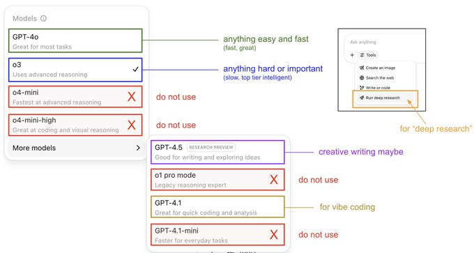

# @_avichawla on X

> 原文链接: https://x.com/_avichawla
> 作者: [Avi Chawla](https://x.com/_avichawla)
> Daily tutorials and insights on DS, ML, LLMs, and RAGs • Co-founder @dailydoseofds_ • IIT Varanasi • ex-AI Engineer @ MastercardAI

---
## Recent tweets

**Avi Chawla** [@_avichawla](https://x.com/_avichawla) · [2025-04-13](https://x.com/_avichawla)

10 MCP, AI Agents, and RAG projects for AI Engineers (with code):

---

**Avi Chawla** [@_avichawla](https://x.com/_avichawla) · [2026-05-05](https://x.com/_avichawla)

Layers of observability in AI systems, explained visually:

If you’re deploying LLM-powered apps to real users, you need to know what’s happening inside your pipeline at every step.

Here’s the mental model (see the attached diagram):

Think of your AI pipeline as a series of

---

**Avi Chawla** [@_avichawla](https://x.com/_avichawla) · [2026-05-06](https://x.com/_avichawla)

A time-complexity cheat sheet of 10 ML algorithms:

What's the inference time-complexity of KMeans?

---

**Avi Chawla** [@_avichawla](https://x.com/_avichawla) · [2026-05-03](https://x.com/_avichawla)

The most comprehensive RL overview I've ever seen.

Kevin Murphy from Google DeepMind, who has over 128k citations, wrote this.

What makes this different from other RL resources:

→ It bridges classical RL with the modern LLM era:

There's an entire chapter dedicated to "LLMs

