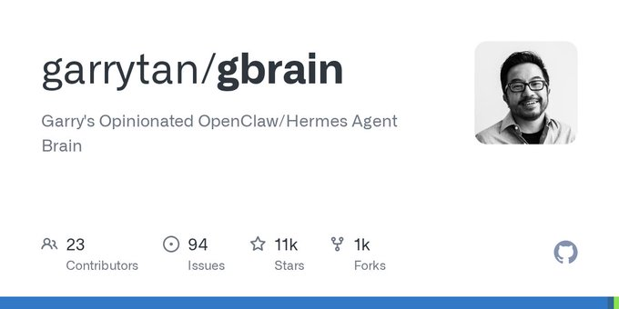
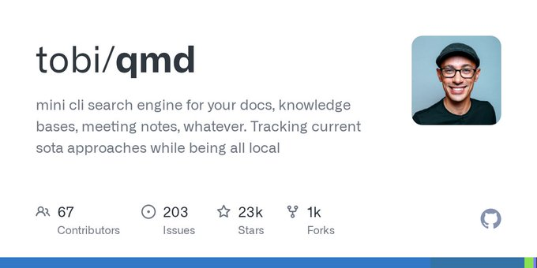
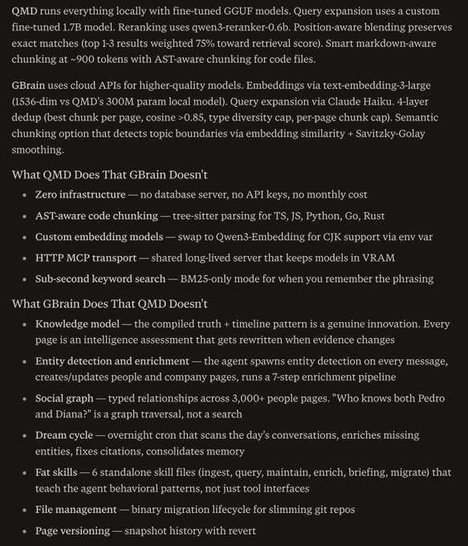

# (20) X 上的 Garry Tan：“If you want your OpenClaw or Hermes Agent to be able to have perfect total recall of all 10,000+ markdown files, GBrain is here to help. It's exactly my OpenClaw/Hermes Agent setup. MIT-licensed open source. Hope it helps you build your mini-AGI. https://t.co/yFpFU4pn5b” / X

> 原文链接: https://x.com/garrytan/status/2042497872114090069?s=12&t=NY2Gen7OO07bmDYBV03nRg

---

## 帖子

## 对话

[

Garry Tan

](/garrytan)

[

@garrytan

](/garrytan)

点击 订阅 到 garrytan

If you want your OpenClaw or Hermes Agent to be able to have perfect total recall of all 10,000+ markdown files, GBrain is here to help. It's exactly my OpenClaw/Hermes Agent setup. MIT-licensed open source. Hope it helps you build your mini-AGI.

[

GitHub - garrytan/gbrain: Garry's Opinionated OpenClaw/Hermes Agent Brain

](https://t.co/yFpFU4pn5b)

[来自 github.com](https://t.co/yFpFU4pn5b)

[下午3:00 · 2026年4月10日](/garrytan/status/2042497872114090069)

·

[

106.9万

查看](/garrytan/status/2042497872114090069/analytics)

[查看引用](/garrytan/status/2042497872114090069/quotes)

发布你的回复

[

Jonathan Tsai

](/jontsai)

[

@jontsai

](/jontsai)

·

[4月10日](/jontsai/status/2042621259541024940)

Have you tried out qmd at any point before you built GBrain?

[

GitHub - tobi/qmd: mini cli search engine for your docs, knowledge bases, meeting notes, whatever....

](https://t.co/nrl8UCSXVh)

[来自 github.com](https://t.co/nrl8UCSXVh)

[

3.3万

](/jontsai/status/2042621259541024940/analytics)

[

Garry Tan

](/garrytan)

[

@garrytan

](/garrytan)

·

[4月10日](/garrytan/status/2042622100759024081)

Yeah I just wanted something that fit my needs instead, tobi is a mega G

[

1.9万

](/garrytan/status/2042622100759024081/analytics)

[

anita

](/anitakirkovska)

[

@anitakirkovska

](/anitakirkovska)

·

[4月10日](/anitakirkovska/status/2042571074416636201)

Garry why do you use both?

[

1万

](/anitakirkovska/status/2042571074416636201/analytics)

[

Garry Tan

](/garrytan)

[

@garrytan

](/garrytan)

·

[4月10日](/garrytan/status/2042607098534727822)

OpenClaw is fun and fast and walks on water but crashes Hermes does feel more solid and might be better for the median user but is slightly less ADHD and more autism

[

1万

](/garrytan/status/2042607098534727822/analytics)

[

Nik Sharma

](/mrsharma)

[

@mrsharma

](/mrsharma)

·

[4月11日](/mrsharma/status/2042710444323016826)

Garry this is epic!! Added to my OpenClaw in 3 phases and boom!

[

3,539

](/mrsharma/status/2042710444323016826/analytics)

[

Garry Tan

](/garrytan)

[

@garrytan

](/garrytan)

·

[4月12日](/garrytan/status/2043012224135131226)

Amazing hope you are enjoying it! The last new version 0.7 is a banger and adds Twilio chat with your OpenClaw

[

2,082

](/garrytan/status/2043012224135131226/analytics)

[

Jeffery Kaneda　金田達也

](/JefferyTatsuya)

[

@JefferyTatsuya

](/JefferyTatsuya)

·

[4月10日](/JefferyTatsuya/status/2042503750057935098)

Are you using search methods other than qmd?

[

1万

](/JefferyTatsuya/status/2042503750057935098/analytics)

[

Garry Tan

](/garrytan)

[

@garrytan

](/garrytan)

·

[4月10日](/garrytan/status/2042510389846642885)

[

1万

](/garrytan/status/2042510389846642885/analytics)

[

nait jones

](/NaithanJones)

[

@NaithanJones

](/NaithanJones)

·

[4月10日](/NaithanJones/status/2042618651962929281)

Have you looked at Obsidian?

[

6,931

](/NaithanJones/status/2042618651962929281/analytics)

[

Garry Tan

](/garrytan)

[

@garrytan

](/garrytan)

·

[4月10日](/garrytan/status/2042618939784728800)

Yeah it's good and it's a view, but just like I don't open VSCode anymore... so too do I not really edit or view my files directly anymore

[

6,680

](/garrytan/status/2042618939784728800/analytics)

[

jaxn

](/jackson_felty)

[

@jackson_felty

](/jackson_felty)

·

[4月10日](/jackson_felty/status/2042507944177340605)

I've found QMD 2.0 to work really well without having to do a local vector db - have you tried that?

[

1.8万

](/jackson_felty/status/2042507944177340605/analytics)

[

Garry Tan

](/garrytan)

[

@garrytan

](/garrytan)

·

[4月10日](/garrytan/status/2042510155536073200)

[

1.5万

](/garrytan/status/2042510155536073200/analytics)

## 当前趋势

有什么新鲜事

美食 趋势

#NattyStash

美国 的趋势

Centel

美国 的趋势

Cheryl Hines

美国 的趋势

Meghan McCain

[

显示更多

](/explore/tabs/for-you)
