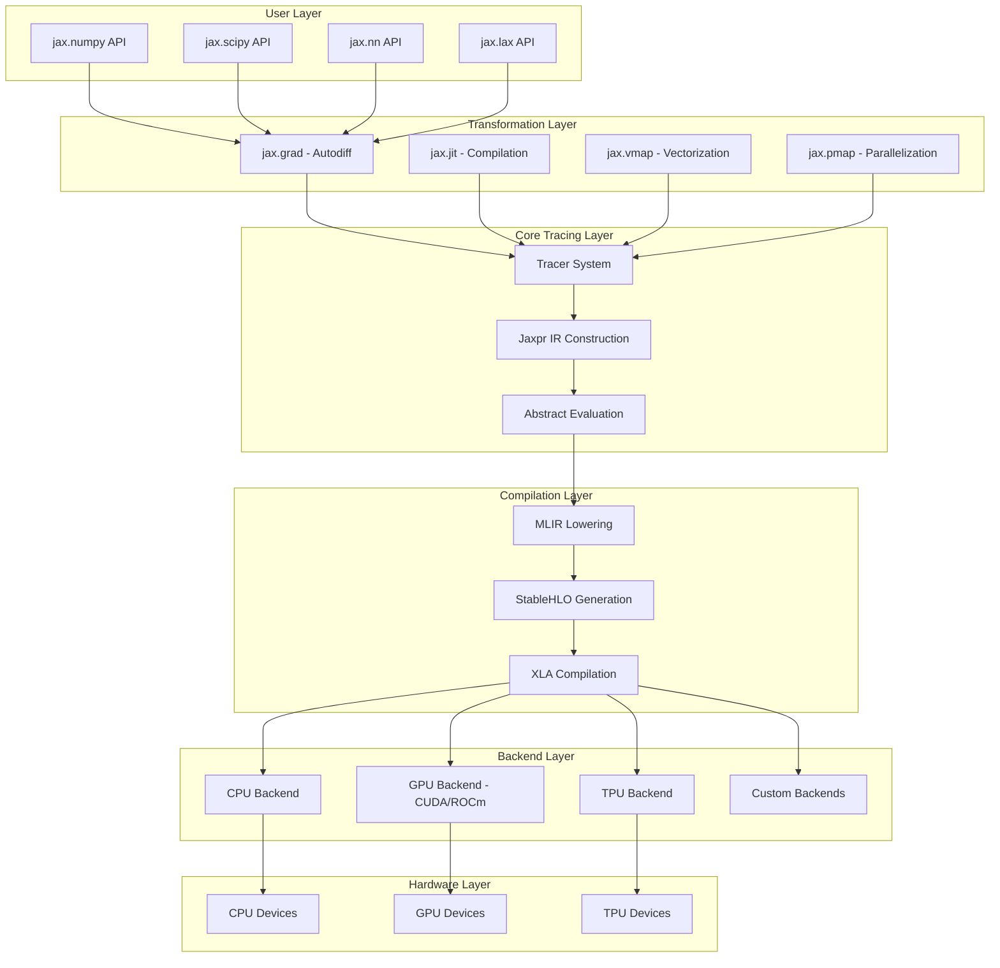

# 1. Overview: What is JAX?

> 原文链接: https://wiki.litenext.digital/wiki/jax?file=01-overview

---

## Introduction

JAX is a Python library for accelerator-oriented array computation and program transformation, designed for high-performance numerical computing and large-scale machine learning. At its core, JAX is an extensible system for composable function transformations that can automatically differentiate native Python and NumPy functions, compile them for hardware accelerators, and scale them across thousands of devices.

The library was developed at Google Research and represents an evolution of the Autograd project. JAX provides a familiar NumPy-compatible API while adding powerful capabilities that make it ideal for scientific computing and machine learning research. Unlike traditional frameworks, JAX is designed around the principle of composable transformations, where operations like differentiation, compilation, and vectorization can be freely combined in any order.

JAX uses XLA (Accelerated Linear Algebra) to compile and scale NumPy programs on TPUs, GPUs, and other hardware accelerators. This combination of familiar APIs, powerful transformations, and hardware acceleration makes JAX particularly well-suited for research in machine learning, scientific computing, and high-performance numerical analysis.

**Source**: `README.md:19-40`, which describes JAX as "a Python library for accelerator-oriented array computation and program transformation"

---

## Key Features

JAX's design centers around several core capabilities that distinguish it from other numerical computing frameworks:

### Composable Function Transformations

JAX provides an extensible system of function transformations that can be freely composed. The primary transformations are:

-   **`jax.grad`**: Automatic differentiation for computing gradients
-   **`jax.jit`**: Just-in-time compilation using XLA
-   **`jax.vmap`**: Automatic vectorization (batching)
-   **`jax.pmap`**: Parallel mapping across multiple devices

These transformations can be composed arbitrarily. For example, you can JIT-compile a gradient function, or vectorize a compiled function, or differentiate a parallelized computation. This composability is a fundamental design principle that sets JAX apart.

**Source**: `README.md:70-71`, `jax/_src/api.py:15-22`

### Automatic Differentiation

JAX can automatically differentiate native Python and NumPy functions through loops, branches, recursion, and closures. It supports both:

-   **Reverse-mode differentiation** (backpropagation) via `jax.grad`
-   **Forward-mode differentiation** for Jacobian-vector products
-   **Higher-order derivatives** of arbitrary order

The automatic differentiation system can handle complex control flow including conditionals and loops, making it more flexible than computational graph-based approaches.

**Source**: `README.md:22-27`

### XLA Compilation

JAX uses XLA to compile Python functions end-to-end for execution on accelerators. The compilation process:

1.  Traces Python functions to an intermediate representation (Jaxpr)
2.  Lowers Jaxpr to MLIR/StableHLO
3.  Compiles to optimized device code via XLA
4.  Caches compiled executables for reuse

This compilation enables kernel fusion, memory optimization, and hardware-specific code generation for CPUs, GPUs, and TPUs.

**Source**: `README.md:29-32`

### Hardware Acceleration

JAX provides seamless execution on multiple hardware platforms:

-   **CPU**: Native support with LAPACK/BLAS integration
-   **NVIDIA GPU**: CUDA backend with cuDNN acceleration
-   **AMD GPU**: ROCm backend support
-   **Google TPU**: First-class TPU support with custom kernels
-   **Custom backends**: Extensible plugin system

The same JAX code can run on any supported platform without modification.

**Source**: `README.md:226-235`

### Functional Programming Model

JAX enforces functional purity for transformed functions:

-   Functions should be side-effect free
-   No in-place array mutations
-   Pseudorandom number generation uses explicit PRNG keys
-   Stateful computation requires explicit state threading

This functional model enables safe transformation composition and parallel execution.

---

## Architecture Overview

JAX's architecture is organized in layers, each building on the abstractions provided by the layer below:



**Source**: Architecture derived from `jax/_src/core.py`, `jax/_src/api.py`, `jax/_src/interpreters/`, and compilation pipeline in `jax/_src/compiler.py`

### Layer Breakdown

1.  **User API Layer**: High-level NumPy/SciPy-compatible APIs that users interact with (`jax/numpy/`, `jax/scipy/`)

2.  **Transformation Layer**: Core transformations (grad, jit, vmap, pmap) that modify function behavior (`jax/_src/api.py`)

3.  **Tracing Layer**: Tracer system that intercepts array operations and builds intermediate representations (`jax/_src/core.py:96-150`)

4.  **Compilation Layer**: MLIR lowering and XLA compilation (`jax/_src/interpreters/mlir.py`, `jax/_src/compiler.py`)

5.  **Backend Layer**: Platform-specific execution engines (`jax/_src/xla_bridge.py`, `jaxlib/`)

6.  **Hardware Layer**: Physical compute devices (CPUs, GPUs, TPUs)

---

## Use Cases

JAX excels in several domains:

### Machine Learning Research

JAX's flexibility and performance make it ideal for ML research:

-   **Custom architectures**: Easy to implement novel model designs
-   **Algorithm development**: Rapid prototyping of new training methods
-   **Efficient experimentation**: Fast iteration with JIT compilation
-   **Distributed training**: Built-in multi-device and multi-host support

Notable ML frameworks built on JAX include Flax, Haiku, Optax, and others.

### Scientific Computing

JAX brings modern ML tools to scientific applications:

-   **Differentiable physics**: Automatic differentiation for physical simulations
-   **Optimization problems**: Gradient-based optimization at scale
-   **Numerical methods**: High-performance PDE solvers and integrators
-   **Inverse problems**: Differentiable forward models for parameter estimation

### High-Performance Computing

JAX enables efficient numerical computing:

-   **Large-scale linear algebra**: Distributed matrix operations
-   **Signal processing**: Vectorized transforms and filters
-   **Monte Carlo methods**: Parallel sampling and integration
-   **Data analysis**: Fast array operations on large datasets

---

## Comparison with Other Frameworks

### JAX vs NumPy

| Feature | NumPy | JAX |
| --- | --- | --- |
| **API Compatibility** | Reference implementation | NumPy-compatible |
| **Automatic Differentiation** | No  | Yes (grad, jacobian, hessian) |
| **JIT Compilation** | No  | Yes (XLA compilation) |
| **Hardware Acceleration** | CPU only | CPU, GPU, TPU |
| **Vectorization** | Manual broadcasting | Automatic with vmap |
| **Functional Purity** | Allows mutations | Requires pure functions |
| **PRNG** | Stateful | Stateless (key-based) |

**Source**: NumPy compatibility discussed in `README.md:44-58`

### JAX vs PyTorch

| Feature | PyTorch | JAX |
| --- | --- | --- |
| **Programming Model** | OOP with nn.Module | Functional programming |
| **Autodiff** | Eager + autograd tape | Trace-based transformation |
| **Compilation** | TorchScript, torch.compile | XLA (jit) |
| **Transformations** | Limited | Fully composable |
| **Multi-device** | DDP, FSDP | pmap, pjit with GSPMD |
| **Ecosystem** | Mature, extensive | Growing rapidly |

### JAX vs TensorFlow

| Feature | TensorFlow 2.x | JAX |
| --- | --- | --- |
| **API Style** | Keras + tf ops | NumPy-like |
| **Execution** | Eager + graph mode | Trace and compile |
| **Transformations** | Function decorators | Composable transforms |
| **XLA Integration** | Optional (jit\_compile) | Native (always via XLA) |
| **Flexibility** | High-level abstractions | Low-level control |
| **Production** | TensorFlow Serving | Export to StableHLO |

---

## Quick Start Example

Here's a complete example demonstrating JAX's key features:

```python
import jax
import jax.numpy as jnp

# Define a simple neural network predictor
def predict(params, inputs):
    """Forward pass through a neural network."""
    for W, b in params:
        outputs = jnp.dot(inputs, W) + b
        inputs = jnp.tanh(outputs)  # inputs to the next layer
    return outputs  # no activation on last layer

# Define a loss function
def loss(params, inputs, targets):
    """Mean squared error loss."""
    preds = predict(params, inputs)
    return jnp.sum((preds - targets)**2)

# Create a compiled gradient function
grad_loss = jax.jit(jax.grad(loss))

# Create a vectorized per-example gradient function
perex_grads = jax.jit(jax.vmap(jax.grad(loss), in_axes=(None, 0, 0)))

# Example usage
key = jax.random.key(0)
params = [
    (jax.random.normal(key, (3, 4)), jax.random.normal(key, (4,))),
    (jax.random.normal(key, (4, 1)), jax.random.normal(key, (1,))),
]
inputs = jax.random.normal(key, (10, 3))
targets = jax.random.normal(key, (10, 1))

# Compute gradients (compiled and cached)
grads = grad_loss(params, inputs, targets)

# Compute per-example gradients (vectorized and compiled)
per_ex = perex_grads(params, inputs, targets)
```

**Source**: Example adapted from `README.md:42-58`

This example demonstrates:

-   **NumPy-compatible API**: Using `jnp.dot`, `jnp.tanh`, etc.
-   **Automatic differentiation**: `jax.grad(loss)` computes gradients
-   **JIT compilation**: `jax.jit()` compiles for performance
-   **Vectorization**: `jax.vmap()` batches across examples
-   **Composition**: `jax.jit(jax.vmap(jax.grad(...)))` combines all three

---

## Transformation Examples

### Automatic Differentiation with grad

```python
import jax
import jax.numpy as jnp

def tanh(x):
    """Hyperbolic tangent function."""
    y = jnp.exp(-2.0 * x)
    return (1.0 - y) / (1.0 + y)

# First derivative
grad_tanh = jax.grad(tanh)
print(grad_tanh(1.0))  # 0.4199743

# Higher-order derivatives
print(jax.grad(jax.grad(jax.grad(tanh)))(1.0))  # 0.62162673

# Differentiate through control flow
def abs_val(x):
    if x > 0:
        return x
    else:
        return -x

abs_val_grad = jax.grad(abs_val)
print(abs_val_grad(1.0))   # 1.0
print(abs_val_grad(-1.0))  # -1.0
```

**Source**: Examples from `README.md:73-110`

### JIT Compilation

```python
import jax
import jax.numpy as jnp

def slow_f(x):
    """Element-wise operations benefit from fusion."""
    return x * x + x * 2.0

x = jnp.ones((5000, 5000))

# Compile the function
fast_f = jax.jit(slow_f)

# First call: traces and compiles (slower)
result = fast_f(x)

# Subsequent calls: uses cached executable (much faster)
result = fast_f(x)
```

**Source**: Example from `README.md:118-136`

### Vectorization with vmap

```python
import jax
import jax.numpy as jnp

def l1_distance(x, y):
    """Compute L1 distance between two 1D arrays."""
    assert x.ndim == y.ndim == 1
    return jnp.sum(jnp.abs(x - y))

def pairwise_distances(dist1D, xs):
    """Compute pairwise distances using vmap."""
    # vmap over both dimensions to create distance matrix
    return jax.vmap(jax.vmap(dist1D, (0, None)), (None, 0))(xs, xs)

xs = jax.random.normal(jax.random.key(0), (100, 3))
dists = pairwise_distances(l1_distance, xs)
print(dists.shape)  # (100, 100)
```

**Source**: Example from `README.md:154-168`

### Composing Transformations

```python
import jax

# Combine jit, vmap, and grad for efficient per-example gradients
per_example_grads = jax.jit(
    jax.vmap(
        jax.grad(loss),
        in_axes=(None, 0, 0)
    )
)
```

**Source**: Example from `README.md:173-175`

---

## Core Design Principles

### Functional Purity

JAX requires transformed functions to be functionally pure:

-   **No side effects**: Functions should not modify external state
-   **No in-place mutations**: Arrays are immutable (or appear so)
-   **Deterministic**: Same inputs always produce same outputs

This enables safe transformation and parallel execution.

### Composability

Transformations are designed to compose cleanly:

-   Any transformation can wrap any other transformation
-   Order of composition matters but is well-defined
-   Composed transformations maintain semantic clarity

Example: `jit(vmap(grad(f)))` compiles a vectorized gradient function.

### Explicitness

JAX favors explicit over implicit:

-   PRNG state is explicit (keys must be passed)
-   Device placement can be explicit (device\_put)
-   Sharding can be explicit (PartitionSpec)

This gives users fine-grained control when needed.

### Performance by Default

JAX is designed for performance:

-   XLA compilation optimizes for the target hardware
-   Lazy evaluation and fusion reduce memory traffic
-   Efficient primitives for common operations
-   Zero-copy device transfers when possible

**Source**: Design principles evident throughout `jax/_src/api.py:15-22` and JAX documentation

---

## Getting Started

To begin using JAX:

1.  **Install**: `pip install -U jax` (CPU) or `pip install -U "jax[cuda13]"` (GPU)
2.  **Import**: `import jax` and `import jax.numpy as jnp`
3.  **Use NumPy-like APIs**: Replace `np` with `jnp` in existing code
4.  **Add transformations**: Wrap functions with `jax.jit`, `jax.grad`, `jax.vmap`
5.  **Understand gotchas**: Read about functional purity and common pitfalls

**Source**: Installation instructions from `README.md:223-251`

See [Installation and Setup](02-installation-setup.md) for detailed instructions.

---

## Project Status

JAX is an active research project from Google, not an official Google product. Key points:

-   **Maturity**: Widely used in research and some production systems
-   **Stability**: Core APIs are stable; experimental features may change
-   **Development**: Active development with regular releases
-   **Community**: Growing ecosystem of libraries and tools
-   **Documentation**: Extensive official documentation and tutorials
-   **Support**: Community support via GitHub issues and discussions

**Sharp edges**: JAX has some rough edges and gotchas, particularly around functional purity, tracing, and dynamic shapes. Users should read the [Common Gotchas](https://docs.jax.dev/en/latest/notebooks/Common_Gotchas_in_JAX.html) guide.

**Source**: `README.md:37-40`

---

## System Requirements

JAX runs on multiple platforms with varying levels of support:

| Platform | CPU | NVIDIA GPU | Google TPU | AMD GPU | Apple GPU |
| --- | --- | --- | --- | --- | --- |
| Linux x86\_64 | ✓   | ✓   | ✓   | ✓   | n/a |
| Linux aarch64 | ✓   | ✓   | n/a | ✗   | n/a |
| macOS aarch64 | ✓   | n/a | n/a | n/a | experimental |
| Windows x86\_64 | ✓   | ✗   | n/a | ✗   | n/a |
| Windows WSL2 | ✓   | experimental | n/a | experimental | n/a |

**Source**: Platform support matrix from `README.md:226-235`

---

## Next Steps

Continue to the next sections to learn about:

-   [Installation and Setup](02-installation-setup.md) - Detailed installation guide
-   [Core Architecture](03-core-architecture.md) - Deep dive into JAX's design
-   [Transformation System](04-transformation-system.md) - How transformations work internally
-   [Jaxpr IR](05-jaxpr-ir.md) - JAX's intermediate representation

For usage tutorials and API reference, see the [official JAX documentation](https://jax.readthedocs.io/).
