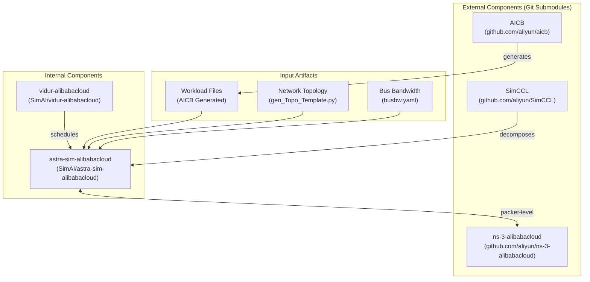
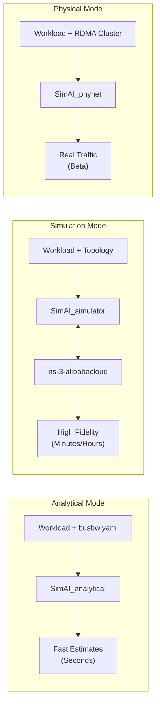

# SimAI Overview

> 原文链接: https://deepwiki.com/aliyun/SimAI/1-simai-overview

---

Relevant source files

-   [README.ja.md](https://github.com/aliyun/SimAI/blob/f5efb5a9/README.ja.md?plain=1)
-   [README.md](https://github.com/aliyun/SimAI/blob/f5efb5a9/README.md?plain=1)
-   [README_CN.md](https://github.com/aliyun/SimAI/blob/f5efb5a9/README_CN.md?plain=1)
-   [docs/images/simai_raw.png](https://github.com/aliyun/SimAI/blob/f5efb5a9/docs/images/simai_raw.png)
-   [docs/images/simai_topo.png](https://github.com/aliyun/SimAI/blob/f5efb5a9/docs/images/simai_topo.png)
-   [docs/images/simai_visual.png](https://github.com/aliyun/SimAI/blob/f5efb5a9/docs/images/simai_visual.png)

## Purpose and Scope

This document provides a high-level introduction to SimAI, a full-stack simulator for large-scale AI training and inference workloads. It covers the system's purpose, major components, operation modes, and usage scenarios. For architectural details, see [System Architecture](/aliyun/SimAI/1.1-system-architecture). For specific component deep-dives, see [Key Components](/aliyun/SimAI/1.2-key-components). For terminology and concepts, see [Key Concepts and Terminology](/aliyun/SimAI/1.3-key-concepts-and-terminology).

Sources: [README.md82-98](https://github.com/aliyun/SimAI/blob/f5efb5a9/README.md?plain=1#L82-L98)

## What is SimAI

SimAI is the industry's first full-stack, high-precision simulator for AI large-scale **inference** and **training**. It provides detailed modeling and simulation of the entire LLM lifecycle, encompassing the framework layer, collective communication layer, and network layer. [README.md84-86](https://github.com/aliyun/SimAI/blob/f5efb5a9/README.md?plain=1#L84-L86)

The system enables researchers to:

-   Analyze inference/training process details with cycle-accurate precision. [README.md88](https://github.com/aliyun/SimAI/blob/f5efb5a9/README.md?plain=1#L88-L88)
-   Evaluate time consumption of AI tasks under specific hardware and software conditions. [README.md89](https://github.com/aliyun/SimAI/blob/f5efb5a9/README.md?plain=1#L89-L89)
-   Evaluate end-to-end performance gains from algorithmic optimizations including:
    -   Framework parameter settings (batch size, parallelism strategies). [README.md91](https://github.com/aliyun/SimAI/blob/f5efb5a9/README.md?plain=1#L91-L91)
    -   Collective communication algorithms (Ring, Tree, NVLS). [README.md92](https://github.com/aliyun/SimAI/blob/f5efb5a9/README.md?plain=1#L92-L92)
    -   NCCL environment variables. [README.md93](https://github.com/aliyun/SimAI/blob/f5efb5a9/README.md?plain=1#L93-L93)
    -   Network protocols and congestion control (RDMA, DCQCN, HPCC). [README.md94-95](https://github.com/aliyun/SimAI/blob/f5efb5a9/README.md?plain=1#L94-L95)
    -   Scale-up/out network topology modifications. [README.md97](https://github.com/aliyun/SimAI/blob/f5efb5a9/README.md?plain=1#L97-L97)

SimAI has been accepted by NSDI'25 Spring and is used for both academic research and industrial AI infrastructure optimization. [README.md8](https://github.com/aliyun/SimAI/blob/f5efb5a9/README.md?plain=1#L8-L8)

Sources: [README.md84-98](https://github.com/aliyun/SimAI/blob/f5efb5a9/README.md?plain=1#L84-L98) [README.md8](https://github.com/aliyun/SimAI/blob/f5efb5a9/README.md?plain=1#L8-L8)

## Component Architecture

SimAI consists of five major components that can be combined to achieve different functionalities.

**Component Roles**:

| Component | Repository / Path | Primary Purpose |
| --- | --- | --- |
| **AICB** | [github.com/aliyun/aicb](https://github.com/aliyun/SimAI/blob/f5efb5a9/github.com/aliyun/aicb) | AI Communication Benchmark - models compute/communication patterns and generates workload files. [README.md103](https://github.com/aliyun/SimAI/blob/f5efb5a9/README.md?plain=1#L103-L103) |
| **SimCCL** | [github.com/aliyun/SimCCL](https://github.com/aliyun/SimAI/blob/f5efb5a9/github.com/aliyun/SimCCL) | Simulated CCL - decomposes collective operations into point-to-point communication sets. [README.md104](https://github.com/aliyun/SimAI/blob/f5efb5a9/README.md?plain=1#L104-L104) |
| **astra-sim-alibabacloud** | [astra-sim-alibabacloud/](https://github.com/aliyun/SimAI/blob/f5efb5a9/astra-sim-alibabacloud/) | Core engine - coordinates workload execution and implements NCCL-style algorithms. [README.md105](https://github.com/aliyun/SimAI/blob/f5efb5a9/README.md?plain=1#L105-L105) |
| **ns-3-alibabacloud** | [github.com/aliyun/ns-3-alibabacloud](https://github.com/aliyun/SimAI/blob/f5efb5a9/github.com/aliyun/ns-3-alibabacloud) | Network simulator - provides fine-grained packet-level network modeling. [README.md106](https://github.com/aliyun/SimAI/blob/f5efb5a9/README.md?plain=1#L106-L106) |
| **vidur-alibabacloud** | [vidur-alibabacloud/](https://github.com/aliyun/SimAI/blob/f5efb5a9/vidur-alibabacloud/) | Request scheduler - manages multi-request inference workloads (adapted from Microsoft Vidur). [README.md23](https://github.com/aliyun/SimAI/blob/f5efb5a9/README.md?plain=1#L23-L23) |

Sources: [README.md102-114](https://github.com/aliyun/SimAI/blob/f5efb5a9/README.md?plain=1#L102-L114) [README.md23](https://github.com/aliyun/SimAI/blob/f5efb5a9/README.md?plain=1#L23-L23)

## Operation Modes

SimAI provides three primary operation modes with varying fidelity and speed trade-offs:

### Mode Comparison

| Mode | Fidelity | Speed | Use Case | Network Modeling |
| --- | --- | --- | --- | --- |
| **Analytical** | Low-Medium | Fast | Rapid parameter sweeps | Bus bandwidth abstraction via `busbw.yaml`. [README.md121](https://github.com/aliyun/SimAI/blob/f5efb5a9/README.md?plain=1#L121-L121) |
| **Simulation** | High | Slow | Detailed bottleneck analysis | Full-stack packet-level modeling via NS-3. [README.md123](https://github.com/aliyun/SimAI/blob/f5efb5a9/README.md?plain=1#L123-L123) |
| **Physical** (Beta) | Real Hardware | Real-time | NIC behavior study | Actual RDMA traffic generation on CPU clusters. [README.md125](https://github.com/aliyun/SimAI/blob/f5efb5a9/README.md?plain=1#L125-L125) |

Sources: [README.md121-125](https://github.com/aliyun/SimAI/blob/f5efb5a9/README.md?plain=1#L121-L125)

## Usage Scenarios

SimAI supports seven distinct usage scenarios that combine components in different ways:

| Scenario | Description | Component Combination |
| --- | --- | --- |
| **1\. AICB Test Suite** | Run communication patterns on actual GPU clusters | [AICB](https://github.com/aliyun/SimAI/blob/f5efb5a9/AICB) |
| **2\. AICB Workload** | Model compute/comm patterns to generate workloads | [AICB](https://github.com/aliyun/SimAI/blob/f5efb5a9/AICB) |
| **3\. Collective Analysis** | Decompose collectives into P2P primitives | [SimCCL](https://github.com/aliyun/SimAI/blob/f5efb5a9/SimCCL) |
| **4\. GPU-less Comm** | Run RDMA collective traffic on non-GPU clusters | AICB + SimCCL + astra-sim (physical) |
| **5\. SimAI-Analytical** | Fast analysis ignoring underlying network details | AICB + astra-sim (analytical) |
| **6\. SimAI-Simulation** | Full-stack simulation on any server | AICB + SimCCL + astra-sim (simulation) + NS-3 |
| **7\. Multi-Request Inference** | Production-like serving simulation | AICB + SimCCL + Vidur + astra-sim |

Sources: [README.md127-134](https://github.com/aliyun/SimAI/blob/f5efb5a9/README.md?plain=1#L127-L134)

## Latest Capabilities (SimAI 1.5 & 1.6)

Recent updates have significantly expanded SimAI's capabilities in the inference domain:

-   **Multi-Request Inference (v1.5)**: End-to-end simulation for multi-request workloads using `vidur-alibabacloud` for request scheduling. [README.md19-23](https://github.com/aliyun/SimAI/blob/f5efb5a9/README.md?plain=1#L19-L23)
-   **Advanced Memory Modeling (v1.6)**: GPU memory modeling for inference including parameter counting and KV cache management. [README.md14-15](https://github.com/aliyun/SimAI/blob/f5efb5a9/README.md?plain=1#L14-L15)
-   **Prefill-Decode Disaggregation**: Independent memory budgets and planning for prefill and decode phases. [README.md17](https://github.com/aliyun/SimAI/blob/f5efb5a9/README.md?plain=1#L17-L17)
-   **Modern Model Support**: Native support for generating workloads for DeepSeek, Qwen3-MoE, and Qwen3-Next. [README.md25](https://github.com/aliyun/SimAI/blob/f5efb5a9/README.md?plain=1#L25-L25)

Sources: [README.md12-25](https://github.com/aliyun/SimAI/blob/f5efb5a9/README.md?plain=1#L12-L25)

## Getting Started

To begin using SimAI:

1.  **Setup**: Clone the repository and initialize submodules. See [Installation and Building](/aliyun/SimAI/2.1-installation-and-building).
2.  **Generate Workload**: Use AICB to profile your model or use existing templates. See [Workload Specification](/aliyun/SimAI/8-workload-specification).
3.  **Configure Network**: For simulation mode, generate a topology using `gen_Topo_Template.py`. See [Network Topologies](/aliyun/SimAI/7-network-topologies).
4.  **Run**: Execute the `SimAI_analytical` or `SimAI_simulator` binaries. See [Quick Start Guide](/aliyun/SimAI/2.2-quick-start-guide).

Sources: [README.md76-80](https://github.com/aliyun/SimAI/blob/f5efb5a9/README.md?plain=1#L76-L80)
