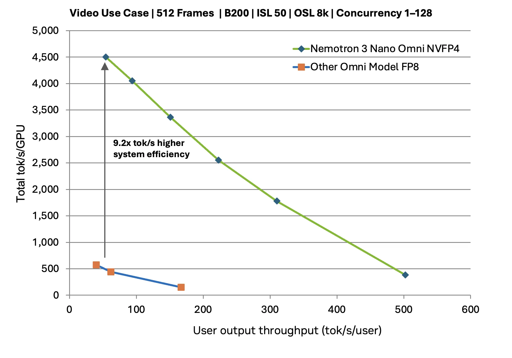
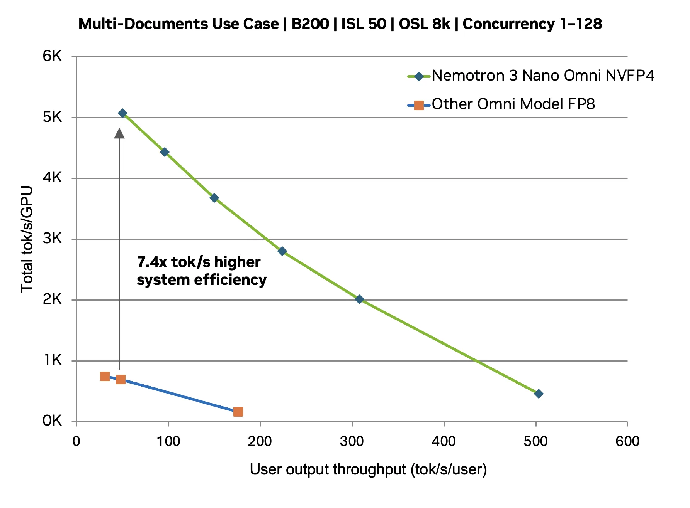
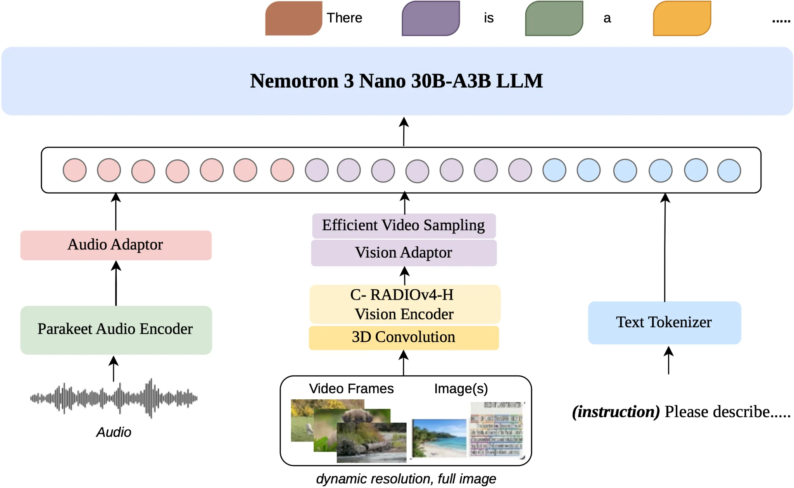

# NVIDIA Nemotron 3 Nano Omni Powers Multimodal Agent Reasoning in a Single Efficient Open Model

> 原文链接: https://developer.nvidia.com/blog/nvidia-nemotron-3-nano-omni-powers-multimodal-agent-reasoning-in-a-single-efficient-open-model/
> 发表于: 2026-04-28
> Agentic systems often reason across screens, documents, audio, video, and text within a single perception‑to‑action loop. However, they still rely on fragmented model chains—separate stacks for vision…

---
Agentic systems often reason across screens, documents, audio, video, and text within a single perception‑to‑action loop. However, they still rely on fragmented model chains—separate stacks for vision, audio, and text. This increases inference hops and orchestration complexity, driving up inference costs while weakening cross-modal context consistency.

[NVIDIA Nemotron 3 Nano Omni](https://huggingface.co/nvidia/Nemotron-3-Nano-Omni-30B-A3B-Reasoning-BF16), a new addition to the [Nemotron 3 family](https://huggingface.co/collections/nvidia/nvidia-nemotron-v3), brings unified multimodal reasoning into a single, highly efficient open model. Built to replace fragmented vision‑language‑audio stacks, Nemotron 3 Nano Omni functions as the multimodal perception and context sub‑agent within agentic systems. 

With this, agents can perceive and reason across visual, audio, and textual inputs within a single shared perception‑to‑action loop, improving convergence and reducing orchestration complexity and inference cost.

It delivers best-in-class accuracy on document intelligence leaderboards such as [MMlongbench-Doc](https://huggingface.co/spaces/OpenIXCLab/mmlongbench-doc) and [OCRBenchV2](https://99franklin.github.io/ocrbench_v2/), while also leading in video and audio understanding, [WorldSense](https://jaaackhongggg.github.io/WorldSense/#leaderboard), [DailyOmni](https://lliar-liar.github.io/Daily-Omni/#leaderboard), and [VoiceBench](https://matthewcym.github.io/VoiceBench/).

Beyond accuracy, MediaPerf—an open industry benchmark that evaluates video understanding models on real media data and production tasks across quality, cost, and throughput—shows Nemotron 3 Nano Omni achieving the highest throughput across every task and the lowest inference cost for video-level tagging. Read [this post](https://www.coactive.ai/blog/mediaperf-nvidia-omni) to learn more.

Built on a 30B‑A3B hybrid mixture‑of‑experts (MoE) architecture, Nemotron 3 Nano Omni activates the expert required for each task and modality, for high throughput and strong multimodal performance at scale. With fully open weights, datasets, and recipes, developers can customize, deploy, and integrate multimodal sub‑agents across local, cloud, and enterprise environments.

*Video 1. NVIDIA Nemotron 3 Nano Omni unifies video, audio, image, and text in an open MoE architecture*

## Best-in-class efficiency and accuracy

Nemotron 3 Nano Omni supports hardware-aware optimized inference across multiple GPU architectures, including NVIDIA Ampere, NVIDIA Hopper, and NVIDIA Blackwell GPU families, and for popular inference engines, including vLLM and NVIDIA TensorRT-LLM.

It supports [FP8 and NVFP4 quantization](https://docs.nvidia.com/deeplearning/transformer-engine/user-guide/examples/fp8_primer.html), efficient video sampling, and NVIDIA‑optimized kernels to deliver predictable, low‑latency inference. Combined with convolutional 3D‑based temporal‑spatial processing, these optimizations enable sustained multimodal perception with lower compute costs across GPUs—from workstations to data center and cloud deployments.

Designed to power sub‑agents, Nemotron 3 Nano Omni powers perception, context maintenance, and multimodal understanding within larger agent systems. It integrates cleanly with execution and planning models—such as NVIDIA Nemotron 3 Super and NVIDIA Nemotron 3 Ultra—keeping agent architectures modular, efficient, and scalable.

The following benchmarks evaluate performance under a fixed interactivity threshold—the points at which each user continues to experience responsive, real‑time interactions. Rather than maximizing raw concurrency, the evaluations hold per‑user throughput (tokens per second per user) constant on the x‑axis and measure how much total system throughput can be sustained without degrading the user experience.

*Figure 1. Total system throughput sustained by each model at a fixed per‑user interactivity threshold (tokens/sec/user)*

For video reasoning at the same interactivity threshold, Nemotron 3 Nano Omni sustains higher aggregate throughput, translating into up to ~9.2× greater effective system capacity compared to alternative open omni models.

For multi-document reasoning at the same interactivity threshold, Nemotron 3 Nano Omni sustains higher aggregate throughput, translating into up to ~7.4× greater effective system capacity compared to alternative open omni models.

On Blackwell GPUs, Nemotron 3 Nano Omni with NVFP4 quantization achieves the highest throughput among open omnimodal models for enterprise‑grade workloads involving complex documents, long‑horizon reasoning, and large video batches. These features make it well‑suited for agentic applications in finance, healthcare, scientific discovery, media and entertainment, and ad‑tech platforms that process high volumes of video and audio content at scale.

This improvement is not a synthetic benchmark artifact. It reflects the architectural efficiency of Nemotron 3 Nano Omni when deployed in real agentic workloads. By unifying multimodal perception into a single model loop and activating only the required experts per modality, it converts raw model efficiency into more concurrent agents, higher throughput, and lower cost per task—without sacrificing accuracy or responsiveness.

*Figure 3. Multimodal accuracy improved across industry-leading benchmarks from the previous Nemotron Nano VL V2 model to Nemotron 3 Nano Omni*

## What’s under the hood of Nemotron 3 Nano Omni?

Nemotron 3 Nano Omni is a lightweight, 30B-A3B model engineered for cross-modality reasoning with high throughput.

### Model design: Nemotron 3 Nano Omni architecture

The Nemotron 3 Nano Omni architecture brings multimodal perception and reasoning into a single 30B hybrid MoE model, natively supporting text, image, video, and audio inputs while maintaining a unified multimodal context across agent loops and eliminating the need for separate vision, speech, and language models.

-   **Hybrid MoE core architecture**: Combines Mamba layers for sequence and memory efficiency with transformer layers for precise reasoning. This design delivers higher throughput with up to 4x improved memory and compute efficiency, making it suitable for sub‑agent roles.
-   **Spatiotemporal visual processing and efficient video sampling**: To handle video frames effectively, Nemotron 3 Nano Omni uses 3D convolutions to capture motion between frames. The inference-time [Efficient Video Sampling (EVS) layer](https://arxiv.org/pdf/2510.14624) compresses the high-density visual tokens from multiple frames into a concise set that the [LLM](https://www.nvidia.com/en-us/glossary/large-language-models/) can process without overwhelming its context window. 
-   **Multimodal architecture**
    -   **Text**: The Nemotron 3 Nano Omni model uses a strong text model as the central decoder, preserving the foundation model’s language ability, and trains the cross-modality bridge around text described in detail in the following sections. This reduces multimodal training instability and cost, while providing the highest efficiency and accuracy for continuous perception tasks.
    -   **Audio**: NVIDIA Granary, Music Flamingo, Parakeet
        The integration of audio is built upon the NVIDIA Parakeet encoder and specialized datasets that move beyond simple transcription.
    -   **Visual**: C-RADIOv4-H and Encoder-based Video Summarization
        To handle high-resolution images and dynamic video, Nemotron 3 Nano Omni uses a tiered compression strategy.
        -   [C-RADIOv4-H](https://huggingface.co/nvidia/C-RADIOv4-H): Images are processed at high resolution using the C-RADIOv4-H foundation model. This serves as a robust vision encoder balancing high-resolution detail with efficient computation. It can focus on specific patches of a full image to maintain OCR precision.  

*Figure 4. Nemotron 3 Nano Omni Hybrid MoE Architecture for cross-modal integration*

### Training methodology: Cross-modality data and training

Trained on cross-modal data and instruction tuning, the Nemotron 3 Nano Omni model is designed for real-world agent environments. It follows instructions spanning image, video, audio, and text, functioning as a multimodal perception-and-context sub-agent within larger agentic systems. All stages are evaluated using the [NVIDIA NeMo Evaluator](https://github.com/NVIDIA-NeMo/Evaluator) library. 

-   **Adapter and encoder training**: Large‑scale data spanning documents, screenshots, audio, and video, enabling strong generalization across enterprise perception tasks.
-   **Supervised fine-tuning (SFT)**: ​​A multi-stage pipeline implemented with [NVIDIA Megatron-LM](https://github.com/nvidia/megatron-lm) that progressively expands modality coverage, starting with vision-language and audio encoders, then scaling context length (16K → 49K → 262K) to build unified cross-modal instruction-following capability.
-   **Post-SFT reinforcement learning**: Multi‑environment reinforcement learning across 25 environment configurations, using [NVIDIA NeMo Gym](https://docs.nvidia.com/nemo/gym/latest/about/index.html) and [NeMo RL](https://docs.nvidia.com/nemo/rl/latest/index.html), with more than 2.3M environment rollouts to improve robustness for multimodal tasks and agentic workflows.

## Open by design: Weights, data, and recipes

Nemotron 3 Nano Omni is built on a foundation of transparency, providing full access to weights, datasets, and training recipes. With this open source approach, developers can customize the model on-premises, ensuring peak performance without compromising privacy and security.

**Model weights**
Full parameter checkpoints for Nemotron 3 Nano Omni are available on [Hugging Face](https://huggingface.co/nvidia/Nemotron-3-Nano-Omni-30B-A3B-Reasoning-BF16), and the model will also be available as an [NVIDIA NIM microservice](https://build.nvidia.com/nvidia/nemotron-3-nano-omni-reasoning-30b-a3b). The NVIDIA Nemotron Open Model License gives enterprises the flexibility to maintain data control and deploy anywhere.

**End-to-end training and evaluation recipes**
The complete [pre-training](https://github.com/NVIDIA-NeMo/Megatron-Bridge/tree/main/examples/models/vlm/nemotron_3_omni), [post-training](https://github.com/NVIDIA-NeMo/RL/blob/nemotron-v3-nano-omni/docs/guides/), and [evaluation](https://github.com/NVIDIA-NeMo/Megatron-Bridge/tree/main/examples/models/vlm/nemotron_3_omni) recipe for Nemotron 3 Nano Omni is available, covering the full pipeline from pre-training through alignment. Developers can reproduce the training, adapt the recipe for domain-specific variants, or use it as a starting point for their own hybrid architecture research.

**Deployment cookbooks and recipes**
Check out these ready-to-use cookbooks for major inference engines, each with configuration templates, performance tuning guidance, and reference scripts:

-   [vLLM Cookbook](https://github.com/NVIDIA-NeMo/Nemotron/blob/main/usage-cookbook/Nemotron-3-Nano-Omni/vllm_cookbook.ipynb): High-throughput continuous batching and streaming for Nemotron 3 Nano Omni.
-   [SGLang Cookbook](https://github.com/NVIDIA-NeMo/Nemotron/blob/main/usage-cookbook/Nemotron-3-Nano-Omni/sglang_cookbook.ipynb): Fast, lightweight inference optimized for multi-agent tool-calling workloads.
-   [NVIDIA TensorRT LLM Cookbook](https://github.com/NVIDIA-NeMo/Nemotron/blob/main/usage-cookbook/Nemotron-3-Nano-Omni/trtllm_cookbook.ipynb): Fully optimized TensorRT LLM engines with latent MoE kernels for production-grade, low-latency deployment.
-   [Dynamo deployment recipes:](https://github.com/ai-dynamo/dynamo/tree/main/recipes/nemotron-3-nano-omni) Disaggregated serving, intelligent routing, multi-tier KV caching, and automatic scaling support for multimodal Nemotron 3 Nano Omni.

**Fine-tuning cookbooks and recipes**
Cookbooks for different training stages, each with configuration templates, performance tuning guidance, and reference scripts, are also available:

-   End-to-end multi-modality document intelligence [cookbook](https://github.com/NVIDIA-NeMo/Nemotron/tree/main/usage-cookbook/Nemotron-3-Nano-Omni/doc-intelligence-with-parse) using Nemotron 3 Nano Omni.
-   LoRA SFT on Nemotron 3 Nano Omni using NVIDIA [NeMo Megatron-Bridge](https://github.com/NVIDIA-NeMo/Nemotron/tree/main/usage-cookbook/Nemotron-3-Nano-Omni/Megatron-bridge).
-   LoRA SFT on Nemotron 3 Nano Omni using NVIDIA [NeMo Automodel](https://github.com/NVIDIA-NeMo/Nemotron/tree/main/usage-cookbook/Nemotron-3-Nano-Omni/automodel).
-   GRPO/MPO on Nemotron 3 Nano Omni using NeMo RL [recipe](https://github.com/NVIDIA-NeMo/RL/blob/nano-v3-omni/docs/guides/nemotron-3-nano-omni.md) and [cookbook](https://github.com/NVIDIA-NeMo/Nemotron/tree/main/usage-cookbook/Nemotron-3-Nano-Omni/grpo_nemo_gym).

**Open datasets**
With Nemotron 3 Nano and Nemotron 3 Super, NVIDIA released the most comprehensive open data stack in the industry for text-based agentic AI with: 10T+ pretraining tokens, 40M+ post-training samples, over 20 RL environment configurations, and full training recipes, all openly available. 

Nemotron 3 Nano Omni extends that commitment from text to multimodal, delivering the same level of openness across text, audio, image, and video.

-   **Adapter and encoder training scale**: ~127B tokens across mixed modalities spanning text+image, text+video, text+audio, and text+video+audio—reflecting real-world, contextualized interactions versus single-modality data.
-   **Post-training for real-world tasks**: ~124M curated examples across multimodal combinations (text+audio, text+image, text+video, and text+video+audio), structured to support document reasoning, computer use, and long-horizon workflows.
-   **RL environments for agent training**: 20 RL datasets across 25 environments covering 5 new multimodal tasks—visual grounding, chart and document understanding, vision-critical STEM problems, video understanding, and automatic speech recognition—extending Nemotron’s RL pipeline beyond text into vision and audio.

**NVIDIA NeMo Data Designer synthetic data generation**

Synthetic data generation (SDG) [pipelines](https://github.com/NVIDIA-NeMo/DataDesigner/tree/main/docs/assets/recipes/vlm_long_doc) built with NVIDIA [NeMo Data Designer](https://github.com/NVIDIA-NeMo/DataDesigner) to post-train Nemotron 3 Nano Omni on complex long-document understanding tasks are also available. Through iterative pipeline development, training, and failure analysis, a series of pipelines generating ~11.4M synthetic visual question-answer pairs (~45B tokens) were incorporated into the final training blend for Nemotron 3 Nano Omni.  

Read a [deep dive](https://nvidia-nemo.github.io/DataDesigner/latest/devnotes/training-a-vlm-to-understand-long-documents-an-iterative-sdg-story/) into the iterative SDG methodology, what worked, what didn’t, and the set of pipeline recipes. The SDG pipelines are also available as data designer [recipes](https://github.com/NVIDIA-NeMo/DataDesigner/tree/main/docs/assets/recipes/vlm_long_doc).

The image training data is permissively released at [huggingface.co/datasets/nvidia/Nemotron-Image-Training-v3](http://huggingface.co/datasets/nvidia/Nemotron-Image-Training-v3). With the underlying image data and the model, developers can inspect, adapt, and extend multimodal training pipelines. For enterprises that have historically maintained siloed vision, speech, and document data stacks, Omni consolidates these into a single, production-ready foundation—lowering the barrier to deploying agentic AI across modalities.

## Claws powered by Nemotron 3 Nano Omni

When paired with the NVIDIA OpenShell runtime and various agent harnesses, Nemotron 3 Nano Omni changes interaction with video content:

-   **Native video understanding**: Unlike traditional systems that hallucinate based on transcriptions, Nemotron 3 Nano Omni uses a native visual-temporal pipeline (featuring 3D convolutions and efficient video sampling) to see what’s happening on screen. This enables near-instant, high-fidelity transcription and summarization that captures visual context—like charts or on-screen text—that audio-only models miss.

-   **Privacy-first claw agents**: By running this stack through NemoClaw, user video data never leaves local infrastructure. [NVIDIA NemoClaw](https://www.nvidia.com/en-us/ai/nemoclaw/) installs OpenClaw agents inside an [NVIDIA OpenShell](https://github.com/NVIDIA/OpenShell) sandboxed environment with a privacy router, ensuring that sensitive recordings remain secure, while Nemotron 3 Nano Omni-powered sub-agents complete specialized tasks for multimodal understanding.

-   **Precision question-answering**: With advanced multimodal reasoning, users can ask complex, open-ended questions about their videos. The agent uses Nemotron 3 Nano Omni’s long token context window to provide cited, accurate answers without losing the thread.

ead the following guides for more information on running Nemotron 3 Nano Omni with [OpenClaw](https://github.com/brevdev/nemoclaw-demos/tree/main/openclaw-omni-demo) and [Hermes Agent](https://github.com/brevdev/nemoclaw-demos/tree/main/hermes-omni-demo) in the NemoClaw sandbox with OpenShell. See the exact workflows in action, from local deployment to real-world video reasoning.

## Get started with Nemotron 3 Nano Omni 

Nemotron 3 Nano Omni is available now—an open, efficient multimodal model built to power sub-agents in agentic workloads. You can access it on:

-   [Hugging Face](https://huggingface.co/nvidia/Nemotron-3-Nano-Omni-30B-A3B-Reasoning-BF16) and [OpenRouter](https://openrouter.ai/nvidia/nemotron-3-nano-omni-30b-a3b-reasoning:free).
-   With [SGLang](https://github.com/NVIDIA-NeMo/Nemotron/blob/main/usage-cookbook/Nemotron-3-Nano-Omni/sglang_cookbook.ipynb) and [vLLM](https://github.com/NVIDIA-NeMo/Nemotron/blob/main/usage-cookbook/Nemotron-3-Nano-Omni/vllm_cookbook.ipynb) for inference.
-   Local runtimes and tools such as [Ollama](https://ollama.com/library/nemotron3), [llama.cpp](https://huggingface.co/collections/ggml-org/nvidia-nemotron-3-nano-omni-69ec6c1c304fadf9c981e349), [Inference Snaps](https://ubuntu.com/blog/nvidia-nemotron-3-nano-omni), [LM Studio](https://lmstudio.ai/models/nemotron-3-omni) and [Unsloth](https://unsloth.ai/docs/models/nemotron-3-nano-omni) for running GGUF checkpoints on-device.
-   Major cloud service providers, including [Amazon Web Services](https://aws.amazon.com/blogs/machine-learning/nvidia-nemotron-3-nano-omni-model-now-available-on-amazon-sagemaker-jumpstart/) and Oracle Cloud Infrastructure. Coming soon to Microsoft Foundry. Explore the model catalog and use Nemotron models directly in your [Azure environment](http://ai.azure.com).
-   Inference service providers such as [Baseten](https://www.baseten.co/blog/nvidia-nemotron-3-nano-omni/), [Canonical](https://ubuntu.com/blog/nvidia-nemotron-3-nano-omni), [Clarifai](https://www.clarifai.com/blog/nvidia-nemotron-3-nano-omni-on-clarifai-reasoning-engine-zero-day-support-at-400-tokens-per-second), [DeepInfra](https://deepinfra.com/blog/nvidia-nemotron-3-nano-omni-release), [Eigen AI](https://www.eigenai.com/blog/2026-04-28-eigenai-day-0-nvfp4-inference-nvidia-nemotron-nano-omni), [fal.AI,](https://fal.ai/learn/devs/nemotron-3-nano-omni-is-now-on-fal) [FriendliAI](https://friendli.ai/blog/nvidia-nemotron-3-nano-omni), and [Fireworks AI](https://app.fireworks.ai/models/fireworks/nvidia-nemotron-3-nano-omni-30b-a3b).
-   NVIDIA Cloud Partners, including [Bitdeer AI](https://www.bitdeer.ai/en/blog/bring-omni-modal-understanding-to-production-with-nvidia-nemotron-3-nano-omni-on-bitdeer-ai-cloud), [Crusoe](http://www.crusoe.ai/resources/blog/nvidia-nemotron-3-nano-omni-now-available), [DigitalOcean](https://investors.digitalocean.com/news/news-details/2026/DigitalOcean-Unveils-AI-Native-Cloud-Built-for-the-Inference-Era/default.aspx), [GMI Cloud](https://gmicloud.ai/en/blog/running-nvidia-nemotron-3-nano-omni-on-gmi-cloud), [Lightning AI](https://lightning.ai/blog/nvidia-nemotron-3-nano-omni), [Nebius](https://tokenfactory.nebius.com/models?search=Nemotron), [Together AI,](http://www.together.ai/blog/together-ai-brings-nvidia-nemotron-3-nano-omni-to-developers-on-day-0) and [Vultr](https://blogs.vultr.com/nvidia-nemotron-nano-3-omni).
-   [Dell Technologies](https://dell.huggingface.co/) for on-premises and hybrid enterprise deployments.
-   [NVIDIA NIM](https://build.nvidia.com/nvidia/nemotron-3-nano-omni-reasoning-30b-a3b) for an NVIDIA‑optimized experience, making it easy to launch optimized, portable inference directly from build.nvidia.com and run anywhere from a workstation to the cloud.
-   [NeMo Curator](https://github.com/NVIDIA-NeMo/Curator/tree/main) for video captioning pipelines using this [recipe](https://github.com/NVIDIA-NeMo/Curator/blob/main/tutorials/video/getting-started/video_split_clip_example.py).
-   [Jetson AI Lab](https://www.jetson-ai-lab.com/models/nemotron-3-nano-omni/) provides tutorials and model benchmarks for developers to run optimized Nemotron models that build robotics and edge AI applications.

For a deeper dive into the model architecture and design, read the [Nemotron 3 Nano Omni technical report](https://research.nvidia.com/labs/nemotron/files/NVIDIA-Nemotron-3-Omni-report.pdf).

*Stay up to date on* [*NVIDIA Nemotron*](https://www.nvidia.com/en-us/ai-data-science/foundation-models/nemotron/) *by subscribing to* [*NVIDIA news*](https://www.nvidia.com/en-us/ai-data-science/generative-ai/news/) *and following NVIDIA AI on* [*LinkedIn*](https://www.linkedin.com/showcase/nvidia-ai/posts/?feedView=all)*,* [*X*](https://x.com/NVIDIAAIDev)*,* [*Discord*](https://discord.com/invite/nvidiadeveloper)*, and* [*YouTube*](https://www.youtube.com/@NVIDIADeveloper)*.*

*Visit the* [*Nemotron developer page*](https://developer.nvidia.com/nemotron) *for resources to get started. Explore open Nemotron models and datasets on* [*Hugging Face*](https://huggingface.co/collections/nvidia/nvidia-nemotron-v3) *and* [*Blueprints*](https://build.nvidia.com/blueprints) *on* [*build.nvidia.com*](http://build.nvidia.com/)*.*

*Engage with* [*Nemotron livestreams*](https://www.youtube.com/playlist?list=PL5B692fm6--vEL0FwctKghCpyEnBGAQJA)*,* [*tutorials*](https://www.youtube.com/playlist?list=PL5B692fm6--vdRKB14FImVi7MTJ77zjn4)*, and the developer community on the* [*NVIDIA forum*](https://forums.developer.nvidia.com/c/ai-data-science/nvidia-nemotron/669) *and* [*Discord*](https://discord.com/invite/nvidiadeveloper)*.*
