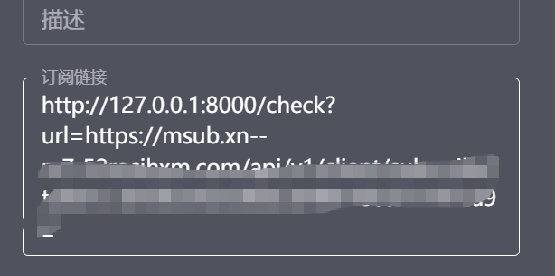
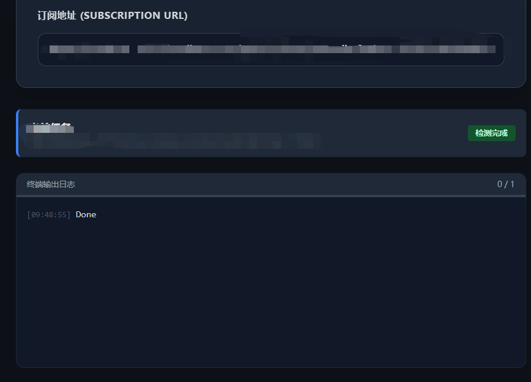

# [开源] 写了个 Clash 批量IP检测节点重命名工具： IP 纯净度 + Bot 比例 + IP属性来源

> 原文链接: https://linux.do/t/topic/1305514
> 主题元信息: 共 41 楼 · 1475 浏览 · 93 点赞 · 标签 软件开发, 配置优化

---

## #1 @imfine · 2025-12-13

### 2.0更新 (2026-01-11)

-   **Web UI**: 全新推出 Web 可视化界面配置检测，操作更便捷。
-   **多源检测**: 新增 `Ping0` 检测源 支持共享人数，与 `ippure` 互补，并设为默认（速度与信息量平衡更佳）。
-   **智能降级**: 新增 `Fallback` 机制，例如：Ping0 失败时自动切换至 IPPure。
-   **极速默认**: 极速模式 (`fast_mode`) 默认开启，大幅提升批量检测效率。
-   **单点重测**: Web 界面支持对单个节点进行重新检测，方便复核。
-   **导出增强**: 支持检测结果的实时预览、编辑和一键导出，一键导入Clash
    

* * *

### 12.18更新：

之前分享的本地脚本受限于整体方案使用有点费劲，但没想到开源后挺多人点赞有点受宠若惊，一直思考如何优化，后来与IPPure沟通更新了API模式，效率有了很大提升，评论区有很多人提了宝贵的意见，所以再更新一版Docker部署方案，一键替换订阅链接轻松使用

> 🔗 github.com — https://github.com/tombcato/clash-ip-checker/tree/docker

* * *

### 12.17更新：

更新官网展示：官网 [Clash IP Checker - 节点纯净度检测与标记](https://tombcato.github.io/clash-ip-checker/)
更新极速模式:high_voltage:：暂时默认 **关闭**，通过 IPPure API 直接检测，速度比浏览器模式快 10 倍以上！但缺少 Bot 比例分析，输出`【🟢 住宅|原生】`，可在config.yaml中设置`fast_mode = True`开启

* * *

## 正文

大家好，最近手里的节点有点杂，有些虽然能通但 IP 质量堪忧（老弹验证码）。找了很多网站查IP纯净度，最后发现这个IPPure（[https://ippure.com](https://ippure.com)）不错信息很全，于是随手写了个自动化工具 Clash IP Checker

核心痛点：不是单个节点的检测，而是测所有节点然后标记出来方便在使用时区分避免选到垃圾节点。

开源地址：

> 🔗 github.com — https://github.com/tombcato/clash-ip-checker

主要功能：
通过Clash外部控制自动切换 Clash 节点，基于 Playwright 模拟调用 IPPure，检测结果自动修改配置在节点名后加 Emoji 标记，最后输出yaml文件手动导入Clash即可

使用说明见README:

> 🔗 github.com/tombcato/clash-ip-checker — https://github.com/tombcato/clash-ip-checker/blob/main/README.md

标记：`【🟢🟡 属性|来源】`

-   **第 1 个 Emoji (:green_circle:)**: **IP 纯净度** (值越低越好，越低越像真实用户)
-   **第 2 个 Emoji (:yellow_circle:)**: **Bot 比例** (值越低越不容易被反爬，越高来自机器人的流量更大更容易弹验证)
-   **属性**: 机房、住宅
-   **来源**: 原生、广播

觉得好用的话求个 Star :glowing_star: 有 bug 欢迎提 issue！

## #2 @Godhelpsme · 2025-12-13

感谢分享！

## #3 @handsome (大帅哥) · 2025-12-13

感谢大佬！

## #4 @Zhliu0124 · 2025-12-13

非常方便！

## #5 @tonglinggejimo · 2025-12-13

感谢分享，之前一直想找一个类似功能的工具没找到，很方便，我在fclash上测试的，可用，好用

## #6 @wwwoook · 2025-12-13

有点笨重啊
还要上无头浏览器
本地更新也麻烦

小建议
最方便的是整个docker或者github-action跑着
丢个订阅进去返回处理过的订阅吧

## #7 @hj01857655 (DaChui) · 2025-12-13

不知道sparkle能不能用，试试

## #8 @BAFMUZ · 2025-12-13

楼主这个自由猫怎么样？魔法快过期了，最近在找新的呢 :blush:

## #9 @tdou (T) · 2025-12-13

感谢大佬 目前以尝试可以用

但是有个想法 是否可以改成api服务那种

* * *

1.  可以用docker部署
2.  可以实现 接口请求 传入订阅url ，然后开始检测 例如订阅url是 https//xxx.com/xxx [部署的项目是aaa.com/check?url=https//xxx.com/xxx](http://xn--aaa-888fy43egsa009by36afio.com/check?url=https//xxx.com/xxx)
    2.1 clash订阅写这个url，在部署项目时候可以通过配置设置检测间隔，

例如 检测间隔设置了1天， 订阅url有10个节点
然后 1天内请求 当天 只要检测过了就不会在检测 直接返回检测结果
第一次刷新时，假如没有完成 直接返回订阅url的结果
第二次刷新时，检测完成2个未完成8个 返回2个检查ok并改名+8个原配置
第三次刷新时，检查完成9个 未完成1个 返回9个检查ok并改名+1个原配置
第四次刷新时，检查全部完成，返回全部10个
第二天整点以后 第一次刷新 又触发重复检测

在docker中配置缓存目录可以按照订阅的url md5以后+最近一次检测的时间戳 做个文件标记
先判断时间是否符合规则，如果符合规则则直接继续检测，如果不符合规则则删除文件开始检测 并返回默认

4.  然后docker 里面可以内置个 clash内核 调用内核 做模拟 clash的操作

不知道这种是否可行

## #10 @sqkwater (喂我花生！) · 2025-12-13

太强了佬友

## #11 @jiuyue (玖月) · 2025-12-13

:bili_057:牛的 机场垃圾佬很有用（

## #12 @imfine · 2025-12-13 (回复 #6)

没找到稳定免费的api来获取这些信息，IPPure有api但是信息不全也有CF墙，所以我只能上无头了，简单request不行
更新确实是个问题 需要重新跑一边，我这边更新不频繁先暂时用着，研究下你说的处理订阅的方案

## #13 @imfine · 2025-12-13 (回复 #7)

试试能用不 :joy:

## #14 @imfine · 2025-12-13 (回复 #8)

节点还挺好的 就是有时候会全红 我还有便宜的良心云跑了下节点纯净度全是危险 :joy:

## #15 @imfine · 2025-12-13 (回复 #5)

我也找了没找到就vibecoding了一个 :laughing:

## #16 @beihai · 2025-12-13

感谢分享

## #17 @imfine · 2025-12-13 (回复 #11)

哈哈哈我就是垃圾佬用垃圾节点才开发的这个 :rofl:

## #18 @imfine · 2025-12-13 (回复 #9)

很强！ 我研究下你说的方案试试

## #19 @tdou (T) · 2025-12-13 (回复 #9)

> *@imfine 引用：*
>
> 还挺好的 就是有时候会全红 我还有便宜的良心

docker 内例如模拟一个ubuntu linux 系统 系统可以安装clash 或者其他的 然后 docker安装还可以映射目录
相当于对外提供一个api接口 然后后台运行个线程去处理
并行可以运行一个无头浏览器 ，相当于 环境都ok 然后 对外api有个端口可以用nginx设置 也就是完整的处理下来了，
cf Worker 的话还可以叠加d1 kv 去做处理

## #20 @BAFMUZ · 2025-12-13 (回复 #14)

谢谢佬友，那我下次就用这个了，免费的一般不解锁GPT这些，平常宝可梦就够我用了hhhhhh

## #21 @millx (米哩) · 2025-12-13

这样是不是可以 把爬到的 扫一次 然后好的留下 人机的丢出去 :laughing:

## #22 @imfine · 2025-12-13 (回复 #19)

嗯思路是可以的 有时间弄个docker版

## #23 @imfine · 2025-12-13 (回复 #21)

是可以的，我也有想过，但是过滤最好是单独的功能，而不是耦合再IP checker里面 ，IP Checker负责获取数据信息进行节点标记，过滤可以根据各种信息维度来筛选，节点的好与不好属于因人而异的筛选需求，譬如过滤x国节点，非原生节点 滤纯净度大于50节点 延时大于200节点等，

## #24 @millx (米哩) · 2025-12-13 (回复 #23)

嗯嗯 我记得 有个可以测速的项目 然后 搭配这个 再额外写一个脚本就可以了吧 :partying_face:

## #25 @imfine · 2025-12-13 (回复 #24)

可以的 再写个过滤脚本按需过滤 :grin:

## #26 @resetsix (未有期) · 2025-12-13

支持一下

## #27 @xiongjy (板蓝根) · 2025-12-13

这就来试试

## #28 @tdou (T) · 2025-12-13 (回复 #23)

> *@imfine 引用：*
>
> 但是过滤最好是单独的功能，而不是耦合再IP checker里面 ，IP Checker负责获取数据信息进行节点标记，过滤可以根据各种信息维度来筛选，节点的好与不好属于因人而异的筛选需求，譬如过滤x国节点，非原生节点 滤纯净度大于50节点 延时大于200节点等，

对 你可以 设计译中插件结构，例如新起一个插件仓库 做个什么配置 ip checker 处理以后 可以以插件方式介入 继续处理，而插件可以 遵循一定规则情况下继续处理并且返回处理结果 然后ip checker 继续处理

## #29 @Qiudaoyu · 2025-12-13

感谢分享 :+1: :+1:

## #30 @miniocean404 (我是小海洋呀) · 2025-12-14

简直是太有用了，总是不知道那个是干净的

## #31 @imfine · 2025-12-18 (回复 #19)

Docker服务初版已更新 [GitHub - tombcato/clash-ip-checker at docker](https://github.com/tombcato/clash-ip-checker/tree/docker)

## #33 @likai_wang (likai wang) · 2025-12-18

谢谢佬友，好用

## #34 @motiaohuogen (好奇的我) · 2025-12-18

请问有多个订阅的话,能一一昂使用吗

## #35 @imfine · 2025-12-18 (回复 #34)

嗯可以的

## #36 @motiaohuogen (好奇的我) · 2025-12-18 (回复 #35)

感谢佬,去试试

## #37 @Imzl-zl (Imzl Zl) · 2025-12-31

佬，使用docker部署了怎么没有变化？

## #38 @imfine · 2025-12-31 (回复 #37)

再刷新一下这个订阅 看看有了吗，没有再看下docker里面的日志 有爬取进度的

## #39 @Imzl-zl (Imzl Zl) · 2026-01-01 (回复 #38)

佬，我试了在你的demo日志有在爬取，在我本地直接就done，没有日志

## #40 @laia (假的_管理员) · 2026-01-01

感谢分享！

## #41 @imfine · 2026-01-03 (回复 #39)

docker分支修复了一些问题 再看看

## #42 @zhlu (到了) · 2026-01-06

用上了，真是好东西，感谢佬哥
