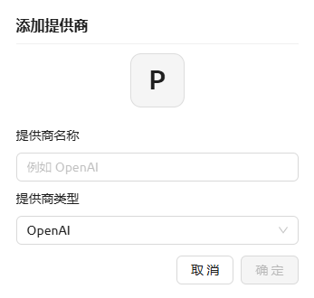
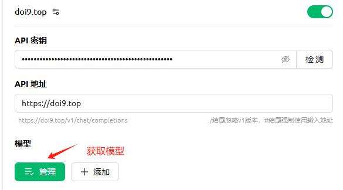
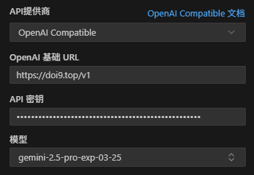

# 稳定快速 Google Gemini 公益站 2.0

> 原文链接: https://linux.do/t/topic/698408
> 主题元信息: 共 406 楼 · 23176 浏览 · 781 点赞 · 标签 人工智能, Gemini
> *只归档了前 50/406 楼。*

---

## #1 @Whimsy_z · 2025-06-04

由于[老贴](https://linux.do/t/topic/536462)超过编辑时效，内容过时。并且有些新来的佬友不会配置，故出此简易教程

OpenAI格式
API地址：[https://doi9.top](https://doi9.top/) 欢迎赞助
API密钥：**sk-3AEY28Or8ORvWbwgYJo7DXftapQPk7GyMI7pDaQyi4XOpKyP**
随机更新模型，建议养成更新模型列表的习惯

在[Cherry Studio](https://cherry-ai.com/)中使用：

Roo Code：

[沉浸式翻译可以用这个:partying_face:](https://linux.do/t/topic/698480)

[觉得麻烦可以使用这个:partying_face:](https://linux.do/t/topic/548303)

觉得好用别忘了点赞~

## #2 @bugboy · 2025-06-04

前排前排

## #3 @boolen (不二) · 2025-06-04

感恩，以前的key早就过期了，感谢佬友续上

## #4 @aa66609 · 2025-06-04

前排支持，感謝大佬

## #5 @DaffyTong (安全机房测试) · 2025-06-04

感谢大佬！！！公益站一直很坚挺！！！

## #6 @songzf · 2025-06-04

感谢大佬！！！

## #7 @October1899 (今天吃肠粉) · 2025-06-04

感谢大佬，用上了

## #8 @Caomo1988 · 2025-06-04

辛苦佬这么长时间维护了!

## #9 @neufvingt (二九) · 2025-06-04

来了来了，感谢大佬

## #10 @Zard · 2025-06-04

感谢大佬！

## #11 @Throttle (方块) · 2025-06-04

感谢分享！

## #12 @lemon_05 · 2025-06-04

感谢大佬分享。

## #14 @wxz (zlin) · 2025-06-04

感谢大佬

## #15 @alpha_roc · 2025-06-04

感谢大佬

## #16 @dust (悫) · 2025-06-04

感謝大佬！

## #17 @chenjingwei0103 (Percy Guardia) · 2025-06-04

感谢大佬！

## #18 @RuFeng (RF) · 2025-06-04

感谢大佬!

## #19 @WsIlgPebybopietb · 2025-06-04

用过最稳定的一个，还是直接放key的，牛逼

## #20 @handsome (大帅哥) · 2025-06-04

用上了！

## #21 @CaptainVIX (Edward) · 2025-06-04

感谢大佬分享

## #22 @kysherry · 2025-06-04

感谢大佬

## #23 @gouker (无花僧) · 2025-06-04

大佬真的牛逼，到现在还能继续用。

## #24 @mikeee (mikey) · 2025-06-04

感谢大佬的公益

## #25 @sh13026 (临江仙) · 2025-06-04

感谢分享，支持一下！

## #26 @noroadzh (阿东zh) · 2025-06-04

感谢分享，谢谢

## #27 @AppLoad · 2025-06-04

感谢佬友

## #28 @1761031276 (云逸) · 2025-06-04

喂饭级教程

## #29 @yuyuyang (羽于羊) · 2025-06-04

我必须立刻使用！

## #30 @beatrix (zq) · 2025-06-04

> *@Whimsy\_z 引用：*
>
> sk-3AEY28Or8ORvWbwgYJo7DXftapQPk7GyMI7pDaQyi4XOpKyP

感谢 :clap:

## #31 @578382239 (南山) · 2025-06-04

直接放key，我怕哪天突然就用不了了啊 :joy:
大佬接个登录限制一下吧

## #32 @m5136fv · 2025-06-04

你是真正的英雄

## #33 @shangguan (上官雪) · 2025-06-04

感谢大佬，用上了

## #34 @heywei (Heywei) · 2025-06-04

感谢大佬

## #35 @inderiva · 2025-06-04

佬 你是真正的英雄

## #36 @JasonSmart (Jason Smart) · 2025-06-04

佬，你的API站是最稳定的！！！！

## #37 @Likerainer · 2025-06-04

新贴必须顶上去

## #38 @dongqiang_dong (佩德罗) · 2025-06-04

感谢佬！！方便我这样的新手试用， :star_struck:

## #39 @gsnqazwsx (看今朝) · 2025-06-04

感谢佬友分享

## #40 @InFatuation (默默叽叽) · 2025-06-04

感谢佬:folded_hands:

## #41 @v123ve · 2025-06-04

感谢分享

## #42 @lvyan · 2025-06-04

> *引用：*
>
> 感谢分享！

感谢分享！

## #43 @Henrylol · 2025-06-04

是佬！佬的Gemini一直在用，非常感谢 :smiling\_face\_with\_three\_hearts:

## #44 @doitnow (小飞侠) · 2025-06-04

佬的公益站非常稳，并且还一直可以用2.5-pro，太牛啦，谢谢佬

## #45 @shenyanshu (沈晏书) · 2025-06-04

感谢大佬，我ROO上一直使用的大佬的API。

## #46 @Zhang_Bespo (Zhang Bespo) · 2025-06-04

感谢大佬

## #47 @momo521 · 2025-06-04

感谢大佬

## #48 @kete (小卡  🛡️) · 2025-06-04

感谢大佬

## #49 @moonlight (迪迦) · 2025-06-04

感谢大佬:folded_hands:

## #50 @euzen (细佬我食过几晚夜粥) · 2025-06-04

感谢，终于又可以用到pro了。

## #51 @perrin · 2025-06-04

谢谢佬！
