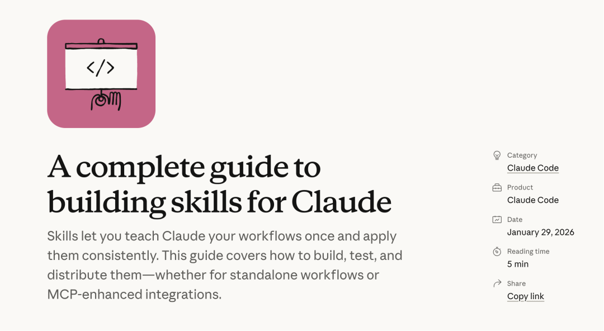

# 春节加餐：Anthropic首个公开的Skills构建指南来了！

> 公众号: Datawhale
> 发布时间: 2026年2月19日 22:11
> 原文链接: https://mp.weixin.qq.com/s/PcyKi5q8zT-tJ_9rzgKSqg

---

## 

 Datawhale干货 

******作者：Anthropic团队******

最近，Anthropic 发布了一份 32 页的官方指南——《The Complete Guide to Building Skills for Claude》，手把手教你怎么把自己的工作流程、领域知识封装成 AI 能自动执行的"技能包"。



官方文档：https://claude.com/blog/complete-guide-to-building-skills-for-claude

今天把文档的核心干货给你梳理清楚。

## **Skill是什么：避免每次都"重新教"AI**

## **Skill的诞生源于一个问题：**

每次都要“重新教”AI

我们用 AI 的时候，经常会遇到这些麻烦：

-   每次都要写长提示词：你想让 Claude 帮你写周报，得告诉它格式、风格、重点……下周又得重新说一遍。
    
-   流程记不住：你有一套固定的数据分析流程，但 Claude 不会主动记住，每次都要重新描述。
    
-   多步骤任务容易乱：比如“先搜索资料，再整理要点，最后生成报告”，得一步步盯着，生怕它跳步骤或者理解错。
    

这就像你每次做西红柿炒蛋，都要重新查菜谱一样——明明是熟练的事，却总要从头来。

解决方案：Skill = 可复用的工作方法

Skill 是一个文件夹，里面装着一套标准化的指令。你把自己的工作方法、团队规范、领域知识写进去，Claude 就能按照你的方式自动执行。

Anthropic 用了一句话概括：“**Teach Claude once, benefit every time**”（教一次，终身受益）。

这不是什么高大上的技术概念，就是把专家经验固化下来，让每次执行都按最佳实践来。

## Skill 的核心设计：一个文件夹，三层加载。

Skill 的核心设计思想叫**渐进式披露**（Progressive Disclosure）。

什么意思？就是不一股脑把所有内容塞进 AI 的上下文，而是分三层按需加载。

**第一层：YAML frontmatter（**100 tokens**）**

**这一层始终驻留在 Claude 的系统提示里。只包含两个字段：**`name` 和 `description`。

作用是告诉 Claude：“这个 Skill 是干什么的，什么时候该用。”

举个例子：

```
---
```

第二层：SKILL.md 主体

当 Claude 判断当前任务与这个 Skill 相关时，才会加载这一层。这里包含完整的指令、工作流、示例。

**第三层：scripts 和 references**

这是按需加载的外部文件。只有当 Skill 被触发，且 Claude 需要执行特定脚本或查阅参考资料时，这些内容才会被读取。

**为什么要这样设计？**

想象一下，你有 20 个 Skill。如果每个 Skill 的完整内容都常驻上下文，你的 token 窗口早就爆了。

渐进式披露确保只有相关 Skill 的完整内容会被加载。不相关的 Skill 只占 100 tokens，不会干扰 Claude 的思考。

这就像你手机上装了 50 个 App，但同时运行的只有 2-3 个。内存不够用的时候，系统会自动把后台 App 暂停。

Skill的官方构建指南

理解了三层加载的设计逻辑，接下来看具体怎么构建。核心就是写好 SKILL.md 文件里的两部分内容。

### 第一步：写 YAML frontmatter

这是 Skill 的“身份证”，始终驻留在 Claude 的系统提示里。

**最简格式：**

```
--- 
```

**关键规则：**

1.  **name 必须用 kebab-case**：`notion-project-setup` ✅，`Notion Project Setup` ❌
    
2.  description 必须回答两个问题：
    

-   这个 Skill 做什么？
    
-   什么时候用它？
    

**好坏对比：**

❌ 不好的 description:

```
# 太泛化，Claude 不知道什么时候用 
```

✅ 好的 description:

```

```

**为什么 description 这么重要？**

Anthropic 给的目标是：90% 的相关查询应该自动触发 Skill。

如果你的 Skill 触发不准，90% 的问题都出在 description 上。

**关键技巧：**

-   包含用户会说的具体短语（“冲刺规划”“创建任务”“设计规范”）
    
-   提到相关的文件类型（.fig、.csv、PDF）
    
-   说清楚适用场景，避免模糊表达
    

### 第二步：写 SKILL.md 主体指令

frontmatter 之后，就是完整的工作流指令。Anthropic 推荐的结构：

```
--- 
```

**写指令的三个黄金原则：**

**1\. 具体且可执行**

❌ 不好：

```
Validate the data before proceeding. 
```

✅ 好：

```
运行 `python scripts/validate.py --input {filename}` 检查数据格式。 
```

**2\. 包含错误处理**

```
## 常见问题 
```

**3\. 引用外部资源要清晰**

```
在编写查询之前，查阅 `references/api-patterns.md` 了解： 
```

### 第三步：可选的辅助文件

完整的 Skill 文件夹结构：

```
your-skill-name/ 
```

**关键规则：**

-   **文件必须叫 `SKILL.md`（大小写敏感）**
    
-   **文件夹名用 kebab-case**
    
-   不要在 Skill 文件夹里放 README.md（会干扰加载）
    

### 实战建议：先测试，再封装

Anthropic 强调一个反直觉的方法：**不要一上来就写 Skill**。

正确流程：

1.  先在对话中反复测试一个具体任务
    
2.  找到最有效的提示方式
    
3.  记录 Claude 的成功输出
    
4.  把这个成功经验提取成 Skill
    

这样做的好处：利用 Claude 的上下文学习能力，快速找到最优解，而不是盲目写一堆规则。

三个场景，看懂 Skill 适合做什么

Anthropic 总结了三大典型应用场景。

**场景一：文档类型的工作**

不需要外部工具，完全使用 Claude 内置能力。比如生成前端设计、PPT、合同模板、数据分析报告。

典型案例：`frontend-design` skill

它的 description 是：

> 创建独特的、生产级的前端界面，具有高设计质量。用于构建 Web 组件、页面、工件、海报或应用程序。

关键技术点：

-   嵌入风格指南和品牌标准
    
-   使用模板结构确保输出一致
    
-   最终输出前有质量检查清单
    

**场景二：工作流自动化**

多步骤流程，需要一致的方法论。

典型案例：`skill-creator` skill

创建 Skill 的工具本身也是个 Skill。

它的工作流包括：

1.  引导用户定义使用场景
    
2.  生成 frontmatter
    
3.  指导编写指令
    
4.  验证和迭代
    

关键技术点：

-   步骤之间有验证门控
    
-   内置审查和改进建议
    
-   支持迭代优化循环
    

**场景三：MCP 增强**

这是最有潜力的方向。你已经有 MCP 提供工具访问，Skill 负责封装"怎么用好这些工具"的知识。

典型案例：Sentry 官方发布的 `sentry-code-review` skill

> 使用 Sentry 的错误监控数据（通过 MCP 服务器）自动分析和修复 GitHub Pull Request 中检测到的 bug。

它不只是调用 MCP 工具，而是封装了一整套工作流程：

1.  从 Sentry 获取错误数据
    
2.  分析错误与代码的关联
    
3.  在 GitHub PR 中自动生成修复建议
    

关键技术点：

-   编排多个 MCP 调用（按顺序、有依赖）
    
-   嵌入领域专家知识（Sentry 的错误分析逻辑）
    
-   处理常见错误和边界情况
    

直接套用到你的工作场景

Anthropic 在指南中总结了五种经过验证的工作流模式。这些模式可以直接套用到你的场景中。

**模式 1：顺序工作流编排**

适用于有明确先后顺序的多步骤流程。

示例：客户入职流程

```
Step 1: 创建账户（调用 create_customer）
```

关键技巧：明确步骤依赖、每步验证、失败时回滚。

**模式 2：多 MCP 协调**

一个工作流跨越多个服务。

示例：设计到开发的交接流程

```
Phase 1: Figma MCP → 导出设计资源和规格
```

关键技巧：清晰划分阶段、数据在服务间传递、每阶段验证后再进入下一阶段。

**模式 3：迭代优化**

输出质量可以通过多轮迭代提升的场景。

示例：报告生成

```
1. 生成初稿
```

关键技巧：明确质量标准、写脚本自动检查、设定停止条件（不能无限迭代）。

**模式 4：上下文感知工具选择**

同样的目标，但根据不同上下文选择不同工具。

示例：智能文件存储

```
根据文件类型和大小决策：
```

关键技巧：清晰的决策标准、备选方案、向用户解释为什么选择这个工具。

**模式 5：领域专用智能**

在工具调用之外，嵌入领域专业知识。

示例：金融合规检查

```
调用支付 MCP 之前：
```

关键技巧：把领域规则编码进 Skill、合规检查先于行动、完整的审计日志。


**一起“**点****赞”****三连**↓**
