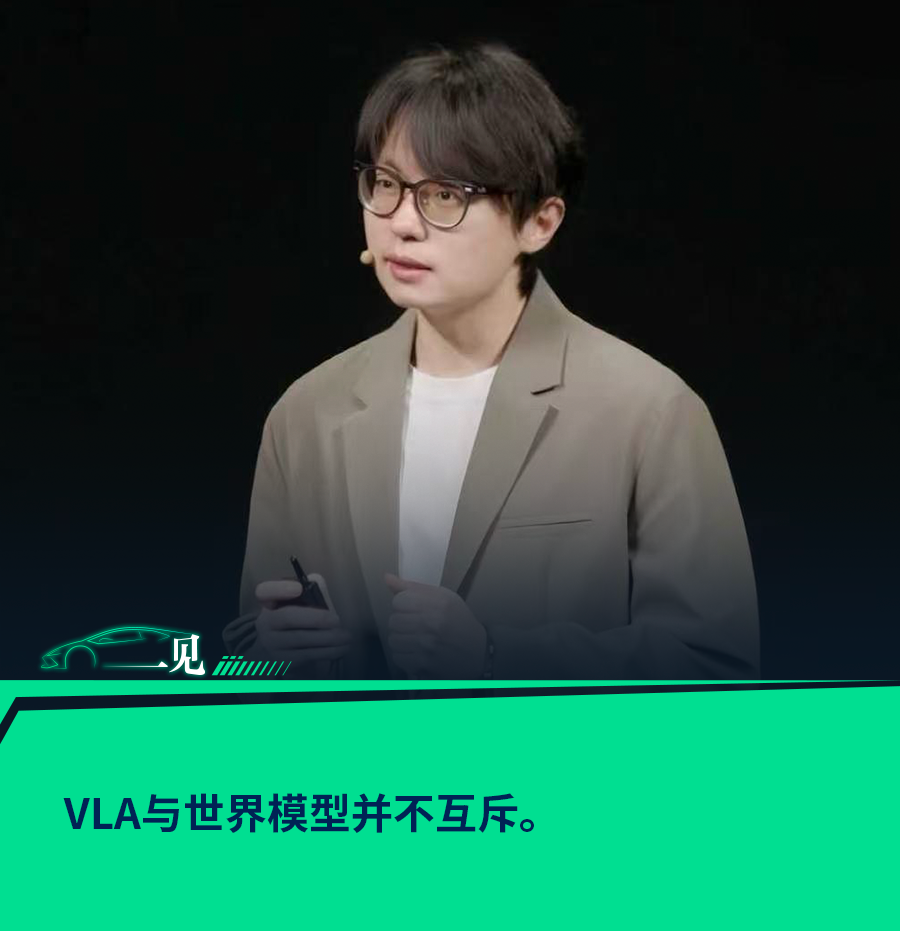
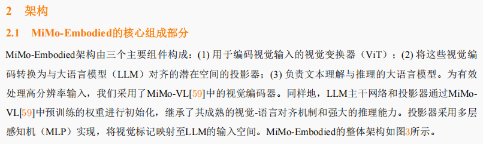
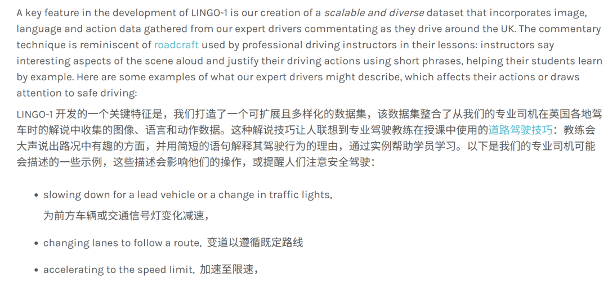
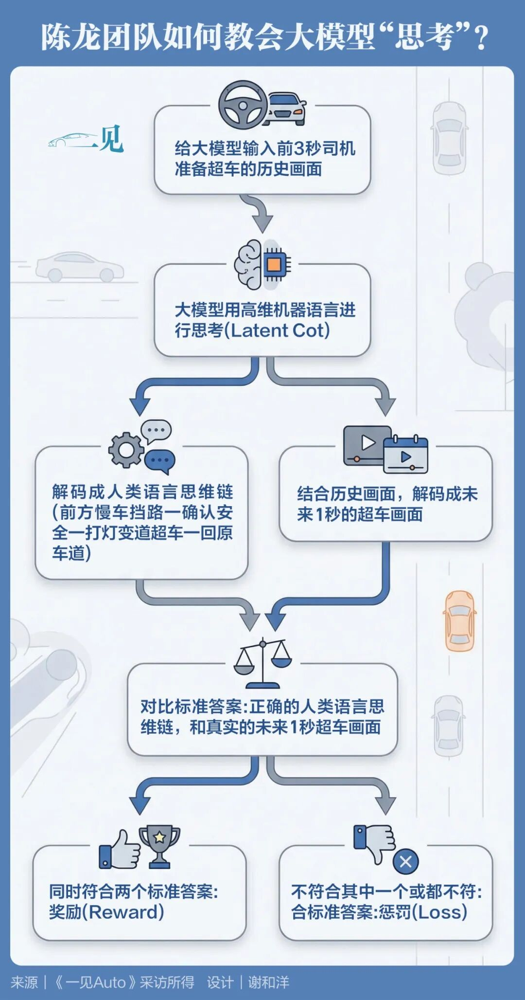
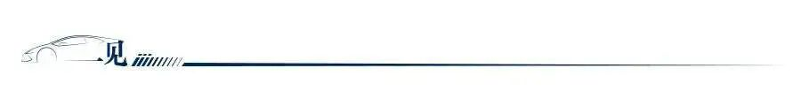
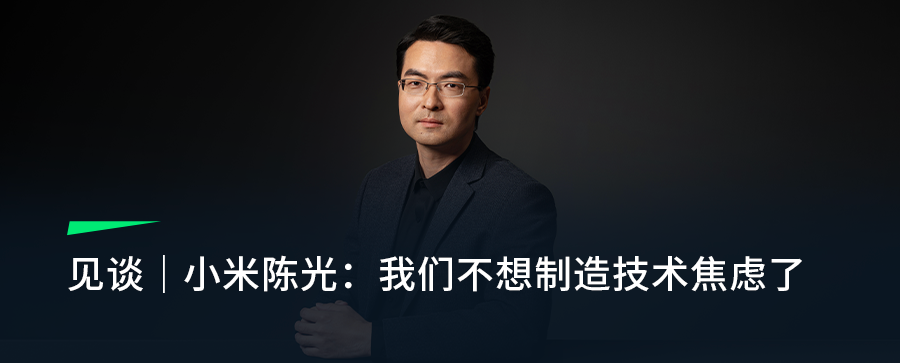
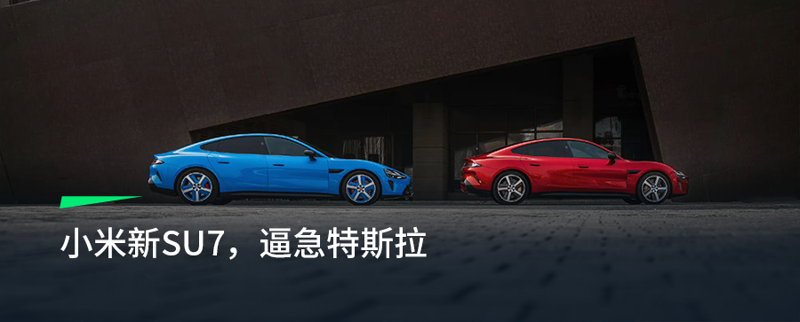
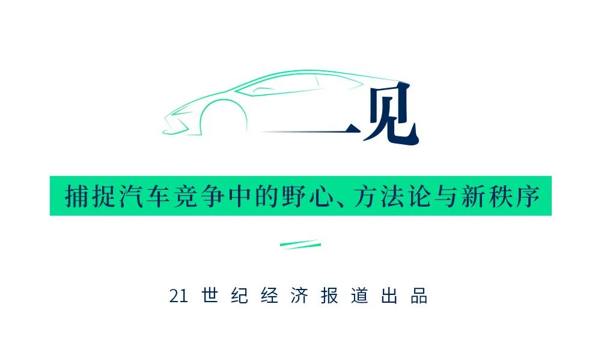

# 见谈｜小米陈龙：把大模型抚养到18岁，再教它如何驾驶

> 公众号: 一见Auto
> 发布时间: 2026年4月13日 16:13
> 原文链接: https://mp.weixin.qq.com/s/44_UrbaQu2U1EAB9OrGNxQ

---

**作者丨何煦阳**

**编辑丨吴晓宇**

人类并不是一生下来就学习并学会驾驶的。在学习驾驶之前，人类需要经过漫长的成长过程，而大模型也一样。

“小时候，我们学说话和认字。随着慢慢成长，我们会经常摸、拿、抓、取一些东西。等到我们具备了强大的语言能力和对空间的理解和推理能力，差不多18岁以后，我们再去学习。这样才能将我们习得的一切融入驾驶之中，不仅开得更快，还开得更好。XLA大模型也一样。”4月初，《21汽车·一见Auto》与小米汽车智能驾驶基座大模型负责人陈龙进行了一次面对面访谈，他这样说。

一个月前，小米刚发布新一代SU7，并宣布辅助驾驶升级到XLA认知大模型架构。

所谓的“X”，是指“多模态认知输入”。小米集团董事长雷军在新一代SU7发布会上称，相比VLA*（Vison-Language-Action Model，视觉-语言-动作模型）*，小米除了融入视觉（Vision）、雷达、导航信息以外，还融入了声音、机器人数据等模态，让大模型更全面地认知世界。雷军宣布，未来三年，小米将在大模型、具身智能、AI应用等领域投入至少600亿元，最终的落点，是推进AI应用全面融合“人车家”全生态。

陈龙便是小米XLA认知大模型的负责人。童年时，他喜欢美剧《霹雳游侠》里的智能跑车KITT，这台跑车有鲜明的自我意识，通过自动驾驶多次帮助主角化险为夷。长大后，他曾在英国剑桥大学孵化的自动驾驶公司Wayve任职，是将VLA模型引入辅助驾驶领域的先行者，令大模型的驾驶决策过程更加透明。一年之前，陈龙从海外回国加入小米。

彼时的小米辅助驾驶架构还处于“端到端*（End-to-End，一种深度学习模型范式，直接从原始输入映射到最终输出）*+VLM*（视觉-语言模型，Vision-Language Model）*”范式。端到端拆掉了传统辅助驾驶的“感知”“规划”“决策”模块，通过直接灌入大量驾驶场景数据，直接让模型学习并输出驾驶行为。陈龙将这一阶段的核心，提炼为“数据驱动”。

但进入2025年，端到端架构的缺陷开始显现：虽然大模型通过模仿学习提升了驾驶水平，但它却未真正理解和认知驾驶本身。面对现实中复杂多变的长尾场景，仅靠“死记硬背”的模型容易陷入决策困境，无法像人类驾驶员一样举一反三。

陈龙判断，智驾的下一阶段必须从“数据驱动”升级为“认知驱动”。

为此，以去年11月为分界，陈龙团队做了两件大事：11月前，先让大模型“长到十八岁”；之后再用潜空间推理（Latent CoT），让模型真正学会驾驶。

为了将小米的具身基座大模型抚养成人，陈龙团队花了八个月的时间，但趟过的弯路却远不止八遍。

招纳罗福莉后，小米发布并开源了多模态大模型“Xiaomi MiMo-VL”系列。陈龙告诉我们：“罗福莉和他们团队，不仅给我们提供了一个很强的基座模型MiMo-VL系列，还与我们共享了一套训练框架。”

这让陈龙团队不用从零开始打造自己的具身基座大模型，直接继承了其社会常识与强大的推理能力。但这还不够，MiMo-VL具备的能力还停留在二维，陈龙还需要往基座模型里灌入更多通用空间、辅助驾驶及机器人数据，增强其空间感知和推理能力。

*小米具身大模型Xiaomi MiMo-Embodied技术报告节选*

不过，将大模型混入如此多元的数据，对陈龙团队来讲也是第一次，所以他们曾搞错了灌输数据的顺序。

“一开始想直接混在一起看看效果，结果发现不太work”，他告诉《21汽车·一见Auto》，“将数据混在一起训练，辅助驾驶与机器人的水平都降低了。”

之后，陈龙团队没有急着继续堆驾驶数据，而是先追问一个更底层的问题：模型究竟需要先具备什么能力，才能真正理解驾驶？他们最终的判断是，驾驶不是孤立技能，它建立在更基础的通用认知、空间理解和物理常识之上。

基于此判断，团队先灌输通用的多模态与空间数据，再灌输辅助驾驶与机器人数据——这很像人类“先成人、再开车”的逻辑，即先具备社会常识、物理感知和推理能力，才能更理解什么是驾驶、怎样去驾驶。

数据的配比与融合，同样关键。对比驾驶场景，机器人面对的场景更多元、更复杂，数据更稀少，陈龙团队搜索并加入了大量开源数据，并通过大量实验确认三类数据（机器人、驾驶与多模态）的最优配比。

为解决智驾和机器人数据难以融合的问题，他们标注了很多思维链数据（CoT，Chain of Thought），这也是团队的核心技术创新之一。陈龙解释，这相当于将两个大任务分解成很多小任务，告诉大模型要先识别具体的物体，再理解物体的状态，最后明白未来该怎么做。

进入VLA架构时代后期，Scaling Law（大模型性能随着数据、参数、性能而提升的扩展定律）边际效应递减，需要加入更多的、崭新的三模态（视觉-语言-行动）辅助驾驶数据，才会开始新的一轮Scaling Law。这意味着陈龙团队需要重新标注和构造新的驾驶数据，比如针对某段驾驶场景向模型提问，让模型生成一段文字回答。陈龙告诉我们，“一个问题、一段画面、一个回答”，在VLA时代只能算“一种数据”。数据标注在依托罗福莉团队的AI基建与MiMo-VL系列大模型完成，机器生成后辅以人工“精筛”。

也有人力标注的方式，比如陈龙曾经任职的Wayve，就曾在技术博客上介绍自己是怎么用车队构建“驾驶评论”数据集的：让司机在一边开车，一边大声讲出刚才自己是怎么决策的。

*Wayve公司的技术解释博客节选*

2025年11月21日，小米正式发布并开源小米具身大模型“Xiaomi MiMo-Embodied”，模型具备了自主思考的能力。但进入到量产部署阶段，新的问题也随之浮现。

“模型太大了。”陈龙向《21汽车·一见Auto》感叹。即便压缩了模型尺寸，车端有限算力仍无法支撑XLA完整的思维链推理，因为语言形式的思考过程耗时过长，难以满足智驾实时性要求。

如何让XLA认知大模型推理时更迅速且更高效？陈龙带领团队开启了VLA探索的下一个阶段：潜空间推理*（Latent CoT）*。

潜空间推理，即让大模型在机器脑内高速、无声、高维地完成思考，不再用人类啰嗦的语言，既保证智驾实时性，又保留可解释与安全可控。但他们在探索时发现，仅靠机器语言思考并不足够，模型要怎么思考，还是需要人类指导。

“最简单的潜空间推理就是往里加几个步骤，但你会发现它不知道要用这几步来干什么。”陈龙告诉我们。在研发过程中，陈龙持续观察人类驾驶行为，总结出三种核心思考模式，并将其注入XLA大模型：

第一种，运用直觉，“脑袋放空也能驾驶”，对应端到端的驾驶逻辑；

第二种，运用语言，读取各种导航和指示牌等关键信息，做出简洁的逻辑判断，无需完整的语言陈述；

第三种，想象思考，即通过想象力预判场景，比如人类在超车时可能会判断自车与前车的距离，变道的距离是否合适，这其实就是在运用对空间和未来的想象力。这一能力源自世界模型范式。

陈龙将世界模型分为两类，一类是世界仿真模型（World Simulator Model），用处是生成无数驾驶场景，然后让模型在里面不断进行驾驶试验；另一类是“世界动作模型（World Aciton Model）”，通过海量数据预判未来行车画面，提前做出决策。

训练阶段，团队会要求XLA将刚才自己的思考过程翻译成人类语言或未来画面，让XLA一步步摸索自己应该如何用机器语言还原人类驾驶时思考的过程。

以超车为例：给XLA一段车辆跟在前方慢车后的画面，让XLA自己思考，再翻译成人类语言思维链，如果能还原出“前方慢车挡路一确认安全一打灯变道超车一回原车道”的人类语言，说明它正确理解了人类驾驶的思考逻辑。团队不需要用人力监督XLA生成的语言思维链是否正确，而是可以通过“模型监督模型”，使用罗福莉团队新开发的MiMo-V2-omni进行监督，“它的视觉语言能力很强”；

另外，人类在超车时可能会判断自车与前车的距离，变道的距离是否合适，这其实就是在运用对空间和未来的想象力。于是，陈龙团队会要求XLA将自己的思考过程还原成未来几帧的超车视频，然后与真实的超车视频比对，如果发现错误，XLA能自行通过反向传播算法优化网络。

通过经过大量与人类语言对齐的训练后，XLA已经学会驾驶思考了。所以实际车端推理时，模型则无需解码，不用每次都生成语言或视频画面，直接在潜空间完成极速计算，这样就大大提升了XLA推理的质量与速度。

去年，自动驾驶圈关于VLA与世界模型的路线选择吵得很凶，有世界模型派高管认为VLA是“取巧”的方案。但小米不这样认为，“VLA与世界模型是可以相辅相成的。”陈龙告诉我们。

“潜空间思考的优势，就是我不限制模型去想什么，也不限制你用什么方式思考，我们最终的目的是让模型学会驾驶。”在潜空间推理层，陈龙团队已经统一了VLA与世界模型。

3月17日，小米宣布XLA辅助驾驶认知大模型正式上车。但眼下，陈龙团队还有实际量产的关要过。

去年国内更早切换到VLA或者世界模型架构的车企，进行OTA（远程升级）后，用户体验的实际效果都发生了波动，也引发了一系列的人事震荡。陈龙觉得，效果波动是因为是切换架构后，需要重新搜集数据进行迭代。

陈龙向《21汽车·一见Auto》剧透，目前推送的第一个版本，“调教会相对保守一些，会利用一些规则的限制进行安全性兜底”，并持续进行数据迭代，逐渐放开全模型的能力，“到时候用户体验会更加丝滑。”

**以下是访谈实录，内容经摘编：**

**先让大模型长到十八岁**

**《21汽车·一见Auto》：你在介绍XLA认知大模型的视频里有一个场景：汽车能够在丁字路口前提前减速，以防前面会有行人或者汽车的突然进入。为什么现在的小米辅助驾驶模型能够提前减速？**

**陈龙：**传统端到端架构使用模仿学习，可能看前面是空旷的，就认为是没有风险，就开始提速，忽视前面有一个路口。但人类不一样，能意识到前面可能有车辆会路过，需要观察并且让行。

这次因为我们升级到了XLA认知大模型，所以它可以提前预判，使用了它的常识、推理的能力。它会意识到我现在虽然是在没有车的路口，但前面因为导航显示转弯，需要预判，做更类似于人类的减速的操作。

**《21汽车·一见Auto》：去年3月入职小米时，你一开始负责的工作是什么？**

**陈龙：**我刚来的时候，小米其实已经转换到了端到端时代，处于“端到端+VLM”的版本，我主要负责小米汽车具身基座大模型Xiaomi MiMo-Embodied的研发。

**《21汽车·一见Auto》：XLA大模型能做到提前减速，是Xiaomi MiMo-Embodied的功劳吗？**

**陈龙：**一半原因是，另一半则因为我们这次创新性采用了“潜空间推理（Latent Cot）”。

**《21汽车·一见Auto》：Xiaomi MiMo-Embodied帮助了XLA什么？**

**陈龙：Xiaomi MiMo-Embodied**首先是一个大模型，具有很强的语言和视觉能力，知道道路上的情况。同时它也具备强大的知识，可能在还没有经过自动驾驶数据训练之前，它就已经理解了很多物理知识和各种交通法规。

然后我们加入了很多机器人、自动驾驶和通用场景的数据。因为基座模型它普遍是通过互联网数据训练的，还停留在2D，所以这个阶段大大增强了它的空间感知和推理能力。

最后还使用了强化学习，进一步让它在可验证的结果上增强它的能力。

**《21汽车·一见Auto》：现在行业内的机器人数据非常稀缺，你们采用了多少机器人的数据？**

**陈龙：**由于这个是一个开源的模型，所以我们这个模型采用的大部分是开源数据。具体的数据比例在技术报告里面有写，但的确机器人的数据比较少，每个机器人本体都不一样，具体到某个特定本体上数据会更少。**但是我们内部也有闭源的版本，会用到小米自己训练的数据。**

**《21汽车·一见Auto》：你在宣传视频里讲加入机器人数据提高了智驾侧的“感知精度”，那加入辅助驾驶数据又对机器人侧有什么帮助？**

**陈龙：**对于机器人，辅助驾驶数据的价值，就是通过大量道路上的行驶学习出来很多物理运动的规律。比如车是一个刚性的物体、树叶会动等等。我们的目的是让机器人任务可以适应各种环境的条件，让它学习到更本质的东西，**也就是对空间的理解、推理**，而不是把它over fit（过拟合）到特定的数据上面。

我们也有创新，我们通过思维链把这两种任务融合了起来。因为思维链会把一个大任务拆解成小的任务，比如机器人要抓取一个东西，我们的思维链可能会输出一些具体的步骤：我现在看到了前面的车模，它大致的位置是在哪里，哪个地方是可以抓的？我们首先做一个判断，之后再运用语言模态思考，具体要移动到哪里，最后再执行。思维链是可以把两种任务链接在一起的。

**《21汽车·一见Auto》：所以Xiaomi MiMo-Embodied具身基座大模型同时拥有海量的多模态（图文、视频、代码等）、辅助驾驶和机器人数据，这很像人类成年的过程。**

**陈龙：**对，这个过程确实是类似于人类成长。人类小的时候要首先学习语言能力，包括认字跟对话的能力。之后慢慢成长的时候，我们也会跟各种物体进行交互，我们会经常摸、拿、抓、取一些东西。当你有了这个强大的语言、空间理解和推理能力，差不多18岁之后，再去学习驾驶的理论实践，不仅学习得更快，也会学得更好。

**先学通用知识，再学具体驾驶**

**《21汽车·一见Auto》：做Xiaomi MiMo Embodied的过程中，有没有遇到什么困难？**

**陈龙：**肯定有的，有挺多困难。首先训练大模型有很多经验和技巧，这个过程当中罗福莉还有她的团队帮助了我们很多。他们不仅给我们提供了一个很强的基础模型MiMo-VL系列，还提供了很多数据标注的思路。我们的训练框架是共享的，AI Infra很大一部分也能复用。

**《21汽车·一见Auto》：你们具体是怎样一起工作的？**

**陈龙：**我们是两个不同的团队，但我们互称是**“兄弟团队”**。因为他们更加偏向基础模型的预训练，而我们更加偏于一个具身智能垂域模型。所以我们会使用连续预训练（continue pretrain）的技术。他们进行完预训练之后，我们再进行一轮垂域的预训练，进一步把更强的模型能力蒸馏到具体的自动驾驶模型上面，毕竟他们的模型尺寸来对我们来说太庞大了。

另外很大部分的时间也花在数据的收集和清理上，这是训练大模型很重要的一部分。数据准备好之后，还做了大量实验。

**《21汽车·一见Auto》：实验什么？**

**陈龙：**首先是数据配比，就是因为你要把这两种任务混合起来，具体这两种数据到底加多少，都需要实验做去验证。还要分不同的阶段去学习，如果你只是把它混合在一起做一个训练，他可能这两种任务都训练不好。但是如果你先学一种能力，然后你再在这个基础上再学一种能力，他可能两种能力都掌握得好一些。

**《21汽车·一见Auto》：不谈现在你们已经成熟的比例和流程，这个阶段走过什么弯路吗？**

**陈龙：**有的。一开始我们想直接混一起先看看效果怎么样，结果发现不太work，两种能力都下降了。中间也调过具体的比例，发现还是不是特别行，然后就开始思考这个怎么样让他逐步的去掌握这些能力。

后来发现要先加入通用的多模态和空间加强数据，再混辅助驾驶和机器人数据，最后混入思维链数据。等于让它对整个世界和物理环境有一定感知，再学习具体的辅助驾驶和机器人任务。

**《21汽车·一见Auto》：等于一开始是一个打基础的阶段，之后再让它学习具体的任务？**

**陈龙：**对。

**《21汽车·一见Auto》：你还记得你们错过几次吗？**

**陈龙：**错了很多次，都数不清了，因为之前也没有人去探索过。

**VLA时代，新的Scaling Law**

**《21汽车·一见Auto》：你之前提过，端到端时代的scaling law是很明显的，但进入VLA时代后已放缓了，更需要同时具备三种模态的数据。三模态的数据是什么样的？**

**陈龙：**有很多种，因为你需要不同数据来训练模型，保持它的通用性，所以当你构造数据的时候，会构造不同的任务。比如你需要构造很多问答的问题，例如问它“你前面有没有车，旁边有没有人？现在限速是多少，你在哪个车道上面？”然后我们标注这段场景的时候会就有一个问题、一个回答。

这只构成了其中一种数据，还有其他的数据。比如“请你尽可能地描述现在你看到的画面”，然后他会进行一些详细的描述，比如这是什么天气，道路上有多少辆车，有多少行人等等。

**《21汽车·一见Auto》：你们现在是怎么去收集这种三模态数据的？驾驶数据有很多收集方法，提问和回答数据是怎么收集的？**

**陈龙：**小部分是通过人工标注，**大部分是通过罗福莉团队的大模型来进行自动化标注**。我们现在使用的就是MiMo-V2-Omni，还提供了一些感知的标签来辅助。当然模型标注的数据最后还要经过一轮人工精筛，但速度就会快很多。你判断对不对，总比你自己把这个写出来要快很多。

**《21汽车·一见Auto》：人工和机器标注的比例是多少？**

**陈龙：**机器标注会更多，因为我们多模态大模型的能力很强。

**教会大模型如何“思考”**

**《21汽车·一见Auto》：所以做完了Xiaomi MiMo-Embodied，之后开始探索潜空间推理。这个过程又遇到了什么困难？**

**陈龙：**具体就是我们内部还有一个尺寸更小的、闭源的Xiaomi MiMo-Embodied版本，而且是使用内部数据进行训练的。大概在去年年底，很多量产的同学帮助我们部署到车端实现XLA的功能以后，发现车上算力实在是有限。

虽然我们已经把模型做小了，但是如果我们使用语言推理的话，耗费的时间和算力都太多了。

**当预研的项目进入到量产，你会有很多需要折中的地方**，这是探索Latent Cot的源起。但是我们也保持了它解码出来语言的能力，然后发现我们不会损失太多推理的效果。

**《21汽车·一见Auto》：你是怎么想到这个新方案的？**

**陈龙：**其实很多的优化首先发生在大语言模型里面。之前Meta有一位著名的华人科学家叫田渊栋，他很早就在做一些潜空间推理的探索。但具体到具身智能和辅助驾驶场景，是需要我们自己去落地的。

因为现在语言模型也想要加速，如果你打开“深度思考”模式，会发现的确效果比较好，但是需要等一段时间，让它中间输出很多语言才行。可输出的这些东西就有很多冗余的地方，比如说有一些很口语化的词语。

在辅助驾驶的情况下，我们可能只需要让它说一些很关键的东西就可以了。所以潜空间推理它是一个更加类似于人类思考的方式。

**《21汽车·一见Auto》：但是所谓的潜空间推理，是不是有很多种？你们怎么去选择运用哪一种？**

**陈龙：**最简单的方式就是加几个中间步骤，然后输出action。最开始我们就这样尝试过，但首先它可能还不具备推理能力，**他虽然中间多了很多步，但他不知道要用这几步到底要干什么。**所以最终你肯定还是需要人类指导的。

所以我其实一直在思考如何把世界模型和VLA融合起来，包括我自己开车的时候也经常留意我自己在想什么。因此才有了这一个想法：我们可以让他做潜空间思考，但是可以把这个潜空间思考同时解码出具体的人类语言思维链和未来帧，相当于把VLA和世界模型的能力融合起来。

**《21汽车·一见Auto》：你能举个例子吗？**

**陈龙：**比如超车。假如有几帧我跟在一个慢车后面的图像，我喂给XLA模型，它会自动进行编码，并生成几个潜空间token。在训练阶段，我们会要求它把这几个token解码成人类语言，这就是cot的一个过程。

**《21汽车·一见Auto》：那你们怎么监督它呢？**

**陈龙：**我们现在可以直接用MiMo-V2-omni强大的视觉语言能力来监督它解码的人类语言对不对。我们内部也有一整套语言标注流程，会利用很多感知结果自动化标注，同时引入人工质检员。

**《21汽车·一见Auto》：所以你们可以通过模型监督模型。**

**陈龙：对，人类监督的效率太低。**

这样训练好之后，模型在推理阶段就不需要再解码成人类语言了，因为他已经具备正确的潜空间思考逻辑。但如果需要，我们也可以进行解码，保证模型的可解释与可追溯性。

**《21汽车·一见Auto》：所以这是一个“每时每刻”解码，还是说只解码“某一个”路段和场景的问题。如果车主之后提出需求，你们是可以解码成人类语言告诉车主的？**

**陈龙：是的，这是一个人机交互的问题。**其实我们的目标也是为了让辅助驾驶更好用，更安全、更有效率、人类接管更少。

当然，可解释性是人机交互很重要的环节。如果人类能更了解具体车是怎么想、怎么思考，以及下一步会做什么，他对辅助驾驶会更加“安心”。我们在后续版本中会一起和车主去探索，到底需不需要、什么时候需要把潜空间解码出来。

**世界模型除了能“生成世界”，还能“想象未来”**

**《21汽车·一见Auto》：那你们又是怎么融合世界模型的？**

**陈龙：**世界模型这个概念比较宏大，我们具体运用到世界模型的，有两个地方：

首先，我们输出Action之后，会结合世界模型和强化学习进行后训练，进一步对齐人类偏好，提升安全和效率。我们会使用“世界仿真模型（World Simulator Model）”，在仿真的驾驶环境下做一些微调。

第二，我们刚才讲的“潜空间推理”，除了可以解码成人类语言，也可以去解码成未来几帧的图像。**这是利用了世界动作模型*（World Action Model，WAM）*“想象未来”的能力。**这是一种视觉推理能力，如果你能想象出未来是什么样的，其实你也知道应该怎么开了。

**《21汽车·一见Auto》：你们又怎么监督模型如何想象？**

**陈龙：我们在训练时，会有意识地引导模型去预测未来驾驶的状态，而不应该具体地让它预测出未来的图像是什么。**还是以超车为例，我们应该引导模型想象出超车的过程，而不是想象出树叶的抖动、光照的变化，这是没有用的高频信息。

而且我们有真实超车视频的后半段。如果解码出来的未来帧不一样，模型会自动算出不同，再通过反向传播算法，不断优化自身网络。

**《21汽车·一见Auto》：所以你们既可以将模型的潜空间推理过程解码成人类语言，也可以让它解码成未来图像。那为什么有了世界模型的想象力，我们还需要VLA？**

**陈龙：**因为想象下一帧的能力，是一个比较底层的能力，而VLA的语言推理能力，是一个更高级的能力，我们需要把这两种能力结合起来。

我们不应该限制模型怎样去思考，它既可以用端到端的、偏直觉的方式，也可以用VLA的人类语言的方式，还可以运用世界动作模型的想象的方式。**一切方式都是为了让它真正认知驾驶，能用更本质的机器语言进行推理。**

**《21汽车·一见Auto》：所以VLA是可以和世界模型相辅相成的。**

**陈龙：**对。

**认知驱动以后，小米的未来是什么？**

**《21汽车·一见Auto》：端到端时代，大家衡量辅助驾驶水平的方法通常基于三个维度：数据、算法和算力。但当大家集体切换到新的架构后，新的衡量标准是什么？**

**陈龙：目前行业内还没有公认的标准，但我认为有自研的基座模型非常重要。**如果你没有自研的基座模型，而是选择互联网上一些开源模型，那你预训练的数据是不太可控的。我们从头训练基座模型，在预训练时就会筛选更干净的数据，对数据的掌控力更强。

**《21汽车·一见Auto》：你们的Xiaomi MiMo-Embodied是基于MiMo-VL，但现在小米已经发布了新的全模态Agent基座Xiaomi MiMo-V2-Omni。你们之后会使用吗？**

**陈龙：**我们现在已经在用了。

**《21汽车·一见Auto》：怎么用？用起来有什么新的感受？**

**陈龙：**首先它的尺寸比例之前的7b的开源版本更大了，能够感觉到模型的能力会大大的增强，对幻觉的抑制很好。

**它还优化了Agent能力，所以对我们指令的理解和遵循程度会更加深入。**我们现在已经使用它进行数据标注和训练监督了。

**《21汽车·一见Auto》：为什么小米在2025年的财报会议上说，XLA的全部能力要到后续版本来展现？**

**陈龙：**升级新的架构之后，是需要数据迭代的时间的，这也是为什么去年各家的辅助驾驶水平会有波动。所以我们推送的第一个版本会更保守一些，用一些规则的限制来做安全兜底，再逐渐放开全模型能力，体感上会更加丝滑。

**《21汽车·一见Auto》：有友商发现规则拆除得越多，模型的能力会被释放得更彻底，上限更高。未来你们的XLA会彻底拆掉规则吗？**

**陈龙：**我们始终把安全放在第一位。现阶段，无论模型能力发展到什么程度，规则仍然是辅助驾驶系统里不可缺少的一部分。因为在真实道路环境中，安全始终需要明确的边界和兜底机制。

**《21汽车·一见Auto》：你们的XLA认知大模型，能一路从L2打通到L4吗？**

**陈龙：**讨论L4时一定要加上时间线，因为这部分也取决于你什么时候想推出L4。**也许100年后才到L4，但也许两年后就需要L4。**

L4肯定是需要认知能力的，但具体怎么达到，我们也在讨论当中。目前已有的L4是一种形态，也有一些其他路线宣称马上就达到L4，比如特斯拉。这也是自动驾驶有意思的地方：大家都说马上要到了，但到底有多远？

两种路线会有各自的优缺点，可能也是互补的。我们最终可能会把这些路线结合起来，然后再加上XLA的能力。

**《21汽车·一见Auto》：你们的具身基座模型同时也支持机器人，现在市场上的机器人赛道也很火热，很多车企都在做。机器人对车企是一个非要做的业务吗？**

**陈龙：**不是非要做的业务，但机器人的确能复用辅助驾驶很多东西。如果你有一套成熟的复制驾驶方案，很多能力是可以迁移过去的。

但机器人对小米很重要，对我也很重要。

**《21汽车·一见Auto》：你们和机器人团队目前在合作什么？**

**陈龙：**我们有很频繁的交流。

现在在做的主要还是搭一个统一的架构，先落地的肯定是辅助驾驶，因为它是比较确定的一个事情。但机器人现在的技术方向没有特别收敛，即便本体的形态也没还没有收敛，所以我们的交流主要集中在对一些技术预研上。

**《21汽车·一见Auto》：未来你的辅助驾驶工作是什么？**

**陈龙：**辅助驾驶还是一个没有被完全解决的问题。哪怕大家都进化到了认知驱动的时代，但也许会有更新的模型架构出来，就像今年比较火的世界模型一样，对此我还是很期待的。

**《21汽车·一见Auto》：小米现在有硬件入口，也有大模型、自动驾驶和机器人。未来小米可能会打造一个“人车家全生态大模型”吗？想打造这样一个大模型，还需要什么能力？**

**陈龙：**我觉得终极目标肯定是这样。在我的想象里，它可能是一个超大的个人助理，它可能会是分布式的地存在于你的各种设备当中。因为它的算力需求很大，所以分布式也可以分担一些算力，你的汽车、平板、电脑、音响甚至扫地机器人都可以分担，当然也有一部分会在云端。

未来会出现一个类似现在比较火的“龙虾（Openclaw）”框架。你可以对你的超级个人助理下达各种命令，它会调度它的所有Agent来实现不同的行为。**目前Agent的能力还停留在数字层面，但将来你的辅助驾驶、机器人以及所有设备可能都是Agent。**这也是我们努力的方向。

头图来源丨小米汽车官方

视觉鸣谢丨谢和洋

排版｜张晓君

  

*【版权声明】本文所有内容著作权归属21世纪经济报道，未经许可，不得转载、摘编或以其他形式使用。*

\- END -

**【推荐阅读】**

‍

‍

