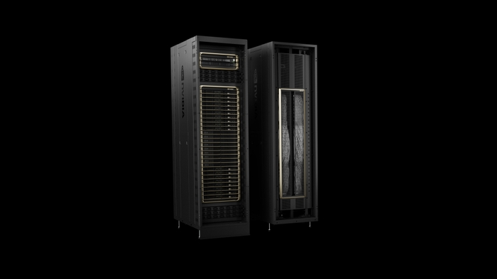

# NVIDIA Blackwell Platform Arrives to Power a New Era of Computing

> 发布时间: March 18, 2024
> 原文链接: https://nvidianews.nvidia.com/news/nvidia-blackwell-platform-arrives-to-power-a-new-era-of-computing

---

-   *New Blackwell GPU, NVLink and Resilience Technologies Enable Trillion-Parameter-Scale AI Models*
-   *New Tensor Cores and TensorRT- LLM Compiler Reduce LLM Inference Operating Cost and Energy by up to 25x*
-   *New Accelerators Enable Breakthroughs in Data Processing, Engineering Simulation, Electronic Design Automation, Computer-Aided Drug Design and Quantum Computing*
-   *Widespread Adoption by Every Major Cloud Provider, Server Maker and Leading AI Company*

**GTC—** Powering a new era of computing, NVIDIA today announced that the NVIDIA Blackwell platform has arrived — enabling organizations everywhere to build and run real-time generative AI on trillion-parameter large language models at up to 25x less cost and energy consumption than its predecessor.

The [Blackwell GPU architecture](https://www.nvidia.com/en-us/data-center/technologies/blackwell-architecture/ "Blackwell GPU architecture") features six transformative technologies for accelerated computing, which will help unlock breakthroughs in data processing, engineering simulation, electronic design automation, computer-aided drug design, quantum computing and generative AI — all emerging industry opportunities for NVIDIA.

“For three decades we’ve pursued accelerated computing, with the goal of enabling transformative breakthroughs like deep learning and AI,” said Jensen Huang, founder and CEO of NVIDIA. “Generative AI is the defining technology of our time. Blackwell is the engine to power this new industrial revolution. Working with the most dynamic companies in the world, we will realize the promise of AI for every industry.”

Among the many organizations expected to adopt Blackwell are Amazon Web Services, Dell Technologies, Google, Meta, Microsoft, OpenAI, Oracle, Tesla and xAI.

**Sundar Pichai, CEO of Alphabet and Google**: “Scaling services like Search and Gmail to billions of users has taught us a lot about managing compute infrastructure. As we enter the AI platform shift, we continue to invest deeply in infrastructure for our own products and services, and for our Cloud customers. We are fortunate to have a longstanding partnership with NVIDIA, and look forward to bringing the breakthrough capabilities of the Blackwell GPU to our Cloud customers and teams across Google, including Google DeepMind, to accelerate future discoveries.”

**Andy Jassy, president and CEO of Amazon**: “Our deep collaboration with NVIDIA goes back more than 13 years, when we launched the world’s first GPU cloud instance on AWS. Today we offer the widest range of GPU solutions available anywhere in the cloud, supporting the world’s most technologically advanced accelerated workloads. It's why the new NVIDIA Blackwell GPU will run so well on AWS and the reason that NVIDIA chose AWS to co-develop Project Ceiba, combining NVIDIA’s next-generation Grace Blackwell Superchips with the AWS Nitro System's advanced virtualization and ultra-fast Elastic Fabric Adapter networking, for NVIDIA's own AI research and development. Through this joint effort between AWS and NVIDIA engineers, we're continuing to innovate together to make AWS the best place for anyone to run NVIDIA GPUs in the cloud.”

**Michael Dell, founder and CEO of Dell Technologies**: “Generative AI is critical to creating smarter, more reliable and efficient systems. Dell Technologies and NVIDIA are working together to shape the future of technology. With the launch of Blackwell, we will continue to deliver the next-generation of accelerated products and services to our customers, providing them with the tools they need to drive innovation across industries.”

**Demis Hassabis, cofounder and CEO of Google DeepMind**: “The transformative potential of AI is incredible, and it will help us solve some of the world’s most important scientific problems. Blackwell’s breakthrough technological capabilities will provide the critical compute needed to help the world’s brightest minds chart new scientific discoveries.”

**Mark Zuckerberg, founder and CEO of Meta**: “AI already powers everything from our large language models to our content recommendations, ads, and safety systems, and it's only going to get more important in the future. We're looking forward to using NVIDIA's Blackwell to help train our open-source Llama models and build the next generation of Meta AI and consumer products.”

**Satya Nadella, executive chairman and CEO of Microsoft**: “We are committed to offering our customers the most advanced infrastructure to power their AI workloads. By bringing the GB200 Grace Blackwell processor to our datacenters globally, we are building on our long-standing history of optimizing NVIDIA GPUs for our cloud, as we make the promise of AI real for organizations everywhere.”

**Sam Altman, CEO of OpenAI**: “Blackwell offers massive performance leaps, and will accelerate our ability to deliver leading-edge models. We’re excited to continue working with NVIDIA to enhance AI compute.”

**Larry Ellison, chairman and CTO of Oracle**: "Oracle’s close collaboration with NVIDIA will enable qualitative and quantitative breakthroughs in AI, machine learning and data analytics. In order for customers to uncover more actionable insights, an even more powerful engine like Blackwell is needed, which is purpose-built for accelerated computing and generative AI.”

**Elon Musk, CEO of Tesla and xAI**: “There is currently nothing better than NVIDIA hardware for AI.”

Named in honor of David Harold Blackwell — a mathematician who specialized in game theory and statistics, and the first Black scholar inducted into the National Academy of Sciences — the new architecture succeeds the NVIDIA Hopper™ architecture, launched two years ago.

**Blackwell Innovations to Fuel Accelerated Computing and Generative AI**  
Blackwell’s six revolutionary technologies, which together enable AI training and real-time LLM inference for models scaling up to 10 trillion parameters, include:

-   **World’s Most Powerful Chip** — Packed with 208 billion transistors, Blackwell-architecture GPUs are manufactured using a custom-built 4NP TSMC process with two-reticle limit GPU dies connected by 10 TB/second chip-to-chip link into a single, unified GPU.
-   **Second-Generation Transformer Engine** — Fueled by new micro-tensor scaling support and NVIDIA’s advanced dynamic range management algorithms integrated into NVIDIA TensorRT™-LLM and NeMo Megatron frameworks, Blackwell will support double the compute and model sizes with new 4-bit floating point AI inference capabilities.
-   **Fifth-Generation NVLink** — To accelerate performance for multitrillion-parameter and mixture-of-experts AI models, the latest iteration of NVIDIA NVLink® delivers groundbreaking 1.8TB/s bidirectional throughput per GPU, ensuring seamless high-speed communication among up to 576 GPUs for the most complex LLMs.
-   **RAS Engine** — Blackwell-powered GPUs include a dedicated engine for reliability, availability and serviceability. Additionally, the Blackwell architecture adds capabilities at the chip level to utilize AI-based preventative maintenance to run diagnostics and forecast reliability issues. This maximizes system uptime and improves resiliency for massive-scale AI deployments to run uninterrupted for weeks or even months at a time and to reduce operating costs.
-   **Secure AI** — Advanced confidential computing capabilities protect AI models and customer data without compromising performance, with support for new native interface encryption protocols, which are critical for privacy-sensitive industries like healthcare and financial services.
-   **Decompression Engine** — A dedicated decompression engine supports the latest formats, accelerating database queries to deliver the highest performance in data analytics and data science. In the coming years, data processing, on which companies spend tens of billions of dollars annually, will be increasingly GPU-accelerated.

**A Massive Superchip**  
The [NVIDIA GB200 Grace Blackwell Superchip](https://www.nvidia.com/en-us/data-center/gb200-nvl72/ "NVIDIA GB200 Grace Blackwell Superchip") connects two [NVIDIA B200 Tensor Core GPUs](https://www.nvidia.com/en-us/data-center/b200/ "NVIDIA B200 Tensor Core GPUs") to the NVIDIA Grace CPU over a 900GB/s ultra-low-power NVLink chip-to-chip interconnect.

For the highest AI performance, GB200-powered systems can be connected with the NVIDIA Quantum-X800 InfiniBand and Spectrum™-X800 Ethernet platforms, also [announced today](https://nvidianews.nvidia.com/news/networking-switches-gpu-computing-ai "announced today"), which deliver advanced networking at speeds up to 800Gb/s.

The GB200 is a key component of the [NVIDIA GB200 NVL72](https://developer.nvidia.com/blog/nvidia-gb200-nvl72-delivers-trillion-parameter-llm-training-and-real-time-inference/ "NVIDIA GB200 NVL72"), a multi-node, liquid-cooled, rack-scale system for the most compute-intensive workloads. It combines 36 Grace Blackwell Superchips, which include 72 Blackwell GPUs and 36 Grace CPUs interconnected by fifth-generation NVLink. Additionally, GB200 NVL72 includes NVIDIA BlueField®-3 data processing units to enable cloud network acceleration, composable storage, zero-trust security and GPU compute elasticity in hyperscale AI clouds. The GB200 NVL72 provides up to a 30x performance increase compared to the same number of NVIDIA H100 Tensor Core GPUs for LLM inference workloads, and reduces cost and energy consumption by up to 25x.

The platform acts as a single GPU with 1.4 exaflops of AI performance and 30TB of fast memory, and is a building block for the newest DGX SuperPOD.

NVIDIA offers the [HGX B200](https://www.nvidia.com/en-us/data-center/hgx/ "HGX B200"), a server board that links eight B200 GPUs through NVLink to support x86-based generative AI platforms. HGX B200 supports networking speeds up to 400Gb/s through the NVIDIA Quantum-2 InfiniBand and Spectrum-X Ethernet networking platforms.

**Global Network of Blackwell Partners**  
Blackwell-based products will be available from partners starting later this year.

[AWS](https://nvidianews.nvidia.com/news/aws-nvidia-generative-ai-innovation "AWS"), [Google Cloud](https://www.googlecloudpresscorner.com/2024-03-18-Google-Cloud-and-NVIDIA-Expand-Partnership-to-Scale-AI-Development "Google Cloud"), [Microsoft Azure](https://news.microsoft.com/?p=448758 "Microsoft Azure") and [Oracle Cloud Infrastructure](https://nvidianews.nvidia.com/news/oracle-nvidia-sovereign-ai "Oracle Cloud Infrastructure") will be among the first cloud service providers to offer Blackwell-powered instances, as will NVIDIA Cloud Partner program companies Applied Digital, CoreWeave, Crusoe, IBM Cloud, [Lambda](https://lambdalabs.com/blog/lambda-among-first-nvidia-cloud-partners-to-deploy-nvidia-blackwell-based-gpus "Lambda") and [Nebius](https://nebius.ai/blog/posts/2024/03/nebius-among-first-cloud-providers-to-adopt-nvidia-b200-gpus "Nebius"). Sovereign AI clouds will also provide Blackwell-based cloud services and infrastructure, including Indosat Ooredoo Hutchinson, Nexgen Cloud, Oracle EU Sovereign Cloud, the Oracle US, UK, and Australian Government Clouds, Scaleway, [Singtel](https://www.singtel.com/about-us/media-centre/news-releases/singtel-to-introduce-gpu-as-a-service-powered-by-nvidia), Northern Data Group's Taiga Cloud, Yotta Data Services’ Shakti Cloud and [YTL Power International](https://www.ytlaicloud.com/press-releases/ytl-creates-one-of-the-worlds-most-advanced-supercomputers-powered-by-nvidia-grace-blackwell-based-dgx-cloud/).

GB200 will also be available on [NVIDIA DGX™ Cloud](https://www.nvidia.com/en-us/data-center/dgx-cloud/ "NVIDIA DGX™ Cloud"), an AI platform co-engineered with leading cloud service providers that gives enterprise developers dedicated access to the infrastructure and software needed to build and deploy advanced generative AI models. AWS, Google Cloud and Oracle Cloud Infrastructure plan to host new NVIDIA Grace Blackwell-based instances later this year.

Cisco, [Dell](https://www.dell.com/en-us/dt/corporate/newsroom/announcements/detailpage.press-releases~usa~2024~03~20240318-dell-offers-complete-nvidia-powered-ai-factory-solutions-to-help-global-enterprises-accelerate-ai-adoption.htm#/filter-on/Country:en-us "Dell"), [Hewlett Packard Enterprise](https://www.hpe.com/us/en/newsroom/press-release/2024/03/hewlett-packard-enterprise-debuts-end-to-end-ai-native-portfolio-for-generative-ai.html "Hewlett Packard Enterprise"), [Lenovo](https://news.lenovo.com/pressroom/press-releases/lenovo-unveils-hybrid-ai-solutions-delivering-power-of-generative-ai-to-enterprises-with-nvidia "Lenovo") and [Supermicro](https://www.supermicro.com/en/pressreleases/supermicro-grows-ai-optimized-product-portfolio-new-generation-systems-and-rack) are expected to deliver a wide range of servers based on Blackwell products, as are Aivres, [ASRock Rack](https://www.asrockrack.com/general/news.asp?id=233 "ASRock Rack"), [ASUS](https://server.asus.com/news/ASUS-Presents-GB200-MGX-powered-Data-Center-Solution-Leading-full-stack-of-AI-supercomputing-solutions-unveiled-at-GTC-2024 "ASUS"), Eviden, [Foxconn](https://www.honhai.com/en-us/press-center/press-releases/latest-news "Foxconn"), [GIGABYTE](https://www.gigabyte.com/Press/News/2148 "GIGABYTE"), [Inventec](https://ebg.inventec.com/en/news/Press%20Release/2024/80 "Inventec"), [Pegatron](https://svr.pegatroncorp.com/News/5 "Pegatron"), [QCT](https://www.qct.io/Press-Releases/index/PR/Solution/QCT-Showcases-NVIDIA-MGX-based-Systems-and-Support-for-New-NVIDIA-GB200-NVL72-Platform-at-GTC "QCT"), Wistron, [Wiwynn](https://www.wiwynn.com/news/wiwynn-showcases-innovations-on-nvidia-gb200-nvl72-at-gtc-2024 "Wiwynn") and ZT Systems.

Additionally, a growing network of software makers, including [Ansys](http://www.ansys.com/news-center/press-releases/3-18-24-ansys-and-nvidia-pioneer-next-era-of-cae), Cadence and Synopsys — global leaders in engineering simulation — will use Blackwell-based processors to accelerate their software for designing and simulating electrical, mechanical and manufacturing systems and parts. Their customers can use generative AI and accelerated computing to bring products to market faster, at lower cost and with higher energy efficiency.

**NVIDIA Software Support**  
The Blackwell product portfolio is supported by [NVIDIA AI Enterprise](https://www.nvidia.com/en-us/data-center/products/ai-enterprise/), the end-to-end operating system for production-grade AI. NVIDIA AI Enterprise includes [NVIDIA NIM™ inference microservices](https://nvidianews.nvidia.com/news/generative-ai-microservices-for-developers) — also announced today — as well as AI frameworks, libraries and tools that enterprises can deploy on NVIDIA-accelerated clouds, data centers and workstations.

To learn more about the NVIDIA Blackwell platform, watch the [GTC keynote](https://www.nvidia.com/gtc/keynote/) and [register to attend sessions](https://www.nvidia.com/gtc/pricing/) from NVIDIA and industry leaders at GTC, which runs through March 21.
