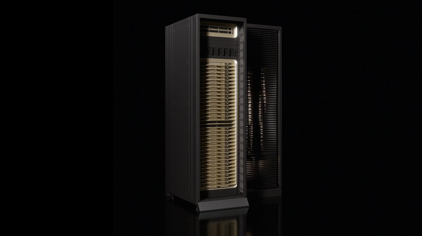

# NVIDIA Launches Vera CPU, Purpose-Built for Agentic AI

> NVIDIA Vera CPU Delivers the Highest Performance and Energy Efficiency for Data Processing, AI Training and Agentic Inference at Scale
> 发布时间: March 16, 2026
> 原文链接: https://nvidianews.nvidia.com/news/nvidia-launches-vera-cpu-purpose-built-for-agentic-ai

---

**News Summary**:

-   The NVIDIA Vera CPU delivers results with twice the efficiency and 50% faster than traditional CPUs.
-   Customers collaborating with NVIDIA to deploy Vera CPU include Alibaba Cloud, ByteDance, Meta and Oracle Cloud Infrastructure, along with CoreWeave, Lambda, Nebius and Nscale.
-   Manufacturing partners already adopting the Vera CPU include Dell Technologies, HPE, Lenovo and Supermicro, along with ASUS, Compal, Foxconn, GIGABYTE, Pegatron, Quanta Cloud Technology (QCT), Wistron and Wiwynn.

**GTC—** NVIDIA today launched the NVIDIA Vera CPU, the world’s first processor purpose-built for the age of agentic AI and reinforcement learning — delivering results with twice the efficiency and 50% faster than traditional rack-scale CPUs.

As reasoning and agentic AI advances, scale, performance and cost are increasingly driven by the infrastructure supporting the models that plan tasks, run tools, interact with data, run code and validate results.

The [NVIDIA Vera CPU](https://www.nvidia.com/en-us/data-center/vera-cpu/) builds on the success of the [NVIDIA Grace™ CPU](https://www.nvidia.com/en-us/data-center/grace-cpu-superchip/), enabling organizations of all sizes and across industries to build AI factories that unlock agentic AI at scale. With the highest single-thread performance and bandwidth per core, Vera is a new class of CPU that delivers higher AI throughput, responsiveness and efficiency for large-scale AI services such as coding assistants, as well as consumer and enterprise agents.

Leading hyperscalers collaborating with NVIDIA to deploy Vera include Alibaba Cloud, CoreWeave, Meta and Oracle Cloud Infrastructure, as well as global system makers [Dell Technologies](https://www.dell.com/en-us/dt/corporate/newsroom/announcements/detailpage.press-releases~usa~2026~03~dell-ai-factory-with-nvidia-delivers-proven-path-to-enterprise-ai-roi.htm#/filter-on/Country:en-us "Dell Technologies"), HPE, Lenovo, Supermicro and others. This broad adoption establishes Vera as the new CPU standard for the AI workloads that matter most for developers, startups, public-private institutions and enterprises — helping democratize access to AI and accelerating innovation.

“Vera is arriving at a turning point for AI. As intelligence becomes agentic — capable of reasoning and acting — the importance of the systems orchestrating that work is elevated,” said Jensen Huang, founder and CEO of NVIDIA. “The CPU is no longer simply supporting the model; it’s driving it. With breakthrough performance and energy efficiency, Vera unlocks AI systems that think faster and scale further.”

**Configurable for Every Data Center**  
NVIDIA announced a new Vera CPU rack integrating 256 liquid-cooled Vera CPUs to sustain more than 22,500 concurrent CPU environments, each running independently at full performance. AI factories can quickly deploy and scale to tens of thousands of simultaneous instances and agentic tools in a single rack.  
  
The new Vera rack is built using the [NVIDIA MGX™](https://www.nvidia.com/en-us/data-center/products/mgx/) modular reference architecture, supported by 80 ecosystem partners worldwide.

As part of the [NVIDIA Vera Rubin NVL72](https://www.nvidia.com/en-us/data-center/vera-rubin-nvl72/) platform, Vera CPUs are paired with NVIDIA GPUs through NVIDIA NVLink™-C2C interconnect technology, with 1.8 TB/s of coherent bandwidth — 7x the bandwidth of PCIe Gen 6 — for high-speed data sharing between CPUs and GPUs. Additionally, NVIDIA introduced new reference designs that use Vera as the host CPU for NVIDIA HGX™ Rubin NVL8 systems, coordinating data movement and system control for GPU-accelerated workloads.

Vera systems partners are providing both dual and single-socket CPU server configurations, optimal for workloads such as reinforcement learning, agentic inference, data processing, orchestration, storage management, cloud applications and high-performance computing.

Across all configurations, Vera systems integrate [NVIDIA ConnectX® SuperNIC cards](https://www.nvidia.com/en-us/networking/products/ethernet/supernic/) and [NVIDIA BlueField®\-4](https://www.nvidia.com/en-us/networking/products/data-processing-unit/) DPUs for accelerated networking, storage and security, which are critical for agentic AI. This enables customers to optimize for their specific workloads while maintaining a single software stack across the NVIDIA platform.

**Designed for Agentic Scaling**  
By combining high-performance, energy-efficient CPU cores, a high-bandwidth memory subsystem and the second-generation NVIDIA Scalable Coherency Fabric, Vera enables faster agentic responses under the extreme utilization conditions common for agentic AI and reinforcement learning.

Vera features 88 custom NVIDIA-designed Olympus cores, delivering high performance for compilers, runtime engines, analytics pipelines, agentic tooling and orchestration services. Each core can run two tasks, using NVIDIA Spatial Multithreading, to deliver consistent, predictable performance — ideal for multi-tenant AI factories running many jobs at once.

To further enhance energy efficiency, Vera introduces the second generation of NVIDIA’s low-power memory subsystem, now built on LPDDR5X memory and delivering up to 1.2 TB/s of bandwidth — twice the bandwidth and at half the power compared with general-purpose CPUs.

**Widespread Ecosystem Support**  
Cursor, an innovator in AI-native software development, is adopting NVIDIA Vera to boost performance for its AI coding agents.

“We’re excited to use NVIDIA Vera CPUs to improve overall throughput and efficiency so we can deliver faster, more responsive coding agent experiences for our customers,” said Michael Truell, cofounder and CEO of Cursor. 

Redpanda, a leading streaming data and AI platform, is using Vera to dramatically boost performance.

“Redpanda recently tested NVIDIA Vera running Apache Kafka-compatible workloads and saw dramatically better performance than other systems we’ve benchmarked, delivering up to 5.5x lower latency,” said Alex Gallego, founder and CEO of Redpanda. “Vera represents a new direction in CPU architecture, with more memory and less overhead per core, enabling our customers to scale real-time streaming workloads further than ever and unlock new AI and agentic applications.”

National laboratories planning to deploy Vera CPUs include Leibniz Supercomputing Centre, Los Alamos National Laboratory, Lawrence Berkeley National Laboratory's National Energy Research Scientific Computing Center and the Texas Advanced Computing Center (TACC).

“At TACC, we recently tested NVIDIA’s Vera CPU platform as we prepare for deployment in our upcoming Horizon system — and running six of our scientific applications, we saw impressive early results,” said John Cazes, director of high-performance computing at TACC. “Vera’s per-core performance and memory bandwidth represent a giant step forward for scientific computing, and we look forward to bringing Vera-based nodes to our CPU users on Horizon later this year.”

Leading cloud service providers planning to deploy Vera CPUs include Alibaba Cloud, ByteDance, Cloudflare, CoreWeave, Crusoe, Lambda, Nebius, Nscale, Oracle Cloud Infrastructure, Together.AI and Vultr.

Leading infrastructure providers adopting Vera CPUs include [Aivres](https://aivres.com/newsroom/gtc-2026-solutions-for-ai-factories-intelligence-at-scale), ASRock Rack, ASUS, [Compal](https://www.compalserver.com/news/18/), Cisco, Dell, Foxconn, GIGABYTE, HPE, Hyve, Inventec, Lenovo, [MiTAC Computing](https://www.mitaccomputing.com/en/PR/MiTAC_Accelerates_Next-Gen_AI_with_Flexible_NVIDIA_MGX_and_Turnkey_Solutions_at_GTC_2026), [MSI](https://www.msi.com/news/detail/GTC-2026--MSI-Drives-End-to-End-AI-Implementation-by-Bridging-Cloud-Computing-and-Autonomous-Edge-Inspection-148297), Pegatron, Quanta Cloud Technology (QCT), Supermicro, Wistron and Wiwynn.

**Availability**  
NVIDIA Vera is in full production and will be available from partners in the second half of this year.

*Watch the* [*GTC keynote*](https://www.nvidia.com/gtc/keynote/) *from Huang and explore* [*sessions*](https://www.nvidia.com/gtc/session-catalog/)*.*
