# LLM Architecture Gallery

> 原文链接: https://sebastianraschka.com/llm-architecture-gallery/

---

> Last updated: April 26, 2026

This page collects architecture figures and fact sheets from posts on [my blog](https://magazine.sebastianraschka.com/), plus selected release posts or technical reports when a new architecture has not been covered there yet. Click a figure to enlarge it, or use the model title to jump to the source article.

If you spot an inaccurate fact sheet, mislabeled architecture, or broken link, please file an issue here: [Architecture Gallery issue tracker](https://github.com/rasbt/LLMs-from-scratch/issues/new?labels=architecture-gallery&title=Architecture%20Gallery%3A%20).

I am very grateful that several people asked for a way to support this project. So, the LLM Architecture Gallery is now available both as a physical poster on [Redbubble](https://www.redbubble.com/i/poster/LLM-Architecture-Gallery-by-Ahead-of-AI/179274487/flk2) and as a print-ready digital download on [Gumroad](https://rasbt.gumroad.com/l/llm-gallery). I ordered the Redbubble print myself to check the print quality; the photo shows the Medium size (26.9 x 23.4 in). The smallest labels are still readable at that size, but I probably would not go smaller.

## Architectures (59)

### GPT-2 XL (1.5B)

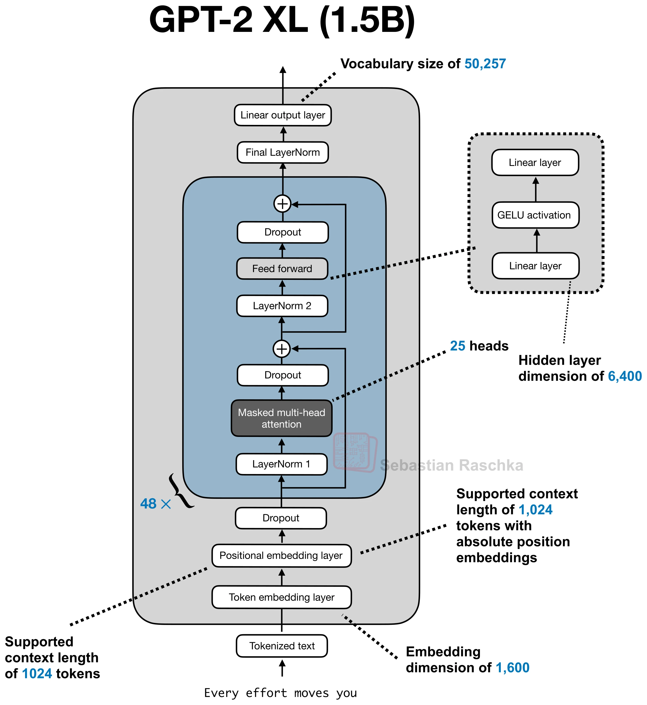

> **Summary:** Late-2019 dense baseline included here as a reference point for how much decoder stacks have changed since GPT-2.
> **Highlight:** Classic GPT-2 recipe with dropout, GELU, LayerNorm, and full multi-head attention.

| Field | Value |
| --- | --- |
| Scale | 1.5B parameters |
| Context | 1,024 tokens |
| Decoder | Dense |
| Attention | MHA with learned absolute positional embeddings |
| Layer mix | 48 MHA |
| KV cache | 300 KiB |
| License | OpenAI "Modified MIT" license |
| AAI total | 32.3 |
| AAI profile | General 31.1 · Scientific 24.8 · Coding 33.9 · Agents 39.4 |

**Resources:** [View in article](https://magazine.sebastianraschka.com/p/from-gpt-2-to-gpt-oss-analyzing-the#%C2%A72-coming-from-gpt-2) · [config.json](https://huggingface.co/openai-community/gpt2-xl/blob/main/config.json) · [Tech report](https://cdn.openai.com/better-language-models/language_models_are_unsupervised_multitask_learners.pdf)

---

### Llama 3 (8B)

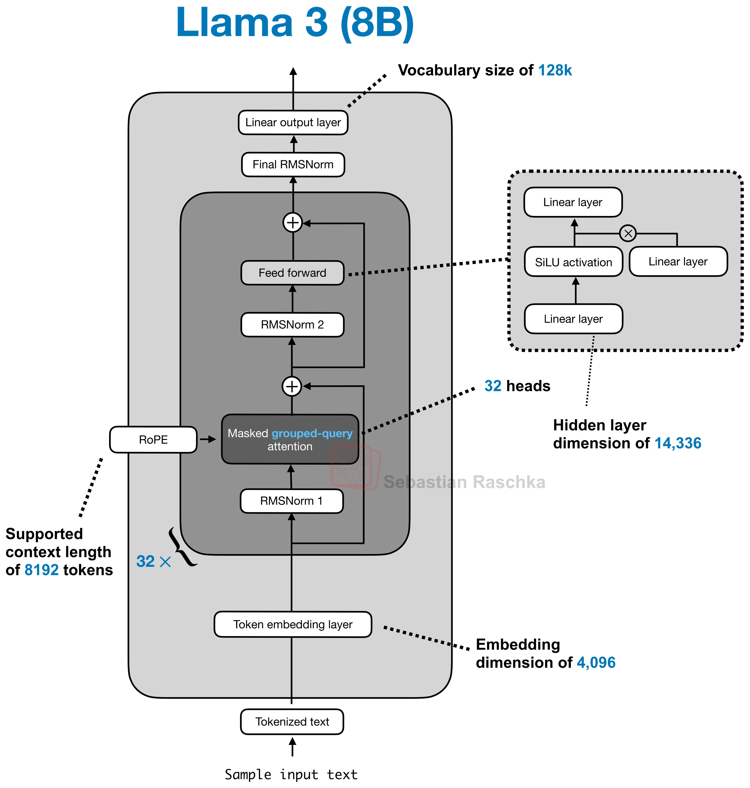

> **Summary:** Reference dense Llama stack used to contrast OLMo 2's normalization and attention choices.
> **Highlight:** Pre-norm baseline; wider than OLMo 2 at a similar scale.

| Field | Value |
| --- | --- |
| Scale | 8B parameters |
| Context | 8,192 tokens |
| Decoder | Dense |
| Attention | GQA with RoPE |
| Layer mix | 32 GQA |
| KV cache | 128 KiB |
| License | Llama 3 Community License Agreement |

**Resources:** [View in article](https://magazine.sebastianraschka.com/p/the-big-llm-architecture-comparison#%C2%A723-olmo-2-summary) · [From scratch](https://github.com/rasbt/LLMs-from-scratch/tree/main/ch05/07_gpt_to_llama) · [config.json](https://huggingface.co/meta-llama/Meta-Llama-3-8B/blob/main/config.json) · [License](https://huggingface.co/meta-llama/Meta-Llama-3-8B/blob/main/LICENSE) · [Tech report](https://arxiv.org/pdf/2407.21783)

---

### Llama 3.2 (1B)

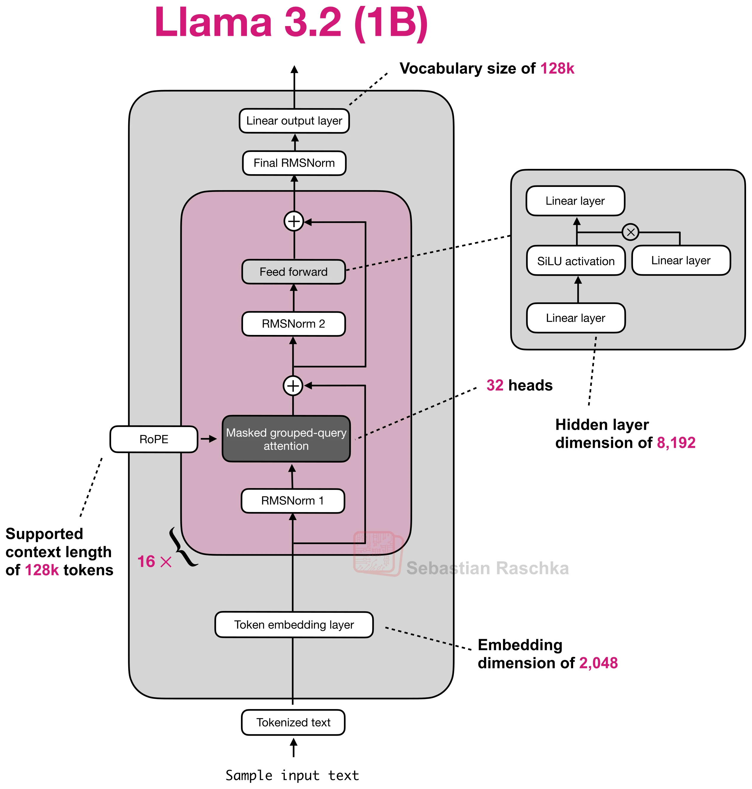

> **Summary:** Small dense Llama baseline in the Qwen comparison, with fewer layers but more width.
> **Highlight:** Wider architecture with more heads than Qwen3 0.6B.

| Field | Value |
| --- | --- |
| Scale | 1B parameters |
| Context | 128,000 tokens |
| Decoder | Dense |
| Attention | GQA |
| Layer mix | 16 GQA |
| KV cache | 32 KiB |
| License | Llama Community License Agreement (variant-specific) |
| AAI total | 6.3 |
| AAI profile | General 17.0 · Scientific 7.6 · Coding 0.6 · Agents 0.0 |

**Resources:** [View in article](https://magazine.sebastianraschka.com/p/the-big-llm-architecture-comparison#%C2%A761-qwen3-dense) · [From scratch](https://github.com/rasbt/LLMs-from-scratch/tree/main/ch05/07_gpt_to_llama) · [License](https://huggingface.co/meta-llama/Llama-3.2-1B/blob/main/LICENSE.txt)

---

### OLMo 2 (7B)

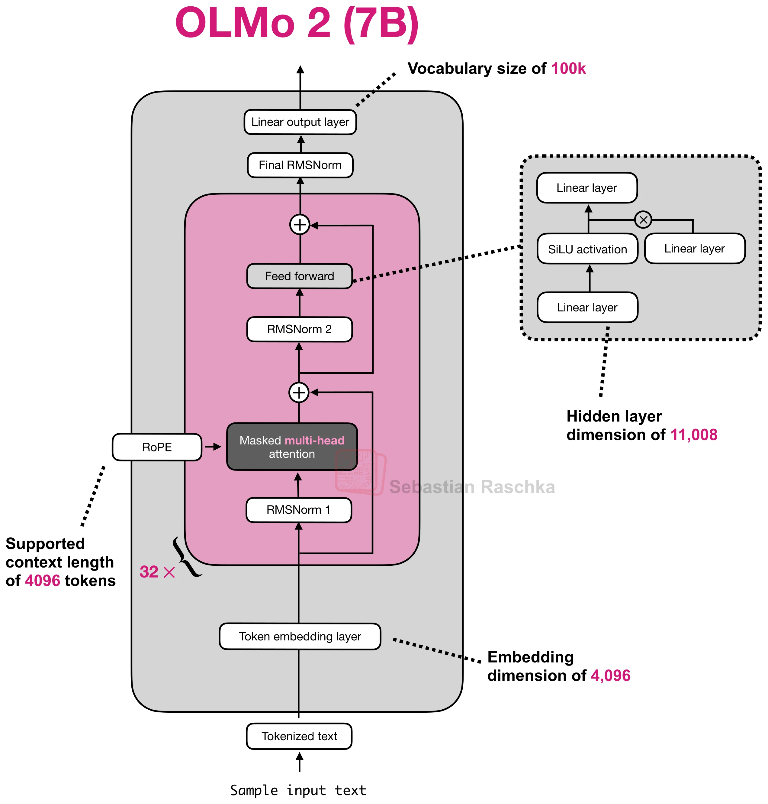

> **Summary:** Transparent dense model that keeps classic MHA and pushes normalization changes for training stability.
> **Highlight:** Uses inside-residual post-norm instead of the usual pre-norm layout.

| Field | Value |
| --- | --- |
| Scale | 7B parameters |
| Context | 4,096 tokens |
| Decoder | Dense |
| Attention | MHA with QK-Norm |
| Layer mix | 32 MHA |
| KV cache | 512 KiB |
| License | Apache License 2.0 |

**Resources:** [View in article](https://magazine.sebastianraschka.com/p/the-big-llm-architecture-comparison#%C2%A723-olmo-2-summary) · [config.json](https://huggingface.co/allenai/OLMo-2-1124-7B-Instruct/blob/main/config.json) · [Tech report](https://arxiv.org/pdf/2501.00656)

---

### DeepSeek V3 (671B)

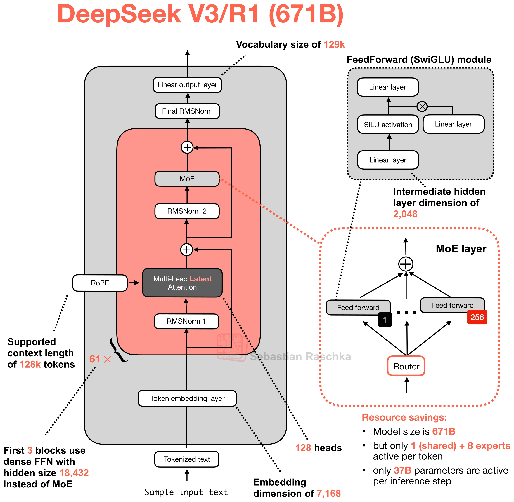

> **Summary:** DeepSeek's flagship template kicked off the recent wave of large open MoE models.
> **Highlight:** Uses a dense prefix plus a shared expert to keep a very large model practical at inference.

| Field | Value |
| --- | --- |
| Scale | 671B total, 37B active (5.5% active) |
| Context | 128,000 tokens |
| Decoder | Sparse MoE |
| Attention | MLA |
| Layer mix | 61 MLA |
| KV cache | 68.6 KiB |
| License | DeepSeek License Agreement v1.0 |
| AAI total | 16.5 |
| AAI profile | General 24.9 · Scientific 15.7 · Coding 16.4 · Agents 8.8 |

**Resources:** [View in article](https://magazine.sebastianraschka.com/p/the-big-llm-architecture-comparison#%C2%A75-llama-4) · [config.json](https://huggingface.co/deepseek-ai/DeepSeek-V3/blob/main/config.json) · [License](https://huggingface.co/deepseek-ai/DeepSeek-V3/blame/main/LICENSE-MODEL) · [Tech report](https://arxiv.org/pdf/2412.19437)

---

### DeepSeek R1 (671B)

> **Summary:** Reasoning-tuned DeepSeek model built on the V3 architecture rather than a new base design.
> **Highlight:** Architecture matches DeepSeek V3; the main change is the reasoning-oriented training recipe.

| Field | Value |
| --- | --- |
| Scale | 671B total, 37B active (5.5% active) |
| Context | 128,000 tokens |
| Decoder | Sparse MoE |
| Attention | MLA |
| Layer mix | 61 MLA |
| KV cache | 68.6 KiB |
| License | MIT License |
| AAI total | 18.8 |
| AAI profile | General 33.1 · Scientific 22.5 · Coding 15.9 · Agents 3.8 |

**Resources:** [View in article](https://magazine.sebastianraschka.com/p/the-big-llm-architecture-comparison#%C2%A78-kimi-k2-and-kimi-k2-thinking) · [config.json](https://huggingface.co/deepseek-ai/DeepSeek-R1/blob/main/config.json) · [License](https://huggingface.co/deepseek-ai/DeepSeek-R1/blob/main/LICENSE) · [Tech report](https://arxiv.org/pdf/2501.12948)

---

### Gemma 3 (27B)

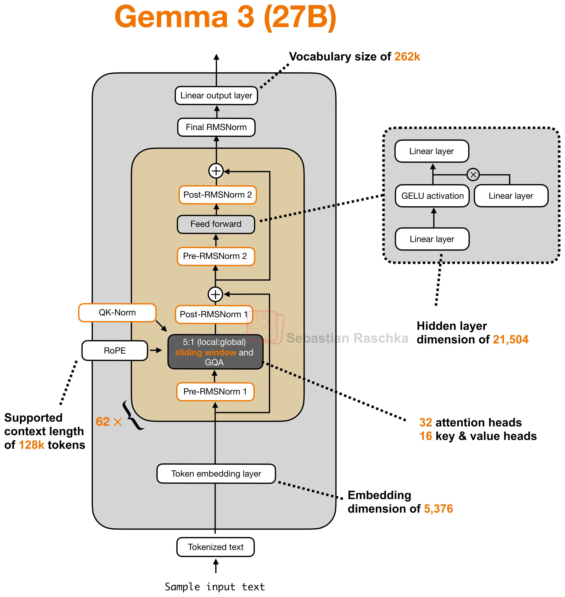

> **Summary:** Gemma's flagship text stack leans on local attention more aggressively than Gemma 2.
> **Highlight:** Built around a 27B sweet spot with heavier local attention and a large 262k multilingual vocabulary.

| Field | Value |
| --- | --- |
| Scale | 27B parameters |
| Context | 128,000 tokens |
| Decoder | Dense |
| Attention | GQA with QK-Norm and 5:1 sliding-window/global attention |
| Layer mix | 52 sliding-window + 10 global |
| KV cache | 496 KiB |
| Vocab | 262,144 (~262k) |
| License | Gemma Terms of Use + Gemma Prohibited Use Policy |
| AAI total | 10.3 |
| AAI profile | General 15.1 · Scientific 13.0 · Coding 9.6 · Agents 3.5 |

**Resources:** [View in article](https://magazine.sebastianraschka.com/p/the-big-llm-architecture-comparison#%C2%A74-mistral-small-31) · [From scratch](https://github.com/rasbt/LLMs-from-scratch/tree/main/ch05/12_gemma3) · [config.json](https://huggingface.co/google/gemma-3-27b-it/blob/main/config.json) · [License](https://ai.google.dev/gemma/prohibited_use_policy) · [Tech report](https://arxiv.org/pdf/2503.19786)

---

### Mistral Small 3.1 (24B)

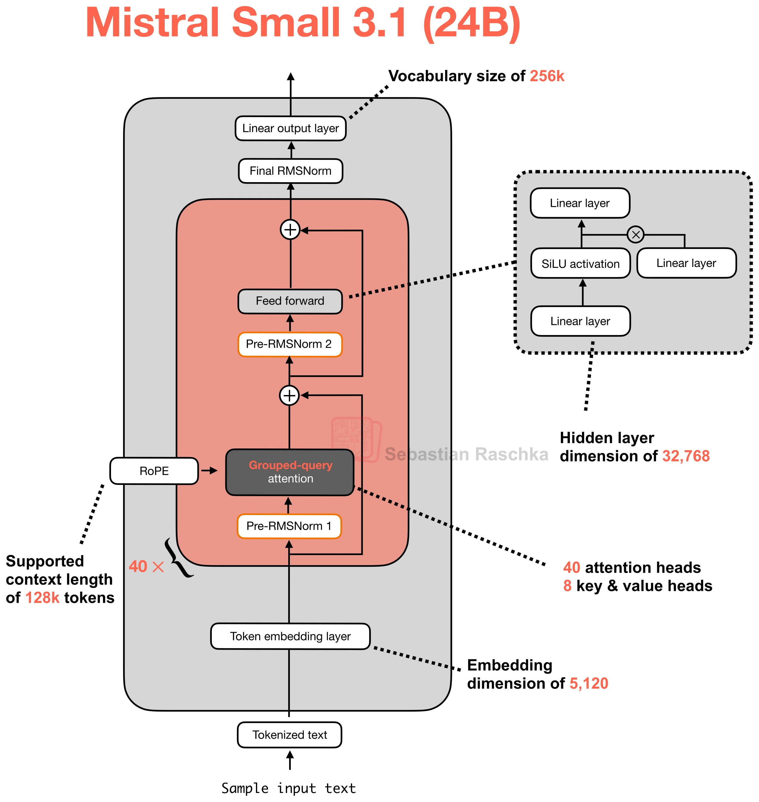

> **Summary:** Fast dense 24B model that drops the sliding-window setup used in older Mistral releases.
> **Highlight:** Latency-focused design with a smaller KV cache and fewer layers than Gemma 3 27B.

| Field | Value |
| --- | --- |
| Scale | 24B parameters |
| Context | 128,000 tokens |
| Decoder | Dense |
| Attention | Standard GQA |
| Layer mix | 40 GQA |
| KV cache | 160 KiB |
| License | Apache License 2.0 |
| AAI total | 14.5 |
| AAI profile | General 21.9 · Scientific 13.8 · Coding 13.9 · Agents 8.4 |

**Resources:** [View in article](https://magazine.sebastianraschka.com/p/the-big-llm-architecture-comparison#%C2%A74-mistral-small-31) · [config.json](https://huggingface.co/mistralai/Mistral-Small-3.1-24B-Base-2503/blob/main/config.json) · [Tech report](https://mistral.ai/news/mistral-small-3-1)

---

### Llama 4 Maverick (400B)

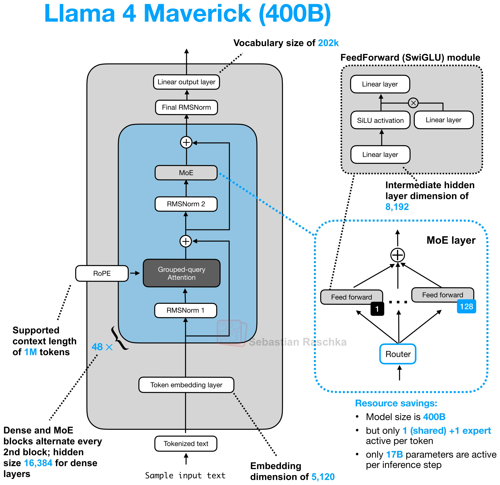

> **Summary:** Meta's large MoE follows the DeepSeek V3 playbook but with a more conventional attention stack.
> **Highlight:** Alternates dense and MoE blocks and uses fewer, larger experts than DeepSeek V3.

| Field | Value |
| --- | --- |
| Scale | 400B total, 17B active (4.3% active) |
| Context | 1,000,000 tokens |
| Decoder | Sparse MoE |
| Attention | GQA |
| Layer mix | 36 chunked + 12 full GQA |
| KV cache | 192 KiB |
| License | Llama 4 Community License Agreement |

**Resources:** [View in article](https://magazine.sebastianraschka.com/p/the-big-llm-architecture-comparison#%C2%A75-llama-4) · [config.json](https://huggingface.co/meta-llama/Llama-4-Maverick-17B-128E-Instruct/blob/main/config.json) · [Tech report](https://ai.meta.com/blog/llama-4-multimodal-intelligence/)

---

### Qwen3 (235B-A22B)

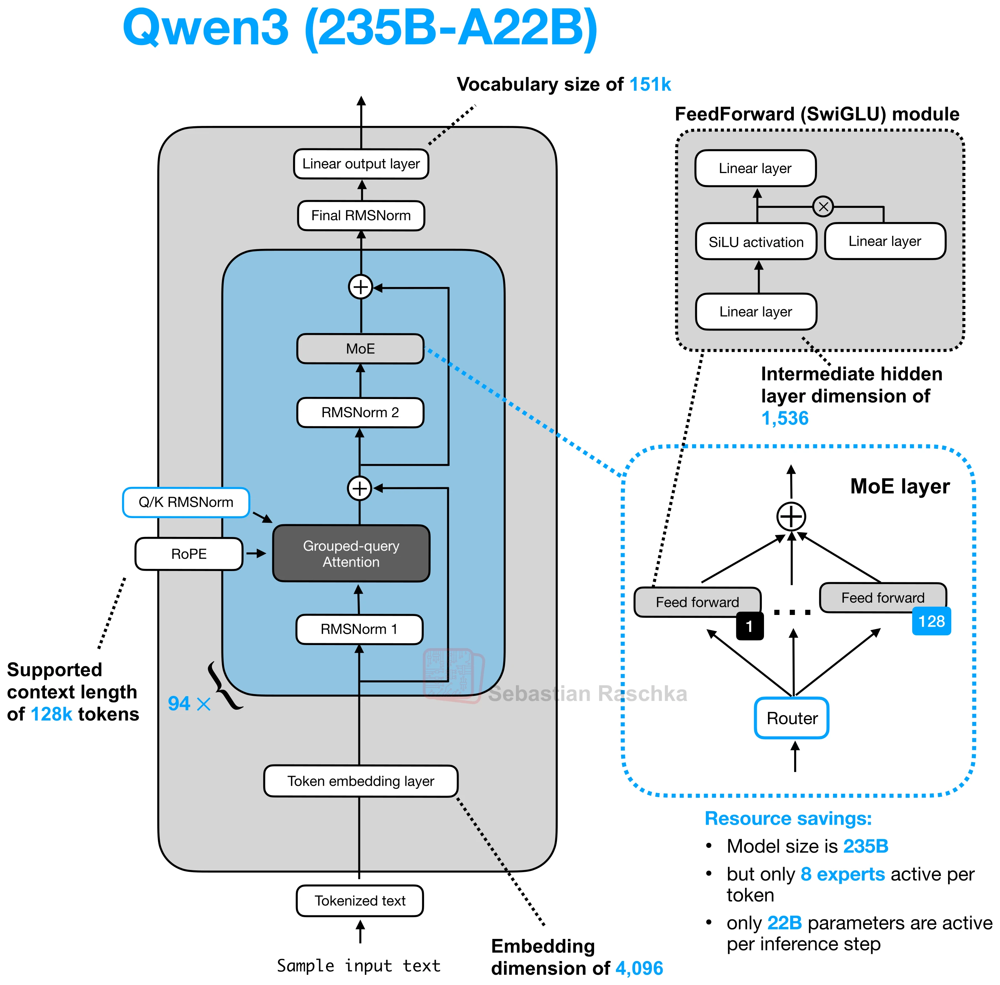

> **Summary:** Large sparse Qwen variant that stays very close to DeepSeek V3 while removing the shared expert.
> **Highlight:** High-capacity MoE design optimized for serving efficiency without a shared expert.

| Field | Value |
| --- | --- |
| Scale | 235B total, 22B active (9.4% active) |
| Context | 128,000 tokens |
| Decoder | Sparse MoE |
| Attention | GQA with QK-Norm |
| Layer mix | 94 GQA |
| KV cache | 188 KiB |
| License | Apache License 2.0 |
| AAI total | 17.0 |
| AAI profile | General 16.9 · Scientific 17.7 · Coding 14.0 · Agents 19.2 |

**Resources:** [View in article](https://magazine.sebastianraschka.com/p/the-big-llm-architecture-comparison#%C2%A762-qwen3-moe) · [From scratch](https://github.com/rasbt/LLMs-from-scratch/tree/main/ch05/11_qwen3) · [config.json](https://huggingface.co/Qwen/Qwen3-235B-A22B/blob/main/config.json) · [License](https://huggingface.co/Qwen/Qwen3-235B-A22B/blob/main/LICENSE) · [Tech report](https://arxiv.org/pdf/2505.09388)

---

### Qwen3 (32B)

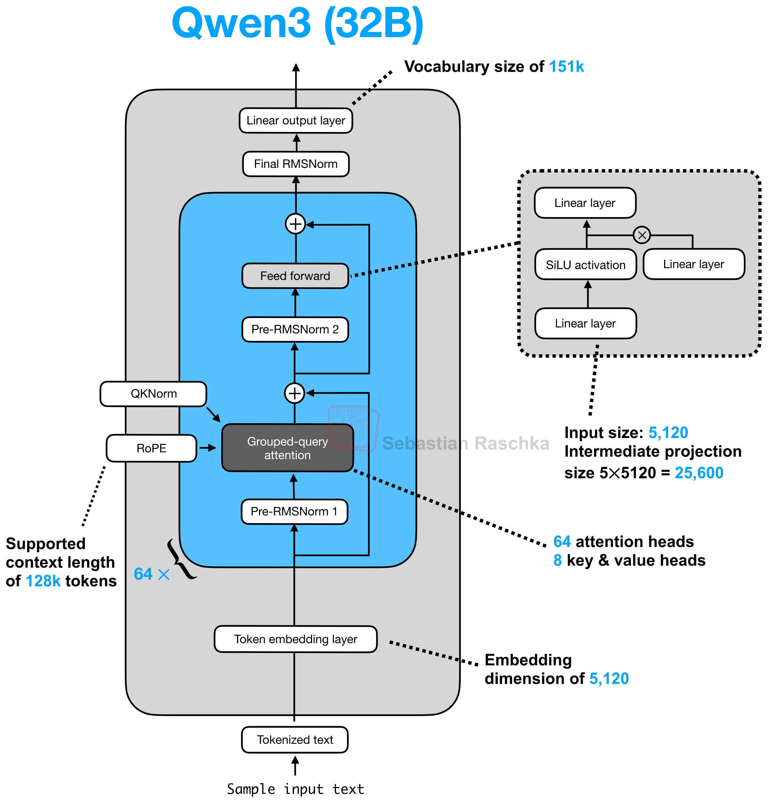

> **Summary:** Large dense Qwen3 model that serves as the clearest like-for-like comparison for OLMo 3 32B.
> **Highlight:** Reference dense Qwen stack with QK-Norm and 8 KV heads.

| Field | Value |
| --- | --- |
| Scale | 32B parameters |
| Context | 128,000 tokens |
| Decoder | Dense |
| Attention | GQA with QK-Norm |
| Layer mix | 64 GQA |
| KV cache | 256 KiB |
| License | Apache License 2.0 |
| AAI total | 14.5 |

**Resources:** [View in article](https://magazine.sebastianraschka.com/p/the-big-llm-architecture-comparison#%C2%A715-olmo-3-thinking) · [From scratch](https://github.com/rasbt/LLMs-from-scratch/tree/main/ch05/11_qwen3) · [config.json](https://huggingface.co/Qwen/Qwen3-32B/blob/main/config.json) · [License](https://huggingface.co/Qwen/Qwen3-32B/blob/main/LICENSE) · [Tech report](https://arxiv.org/pdf/2505.09388)

---

### Qwen3 (4B)

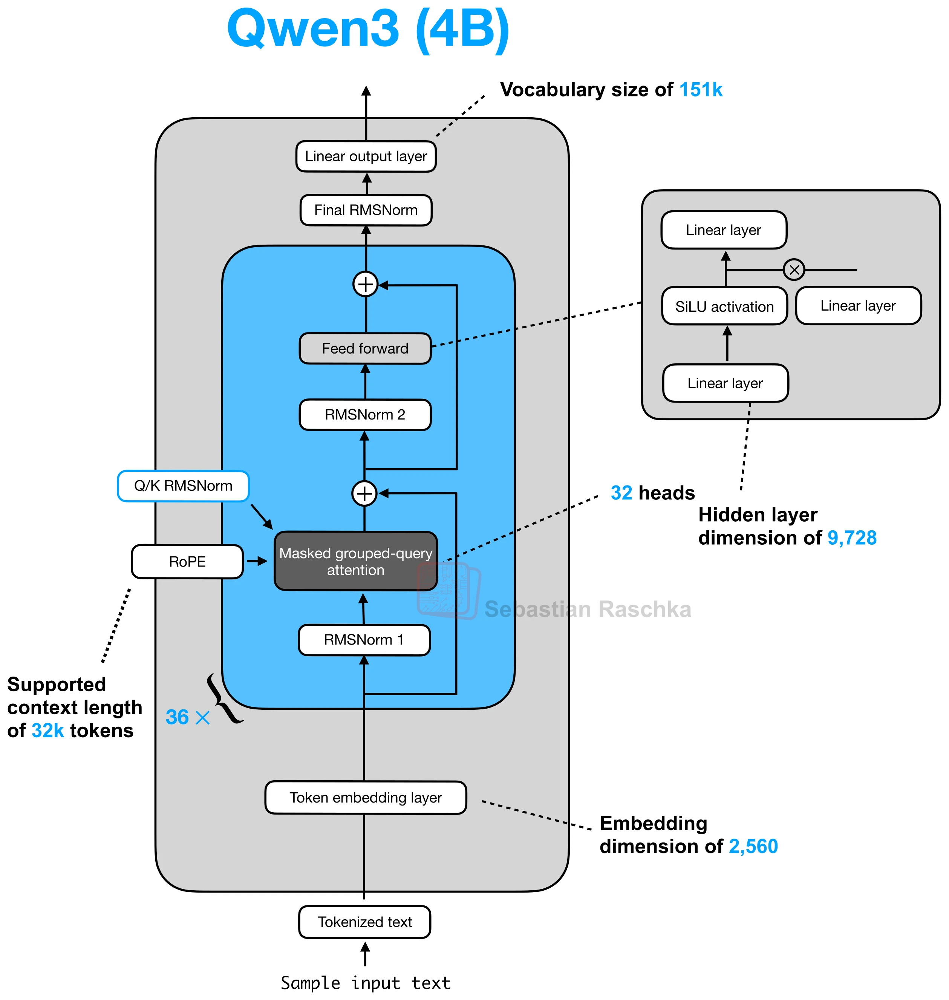

> **Summary:** Mid-size dense Qwen3 model used here as a clean baseline against SmolLM3 and Tiny Aya.
> **Highlight:** Compact Qwen3 dense stack with QK-Norm and a 151k vocabulary.

| Field | Value |
| --- | --- |
| Scale | 4B parameters |
| Context | 32,768 tokens |
| Decoder | Dense |
| Attention | GQA with QK-Norm |
| Layer mix | 36 GQA |
| KV cache | 144 KiB |
| License | Apache License 2.0 |
| AAI total | 12.5 |

**Resources:** [View in article](https://magazine.sebastianraschka.com/p/the-big-llm-architecture-comparison#%C2%A77-smollm3) · [From scratch](https://github.com/rasbt/LLMs-from-scratch/tree/main/ch05/11_qwen3) · [config.json](https://huggingface.co/Qwen/Qwen3-4B/blob/main/config.json) · [License](https://huggingface.co/Qwen/Qwen3-4B/blob/main/LICENSE) · [Tech report](https://arxiv.org/pdf/2505.09388)

---

### Qwen3 (8B)

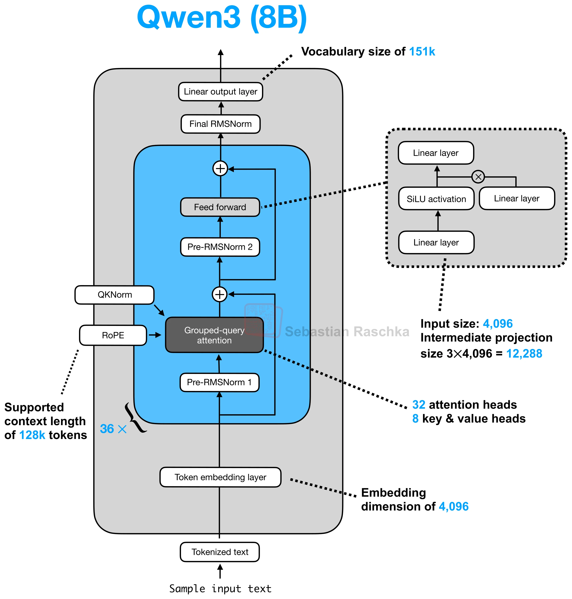

> **Summary:** Dense Qwen3 baseline used here to show how little OLMo 3 changed the overall decoder recipe.
> **Highlight:** Reference Qwen3 dense stack with QK-Norm and 8 KV heads.

| Field | Value |
| --- | --- |
| Scale | 8B parameters |
| Context | 128,000 tokens |
| Decoder | Dense |
| Attention | GQA with QK-Norm |
| Layer mix | 36 GQA |
| KV cache | 144 KiB |
| License | Apache License 2.0 |
| AAI total | 10.6 |
| AAI profile | General 11.2 · Scientific 12.7 · Coding 7.1 · Agents 11.6 |

**Resources:** [View in article](https://magazine.sebastianraschka.com/p/the-big-llm-architecture-comparison#%C2%A715-olmo-3-thinking) · [From scratch](https://github.com/rasbt/LLMs-from-scratch/tree/main/ch05/11_qwen3) · [config.json](https://huggingface.co/Qwen/Qwen3-8B/blob/main/config.json) · [License](https://huggingface.co/Qwen/Qwen3-8B/blob/main/LICENSE) · [Tech report](https://arxiv.org/pdf/2505.09388)

---

### SmolLM3 (3B)

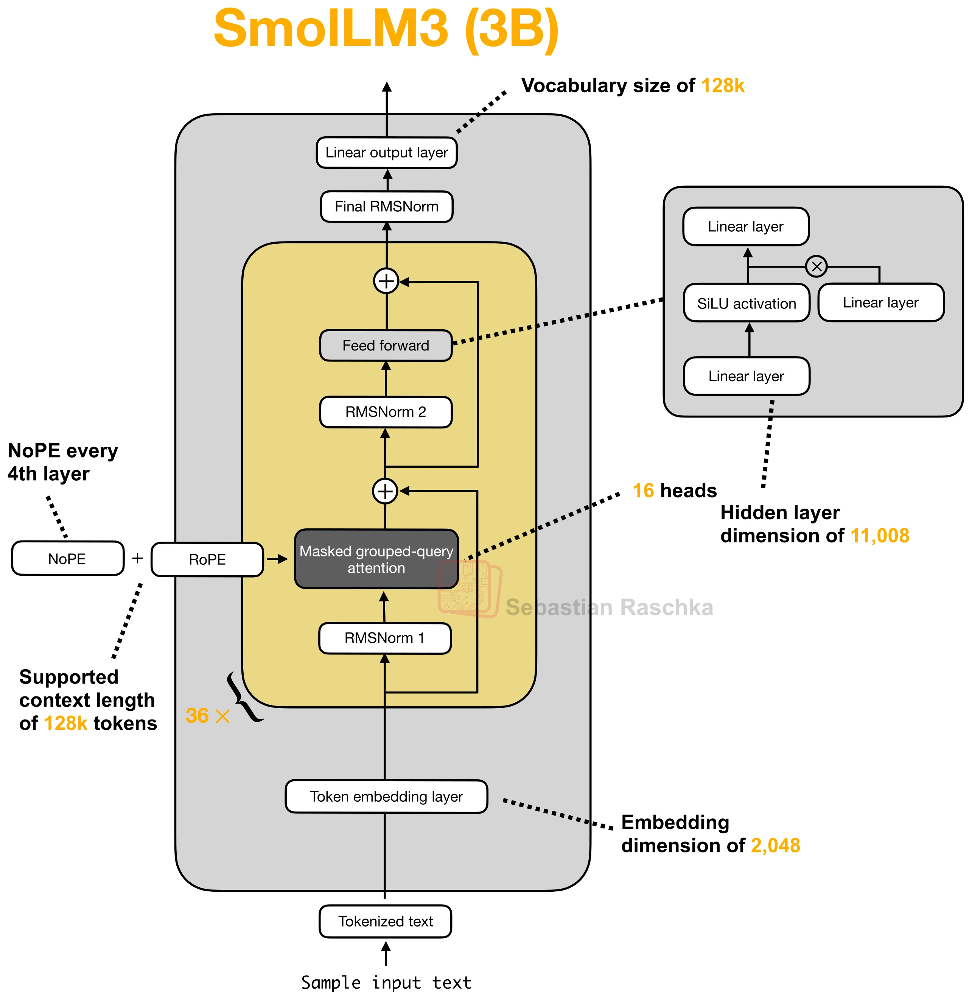

> **Summary:** Compact dense model that experiments with leaving out positional encodings in selected layers.
> **Highlight:** Every fourth layer omits RoPE to test a NoPE-style cadence.

| Field | Value |
| --- | --- |
| Scale | 3B parameters |
| Context | 131,072 tokens |
| Decoder | Dense |
| Attention | GQA with periodic NoPE layers |
| Layer mix | 36 GQA |
| KV cache | 72 KiB |
| License | Apache License 2.0 |

**Resources:** [View in article](https://magazine.sebastianraschka.com/p/the-big-llm-architecture-comparison#%C2%A77-smollm3) · [config.json](https://huggingface.co/HuggingFaceTB/SmolLM3-3B-Base/blob/main/config.json) · [Tech report](https://huggingface.co/blog/smollm3)

---

### Kimi K2 (1T)

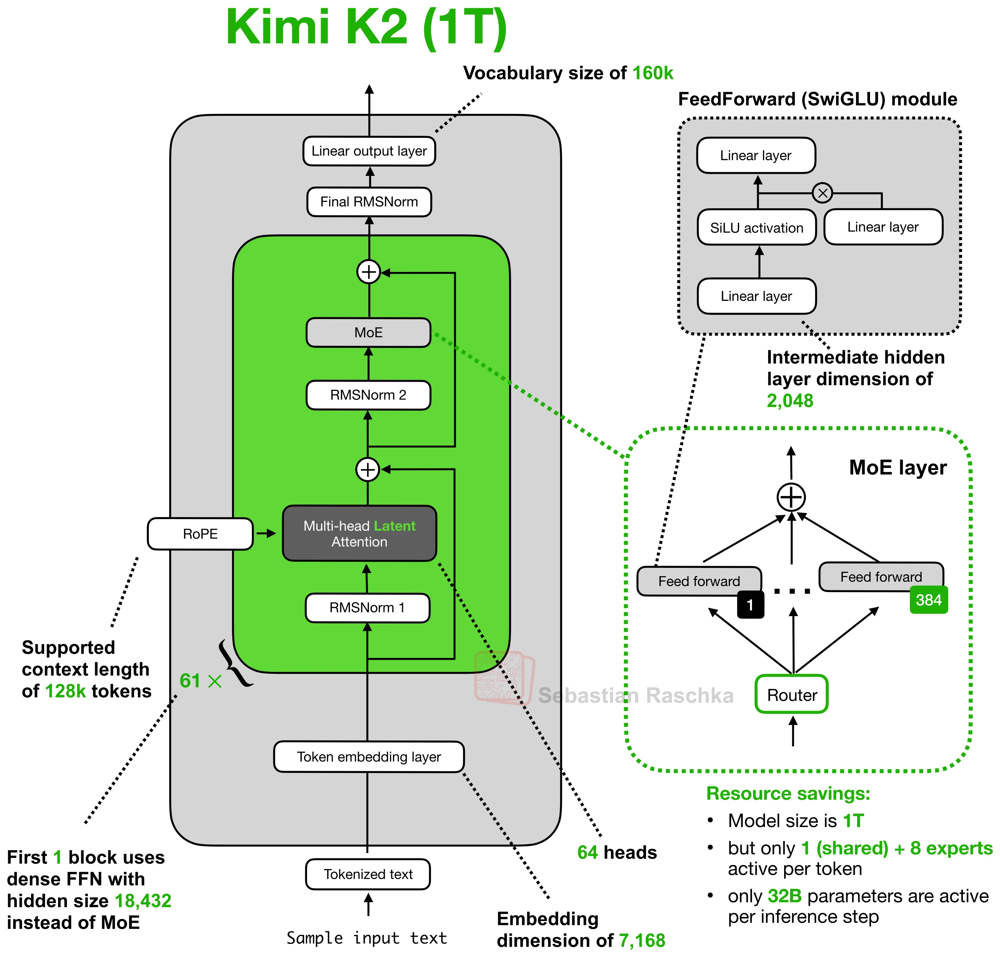

> **Summary:** Trillion-parameter Moonshot model that essentially scales the DeepSeek V3 recipe upward.
> **Highlight:** More experts and fewer MLA heads than DeepSeek V3.

| Field | Value |
| --- | --- |
| Scale | 1T total, 32B active (3.2% active) |
| Context | 128,000 tokens |
| Decoder | Sparse MoE |
| Attention | MLA |
| Layer mix | 61 MLA |
| KV cache | 68.6 KiB |
| License | Modified MIT License |
| AAI total | 26.3 |
| AAI profile | General 36.3 · Scientific 22.6 · Coding 22.1 · Agents 24.3 |

**Resources:** [View in article](https://magazine.sebastianraschka.com/p/the-big-llm-architecture-comparison#%C2%A78-kimi-k2-and-kimi-k2-thinking) · [config.json](https://huggingface.co/moonshotai/Kimi-K2-Base/blob/main/config.json) · [License](https://huggingface.co/moonshotai/Kimi-K2-Base/blame/main/LICENSE) · [Tech report](https://arxiv.org/pdf/2507.20534)

---

### GLM-4.5 (355B)

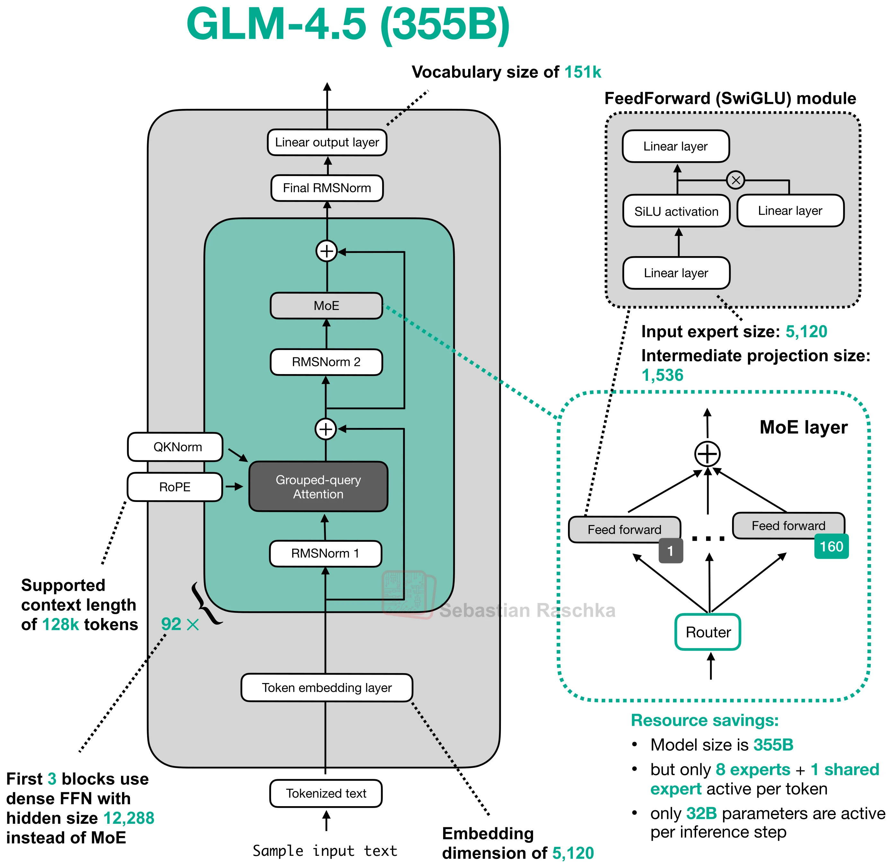

> **Summary:** Agent-oriented instruction/reasoning hybrid that borrows DeepSeek's dense-prefix MoE layout.
> **Highlight:** Starts with three dense layers before MoE routing and keeps a shared expert.

| Field | Value |
| --- | --- |
| Scale | 355B total, 32B active (9% active) |
| Context | 128,000 tokens |
| Decoder | Sparse MoE |
| Attention | GQA with QK-Norm |
| Layer mix | 92 GQA |
| KV cache | 368 KiB |
| License | MIT License |
| AAI total | 26.4 |
| AAI profile | General 37.5 · Scientific 25.6 · Coding 26.3 · Agents 16.2 |

**Resources:** [View in article](https://magazine.sebastianraschka.com/p/the-big-llm-architecture-comparison#%C2%A711-glm-45) · [config.json](https://huggingface.co/zai-org/GLM-4.5/blob/main/config.json) · [Tech report](https://arxiv.org/pdf/2508.06471)

---

### GPT-OSS (120B)

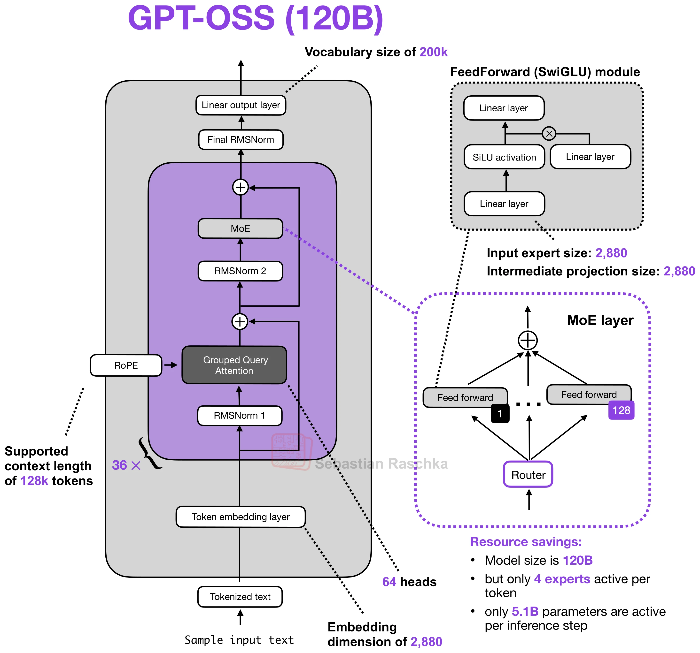

> **Summary:** Larger gpt-oss variant keeps the same alternating-attention recipe as the 20B model.
> **Highlight:** Shared architectural template scaled up for OpenAI's flagship open-weight release.

| Field | Value |
| --- | --- |
| Scale | 117B total, 5.1B active (4.4% active) |
| Context | 128,000 tokens |
| Decoder | Sparse MoE |
| Attention | GQA with alternating sliding-window and global layers |
| Layer mix | 18 sliding-window + 18 global |
| KV cache | 72 KiB |
| License | Apache License 2.0 |
| AAI total | 33.3 |
| AAI profile | General 37.5 · Scientific 29.1 · Coding 28.6 · Agents 37.9 |

**Resources:** [View in article](https://magazine.sebastianraschka.com/p/the-big-llm-architecture-comparison#%C2%A79-gpt-oss) · [config.json](https://huggingface.co/openai/gpt-oss-120b/blob/main/config.json) · [License](https://huggingface.co/openai/gpt-oss-120b/blob/main/LICENSE) · [Tech report](https://cdn.openai.com/pdf/419b6906-9da6-406c-a19d-1bb078ac7637/oai_gpt-oss_model_card.pdf)

---

### GPT-OSS (20B)

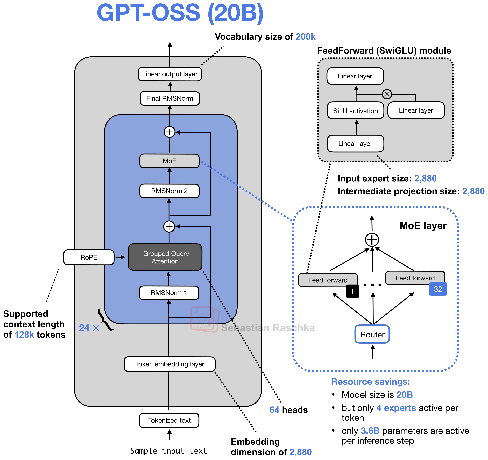

> **Summary:** OpenAI's smaller open-weight MoE model favors width and alternating local/global attention.
> **Highlight:** Wider and shallower than Qwen3, with attention bias and sink mechanisms.

| Field | Value |
| --- | --- |
| Scale | 21B total, 3.6B active (17.1% active) |
| Context | 128,000 tokens |
| Decoder | Sparse MoE |
| Attention | GQA with alternating sliding-window and global layers |
| Layer mix | 12 sliding-window + 12 global |
| KV cache | 48 KiB |
| License | Apache License 2.0 |
| AAI total | 24.5 |
| AAI profile | General 29.3 · Scientific 22.5 · Coding 18.5 · Agents 27.6 |

**Resources:** [View in article](https://magazine.sebastianraschka.com/p/the-big-llm-architecture-comparison#%C2%A79-gpt-oss) · [config.json](https://huggingface.co/openai/gpt-oss-20b/blob/main/config.json) · [License](https://huggingface.co/openai/gpt-oss-20b/blob/main/LICENSE) · [Tech report](https://cdn.openai.com/pdf/419b6906-9da6-406c-a19d-1bb078ac7637/oai_gpt-oss_model_card.pdf)

---

### Gemma 3 (270M)

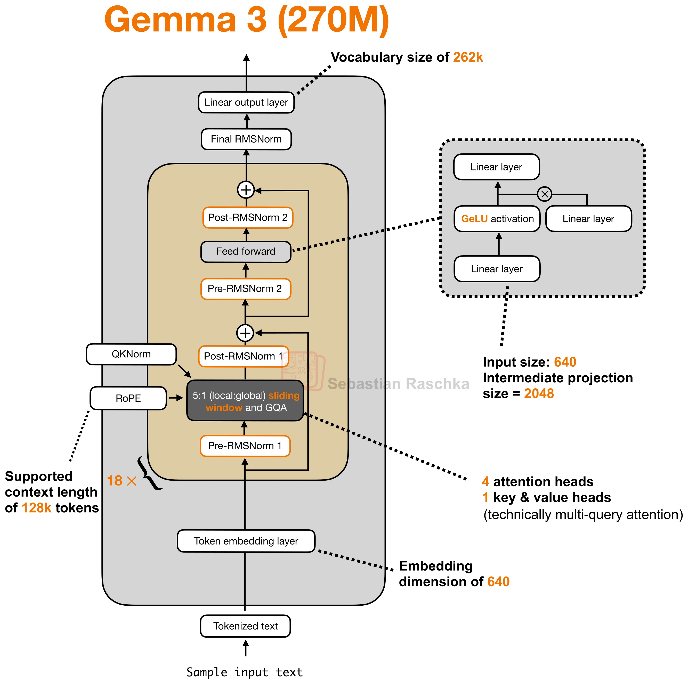

> **Summary:** Tiny Gemma 3 variant that preserves the family's local-global attention recipe at a toy scale.
> **Highlight:** Keeps the Gemma 3 stack shape while shrinking down to 4 attention heads, a single KV head, and the same 262k vocabulary.

| Field | Value |
| --- | --- |
| Scale | 270M parameters |
| Context | 128,000 tokens |
| Decoder | Dense |
| Attention | Multi-query attention with QK-Norm and 5:1 sliding-window/global attention |
| Layer mix | 15 sliding-window + 3 global |
| KV cache | 18 KiB |
| Vocab | 262,144 (~262k) |
| License | Gemma Terms of Use + Gemma Prohibited Use Policy |
| AAI total | 7.7 |
| AAI profile | General 20.1 · Scientific 7.7 · Coding 0.0 · Agents 3.0 |

**Resources:** [View in article](https://magazine.sebastianraschka.com/p/the-big-llm-architecture-comparison#%C2%A74-mistral-small-31) · [From scratch](https://github.com/rasbt/LLMs-from-scratch/tree/main/ch05/12_gemma3) · [config.json](https://huggingface.co/google/gemma-3-270m/blob/main/config.json) · [License](https://ai.google.dev/gemma/prohibited_use_policy) · [Tech report](https://arxiv.org/pdf/2503.19786)

---

### Grok 2.5 (270B)

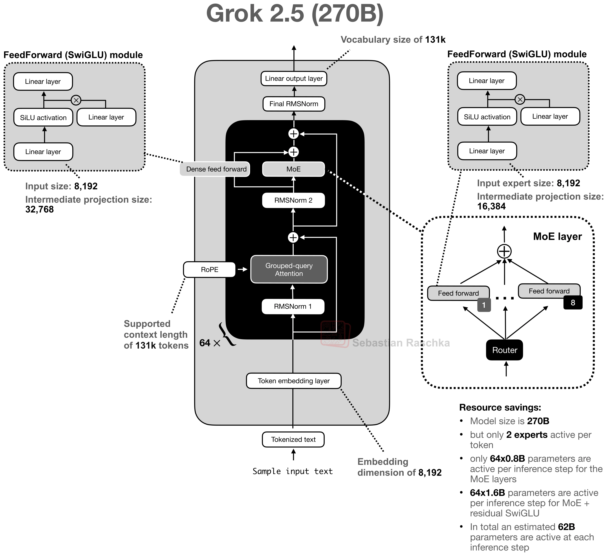

> **Summary:** Rare production-model release that shows an older MoE style with fewer, larger experts.
> **Highlight:** Adds an always-on SwiGLU path that effectively behaves like a shared expert.

| Field | Value |
| --- | --- |
| Scale | 270B parameters |
| Context | 131,072 tokens |
| Decoder | Sparse MoE |
| Attention | GQA |
| Layer mix | 64 GQA |
| KV cache | 256 KiB |
| License | Grok 2 Community License Agreement |

**Resources:** [View in article](https://magazine.sebastianraschka.com/p/the-big-llm-architecture-comparison#%C2%A710-grok-25) · [config.json](https://huggingface.co/xai-org/grok-2/blob/main/config.json)

---

### Qwen3 Next (80B-A3B)

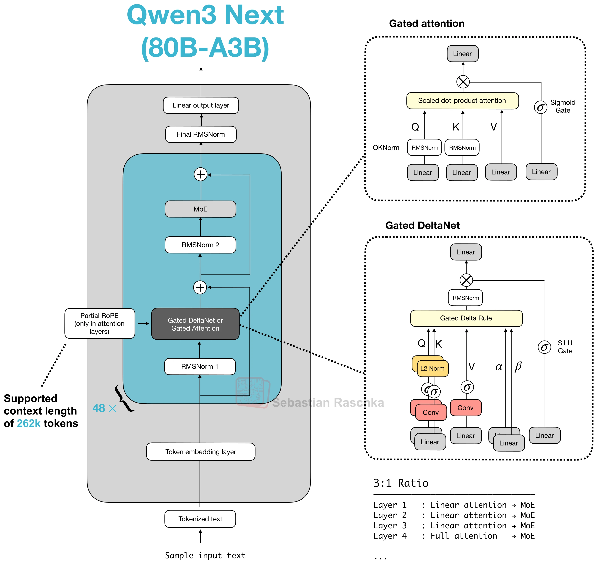

> **Summary:** Efficiency-focused Qwen refresh that swaps standard attention for a DeltaNet-attention hybrid.
> **Highlight:** Adds many more experts, a shared expert, and a native 262k context.

| Field | Value |
| --- | --- |
| Scale | 80B total, 3B active (3.8% active) |
| Context | 262,144 tokens |
| Decoder | Sparse hybrid |
| Attention | 3:1 Gated DeltaNet and Gated Attention |
| Layer mix | 12 gated attention + 36 DeltaNet |
| KV cache | 24 KiB |
| License | Apache License 2.0 |
| AAI total | 20.1 |
| AAI profile | General 28.9 · Scientific 22.1 · Coding 15.3 · Agents 14.2 |

**Resources:** [View in article](https://magazine.sebastianraschka.com/p/the-big-llm-architecture-comparison#%C2%A7121-expert-size-and-number) · [config.json](https://huggingface.co/Qwen/Qwen3-Next-80B-A3B-Instruct/blob/main/config.json) · [License](https://huggingface.co/Qwen/Qwen3-Next-80B-A3B-Instruct/blob/main/LICENSE)

---

### MiniMax M2 (230B)

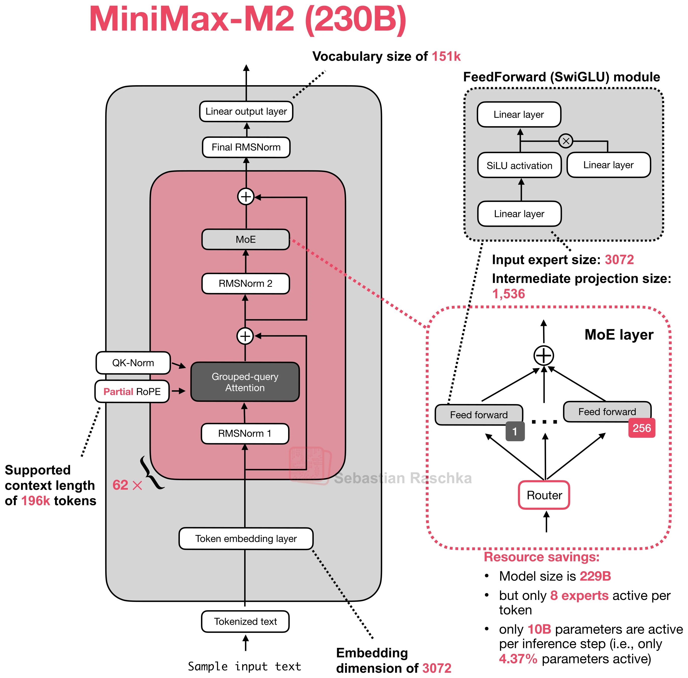

> **Summary:** MiniMax's flagship returns to full attention and looks like a leaner, sparser cousin of Qwen3.
> **Highlight:** Uses per-layer QK-Norm and much sparser MoE routing than Qwen3.

| Field | Value |
| --- | --- |
| Scale | 230B total, 10B active (4.3% active) |
| Context | 196,608 tokens |
| Decoder | Sparse MoE |
| Attention | GQA with QK-Norm and partial RoPE |
| Layer mix | 62 GQA |
| KV cache | 248 KiB |
| License | Modified MIT License |

**Resources:** [View in article](https://magazine.sebastianraschka.com/p/the-big-llm-architecture-comparison#%C2%A7131-per-layer-qk-norm) · [config.json](https://huggingface.co/MiniMaxAI/MiniMax-M2/blob/main/config.json)

---

### Kimi Linear (48B-A3B)

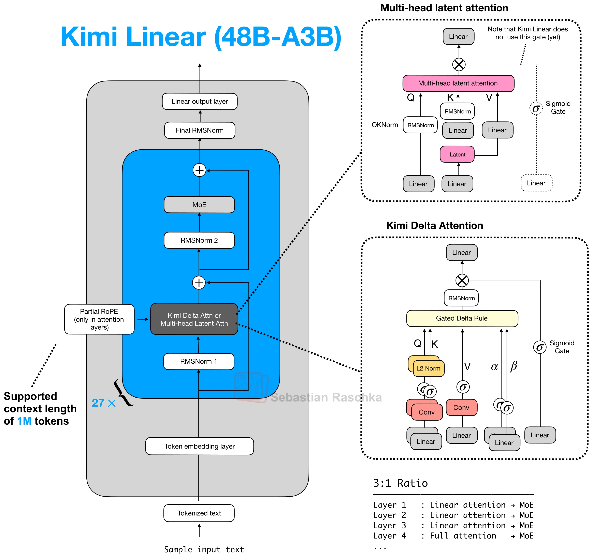

> **Summary:** Linear-attention hybrid that keeps a transformer backbone but replaces most full-attention layers.
> **Highlight:** Uses NoPE in MLA layers and channel-wise gating for long-context efficiency.

| Field | Value |
| --- | --- |
| Scale | 48B total, 3B active (6.3% active) |
| Context | 1,000,000 tokens |
| Decoder | Sparse hybrid |
| Attention | 3:1 Kimi Delta Attention and MLA |
| Layer mix | 7 MLA + 20 Kimi Delta Attention |
| KV cache | 7.9 KiB |
| License | MIT License |
| AAI total | 14.4 |
| AAI profile | General N/A · Scientific N/A · Coding 14.2 · Agents N/A |

**Resources:** [View in article](https://magazine.sebastianraschka.com/p/the-big-llm-architecture-comparison#%C2%A7144-kimi-linear-vs-qwen3-next) · [config.json](https://huggingface.co/moonshotai/Kimi-Linear-48B-A3B-Base/blob/main/config.json) · [Tech report](https://arxiv.org/pdf/2510.26692)

---

### OLMo 3 (32B)

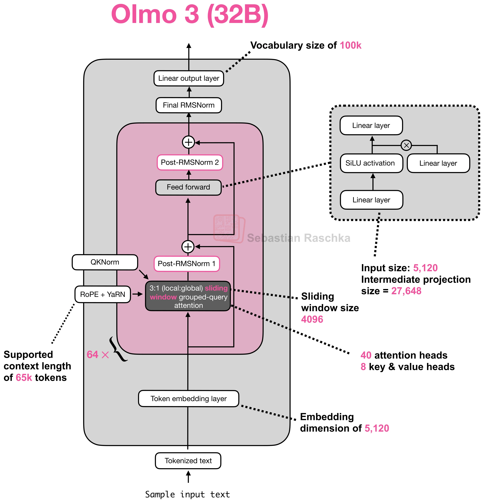

> **Summary:** Scaled-up OLMo 3 keeps the same block design but moves to grouped-query attention.
> **Highlight:** Keeps post-norm while scaling width and applying YaRN only on global layers.

| Field | Value |
| --- | --- |
| Scale | 32B parameters |
| Context | 65,536 tokens |
| Decoder | Dense |
| Attention | GQA with QK-Norm and 3:1 sliding-window/global attention |
| Layer mix | 48 sliding-window + 16 global |
| KV cache | 256 KiB |
| License | Apache License 2.0 |

**Resources:** [View in article](https://magazine.sebastianraschka.com/p/the-big-llm-architecture-comparison#%C2%A715-olmo-3-thinking) · [From scratch](https://github.com/rasbt/LLMs-from-scratch/tree/main/ch05/13_olmo3) · [config.json](https://huggingface.co/allenai/Olmo-3-32B-Think/blob/main/config.json) · [Tech report](https://arxiv.org/pdf/2512.13961)

---

### OLMo 3 (7B)

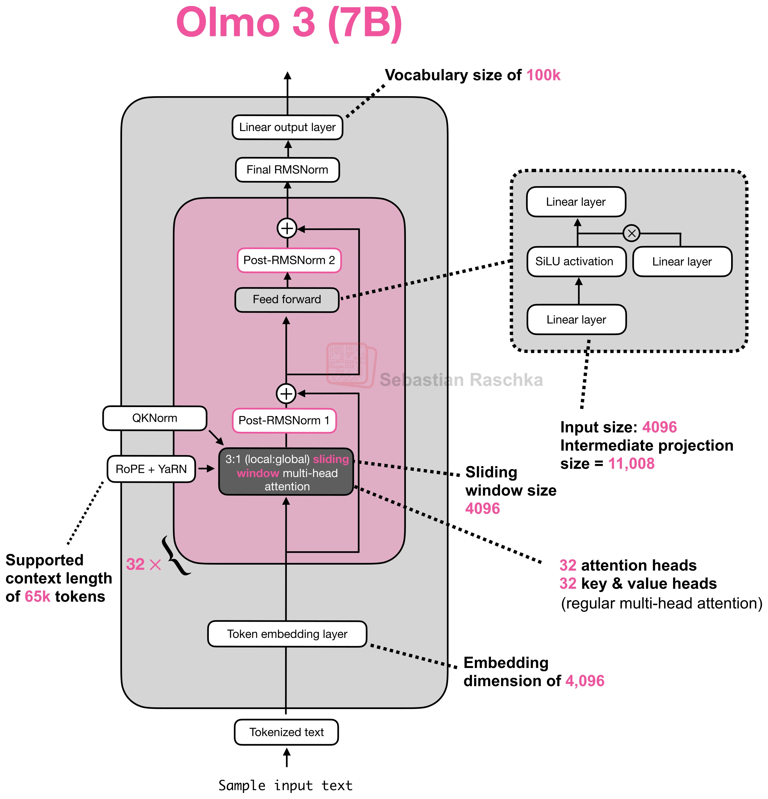

> **Summary:** New transparent Allen AI model that keeps OLMo's post-norm flavor while modernizing context handling.
> **Highlight:** Retains post-norm, keeps MHA, and applies YaRN only on global layers.

| Field | Value |
| --- | --- |
| Scale | 7B parameters |
| Context | 65,536 tokens |
| Decoder | Dense |
| Attention | MHA with QK-Norm and 3:1 sliding-window/global attention |
| Layer mix | 24 sliding-window + 8 global |
| KV cache | 512 KiB |
| License | Apache License 2.0 |
| AAI total | 8.2 |
| AAI profile | General 12.1 · Scientific 12.9 · Coding 3.4 · Agents 4.2 |

**Resources:** [View in article](https://magazine.sebastianraschka.com/p/the-big-llm-architecture-comparison#%C2%A715-olmo-3-thinking) · [From scratch](https://github.com/rasbt/LLMs-from-scratch/tree/main/ch05/13_olmo3) · [config.json](https://huggingface.co/allenai/Olmo-3-1025-7B/blob/main/config.json) · [Tech report](https://arxiv.org/pdf/2512.13961)

---

### DeepSeek V3.2 (671B)

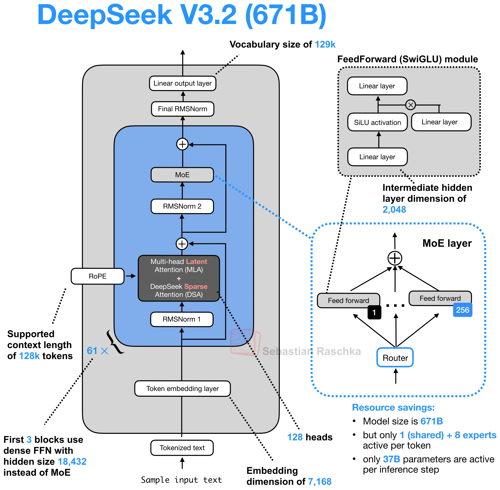

> **Summary:** DeepSeek's successor keeps the V3 template but adds sparse attention to cut long-context costs.
> **Highlight:** An evolutionary update focused on efficiency rather than a new base layout.

| Field | Value |
| --- | --- |
| Scale | 671B total, 37B active (5.5% active) |
| Context | 128,000 tokens |
| Decoder | Sparse MoE |
| Attention | MLA with DeepSeek Sparse Attention |
| Layer mix | 61 MLA |
| KV cache | 68.6 KiB |
| License | MIT License |
| AAI total | 32.1 |
| AAI profile | General 29.7 · Scientific 24.2 · Coding 34.6 · Agents 39.8 |

**Resources:** [View in article](https://magazine.sebastianraschka.com/p/the-big-llm-architecture-comparison#%C2%A716-deepseek-v32) · [config.json](https://huggingface.co/deepseek-ai/DeepSeek-V3.2/blob/main/config.json) · [License](https://huggingface.co/deepseek-ai/DeepSeek-V3.2/blob/main/LICENSE) · [Tech report](https://arxiv.org/pdf/2512.02556)

---

### Mistral Large 3 (673B)

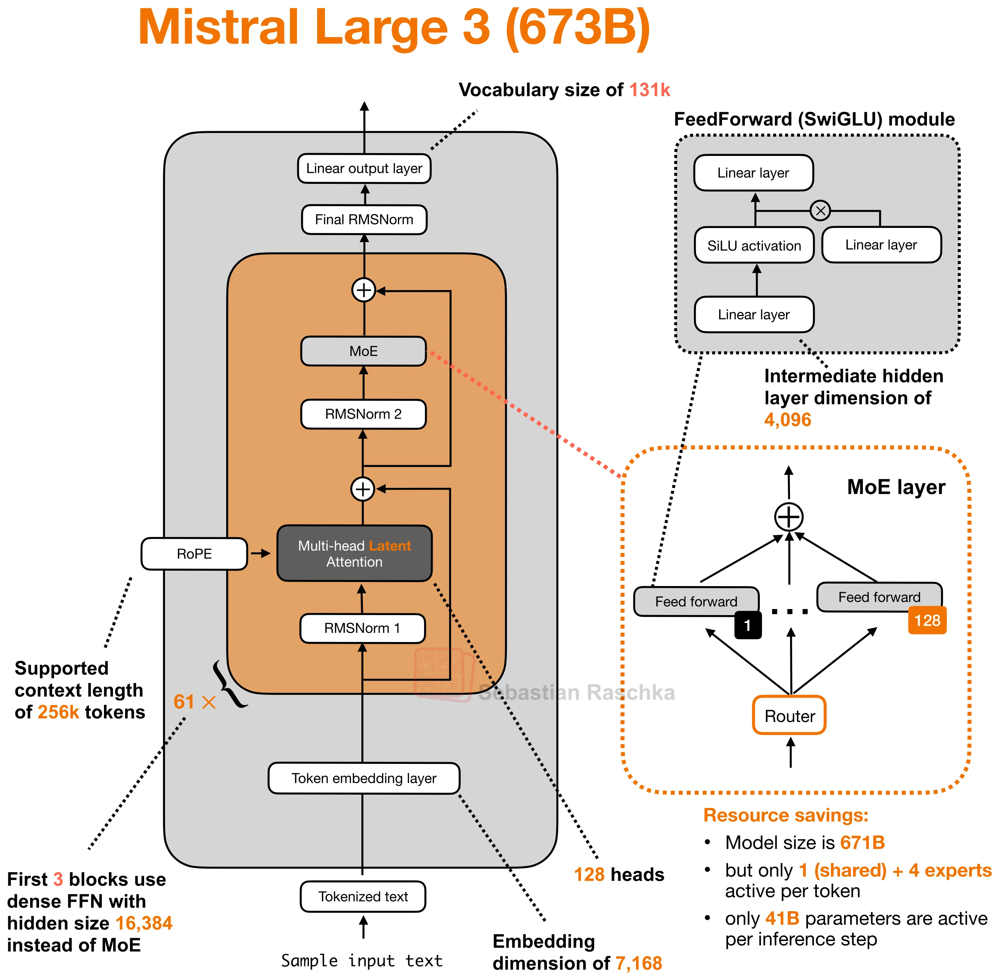

> **Summary:** Mistral's new flagship effectively adopts the DeepSeek architecture and retunes the expert sizes.
> **Highlight:** Near-clone of DeepSeek V3 with larger experts, fewer routed experts, and multimodal support.

| Field | Value |
| --- | --- |
| Scale | 673B total, 41B active (6.1% active) |
| Context | 262,144 tokens |
| Decoder | Sparse MoE |
| Attention | MLA |
| Layer mix | 61 MLA |
| KV cache | 68.6 KiB |
| License | Apache License 2.0 |
| AAI total | 22.8 |
| AAI profile | General 27.8 · Scientific 19.1 · Coding 22.7 · Agents 21.7 |

**Resources:** [View in article](https://magazine.sebastianraschka.com/p/the-big-llm-architecture-comparison#%C2%A717-mistral-3-large) · [params.json](https://huggingface.co/mistralai/Mistral-Large-3-675B-Instruct-2512/blob/main/params.json)

---

### Nemotron 3 Nano (30B-A3B)

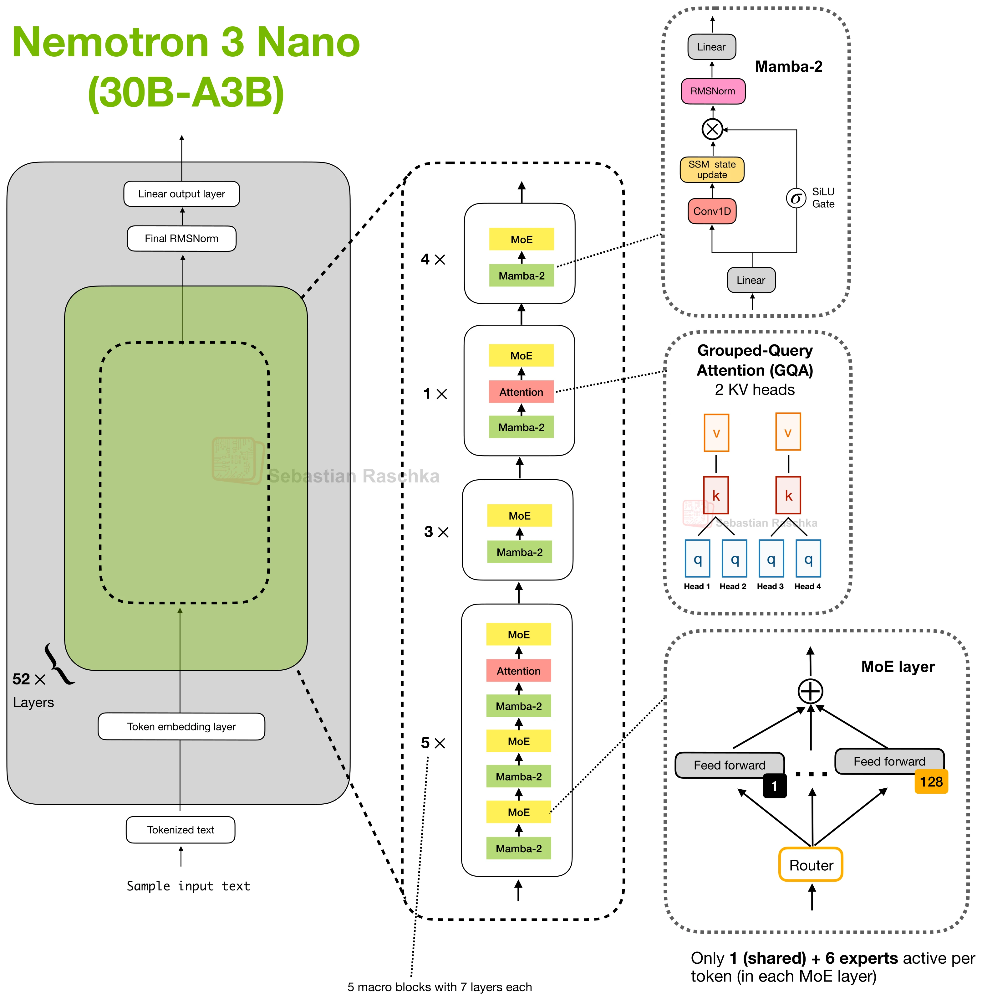

> **Summary:** NVIDIA's Nano model is the most extreme transformer-state-space hybrid in the gallery.
> **Highlight:** Interleaves Mamba-2 and MoE blocks, using attention only sparingly.

| Field | Value |
| --- | --- |
| Scale | 30B total, 3B active (10% active) |
| Context | 1,000,000 tokens |
| Decoder | Hybrid MoE |
| Attention | Mostly Mamba-2 with a few GQA layers |
| Layer mix | 6 GQA + 23 Mamba-2 + 23 MoE |
| KV cache | 6 KiB |
| License | NVIDIA Nemotron Open Model License |
| AAI total | 13.2 |
| AAI profile | General 16.2 · Scientific 12.3 · Coding 15.8 · Agents 8.5 |

**Resources:** [View in article](https://magazine.sebastianraschka.com/p/the-big-llm-architecture-comparison#%C2%A7181-nemotron-3-nano) · [config.json](https://huggingface.co/nvidia/NVIDIA-Nemotron-3-Nano-30B-A3B-BF16/blob/main/config.json) · [License](https://www.nvidia.com/en-us/agreements/enterprise-software/nvidia-nemotron-open-model-license/) · [Tech report](https://research.nvidia.com/labs/nemotron/files/NVIDIA-Nemotron-3-Nano-Technical-Report.pdf)

---

### Xiaomi MiMo-V2-Flash (309B)

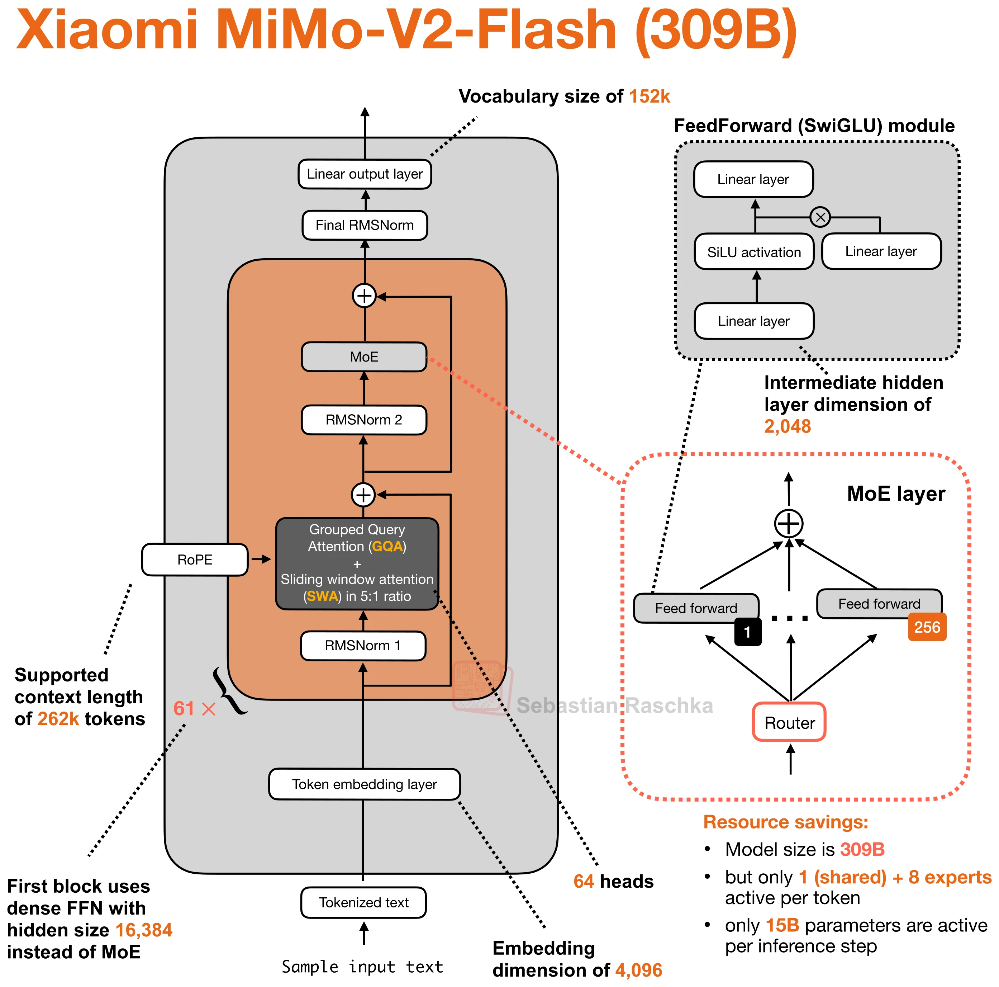

> **Summary:** Large MoE model that pushes sliding-window attention harder than most contemporaries.
> **Highlight:** Uses an unusually small 128-token local window plus multi-token prediction.

| Field | Value |
| --- | --- |
| Scale | 309B total, 15B active (4.9% active) |
| Context | 262,144 tokens |
| Decoder | Sparse MoE |
| Attention | 5:1 sliding-window/global attention |
| Layer mix | 40 sliding-window + 8 global |
| KV cache | 144 KiB |
| License | MIT License |
| AAI total | 30.4 |
| AAI profile | General 27.8 · Scientific 20.4 · Coding 25.8 · Agents 47.3 |

**Resources:** [View in article](https://magazine.sebastianraschka.com/p/the-big-llm-architecture-comparison#%C2%A719-xiaomi-mimo-v2-flash) · [config.json](https://huggingface.co/XiaomiMiMo/MiMo-V2-Flash/blob/main/config.json) · [Tech report](https://arxiv.org/pdf/2601.02780)

---

### GLM-4.7 (355B)

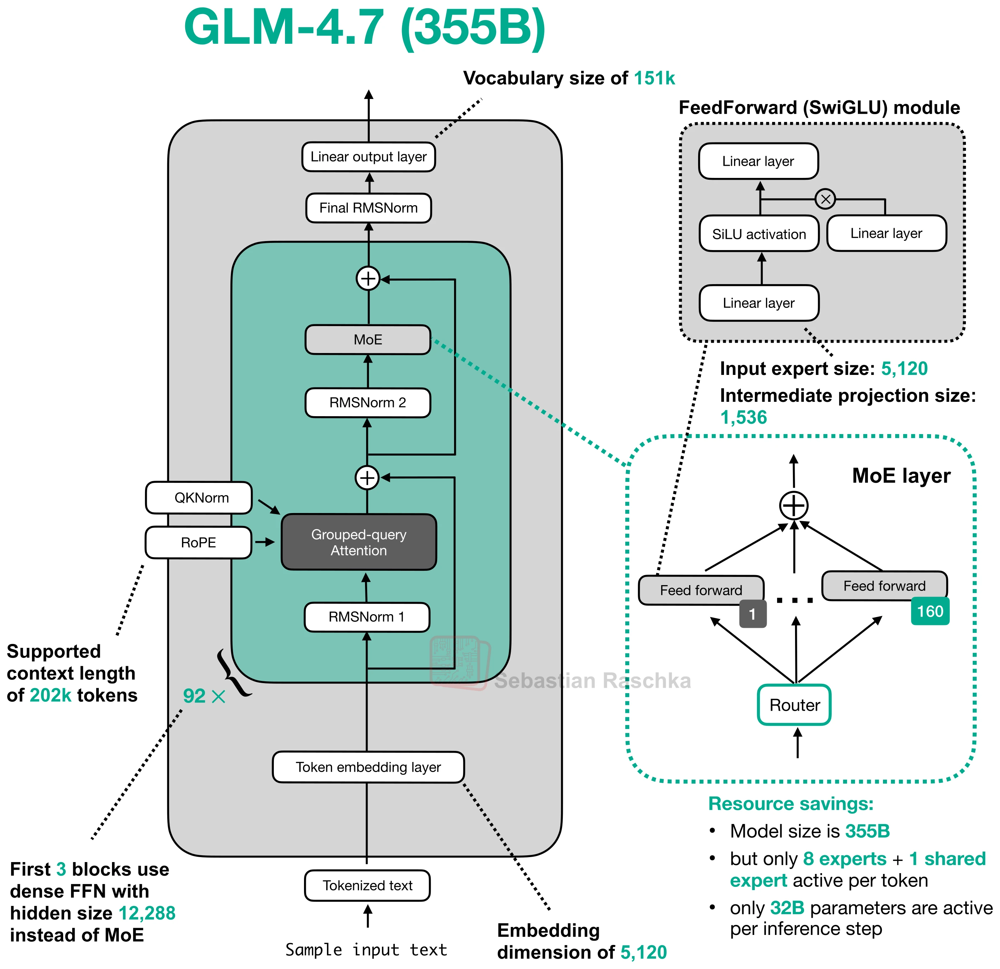

> **Summary:** Immediate GLM predecessor that stays closer to the older GLM-4.5 style before the MLA shift.
> **Highlight:** Serves as the pre-MLA, pre-sparse-attention baseline with the same 32B active path as GLM-4.5.

| Field | Value |
| --- | --- |
| Scale | 355B total, 32B active (9% active) |
| Context | 202,752 tokens |
| Decoder | Sparse MoE |
| Attention | GQA with QK-Norm |
| Layer mix | 92 GQA |
| KV cache | 368 KiB |
| License | MIT License |
| AAI total | 34.2 |
| AAI profile | General 30.6 · Scientific 19.7 · Coding 32.0 · Agents 54.3 |

**Resources:** [View in article](https://magazine.sebastianraschka.com/p/the-big-llm-architecture-comparison#%C2%A721-glm-5) · [config.json](https://huggingface.co/zai-org/GLM-4.7/blob/main/config.json) · [Tech report](https://arxiv.org/pdf/2508.06471)

---

### Arcee AI Trinity Large (400B)

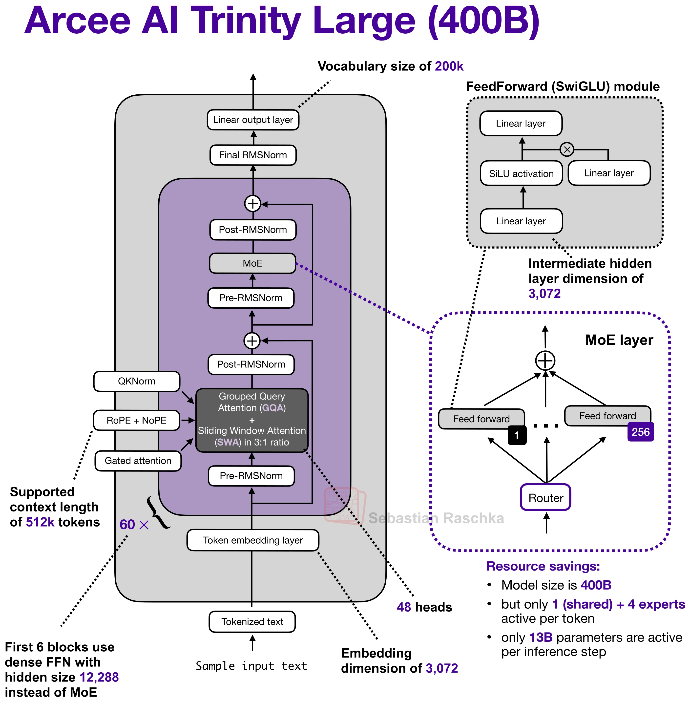

> **Summary:** Arcee's flagship blends several efficiency tricks into a DeepSeek-like coarse MoE design.
> **Highlight:** Combines QK-Norm, RoPE+NoPE, sandwich norm, and a coarse-grained MoE.

| Field | Value |
| --- | --- |
| Scale | 400B total, 13B active (3.3% active) |
| Context | 512,000 tokens |
| Decoder | Sparse MoE |
| Attention | GQA with gated attention and 3:1 sliding-window/global attention |
| Layer mix | 45 sliding-window + 15 global |
| KV cache | 240 KiB |
| License | Apache License 2.0 |

**Resources:** [View in article](https://magazine.sebastianraschka.com/p/the-big-llm-architecture-comparison#%C2%A720-arcee-ai-trinity-large) · [config.json](https://huggingface.co/arcee-ai/Trinity-Large-Base/blob/main/config.json) · [Tech report](https://arxiv.org/pdf/2602.17004)

---

### GLM-5 (744B)

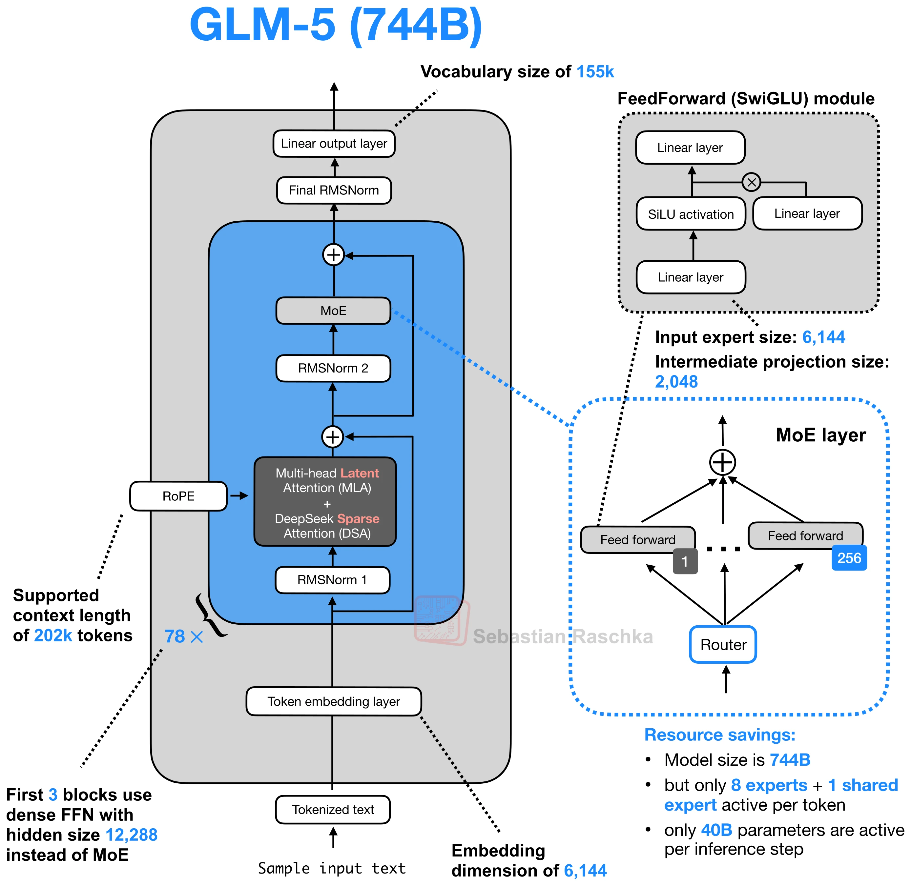

> **Summary:** Huge GLM refresh that adopts both MLA and DeepSeek Sparse Attention for flagship-scale inference.
> **Highlight:** Bigger than GLM-4.7, with more experts and fewer layers.

| Field | Value |
| --- | --- |
| Scale | 744B total, 40B active (5.4% active) |
| Context | 202,752 tokens |
| Decoder | Sparse MoE |
| Attention | MLA with DeepSeek Sparse Attention |
| Layer mix | 78 MLA |
| KV cache | 87.8 KiB |
| License | MIT License |
| AAI total | 40.6 |
| AAI profile | General 42.8 · Scientific 20.2 · Coding 39.0 · Agents 60.3 |

**Resources:** [View in article](https://magazine.sebastianraschka.com/p/the-big-llm-architecture-comparison#%C2%A721-glm-5) · [config.json](https://huggingface.co/zai-org/GLM-5/blob/main/config.json) · [Tech report](https://arxiv.org/pdf/2602.15763)

---

### Nemotron 3 Super (120B-A12B)

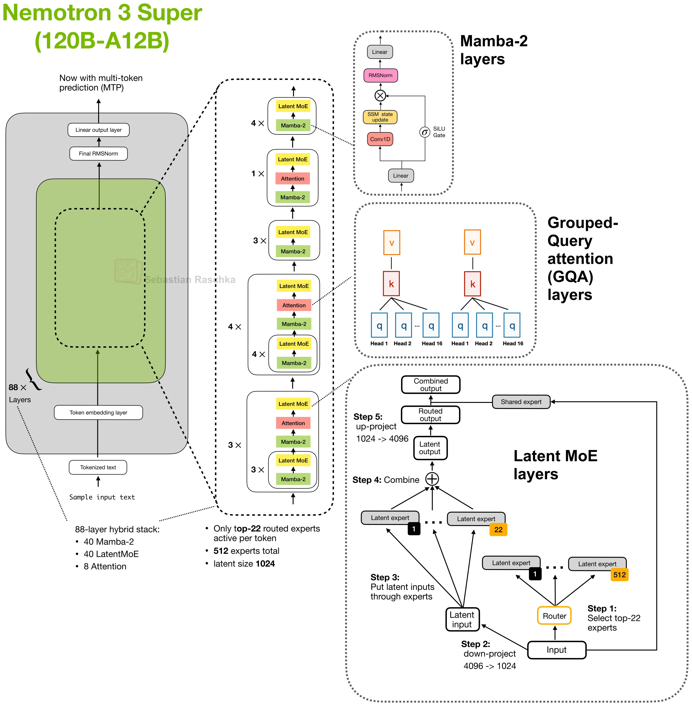

> **Summary:** The Super variant scales up Nano and adds both latent experts and native speculative decoding support.
> **Highlight:** Adds latent-space MoE and shared-weight MTP for fast inference.

| Field | Value |
| --- | --- |
| Scale | 120B total, 12B active (10% active) |
| Context | 1,000,000 tokens |
| Decoder | Hybrid MoE |
| Attention | Mostly Mamba-2 with a few GQA layers |
| Layer mix | 8 GQA + 40 Mamba-2 + 40 MoE |
| KV cache | 8 KiB |
| License | NVIDIA Nemotron Open Model License |
| AAI total | 36.0 |
| AAI profile | General 42.1 · Scientific 30.4 · Coding 31.2 · Agents 40.2 |

**Resources:** [View in article](https://magazine.sebastianraschka.com/p/the-big-llm-architecture-comparison#%C2%A7182-nemotron-3-super) · [config.json](https://huggingface.co/nvidia/NVIDIA-Nemotron-3-Super-120B-A12B-BF16/blob/main/config.json) · [License](https://www.nvidia.com/en-us/agreements/enterprise-software/nvidia-nemotron-open-model-license/) · [Tech report](https://research.nvidia.com/labs/nemotron/files/NVIDIA-Nemotron-3-Super-Technical-Report.pdf)

---

### Gemma 4 (31B)

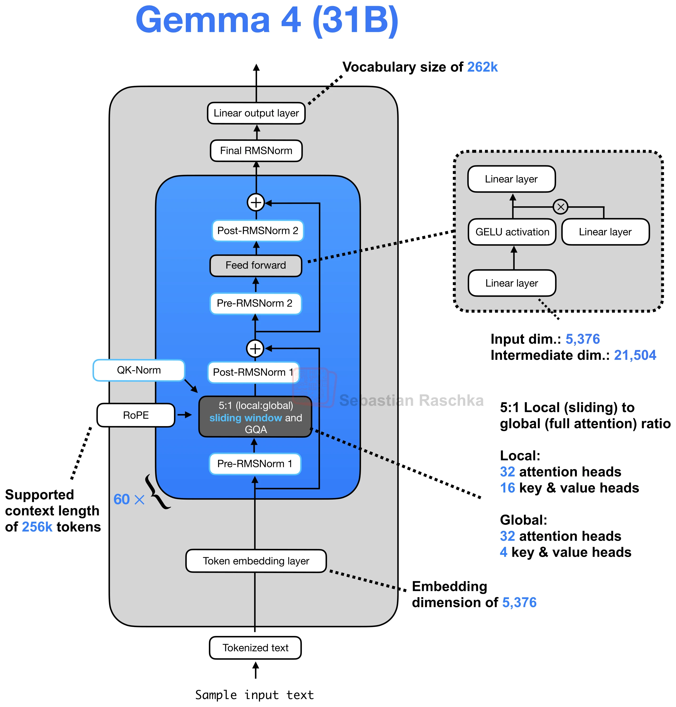

> **Summary:** Dense Gemma 4 scales the family to a 256K-context multimodal checkpoint without changing the core local-global recipe much.
> **Highlight:** Carries Gemma's unusual pre/post-norm stack into a larger 31B dense model with 256K context.

| Field | Value |
| --- | --- |
| Scale | 30.7B parameters |
| Context | 256,000 tokens |
| Decoder | Dense |
| Attention | GQA with QK-Norm, unified K/V on global layers, p-RoPE on global layers, and 5:1 sliding-window/global attention |
| Layer mix | 50 sliding-window + 10 global |
| KV cache | 840 KiB |
| Vocab | 262,144 (~262k) |
| License | Apache License 2.0 |
| AAI total | 32.3 |
| AAI profile | General 31.1 · Scientific 24.8 · Coding 33.9 · Agents 39.4 |

**Resources:** [View in article](https://magazine.sebastianraschka.com/p/the-big-llm-architecture-comparison#%C2%A723-gemma-4) · [config.json](https://huggingface.co/google/gemma-4-31B-it/blob/main/config.json) · [Tech report](https://ai.google.dev/gemma/docs/core/model_card_4)

---

### Gemma 4 (26B-A4B)

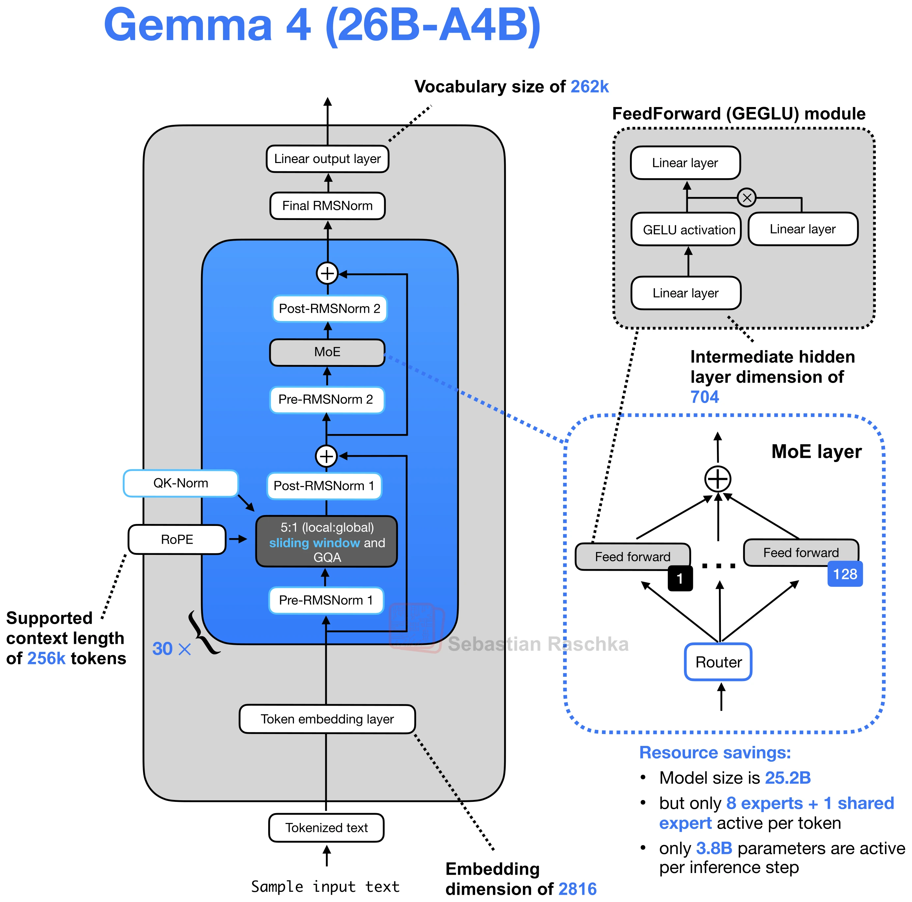

> **Summary:** Sparse Gemma 4 variant that keeps the local:global attention backbone while swapping dense FFNs for MoE layers.
> **Highlight:** Uses 128 total experts with only 8 routed plus 1 shared expert active per token.

| Field | Value |
| --- | --- |
| Scale | 25.2B total, 3.8B active (15.1% active) |
| Context | 256,000 tokens |
| Decoder | Sparse MoE |
| Attention | GQA with QK-Norm, unified K/V on global layers, p-RoPE on global layers, and 5:1 sliding-window/global attention |
| Layer mix | 25 sliding-window + 5 global |
| KV cache | 210 KiB |
| Vocab | 262,144 (~262k) |
| License | Apache License 2.0 |
| AAI total | 27.1 |
| AAI profile | General 27.1 · Scientific 23.2 · Coding 29.1 · Agents 28.9 |

**Resources:** [View in article](https://magazine.sebastianraschka.com/p/the-big-llm-architecture-comparison#%C2%A723-gemma-4) · [config.json](https://huggingface.co/google/gemma-4-26B-A4B-it/blob/main/config.json) · [Tech report](https://ai.google.dev/gemma/docs/core/model_card_4)

---

### Phi-4 (14B)

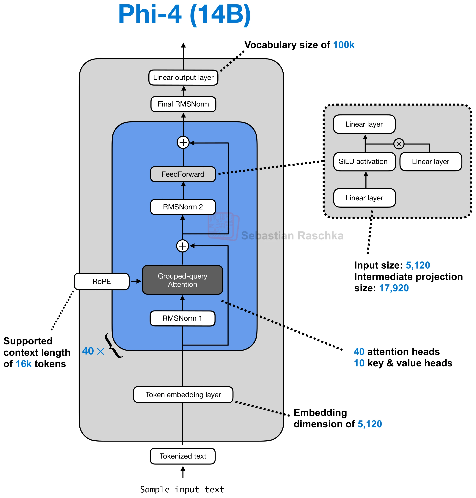

> **Summary:** Microsoft's 14B dense Phi refresh stays close to Phi-3-medium but swaps its sliding-window attention for full-context GQA and a larger tokenizer.
> **Highlight:** Classic pre-norm RMSNorm stack with GQA, 40 heads, 10 KV heads, and a 100,352-token vocabulary.

| Field | Value |
| --- | --- |
| Scale | 14B parameters |
| Context | 16,384 tokens |
| Decoder | Dense |
| Attention | GQA with RoPE |
| Layer mix | 40 GQA |
| KV cache | 200 KiB |
| License | MIT License |
| AAI total | 10.4 |
| AAI profile | General 14.0 · Scientific 16.4 · Coding 11.2 · Agents 0.0 |

**Resources:** [config.json](https://huggingface.co/microsoft/phi-4/blob/main/config.json) · [License](https://huggingface.co/microsoft/phi-4/blob/main/LICENSE) · [Tech report](https://arxiv.org/pdf/2412.08905)

---

### xLSTM (7B)

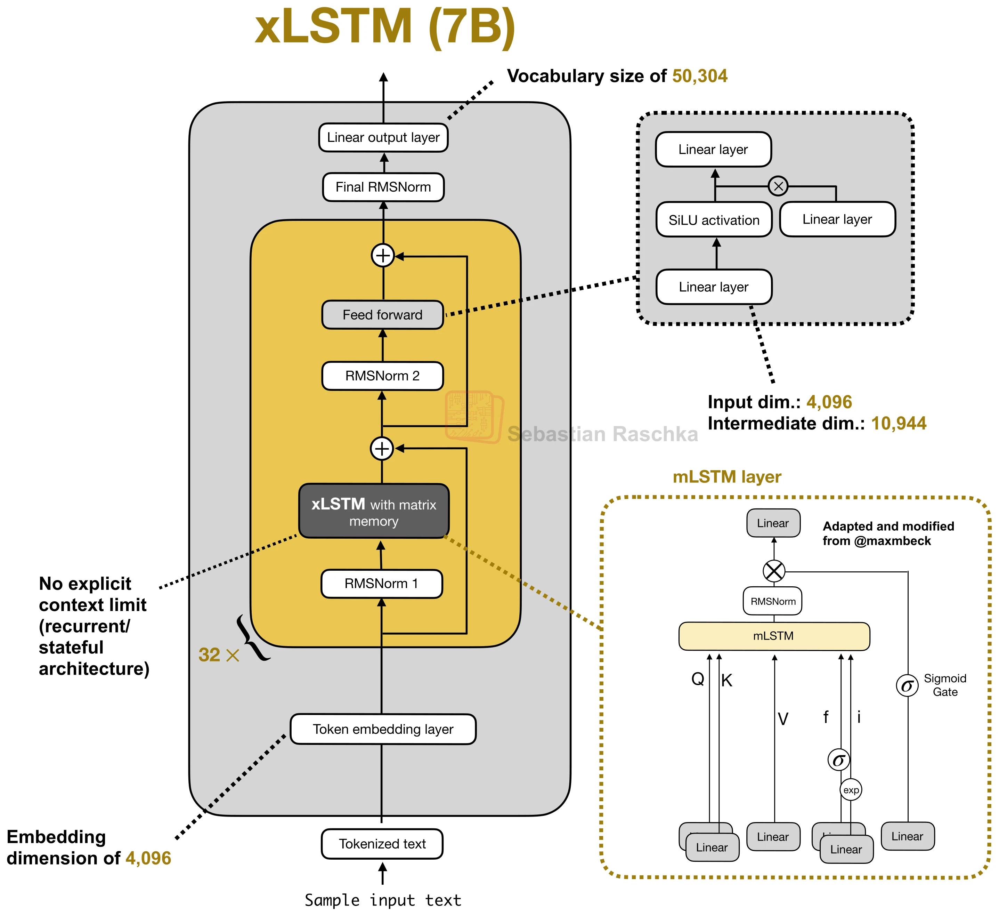

> **Summary:** Recurrent 7B language model that replaces self-attention with xLSTM blocks built around matrix memory.
> **Highlight:** Stateful recurrent architecture aimed at fast long-context inference without an explicit context window.

| Field | Value |
| --- | --- |
| Scale | 7B parameters |
| Context | No explicit limit tokens |
| Decoder | Recurrent |
| Attention | No self-attention; mLSTM recurrent layers with matrix memory |
| Layer mix | 32 mLSTM |
| KV cache | 0 B |
| License | NXAI Community License Agreement |

**Resources:** [config.json](https://huggingface.co/NX-AI/xLSTM-7b/blob/main/config.json) · [License](https://huggingface.co/NX-AI/xLSTM-7b/blob/main/LICENSE) · [Tech report](https://arxiv.org/abs/2503.13427)

---

### GLM-4.5-Air (106B)

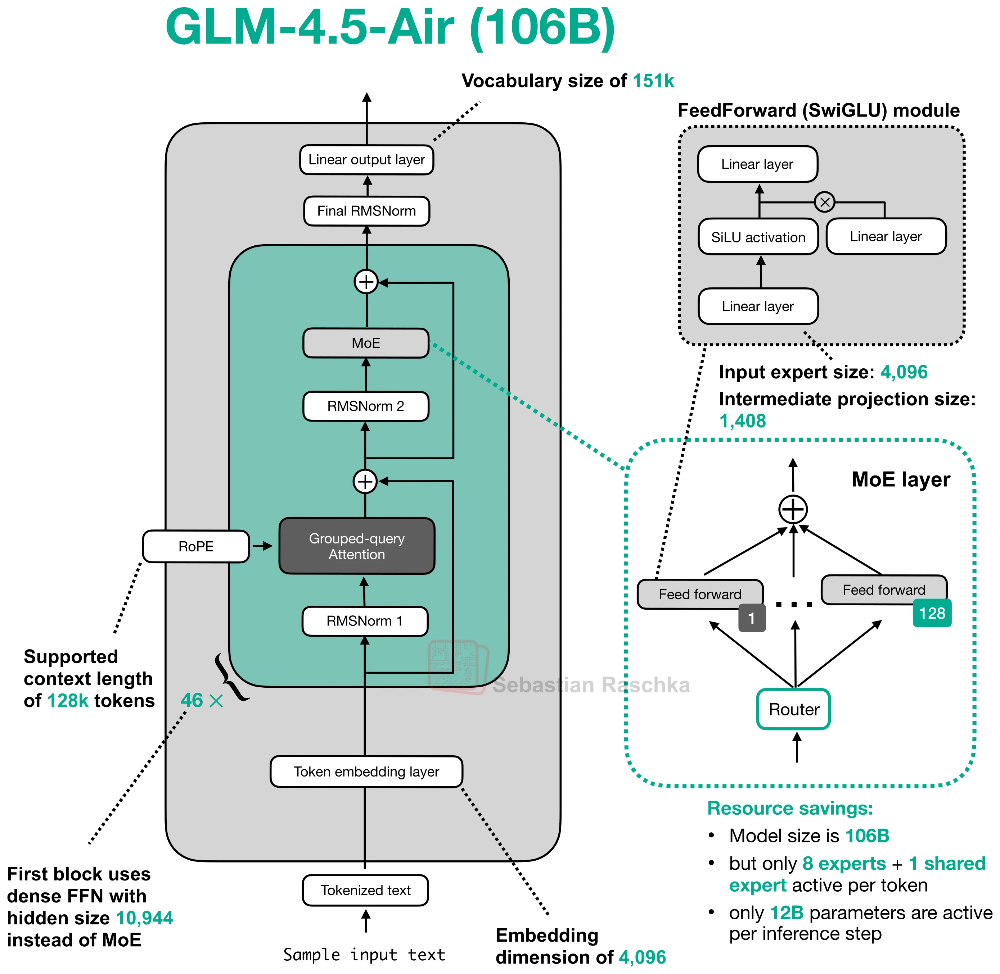

> **Summary:** Compact GLM-4.5 companion that keeps the same agent-oriented sparse MoE recipe at a smaller serving footprint.
> **Highlight:** Shrinks the GLM-4.5 layout to 46 layers and a single dense warmup layer before MoE routing.

| Field | Value |
| --- | --- |
| Scale | 106B total, 12B active (11.3% active) |
| Context | 128,000 tokens |
| Decoder | Sparse MoE |
| Attention | GQA |
| Layer mix | 46 GQA |
| KV cache | 184 KiB |
| License | MIT License |
| AAI total | 23.2 |
| AAI profile | General 26.1 · Scientific 21.7 · Coding 23.8 · Agents 21.0 |

**Resources:** [config.json](https://huggingface.co/zai-org/GLM-4.5-Air/blob/main/config.json) · [Tech report](https://arxiv.org/pdf/2508.06471)

---

### Qwen3 Coder Flash (30B-A3B)

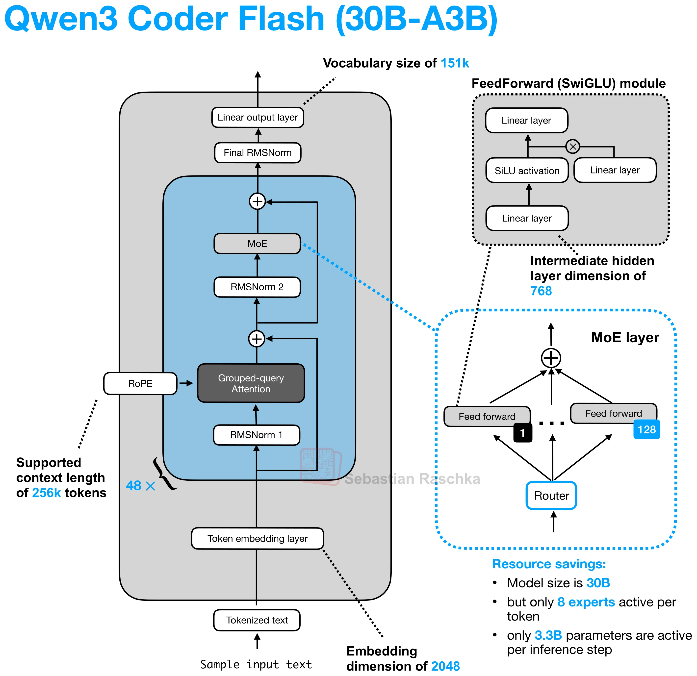

> **Summary:** Coding-tuned Qwen model that keeps a straightforward grouped-query MoE stack instead of the newer hybrid-attention variants.
> **Highlight:** Uses 128 experts with 8 active per token and a native 256k context window for coding workloads.

| Field | Value |
| --- | --- |
| Scale | 30B total, 3.3B active (11% active) |
| Context | 256,000 tokens |
| Decoder | Sparse MoE |
| Attention | GQA |
| Layer mix | 48 GQA |
| KV cache | 96 KiB |
| License | Apache License 2.0 |
| AAI total | 20.0 |
| AAI profile | General 24.6 · Scientific 14.9 · Coding 19.4 · Agents 21.1 |

**Resources:** [View in article](https://magazine.sebastianraschka.com/p/a-dream-of-spring-for-open-weight#%C2%A74-qwen3-coder-next-an-attention-hybrid-for-coding) · [From scratch](https://github.com/rasbt/LLMs-from-scratch/tree/main/ch05/11_qwen3) · [config.json](https://huggingface.co/Qwen/Qwen3-Coder-30B-A3B-Instruct/blob/main/config.json) · [License](https://huggingface.co/Qwen/Qwen3-Coder-30B-A3B-Instruct/blob/main/LICENSE)

---

### Kimi K2.5 (1T)

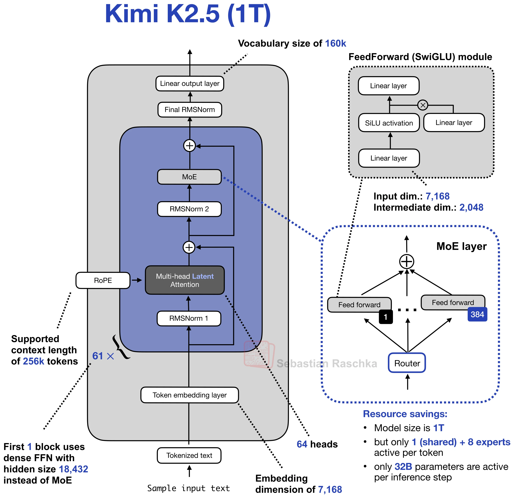

> **Summary:** Native-multimodal Moonshot flagship that keeps the K2/DeepSeek-style MoE layout and pushes native context to 256k.
> **Highlight:** Keeps the 384-expert K2 backbone, but adds multimodal capabilities (not shown) and doubles the native context length.

| Field | Value |
| --- | --- |
| Scale | 1T total, 32B active (3.2% active) |
| Context | 256,000 tokens |
| Decoder | Sparse MoE |
| Attention | MLA |
| Layer mix | 61 MLA |
| KV cache | 68.6 KiB |
| License | Modified MIT License |
| AAI total | 37.3 |
| AAI profile | General 44.4 · Scientific 26.0 · Coding 25.8 · Agents 52.8 |

**Resources:** [View in article](https://magazine.sebastianraschka.com/p/a-dream-of-spring-for-open-weight#%C2%A72-moonshot-ais-kimi-k25-a-deepseek-like-model-at-a-1-trillion-parameter-scale) · [config.json](https://huggingface.co/moonshotai/Kimi-K2.5/blob/main/config.json) · [License](https://huggingface.co/moonshotai/Kimi-K2.5/blob/main/LICENSE) · [Tech report](https://arxiv.org/pdf/2602.02276)

---

### Step 3.5 Flash (196B)

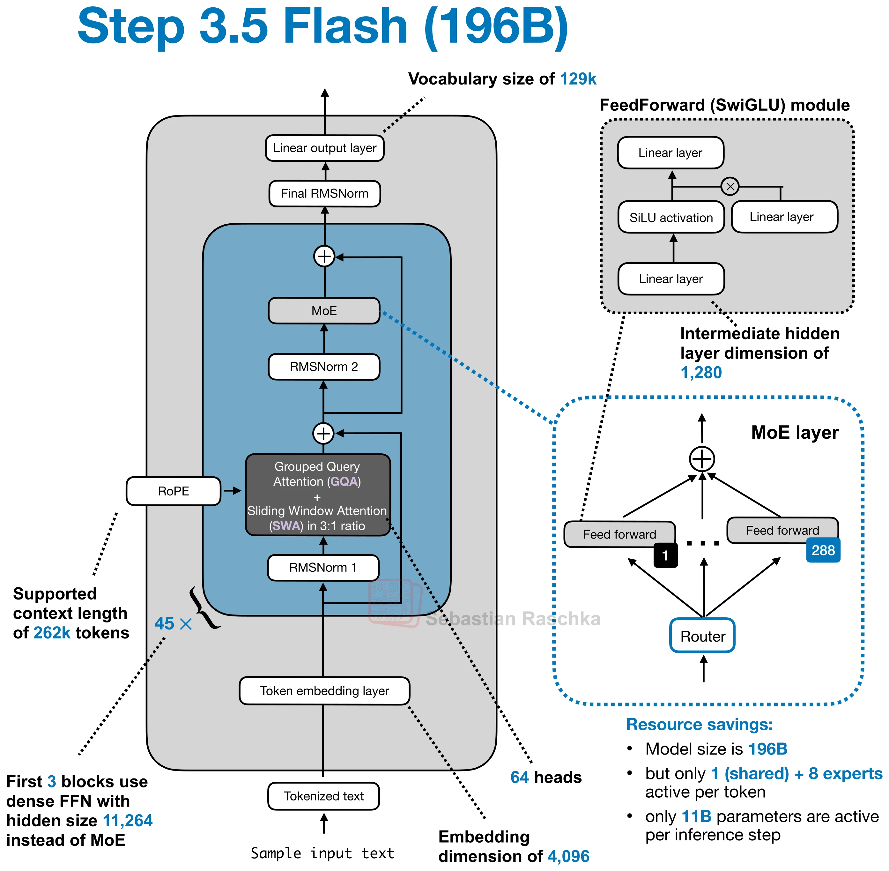

> **Summary:** Throughput-oriented MoE model that stays competitive with much larger DeepSeek-style systems.
> **Highlight:** Uses MTP-3 during both training and inference for unusually high throughput.

| Field | Value |
| --- | --- |
| Scale | 196B total, 11B active (5.6% active) |
| Context | 262,144 tokens |
| Decoder | Sparse MoE |
| Attention | GQA with 3:1 sliding-window attention |
| Layer mix | 36 sliding-window + 12 global |
| KV cache | 192 KiB |
| License | Apache License 2.0 |
| AAI total | 37.8 |
| AAI profile | General 36.6 · Scientific 30.9 · Coding 31.6 · Agents 52.0 |

**Resources:** [View in article](https://magazine.sebastianraschka.com/p/a-dream-of-spring-for-open-weight#%C2%A73-stepfuns-step-35-flash-good-performance-at-great-tokens-sec-throughput) · [config.json](https://huggingface.co/stepfun-ai/Step-3.5-Flash/blob/main/config.json) · [Tech report](https://arxiv.org/pdf/2602.10604)

---

### Nanbeige 4.1 (3B)

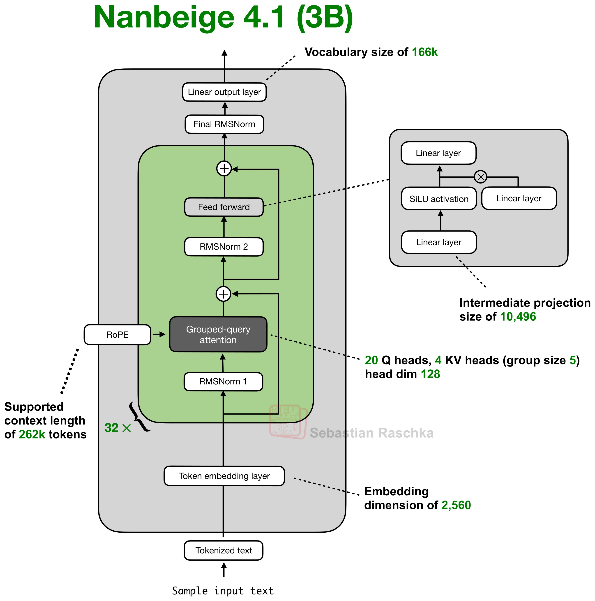

> **Summary:** Small on-device oriented model that stays close to Llama 3.2 while nudging the scaling choices.
> **Highlight:** Llama-like stack without tying input embeddings to the output layer.

| Field | Value |
| --- | --- |
| Scale | 3B parameters |
| Context | 262,144 tokens |
| Decoder | Dense |
| Attention | GQA |
| Layer mix | 32 GQA |
| KV cache | 64 KiB |
| License | Apache License 2.0 |
| AAI total | 16.1 |
| AAI profile | General 22.0 · Scientific 26.2 · Coding 8.9 · Agents 7.2 |

**Resources:** [View in article](https://magazine.sebastianraschka.com/p/a-dream-of-spring-for-open-weight#%C2%A77-nanbeige-41-3b-a-strong-llama-3-successor) · [config.json](https://huggingface.co/Nanbeige/Nanbeige4.1-3B/blob/main/config.json) · [Tech report](https://arxiv.org/pdf/2602.13367)

---

### MiniMax-M2.5 (230B)

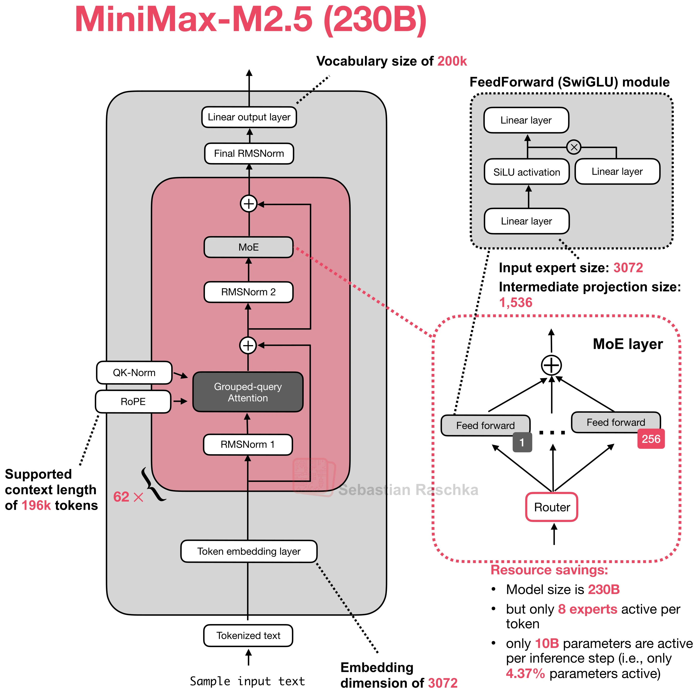

> **Summary:** Popular 230B coder that opts for a classic architecture instead of the newer hybrid-attention ideas.
> **Highlight:** Deliberately avoids sliding-window or linear-attention hybrids while keeping a 10B active path.

| Field | Value |
| --- | --- |
| Scale | 230B total, 10B active (4.3% active) |
| Context | 196,608 tokens |
| Decoder | Sparse MoE |
| Attention | GQA with QK-Norm |
| Layer mix | 62 GQA |
| KV cache | 248 KiB |
| License | Modified MIT License |

**Resources:** [View in article](https://magazine.sebastianraschka.com/p/a-dream-of-spring-for-open-weight#%C2%A76-minimax-m25-a-strong-coder-with-only-230b-parameters) · [config.json](https://huggingface.co/MiniMaxAI/MiniMax-M2.5/blob/main/config.json)

---

### Tiny Aya (3.35B)

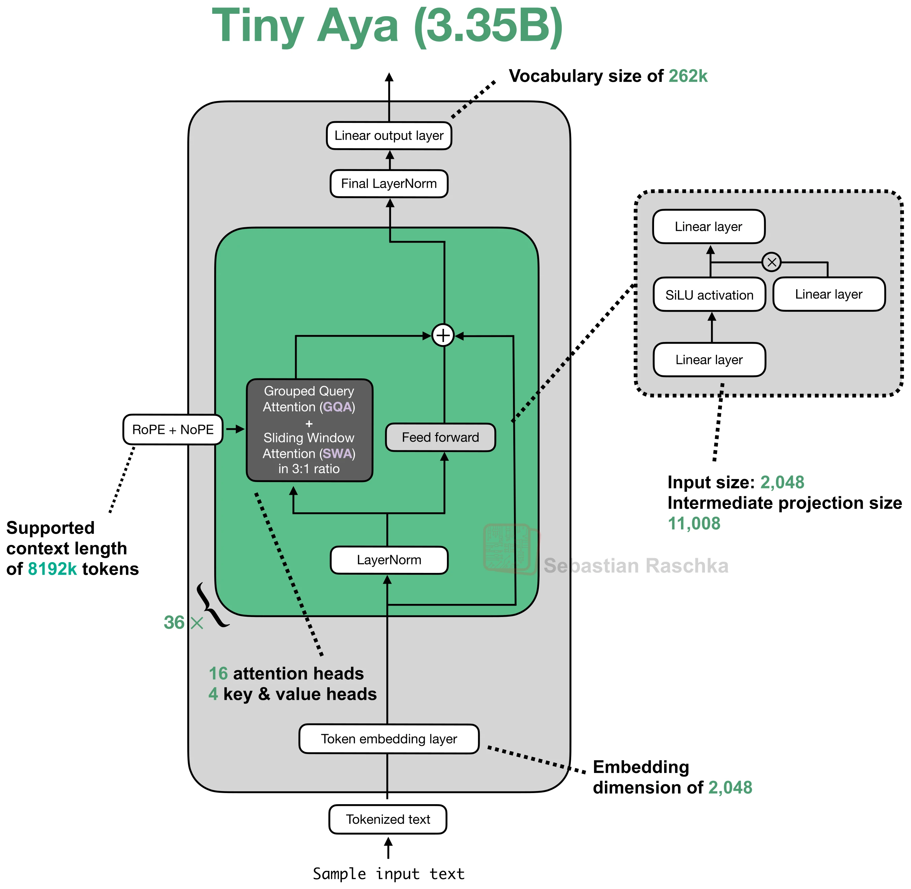

> **Summary:** Compact multilingual model from Cohere with a rare parallel transformer block.
> **Highlight:** Runs attention and the MLP in parallel while mixing RoPE with NoPE.

| Field | Value |
| --- | --- |
| Scale | 3.35B parameters |
| Context | 8,192 tokens |
| Decoder | Dense |
| Attention | GQA with 3:1 sliding-window attention |
| Layer mix | 27 sliding-window + 9 global |
| KV cache | 72 KiB |
| License | Creative Commons Attribution-NonCommercial 4.0 |

**Resources:** [View in article](https://magazine.sebastianraschka.com/p/a-dream-of-spring-for-open-weight#%C2%A710-tiny-aya-a-335b-model-with-strong-multilingual-support) · [From scratch](https://github.com/rasbt/LLMs-from-scratch/tree/main/ch05/15_tiny-aya) · [config.json](https://huggingface.co/CohereLabs/tiny-aya-base/blob/main/config.json) · [Tech report](https://arxiv.org/pdf/2603.11510)

---

### Ling 2.5 (1T)

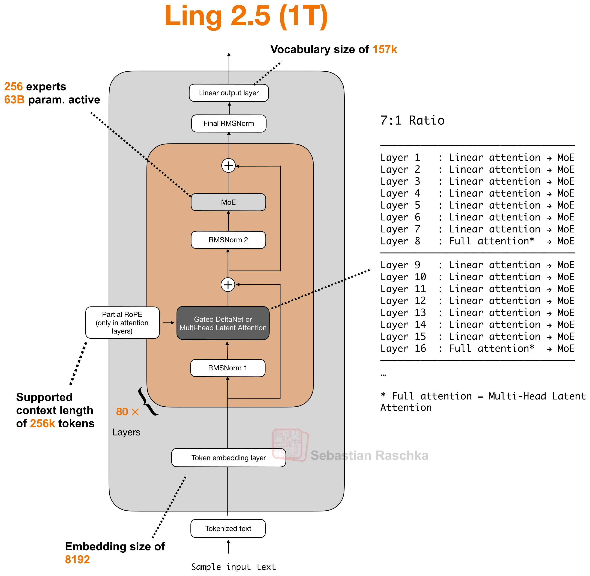

> **Summary:** Trillion-parameter long-context model that swaps DeltaNet for Lightning Attention.
> **Highlight:** Uses a 7:1 linear-attention/MLA ratio and a much larger 63B active path.

| Field | Value |
| --- | --- |
| Scale | 1T total, 63B active (6.3% active) |
| Context | 256,000 tokens |
| Decoder | Sparse hybrid |
| Attention | Lightning Attention plus MLA |
| Layer mix | 10 MLA + 70 Lightning Attention |
| KV cache | 11.2 KiB |
| License | MIT License |

**Resources:** [View in article](https://magazine.sebastianraschka.com/p/a-dream-of-spring-for-open-weight#%C2%A79-ant-groups-ling-25-1t-with-lightning-attention) · [config.json](https://huggingface.co/inclusionAI/Ling-2.5-1T/blob/main/config.json)

---

### Qwen3.5 (397B)

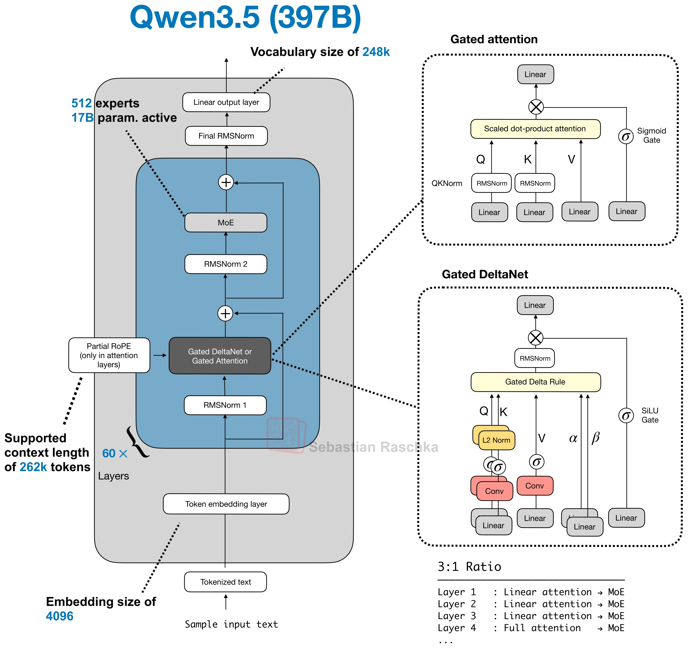

> **Summary:** Mainline Qwen refresh that brings the Next-style hybrid attention into the flagship series.
> **Highlight:** Turns the former Qwen3-Next side branch into the new core design with 512 experts and 17B active parameters.

| Field | Value |
| --- | --- |
| Scale | 397B total, 17B active (4.3% active) |
| Context | 262,144 tokens |
| Decoder | Sparse hybrid |
| Attention | 3:1 Gated DeltaNet and Gated Attention |
| Layer mix | 15 gated attention + 45 DeltaNet |
| KV cache | 30 KiB |
| License | Apache License 2.0 |
| AAI total | 40.1 |
| AAI profile | General 38.5 · Scientific 31.1 · Coding 37.4 · Agents 53.3 |

**Resources:** [View in article](https://magazine.sebastianraschka.com/p/a-dream-of-spring-for-open-weight#%C2%A78-qwen35-and-the-continutation-of-hybrid-attention) · [From scratch](https://github.com/rasbt/LLMs-from-scratch/tree/main/ch05/16_qwen3.5) · [config.json](https://huggingface.co/Qwen/Qwen3.5-397B-A17B/blob/main/config.json) · [License](https://huggingface.co/Qwen/Qwen3.5-397B-A17B/blob/main/LICENSE)

---

### Sarvam (30B)

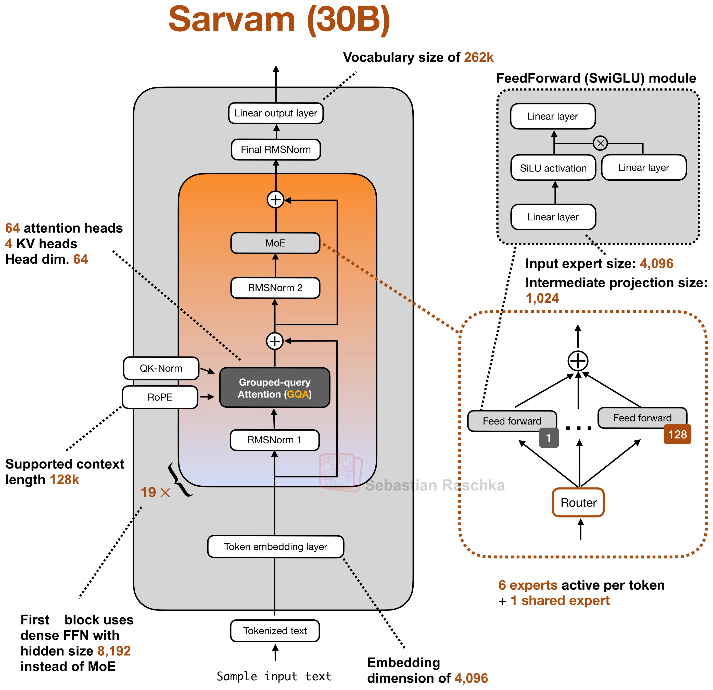

> **Summary:** Reasoning-oriented Indian-language sparse MoE that keeps GQA at the smaller size.
> **Highlight:** Large vocabulary and strong Indic language support paired with a reasoning-focused sparse MoE design.

| Field | Value |
| --- | --- |
| Scale | 30B total, 2.4B active (8% active) |
| Context | 131,072 tokens |
| Decoder | Sparse MoE |
| Attention | GQA with QK-Norm |
| Layer mix | 19 GQA |
| KV cache | 19 KiB |
| License | Apache License 2.0 |
| AAI total | 12.3 |
| AAI profile | General 10.5 · Scientific 19.4 · Coding 7.9 · Agents 11.5 |

**Resources:** [View in article](https://magazine.sebastianraschka.com/p/a-dream-of-spring-for-open-weight#%C2%A7update-1-sarvam-30b-and-105b-mar-6-2026) · [config.json](https://huggingface.co/sarvamai/sarvam-30b/blob/main/config.json) · [Tech report](https://www.sarvam.ai/blogs/sarvam-30b-105b)

---

### Sarvam (105B)

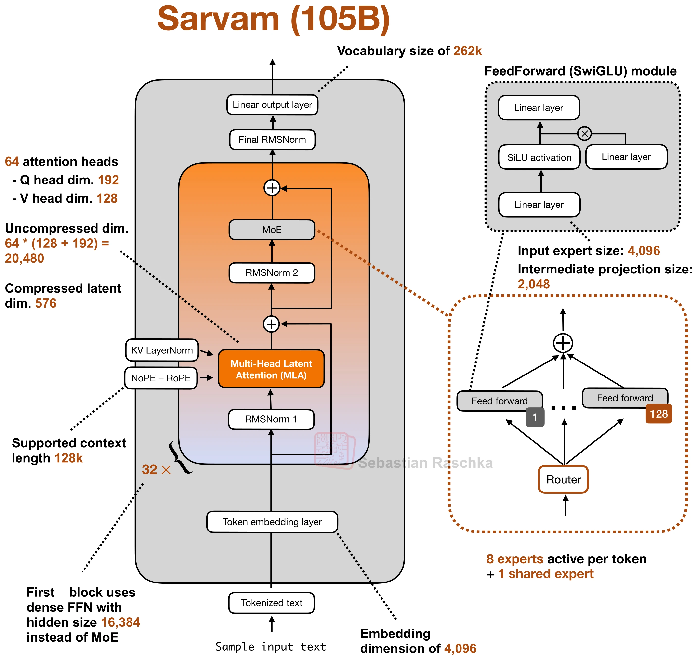

> **Summary:** Larger Sarvam variant keeps the sparse MoE layout but switches from GQA to MLA.
> **Highlight:** Large vocabulary and strong Indic language support carried into the larger MLA-based sparse MoE variant.

| Field | Value |
| --- | --- |
| Scale | 105B total, 10.3B active (9.8% active) |
| Context | 131,072 tokens |
| Decoder | Sparse MoE |
| Attention | MLA with KV LayerNorm and NoPE + RoPE |
| Layer mix | 32 MLA |
| KV cache | 36 KiB |
| License | Apache License 2.0 |
| AAI total | 18.2 |
| AAI profile | General 14.6 · Scientific 23.5 · Coding 9.8 · Agents 24.7 |

**Resources:** [View in article](https://magazine.sebastianraschka.com/p/a-dream-of-spring-for-open-weight#%C2%A7update-1-sarvam-30b-and-105b-mar-6-2026) · [config.json](https://huggingface.co/sarvamai/sarvam-105b/blob/main/config.json) · [Tech report](https://www.sarvam.ai/blogs/sarvam-30b-105b)

---

### INTELLECT-3 (106B)

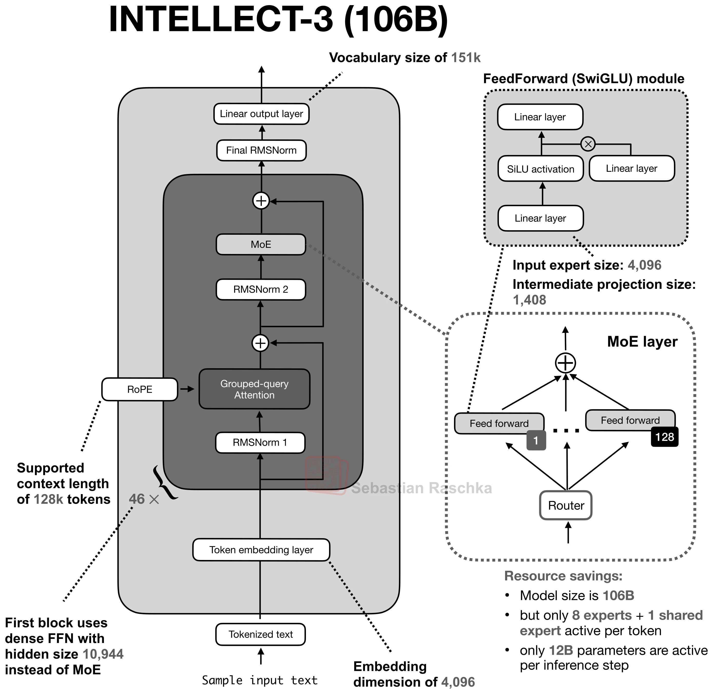

> **Summary:** Large-scale RL post-training of GLM-4.5-Air that keeps the compact 106B sparse MoE backbone intact.
> **Highlight:** Keeps the GLM-4.5-Air architecture unchanged and shifts the capability profile through SFT plus large-scale RL.

| Field | Value |
| --- | --- |
| Scale | 106B total, 12B active (11.3% active) |
| Context | 128,000 tokens |
| Decoder | Sparse MoE |
| Attention | GQA |
| Layer mix | 46 GQA |
| KV cache | 184 KiB |
| License | MIT License |
| AAI total | 22.2 |
| AAI profile | General 24.6 · Scientific 25.1 · Coding 19.1 · Agents 19.8 |

**Resources:** [config.json](https://huggingface.co/PrimeIntellect/INTELLECT-3/blob/main/config.json) · [Tech report](https://storage.googleapis.com/intellect-3-paper/INTELLECT_3_Technical_Report.pdf)

---

### Mistral Small 4 (119B)

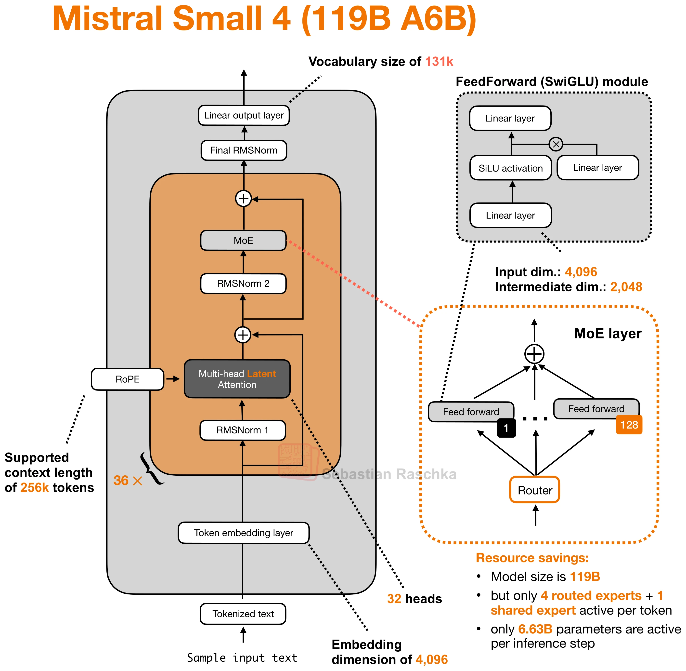

> **Summary:** Multimodal Mistral Small refresh that jumps from the older dense 24B stack to an MLA-based sparse MoE design.
> **Highlight:** Uses 128 experts with 4 routed plus 1 shared expert active per token while unifying instruct, reasoning, and vision.

| Field | Value |
| --- | --- |
| Scale | 119B total, 6.63B active (5.6% active) |
| Context | 256,000 tokens |
| Decoder | Sparse MoE |
| Attention | MLA |
| Layer mix | 36 MLA |
| KV cache | 22.5 KiB |
| License | Apache License 2.0 |
| AAI total | 26.9 |
| AAI profile | General 37.1 · Scientific 24.1 · Coding 24.3 · Agents 22.4 |

**Resources:** [config.json](https://huggingface.co/mistralai/Mistral-Small-4-119B-2603/blob/main/config.json) · [Tech report](https://mistral.ai/news/mistral-small-4)

---

### Nemotron 3 Nano (4B)

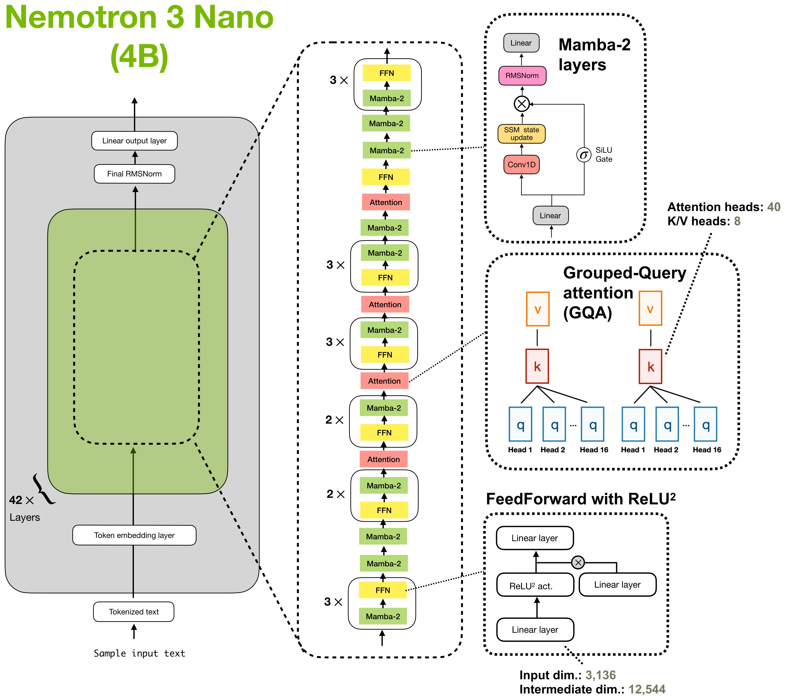

> **Summary:** Compact on-device hybrid that compresses Nemotron Nano 9B v2 into a mostly Mamba-2 stack with only four attention layers.
> **Highlight:** Uses a 42-layer stack with 21 Mamba-2 blocks, 17 ReLU² FFNs, and just 4 GQA layers.

| Field | Value |
| --- | --- |
| Scale | 4B parameters |
| Context | 262,144 tokens |
| Decoder | Dense hybrid |
| Attention | GQA with only 4 attention layers |
| Layer mix | 4 GQA + 21 Mamba-2 + 17 FFN |
| KV cache | 16 KiB |
| License | NVIDIA Nemotron Open Model License |
| AAI total | 14.7 |
| AAI profile | General 23.7 · Scientific 15.2 · Coding 10.0 · Agents 9.8 |

**Resources:** [config.json](https://huggingface.co/nvidia/NVIDIA-Nemotron-3-Nano-4B-BF16/blob/main/config.json) · [License](https://www.nvidia.com/en-us/agreements/enterprise-software/nvidia-nemotron-open-model-license/) · [Tech report](https://huggingface.co/blog/nvidia/nemotron-3-nano-4b)

---

### Gemma 4 (E2B)

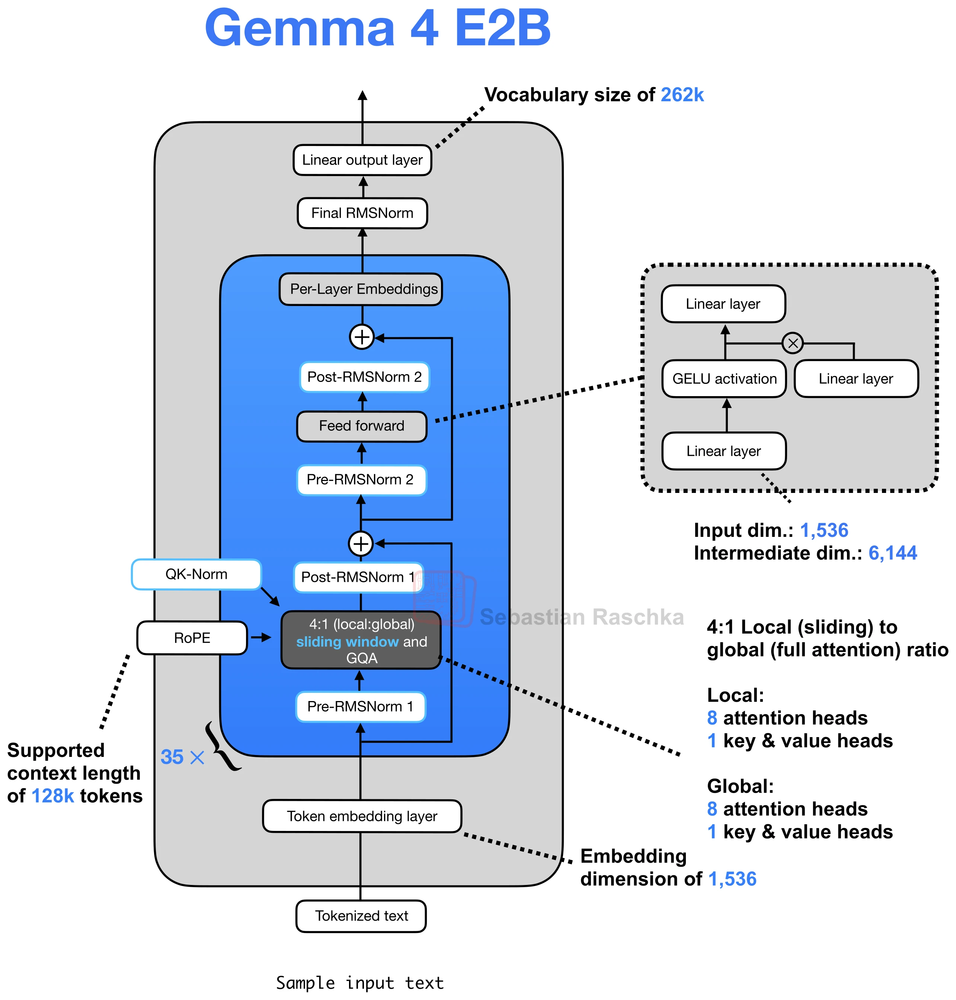

> **Summary:** Smallest Gemma 4 edge model keeps the family's hybrid attention stack and adds native audio on a phone-scale multimodal footprint. Uses per-layer embeddings, which add small layer-specific token vectors without scaling the full compute path, so its compute footprint is closer to 2.3B than a full 5.1B dense model.
> **Highlight:** Uses a double-wide GELU MLP plus a single KV head to stay light enough for offline edge deployments.

| Field | Value |
| --- | --- |
| Scale | 5.1B parameters (2.3B effective) |
| Context | 128,000 tokens |
| Decoder | Dense |
| Attention | Multi-query attention with QK-Norm, unified K/V on global layers, p-RoPE on global layers, and 4:1 sliding-window/global attention |
| Layer mix | 28 sliding-window + 7 global |
| KV cache | 35 KiB |
| Vocab | 262,144 (~262k) |
| License | Apache License 2.0 |
| AAI total | 12.1 |
| AAI profile | General 20.3 · Scientific 12.4 · Coding 8.3 · Agents 7.4 |

**Resources:** [From scratch](https://github.com/rasbt/LLMs-from-scratch/blob/main/ch05/17_gemma4/standalone-gemma4-plus-kvcache.ipynb) · [config.json](https://huggingface.co/google/gemma-4-E2B-it/blob/main/config.json) · [Tech report](https://ai.google.dev/gemma/docs/core/model_card_4)

---

### Gemma 4 (E4B)

> **Summary:** Larger Gemma 4 edge variant keeps the same multimodal hybrid recipe but doubles width and KV heads for a stronger 128K mobile checkpoint. Uses per-layer embeddings, which add small layer-specific token vectors without scaling the full compute path, so its compute footprint is closer to 4.5B than a full 8B dense model.
> **Highlight:** Steps up to a 42-layer stack with 2 KV heads while keeping the same edge-oriented local/global template.

| Field | Value |
| --- | --- |
| Scale | 8B parameters (4.5B effective) |
| Context | 128,000 tokens |
| Decoder | Dense |
| Attention | GQA with QK-Norm, unified K/V on global layers, p-RoPE on global layers, and 5:1 sliding-window/global attention |
| Layer mix | 35 sliding-window + 7 global |
| KV cache | 84 KiB |
| Vocab | 262,144 (~262k) |
| License | Apache License 2.0 |
| AAI total | 14.8 |
| AAI profile | General 28.1 · Scientific 16.2 · Coding 6.4 · Agents 8.7 |

**Resources:** [From scratch](https://github.com/rasbt/LLMs-from-scratch/blob/main/ch05/17_gemma4/standalone-gemma4-plus-kvcache.ipynb) · [config.json](https://huggingface.co/google/gemma-4-E4B-it/blob/main/config.json) · [Tech report](https://ai.google.dev/gemma/docs/core/model_card_4)

---

### GLM-5.1 (744B)

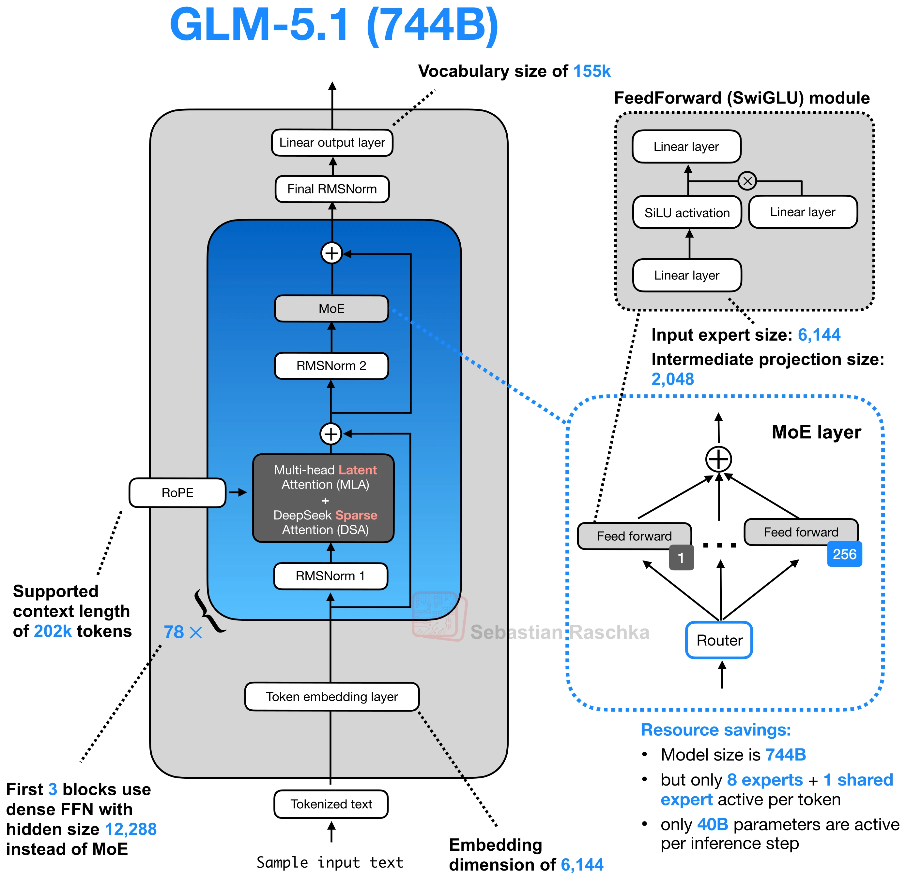

> **Summary:** Post-trained GLM refresh that keeps the GLM-5 backbone intact but targets stronger long-horizon agentic coding.
> **Highlight:** Architecture stays aligned with GLM-5; the main shift is the post-training recipe for agentic engineering tasks.

| Field | Value |
| --- | --- |
| Scale | 744B total, 40B active (5.4% active) |
| Context | 202,752 tokens |
| Decoder | Sparse MoE |
| Attention | MLA with DeepSeek Sparse Attention |
| Layer mix | 78 MLA |
| KV cache | 87.8 KiB |
| License | MIT License |
| AAI total | 51.4 |
| AAI profile | General 58.4 · Scientific 36.9 · Coding 43.4 · Agents 67.0 |

**Resources:** [config.json](https://huggingface.co/zai-org/GLM-5.1/blob/main/config.json) · [Tech report](https://arxiv.org/pdf/2602.15763)

---

### Qwen3.6 (35B-A3B)

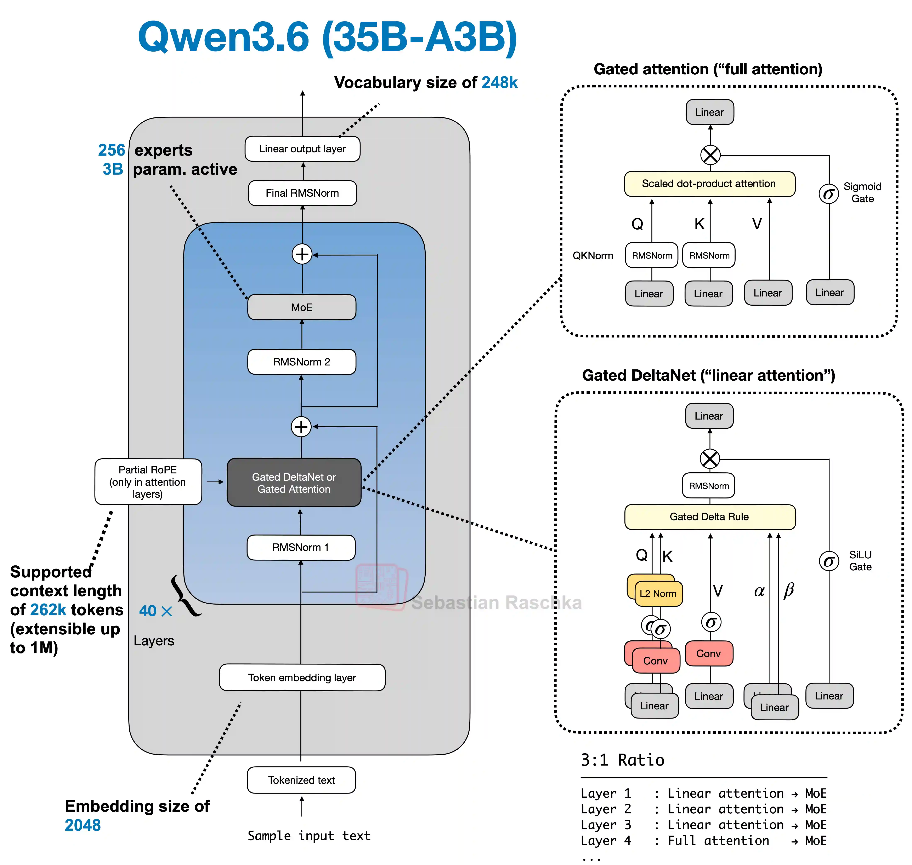

> **Summary:** Compact Qwen3.6 open-weight MoE that keeps the Qwen3.5 hybrid Gated DeltaNet/Gated Attention recipe while activating only about 3B parameters.
> **Highlight:** Uses 256 experts with 8 routed plus 1 shared expert active inside a 40-layer hybrid stack.

| Field | Value |
| --- | --- |
| Scale | 35B total, 3B active (8.6% active) |
| Context | 262,144 tokens |
| Decoder | Sparse hybrid |
| Attention | 3:1 Gated DeltaNet and Gated Attention |
| Layer mix | 10 gated attention + 30 DeltaNet |
| KV cache | 20 KiB |
| License | Apache License 2.0 |
| AAI total | 43 |

**Resources:** [config.json](https://huggingface.co/Qwen/Qwen3.6-35B-A3B/blob/main/config.json) · [License](https://huggingface.co/Qwen/Qwen3.6-35B-A3B/blob/main/LICENSE) · [Tech report](https://qwen.ai/blog?id=qwen3.6-35b-a3b)

---

### Kimi K2.6 (1T)

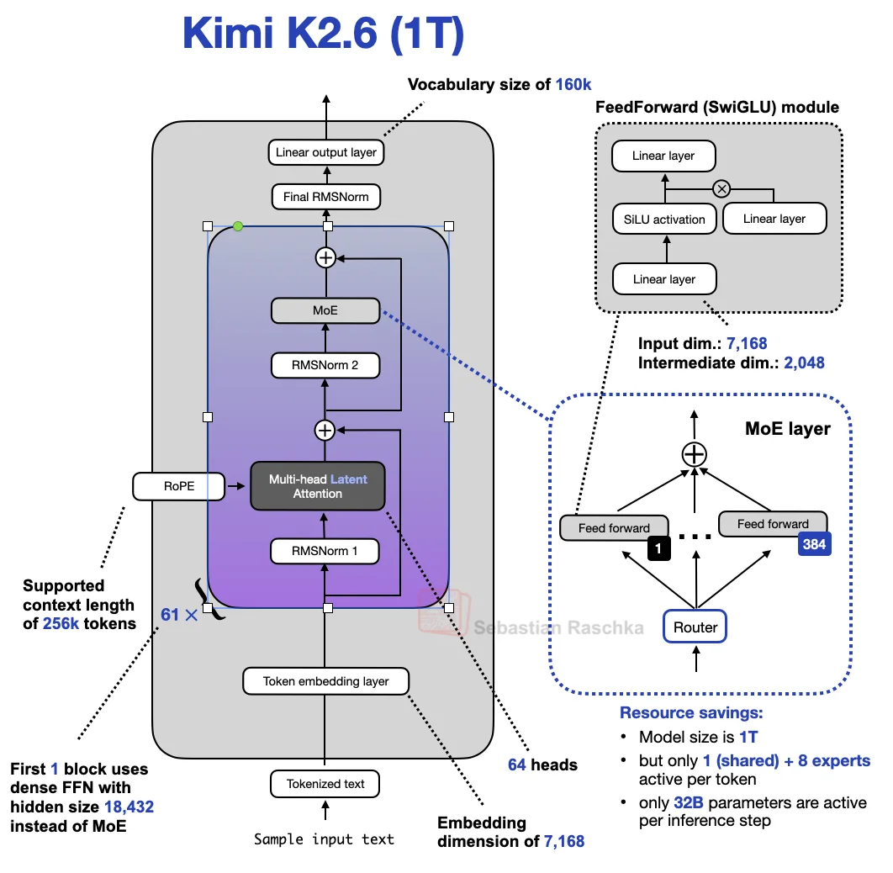

> **Summary:** Native-multimodal K2.5 successor that keeps the same 1T sparse MoE backbone while targeting stronger long-horizon coding, design, and agent orchestration.
> **Highlight:** Uses the same text architecture as Kimi K2.5, with the main change coming from the multimodal and agentic training recipe.

| Field | Value |
| --- | --- |
| Scale | 1T total, 32B active (3.2% active) |
| Context | 256,000 tokens |
| Decoder | Sparse MoE |
| Attention | MLA |
| Layer mix | 61 MLA |
| KV cache | 68.6 KiB |
| License | Modified MIT License |
| AAI total | 54 |

**Resources:** [config.json](https://huggingface.co/moonshotai/Kimi-K2.6/blob/main/config.json) · [License](https://huggingface.co/moonshotai/Kimi-K2.6/blob/main/LICENSE) · [Tech report](https://www.kimi.com/blog/kimi-k2-6.html)

---

### Qwen3.6 (27B)

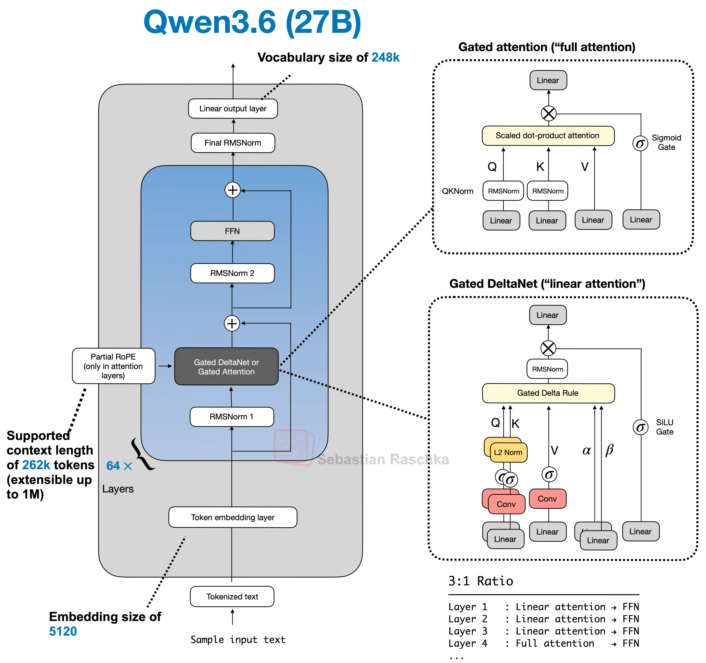

> **Summary:** Dense Qwen3.6 model that keeps the Qwen3.5-style Gated DeltaNet/Gated Attention hybrid stack while replacing MoE blocks with dense FFNs.
> **Highlight:** Uses a 64-layer dense hybrid layout with 48 DeltaNet layers and 16 full-attention layers.

| Field | Value |
| --- | --- |
| Scale | 27B parameters |
| Context | 262,144 tokens |
| Decoder | Dense hybrid |
| Attention | 3:1 Gated DeltaNet and Gated Attention |
| Layer mix | 16 gated attention + 48 DeltaNet |
| KV cache | 64 KiB |
| License | Apache License 2.0 |
| AAI total | 46 |

**Resources:** [config.json](https://huggingface.co/Qwen/Qwen3.6-27B/blob/main/config.json) · [License](https://huggingface.co/Qwen/Qwen3.6-27B/blob/main/LICENSE) · [Tech report](https://qwen.ai/blog?id=qwen3.6-27b)

---

### DeepSeek V4-Flash (284B)

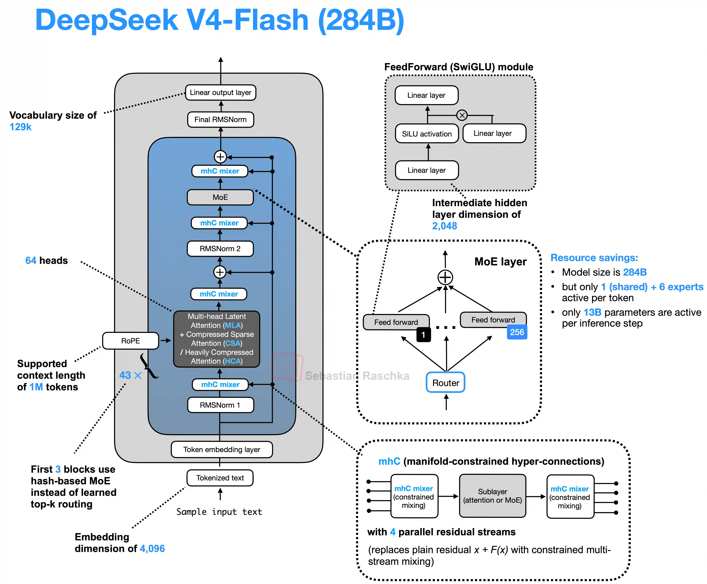

> **Summary:** DeepSeek's efficient V4 preview keeps the million-token architecture while reducing the MoE scale to 284B parameters and 13B active parameters.
> **Highlight:** Uses 256 experts, 6 routed plus 1 shared expert per token, hash-based routing in the first 3 layers, and the same compressed attention design as the larger V4-Pro.

| Field | Value |
| --- | --- |
| Scale | 284B total, 13B active (4.6% active) |
| Context | 1,048,576 tokens |
| Decoder | Sparse MoE |
| Attention | MLA-style CSA/HCA with mHC |
| Layer mix | 43 CSA/HCA |
| KV cache | 5.4 KiB |
| License | MIT License |
| AAI total | 47 |

**Resources:** [config.json](https://huggingface.co/deepseek-ai/DeepSeek-V4-Flash/blob/main/config.json) · [License](https://huggingface.co/deepseek-ai/DeepSeek-V4-Flash/blob/main/LICENSE) · [Tech report](https://huggingface.co/deepseek-ai/DeepSeek-V4-Flash/blob/main/DeepSeek_V4.pdf)

---

### DeepSeek V4-Pro (1.6T)

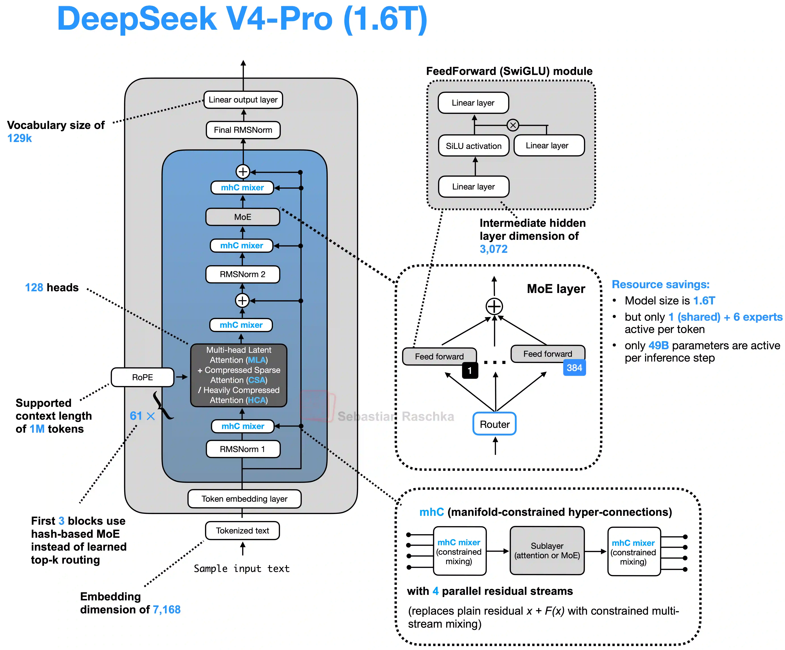

> **Summary:** DeepSeek's flagship V4 preview scales to 1.6T parameters and introduces compressed sparse attention plus manifold-constrained hyper-connections for million-token contexts.
> **Highlight:** Uses 384 experts, 6 routed plus 1 shared expert per token, hash-based routing in the first 3 layers, and compressed attention caches for long-context efficiency.

| Field | Value |
| --- | --- |
| Scale | 1.6T total, 49B active (3.1% active) |
| Context | 1,048,576 tokens |
| Decoder | Sparse MoE |
| Attention | MLA-style CSA/HCA with mHC |
| Layer mix | 61 CSA/HCA |
| KV cache | 7.7 KiB |
| License | MIT License |
| AAI total | 52 |

**Resources:** [config.json](https://huggingface.co/deepseek-ai/DeepSeek-V4-Pro/blob/main/config.json) · [License](https://huggingface.co/deepseek-ai/DeepSeek-V4-Pro/blob/main/LICENSE) · [Tech report](https://huggingface.co/deepseek-ai/DeepSeek-V4-Pro/blob/main/DeepSeek_V4.pdf)

---
