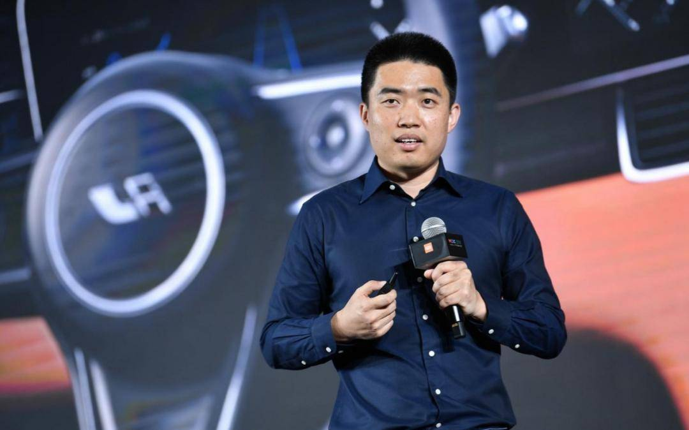

# 当面“踢馆”大众！李想“报仇”，6年不晚？

> 原文链接: https://www.sohu.com/a/1016393915_477212
> 发表于: 2026-04-29
> 李想“踢馆”上汽大众，扬言“L9领先两代”。

---
### 当面“踢馆”大众！李想“报仇”，6年不晚？

2026-04-29 20:57

25万

**雷达财经出品 文|彭程 编|孟帅**

“L9强太多了，我觉得（比上汽大众ID.ERA 9X）强了两代产品”，理想汽车CEO李想的一番“踢馆”言论，让今年的北京车展多了几分“火药味”。

面对李想的“挑衅”言论，上汽大众品牌营销事业执行总监李俊犀利“回怼”：如果非要谈“领先两代”，理想目前真正做到的只有两点：价格遥遥领先，营销水平更高。

事实上，早在6年前，理想与大众就曾结下“梁子”。2020年，大众中国CEO冯思瀚曾公开痛批增程式技术“简直是胡说八道，是最糟糕的方案”。

彼时，靠增程车起家的理想随即作出反击，李想更是向对方下“战书”，扬言大众可以拿其旗下最先进的PHEV与理想进行节能环保的对比测试。

然而，6年后的今天，大众自己却推出了ID.ERA 9X增程车型。对此，理想公关部社交媒体总监孙敏杰发声“反讽”，恭喜对方量产“过时、不环保、发展潜力不大”的技术。

值得注意的是，李想高调喊出理想L9 Livis比ID.ERA 9X领先两代言论的同时，理想汽车自身的业绩正面临一定的压力。

最新年报显示，2025年，理想汽车营收减少22.3%，净利润骤降85.8%；全年销量更是从上一年的新势力销冠位置滑落至第五名。

**李想“贴脸开大”，“踢馆”上汽大众**

4月24日，2026年北京车展开幕首日，理想汽车CEO李想离开自家展台前往上汽大众展台参观。而李想一番当众“踢馆”的言论，迅速点燃了车展现场的气氛。

在被现场媒体问及上汽大众ID.ERA 9X与理想L9 Livis对比的话题时，李想“毫不客气”地表示：“L9强太多了，我觉得强了两代产品吧”。

或许是意识到这样说有些不妥，李想立即补充道：“如果它（ID.ERA 9X）起步价在30万以内，我觉得竞争力还是非常强的”。

面对李想的“挑衅”，上汽大众品牌营销事业执行总监李俊选择“硬刚”，其在ID.ERA 9X发布会后台直接回击称，目前为止，理想只有两个东西领先大众：一是价格遥遥领先，二是营销水平更高。

李俊还同时调侃道，上汽大众绝不会宣称自己是“500万内最好的产品”。

在李俊看来，真正的代际差“必须是出现无法通过OTA升级弥补的革命性技术变革，仅靠软件的快速迭代，尚构不成跨代领先”。

李俊认为，按照这个标准，自己并未看到理想产品代际领先优势。此外，李俊还指出理想L9 Livis的“俯卧撑”演示并未成功。

而两款车的价格差异，也成为这场论战中较为直观的对比维度之一。

公开信息显示，理想L9 Livis售价为55.98万元；而上汽大众ID.ERA 9X的官方指导价是30.98万元至35.98万元，在4月25日至5月31日的限时权益期内，价格更是下探到29.98万元至34.98万元。

此外，理想L9 Livis与ID.ERA 9X在产品参数层面的较量，也呈现出胶着态势。

据悉，理想L9 Livis搭载理想自研的第三代增程系统，配备72.7kWh的电池，CLTC标准下的纯电续航为420公里，综合续航超过1500公里。

上汽大众ID.ERA 9X则搭载其最新下线的EA211“黄金增程器”，配备65.2kWh的电池（Max和Ultra版），CLTC纯电续航为406公里，综合续航达1651公里。

**隔空“口水战”，勾起6年前“恩怨”**

事实上，此次车展上的“即兴争执”，并非是理想和大众两家汽车厂商首次交锋。此前围绕增程技术路线，理想与大众的隔空论辩已持续整整6年。

天眼查显示，理想汽车成立于2015年。作为增程赛道的开创者与长期领跑者，理想汽车自成立以来，凭借对产品的精准定位、用户需求的精准拿捏，在新能源汽车市场中占据一席之地。

而早在2020年9月，大众中国CEO冯思瀚就曾在一场媒体沟通会上公开吐槽增程式技术。

冯思瀚直言，“从单车角度来看，增程式电动车具备一定的价值，但从整个国家和地球的角度来说，简直是胡说八道，是最糟糕的方案”。

在他看来，发展电动车的最终目的是减少碳排放，若仍以燃烧化石燃料发电，则完全背离了初衷。

随后，大众中国研发部门负责人威德曼也表示，增程式已是过时的技术，发展潜力不大。

尽管冯思翰和威德曼的发言并未指名道姓地针对某家车企，但放眼整个中国车市，当时走增程式技术路线并将其视为发展命脉的汽车厂商当属理想汽车。

面对同行对增程式技术并不认可的论断，靠增程车起家的理想汽车坐不住了，其掌舵者李想随即在社交媒体上隔空喊话。

李想表示，其非常愿意和大众旗下最先进的PHEV进行节能环保的对比测试，“用最真实的数字看看现实中谁更节能环保”。

随着时间的不断推移，这场技术路线之争并未就此平息。今年3月2日，上汽大众宣布其首台EA211“黄金增程器”正式下线，将率先应用于ID.ERA 9X车型，计划于3月底开启预售。

次日晚间，理想汽车公关部社交媒体总监孙敏杰（微博昵称“硬哥”）在社交平台火速“报仇”称：“6年，恭喜大众把‘过时的、非常不环保、发展潜力不大’的技术成功量产！”

同日晚间，上汽大众销售与市场执行副总经理傅强引用前述微博，并发文称，“感谢各位中国汽车人的努力，我们一起为行业进步做出贡献”。

傅强还在这条微博的评论区表示：“一切技术，最终都要服务于用户体验。产品好不好，交给市场、交给用户检验。我们，已经准备好了”。

**理想去年业绩承压，交付量下降近两成**

李想在车展上放言“理想L9 Livis领先两代”言论之际，理想的最新年报却呈现出另外一幅不容乐观的景象。

据理想汽车发布的最新财报，2025年，公司实现总收入1123亿元，较2024年的1445亿元减少22.3%。其中，车辆销售收入为1067亿元，较2024年的1385亿元减少23%。

利润方面，2025年，理想汽车的净利润为11亿元，较2024年的80亿元大幅下降85.8%。

单季度来看，去年第四季度，理想汽车实现收入288亿元，同比下降35%。同期，公司的净利润仅为0.2亿元，同比暴跌99%。

更值得警惕的是，2025年，理想汽车全年录得经营亏损5.21亿元，而2024年的经营利润高达70亿元。

其中，去年第四季度，理想汽车的单季经营亏损为4.43亿元，经营利润率为-1.5%。

毛利率方面，理想汽车的全年毛利率由2024年的20.5%下滑至去年的18.7%；车辆毛利率由2024年的19.8%下滑至去年的17.9%。

其中，去年第四季度，理想汽车的毛利率和车辆毛利率分别为17.8%、16.8%，较上年同期的20.3%、19.7%均有不同程度的下滑。

在现金流层面，理想汽车同样面临着一定的压力。2025年，公司的经营活动现金流量净额由正转负，从2024年的159亿元变为-86亿元。

业绩承压之际，理想汽车员工的年终奖也大幅缩水。据21世纪经济报道，4月10日，理想汽车向全体员工发放2025年全年年终奖，但26个销售省份的一线销售中台全员未获得年终奖，而研发员工的年终奖和去年同期相比也大幅减少。

事实上，理想汽车下滑的业绩，与其交付量的颓软表现密切相关。2025年，公司全年交付新车40.63万辆，较2024年下降18.8%。

与其他主流新势力品牌相比，理想汽车从2024年的销冠位置滑落至2025年的第五名，市场地位受到严重冲击。

对于2026年，李想透露，公司的销量目标是要实现超过20%的同比增长（销量增至超48.8万辆）。但想要完成这一目标，理想汽车仍面临不小的压力。

在2025年报中，理想汽车曾作出业绩指引：2026年第一季度，公司车辆交付量为8.5万至9万辆，同比下滑3.1%至8.5%；对应总收入为204亿至216亿元，同比减少21.3%至16.7%。

今年1月，理想汽车交付27668辆，同比减少7.5%。到了2月，公司交付26421辆汽车，虽然扭转同比下滑颓势，但仅微增0.6%。

进入3月，理想汽车的销量表现出现明显回暖，单月交付新车41053辆，同比增长11.9%。

得益于3月的销量提升，今年第一季度，理想汽车交付95142辆汽车，助推公司单季交付量实现2.5%的增长。

此外，理想汽车近来人事变动频繁。据时代周报，2025年8月以来，理想汽车已有多位核心高管离职，涵盖智驾、产品、芯片、供应链等技术核心岗位，其中包括此前引入的华为系高管邹良军、李文智。

有关理想汽车的后续发展，雷达财经将持续关注。

声明： 本文由入驻搜狐公众平台的作者撰写，除搜狐官方账号外，观点仅代表作者本人，不代表搜狐立场。

[回首页看更多汽车资讯](//auto.sohu.com)

