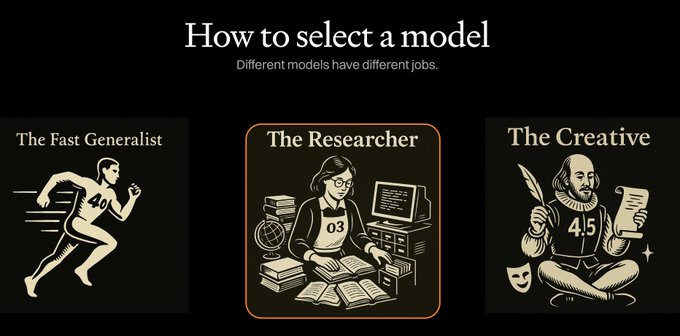

# @karpathy: An attempt to explain (current) ChatGPT versions. I still run into many, many pe…

> 原文链接: https://x.com/karpathy/status/1929597620969951434
> 作者: [Andrej Karpathy](https://x.com/karpathy)
> 发表于: 2025-06-02

---
**Andrej Karpathy** [@karpathy](https://x.com/karpathy) · [2025-06-02](https://x.com/karpathy/status/1929597620969951434)

An attempt to explain (current) ChatGPT versions.

I still run into many, many people who don't know that:
- o3 is the obvious best thing for important/hard things. It is a reasoning model that is much stronger than 4o and if you are using ChatGPT professionally and not using o3 you're ngmi.
- 4o is different from o4. Yes I know lol. 4o is a good "daily driver" for many easy-medium questions. o4 is only available as mini for now, and is not as good as o3, and I'm not super sure why it's out right now.

Example basic "router" in my own personal use:
- Any simple query (e.g. "what foods are high in fiber"?) => 4o (about ~40% of my use)
- Any hard/important enough query where I am willing to wait a bit (e.g. "help me understand this tax thing...") => o3 (about ~40% of my use)
- I am vibe coding (e.g. "change this code so that...") => 4.1 (about ~10% of my use)
- I want to deeply understand one topic - I want GPT to go off for 10 minutes, look at many, many links and summarize a topic for me. (e.g. "help me understand the rise and fall of Luminar"). => Deep Research (about ~10% of my use). Note that Deep Research is not a model version to be picked from the model picker (!!!), it is a toggle inside the Tools. Under the hood it is based on o3, but I believe is not fully equivalent of just asking o3 the same query, but I am not sure. 

All of this is only within the ChatGPT universe of models. In practice my use is more complicated because I like to bounce between all of ChatGPT, Claude, Gemini, Grok and Perplexity depending on the task and out of research interest.

## Replies / Thread context

---

**Ramez Naam** [@ramez](https://x.com/ramez) · [2025-06-02](https://x.com/karpathy/status/1929597620969951434)

Interesting! I use o4-mini a lot. I find it nearly as good as o3, and much faster.

---

**Andrej Karpathy** [@karpathy](https://x.com/karpathy) · [2025-06-02](https://x.com/karpathy/status/1929597620969951434)

Got it! I think I make the decision of whether something is important (and I'm willing to wait) or not that important (and I just want to get a fast sense) and that basically determines if I go to o3 or 4o. It's conceptually easy to just make a binary decision. I'll try it more!

---

**alex duffy** [@alxai_](https://x.com/alxai_) · [2025-06-02](https://x.com/karpathy/status/1929597620969951434)

Not as in depth but I like this visual, helps our clients internalize it

---

**Andrej Karpathy** [@karpathy](https://x.com/karpathy) · [2025-06-02](https://x.com/karpathy/status/1929597620969951434)

Like! Basically a good image summary.

---

**Mo ShaRaf (sharaf.eth)** [@MSharafH](https://x.com/MSharafH) · [2025-06-02](https://x.com/karpathy/status/1929597620969951434)

I am using them almost in the same context and scenarios, but what I liked the most is o3 very sophisticated model.
One more thing, I’ve used perplexity for deep research along with Grok, perplexity is the best in deep research especially with deep lab

---

**Andrej Karpathy** [@karpathy](https://x.com/karpathy) · [2025-06-02](https://x.com/karpathy/status/1929597620969951434)

I really like Perplexity and use it for anything "search-like", though other LLM providers now include search. It's fast and works great, and is also very useful for quick summaries of whatever trending topics there are. (I'm an investor fyi, but <3 for reals).

---

**Furkan Gözükara** [@FurkanGozukara](https://x.com/FurkanGozukara) · [2025-06-02](https://x.com/karpathy/status/1929597620969951434)

Ye but I wonder technical details of differences

---

**emily** [@emnode](https://x.com/emnode) · [2025-06-03](https://x.com/karpathy/status/1929597620969951434)

These names are not meaningful. This is like how my boomer mother names files on her laptop

---

**James Blackwell** [@jwblackwell](https://x.com/jwblackwell) · [2025-06-02](https://x.com/karpathy/status/1929597620969951434)

o4 mini is my default. Fantastic with search and doesn’t take too long
