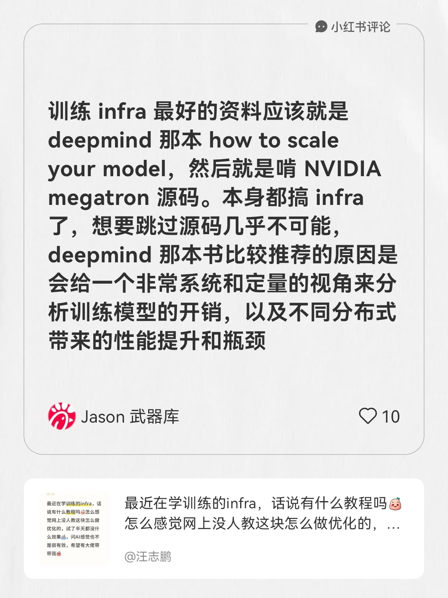

# 训练 infra 的极简入门

> 原文链接: http://xhslink.com/o/5ks0ev0sxKK
> 作者: Jason 武器库
> 互动: 421 likes · 780 collects · 12 comments

---

我在#汪志鹏的笔记[笔记]#下发布了一条评论
训练 infra 最好的资料应该就是 deepmind 那本 how to scale your model，然后就是啃 NVIDIA megatron 源码。本身都搞 infra 了，想要跳过源码几乎不可能，deepmind 那本书比较推荐的原因是会给一个非常系统和定量的视角来分析训练模型的开销，以及不同分布式带来的性能提升和瓶颈

how to scale your model https://jax-ml.github.io/scaling-book/index

**标签 / Tags:** #大模型, #aiinfra, #小红书科技AMA, #深度学习, #大模型训练, #分布式训练框架, #megatron, #gpu, #llm, #大模型训练实战

## Images

