# 训练Rollout彻底解耦

> 原文链接: https://www.xiaohongshu.com/discovery/item/69bf57f200000000230274d8?app_platform=ios&app_version=9.22.1&share_from_user_hidden=true&xsec_source=app_share&type=normal&xsec_token=CB9zXXvlLFElW-g7oE10rosHDcOG1Q443XT09xLz0XMjc=&author_share=1&xhsshare=CopyLink&shareRedId=ODk0NzdINjo2NzUyOTgwNjg2OTpFODhL&apptime=1774177469&share_id=e616c221fc25494bb1811f452f164fdc
> 作者: 🎃量子智心
> 互动: 130 likes · 199 collects · 0 comments

---

📊arXiv 20-Mar-2026 LLM相关论文(36/52) 🏠更多论文见主页/合集 🌐arXiv ID: arXiv:2603.18815 📚论文标题: ProRL Agent: Rollout-as-a-Service for RL Training of Multi-Turn LLM Agents 🔍 问题背景：现有RL训练框架将多轮Agent执行与训练栈紧密耦合，导致I/O密集型执行与GPU密集型训练相互干扰，且系统难以迁移维护，成为大规模Agent训练的瓶颈。 💡 研究动机：为提升资源利用率和系统可扩展性，研究团队提出rollout-as-a-service理念，将完整的Agent执行生命周期从训练栈中解耦，通过独立HTTP接口提供服务。 🚀 方法简介：ProRL Agent构建了三层架构：可扩展沙箱环境、异步三阶段处理的服务器，以及通过HTTP交互的训练器，实现了token级通信避免重新标记漂移，支持无根部署适应HPC环境。 📊 实验设计：在软件工程、STEM、数学和代码生成领域验证ProRL Agent，与SkyRL-v0相比，8B模型提升近2个点，且能高效横向扩展，线性提升吞吐量，展示了其通用性和可扩展性。

## Images

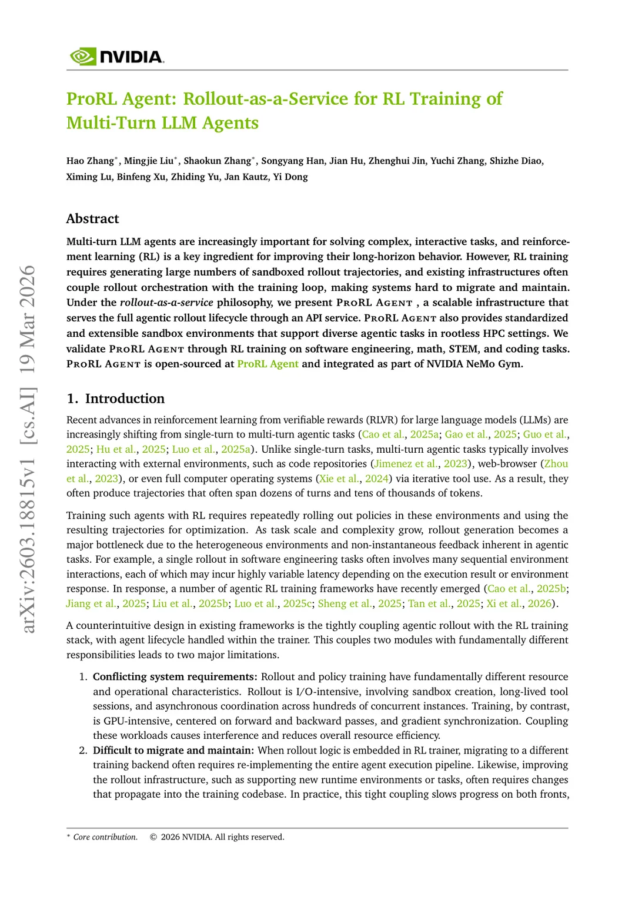
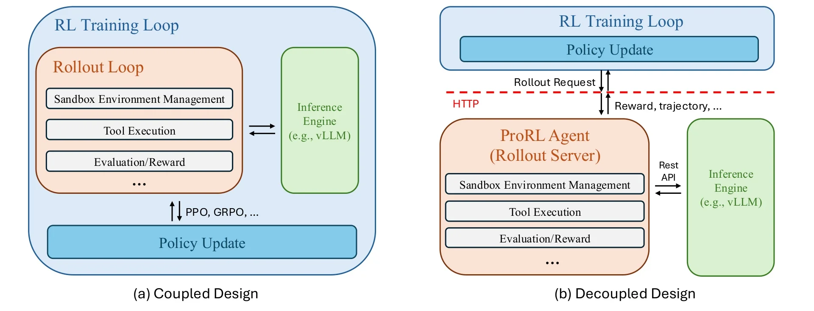
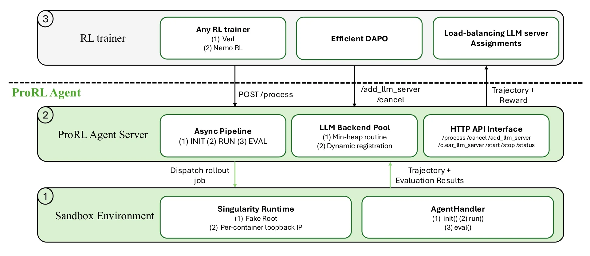
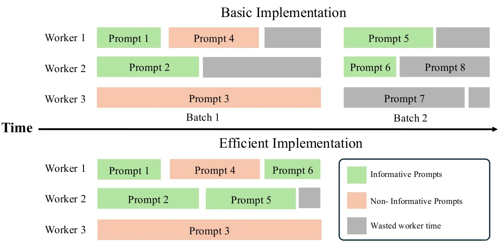
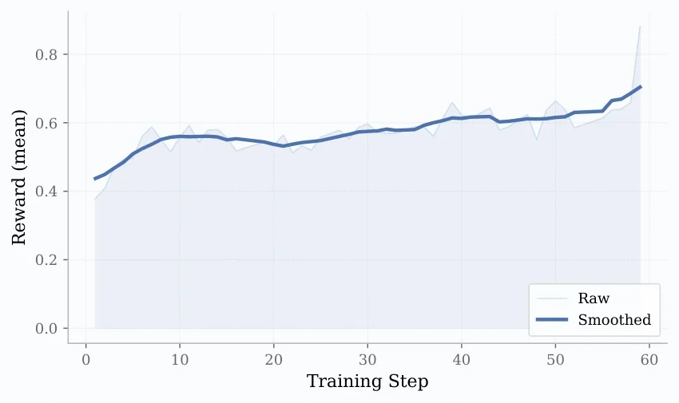
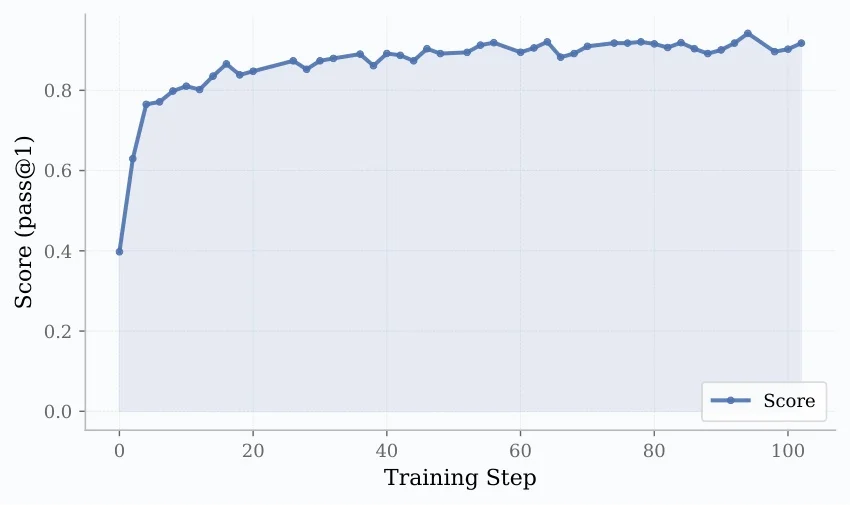
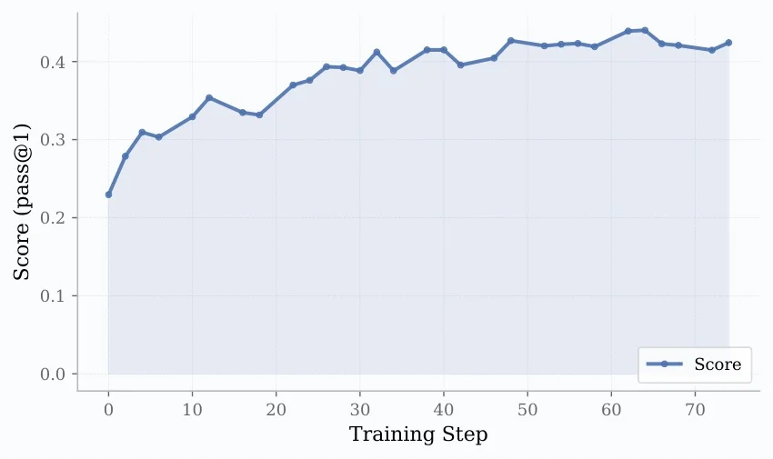
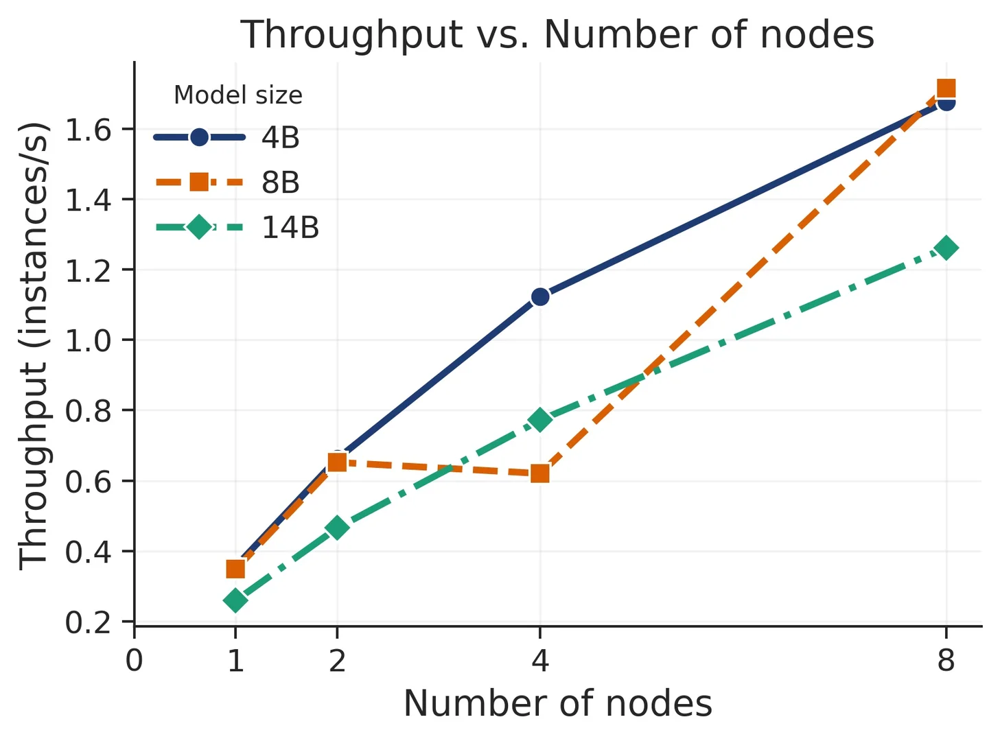
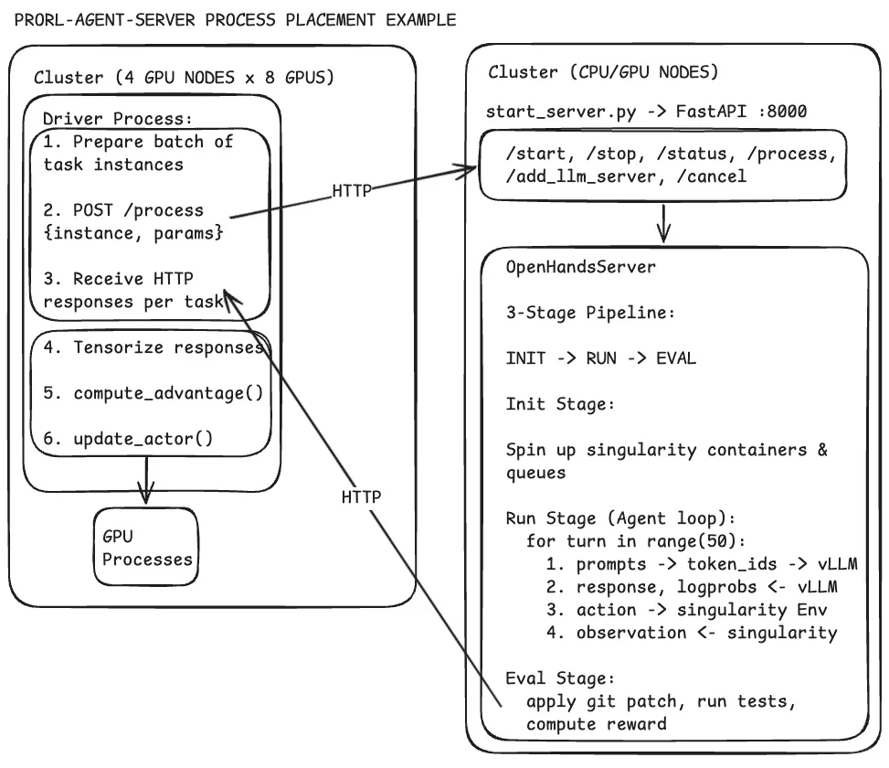
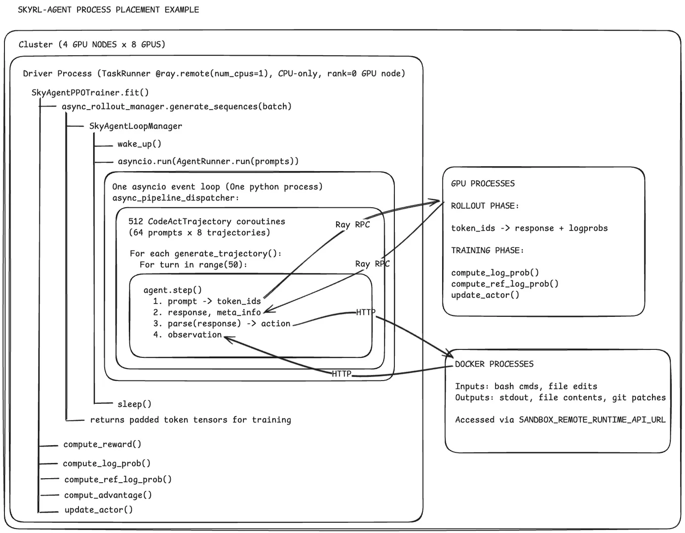
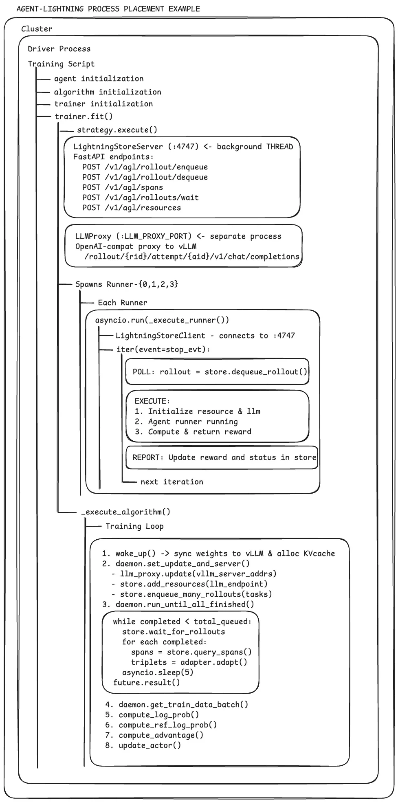
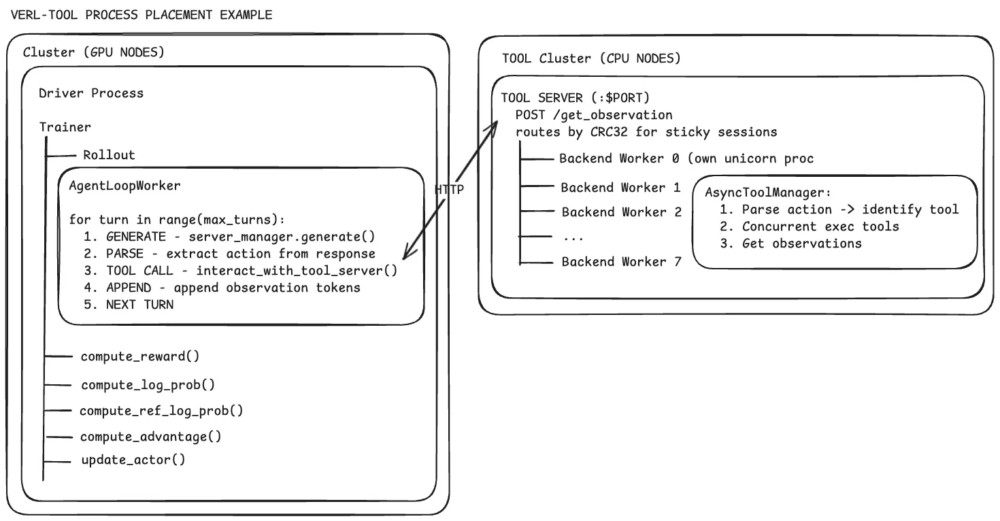
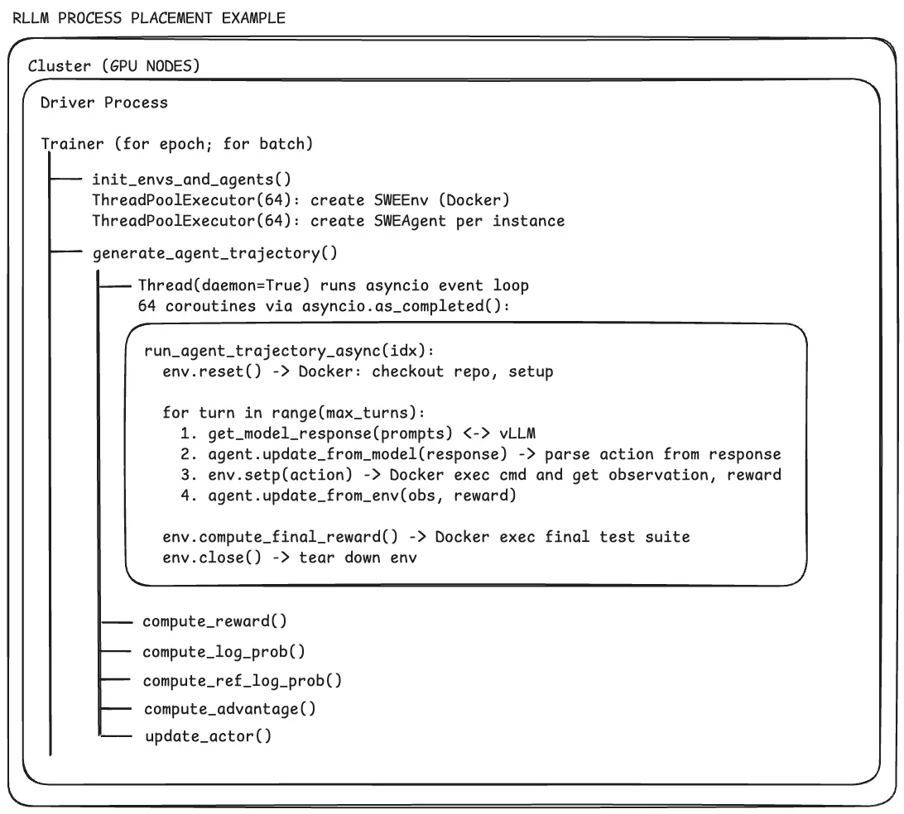
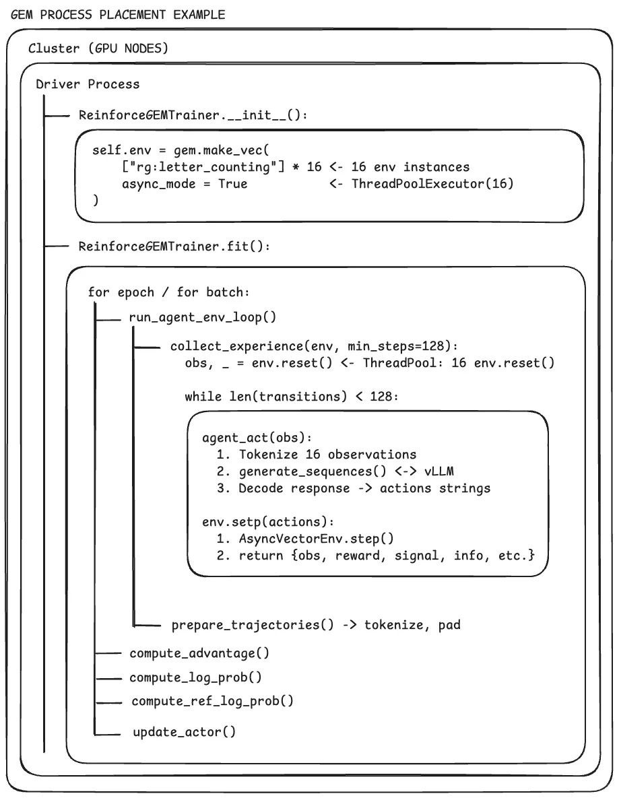
