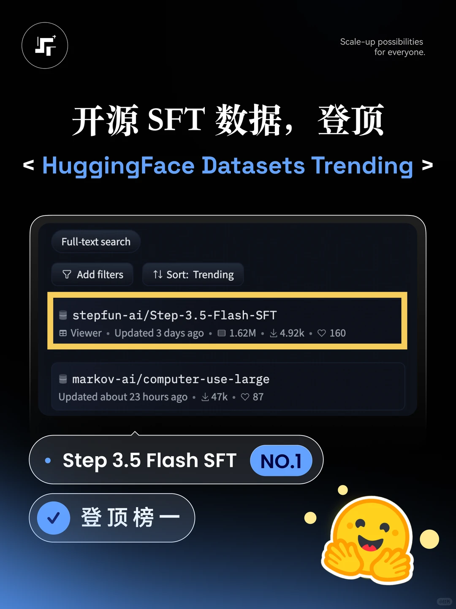
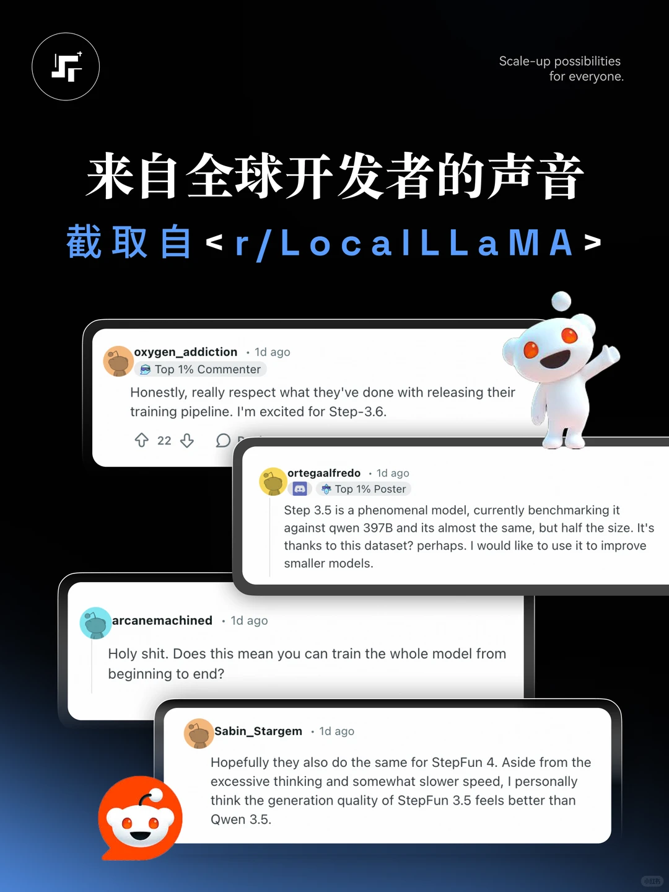

# 阶跃星辰开源全量 SFT 数据集，欢迎使用！

> 原文链接: https://www.xiaohongshu.com/discovery/item/69b8d122000000001d01a6c7?xsec_token=CBnQYqpHWeCxpsmKaCmSL9HU2UNjJM87vGlDiHpqqGPCg=&app_platform=ios
> 作者: 阶跃星辰
> 互动: 542 likes · 444 collects · 50 comments

---

17B token、全套训练代码和完整复现实验——Step 3.5 Flash SFT 数据集现已全面开源！

我们开源了数据集的完整语料配方，包含高质量多轮对话及思维链（CoT）推理过程等内容。为方便直接上手，还整理了配套的 Tokenizer、预处理后的训练分片，并适配了 SteptronOss 训练框架，可直接用于模型训练。

开源不到 24 小时，已经得到广泛关注：
📊 登顶 HuggingFace Dataset Trending 第一
💬 在 Reddit r/LocalLLaMA 社区收获一众好评

目前，Step 3.5 Flash 的以下内容已全部开源：
✅ 预训练权重
✅ 中训练权重
✅ SteptronOss 训练框架
✅ SFT 数据集

我们真诚希望这次全面开源能为全球大模型开发做出更多贡献。 数据已上线 HuggingFace，欢迎前往 StepFun 主页下载使用！

**标签 / Tags:** #阶跃星辰, #开源, #大模型, #开发者选项, #开发者社区

## Images

