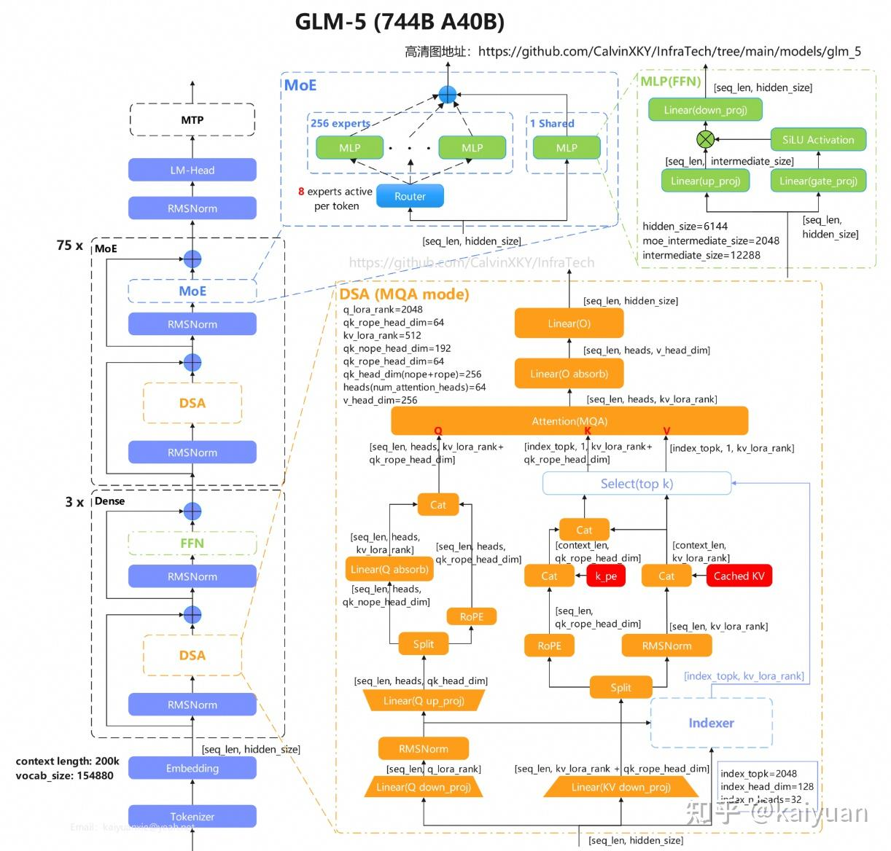
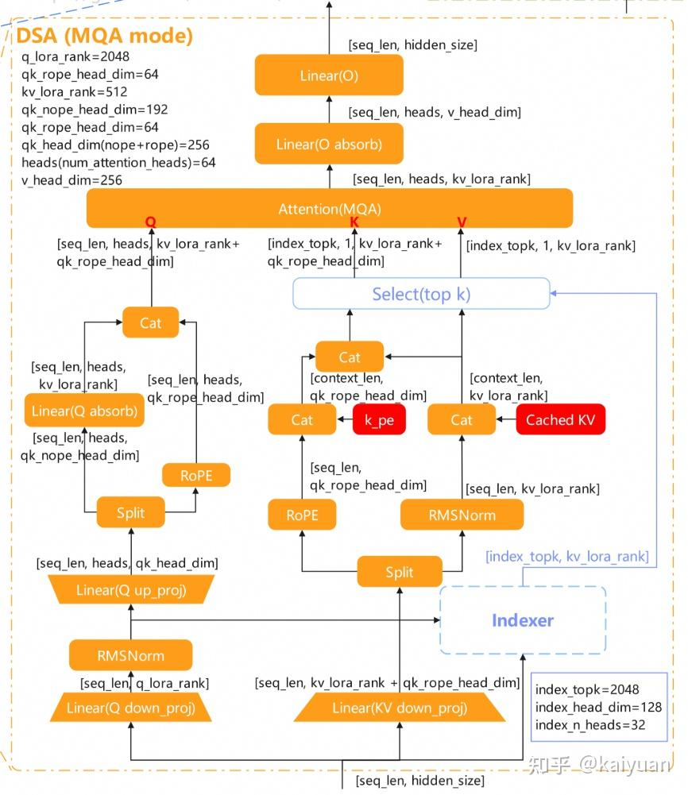
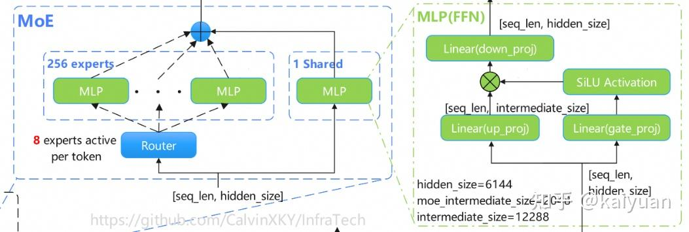
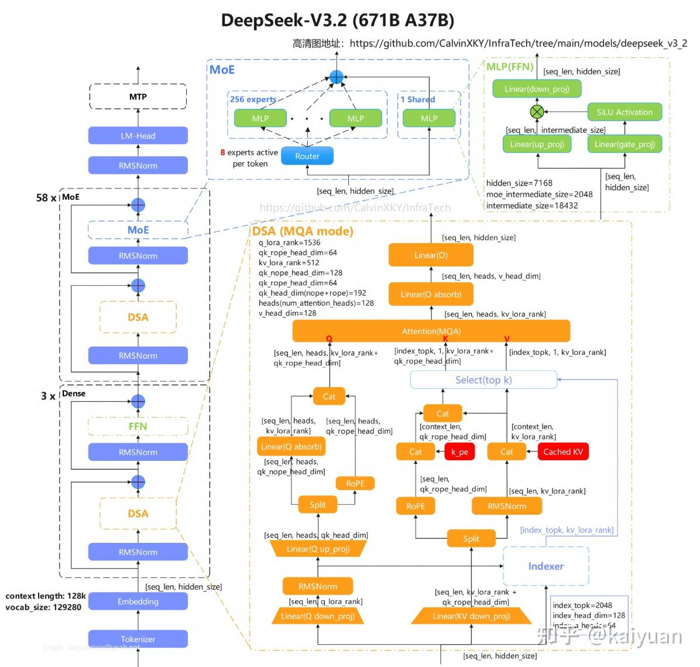
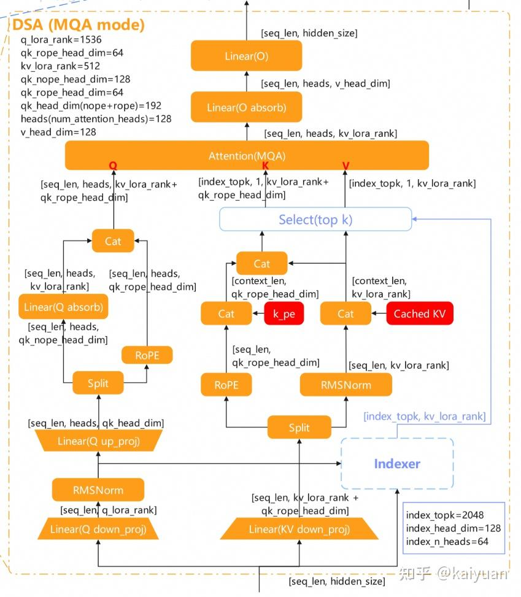
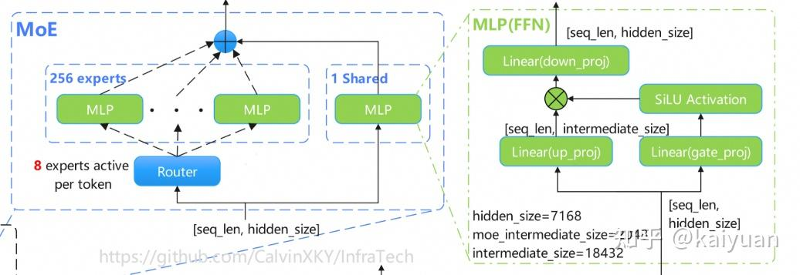

# 2026大模型架构概览（二）：GLM 5 & DSV3.2

> 作者: unknown
> 发布时间: 编辑于 2026-04-15 10:48・中国香港
> 原文链接: https://zhuanlan.zhihu.com/p/2015756101291894133?share_code=xrdsFC91avd5

---
​

目录

[上一篇](https://zhuanlan.zhihu.com/p/2013669483248633430)[[1]](#ref_1)介绍了Qwen3.5和MiniMax2.5的结构。本篇主要聚焦于采用[DSA](https://zhida.zhihu.com/search?content_id=271407567&content_type=Article&match_order=1&q=DSA&zhida_source=entity)（DeepSeek Sparse Attention）作为注意力机制的两款模型：GLM 5和[DeepSeek V3.2](https://zhida.zhihu.com/search?content_id=271407567&content_type=Article&match_order=1&q=DeepSeek+V3.2&zhida_source=entity)。GLM 5是智谱于2026年2月发布的大语言模型，采用自研的[Slime框架](https://zhida.zhihu.com/search?content_id=271407567&content_type=Article&match_order=1&q=Slime%E6%A1%86%E6%9E%B6&zhida_source=entity)进行训练。DeepSeek V3.2的实验版本于2025年9月发布，正式版则于同年12月推出，其核心工作围绕提升训练与推理的性价比展开。值得注意的是，GLM 5的架构与DeepSeek V3.2基本相同，主要区别在于参数配置。本文将重点介绍这两款模型的架构。

## 1 GLM 5

GLM 5模型是一款大语言模型（LLM）采用[MLA](https://zhida.zhihu.com/search?content_id=271407567&content_type=Article&match_order=1&q=MLA&zhida_source=entity)(DSA) + [MoE](https://zhida.zhihu.com/search?content_id=271407567&content_type=Article&match_order=1&q=MoE&zhida_source=entity)结构，总参数量为774B，推理时激活的参数为40B。 从GLM 4.x到GLM 5结构上最大变化是Attention部分从[GQA](https://zhida.zhihu.com/search?content_id=271407567&content_type=Article&match_order=1&q=GQA&zhida_source=entity)变为了DSA，与DeepSeekV3.2类似。

**效果：**在SWE-bench-Verified和Terminal Bench 2.0中分别获得77.8和56.2的开源模型分数，性能表现超过[Gemini 3.0 Pro](https://zhida.zhihu.com/search?content_id=271407567&content_type=Article&match_order=1&q=Gemini+3.0+Pro&zhida_source=entity)。

**性能：**由于采用了DSA，在保持长上下文能力的同时降低了部署成本。



> 高清图地址：https://github.com/CalvinXKY/InfraTech/tree/main/models/glm\_5

### **1.1 整体特点**

-   模型前三层使用Dense结构，后面层使用MoE结构。
-   Attention模块：

-   主体使用MLA结构
-   采用DSA进行稀疏处理

-   稀疏相关模块：

-   Lightning Indexer: 计算出每个Q值与历史的所有K/V值的关联关系(相关性)，得到一个分数排序；
-   Top-k Selector: 选出分数最高的k个K/V进行注意力计算，实现稀疏Attention。

-   支持序列长度200k

### **1.2 模型结构描述**

MLA参数配置：

```text
q_lora_rank=2048
qk_rope_head_dim=64
kv_lora_rank=512
qk_nope_head_dim=192
qk_rope_head_dim=64
qk_head_dim(nope+rope)=256
heads(num_attention_heads)=64
v_head_dim=256
```

Indexer参数配置：

```text
index_topk=2048
index_head_dim=128
index_n_heads=32
qk_rope_head_dim=64
qk_nope_head_dim=192
```



**MoE模块**

独立专家+共享专家，单token仅8个独立专家计算。



### **1.3 相关资料**

-   [整体介绍（官方博客）](https://docs.bigmodel.cn/cn/guide/models/text/glm-5)
-   [模型配置文件](https://huggingface.co/zai-org/GLM-5/blob/main/config.json)
-   [Transformer模型定义](https://github.com/huggingface/transformers/tree/main/src/transformers/models/glm_moe_dsa)

## **2 DeepSeek V3.2**

DeepSeek V3.2是一款大语言模型，其核心特点在于引入了DeepSeek Sparse Attention（DSA）机制，在V3.1-Terminus的基础上显著降低了计算复杂度。该系列首先推出了实验版本V3.2-Exp，随后发布了正式版本V3.2和V3.2-Speciale。模型总参数量为671B，推理时仅激活37B参数。

**效果：**DeepSeek-V3.2-Speciale超越了GPT-5，并表现出与Gemini-3.0-Pro相当的推理能力。
**性能：**在保持几乎相同的模型输出质量的同时，大幅提高了长上下文训练和推理效率。

### **2.1 整体特点**

-   Attention 模块：

-   DSA：在MLA的基础上增加了Indexer模块，用于控制KV值中参与计算的tokens数量。
-   Decode阶段，tokens数量限定在2k以内，因此MLA的计算量与context长度无关。
-   支持上下文长度：128K。



> 高清图地址：https://github.com/CalvinXKY/InfraTech/tree/main/models/deepseek\_v3\_2

### **2.2 模型结构描述**

MLA参数配置：

```text
q_lora_rank=2048
qk_rope_head_dim=64
kv_lora_rank=512
qk_nope_head_dim=192
qk_rope_head_dim=64
qk_head_dim(nope+rope)=256
heads(num_attention_heads)=64
v_head_dim=256
```

Indexer参数配置：

```text
index_topk=2048
index_head_dim=128
index_n_heads=32
qk_rope_head_dim=64
qk_nope_head_dim=192
```



**MoE模块**

独立专家+共享专家，单token仅8个独立专家计算。



### **2.3 相关资料**

-   [整体介绍（官方博客）](https://github.com/deepseek-ai/DeepSeek-V3.2-Exp/blob/main/DeepSeek_V3_2.pdf)
-   [模型配置文件](https://huggingface.co/deepseek-ai/DeepSeek-V3.2/blob/main/config.json)
-   [模型定义示例](https://huggingface.co/deepseek-ai/DeepSeek-V3.2/tree/main/inference)

模型相关的内容跳转至：[https://github.com/CalvinXKY/InfraTech/tree/main/models/](https://github.com/CalvinXKY/InfraTech/tree/main/models/)

上一篇：

* * *

> 想深耕AI Infra领域？欢迎访问[InfraTech](https://github.com/CalvinXKY/InfraTech)库！内容涵盖大模型基础、PyTorch/vLLM/SGLang框架入门、性能加速等核心方向，配套[50+知识干货](https://github.com/CalvinXKY/InfraTech)及适合初学者的[notebook](https://github.com/CalvinXKY/InfraTech)练习。

**文中不足之处**[@kaiyuan](https://www.zhihu.com/people/da4e6b50eb50d6f120b604f6cf15b33e)

## 参考

1.  [^](#ref_1_0)[https://zhuanlan.zhihu.com/p/2013669483248633430](https://zhuanlan.zhihu.com/p/2013669483248633430)
